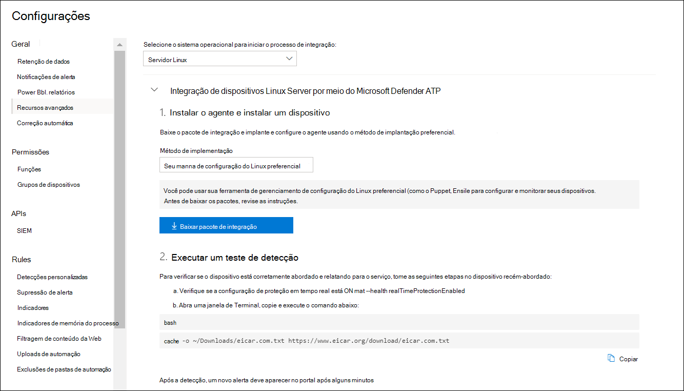

# <a name="deploy-microsoft-defender-for-endpoint-on-linux-with-ansible"></a>Implantar o Microsoft Defender para Ponto de Extremidade no Linux com Ansible

[!INCLUDE [Microsoft 365 Defender rebranding](../../includes/microsoft-defender.md)]


**Aplica-se a:**
- [Microsoft Defender para Ponto de Extremidade](https://go.microsoft.com/fwlink/p/?linkid=2154037)
- [Microsoft 365 Defender](https://go.microsoft.com/fwlink/?linkid=2118804)

> Deseja experimentar o Defender para Ponto de Extremidade? [Inscreva-se para uma avaliação gratuita.](https://www.microsoft.com/microsoft-365/windows/microsoft-defender-atp?ocid=docs-wdatp-investigateip-abovefoldlink)

Este artigo descreve como implantar o Defender para Ponto de Extremidade no Linux usando Ansible. Uma implantação bem-sucedida requer a conclusão de todas as seguintes tarefas:

- [Baixar o pacote de integração](#download-the-onboarding-package)
- [Criar arquivos YAML ansible](#create-ansible-yaml-files)
- [Implantação](#deployment)
- [References](#references)

## <a name="prerequisites-and-system-requirements"></a>Pré-requisitos e requisitos do sistema

Antes de começar, consulte a página [principal do Defender para Ponto](microsoft-defender-endpoint-linux.md) de Extremidade no Linux para obter uma descrição dos pré-requisitos e dos requisitos do sistema para a versão de software atual.

Além disso, para a implantação ansible, você precisa estar familiarizado com tarefas de administração Ansible, ter Ansible configurado e saber como implantar playbooks e tarefas. Ansible tem muitas maneiras de concluir a mesma tarefa. Essas instruções pressuem disponibilidade de módulos Ansible com suporte, como *apt* e *unarchive* para ajudar a implantar o pacote. Sua organização pode usar um fluxo de trabalho diferente. Consulte a [documentação Ansible para](https://docs.ansible.com/) obter detalhes.

- Ansible precisa ser instalado em pelo menos um computador (Ansible chama esse nó de controle).
- O SSH deve ser configurado para uma conta de administrador entre o nó de controle e todos os nós gerenciados (dispositivos que terão o Defender para Ponto de Extremidade instalado neles) e é recomendável ser configurado com autenticação de chave pública.
- O software a seguir deve ser instalado em todos os nós gerenciados:
  - cache
  - python-apt

- Todos os nós gerenciados devem estar listados no seguinte formato no `/etc/ansible/hosts` arquivo ou relevante:

    ```bash
    [servers]
    host1 ansible_ssh_host=10.171.134.39
    host2 ansible_ssh_host=51.143.50.51
    ```

- Teste de ping:

    ```bash
    ansible -m ping all
    ```

## <a name="download-the-onboarding-package"></a>Baixar o pacote de integração

Baixe o pacote de integração Central de Segurança do Microsoft Defender:

1. Em Central de Segurança do Microsoft Defender, vá para Configurações > Gerenciamento de **Dispositivos > Integração**.
2. No primeiro menu suspenso, selecione **Servidor Linux como** o sistema operacional. No segundo menu suspenso, selecione Sua ferramenta de gerenciamento de configuração **do Linux preferencial** como o método de implantação.
3. Selecione **Baixar pacote de integração**. Salve o arquivo como WindowsDefenderATPOnboardingPackage.zip.

    

4. Em um prompt de comando, verifique se você tem o arquivo. Extraia o conteúdo do arquivo morto:

    ```bash
    ls -l
    ```
    ```Output
    total 8
    -rw-r--r-- 1 test  staff  4984 Feb 18 11:22 WindowsDefenderATPOnboardingPackage.zip
    ```
    ```bash
    unzip WindowsDefenderATPOnboardingPackage.zip
    ```
    ```Output
    Archive:  WindowsDefenderATPOnboardingPackage.zip
    inflating: mdatp_onboard.json
    ```

## <a name="create-ansible-yaml-files"></a>Criar arquivos YAML ansible

Crie uma subtarefa ou arquivos de função que contribuam para uma playbook ou tarefa.

- Crie a tarefa de integração, `onboarding_setup.yml` :

    ```bash
    - name: Create MDATP directories
      file:
        path: /etc/opt/microsoft/mdatp/
        recurse: true
        state: directory
        mode: 0755
        owner: root
        group: root

    - name: Register mdatp_onboard.json
      stat:
        path: /etc/opt/microsoft/mdatp/mdatp_onboard.json
      register: mdatp_onboard

    - name: Extract WindowsDefenderATPOnboardingPackage.zip into /etc/opt/microsoft/mdatp
      unarchive:
        src: WindowsDefenderATPOnboardingPackage.zip
        dest: /etc/opt/microsoft/mdatp
        mode: 0600
        owner: root
        group: root
      when: not mdatp_onboard.stat.exists
    ```

- Adicione o repositório do Defender para Ponto de Extremidade e a chave.

    O Defender para Ponto de Extremidade no Linux pode ser implantado de um dos seguintes canais (denotado abaixo como *[canal]*): *insiders-fast,* *insiders-slow* ou *prod*. Cada um desses canais corresponde a um repositório de software Linux.

    A escolha do canal determina o tipo e a frequência de atualizações oferecidas ao seu dispositivo. Os *dispositivos em insiders-fast* são os primeiros a receber atualizações e novos recursos, seguidos posteriormente por *insiders-slow* e por *último por prod*.

    Para visualizar novos recursos e fornecer comentários antecipados, é recomendável configurar alguns dispositivos em sua empresa para usar *insiders-fast* ou *insiders-slow*.

    > [!WARNING]
    > Alternar o canal após a instalação inicial exige que o produto seja reinstalado. Para alternar o canal do produto: desinstale o pacote existente, configure novamente seu dispositivo para usar o novo canal e siga as etapas deste documento para instalar o pacote no novo local.

    Observe sua distribuição e versão e identifique a entrada mais próxima para ela em `https://packages.microsoft.com/config/` .

    Nos comandos a seguir, substitua *[distro]* e *[version]* pela informação que você identificou.

    > [!NOTE]
    > No caso do Oracle Linux, substitua *[distro]* por "remos".

  ```bash
  - name: Add Microsoft APT key
    apt_key:
      keyserver: https://packages.microsoft.com/
      id: BC528686B50D79E339D3721CEB3E94ADBE1229CF
    when: ansible_os_family == "Debian"

  - name: Add Microsoft apt repository for MDATP
    apt_repository:
      repo: deb [arch=arm64,armhf,amd64] https://packages.microsoft.com/[distro]/[version]/prod [channel] main
      update_cache: yes
      state: present
      filename: microsoft-[channel].list
    when: ansible_os_family == "Debian"

  - name: Add Microsoft DNF/YUM key
    rpm_key:
      state: present
      key: https://packages.microsoft.com/keys/microsoft.asc
    when: ansible_os_family == "RedHat"

  - name: Add  Microsoft yum repository for MDATP
    yum_repository:
      name: packages-microsoft-com-prod-[channel]
      description: Microsoft Defender for Endpoint
      file: microsoft-[channel]
      baseurl: https://packages.microsoft.com/[distro]/[version]/[channel]/
      gpgcheck: yes
      enabled: Yes
    when: ansible_os_family == "RedHat"
  ```

- Crie os arquivos YAML de instalação e desinstalação ansible.

    - Para distribuições baseadas em apt, use o seguinte arquivo YAML:

        ```bash
        cat install_mdatp.yml
        ```
        ```Output
        - hosts: servers
          tasks:
            - include: ../roles/onboarding_setup.yml
            - include: ../roles/add_apt_repo.yml
            - name: Install MDATP
              apt:
                name: mdatp
                state: latest
                update_cache: yes
        ```

        ```bash
        cat uninstall_mdatp.yml
        ```
        ```Output
        - hosts: servers
          tasks:
            - name: Uninstall MDATP
              apt:
                name: mdatp
                state: absent
        ```

    - Para distribuições baseadas em dnf, use o seguinte arquivo YAML:

        ```bash
        cat install_mdatp_dnf.yml
        ```
        ```Output
        - hosts: servers
          tasks:
            - include: ../roles/onboarding_setup.yml
            - include: ../roles/add_yum_repo.yml
            - name: Install MDATP
              dnf:
                name: mdatp
                state: latest
                enablerepo: packages-microsoft-com-prod-[channel]
        ```

        ```bash
        cat uninstall_mdatp_dnf.yml
        ```
        ```Output
        - hosts: servers
          tasks:
            - name: Uninstall MDATP
              dnf:
                name: mdatp
                state: absent
        ```

## <a name="deployment"></a>Implantação

Agora execute os arquivos de tarefas em `/etc/ansible/playbooks/` ou diretório relevante.

- Instalação:

    ```bash
    ansible-playbook /etc/ansible/playbooks/install_mdatp.yml -i /etc/ansible/hosts
    ```

> [!IMPORTANT]
> Quando o produto é iniciado pela primeira vez, ele baixa as definições antimalware mais recentes. Dependendo da conexão com a Internet, isso pode levar até alguns minutos.

- Validação/configuração:

    ```bash
    ansible -m shell -a 'mdatp connectivity test' all
    ```
    ```bash
    ansible -m shell -a 'mdatp health' all
    ```

- Desinstalação:

    ```bash
    ansible-playbook /etc/ansible/playbooks/uninstall_mdatp.yml -i /etc/ansible/hosts
    ```

## <a name="log-installation-issues"></a>Problemas de instalação de log

Consulte [Log installation issues](linux-resources.md#log-installation-issues) for more information on how to find the automatically generated log that is created by the installer when an error occurs.

## <a name="operating-system-upgrades"></a>Atualizações do sistema operacional

Ao atualizar o sistema operacional para uma nova versão principal, primeiro você deve desinstalar o Defender para o Ponto de Extremidade no Linux, instalar a atualização e, finalmente, reconfigurar o Defender para Ponto de Extremidade no Linux em seu dispositivo.

## <a name="references"></a>Referências

- [Adicionar ou remover repositórios YUM](https://docs.ansible.com/ansible/latest/collections/ansible/builtin/yum_repository_module.html)

- [Gerenciar pacotes com o gerenciador de pacotes dnf](https://docs.ansible.com/ansible/latest/collections/ansible/builtin/dnf_module.html)

- [Adicionar e remover repositórios APT](https://docs.ansible.com/ansible/latest/collections/ansible/builtin/apt_repository_module.html)

- [Gerenciar pacotes de apt](https://docs.ansible.com/ansible/latest/collections/ansible/builtin/apt_module.html)

## <a name="see-also"></a>Confira também
- [Investigar problemas de saúde do agente](health-status.md)