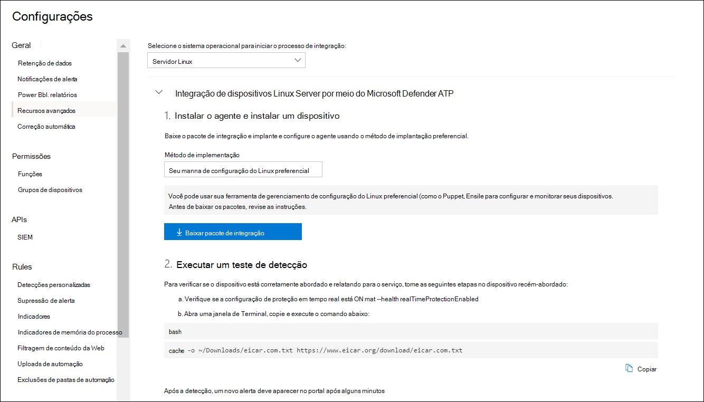

# <a name="deploy-microsoft-defender-for-endpoint-on-linux-with-puppet"></a>Implantar o Microsoft Defender para Ponto de Extremidade no Linux com o Puppet

[!INCLUDE [Microsoft 365 Defender rebranding](../../includes/microsoft-defender.md)]


**Aplica-se a:**
- [Microsoft Defender para Ponto de Extremidade](https://go.microsoft.com/fwlink/p/?linkid=2154037)
- [Microsoft 365 Defender](https://go.microsoft.com/fwlink/?linkid=2118804)

> Deseja experimentar o Defender para Ponto de Extremidade? [Inscreva-se para uma avaliação gratuita.](https://www.microsoft.com/microsoft-365/windows/microsoft-defender-atp?ocid=docs-wdatp-investigateip-abovefoldlink)

Este artigo descreve como implantar o Defender para Endpoint para Linux usando o Puppet. Uma implantação bem-sucedida requer a conclusão de todas as seguintes tarefas:

- [Baixar o pacote de integração](#download-the-onboarding-package)
- [Criar manifesto do Puppet](#create-a-puppet-manifest)
- [Implantação](#deployment)
- [Verificar o status de integração](#check-onboarding-status)

## <a name="prerequisites-and-system-requirements"></a>Pré-requisitos e requisitos do sistema

 Para ver uma descrição dos pré-requisitos e dos requisitos do sistema para a versão de software atual, consulte a página principal do Defender para Ponto de [Extremidade para Linux.](microsoft-defender-endpoint-linux.md)

Além disso, para a implantação do Puppet, você precisa estar familiarizado com as tarefas de administração do Puppet, ter o Puppet configurado e saber como implantar pacotes. O Puppet tem muitas maneiras de concluir a mesma tarefa. Essas instruções pressupram a disponibilidade de módulos de Puppet com suporte, como *apt para* ajudar a implantar o pacote. Sua organização pode usar um fluxo de trabalho diferente. Consulte a [documentação do Puppet](https://puppet.com/docs) para obter detalhes.

## <a name="download-the-onboarding-package"></a>Baixar o pacote de integração

Baixe o pacote de integração do Centro de Segurança do Microsoft Defender:

1. No Centro de Segurança do Microsoft Defender, acesse **Configurações > Gerenciamento de Dispositivos > Integração**.
2. No primeiro menu suspenso, selecione **Servidor Linux como** o sistema operacional. No segundo menu suspenso, selecione Sua ferramenta de gerenciamento de configuração **do Linux preferencial** como o método de implantação.
3. Selecione **Baixar pacote de integração**. Salve o arquivo como WindowsDefenderATPOnboardingPackage.zip.

    

4. Em um prompt de comando, verifique se você tem o arquivo. 

    ```bash
    ls -l
    ```
    ```Output
    total 8
    -rw-r--r-- 1 test  staff  4984 Feb 18 11:22 WindowsDefenderATPOnboardingPackage.zip
    ```
5. Extraia o conteúdo do arquivo morto.
    ```bash
    unzip WindowsDefenderATPOnboardingPackage.zip
    ```
    ```Output
    Archive:  WindowsDefenderATPOnboardingPackage.zip
    inflating: mdatp_onboard.json
    ```

## <a name="create-a-puppet-manifest"></a>Criar um manifesto do Puppet

Você precisa criar um manifesto do Puppet para implantar o Defender para Ponto de Extremidade para Linux em dispositivos gerenciados por um servidor Desarmado. Este exemplo usa os módulos *apt* e *yumrepo* disponíveis a partir de placas de marionetes e pressupo que os módulos foram instalados em seu servidor Dep. de fantoches.

Crie as pastas *install_mdatp/arquivos e* *install_mdatp/manifestos* na pasta módulos de sua instalação do Puppet. Essa pasta normalmente está localizada em */etc/puppetlabs/code/environments/production/modules* no servidor Desemterado. Copie o mdatp_onboard.jsno arquivo criado acima para a pasta *install_mdatp/arquivos.* Criar *um init.pp* que contém as instruções de implantação:

```bash
pwd
```
```Output
/etc/puppetlabs/code/environments/production/modules
```

```bash
tree install_mdatp
```
```Output
install_mdatp
├── files
│   └── mdatp_onboard.json
└── manifests
    └── init.pp
```

### <a name="contents-of-install_mdatpmanifestsinitpp"></a>Conteúdo de `install_mdatp/manifests/init.pp`

O Defender para Ponto de Extremidade para Linux pode ser implantado de um dos seguintes canais (denotado abaixo como *[canal]*): *insiders-fast,* *insiders-slow* ou *prod*. Cada um desses canais corresponde a um repositório de software Linux.

A escolha do canal determina o tipo e a frequência de atualizações oferecidas ao seu dispositivo. Os *dispositivos em insiders-fast* são os primeiros a receber atualizações e novos recursos, seguidos posteriormente por *insiders-slow* e por *último por prod*.

Para visualizar novos recursos e fornecer comentários antecipados, é recomendável configurar alguns dispositivos em sua empresa para usar *insiders-fast* ou *insiders-slow*.

> [!WARNING]
> Alternar o canal após a instalação inicial exige que o produto seja reinstalado. Para alternar o canal do produto: desinstale o pacote existente, configure novamente seu dispositivo para usar o novo canal e siga as etapas deste documento para instalar o pacote no novo local.

Observe sua distribuição e versão e identifique a entrada mais próxima para ela em `https://packages.microsoft.com/config/` .

Nos comandos a seguir, substitua *[distro]* e *[versão]* pela informação que você identificou:

> [!NOTE]
> No caso de RedHat, Oracle EL e CentOS 8, substitua *[distro]* por 'rel'.

```puppet
# Puppet manifest to install Microsoft Defender for Endpoint on Linux.
# @param channel The release channel based on your environment, insider-fast or prod.
# @param distro The Linux distribution in lowercase. In case of RedHat, Oracle EL, and CentOS 8, the distro variable should be 'rhel'.
# @param version The Linux distribution release number, e.g. 7.4.

class install_mdatp (
$channel = 'insiders-fast',
$distro = undef,
$version = undef
){
    case $::osfamily {
        'Debian' : {
            apt::source { 'microsoftpackages' :
                location => "https://packages.microsoft.com/${distro}/${version}/prod",
                release  => $channel,
                repos    => 'main',
                key      => {
                    'id'     => 'BC528686B50D79E339D3721CEB3E94ADBE1229CF',
                    'server' => 'keyserver.ubuntu.com',
                },
            }
        }
        'RedHat' : {
            yumrepo { 'microsoftpackages' :
                baseurl  => "https://packages.microsoft.com/${distro}/${version}/${channel}",
                descr    => "packages-microsoft-com-prod-${channel}",
                enabled  => 1,
                gpgcheck => 1,
                gpgkey   => 'https://packages.microsoft.com/keys/microsoft.asc'
            }
        }
        default : { fail("${::osfamily} is currently not supported.") }
    }

    case $::osfamily {
        /(Debian|RedHat)/: {
            file { ['/etc/opt', '/etc/opt/microsoft', '/etc/opt/microsoft/mdatp']:
                ensure => directory,
                owner  => root,
                group  => root,
                mode   => '0755'
            }

            file { '/etc/opt/microsoft/mdatp/mdatp_onboard.json':
                source  => 'puppet:///modules/install_mdatp/mdatp_onboard.json',
                owner   => root,
                group   => root,
                mode    => '0600',
                require => File['/etc/opt/microsoft/mdatp']
            }

            package { 'mdatp':
                ensure  => 'installed',
                require => File['/etc/opt/microsoft/mdatp/mdatp_onboard.json']
            }
        }
        default : { fail("${::osfamily} is currently not supported.") }
    }
}
```

## <a name="deployment"></a>Implantação

Incluir o manifesto acima em seu site.pp file:

```bash
cat /etc/puppetlabs/code/environments/production/manifests/site.pp
```
```Output
node "default" {
    include install_mdatp
}
```

Os dispositivos de agente inscritos sondam periodicamente o Servidor de Marionetes e instalam novos perfis de configuração e políticas assim que são detectados.

## <a name="monitor-puppet-deployment"></a>Monitorar a implantação do Puppet

No dispositivo agente, você também pode verificar o status de integração executando:

```bash
mdatp health
```
```Output
...
licensed                                : true
org_id                                  : "[your organization identifier]"
...
```

- **licenciado**: isso confirma se o dispositivo está vinculado à sua organização.

- **orgId**: este é o identificador da organização do Defender for Endpoint.

## <a name="check-onboarding-status"></a>Verificar o status de integração

Você pode verificar se os dispositivos foram corretamente integrados criando um script. Por exemplo, o script a seguir verifica os dispositivos inscritos para o status de integração:

```bash
mdatp health --field healthy
```

O comando acima `1` imprime se o produto está onboarded e funcionando conforme esperado.

> [!IMPORTANT]
> Quando o produto é iniciado pela primeira vez, ele baixa as definições antimalware mais recentes. Dependendo da conexão com a Internet, isso pode levar até alguns minutos. Durante esse tempo, o comando acima retorna um valor de `0` .

Se o produto não estiver saudável, o código de saída (que pode ser verificado `echo $?` por ) indica o problema:

- 1 se o dispositivo ainda não estiver conectado.
- 3 se a conexão com o daemon não puder ser estabelecida.

## <a name="log-installation-issues"></a>Problemas de instalação de log

 Para obter mais informações sobre como encontrar o log gerado automaticamente que é criado pelo instalador quando ocorre um [erro,](linux-resources.md#log-installation-issues)consulte Log installation issues .

## <a name="operating-system-upgrades"></a>Atualizações do sistema operacional

Ao atualizar seu sistema operacional para uma nova versão principal, primeiro você deve desinstalar o Defender para o Ponto de Extremidade para Linux, instalar a atualização e, finalmente, reconfigurar o Defender para Ponto de Extremidade para Linux em seu dispositivo.

## <a name="uninstallation"></a>Desinstalação

Criar um módulo *remove_mdatp* semelhante *ao install_mdatp* com o seguinte conteúdo em *init.pp* file:

```bash
class remove_mdatp {
    package { 'mdatp':
        ensure => 'purged',
    }
}
```
