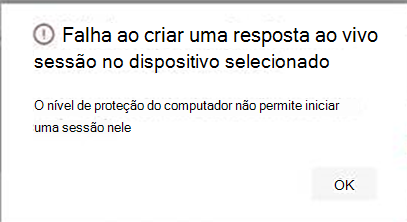

# <a name="investigate-entities-on-devices-using-live-response"></a>Investigar entidades em dispositivos usando a resposta ao vivo

[!INCLUDE [Microsoft 365 Defender rebranding](../../includes/microsoft-defender.md)]

**Aplica-se a:**
- [Microsoft Defender para Ponto de Extremidade](https://go.microsoft.com/fwlink/p/?linkid=2146631)
- [Microsoft 365 Defender](https://go.microsoft.com/fwlink/?linkid=2118804)


> Deseja experimentar o Defender para Ponto de Extremidade? [Inscreva-se para uma avaliação gratuita.](https://www.microsoft.com/microsoft-365/windows/microsoft-defender-atp?ocid=docs-wdatp-investigateip-abovefoldlink)

A resposta ao vivo dá às equipes de operações de segurança acesso instantâneo a um dispositivo (também chamado de máquina) usando uma conexão de shell remoto. Isso permite que você faça um trabalho de investigação aprofundado e tome ações de resposta imediatas para conter prontamente ameaças identificadas em tempo real. 

A resposta ao vivo foi projetada para aprimorar as investigações, permitindo que sua equipe de operações de segurança colete dados forenses, execute scripts, envie entidades suspeitas para análise, correção de ameaças e busca proativamente por ameaças emergentes.<br/><br/>

> [!VIDEO https://www.microsoft.com/videoplayer/embed/RE4qLUW]

Com a resposta ao vivo, os analistas podem realizar todas as seguintes tarefas:
- Execute comandos básicos e avançados para fazer um trabalho de investigação em um dispositivo.
- Baixe arquivos como exemplos de malware e resultados de scripts do PowerShell.
- Baixar arquivos em segundo plano (novo!).
- Carregue um script do PowerShell ou executável na biblioteca e execute-o em um dispositivo de um nível de locatário.
- Realizar ou desfazer ações de correção.

## <a name="before-you-begin"></a>Antes de começar

Antes de iniciar uma sessão em um dispositivo, certifique-se de atender aos seguintes requisitos:

- **Verifique se você está executando uma versão com suporte do Windows**. <br/>
Os dispositivos devem estar executando uma das seguintes versões do Windows

  - **Windows 10**
    - [Versão 1909](https://docs.microsoft.com/windows/whats-new/whats-new-windows-10-version-1909) ou posterior  
    - [Versão 1903](https://docs.microsoft.com/windows/whats-new/whats-new-windows-10-version-1903) com [KB4515384](https://support.microsoft.com/en-us/help/4515384/windows-10-update-kb4515384)
    - [Versão 1809 (RS 5)](https://docs.microsoft.com/windows/whats-new/whats-new-windows-10-version-1809) com [KB4537818](https://support.microsoft.com/help/4537818/windows-10-update-kb4537818)
    - [Versão 1803 (RS 4)](https://docs.microsoft.com/windows/whats-new/whats-new-windows-10-version-1803) com [KB4537795](https://support.microsoft.com/help/4537795/windows-10-update-kb4537795)
    - [Versão 1709 (RS 3)](https://docs.microsoft.com/windows/whats-new/whats-new-windows-10-version-1709) com [KB4537816](https://support.microsoft.com/help/4537816/windows-10-update-kb4537816)
  
  - **Windows Server 2019 - Somente aplicável para visualização pública**
    - Versão 1903 ou (com [KB4515384](https://support.microsoft.com/en-us/help/4515384/windows-10-update-kb4515384)) posteriormente 
    - Versão 1809 (com [KB4537818](https://support.microsoft.com/en-us/help/4537818/windows-10-update-kb4537818))

- **Habilitar a resposta ao vivo na página configurações avançadas**.<br>
Você precisará habilitar o recurso de resposta ao vivo na página [Configurações de recursos](advanced-features.md) avançados.

    >[!NOTE]
    >Somente usuários com funções de administrador global ou de segurança podem editar essas configurações.

- **Habilita a resposta ao vivo para servidores a partir da página de configurações avançadas** (recomendada).<br>

    >[!NOTE]
    >Somente usuários com funções de administrador global ou de segurança podem editar essas configurações.
    
- **Verifique se o dispositivo tem um nível de Correção de Automação** atribuído a ele.<br>
Você precisará habilitar, pelo menos, o Nível mínimo de Correção para um determinado Grupo de Dispositivos. Caso contrário, você não poderá estabelecer uma sessão de Resposta Ao Vivo para um membro desse grupo.

    Você receberá o seguinte erro:

    

- **Habilitar a execução de script de resposta ao** vivo sem assinatura (opcional). <br>

    >[!WARNING]
    >Permitir o uso de scripts não assinados pode aumentar sua exposição a ameaças.
 
  A execução de scripts não assinados não é recomendada, pois pode aumentar sua exposição a ameaças. No entanto, se você precisar usá-los, será necessário habilitar a configuração na [página Configurações de recursos](advanced-features.md) avançados.
    
- **Verifique se você tem as permissões apropriadas**.<br>
    Somente usuários que foram provisionados com as permissões apropriadas podem iniciar uma sessão. Para obter mais informações sobre atribuições de função, consulte [Create and manage roles](user-roles.md). 

    > [!IMPORTANT]
    > A opção de carregar um arquivo na biblioteca só está disponível para aqueles com as permissões RBAC apropriadas. O botão está acinzentado para usuários com apenas permissões delegadas.

    Dependendo da função que foi concedida a você, você pode executar comandos básicos ou avançados de resposta ao vivo. As permissões dos usuários são controladas pela função personalizada do RBAC. 

## <a name="live-response-dashboard-overview"></a>Visão geral do painel de resposta ao vivo
Quando você inicia uma sessão de resposta ao vivo em um dispositivo, um painel é aberto. O painel fornece informações sobre a sessão, como o seguinte: 

- Quem criou a sessão
- Quando a sessão foi iniciada
- A duração da sessão

O painel também oferece acesso a:
- Desconectar sessão
- Carregar arquivos na biblioteca 
- Console de comando
- Log de comando


## <a name="initiate-a-live-response-session-on-a-device"></a>Iniciar uma sessão de resposta ao vivo em um dispositivo 

1. Entre no Centro de Segurança do Microsoft Defender.

2. Navegue até a página de lista de dispositivos e selecione um dispositivo para investigar. A página dispositivos é aberta.

3. Inicie a sessão de resposta ao vivo selecionando **Iniciar sessão de resposta ao vivo**. Um console de comando é exibido. Aguarde enquanto a sessão se conecta ao dispositivo.

4. Use os comandos integrados para fazer um trabalho de investigação. Para obter mais informações, consulte [Comandos de resposta ao vivo](#live-response-commands).

5. Após concluir sua investigação, selecione **Desconectar sessão** e, em seguida, **selecione Confirmar**.

## <a name="live-response-commands"></a>Comandos de resposta ao vivo

Dependendo da função que foi concedida a você, você pode executar comandos básicos ou avançados de resposta ao vivo. As permissões do usuário são controladas por funções personalizadas do RBAC. Para obter mais informações sobre atribuições de função, consulte [Create and manage roles](user-roles.md). 


>[!NOTE]
>A resposta ao vivo é um shell interativo baseado em nuvem, dessa forma, a experiência de comando específica pode variar no tempo de resposta, dependendo da qualidade da rede e da carga do sistema entre o usuário final e o dispositivo de destino.

### <a name="basic-commands"></a>Comandos básicos

Os comandos a seguir estão disponíveis para funções de usuário que têm a capacidade de executar comandos **básicos** de resposta ao vivo. Para obter mais informações sobre atribuições de função, consulte [Create and manage roles](user-roles.md). 

| Comando | Descrição |
|---|---|--- |
|`cd` | Altera o diretório atual. | 
|`cls` | Limpa a tela do console.  |
|`connect` | Inicia uma sessão de resposta ao vivo no dispositivo. |
|`connections` | Mostra todas as conexões ativas. |
|`dir` | Mostra uma lista de arquivos e subdireários em um diretório. |
|`download <file_path> &` | Baixa um arquivo em segundo plano. |
drivers |  Mostra todos os drivers instalados no dispositivo. |
|`fg <command ID>` | Retorna um download de arquivo para o primeiro plano. |
|`fileinfo` | Obter informações sobre um arquivo. |
|`findfile` | Localiza arquivos por um determinado nome no dispositivo. |
|`help` | Fornece informações de ajuda para comandos de resposta ao vivo. |
|`persistence` | Mostra todos os métodos de persistência conhecidos no dispositivo. |
|`processes` | Mostra todos os processos em execução no dispositivo. |
|`registry` | Mostra valores do Registro. |
|`scheduledtasks` | Mostra todas as tarefas agendadas no dispositivo. |
|`services` | Mostra todos os serviços no dispositivo. |
|`trace` | Define o modo de registro em log do terminal como depuração. |

### <a name="advanced-commands"></a>Comandos avançados
Os comandos a seguir estão disponíveis para funções de usuário que têm a capacidade de executar **comandos** avançados de resposta ao vivo. Para obter mais informações sobre atribuições de função, consulte [Create and manage roles](user-roles.md). 

| Comando | Descrição |
|---|---|
| `analyze` | Analisa a entidade com vários mecanismos de rebaixamento para chegar a um veredito. |
| `getfile` | Obtém um arquivo do dispositivo. <br> OBSERVAÇÃO: Este comando tem um comando de pré-requisito. Você pode usar `-auto` o comando em conjunto com para executar `getfile` automaticamente o comando de pré-requisito. |
| `run` | Executa um script do PowerShell da biblioteca no dispositivo. |
| `library` | Lista arquivos que foram carregados na biblioteca de resposta ao vivo. |
| `putfile` | Coloca um arquivo da biblioteca no dispositivo. Os arquivos são salvos em uma pasta de trabalho e são excluídos quando o dispositivo é reiniciado por padrão. |
| `remediate` | Correção de uma entidade no dispositivo. A ação de correção variará dependendo do tipo de entidade:<br>- Arquivo: excluir<br>- Processo: parar, excluir arquivo de imagem<br>- Serviço: parar, excluir arquivo de imagem<br>- Entrada do Registro: excluir<br>- Tarefa agendada: remover<br>- Item de pasta de inicialização: excluir arquivo <br> OBSERVAÇÃO: Este comando tem um comando de pré-requisito. Você pode usar `-auto` o comando em conjunto com para executar `remediate` automaticamente o comando de pré-requisito. 
|`undo` | Restaura uma entidade que foi remediada. |


## <a name="use-live-response-commands"></a>Usar comandos de resposta ao vivo

Os comandos que você pode usar no console seguem princípios semelhantes aos comandos [do Windows](https://docs.microsoft.com/windows-server/administration/windows-commands/windows-commands#BKMK_c).

Os comandos avançados oferecem um conjunto mais robusto de ações que permitem que você tome ações mais poderosas, como baixar e carregar um arquivo, executar scripts no dispositivo e executar ações de correção em uma entidade.

### <a name="get-a-file-from-the-device"></a>Obter um arquivo do dispositivo

Para cenários em que você gostaria de obter um arquivo de um dispositivo que está investigando, você pode usar o `getfile` comando. Isso permite que você salve o arquivo do dispositivo para investigação posterior.

>[!NOTE]
>Os seguintes limites de tamanho de arquivo se aplicam:
>- `getfile` limite: 3 GB
>- `fileinfo` limite: 10 GB
>- `library` limite: 250 MB

### <a name="download-a-file-in-the-background"></a>Baixar um arquivo em segundo plano

Para permitir que sua equipe de operações de segurança continue investigando um dispositivo afetado, os arquivos agora podem ser baixados em segundo plano.

- Para baixar um arquivo em segundo plano, no console de comando de resposta ao vivo, digite `download <file_path> &` .
- Se você estiver esperando um arquivo ser baixado, poderá movê-lo para o segundo plano usando Ctrl + Z.
- Para trazer um download de arquivo para o primeiro plano, no console de comando de resposta ao vivo, digite `fg <command_id>` .

Aqui estão alguns exemplos:


|Comando  |Função  |
|---------|---------|
|`Download "C:\windows\some_file.exe" &`     |Inicia o download de um arquivo *chamadosome_file.exe* em segundo plano.         |
|`fg 1234`     |Retorna um download com a ID do comando *1234* em primeiro plano.         |


### <a name="put-a-file-in-the-library"></a>Colocar um arquivo na biblioteca

A resposta ao vivo tem uma biblioteca na qual você pode colocar arquivos. A biblioteca armazena arquivos (como scripts) que podem ser executados em uma sessão de resposta ao vivo no nível do locatário.

A resposta ao vivo permite que os scripts do PowerShell seja executados, no entanto, você deve primeiro colocar os arquivos na biblioteca antes de poder executar eles. 

Você pode ter uma coleção de scripts do PowerShell que podem ser executados em dispositivos com os que você inicia sessões de resposta ao vivo. 

#### <a name="to-upload-a-file-in-the-library"></a>Para carregar um arquivo na biblioteca

1. Clique **em Carregar arquivo na biblioteca**. 

2. Clique **em Procurar** e selecione o arquivo.

3. Forneça uma breve descrição.

4. Especifique se você gostaria de substituir um arquivo com o mesmo nome.

5. Se você quiser, saiba quais parâmetros são necessários para o script, marque a caixa de seleção parâmetros de script. No campo de texto, insira um exemplo e uma descrição.

6. Clique **em Confirmar**. 

7. (Opcional) Para verificar se o arquivo foi carregado na biblioteca, execute o `library` comando.


### <a name="cancel-a-command"></a>Cancelar um comando
A qualquer momento durante uma sessão, você pode cancelar um comando pressionando CTRL + C.  

>[!WARNING]
>O uso desse atalho não interromperá o comando no lado do agente. Ele só cancelará o comando no portal. Portanto, a alteração de operações como "correção" pode continuar, enquanto o comando é cancelado. 

### <a name="automatically-run-prerequisite-commands"></a>Executar comandos de pré-requisito automaticamente

Alguns comandos têm comandos de pré-requisito para executar. Se você não executar o comando de pré-requisito, você obterá um erro. Por exemplo, executar o `download` comando sem `fileinfo` retornará um erro.

Você pode usar o sinalizador automático para executar automaticamente comandos de pré-requisito, por exemplo:

```console
getfile c:\Users\user\Desktop\work.txt -auto
```

## <a name="run-a-powershell-script"></a>Executar um script do PowerShell 

Antes de executar um script do PowerShell, você deve primeiro carregar na biblioteca. 

Depois de carregar o script na biblioteca, use o `run` comando para executar o script.

Se você planeja usar um script não assinado na sessão, será necessário habilitar a configuração na [página Configurações de](advanced-features.md) recursos avançados.

>[!WARNING]
>Permitir o uso de scripts não assinados pode aumentar sua exposição a ameaças.

## <a name="apply-command-parameters"></a>Aplicar parâmetros de comando

- Exibir a ajuda do console para saber mais sobre parâmetros de comando. Para saber mais sobre um comando individual, execute:
 
    `help <command name>`

- Ao aplicar parâmetros aos comandos, observe que os parâmetros são manipulados com base em uma ordem fixa:
 
    `<command name> param1 param2` 

- Ao especificar parâmetros fora da ordem fixa, especifique o nome do parâmetro com um hífen antes de fornecer o valor:
 
    `<command name> -param2_name param2`

- Ao usar comandos com comandos de pré-requisito, você pode usar sinalizadores:

    `<command name> -type file -id <file path> - auto` ou `remediate file <file path> - auto`.

## <a name="supported-output-types"></a>Tipos de saída com suporte

A resposta ao vivo dá suporte a tipos de saída de tabela e formato JSON. Para cada comando, há um comportamento de saída padrão. Você pode modificar a saída no formato de saída preferencial usando os seguintes comandos:

- `-output json`
- `-output table`

>[!NOTE]
>Menos campos são mostrados no formato de tabela devido ao espaço limitado. Para ver mais detalhes na saída, você pode usar o comando de saída JSON para que mais detalhes sejam mostrados.

## <a name="supported-output-pipes"></a>Pipes de saída com suporte

A resposta ao vivo dá suporte à canalização de saída para CLI e arquivo. CLI é o comportamento de saída padrão. Você pode canalar a saída para um arquivo usando o seguinte comando: [comando] > [filename].txt.  

Exemplo:

```console
processes > output.txt
```

## <a name="view-the-command-log"></a>Exibir o log de comandos

Selecione a **guia Log de** comando para ver os comandos usados no dispositivo durante uma sessão. Cada comando é rastreado com detalhes completos, como:
- ID
- Linha de comando
- Duration
- Status e barra lateral de entrada ou saída

## <a name="limitations"></a>Limitações

- As sessões de resposta ao vivo são limitadas a 10 sessões de resposta ao vivo por vez.
- Não há suporte para execução de comando em grande escala.
- O valor de tempo de tempo de inatividade da sessão de resposta ao vivo é de 5 minutos. 
- Um usuário só pode iniciar uma sessão por vez.
- Um dispositivo só pode estar em uma sessão por vez.
- Os seguintes limites de tamanho de arquivo se aplicam:
   - `getfile` limite: 3 GB
   - `fileinfo` limite: 10 GB
   - `library` limite: 250 MB

## <a name="related-article"></a>Artigo relacionado
- [Exemplos de comando de resposta ao vivo](live-response-command-examples.md)
