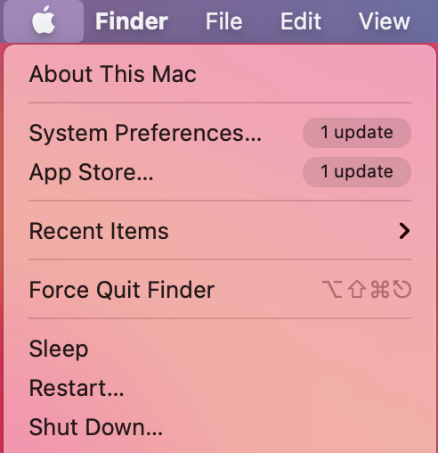
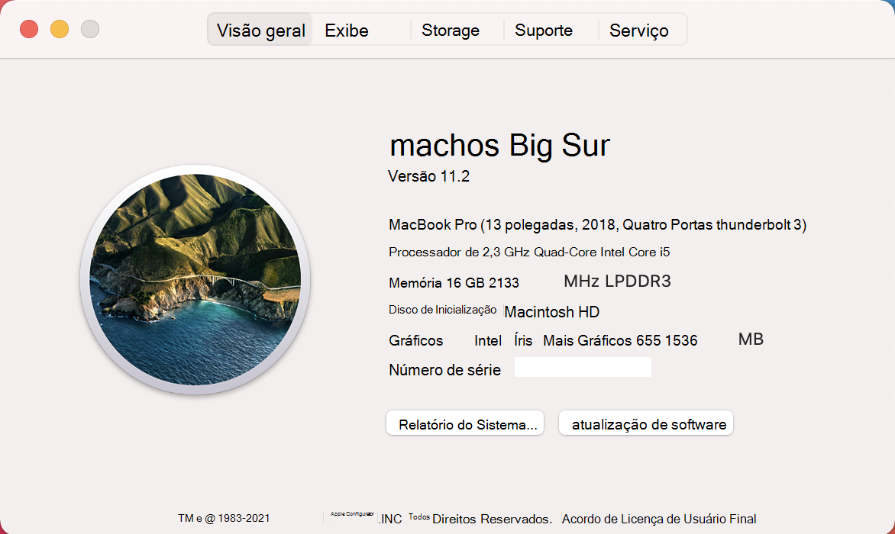

# <a name="device-control-for-macos"></a>Controle de dispositivo para macOS

[!INCLUDE [Microsoft 365 Defender rebranding](../../includes/microsoft-defender.md)]

**Aplica-se a:**
- [Microsoft Defender para Ponto de Extremidade](https://go.microsoft.com/fwlink/p/?linkid=2154037)
- [Microsoft 365 Defender](https://go.microsoft.com/fwlink/?linkid=2118804)

> Deseja experimentar o Microsoft Defender para Ponto de Extremidade? [Inscreva-se para uma avaliação gratuita.](https://www.microsoft.com/microsoft-365/windows/microsoft-defender-atp?ocid=docs-wdatp-exposedapis-abovefoldlink)

[!include[Prerelease information](../../includes/prerelease.md)]

## <a name="requirements"></a>Requisitos

O controle de dispositivo para macOS tem os seguintes pré-requisitos:

>[!div class="checklist"]
> - Direito do Microsoft Defender para Ponto de Extremidade (pode ser avaliação)
> - Versão mínima do sistema operacional: macOS 10.15.4 ou superior
> - Versão mínima do produto: 101.24.59
> - Seu dispositivo deve estar em execução com extensões do sistema (esse é o padrão no macOS 11 Big Sur). 
> 
>   Você pode verificar se seu dispositivo está sendo executado em extensões do sistema executando o seguinte comando e verificar se ele está imprimindo `endpoint_security_extension` no console: 
> 
>   ```bash
>   mdatp health --field real_time_protection_subsystem 
>   ```
> - Seu dispositivo deve estar `Beta` no (anteriormente chamado ) canal de atualização do Microsoft `InsiderFast` AutoUpdate. Para obter mais informações, [consulte Deploy updates for Microsoft Defender for Endpoint on Mac](mac-updates.md).
> 
>   Você pode verificar o canal de atualização usando o seguinte comando: 
> 
>    ```bash
>    mdatp health --field release_ring 
>    ```
>
>    Se o comando acima não imprimir ou `Beta` , execute o seguinte comando do `InsiderFast` Terminal. A atualização de canal entra em vigor na próxima vez que o produto é iniciado (quando a próxima atualização do produto é instalada ou quando o dispositivo é reiniciado). 
> 
>    ```bash
>    defaults write com.microsoft.autoupdate2 ChannelName -string Beta
>    ```
>
>    Como alternativa, se você estiver em um ambiente gerenciado (JAMF ou Intune), poderá configurar o canal de atualização remotamente. Para obter mais informações, [consulte Deploy updates for Microsoft Defender for Endpoint on Mac](mac-updates.md). 

## <a name="device-control-policy"></a>Política de controle de dispositivo

Para configurar o controle de dispositivo para macOS, você deve criar uma política que descreva as restrições que você deseja colocar em sua organização.

A política de controle de dispositivo está incluída no perfil de configuração usado para configurar todas as outras configurações do produto. Para obter mais informações, consulte [Estrutura de perfil de configuração](mac-preferences.md#configuration-profile-structure).

No perfil de configuração, a política de controle de dispositivo é definida na seção a seguir:

|Section|Valor|
|:---|:---|
| **Domínio** | `com.microsoft.wdav` |
| **Tecla** | deviceControl |
| **Tipo de dados** | Dicionário (preferência aninhada) |
| **Comentário** | Consulte as seções a seguir para ver uma descrição do conteúdo do dicionário. |

A política de controle de dispositivo pode ser usada para:

- [Personalizar o destino da URL para notificações ativas pelo controle de dispositivo](#customize-url-target-for-notifications-raised-by-device-control)
- [Permitir ou bloquear dispositivos removíveis](#allow-or-block-removable-devices)

### <a name="customize-url-target-for-notifications-raised-by-device-control"></a>Personalizar destino de URL para notificações ativas pelo controle de dispositivo

Quando a política de controle de dispositivo que você colocou é imposta em um dispositivo (por exemplo, o acesso a um dispositivo de mídia removível é restrito), uma notificação é exibida para o usuário.


Quando os usuários finais clicam nessa notificação, uma página da Web é aberta no navegador padrão. Você pode configurar a URL aberta quando os usuários finais clicarem na notificação.

|Section|Valor|
|:---|:---|
| **Domínio** | `com.microsoft.wdav` |
| **Tecla** | navigationTarget |
| **Tipo de dados** | String |
| **Comentário** | Se não estiver definido, o produto usará uma URL padrão apontando para uma página genérica explicando a ação tomada pelo produto. |

### <a name="allow-or-block-removable-devices"></a>Permitir ou bloquear dispositivos removíveis

A seção mídia removível da política de controle de dispositivo é usada para restringir o acesso à mídia removível. 

> [!NOTE]
> Os seguintes tipos de mídia removível têm suporte no momento e podem ser incluídos na política: dispositivos de armazenamento USB.

|Section|Valor|
|:---|:---|
| **Domínio** | `com.microsoft.wdav` |
| **Tecla** | removableMediaPolicy |
| **Tipo de dados** | Dicionário (preferência aninhada) |
| **Comentário** | Consulte as seções a seguir para ver uma descrição do conteúdo do dicionário. |

Esta seção da política é hierárquica, permitindo a máxima flexibilidade e abrangendo uma ampla variedade de casos de uso. No nível superior estão fornecedores, identificados por uma ID de fornecedor. Para cada fornecedor, há produtos, identificados por uma ID do produto. Por fim, para cada produto, há números de série que denotam dispositivos específicos.

```
|-- policy top level 
    |-- vendor 1 
        |-- product 1 
            |-- serial number 1 
            ...
            |-- serial number N 
        ...
        |-- product N 
    ...
    |-- vendor N
```

Para obter informações sobre como encontrar os identificadores de dispositivo, consulte [Procurar identificadores de dispositivo](#look-up-device-identifiers).

A política é avaliada da entrada mais específica para a mais geral. Ou seja, quando um dispositivo está conectado, o produto tenta encontrar a combinação mais específica na política para cada dispositivo de mídia removível e aplicar as permissões nesse nível. Se não houver nenhuma combinação, a próxima melhor combinação será aplicada, até a permissão especificada no nível superior, que é o padrão quando um dispositivo não corresponder a qualquer outra entrada na política.

#### <a name="policy-enforcement-level"></a>Nível de imposição de política

Na seção mídia removível, há uma opção para definir o nível de imposição, que pode levar um dos seguintes valores:

- `audit` - Nesse nível de imposição, se o acesso a um dispositivo for restrito, uma notificação será exibida para o usuário, no entanto, o dispositivo ainda poderá ser usado. Esse nível de imposição pode ser útil para avaliar a eficácia de uma política.
- `block` - Nesse nível de imposição, as operações que o usuário pode executar no dispositivo são limitadas ao que é definido na política. Além disso, uma notificação é criada para o usuário. 

|Section|Valor|
|:---|:---|
| **Domínio** | `com.microsoft.wdav` |
| **Tecla** | enforcementLevel |
| **Tipo de dados** | Cadeia de caracteres |
| **Valores possíveis** | audit (padrão) <br/> block |

#### <a name="default-permission-level"></a>Nível de permissão padrão

No nível superior da seção mídia removível, você pode configurar o nível de permissão padrão para dispositivos que não corresponderem a mais nada na política.

Essa configuração pode ser definida como:

- `none` - Nenhuma operação pode ser executada no dispositivo
- Uma combinação dos seguintes valores:
    - `read` - As operações de leitura são permitidas no dispositivo
    - `write` - As operações de gravação são permitidas no dispositivo
    - `execute` - Operações de execução são permitidas no dispositivo

> [!NOTE]
> Se estiver presente no nível de permissão, quaisquer outras permissões `none` ( , ou ) serão `read` `write` `execute` ignoradas.

> [!NOTE]
> A `execute` permissão refere-se apenas à execução de binários Mach-O. Ele não inclui a execução de scripts ou outros tipos de cargas.

|Section|Valor|
|:---|:---|
| **Domínio** | `com.microsoft.wdav` |
| **Tecla** | permission |
| **Tipo de dados** | Matriz de cadeias de caracteres |
| **Valores possíveis** | nenhuma <br/> leitura <br/> gravação <br/> execute |

#### <a name="restrict-removable-media-by-vendor-product-and-serial-number"></a>Restringir mídia removível por fornecedor, produto e número de série

Conforme descrito em [Permitir](#allow-or-block-removable-devices)ou bloquear dispositivos removíveis, mídia removível, como dispositivos USB, pode ser identificada pela ID do fornecedor, ID do produto e número de série.

No nível superior da política de mídia removível, você pode, opcionalmente, definir restrições mais granulares no nível do fornecedor. 

O `vendors` dicionário contém uma ou mais entradas, com cada entrada sendo identificada pela ID do fornecedor.

|Section|Valor|
|:---|:---|
| **Domínio** | `com.microsoft.wdav` |
| **Tecla** | vendors |
| **Tipo de dados** | Dicionário (preferência aninhada) |

Para cada fornecedor, você pode especificar o nível de permissão desejado para dispositivos desse fornecedor.

|Section|Valor|
|:---|:---|
| **Domínio** | `com.microsoft.wdav` |
| **Tecla** | permission |
| **Tipo de dados** | Matriz de cadeias de caracteres |
| **Valores possíveis** | Mesmo nível [de permissão padrão](#default-permission-level) |

Além disso, opcionalmente, você pode especificar o conjunto de produtos pertencentes a esse fornecedor para o qual as permissões mais granulares são definidas. O `products` dicionário contém uma ou mais entradas, com cada entrada sendo identificada pela ID do produto. 

|Section|Valor|
|:---|:---|
| **Domínio** | `com.microsoft.wdav` |
| **Tecla** | products |
| **Tipo de dados** | Dicionário (preferência aninhada) |

Para cada produto, você pode especificar o nível de permissão desejado para esse produto.

|Section|Valor|
|:---|:---|
| **Domínio** | `com.microsoft.wdav` |
| **Tecla** | permission |
| **Tipo de dados** | Matriz de cadeias de caracteres |
| **Valores possíveis** | Mesmo nível [de permissão padrão](#default-permission-level) |

Além disso, você pode especificar um conjunto opcional de números de série para os quais as permissões mais granulares são definidas.

O `serialNumbers` dicionário contém uma ou mais entradas, com cada entrada sendo identificada pelo número de série.

|Section|Valor|
|:---|:---|
| **Domínio** | `com.microsoft.wdav` |
| **Tecla** | serialNumbers |
| **Tipo de dados** | Dicionário (preferência aninhada) |

Para cada número de série, você pode especificar o nível de permissão desejado.

|Section|Valor|
|:---|:---|
| **Domínio** | `com.microsoft.wdav` |
| **Tecla** | permission |
| **Tipo de dados** | Matriz de cadeias de caracteres |
| **Valores possíveis** | Mesmo nível [de permissão padrão](#default-permission-level) |

#### <a name="example-device-control-policy"></a>Política de controle de dispositivo de exemplo

O exemplo a seguir mostra como todos os conceitos acima podem ser combinados em uma política de controle de dispositivo. No exemplo a seguir, observe a natureza hierárquica da política de mídia removível.

```xml
<?xml version="1.0" encoding="UTF-8"?> 
<!DOCTYPE plist PUBLIC "-//Apple//DTD PLIST 1.0//EN" "http://www.apple.com/DTDs/PropertyList-1.0.dtd"> 
<plist version="1.0"> 
<dict> 
    <key>deviceControl</key> 
    <dict> 
        <key>navigationTarget</key> 
        <string>[custom URL for notifications]</string> 
        <key>removableMediaPolicy</key> 
        <dict> 
            <key>enforcementLevel</key> 
            <string>[enforcement level]</string> <!-- audit / block --> 
            <key>permission</key> 
            <array> 
                <string>[permission]</string> <!-- none / read / write / execute --> 
                <!-- other permissions -->
            </array> 
            <key>vendors</key> 
            <dict> 
                <key>[vendor id]</key> 
                <dict>
                    <key>permission</key> 
                    <array> 
                        <string>[permission]</string> <!-- none / read / write / execute --> 
                        <!-- other permissions -->
                    </array> 
                    <key>products</key> 
                    <dict> 
                        <key>[product id]</key> 
                        <dict> 
                            <key>permission</key> 
                            <array> 
                                <string>[permission]</string> <!-- none / read / write / execute --> 
                                <!-- other permissions -->
                            </array> 
                            <key>serialNumbers</key> 
                            <dict> 
                                <key>[serial-number]</key> 
                                <array> 
                                    <string>[permission]</string> <!-- none / read / write / execute --> 
                                    <!-- other permissions -->
                                </array> 
                                <!-- other serial numbers --> 
                            </dict> 
                        </dict> 
                        <!-- other products --> 
                    </dict> 
                </dict> 
                <!-- other vendors --> 
            </dict> 
        </dict> 
    </dict> 
</dict> 
</plist> 
```

Incluímos mais exemplos de políticas de controle de dispositivo nos seguintes documentos:

- [Exemplos de políticas de controle de dispositivo para o Intune](mac-device-control-intune.md)
- [Exemplos de políticas de controle de dispositivo para JAMF](mac-device-control-jamf.md)

#### <a name="look-up-device-identifiers"></a>Procurar identificadores de dispositivo

Para encontrar a ID do fornecedor, a ID do produto e o número de série de um dispositivo USB:

1. Faça logoff em um dispositivo Mac.
1. Conecte o dispositivo USB para o qual você deseja procurar os identificadores.
1. No menu de nível superior do macOS, selecione **Sobre Este Mac**.

    

1. Selecione **Relatório do Sistema**.

    

1. Na coluna esquerda, selecione **USB**.

    

1. Em **Árvore de Dispositivo USB,** navegue até o dispositivo USB conectado.

    

1. A ID do fornecedor, a ID do produto e o número de série são exibidos. Ao adicionar a ID do fornecedor e a ID do produto à política de mídia removível, você só deve adicionar a parte depois `0x` de . Por exemplo, na imagem abaixo, a ID do fornecedor é `1000` e a ID do produto é `090c` .

#### <a name="discover-usb-devices-in-your-organization"></a>Descobrir dispositivos USB em sua organização

Você pode exibir eventos de montagem, desmontagem e alteração de volume provenientes de dispositivos USB no Microsoft Defender para a busca avançada do Ponto de Extremidade. Esses eventos podem ser úteis para identificar atividades de uso suspeitas ou realizar investigações internas.

```
DeviceEvents 
    | where ActionType == "UsbDriveMount" or ActionType == "UsbDriveUnmount" or ActionType == "UsbDriveDriveLetterChanged"
    | where DeviceId == "<device ID>"
```

## <a name="device-control-policy-deployment"></a>Implantação da política de controle de dispositivo

A política de controle de dispositivo deve ser incluída ao lado das outras configurações do produto, conforme descrito em Definir preferências do Microsoft Defender para Ponto de Extremidade [no macOS](mac-preferences.md).

Esse perfil pode ser implantado usando as instruções listadas na [implantação do perfil de configuração.](mac-preferences.md#configuration-profile-deployment)

## <a name="troubleshooting-tips"></a>Dicas de solução de problemas

Depois de empurrar o perfil de configuração através do Intune ou JAMF, você pode verificar se ele foi escolhido com êxito pelo produto executando o seguinte comando no Terminal:

```bash
mdatp device-control removable-media policy list
```

Este comando imprimirá para saída padrão a política de controle de dispositivo que o produto está usando. Caso isso imprime , certifique-se de que (a) o perfil de configuração tenha sido realmente enviado para o seu dispositivo do console de gerenciamento e (b) ela seja uma política de controle de dispositivo válida, conforme descrito `Policy is empty` neste documento.

Em um dispositivo onde a política foi entregue com êxito e onde há um ou mais dispositivos conectados, você pode executar o comando a seguir para listar todos os dispositivos e as permissões efetivas aplicadas a eles.

```bash
mdatp device-control removable-media devices list
```

Exemplo de saída:

```Output
.Device(s)
|-o Name: Untitled 1, Permission ["read", "execute"]
| |-o Vendor: General "fff0"
| |-o Product: USB Flash Disk "1000"
| |-o Serial number: "04ZSSMHI2O7WBVOA"
| |-o Mount point: "/Volumes/TESTUSB"
```

No exemplo acima, há apenas um dispositivo de mídia removível conectado e ele tem e permissões, de acordo com a política de controle de dispositivo que foi entregue `read` `execute` ao dispositivo.

## <a name="related-topics"></a>Tópicos relacionados

- [Exemplos de políticas de controle de dispositivo para o Intune](mac-device-control-intune.md)
- [Exemplos de políticas de controle de dispositivo para JAMF](mac-device-control-jamf.md)
