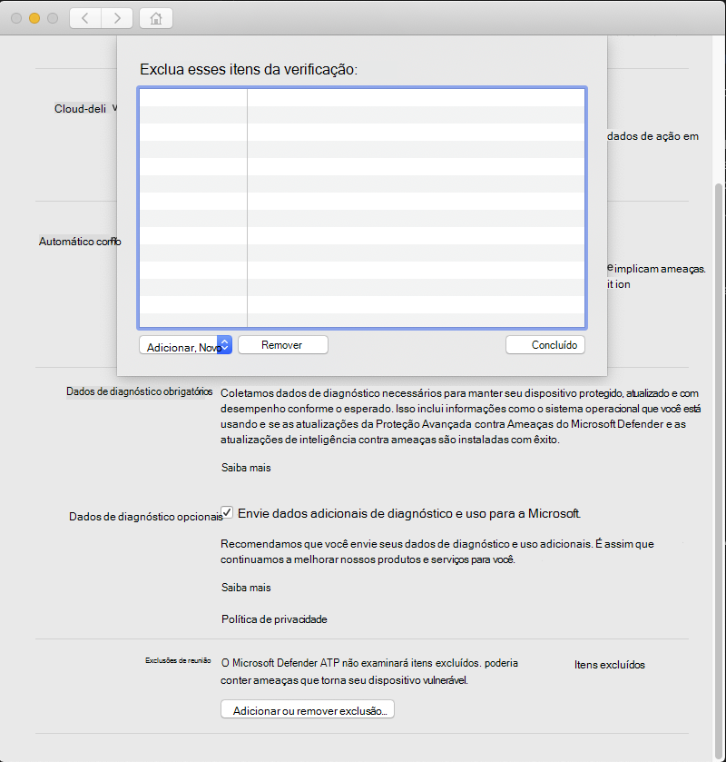

# <a name="configure-and-validate-exclusions-for-microsoft-defender-for-endpoint-on-macos"></a>Configurar e validar exclusões do Microsoft Defender para Ponto de Extremidade no macOS

[!INCLUDE [Microsoft 365 Defender rebranding](../../includes/microsoft-defender.md)]


**Aplica-se a:**
- [Microsoft Defender para Ponto de Extremidade](https://go.microsoft.com/fwlink/p/?linkid=2154037)
- [Microsoft 365 Defender](https://go.microsoft.com/fwlink/?linkid=2118804)

> Deseja experimentar o Defender para Ponto de Extremidade? [Inscreva-se para uma avaliação gratuita.](https://www.microsoft.com/microsoft-365/windows/microsoft-defender-atp?ocid=docs-wdatp-investigateip-abovefoldlink)

Este artigo fornece informações sobre como definir exclusões que se aplicam a verificações sob demanda e proteção e monitoramento em tempo real.

>[!IMPORTANT]
>As exclusões descritas neste artigo não se aplicam a outros recursos do Defender for Endpoint no Mac, incluindo a detecção e a resposta do ponto de extremidade (EDR). Os arquivos excluídos usando os métodos descritos neste artigo ainda podem disparar alertas de EDR e outras detecções.

Você pode excluir determinados arquivos, pastas, processos e arquivos abertos por processo do Defender para Ponto de Extremidade em verificações do Mac.

As exclusões podem ser úteis para evitar detecções incorretas em arquivos ou softwares exclusivos ou personalizados para sua organização. Eles também podem ser úteis para reduzir problemas de desempenho causados pelo Defender para Ponto de Extremidade no Mac.

>[!WARNING]
>Definir exclusões reduz a proteção oferecida pelo Defender para Ponto de Extremidade no Mac. Você sempre deve avaliar os riscos associados à implementação de exclusões, e você deve excluir apenas arquivos que você tem certeza de que não são mal-intencionados.

## <a name="supported-exclusion-types"></a>Tipos de exclusão com suporte

A tabela a seguir mostra os tipos de exclusão suportados pelo Defender para Ponto de Extremidade no Mac.

Exclusão | Definição | Exemplos
---|---|---
Extensão de arquivo | Todos os arquivos com a extensão, em qualquer lugar no computador | `.test`
File | Um arquivo específico identificado pelo caminho completo | `/var/log/test.log`<br/>`/var/log/*.log`<br/>`/var/log/install.?.log`
Folder | Todos os arquivos na pasta especificada (recursivamente) | `/var/log/`<br/>`/var/*/`
Processo | Um processo específico (especificado pelo caminho completo ou nome do arquivo) e todos os arquivos abertos por ele | `/bin/cat`<br/>`cat`<br/>`c?t`

As exclusões de arquivo, pasta e processo suportam os seguintes caracteres curinga:

Curinga | Descrição | Exemplo | Matches | Não se iguala
---|---|---|---|---
\* |    Corresponde a qualquer número de caracteres, incluindo nenhum (observe que quando esse caractere curinga é usado dentro de um caminho, ele substituirá apenas uma pasta) | `/var/*/*.log` | `/var/log/system.log` | `/var/log/nested/system.log`
? | Corresponde a qualquer caractere único | `file?.log` | `file1.log`<br/>`file2.log` | `file123.log`

>[!NOTE]
>O produto tenta resolver firmlinks ao avaliar exclusões. A resolução de firmlink não funciona quando a exclusão contém caracteres curinga ou o arquivo de destino (no `Data` volume) não existe.

## <a name="how-to-configure-the-list-of-exclusions"></a>Como configurar a lista de exclusões

### <a name="from-the-management-console"></a>No console de gerenciamento

Para obter mais informações sobre como configurar exclusões de JAMF, Intune ou outro console de gerenciamento, consulte [Set preferences for Defender for Endpoint on Mac](mac-preferences.md).

### <a name="from-the-user-interface"></a>Na interface do usuário

Abra o aplicativo Defender para Ponto de Extremidade e navegue até **Gerenciar** configurações Adicionar ou Remover Exclusão... , conforme  >  mostrado na captura de tela a seguir:



Selecione o tipo de exclusão que deseja adicionar e siga os prompts.

## <a name="validate-exclusions-lists-with-the-eicar-test-file"></a>Validar listas de exclusões com o arquivo de teste EICAR

Você pode validar que suas listas de exclusão estão funcionando usando `curl` para baixar um arquivo de teste.

No trecho Bash a seguir, substitua por um arquivo que esteja em conformidade `test.txt` com suas regras de exclusão. Por exemplo, se você excluiu a `.testing` extensão, substitua `test.txt` por `test.testing` . Se você estiver testando um caminho, certifique-se de executar o comando nesse caminho.

```bash
curl -o test.txt https://www.eicar.org/download/eicar.com.txt
```

Se o Defender for Endpoint no Mac relata malware, a regra não está funcionando. Se não houver nenhum relatório de malware e o arquivo baixado existir, a exclusão está funcionando. Você pode abrir o arquivo para confirmar se o conteúdo é igual ao descrito no site do arquivo de teste [EICAR.](http://2016.eicar.org/86-0-Intended-use.html)

Se você não tiver acesso à Internet, poderá criar seu próprio arquivo de teste EICAR. Escreva a cadeia de caracteres EICAR em um novo arquivo de texto com o seguinte comando Bash:

```bash
echo 'X5O!P%@AP[4\PZX54(P^)7CC)7}$EICAR-STANDARD-ANTIVIRUS-TEST-FILE!$H+H*' > test.txt
```

Você também pode copiar a cadeia de caracteres em um arquivo de texto em branco e tentar salvá-la com o nome do arquivo ou na pasta que você está tentando excluir.

## <a name="allow-threats"></a>Permitir ameaças

Além de excluir determinado conteúdo de ser verificado, você também pode configurar o produto para não detectar algumas classes de ameaças (identificadas pelo nome da ameaça). Você deve ter cuidado ao usar essa funcionalidade, pois ela pode deixar seu dispositivo desprotegido.

Para adicionar um nome de ameaça à lista permitida, execute o seguinte comando:

```bash
mdatp threat allowed add --name [threat-name]
```

O nome da ameaça associado a uma detecção em seu dispositivo pode ser obtido usando o seguinte comando:

```bash
mdatp threat list
```

Por exemplo, para adicionar (o nome de ameaça associado à detecção EICAR) à lista de `EICAR-Test-File (not a virus)` permissão, execute o seguinte comando:

```bash
mdatp threat allowed add --name "EICAR-Test-File (not a virus)"
```
