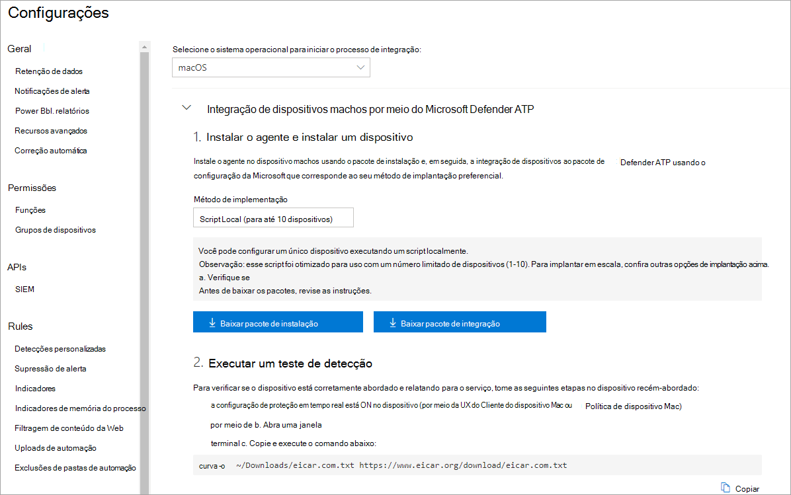
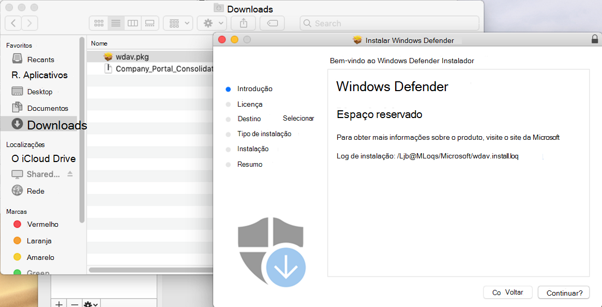
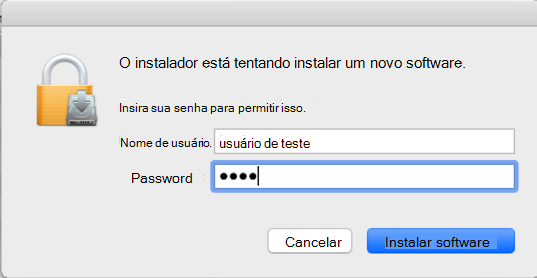
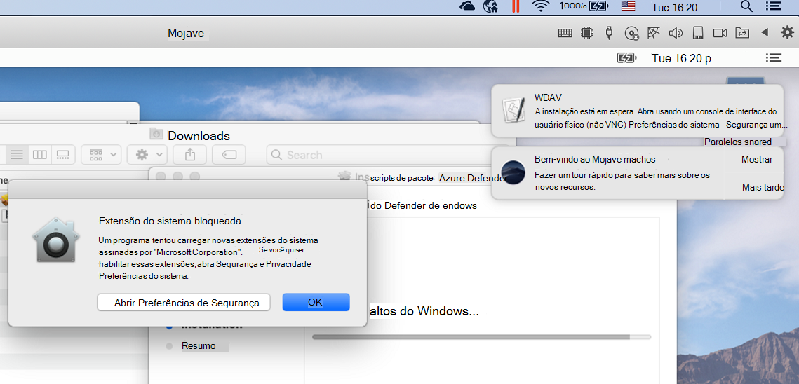
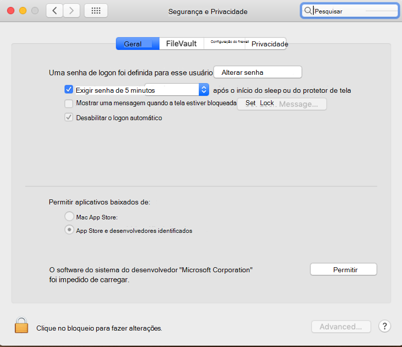
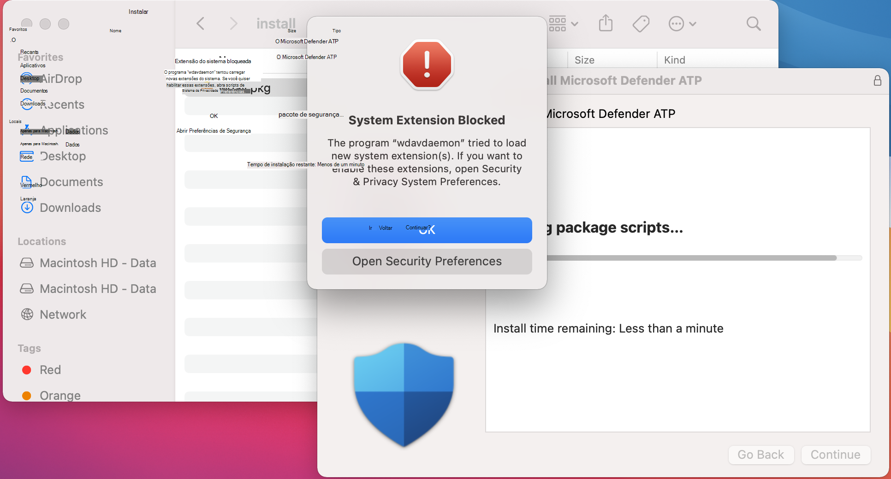
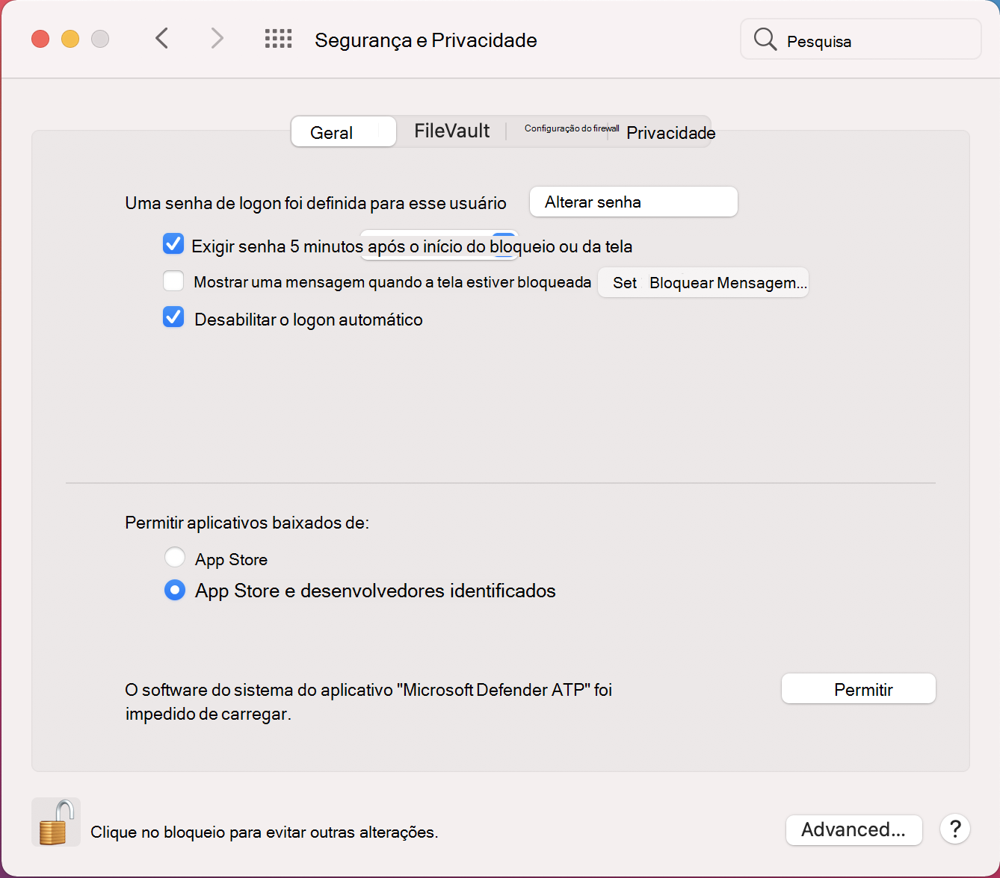
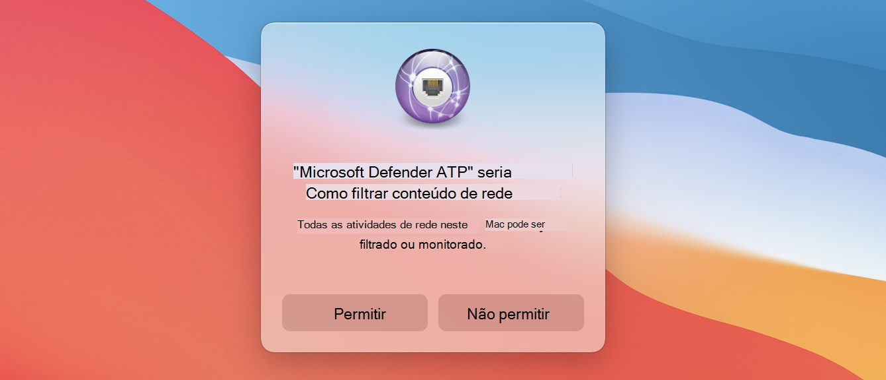
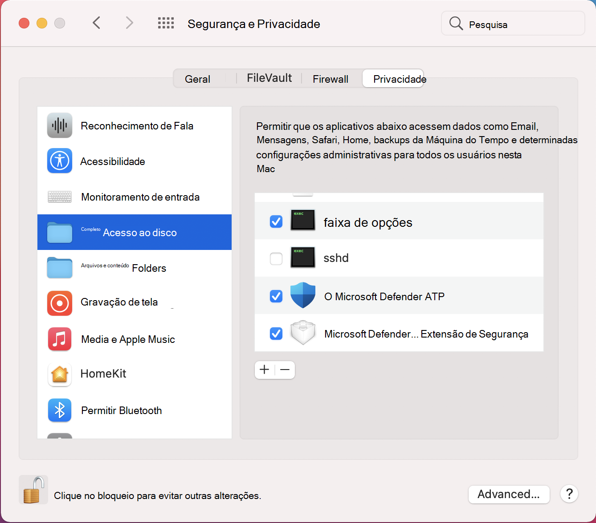

# <a name="manual-deployment-for-microsoft-defender-for-endpoint-on-macos"></a>Implantação manual do Microsoft Defender para Ponto de Extremidade no macOS

[!INCLUDE [Microsoft 365 Defender rebranding](../../includes/microsoft-defender.md)]

**Aplica-se a:**
- [Microsoft Defender para Ponto de Extremidade](https://go.microsoft.com/fwlink/p/?linkid=2154037)
- [Microsoft 365 Defender](https://go.microsoft.com/fwlink/?linkid=2118804)

> Deseja experimentar o Defender para Ponto de Extremidade? [Inscreva-se para uma avaliação gratuita.](https://www.microsoft.com/microsoft-365/windows/microsoft-defender-atp?ocid=docs-wdatp-investigateip-abovefoldlink)

Este tópico descreve como implantar o Microsoft Defender para Ponto de Extremidade no macOS manualmente. Uma implantação bem-sucedida requer a conclusão de todas as etapas a seguir:
- [Baixar pacotes de instalação e integração](#download-installation-and-onboarding-packages)
- [Instalação do aplicativo (macOS 10.15 e versões anteriores)](#application-installation-macos-1015-and-older-versions)
- [Instalação do aplicativo (macOS 11 e versões mais recentes)](#application-installation-macos-11-and-newer-versions)
- [Configuração do cliente](#client-configuration)

## <a name="prerequisites-and-system-requirements"></a>Pré-requisitos e requisitos do sistema

Antes de começar, consulte a página principal do Microsoft Defender para Ponto de Extremidade no [macOS](microsoft-defender-endpoint-mac.md) para obter uma descrição dos pré-requisitos e requisitos do sistema para a versão de software atual.

## <a name="download-installation-and-onboarding-packages"></a>Baixar pacotes de instalação e integração

Baixe os pacotes de instalação e integração do Centro de Segurança do Microsoft Defender:

1. No Centro de Segurança do Microsoft Defender, acesse **Configurações > Gerenciamento de Dispositivos > Integração**.
2. Na Seção 1 da página, de definir o sistema operacional como **macOS** e o método Deployment como **script local**.
3. Na Seção 2 da página, selecione **Baixar pacote de instalação**. Salve-o como wdav.pkg em um diretório local.
4. Na Seção 2 da página, selecione **Baixar pacote de integração**. Salve-o como WindowsDefenderATPOnboardingPackage.zip no mesmo diretório.

    

5. Em um prompt de comando, verifique se você tem os dois arquivos.
    
## <a name="application-installation-macos-1015-and-older-versions"></a>Instalação do aplicativo (macOS 10.15 e versões anteriores)

Para concluir esse processo, você deve ter privilégios de administrador no dispositivo.

1. Navegue até o wdav.pkg baixado no Finder e abra-o.

    

2. Selecione **Continuar**, concordar com os termos de Licença e insira a senha quando solicitado.

    

   > [!IMPORTANT]
   > Você será solicitado a permitir que um driver da Microsoft seja instalado ("Bloqueio de Extensão do Sistema" ou "Instalação está em espera" ou ambos. O driver deve ter permissão para ser instalado.

   

3. Selecione **Abrir Preferências de Segurança** ou Abrir **Preferências do Sistema > Segurança & Privacidade**. Selecione **Permitir**:

    

   A instalação continua.

   > [!CAUTION]
   > Se você não selecionar **Permitir**, a instalação prosseguirá após 5 minutos. O Microsoft Defender para Ponto de Extremidade será carregado, mas alguns recursos, como proteção em tempo real, serão desabilitados. Consulte [Solucionar problemas de extensão do kernel](mac-support-kext.md) para obter informações sobre como resolver isso.

> [!NOTE]
> O macOS pode solicitar a reinicialização do dispositivo na primeira instalação do Microsoft Defender para Ponto de Extremidade. A proteção em tempo real não estará disponível até que o dispositivo seja reiniciado.

## <a name="application-installation-macos-11-and-newer-versions"></a>Instalação do aplicativo (macOS 11 e versões mais recentes)

Para concluir esse processo, você deve ter privilégios de administrador no dispositivo.

1. Navegue até o wdav.pkg baixado no Finder e abra-o.

    

2. Selecione **Continuar**, concordar com os termos de Licença e insira a senha quando solicitado.

3. No final do processo de instalação, você será promovido a aprovar as extensões do sistema usadas pelo produto. Selecione **Abrir Preferências de Segurança**.

    

4. Na janela **Segurança & Privacidade,** selecione **Permitir**.

    

5. Repita as etapas 3 & 4 para todas as extensões do sistema distribuídas com o Microsoft Defender para Ponto de Extremidade no Mac.

6. Como parte dos recursos de Detecção e Resposta do Ponto de Extremidade, o Microsoft Defender para Ponto de Extremidade no Mac inspeciona o tráfego de soquete e relata essas informações ao portal do Centro de Segurança do Microsoft Defender. Quando solicitado a conceder permissões do Microsoft Defender para o Ponto de Extremidade para filtrar o tráfego de rede, selecione **Permitir**.

    

7. Abra **Preferências do** Sistema Segurança & Privacidade e navegue até a guia Privacidade. Conceda permissão de Acesso em Disco Completo para o Microsoft Defender ATP e a Extensão de Segurança do Ponto de Extremidade do  >   Microsoft Defender **ATP.**   

    

## <a name="client-configuration"></a>Configuração do cliente

1. Copie wdav.pkg e MicrosoftDefenderATPOnboardingMacOs.py para o dispositivo onde você implanta o Microsoft Defender para Ponto de Extremidade no macOS.

    O dispositivo cliente não está associado ao org_id. Observe que o *atributo org_id* está em branco.

    ```bash
    mdatp health --field org_id
    ```

2. Execute o script Python para instalar o arquivo de configuração:

    ```bash
    /usr/bin/python MicrosoftDefenderATPOnboardingMacOs.py
    ```

3. Verifique se o dispositivo agora está associado à sua organização e relata uma ID da organização válida:

    ```bash
    mdatp health --field org_id
    ```

    Após a instalação, você verá o ícone do Microsoft Defender na barra de status do macOS no canto superior direito.
    
    > [!div class="mx-imgBorder"]
    > 


## <a name="how-to-allow-full-disk-access"></a>Como permitir o acesso total ao disco

> [!CAUTION]
> O macOS 10.15 (Catalina) contém novos aprimoramentos de segurança e privacidade. A partir dessa versão, por padrão, os aplicativos não são capazes de acessar determinados locais no disco (como Documentos, Downloads, Área de Trabalho, etc.) sem consentimento explícito. Na ausência desse consentimento, o Microsoft Defender para Ponto de Extremidade não é capaz de proteger totalmente seu dispositivo.

1. Para conceder consentimento, abra **o System Preferences**  >  **Security & Privacidade**  >  **Acesso**  >  **total ao disco**. Clique no ícone de bloqueio para fazer alterações (parte inferior da caixa de diálogo). Selecione Microsoft Defender para Ponto de Extremidade.

2. Execute um teste de detecção de AV para verificar se o dispositivo está corretamente conectado e relatando ao serviço. Execute as seguintes etapas no dispositivo recém-integrado:

    1. Verifique se a proteção em tempo real está habilitada (denotada por um resultado de 1 da execução do seguinte comando):

        ```bash
        mdatp health --field real_time_protection_enabled
        ```

    1. Abra uma janela de Terminal. Copie e execute o seguinte comando:

        ```bash
        curl -o ~/Downloads/eicar.com.txt https://www.eicar.org/download/eicar.com.txt
        ```

    1. O arquivo deve ter sido colocado em quarentena pelo Defender para Ponto de Extremidade no Mac. Use o seguinte comando para listar todas as ameaças detectadas:

        ```bash
        mdatp threat list
        ```

3. Execute um teste de detecção de EDR para verificar se o dispositivo está corretamente conectado e relatando ao serviço. Execute as seguintes etapas no dispositivo recém-integrado:

   1. No navegador, como o Microsoft Edge para Mac ou Safari.

   1. Baixe o MDATP MacOS DIY.zip https://aka.ms/mdatpmacosdiy e extraia.

      Você pode ser solicitado:

      > Deseja permitir downloads em "mdatpclientanalyzer.blob.core.windows.net"?<br/>
      > Você pode alterar quais sites podem baixar arquivos em Preferências de Sites.

4. Clique **em Permitir**.

5. Abrir **Downloads**.

6. Você deve ver **MDATP MacOS DIY**.

   > [!TIP]
   > Se você clicar duas vezes, receberá a seguinte mensagem:
   > 
   > > **"MDATP MacOS DIY" não pode ser aberto porque o desenvolvedor não pode ser verificador.**<br/>
   > > O macOS não pode verificar se esse aplicativo está livre de malware.<br/>
   > > **\[ Mover para \] o Cancelamento de** **\[ Lixo \]** 
  
7. Clique em **Cancelar**.

8. Clique com o botão direito do **mouse em MDATP MacOS DIY** e clique em **Abrir**. 

    O sistema deve exibir a seguinte mensagem:

    > **macOS não pode verificar o desenvolvedor **do MDATP MacOS DIY**. Tem certeza de que deseja abri-lo?**<br/>
    > Ao abrir este aplicativo, você estará substituindo a segurança do sistema que pode expor seu computador e informações pessoais a malware que podem prejudicar seu Mac ou comprometer sua privacidade.

10. Clique em **Abrir**. 

    O sistema deve exibir a seguinte mensagem:

    > Microsoft Defender para Ponto de Extremidade - arquivo de teste macOS EDR DIY<br/>
    > O alerta correspondente estará disponível no portal MDATP.

11. Clique em **Abrir**. 

    Em alguns minutos, um alerta chamado "alerta de teste EDR do macOS" deve ser a gerado.

12. Vá para o Centro de Segurança do Microsoft Defender ( https://SecurityCenter.microsoft.com) .

13. Vá para a Fila de Alertas.

    :::image type="content" source="images/b8db76c2-c368-49ad-970f-dcb87534d9be.png" alt-text="Exemplo de um alerta de teste EDR do macOS que mostra gravidade, categoria, fonte de detecção e um menu de ações recolhido.":::
    
    Veja os detalhes do alerta e a linha do tempo do dispositivo e execute as etapas de investigação regulares.

## <a name="logging-installation-issues"></a>Problemas de instalação de log

Consulte [Log de problemas de](mac-resources.md#logging-installation-issues) instalação para obter mais informações sobre como encontrar o log gerado automaticamente que é criado pelo instalador quando ocorre um erro.

## <a name="uninstallation"></a>Desinstalação

Consulte [Desinstalar](mac-resources.md#uninstalling) para obter detalhes sobre como remover o Microsoft Defender para o Ponto de Extremidade no macOS de dispositivos cliente.
