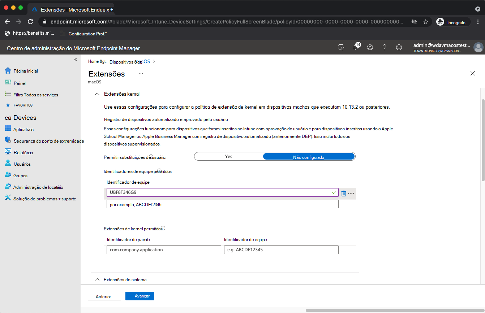
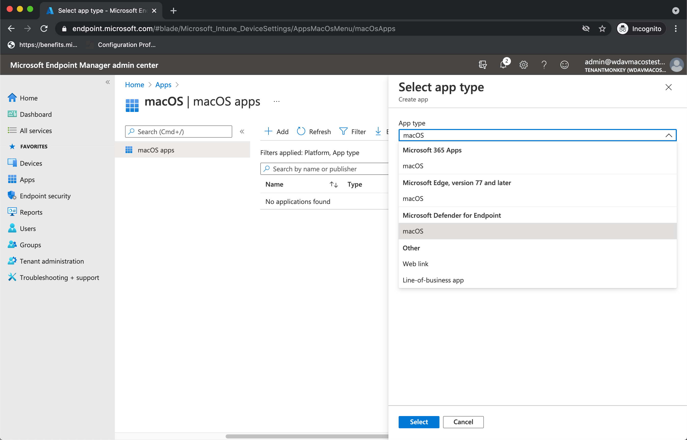

# <a name="intune-based-deployment-for-microsoft-defender-for-endpoint-on-macos"></a><span data-ttu-id="4a038-104">Implantação baseada no Intune para o Microsoft Defender para Ponto de Extremidade no macOS</span><span class="sxs-lookup"><span data-stu-id="4a038-104">Intune-based deployment for Microsoft Defender for Endpoint on macOS</span></span>

[!INCLUDE [Microsoft 365 Defender rebranding](../../includes/microsoft-defender.md)]

<span data-ttu-id="4a038-105">**Aplica-se a:**</span><span class="sxs-lookup"><span data-stu-id="4a038-105">**Applies to:**</span></span>

- [<span data-ttu-id="4a038-106">Microsoft Defender para Ponto de Extremidade no macOS</span><span class="sxs-lookup"><span data-stu-id="4a038-106">Microsoft Defender for Endpoint on macOS</span></span>](microsoft-defender-endpoint-mac.md)

<span data-ttu-id="4a038-107">Este tópico descreve como implantar o Microsoft Defender para Ponto de Extremidade no macOS por meio do Intune.</span><span class="sxs-lookup"><span data-stu-id="4a038-107">This topic describes how to deploy Microsoft Defender for Endpoint on macOS through Intune.</span></span> <span data-ttu-id="4a038-108">Uma implantação bem-sucedida requer a conclusão de todas as etapas a seguir:</span><span class="sxs-lookup"><span data-stu-id="4a038-108">A successful deployment requires the completion of all of the following steps:</span></span>

1. [<span data-ttu-id="4a038-109">Baixar o pacote de integração</span><span class="sxs-lookup"><span data-stu-id="4a038-109">Download the onboarding package</span></span>](#download-the-onboarding-package)
1. [<span data-ttu-id="4a038-110">Configuração de dispositivo cliente</span><span class="sxs-lookup"><span data-stu-id="4a038-110">Client device setup</span></span>](#client-device-setup)
1. [<span data-ttu-id="4a038-111">Aprovar extensões do sistema</span><span class="sxs-lookup"><span data-stu-id="4a038-111">Approve system extensions</span></span>](#approve-system-extensions)
1. [<span data-ttu-id="4a038-112">Criar perfis de configuração do sistema</span><span class="sxs-lookup"><span data-stu-id="4a038-112">Create System Configuration profiles</span></span>](#create-system-configuration-profiles)
1. [<span data-ttu-id="4a038-113">Publicar aplicativo</span><span class="sxs-lookup"><span data-stu-id="4a038-113">Publish application</span></span>](#publish-application)

## <a name="prerequisites-and-system-requirements"></a><span data-ttu-id="4a038-114">Pré-requisitos e requisitos do sistema</span><span class="sxs-lookup"><span data-stu-id="4a038-114">Prerequisites and system requirements</span></span>

<span data-ttu-id="4a038-115">Antes de começar, consulte a página principal do Microsoft Defender para Ponto de Extremidade no [macOS](microsoft-defender-endpoint-mac.md) para obter uma descrição dos pré-requisitos e requisitos do sistema para a versão de software atual.</span><span class="sxs-lookup"><span data-stu-id="4a038-115">Before you get started, see [the main Microsoft Defender for Endpoint on macOS page](microsoft-defender-endpoint-mac.md) for a description of prerequisites and system requirements for the current software version.</span></span>

## <a name="overview"></a><span data-ttu-id="4a038-116">Visão Geral</span><span class="sxs-lookup"><span data-stu-id="4a038-116">Overview</span></span>

<span data-ttu-id="4a038-117">A tabela a seguir resume as etapas necessárias para implantar e gerenciar o Microsoft Defender para Ponto de Extremidade em Macs, por meio do Intune.</span><span class="sxs-lookup"><span data-stu-id="4a038-117">The following table summarizes the steps you would need to take to deploy and manage Microsoft Defender for Endpoint on Macs, via Intune.</span></span> <span data-ttu-id="4a038-118">Etapas mais detalhadas estão disponíveis abaixo.</span><span class="sxs-lookup"><span data-stu-id="4a038-118">More detailed steps are available below.</span></span>

| <span data-ttu-id="4a038-119">Etapa</span><span class="sxs-lookup"><span data-stu-id="4a038-119">Step</span></span> | <span data-ttu-id="4a038-120">Exemplo de nomes de arquivo</span><span class="sxs-lookup"><span data-stu-id="4a038-120">Sample file names</span></span> | <span data-ttu-id="4a038-121">BundleIdentifier</span><span class="sxs-lookup"><span data-stu-id="4a038-121">BundleIdentifier</span></span> |
|-|-|-|
| [<span data-ttu-id="4a038-122">Baixar o pacote de integração</span><span class="sxs-lookup"><span data-stu-id="4a038-122">Download the onboarding package</span></span>](#download-the-onboarding-package) | <span data-ttu-id="4a038-123">WindowsDefenderATPOnboarding__MDATP_wdav.atp.xml</span><span class="sxs-lookup"><span data-stu-id="4a038-123">WindowsDefenderATPOnboarding__MDATP_wdav.atp.xml</span></span> | <span data-ttu-id="4a038-124">com.microsoft.wdav.atp</span><span class="sxs-lookup"><span data-stu-id="4a038-124">com.microsoft.wdav.atp</span></span> |
| [<span data-ttu-id="4a038-125">Aprovar Extensão do Sistema para o Microsoft Defender para Ponto de Extremidade</span><span class="sxs-lookup"><span data-stu-id="4a038-125">Approve System Extension for Microsoft Defender for Endpoint</span></span>](#approve-system-extensions) | <span data-ttu-id="4a038-126">MDATP_SysExt.xml</span><span class="sxs-lookup"><span data-stu-id="4a038-126">MDATP_SysExt.xml</span></span> | <span data-ttu-id="4a038-127">N/A</span><span class="sxs-lookup"><span data-stu-id="4a038-127">N/A</span></span> |
| [<span data-ttu-id="4a038-128">Aprovar Extensão de Kernel para o Microsoft Defender para Ponto de Extremidade</span><span class="sxs-lookup"><span data-stu-id="4a038-128">Approve Kernel Extension for Microsoft Defender for Endpoint</span></span>](#download-the-onboarding-package) | <span data-ttu-id="4a038-129">MDATP_KExt.xml</span><span class="sxs-lookup"><span data-stu-id="4a038-129">MDATP_KExt.xml</span></span> | <span data-ttu-id="4a038-130">N/A</span><span class="sxs-lookup"><span data-stu-id="4a038-130">N/A</span></span> |
| [<span data-ttu-id="4a038-131">Conceder acesso em disco completo ao Microsoft Defender para Ponto de Extremidade</span><span class="sxs-lookup"><span data-stu-id="4a038-131">Grant full disk access to Microsoft Defender for Endpoint</span></span>](#full-disk-access) | <span data-ttu-id="4a038-132">MDATP_tcc_Catalina_or_newer.xml</span><span class="sxs-lookup"><span data-stu-id="4a038-132">MDATP_tcc_Catalina_or_newer.xml</span></span> | <span data-ttu-id="4a038-133">com.microsoft.wdav.tcc</span><span class="sxs-lookup"><span data-stu-id="4a038-133">com.microsoft.wdav.tcc</span></span> |
| [<span data-ttu-id="4a038-134">Política de Extensão de Rede</span><span class="sxs-lookup"><span data-stu-id="4a038-134">Network Extension policy</span></span>](#network-filter) | <span data-ttu-id="4a038-135">MDATP_NetExt.xml</span><span class="sxs-lookup"><span data-stu-id="4a038-135">MDATP_NetExt.xml</span></span> | <span data-ttu-id="4a038-136">N/A</span><span class="sxs-lookup"><span data-stu-id="4a038-136">N/A</span></span> |
| [<span data-ttu-id="4a038-137">Configurar o Microsoft AutoUpdate (MAU)</span><span class="sxs-lookup"><span data-stu-id="4a038-137">Configure Microsoft AutoUpdate (MAU)</span></span>](mac-updates.md#intune) | <span data-ttu-id="4a038-138">MDATP_Microsoft_AutoUpdate.xml</span><span class="sxs-lookup"><span data-stu-id="4a038-138">MDATP_Microsoft_AutoUpdate.xml</span></span> | <span data-ttu-id="4a038-139">com.microsoft.autoupdate2</span><span class="sxs-lookup"><span data-stu-id="4a038-139">com.microsoft.autoupdate2</span></span> |
| [<span data-ttu-id="4a038-140">Configurações do Microsoft Defender para Ponto de Extremidade</span><span class="sxs-lookup"><span data-stu-id="4a038-140">Microsoft Defender for Endpoint configuration settings</span></span>](mac-preferences.md#intune-profile-1)<br/><br/> <span data-ttu-id="4a038-141">**Observação:** Se você estiver planejando executar um AV de terceiros para macOS, de acordo `passiveMode` com `true` .</span><span class="sxs-lookup"><span data-stu-id="4a038-141">**Note:** If you're planning to run a third-party AV for macOS, set `passiveMode` to `true`.</span></span> | <span data-ttu-id="4a038-142">MDATP_WDAV_and_exclusion_settings_Preferences.xml</span><span class="sxs-lookup"><span data-stu-id="4a038-142">MDATP_WDAV_and_exclusion_settings_Preferences.xml</span></span> | <span data-ttu-id="4a038-143">com.microsoft.wdav</span><span class="sxs-lookup"><span data-stu-id="4a038-143">com.microsoft.wdav</span></span> |
| [<span data-ttu-id="4a038-144">Configurar notificações do Microsoft Defender para Endpoint e MS AutoUpdate (MAU)</span><span class="sxs-lookup"><span data-stu-id="4a038-144">Configure Microsoft Defender for Endpoint and MS AutoUpdate (MAU) notifications</span></span>](mac-updates.md) | <span data-ttu-id="4a038-145">MDATP_MDAV_Tray_and_AutoUpdate2.mobileconfig</span><span class="sxs-lookup"><span data-stu-id="4a038-145">MDATP_MDAV_Tray_and_AutoUpdate2.mobileconfig</span></span> | <span data-ttu-id="4a038-146">com.microsoft.autoupdate2 ou com.microsoft.wdav.tray</span><span class="sxs-lookup"><span data-stu-id="4a038-146">com.microsoft.autoupdate2 or com.microsoft.wdav.tray</span></span> |


## <a name="download-the-onboarding-package"></a><span data-ttu-id="4a038-147">Baixar o pacote de integração</span><span class="sxs-lookup"><span data-stu-id="4a038-147">Download the onboarding package</span></span>

<span data-ttu-id="4a038-148">Baixe os pacotes de integração Central de Segurança do Microsoft Defender:</span><span class="sxs-lookup"><span data-stu-id="4a038-148">Download the onboarding packages from Microsoft Defender Security Center:</span></span>

1. <span data-ttu-id="4a038-149">Em Central de Segurança do Microsoft Defender, vá **para** Configurações  >  **Gerenciamento de**  >  **Dispositivos Integrando**.</span><span class="sxs-lookup"><span data-stu-id="4a038-149">In Microsoft Defender Security Center, go to **Settings** > **Device Management** > **Onboarding**.</span></span>

2. <span data-ttu-id="4a038-150">De definir o sistema operacional como **macOS** e o método de implantação como **Gerenciamento de Dispositivo Móvel/Microsoft Intune**.</span><span class="sxs-lookup"><span data-stu-id="4a038-150">Set the operating system to **macOS** and the deployment method to **Mobile Device Management / Microsoft Intune**.</span></span>

    

3. <span data-ttu-id="4a038-152">Selecione **Baixar pacote de integração**.</span><span class="sxs-lookup"><span data-stu-id="4a038-152">Select **Download onboarding package**.</span></span> <span data-ttu-id="4a038-153">Salve-o _comoWindowsDefenderATPOnboardingPackage.zip_ no mesmo diretório.</span><span class="sxs-lookup"><span data-stu-id="4a038-153">Save it as _WindowsDefenderATPOnboardingPackage.zip_ to the same directory.</span></span>

4. <span data-ttu-id="4a038-154">Extraia o conteúdo do arquivo .zip:</span><span class="sxs-lookup"><span data-stu-id="4a038-154">Extract the contents of the .zip file:</span></span>

    ```bash
    unzip WindowsDefenderATPOnboardingPackage.zip
    ```
    ```Output
    Archive:  WindowsDefenderATPOnboardingPackage.zip
    warning:  WindowsDefenderATPOnboardingPackage.zip appears to use backslashes as path separators
      inflating: intune/kext.xml
      inflating: intune/WindowsDefenderATPOnboarding.xml
      inflating: jamf/WindowsDefenderATPOnboarding.plist
    ```

## <a name="create-system-configuration-profiles"></a><span data-ttu-id="4a038-155">Criar perfis de configuração do sistema</span><span class="sxs-lookup"><span data-stu-id="4a038-155">Create System Configuration profiles</span></span>

<span data-ttu-id="4a038-156">A próxima etapa é criar perfis de configuração do sistema que o Microsoft Defender for Endpoint precisa.</span><span class="sxs-lookup"><span data-stu-id="4a038-156">The next step is to create system configuration profiles that Microsoft Defender for Endpoint needs.</span></span>
<span data-ttu-id="4a038-157">No centro [de Microsoft Endpoint Manager de administração,](https://endpoint.microsoft.com/)abra **perfis de**  >  **Configuração de Dispositivos.**</span><span class="sxs-lookup"><span data-stu-id="4a038-157">In the [Microsoft Endpoint Manager admin center](https://endpoint.microsoft.com/), open **Devices** > **Configuration profiles**.</span></span>

### <a name="onboarding-blob"></a><span data-ttu-id="4a038-158">Blob de integração</span><span class="sxs-lookup"><span data-stu-id="4a038-158">Onboarding blob</span></span>

<span data-ttu-id="4a038-159">Este perfil contém informações de licença para o Microsoft Defender para Ponto de Extremidade, sem ele informará que não está licenciado.</span><span class="sxs-lookup"><span data-stu-id="4a038-159">This profile contains a license information for Microsoft Defender for Endpoint, without it it will report that it is not licensed.</span></span>

1. <span data-ttu-id="4a038-160">Selecione **Criar Perfil em** **Perfis de Configuração**.</span><span class="sxs-lookup"><span data-stu-id="4a038-160">Select **Create Profile** under **Configuration Profiles**.</span></span>
1. <span data-ttu-id="4a038-161">Selecione **Plataforma** = **macOS,** **Modelos de tipo** de = **perfil.**</span><span class="sxs-lookup"><span data-stu-id="4a038-161">Select **Platform**=**macOS**, **Profile type**=**Templates**.</span></span> <span data-ttu-id="4a038-162">**Nome do modelo** = **Personalizado**.</span><span class="sxs-lookup"><span data-stu-id="4a038-162">**Template name**=**Custom**.</span></span> <span data-ttu-id="4a038-163">Clique em **Criar**.</span><span class="sxs-lookup"><span data-stu-id="4a038-163">Click **Create**.</span></span>

    > [!div class="mx-imgBorder"]
    > <span data-ttu-id="4a038-164"></span><span class="sxs-lookup"><span data-stu-id="4a038-164"></span></span>

1. <span data-ttu-id="4a038-165">Escolha um nome para o perfil, por exemplo, "MDATP integração para macOS".</span><span class="sxs-lookup"><span data-stu-id="4a038-165">Choose a name for the profile, e.g., "MDATP onboarding for macOS".</span></span> <span data-ttu-id="4a038-166">Clique em **Avançar**.</span><span class="sxs-lookup"><span data-stu-id="4a038-166">Click **Next**.</span></span>

    > [!div class="mx-imgBorder"]
    > <span data-ttu-id="4a038-167"></span><span class="sxs-lookup"><span data-stu-id="4a038-167"></span></span>

1. <span data-ttu-id="4a038-168">Escolha um nome para o nome do perfil de configuração, por exemplo, "MDATP integração para macOS".</span><span class="sxs-lookup"><span data-stu-id="4a038-168">Choose a name for the configuration profile name, e.g., "MDATP onboarding for macOS".</span></span>
1. <span data-ttu-id="4a038-169">Selecione o intune/WindowsDefenderATPOnboarding.xml que você extraiu do pacote de integração acima como arquivo de perfil de configuração.</span><span class="sxs-lookup"><span data-stu-id="4a038-169">Select intune/WindowsDefenderATPOnboarding.xml that you extracted from the onboarding package above as configuration profile file.</span></span>

    > [!div class="mx-imgBorder"]
    > <span data-ttu-id="4a038-170"></span><span class="sxs-lookup"><span data-stu-id="4a038-170"></span></span>

1. <span data-ttu-id="4a038-171">Clique em **Avançar**.</span><span class="sxs-lookup"><span data-stu-id="4a038-171">Click **Next**.</span></span>
1. <span data-ttu-id="4a038-172">Atribuir dispositivos na guia **Atribuição.** Clique **em Próximo**.</span><span class="sxs-lookup"><span data-stu-id="4a038-172">Assign devices on the **Assignment** tab. Click **Next**.</span></span>

    > [!div class="mx-imgBorder"]
    > <span data-ttu-id="4a038-173"></span><span class="sxs-lookup"><span data-stu-id="4a038-173"></span></span>

1. <span data-ttu-id="4a038-174">Revisar e **criar**.</span><span class="sxs-lookup"><span data-stu-id="4a038-174">Review and **Create**.</span></span>
1. <span data-ttu-id="4a038-175">Abra **perfis**  >  **de configuração de** dispositivos, você pode ver seu perfil criado lá.</span><span class="sxs-lookup"><span data-stu-id="4a038-175">Open **Devices** > **Configuration profiles**, you can see your created profile there.</span></span>

    > [!div class="mx-imgBorder"]
    > <span data-ttu-id="4a038-176"></span><span class="sxs-lookup"><span data-stu-id="4a038-176"></span></span>

### <a name="approve-system-extensions"></a><span data-ttu-id="4a038-177">Aprovar extensões do sistema</span><span class="sxs-lookup"><span data-stu-id="4a038-177">Approve System Extensions</span></span>

<span data-ttu-id="4a038-178">Esse perfil é necessário para macOS 10.15 (Catalina) ou mais novo.</span><span class="sxs-lookup"><span data-stu-id="4a038-178">This profile is needed for macOS 10.15 (Catalina) or newer.</span></span> <span data-ttu-id="4a038-179">Ele será ignorado em macOS mais antigo.</span><span class="sxs-lookup"><span data-stu-id="4a038-179">It will be ignored on older macOS.</span></span>

1. <span data-ttu-id="4a038-180">Selecione **Criar Perfil em** **Perfis de Configuração**.</span><span class="sxs-lookup"><span data-stu-id="4a038-180">Select **Create Profile** under **Configuration Profiles**.</span></span>
1. <span data-ttu-id="4a038-181">Selecione **Plataforma** = **macOS,** **Modelos de tipo** de = **perfil.**</span><span class="sxs-lookup"><span data-stu-id="4a038-181">Select **Platform**=**macOS**, **Profile type**=**Templates**.</span></span> <span data-ttu-id="4a038-182">**Nome do modelo** = **Extensões**.</span><span class="sxs-lookup"><span data-stu-id="4a038-182">**Template name**=**Extensions**.</span></span> <span data-ttu-id="4a038-183">Clique em **Criar**.</span><span class="sxs-lookup"><span data-stu-id="4a038-183">Click **Create**.</span></span>
1. <span data-ttu-id="4a038-184">Na guia **Noções Básicas,** dê um nome a esse novo perfil.</span><span class="sxs-lookup"><span data-stu-id="4a038-184">In the **Basics** tab, give a name to this new profile.</span></span>
1. <span data-ttu-id="4a038-185">Na guia **Configuração de configurações,** **expanda Extensões** do Sistema adicione as seguintes entradas na seção **Extensões de sistema permitidos:**</span><span class="sxs-lookup"><span data-stu-id="4a038-185">In the **Configuration settings** tab, expand **System Extensions** add the following entries in the **Allowed system extensions** section:</span></span>

    <span data-ttu-id="4a038-186">Identificador de pacote</span><span class="sxs-lookup"><span data-stu-id="4a038-186">Bundle identifier</span></span>         | <span data-ttu-id="4a038-187">Identificador de equipe</span><span class="sxs-lookup"><span data-stu-id="4a038-187">Team identifier</span></span>
    --------------------------|----------------
    <span data-ttu-id="4a038-188">com.microsoft.wdav.epsext</span><span class="sxs-lookup"><span data-stu-id="4a038-188">com.microsoft.wdav.epsext</span></span> | <span data-ttu-id="4a038-189">UBF8T346G9</span><span class="sxs-lookup"><span data-stu-id="4a038-189">UBF8T346G9</span></span>
    <span data-ttu-id="4a038-190">com.microsoft.wdav.netext</span><span class="sxs-lookup"><span data-stu-id="4a038-190">com.microsoft.wdav.netext</span></span> | <span data-ttu-id="4a038-191">UBF8T346G9</span><span class="sxs-lookup"><span data-stu-id="4a038-191">UBF8T346G9</span></span>

    > [!div class="mx-imgBorder"]
    > <span data-ttu-id="4a038-192"></span><span class="sxs-lookup"><span data-stu-id="4a038-192"></span></span>

1. <span data-ttu-id="4a038-193">Na guia **Atribuições,** atribua esse perfil a **Todos os Usuários & Todos os dispositivos**.</span><span class="sxs-lookup"><span data-stu-id="4a038-193">In the **Assignments** tab, assign this profile to **All Users & All devices**.</span></span>
1. <span data-ttu-id="4a038-194">Revise e crie esse perfil de configuração.</span><span class="sxs-lookup"><span data-stu-id="4a038-194">Review and create this configuration profile.</span></span>

### <a name="kernel-extensions"></a><span data-ttu-id="4a038-195">Extensões de Kernel</span><span class="sxs-lookup"><span data-stu-id="4a038-195">Kernel Extensions</span></span>

<span data-ttu-id="4a038-196">Esse perfil é necessário para macOS 10.15 (Catalina) ou mais antigo.</span><span class="sxs-lookup"><span data-stu-id="4a038-196">This profile is needed for macOS 10.15 (Catalina) or older.</span></span> <span data-ttu-id="4a038-197">Ele será ignorado no macOS mais novo.</span><span class="sxs-lookup"><span data-stu-id="4a038-197">It will be ignored on newer macOS.</span></span>

> [!CAUTION]
> <span data-ttu-id="4a038-198">Os dispositivos Apple Silicon (M1) não suportam KEXT.</span><span class="sxs-lookup"><span data-stu-id="4a038-198">Apple Silicon (M1) devices do not support KEXT.</span></span> <span data-ttu-id="4a038-199">A instalação de um perfil de configuração que consiste em políticas KEXT falhará nesses dispositivos.</span><span class="sxs-lookup"><span data-stu-id="4a038-199">Installation of a configuration profile consisting KEXT policies will fail on these devices.</span></span>

1. <span data-ttu-id="4a038-200">Selecione **Criar Perfil em** **Perfis de Configuração**.</span><span class="sxs-lookup"><span data-stu-id="4a038-200">Select **Create Profile** under **Configuration Profiles**.</span></span>
1. <span data-ttu-id="4a038-201">Selecione **Plataforma** = **macOS,** **Modelos de tipo** de = **perfil.**</span><span class="sxs-lookup"><span data-stu-id="4a038-201">Select **Platform**=**macOS**, **Profile type**=**Templates**.</span></span> <span data-ttu-id="4a038-202">**Nome do modelo** = **Extensões**.</span><span class="sxs-lookup"><span data-stu-id="4a038-202">**Template name**=**Extensions**.</span></span> <span data-ttu-id="4a038-203">Clique em **Criar**.</span><span class="sxs-lookup"><span data-stu-id="4a038-203">Click **Create**.</span></span>
1. <span data-ttu-id="4a038-204">Na guia **Noções Básicas,** dê um nome a esse novo perfil.</span><span class="sxs-lookup"><span data-stu-id="4a038-204">In the **Basics** tab, give a name to this new profile.</span></span>
1. <span data-ttu-id="4a038-205">Na guia **Configuração,** expanda **Extensões de Kernel**.</span><span class="sxs-lookup"><span data-stu-id="4a038-205">In the **Configuration settings** tab, expand **Kernel Extensions**.</span></span>
1. <span data-ttu-id="4a038-206">De **definir o identificador de equipe** como **UBF8T346G9** e clique em **Próximo**.</span><span class="sxs-lookup"><span data-stu-id="4a038-206">Set **Team identifier** to **UBF8T346G9** and click **Next**.</span></span>

    > [!div class="mx-imgBorder"]
    > <span data-ttu-id="4a038-207"></span><span class="sxs-lookup"><span data-stu-id="4a038-207"></span></span>

1. <span data-ttu-id="4a038-208">Na guia **Atribuições,** atribua esse perfil a **Todos os Usuários & Todos os dispositivos**.</span><span class="sxs-lookup"><span data-stu-id="4a038-208">In the **Assignments** tab, assign this profile to **All Users & All devices**.</span></span>
1. <span data-ttu-id="4a038-209">Revise e crie esse perfil de configuração.</span><span class="sxs-lookup"><span data-stu-id="4a038-209">Review and create this configuration profile.</span></span>

### <a name="full-disk-access"></a><span data-ttu-id="4a038-210">Acesso total ao disco</span><span class="sxs-lookup"><span data-stu-id="4a038-210">Full Disk Access</span></span>

   > [!CAUTION]
   > <span data-ttu-id="4a038-211">O macOS 10.15 (Catalina) contém novos aprimoramentos de segurança e privacidade.</span><span class="sxs-lookup"><span data-stu-id="4a038-211">macOS 10.15 (Catalina) contains new security and privacy enhancements.</span></span> <span data-ttu-id="4a038-212">A partir dessa versão, por padrão, os aplicativos não são capazes de acessar determinados locais no disco (como Documentos, Downloads, Área de Trabalho, etc.) sem consentimento explícito.</span><span class="sxs-lookup"><span data-stu-id="4a038-212">Beginning with this version, by default, applications are not able to access certain locations on disk (such as Documents, Downloads, Desktop, etc.) without explicit consent.</span></span> <span data-ttu-id="4a038-213">Na ausência desse consentimento, o Microsoft Defender para Ponto de Extremidade não é capaz de proteger totalmente seu dispositivo.</span><span class="sxs-lookup"><span data-stu-id="4a038-213">In the absence of this consent, Microsoft Defender for Endpoint is not able to fully protect your device.</span></span>
   >
   > <span data-ttu-id="4a038-214">Esse perfil de configuração concede acesso total em disco ao Microsoft Defender para Ponto de Extremidade.</span><span class="sxs-lookup"><span data-stu-id="4a038-214">This configuration profile grants Full Disk Access to Microsoft Defender for Endpoint.</span></span> <span data-ttu-id="4a038-215">Se você configurou anteriormente o Microsoft Defender para Ponto de Extremidade por meio do Intune, recomendamos atualizar a implantação com esse perfil de configuração.</span><span class="sxs-lookup"><span data-stu-id="4a038-215">If you previously configured Microsoft Defender for Endpoint through Intune, we recommend you update the deployment with this configuration profile.</span></span>

<span data-ttu-id="4a038-216">Baixe [**fulldisk.mobileconfig**](https://raw.githubusercontent.com/microsoft/mdatp-xplat/master/macos/mobileconfig/profiles/fulldisk.mobileconfig) em [nosso repositório GitHub .](https://github.com/microsoft/mdatp-xplat/tree/master/macos/mobileconfig/profiles)</span><span class="sxs-lookup"><span data-stu-id="4a038-216">Download [**fulldisk.mobileconfig**](https://raw.githubusercontent.com/microsoft/mdatp-xplat/master/macos/mobileconfig/profiles/fulldisk.mobileconfig) from [our GitHub repository](https://github.com/microsoft/mdatp-xplat/tree/master/macos/mobileconfig/profiles).</span></span>

<span data-ttu-id="4a038-217">Siga as instruções para [o blob onboarding](#onboarding-blob) acima, usando "MDATP Acesso total ao disco" como nome de perfil e baixado **fulldisk.mobileconfig** como nome de perfil de configuração.</span><span class="sxs-lookup"><span data-stu-id="4a038-217">Follow the instructions for [Onboarding blob](#onboarding-blob) from above, using "MDATP Full Disk Access" as profile name, and downloaded **fulldisk.mobileconfig** as Configuration profile name.</span></span>

### <a name="network-filter"></a><span data-ttu-id="4a038-218">Filtro de Rede</span><span class="sxs-lookup"><span data-stu-id="4a038-218">Network Filter</span></span>

<span data-ttu-id="4a038-219">Como parte dos recursos de Detecção e Resposta do Ponto de Extremidade, o Microsoft Defender para Ponto de Extremidade no macOS inspeciona o tráfego de soquete e relata essas informações ao portal Central de Segurança do Microsoft Defender.</span><span class="sxs-lookup"><span data-stu-id="4a038-219">As part of the Endpoint Detection and Response capabilities, Microsoft Defender for Endpoint on macOS inspects socket traffic and reports this information to the Microsoft Defender Security Center portal.</span></span> <span data-ttu-id="4a038-220">A política a seguir permite que a extensão de rede execute essa funcionalidade.</span><span class="sxs-lookup"><span data-stu-id="4a038-220">The following policy allows the network extension to perform this functionality.</span></span>

<span data-ttu-id="4a038-221">Baixe [**netfilter.mobileconfig**](https://raw.githubusercontent.com/microsoft/mdatp-xplat/master/macos/mobileconfig/profiles/netfilter.mobileconfig) em [nosso repositório GitHub.](https://github.com/microsoft/mdatp-xplat/tree/master/macos/mobileconfig/profiles)</span><span class="sxs-lookup"><span data-stu-id="4a038-221">Download [**netfilter.mobileconfig**](https://raw.githubusercontent.com/microsoft/mdatp-xplat/master/macos/mobileconfig/profiles/netfilter.mobileconfig) from [our GitHub repository](https://github.com/microsoft/mdatp-xplat/tree/master/macos/mobileconfig/profiles).</span></span>

<span data-ttu-id="4a038-222">Siga as instruções para [o blob onboarding](#onboarding-blob) acima, usando "MDATP De rede" como nome de perfil e baixado **netfilter.mobileconfig** como nome de perfil de configuração.</span><span class="sxs-lookup"><span data-stu-id="4a038-222">Follow the instructions for [Onboarding blob](#onboarding-blob) from above, using "MDATP Network Filter" as profile name, and downloaded **netfilter.mobileconfig** as Configuration profile name.</span></span>

### <a name="notifications"></a><span data-ttu-id="4a038-223">Notificações</span><span class="sxs-lookup"><span data-stu-id="4a038-223">Notifications</span></span>

<span data-ttu-id="4a038-224">Esse perfil é usado para permitir que o Microsoft Defender para o Ponto de Extremidade no macOS e o Microsoft Auto Update eximem notificações na interface do usuário no macOS 10.15 (Catalina) ou mais recente.</span><span class="sxs-lookup"><span data-stu-id="4a038-224">This profile is used to allow Microsoft Defender for Endpoint on macOS and Microsoft Auto Update to display notifications in UI on macOS 10.15 (Catalina) or newer.</span></span>

<span data-ttu-id="4a038-225">Baixe [**notif.mobileconfig**](https://raw.githubusercontent.com/microsoft/mdatp-xplat/master/macos/mobileconfig/profiles/notif.mobileconfig) em [nosso repositório GitHub.](https://github.com/microsoft/mdatp-xplat/tree/master/macos/mobileconfig/profiles)</span><span class="sxs-lookup"><span data-stu-id="4a038-225">Download [**notif.mobileconfig**](https://raw.githubusercontent.com/microsoft/mdatp-xplat/master/macos/mobileconfig/profiles/notif.mobileconfig) from [our GitHub repository](https://github.com/microsoft/mdatp-xplat/tree/master/macos/mobileconfig/profiles).</span></span>

<span data-ttu-id="4a038-226">Siga as instruções para [o blob onboarding](#onboarding-blob) acima, usando "filtro de rede MDATP" como nome de perfil e baixado **notif.mobileconfig** como nome de perfil de configuração.</span><span class="sxs-lookup"><span data-stu-id="4a038-226">Follow the instructions for [Onboarding blob](#onboarding-blob) from above, using "MDATP Network Filter" as profile name, and downloaded **notif.mobileconfig** as Configuration profile name.</span></span>

### <a name="view-status"></a><span data-ttu-id="4a038-227">Exibir Status</span><span class="sxs-lookup"><span data-stu-id="4a038-227">View Status</span></span>

<span data-ttu-id="4a038-228">Depois que as alterações do Intune são propagadas para os dispositivos inscritos, você pode vê-las listadas em **Monitor**  >  **Device status**:</span><span class="sxs-lookup"><span data-stu-id="4a038-228">Once the Intune changes are propagated to the enrolled devices, you can see them listed under **Monitor** > **Device status**:</span></span>

> [!div class="mx-imgBorder"]
> <span data-ttu-id="4a038-229"></span><span class="sxs-lookup"><span data-stu-id="4a038-229"></span></span>

## <a name="publish-application"></a><span data-ttu-id="4a038-230">Publicar aplicativo</span><span class="sxs-lookup"><span data-stu-id="4a038-230">Publish application</span></span>

<span data-ttu-id="4a038-231">Esta etapa permite a implantação do Microsoft Defender para Ponto de Extremidade em máquinas inscritas.</span><span class="sxs-lookup"><span data-stu-id="4a038-231">This step enables deploying Microsoft Defender for Endpoint to enrolled machines.</span></span>

1. <span data-ttu-id="4a038-232">No centro [Microsoft Endpoint Manager de administração,](https://endpoint.microsoft.com/)abra **Aplicativos.**</span><span class="sxs-lookup"><span data-stu-id="4a038-232">In the [Microsoft Endpoint Manager admin center](https://endpoint.microsoft.com/), open **Apps**.</span></span>

    > [!div class="mx-imgBorder"]
    > <span data-ttu-id="4a038-233"></span><span class="sxs-lookup"><span data-stu-id="4a038-233"></span></span>

1. <span data-ttu-id="4a038-234">Selecione Por plataforma > macOS > Adicionar.</span><span class="sxs-lookup"><span data-stu-id="4a038-234">Select By platform > macOS > Add.</span></span>
1. <span data-ttu-id="4a038-235">Escolha **Tipo de** aplicativo = **macOS,** clique em **Selecionar**.</span><span class="sxs-lookup"><span data-stu-id="4a038-235">Choose **App type**=**macOS**, click **Select**.</span></span>

    > [!div class="mx-imgBorder"]
    > <span data-ttu-id="4a038-236"></span><span class="sxs-lookup"><span data-stu-id="4a038-236"></span></span>

1. <span data-ttu-id="4a038-237">Mantenha valores padrão, clique em **Próximo**.</span><span class="sxs-lookup"><span data-stu-id="4a038-237">Keep default values, click **Next**.</span></span>

    > [!div class="mx-imgBorder"]
    > <span data-ttu-id="4a038-238"></span><span class="sxs-lookup"><span data-stu-id="4a038-238"></span></span>

1. <span data-ttu-id="4a038-239">Adicionar atribuições, clique em **Próximo**.</span><span class="sxs-lookup"><span data-stu-id="4a038-239">Add assignments, click **Next**.</span></span>

    > [!div class="mx-imgBorder"]
    > <span data-ttu-id="4a038-240"></span><span class="sxs-lookup"><span data-stu-id="4a038-240"></span></span>

1. <span data-ttu-id="4a038-241">Revisar e **criar**.</span><span class="sxs-lookup"><span data-stu-id="4a038-241">Review and **Create**.</span></span>
1. <span data-ttu-id="4a038-242">Você pode visitar **Aplicativos**  >  **Por**  >  **plataforma macOS** para vê-lo na lista de todos os aplicativos.</span><span class="sxs-lookup"><span data-stu-id="4a038-242">You can visit **Apps** > **By platform** > **macOS** to see it on the list of all applications.</span></span>

    > [!div class="mx-imgBorder"]
    > <span data-ttu-id="4a038-243"></span><span class="sxs-lookup"><span data-stu-id="4a038-243"></span></span>

<span data-ttu-id="4a038-244">(Você pode encontrar informações detalhadas na [página do Intune para implantação do Defender](/mem/intune/apps/apps-advanced-threat-protection-macos).)</span><span class="sxs-lookup"><span data-stu-id="4a038-244">(You can find detailed information on the [Intune's page for Defender deployment](/mem/intune/apps/apps-advanced-threat-protection-macos).)</span></span>

   > [!CAUTION]
   > <span data-ttu-id="4a038-245">Você precisa criar todos os perfis de configuração necessários e insinuá-los em todos os dispositivos, conforme explicado acima.</span><span class="sxs-lookup"><span data-stu-id="4a038-245">You have to create all required configuration profiles and push them to all machines, as explained above.</span></span>

## <a name="client-device-setup"></a><span data-ttu-id="4a038-246">Configuração de dispositivo cliente</span><span class="sxs-lookup"><span data-stu-id="4a038-246">Client device setup</span></span>

<span data-ttu-id="4a038-247">Você não precisa de nenhum provisionamento especial para um dispositivo Mac além de uma instalação [Portal da Empresa padrão.](/intune-user-help/enroll-your-device-in-intune-macos-cp)</span><span class="sxs-lookup"><span data-stu-id="4a038-247">You don't need any special provisioning for a Mac device beyond a standard [Company Portal installation](/intune-user-help/enroll-your-device-in-intune-macos-cp).</span></span>

1. <span data-ttu-id="4a038-248">Confirme o gerenciamento de dispositivos.</span><span class="sxs-lookup"><span data-stu-id="4a038-248">Confirm device management.</span></span>

    > [!div class="mx-imgBorder"]
    > <span data-ttu-id="4a038-249"></span><span class="sxs-lookup"><span data-stu-id="4a038-249"></span></span>

    <span data-ttu-id="4a038-250">Selecione **Abrir Preferências do Sistema,** localize **o Perfil** de Gerenciamento na lista e selecione **Aprovar...**. Seu Perfil de Gerenciamento seria exibido como **Verificado**:</span><span class="sxs-lookup"><span data-stu-id="4a038-250">Select **Open System Preferences**, locate **Management Profile** on the list, and select **Approve...**. Your Management Profile would be displayed as **Verified**:</span></span>

    

2. <span data-ttu-id="4a038-252">Selecione **Continuar** e conclua o registro.</span><span class="sxs-lookup"><span data-stu-id="4a038-252">Select **Continue** and complete the enrollment.</span></span>

   <span data-ttu-id="4a038-253">Agora você pode registrar mais dispositivos.</span><span class="sxs-lookup"><span data-stu-id="4a038-253">You may now enroll more devices.</span></span> <span data-ttu-id="4a038-254">Você também pode inscrevi-los mais tarde, depois de terminar de provisionar a configuração do sistema e os pacotes de aplicativos.</span><span class="sxs-lookup"><span data-stu-id="4a038-254">You can also enroll them later, after you have finished provisioning system configuration and application packages.</span></span>

3. <span data-ttu-id="4a038-255">No Intune, abra **Gerenciar**  >  **Dispositivos**  >  **Todos os dispositivos**.</span><span class="sxs-lookup"><span data-stu-id="4a038-255">In Intune, open **Manage** > **Devices** > **All devices**.</span></span> <span data-ttu-id="4a038-256">Aqui você pode ver seu dispositivo entre os listados:</span><span class="sxs-lookup"><span data-stu-id="4a038-256">Here you can see your device among those listed:</span></span>

   > [!div class="mx-imgBorder"]
   > <span data-ttu-id="4a038-257"></span><span class="sxs-lookup"><span data-stu-id="4a038-257"></span></span>

## <a name="verify-client-device-state"></a><span data-ttu-id="4a038-258">Verificar o estado do dispositivo cliente</span><span class="sxs-lookup"><span data-stu-id="4a038-258">Verify client device state</span></span>

1. <span data-ttu-id="4a038-259">Depois que os perfis de configuração são implantados em seus **dispositivos,** abra Perfis de Preferências do Sistema  >   em seu dispositivo Mac.</span><span class="sxs-lookup"><span data-stu-id="4a038-259">After the configuration profiles are deployed to your devices, open **System Preferences** > **Profiles** on your Mac device.</span></span>

    > [!div class="mx-imgBorder"]
    > <span data-ttu-id="4a038-260"></span><span class="sxs-lookup"><span data-stu-id="4a038-260"></span></span>

    

2. <span data-ttu-id="4a038-262">Verifique se os perfis de configuração a seguir estão presentes e instalados.</span><span class="sxs-lookup"><span data-stu-id="4a038-262">Verify that the following configuration profiles are present and installed.</span></span> <span data-ttu-id="4a038-263">O **Perfil de Gerenciamento** deve ser o perfil do sistema do Intune.</span><span class="sxs-lookup"><span data-stu-id="4a038-263">The **Management Profile** should be the Intune system profile.</span></span> <span data-ttu-id="4a038-264">_O Wdav-config_ e _o wdav-kext_ são perfis de configuração do sistema que foram adicionados ao Intune:</span><span class="sxs-lookup"><span data-stu-id="4a038-264">_Wdav-config_ and _wdav-kext_ are system configuration profiles that were added in Intune:</span></span>

    

3. <span data-ttu-id="4a038-266">Você também deve ver o ícone do Microsoft Defender para Ponto de Extremidade no canto superior direito:</span><span class="sxs-lookup"><span data-stu-id="4a038-266">You should also see the Microsoft Defender for Endpoint icon in the top-right corner:</span></span>

    > [!div class="mx-imgBorder"]
    > <span data-ttu-id="4a038-267"></span><span class="sxs-lookup"><span data-stu-id="4a038-267"></span></span>

## <a name="troubleshooting"></a><span data-ttu-id="4a038-268">Solução de problemas</span><span class="sxs-lookup"><span data-stu-id="4a038-268">Troubleshooting</span></span>

<span data-ttu-id="4a038-269">Problema: nenhuma licença encontrada.</span><span class="sxs-lookup"><span data-stu-id="4a038-269">Issue: No license found.</span></span>

<span data-ttu-id="4a038-270">Solução: siga as etapas acima para criar um perfil de dispositivo usando WindowsDefenderATPOnboarding.xml.</span><span class="sxs-lookup"><span data-stu-id="4a038-270">Solution: Follow the steps above to create a device profile using WindowsDefenderATPOnboarding.xml.</span></span>

## <a name="logging-installation-issues"></a><span data-ttu-id="4a038-271">Problemas de instalação de log</span><span class="sxs-lookup"><span data-stu-id="4a038-271">Logging installation issues</span></span>

<span data-ttu-id="4a038-272">Para obter mais informações sobre como encontrar o log gerado automaticamente que é criado pelo instalador quando ocorre um [erro,](mac-resources.md#logging-installation-issues)consulte Logging installation issues .</span><span class="sxs-lookup"><span data-stu-id="4a038-272">For more information on how to find the automatically generated log that is created by the installer when an error occurs, see [Logging installation issues](mac-resources.md#logging-installation-issues).</span></span>

## <a name="uninstallation"></a><span data-ttu-id="4a038-273">Desinstalação</span><span class="sxs-lookup"><span data-stu-id="4a038-273">Uninstallation</span></span>

<span data-ttu-id="4a038-274">Consulte [Desinstalar](mac-resources.md#uninstalling) para obter detalhes sobre como remover o Microsoft Defender para o Ponto de Extremidade no macOS de dispositivos cliente.</span><span class="sxs-lookup"><span data-stu-id="4a038-274">See [Uninstalling](mac-resources.md#uninstalling) for details on how to remove Microsoft Defender for Endpoint on macOS from client devices.</span></span>
