# <a name="intune-based-deployment-for-microsoft-defender-for-endpoint-on-macos"></a>Implantação baseada no Intune para o Microsoft Defender para Ponto de Extremidade no macOS

[!INCLUDE [Microsoft 365 Defender rebranding](../../includes/microsoft-defender.md)]


> [!NOTE]
> Esta documentação explica o método herdados para implantar e configurar o Microsoft Defender para Ponto de Extremidade em dispositivos macOS. A experiência nativa agora está disponível no console do MEM. A versão da interface do usuário nativa no console do MEM oferece aos administradores uma maneira muito mais simples de configurar e implantar o aplicativo e enviá-lo para dispositivos macOS. <br> <br>
>A postagem [do blog MEM simplifica a implantação do Microsoft Defender para Endpoint para macOS](https://techcommunity.microsoft.com/t5/microsoft-endpoint-manager-blog/microsoft-endpoint-manager-simplifies-deployment-of-microsoft/ba-p/1322995) explica os novos recursos. Para configurar o aplicativo, vá para Configurações do Microsoft Defender para Ponto de [Extremidade no macOS no Microsoft InTune](https://docs.microsoft.com/mem/intune/protect/antivirus-microsoft-defender-settings-macos). Para implantar o aplicativo, vá para Adicionar o Microsoft Defender para Ponto de Extremidade a [dispositivos macOS usando o Microsoft Intune](https://docs.microsoft.com/mem/intune/apps/apps-advanced-threat-protection-macos).

**Aplica-se a:**

- [Microsoft Defender para Ponto de Extremidade no macOS](microsoft-defender-endpoint-mac.md)

Este tópico descreve como implantar o Microsoft Defender para Ponto de Extremidade no macOS por meio do Intune. Uma implantação bem-sucedida requer a conclusão de todas as etapas a seguir:

1. [Baixar pacotes de instalação e integração](#download-installation-and-onboarding-packages)
1. [Configuração de dispositivo cliente](#client-device-setup)
1. [Aprovar extensões do sistema](#approve-system-extensions)
1. [Criar perfis de configuração do sistema](#create-system-configuration-profiles)
1. [Publicar aplicativo](#publish-application)

## <a name="prerequisites-and-system-requirements"></a>Pré-requisitos e requisitos do sistema

Antes de começar, consulte a página principal do Microsoft Defender para Ponto de Extremidade no [macOS](microsoft-defender-endpoint-mac.md) para obter uma descrição dos pré-requisitos e requisitos do sistema para a versão de software atual.

## <a name="overview"></a>Visão Geral

A tabela a seguir resume as etapas necessárias para implantar e gerenciar o Microsoft Defender para Pontos de Extremidade para Macs, por meio do Intune. Etapas mais detalhadas estão disponíveis abaixo.

| Etapa | Exemplo de nomes de arquivo | BundleIdentifier |
|-|-|-|
| [Baixar pacotes de instalação e integração](#download-installation-and-onboarding-packages) | WindowsDefenderATPOnboarding__MDATP_wdav.atp.xml | com.microsoft.wdav.atp |
| [Aprovar Extensão do Sistema para o Microsoft Defender para Ponto de Extremidade](#approve-system-extensions) | MDATP_SysExt.xml | N/D |
| [Aprovar Extensão de Kernel para o Microsoft Defender para Ponto de Extremidade](#download-installation-and-onboarding-packages) | MDATP_KExt.xml | N/D |
| [Conceder acesso em disco completo ao Microsoft Defender para Ponto de Extremidade](#create-system-configuration-profiles-step-8) | MDATP_tcc_Catalina_or_newer.xml | com.microsoft.wdav.tcc |
| [Política de Extensão de Rede](#create-system-configuration-profiles-step-9) | MDATP_NetExt.xml | N/D |
| [Configurar o Microsoft AutoUpdate (MAU)](https://docs.microsoft.com/microsoft-365/security/defender-endpoint/mac-updates#intune) | MDATP_Microsoft_AutoUpdate.xml | com.microsoft.autoupdate2 |
| [Configurações do Microsoft Defender para Ponto de Extremidade](https://docs.microsoft.com/microsoft-365/security/defender-endpoint/mac-preferences#intune-profile-1)<br/><br/> **Observação:** Se você estiver planejando executar um AV de terceiros para macOS, de acordo `passiveMode` com `true` . | MDATP_WDAV_and_exclusion_settings_Preferences.xml | com.microsoft.wdav |
| [Configurar notificações do Microsoft Defender para Endpoint e MS AutoUpdate (MAU)](#create-system-configuration-profiles-step-10) | MDATP_MDAV_Tray_and_AutoUpdate2.mobileconfig | com.microsoft.autoupdate2 ou com.microsoft.wdav.tray |

## <a name="download-installation-and-onboarding-packages"></a>Baixar pacotes de instalação e integração

Baixe os pacotes de instalação e integração do Centro de Segurança do Microsoft Defender:

1. No Centro de Segurança do Microsoft Defender, acesse **Configurações**  >  **gerenciamento de**  >  **dispositivos integrando**.

2. Defina o sistema operacional como **macOS** e o método de implantação como Gerenciamento de Dispositivo **Móvel / Microsoft Intune**.

    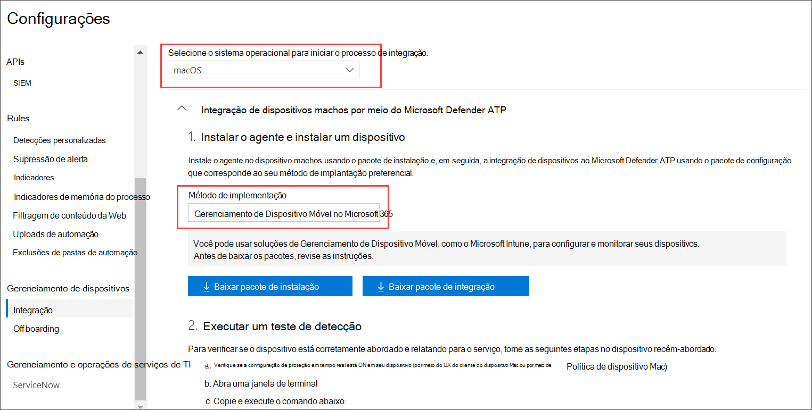

3. Selecione **Baixar pacote de instalação**. Salve-o _como wdav.pkg_ em um diretório local.

4. Selecione **Baixar pacote de integração**. Salve-o _comoWindowsDefenderATPOnboardingPackage.zip_ no mesmo diretório.

5. Baixe **IntuneAppUtil** de [https://docs.microsoft.com/intune/lob-apps-macos](https://docs.microsoft.com/intune/lob-apps-macos) .

6. Em um prompt de comando, verifique se você tem os três arquivos.
  

    ```bash
    ls -l
    ```

    ```Output
    total 721688
    -rw-r--r--  1 test  staff     269280 Mar 15 11:25 IntuneAppUtil
    -rw-r--r--  1 test  staff      11821 Mar 15 09:23 WindowsDefenderATPOnboardingPackage.zip
    -rw-r--r--  1 test  staff  354531845 Mar 13 08:57 wdav.pkg
    ```
7. Extraia o conteúdo dos arquivos .zip:

    ```bash
    unzip WindowsDefenderATPOnboardingPackage.zip
    ```
    ```Output
    Archive:  WindowsDefenderATPOnboardingPackage.zip
    warning:  WindowsDefenderATPOnboardingPackage.zip appears to use backslashes as path separators
      inflating: intune/kext.xml
      inflating: intune/WindowsDefenderATPOnboarding.xml
      inflating: jamf/WindowsDefenderATPOnboarding.plist
    ```

8. Tornar IntuneAppUtil um executável:

    ```bash
    chmod +x IntuneAppUtil
    ```

9. Crie o pacote wdav.pkg.intunemac de wdav.pkg:

    ```bash
    ./IntuneAppUtil -c wdav.pkg -o . -i "com.microsoft.wdav" -n "1.0.0"
    ```
    ```Output
    Microsoft Intune Application Utility for Mac OS X
    Version: 1.0.0.0
    Copyright 2018 Microsoft Corporation

    Creating intunemac file for /Users/test/Downloads/wdav.pkg
    Composing the intunemac file output
    Output written to ./wdav.pkg.intunemac.

    IntuneAppUtil successfully processed "wdav.pkg",
    to deploy refer to the product documentation.
    ```

## <a name="client-device-setup"></a>Configuração de dispositivo cliente

Você não precisa de nenhum provisionamento especial para um dispositivo Mac além de uma instalação padrão [do Portal da Empresa.](https://docs.microsoft.com/intune-user-help/enroll-your-device-in-intune-macos-cp)

1. Confirme o gerenciamento de dispositivos.

   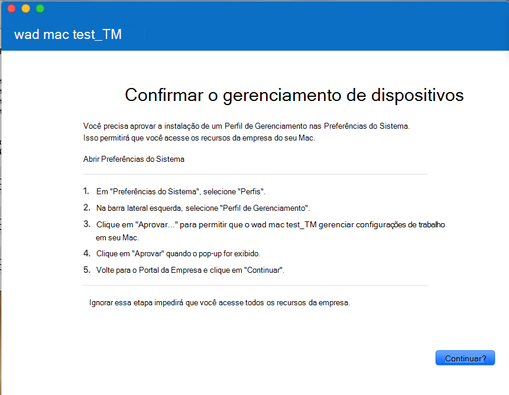

    Selecione **Abrir Preferências do Sistema,** localize **o Perfil** de Gerenciamento na lista e selecione **Aprovar...**. Seu Perfil de Gerenciamento seria exibido como **Verificado**:

    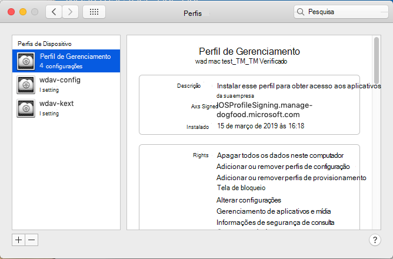

2. Selecione **Continuar** e conclua o registro.

   Agora você pode registrar mais dispositivos. Você também pode inscrevi-los mais tarde, depois de terminar de provisionar a configuração do sistema e os pacotes de aplicativos.

3. No Intune, abra **Gerenciar**  >  **Dispositivos**  >  **Todos os dispositivos**. Aqui você pode ver seu dispositivo entre os listados:

   > [!div class="mx-imgBorder"]
   > 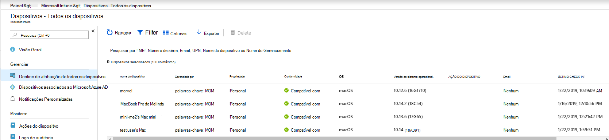

## <a name="approve-system-extensions"></a>Aprovar extensões do sistema

Para aprovar as extensões do sistema:

1. No Intune, abra **Gerenciar**  >  **configuração do dispositivo**. Selecione **Gerenciar**  >    >  **Perfis Criar Perfil**.

2. Escolha um nome para o perfil. Alterar **Platform=macOS** para **Profile type=Extensions**. Selecione **Criar**.

3. Na guia **Noções Básicas,** dê um nome a esse novo perfil.

4. Na guia **Configuração de configurações,** adicione as seguintes entradas na seção **Extensões do sistema permitidos:**

    Identificador de pacote         | Identificador de equipe
    --------------------------|----------------
    com.microsoft.wdav.epsext | UBF8T346G9
    com.microsoft.wdav.netext | UBF8T346G9

    > [!div class="mx-imgBorder"]
    > 

5. Na guia **Atribuições,** atribua esse perfil a **Todos os Usuários & Todos os dispositivos**.

6. Revise e crie esse perfil de configuração.

## <a name="create-system-configuration-profiles"></a>Criar perfis de configuração do sistema

1. No Intune, abra **Gerenciar**  >  **configuração do dispositivo**. Selecione **Gerenciar**  >    >  **Perfis Criar Perfil**.

2. Escolha um nome para o perfil. Alterar **Platform=macOS** para **Profile type=Custom**. Selecione **Configurar**.

3. Abra o perfil de configuração e carregue o intune/kext.xml. Esse arquivo foi criado em uma das seções anteriores.

4. Clique em **OK**.

    

5. Selecione **Gerenciar**  >  **atribuições**. Na guia **Incluir,** selecione **Atribuir a Todos os Usuários & Todos os dispositivos**.

6. Repita as etapas de 1 a 5 para mais perfis.

7. Crie outro perfil, dê um nome e carregue o arquivo do intune/WindowsDefenderATPOnboarding.xml.

8. Baixe **fulldisk.mobileconfig** do [repositório do GitHub](https://raw.githubusercontent.com/microsoft/mdatp-xplat/master/macos/mobileconfig/profiles/fulldisk.mobileconfig) e salve-o como **tcc.xml**. Crie outro perfil, dê qualquer nome e carregue esse arquivo nele.<a name="create-system-configuration-profiles-step-8" id = "create-system-configuration-profiles-step-8"></a>

   > [!CAUTION]
   > O macOS 10.15 (Catalina) contém novos aprimoramentos de segurança e privacidade. A partir dessa versão, por padrão, os aplicativos não são capazes de acessar determinados locais no disco (como Documentos, Downloads, Área de Trabalho, etc.) sem consentimento explícito. Na ausência desse consentimento, o Microsoft Defender para Ponto de Extremidade não é capaz de proteger totalmente seu dispositivo.
   >
   > Esse perfil de configuração concede acesso total em disco ao Microsoft Defender para Ponto de Extremidade. Se você configurou anteriormente o Microsoft Defender para Ponto de Extremidade por meio do Intune, recomendamos atualizar a implantação com esse perfil de configuração.

9. Como parte dos recursos de Detecção e Resposta do Ponto de Extremidade, o Microsoft Defender para Ponto de Extremidade no macOS inspeciona o tráfego de soquete e relata essas informações ao portal do Centro de Segurança do Microsoft Defender. A política a seguir permite que a extensão de rede execute essa funcionalidade. Baixe **netfilter.mobileconfig** do repositório [do GitHub,](https://raw.githubusercontent.com/microsoft/mdatp-xplat/master/macos/mobileconfig/profiles/netfilter.mobileconfig)salve-o como netext.xml e implante-o usando as mesmas etapas das seções anteriores. <a name = "create-system-configuration-profiles-step-9" id = "create-system-configuration-profiles-step-9"></a>

10. Para permitir que o Microsoft Defender para o Ponto de Extremidade no macOS e o Microsoft Auto Update eximem notificações na interface do usuário no macOS 10.15 (Catalina), baixe do repositório `notif.mobileconfig` [do GitHub](https://raw.githubusercontent.com/microsoft/mdatp-xplat/master/macos/mobileconfig/profiles/notif.mobileconfig) e importe-o como uma carga personalizada. <a name = "create-system-configuration-profiles-step-10" id = "create-system-configuration-profiles-step-10"></a>

11. Selecione **Gerenciar > atribuições**.  Na guia **Incluir,** selecione **Atribuir a Todos os Usuários & Todos os dispositivos**.

Depois que as alterações do Intune são propagadas para os dispositivos inscritos, você pode vê-las listadas em **Monitor**  >  **Device status**:

> [!div class="mx-imgBorder"]
> 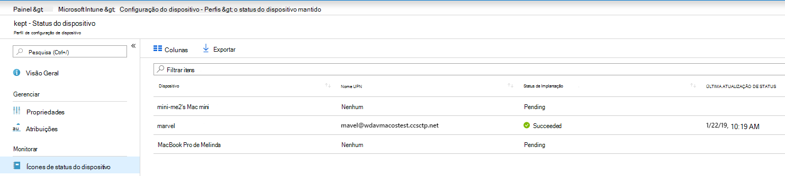

## <a name="publish-application"></a>Publicar aplicativo

1. No Intune, abra a folha Gerenciar > **aplicativos cliente.** Selecione **Aplicativos > Adicionar**.

2. Selecione **Tipo de aplicativo=Outro/Aplicativo de Linha de Negócios.**

3. Selecione **file=wdav.pkg.intunemac**. Selecione **OK** para carregar.

4. Selecione **Configurar** e adicionar as informações necessárias.

5. Use **macOS High Sierra 10.14** como o sistema operacional mínimo.

6. Definir *Ignorar versão do aplicativo* como **Sim**. Outras configurações podem ser qualquer valor arbitrário.

    > [!CAUTION]
    > Definir *Ignorar versão do aplicativo* como **Nenhuma** afeta a capacidade do aplicativo de receber atualizações por meio do Microsoft AutoUpdate. Consulte [Deploy updates for Microsoft Defender for Endpoint on macOS](mac-updates.md) para obter informações adicionais sobre como o produto é atualizado.
    >
    > Se a versão carregada pelo Intune for menor do que a versão no dispositivo, a versão inferior será instalada, rebaixando efetivamente o Microsoft Defender para o Ponto de Extremidade. Isso pode resultar em um aplicativo que não está funcionando. Consulte [Deploy updates for Microsoft Defender for Endpoint on macOS](mac-updates.md) para obter informações adicionais sobre como o produto é atualizado. Se você implantou o Microsoft Defender para Ponto de Extremidade *com Ignorar a* versão do aplicativo definida como **Não**, altere-a para **Sim**. Se o Microsoft Defender for Endpoint ainda não puder ser instalado em um dispositivo cliente, desinstale o Microsoft Defender para Ponto de Extremidade e pressione a política atualizada.
     
    > [!div class="mx-imgBorder"]
    > 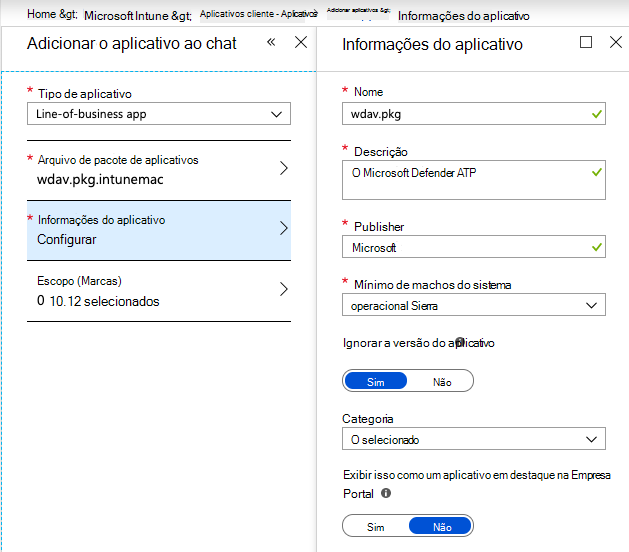

7. Selecione **OK** e **Adicionar**.

    > [!div class="mx-imgBorder"]
    > 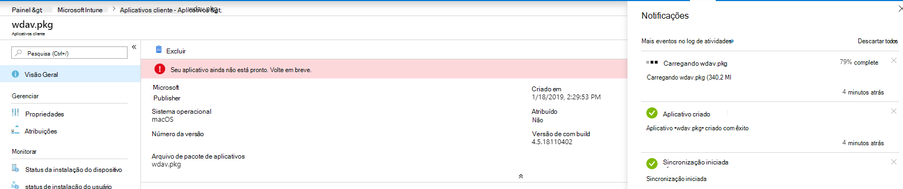

8. Pode levar alguns instantes para carregar o pacote. Depois de terminar, selecione o pacote na lista e vá para **Atribuições** e **Adicionar grupo**.

    > [!div class="mx-imgBorder"]
    > 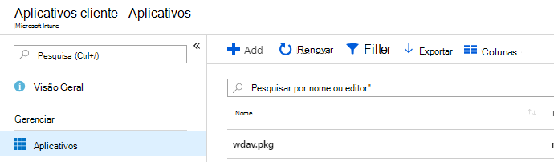

9. Alterar **o tipo de** atribuição para **Obrigatório.**

10. Selecione **Grupos Incluídos**. Selecione **Tornar esse aplicativo necessário para todos os dispositivos=Sim**. Selecione **Selecionar grupo para incluir** e adicionar um grupo que contém os usuários que você deseja direcionar. Selecione **OK** e **Salvar**.

    > [!div class="mx-imgBorder"]
    > 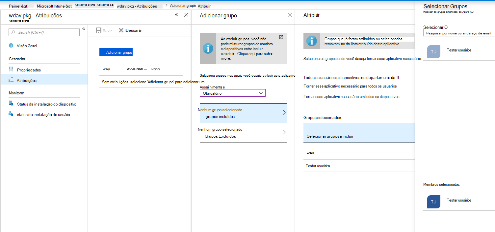

11. Após algum tempo, o aplicativo será publicado em todos os dispositivos inscritos. Você pode vê-lo listado em **Monitor**  >  **Device**, em **Status de instalação do dispositivo**:

    > [!div class="mx-imgBorder"]
    > 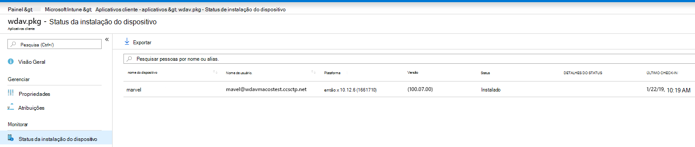

## <a name="verify-client-device-state"></a>Verificar o estado do dispositivo cliente

1. Depois que os perfis de configuração são implantados em seus **dispositivos,** abra Perfis de Preferências do Sistema  >   em seu dispositivo Mac.

    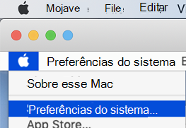<br/>
    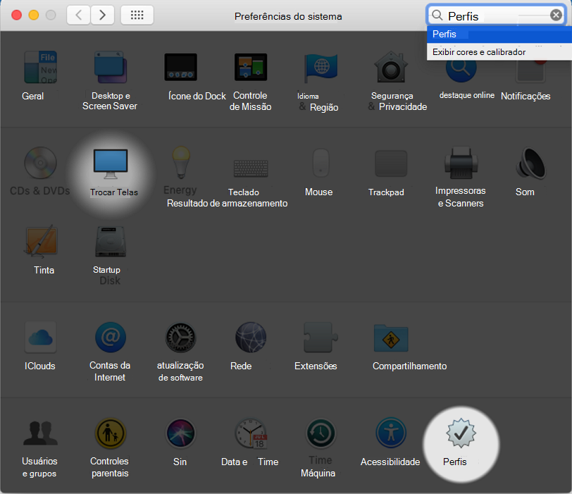

2. Verifique se os perfis de configuração a seguir estão presentes e instalados. O **Perfil de Gerenciamento** deve ser o perfil do sistema do Intune. _Wdav-config_ e _wdav-kext_ são perfis de configuração do sistema que foram adicionados ao Intune: Captura de tela 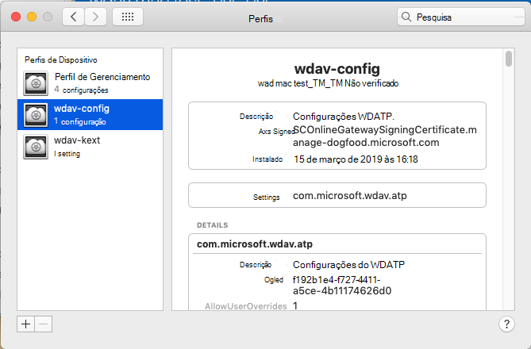

3. Você também deve ver o ícone do Microsoft Defender no canto superior direito:

    > [!div class="mx-imgBorder"]
    > 

## <a name="troubleshooting"></a>Solução de problemas

Problema: nenhuma licença encontrada

Solução: siga as etapas acima para criar um perfil de dispositivo usando WindowsDefenderATPOnboarding.xml

## <a name="logging-installation-issues"></a>Problemas de instalação de log

Para obter mais informações sobre como encontrar o log gerado automaticamente que é criado pelo instalador quando ocorre um [erro,](mac-resources.md#logging-installation-issues)consulte Logging installation issues .

## <a name="uninstallation"></a>Desinstalação

Consulte [Desinstalar](mac-resources.md#uninstalling) para obter detalhes sobre como remover o Microsoft Defender para o Ponto de Extremidade no macOS de dispositivos cliente.
