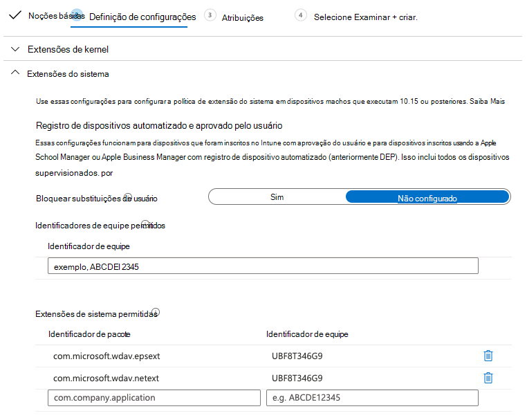
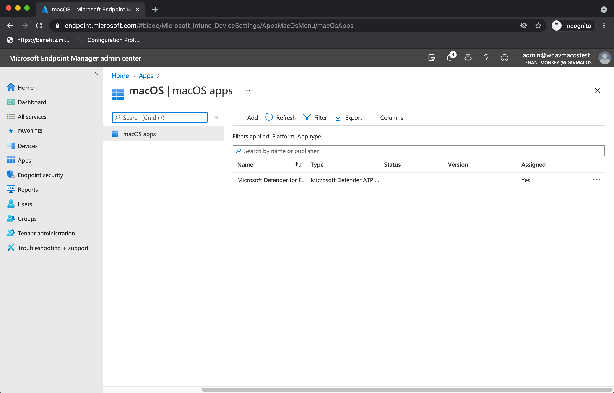

# <a name="intune-based-deployment-for-microsoft-defender-for-endpoint-on-macos"></a>Implantação baseada no Intune para o Microsoft Defender para Ponto de Extremidade no macOS

[!INCLUDE [Microsoft 365 Defender rebranding](../../includes/microsoft-defender.md)]

**Aplica-se a:**

- [Microsoft Defender para Ponto de Extremidade no macOS](microsoft-defender-endpoint-mac.md)

Este tópico descreve como implantar o Microsoft Defender para Ponto de Extremidade no macOS por meio do Intune. Uma implantação bem-sucedida requer a conclusão de todas as etapas a seguir:

1. [Baixar o pacote de integração](#download-the-onboarding-package)
1. [Configuração de dispositivo cliente](#client-device-setup)
1. [Aprovar extensões do sistema](#approve-system-extensions)
1. [Criar perfis de configuração do sistema](#create-system-configuration-profiles)
1. [Publicar aplicativo](#publish-application)

## <a name="prerequisites-and-system-requirements"></a>Pré-requisitos e requisitos do sistema

Antes de começar, consulte a página principal do Microsoft Defender para Ponto de Extremidade no [macOS](microsoft-defender-endpoint-mac.md) para obter uma descrição dos pré-requisitos e requisitos do sistema para a versão de software atual.

## <a name="overview"></a>Visão Geral

A tabela a seguir resume as etapas necessárias para implantar e gerenciar o Microsoft Defender para Ponto de Extremidade em Macs, por meio do Intune. Etapas mais detalhadas estão disponíveis abaixo.

| Etapa | Exemplo de nomes de arquivo | BundleIdentifier |
|-|-|-|
| [Baixar o pacote de integração](#download-the-onboarding-package) | WindowsDefenderATPOnboarding__MDATP_wdav.atp.xml | com.microsoft.wdav.atp |
| [Aprovar Extensão do Sistema para o Microsoft Defender para Ponto de Extremidade](#approve-system-extensions) | MDATP_SysExt.xml | N/A |
| [Aprovar Extensão de Kernel para o Microsoft Defender para Ponto de Extremidade](#download-the-onboarding-package) | MDATP_KExt.xml | N/A |
| [Conceder acesso em disco completo ao Microsoft Defender para Ponto de Extremidade](#full-disk-access) | MDATP_tcc_Catalina_or_newer.xml | com.microsoft.wdav.tcc |
| [Política de Extensão de Rede](#network-filter) | MDATP_NetExt.xml | N/A |
| [Configurar o Microsoft AutoUpdate (MAU)](mac-updates.md#intune) | MDATP_Microsoft_AutoUpdate.xml | com.microsoft.autoupdate2 |
| [Configurações do Microsoft Defender para Ponto de Extremidade](mac-preferences.md#intune-profile-1)<br/><br/> **Observação:** Se você estiver planejando executar um AV de terceiros para macOS, de acordo `passiveMode` com `true` . | MDATP_WDAV_and_exclusion_settings_Preferences.xml | com.microsoft.wdav |
| [Configurar notificações do Microsoft Defender para Endpoint e MS AutoUpdate (MAU)](mac-updates.md) | MDATP_MDAV_Tray_and_AutoUpdate2.mobileconfig | com.microsoft.autoupdate2 ou com.microsoft.wdav.tray |


## <a name="download-the-onboarding-package"></a>Baixar o pacote de integração

Baixe os pacotes de integração Central de Segurança do Microsoft Defender:

1. Em Central de Segurança do Microsoft Defender, vá **para** Configurações  >  **Gerenciamento de**  >  **Dispositivos Integrando**.

2. De definir o sistema operacional como **macOS** e o método de implantação como **Gerenciamento de Dispositivo Móvel/Microsoft Intune**.

    

3. Selecione **Baixar pacote de integração**. Salve-o _comoWindowsDefenderATPOnboardingPackage.zip_ no mesmo diretório.

4. Extraia o conteúdo do arquivo .zip:

    ```bash
    unzip WindowsDefenderATPOnboardingPackage.zip
    ```
    ```Output
    Archive:  WindowsDefenderATPOnboardingPackage.zip
    warning:  WindowsDefenderATPOnboardingPackage.zip appears to use backslashes as path separators
      inflating: intune/kext.xml
      inflating: intune/WindowsDefenderATPOnboarding.xml
      inflating: jamf/WindowsDefenderATPOnboarding.plist
    ```

## <a name="create-system-configuration-profiles"></a>Criar perfis de configuração do sistema

A próxima etapa é criar perfis de configuração do sistema que o Microsoft Defender for Endpoint precisa.
No centro [de Microsoft Endpoint Manager de administração,](https://endpoint.microsoft.com/)abra **perfis de**  >  **Configuração de Dispositivos.**

### <a name="onboarding-blob"></a>Blob de integração

Este perfil contém informações de licença para o Microsoft Defender para Ponto de Extremidade, sem ele informará que não está licenciado.

1. Selecione **Criar Perfil em** **Perfis de Configuração**.
1. Selecione **Plataforma** = **macOS,** **Modelos de tipo** de = **perfil.** **Nome do modelo** = **Personalizado**. Clique em **Criar**.

    > [!div class="mx-imgBorder"]
    > 

1. Escolha um nome para o perfil, por exemplo, "Integração do MDE para macOS". Clique em **Avançar**.

    > [!div class="mx-imgBorder"]
    > 

1. Escolha um nome para o nome do perfil de configuração, por exemplo, "Integração do MDE para macOS".
1. Selecione o intune/WindowsDefenderATPOnboarding.xml que você extraiu do pacote de integração acima como arquivo de perfil de configuração.

    > [!div class="mx-imgBorder"]
    > 

1. Clique em **Avançar**.
1. Atribuir dispositivos na guia **Atribuição.** Clique **em Próximo**.

    > [!div class="mx-imgBorder"]
    > 

1. Revisar e **criar**.
1. Abra **perfis**  >  **de configuração de** dispositivos, você pode ver seu perfil criado lá.

    > [!div class="mx-imgBorder"]
    > 

### <a name="approve-system-extensions"></a>Aprovar extensões do sistema

Esse perfil é necessário para macOS 10.15 (Catalina) ou mais novo. Ele será ignorado em macOS mais antigo.

1. Selecione **Criar Perfil em** **Perfis de Configuração**.
1. Selecione **Plataforma** = **macOS,** **Modelos de tipo** de = **perfil.** **Nome do modelo** = **Extensões**. Clique em **Criar**.
1. Na guia **Noções Básicas,** dê um nome a esse novo perfil.
1. Na guia **Configuração de configurações,** **expanda Extensões** do Sistema adicione as seguintes entradas na seção **Extensões de sistema permitidos:**

    Identificador de pacote         | Identificador de equipe
    --------------------------|----------------
    com.microsoft.wdav.epsext | UBF8T346G9
    com.microsoft.wdav.netext | UBF8T346G9

    > [!div class="mx-imgBorder"]
    > 

1. Na guia **Atribuições,** atribua esse perfil a **Todos os Usuários & Todos os dispositivos**.
1. Revise e crie esse perfil de configuração.

### <a name="kernel-extensions"></a>Extensões de Kernel

Esse perfil é necessário para macOS 10.15 (Catalina) ou mais antigo. Ele será ignorado no macOS mais novo.

> [!CAUTION]
> Os dispositivos Apple Silicon (M1) não suportam KEXT. A instalação de um perfil de configuração que consiste em políticas KEXT falhará nesses dispositivos.

1. Selecione **Criar Perfil em** **Perfis de Configuração**.
1. Selecione **Plataforma** = **macOS,** **Modelos de tipo** de = **perfil.** **Nome do modelo** = **Extensões**. Clique em **Criar**.
1. Na guia **Noções Básicas,** dê um nome a esse novo perfil.
1. Na guia **Configuração,** expanda **Extensões de Kernel**.
1. De **definir o identificador de equipe** como **UBF8T346G9** e clique em **Próximo**.

    > [!div class="mx-imgBorder"]
    > 

1. Na guia **Atribuições,** atribua esse perfil a **Todos os Usuários & Todos os dispositivos**.
1. Revise e crie esse perfil de configuração.

### <a name="full-disk-access"></a>Acesso total ao disco

   > [!CAUTION]
   > O macOS 10.15 (Catalina) contém novos aprimoramentos de segurança e privacidade. A partir dessa versão, por padrão, os aplicativos não são capazes de acessar determinados locais no disco (como Documentos, Downloads, Área de Trabalho, etc.) sem consentimento explícito. Na ausência desse consentimento, o Microsoft Defender para Ponto de Extremidade não é capaz de proteger totalmente seu dispositivo.
   >
   > Esse perfil de configuração concede acesso total em disco ao Microsoft Defender para Ponto de Extremidade. Se você configurou anteriormente o Microsoft Defender para Ponto de Extremidade por meio do Intune, recomendamos atualizar a implantação com esse perfil de configuração.

Baixe [**fulldisk.mobileconfig**](https://raw.githubusercontent.com/microsoft/mdatp-xplat/master/macos/mobileconfig/profiles/fulldisk.mobileconfig) em [nosso repositório GitHub .](https://github.com/microsoft/mdatp-xplat/tree/master/macos/mobileconfig/profiles)

Siga as instruções para [o blob onboarding](#onboarding-blob) acima, usando "MDE Full Disk Access" como nome de perfil e baixado **fulldisk.mobileconfig** como nome de perfil de configuração.

### <a name="network-filter"></a>Filtro de Rede

Como parte dos recursos de Detecção e Resposta do Ponto de Extremidade, o Microsoft Defender para Ponto de Extremidade no macOS inspeciona o tráfego de soquete e relata essas informações ao portal Central de Segurança do Microsoft Defender. A política a seguir permite que a extensão de rede execute essa funcionalidade.

Baixe [**netfilter.mobileconfig**](https://raw.githubusercontent.com/microsoft/mdatp-xplat/master/macos/mobileconfig/profiles/netfilter.mobileconfig) em [nosso repositório GitHub.](https://github.com/microsoft/mdatp-xplat/tree/master/macos/mobileconfig/profiles)

Siga as instruções para [o blob onboarding](#onboarding-blob) acima, usando "Filtro de Rede MDE" como nome de perfil e baixado **netfilter.mobileconfig** como nome de perfil de configuração.

### <a name="notifications"></a>Notificações

Esse perfil é usado para permitir que o Microsoft Defender para o Ponto de Extremidade no macOS e o Microsoft Auto Update eximem notificações na interface do usuário no macOS 10.15 (Catalina) ou mais recente.

Baixe [**notif.mobileconfig**](https://raw.githubusercontent.com/microsoft/mdatp-xplat/master/macos/mobileconfig/profiles/notif.mobileconfig) em [nosso repositório GitHub.](https://github.com/microsoft/mdatp-xplat/tree/master/macos/mobileconfig/profiles)

Siga as instruções para [o blob onboarding](#onboarding-blob) acima, usando "Notificações MDE" como nome de perfil e baixado **notif.mobileconfig** como nome de perfil de configuração.

### <a name="view-status"></a>Exibir Status

Depois que as alterações do Intune são propagadas para os dispositivos inscritos, você pode vê-las listadas em **Monitor**  >  **Device status**:

> [!div class="mx-imgBorder"]
> 

## <a name="publish-application"></a>Publicar aplicativo

Esta etapa permite a implantação do Microsoft Defender para Ponto de Extremidade em máquinas inscritas.

1. No centro [Microsoft Endpoint Manager de administração,](https://endpoint.microsoft.com/)abra **Aplicativos.**

    > [!div class="mx-imgBorder"]
    > 

1. Selecione Por plataforma > macOS > Adicionar.
1. Escolha **Tipo de** aplicativo = **macOS,** clique em **Selecionar**.

    > [!div class="mx-imgBorder"]
    > 

1. Mantenha valores padrão, clique em **Próximo**.

    > [!div class="mx-imgBorder"]
    > 

1. Adicionar atribuições, clique em **Próximo**.

    > [!div class="mx-imgBorder"]
    > 

1. Revisar e **criar**.
1. Você pode visitar **Aplicativos**  >  **Por**  >  **plataforma macOS** para vê-lo na lista de todos os aplicativos.

    > [!div class="mx-imgBorder"]
    > 

(Você pode encontrar informações detalhadas na [página do Intune para implantação do Defender](/mem/intune/apps/apps-advanced-threat-protection-macos).)

   > [!CAUTION]
   > Você precisa criar todos os perfis de configuração necessários e insinuá-los em todos os dispositivos, conforme explicado acima.

## <a name="client-device-setup"></a>Configuração de dispositivo cliente

Você não precisa de nenhum provisionamento especial para um dispositivo Mac além de uma instalação [Portal da Empresa padrão.](/intune-user-help/enroll-your-device-in-intune-macos-cp)

1. Confirme o gerenciamento de dispositivos.

    > [!div class="mx-imgBorder"]
    > 

    Selecione **Abrir Preferências do Sistema,** localize **o Perfil** de Gerenciamento na lista e selecione **Aprovar...**. Seu Perfil de Gerenciamento seria exibido como **Verificado**:

    

2. Selecione **Continuar** e conclua o registro.

   Agora você pode registrar mais dispositivos. Você também pode inscrevi-los mais tarde, depois de terminar de provisionar a configuração do sistema e os pacotes de aplicativos.

3. No Intune, abra **Gerenciar**  >  **Dispositivos**  >  **Todos os dispositivos**. Aqui você pode ver seu dispositivo entre os listados:

   > [!div class="mx-imgBorder"]
   > 

## <a name="verify-client-device-state"></a>Verificar o estado do dispositivo cliente

1. Depois que os perfis de configuração são implantados em seus **dispositivos,** abra Perfis de Preferências do Sistema  >   em seu dispositivo Mac.

    > [!div class="mx-imgBorder"]
    > 

    

2. Verifique se os perfis de configuração a seguir estão presentes e instalados. O **Perfil de Gerenciamento** deve ser o perfil do sistema do Intune. _O Wdav-config_ e _o wdav-kext_ são perfis de configuração do sistema que foram adicionados ao Intune:

    

3. Você também deve ver o ícone do Microsoft Defender para Ponto de Extremidade no canto superior direito:

    > [!div class="mx-imgBorder"]
    > 

## <a name="troubleshooting"></a>Solução de problemas

Problema: nenhuma licença encontrada.

Solução: siga as etapas acima para criar um perfil de dispositivo usando WindowsDefenderATPOnboarding.xml.

## <a name="logging-installation-issues"></a>Problemas de instalação de log

Para obter mais informações sobre como encontrar o log gerado automaticamente que é criado pelo instalador quando ocorre um [erro,](mac-resources.md#logging-installation-issues)consulte Logging installation issues .

## <a name="uninstallation"></a>Desinstalação

Consulte [Desinstalar](mac-resources.md#uninstalling) para obter detalhes sobre como remover o Microsoft Defender para o Ponto de Extremidade no macOS de dispositivos cliente.
