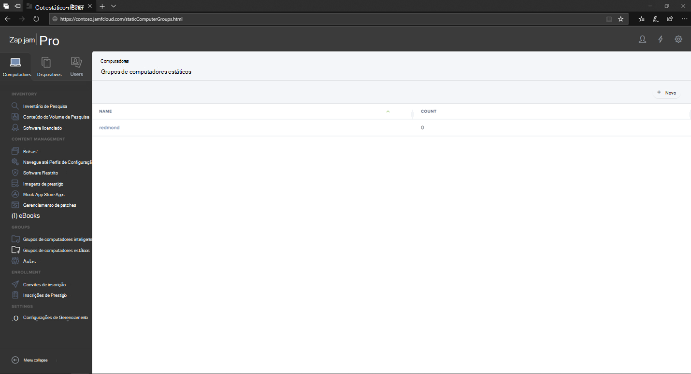
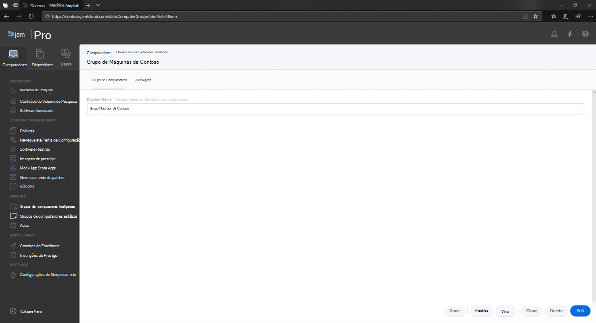
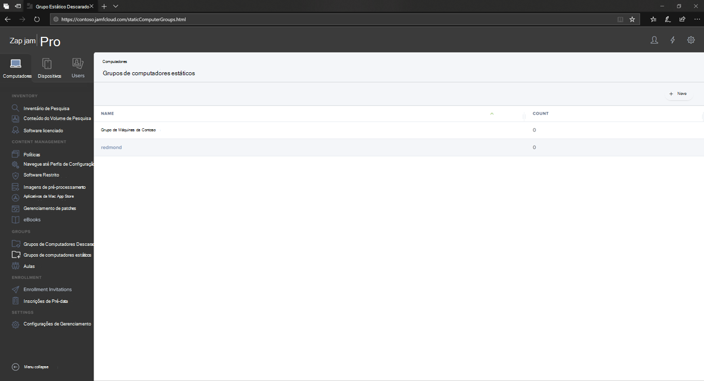

# Configurar o Microsoft Defender para Ponto de Extremidade em grupos de dispositivos macOS no Jamf ProSet up Microsoft Defender for Endpoint on macOS device groups in Jamf Pro

[!INCLUDE [Microsoft 365 Defender rebranding](../../includes/microsoft-defender.md)]

**Aplica-se a:****Applies to:**
- [Microsoft Defender para Ponto de ExtremidadeMicrosoft Defender for Endpoint](https://go.microsoft.com/fwlink/p/?linkid=2154037)
- [Microsoft 365 DefenderMicrosoft 365 Defender](https://go.microsoft.com/fwlink/?linkid=2118804)

> Deseja experimentar o Defender para Ponto de Extremidade?Want to experience Defender for Endpoint? [Inscreva-se para uma avaliação gratuita.Sign up for a free trial.](https://www.microsoft.com/microsoft-365/windows/microsoft-defender-atp?ocid=docs-wdatp-investigateip-abovefoldlink)

Configurar os grupos de dispositivos semelhantes às OUs (organização de política de grupo), conjunto de dispositivos do Microsoft Endpoint Configuration Manager e grupos de dispositivos do Intune.Set up the device groups similar to Group policy  organizational unite (OUs), Microsoft Endpoint Configuration Manager's device collection, and Intune's device groups.

1. Navegue **até Grupos de Computadores Estáticos**.Navigate to **Static Computer Groups**.

2. Selecione **Novo**.Select **New**. 

    

3. Forneça um nome de exibição e selecione **Salvar**.Provide a display name and select **Save**.

    

4. Agora você verá o Grupo de **Máquinas da Contoso** em **Grupos de Computadores Estáticos.**Now you will see the **Contoso's Machine Group** under **Static Computer Groups**.

    

## Próxima etapaNext step
- [Configurar o Microsoft Defender para Ponto de Extremidade em políticas macOS no Jamf ProSet up Microsoft Defender for Endpoint on macOS policies in Jamf Pro](mac-jamfpro-policies.md)
