# Registrar o Microsoft Defender para o Ponto de Extremidade para dispositivos macOS no Jamf Pro 

[!INCLUDE [Microsoft 365 Defender rebranding](../../includes/microsoft-defender.md)]

**Aplica-se a:**
- [Microsoft Defender para Ponto de Extremidade](https://go.microsoft.com/fwlink/p/?linkid=2154037)
- [Microsoft 365 Defender](https://go.microsoft.com/fwlink/?linkid=2118804)

> Deseja experimentar o Defender para Ponto de Extremidade? [Inscreva-se para uma avaliação gratuita.](https://www.microsoft.com/microsoft-365/windows/microsoft-defender-atp?ocid=docs-wdatp-investigateip-abovefoldlink)

## Registrar dispositivos macOS

Há vários métodos de registro no JamF.

Este artigo orientará você sobre dois métodos:

- [Método 1: Convites de Inscrição](#enrollment-method-1-enrollment-invitations)
- [Método 2: Prestage Enrollments](#enrollment-method-2-prestage-enrollments)

Para ver uma lista completa, consulte [About Computer Enrollment](https://docs.jamf.com/9.9/casper-suite/administrator-guide/About_Computer_Enrollment.html).

## Método de Inscrição 1: Convites para Inscrição

1. No painel do Jamf Pro, navegue até **Inscrições convites**.

    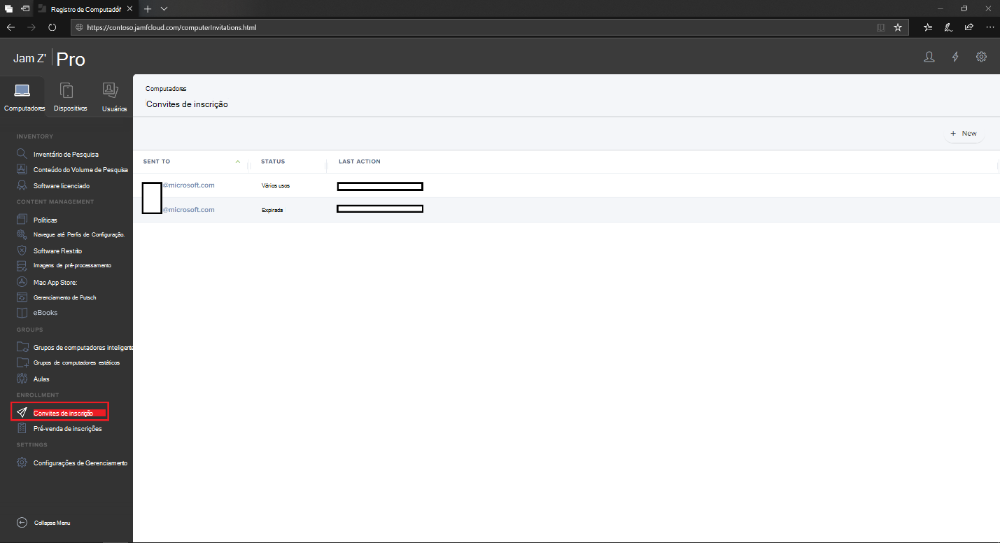

2. Selecione **+ Novo**.

    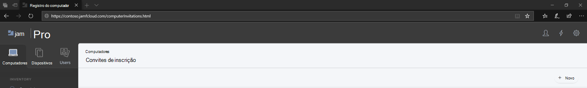

3. Em **Especificar Destinatários para o >** em **Endereços** de Email insira os endereços de email(es) dos destinatários.

    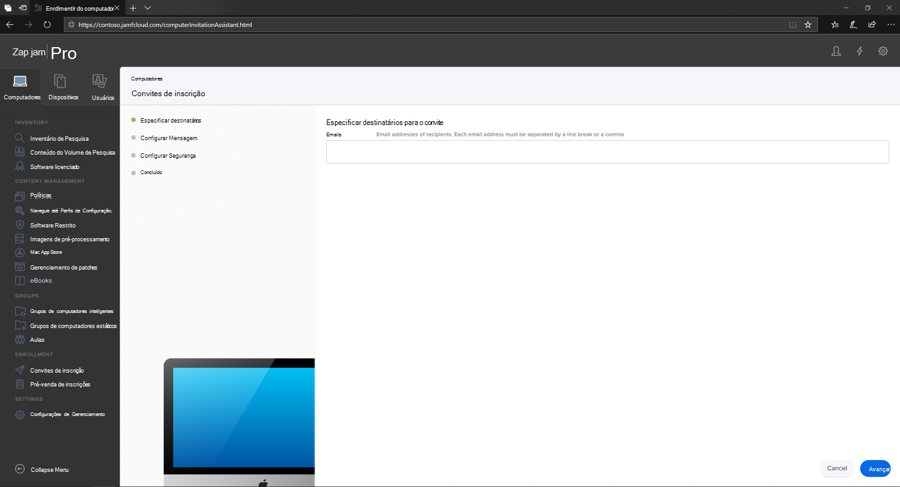

    

    Por exemplo: janedoe@contoso.com

    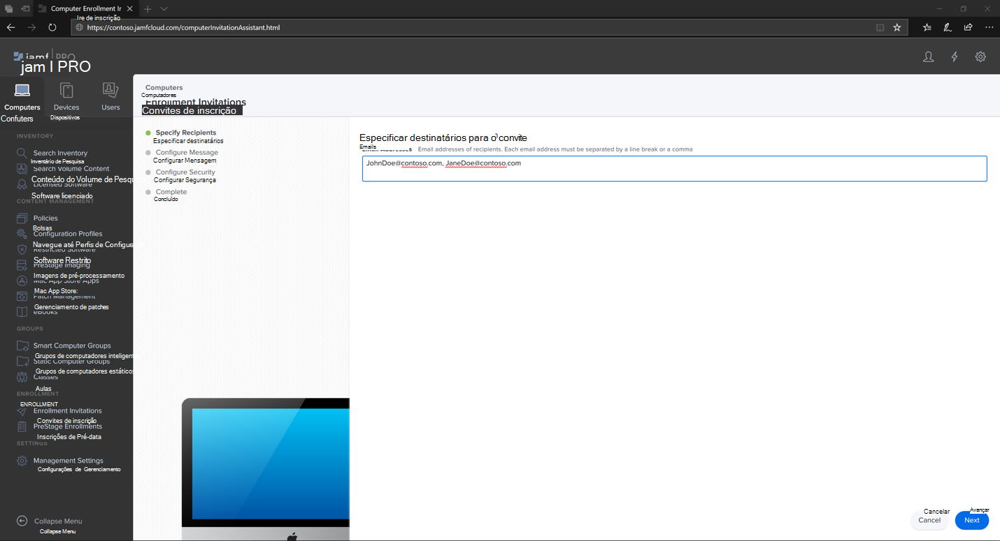

4. Configure a mensagem para o convite.

    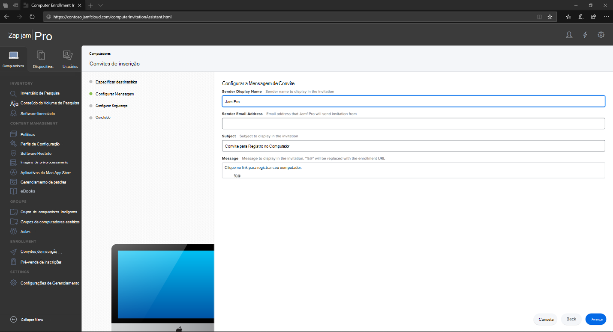

    

    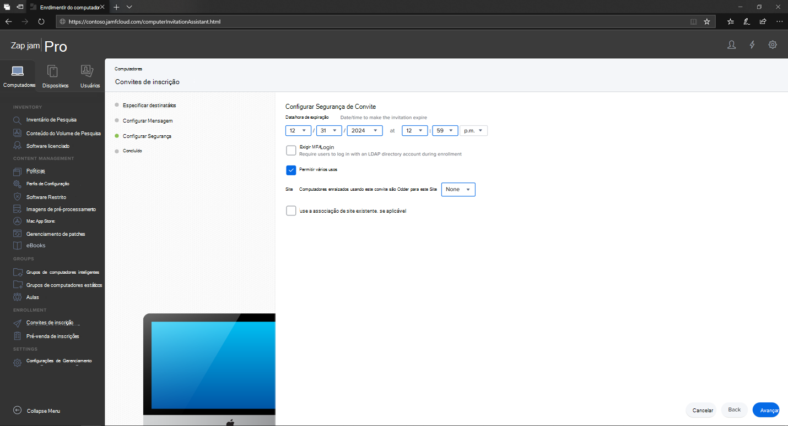

    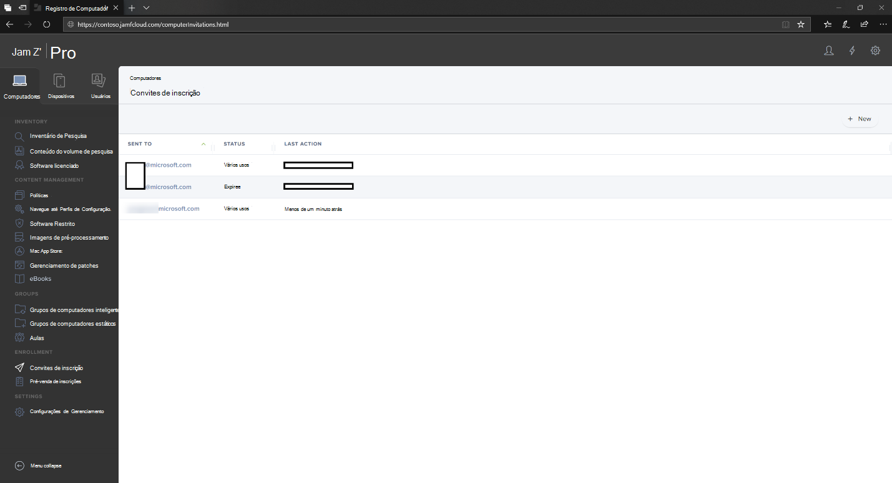

## Método De registro 2: Prestage Enrollments

1. No painel do Jamf Pro, navegue até **Prestage enrollments**.

    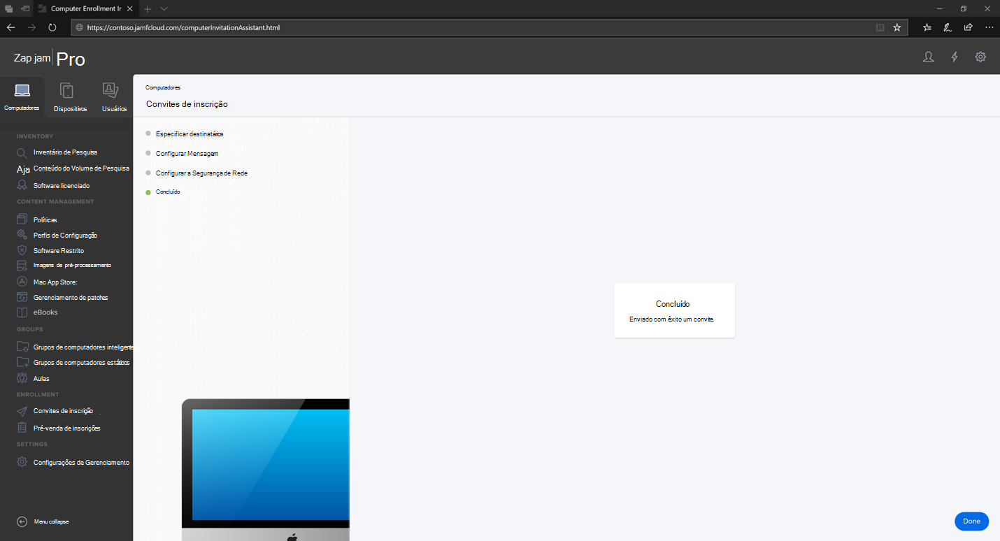

2. Siga as instruções em [Registro de Pré-Etapa do Computador](https://docs.jamf.com/9.9/casper-suite/administrator-guide/Computer_PreStage_Enrollments.html).

## Registrar dispositivo macOS

1. Selecione **Continuar** e instale o certificado ca em uma **janela Preferências do** Sistema.

    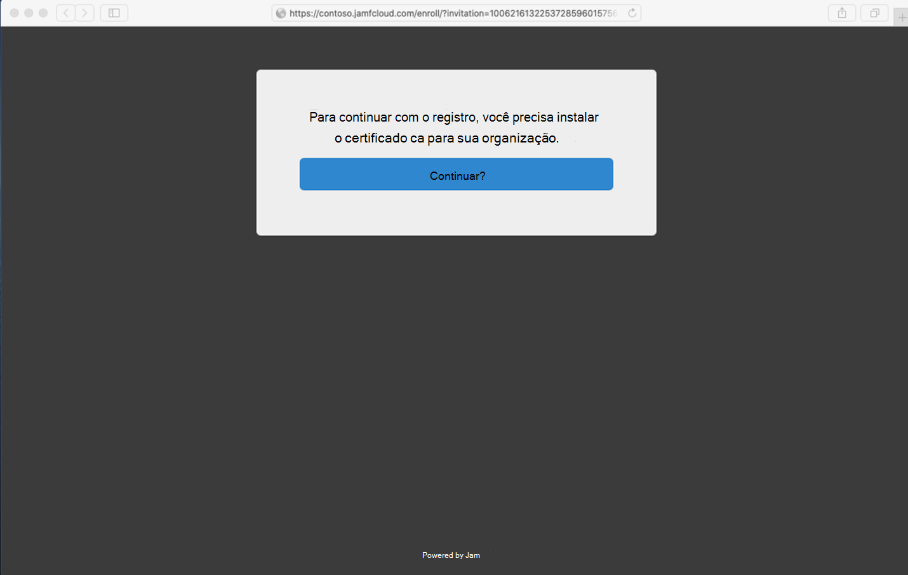

2. Depois que o certificado ca for instalado, retorne à janela do navegador e selecione **Continuar** e instalar o perfil MDM. 

    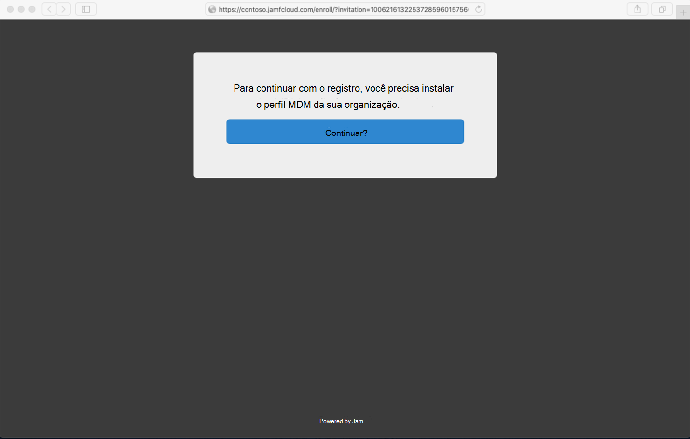

3. Selecione **Permitir** downloads do JAMF.

    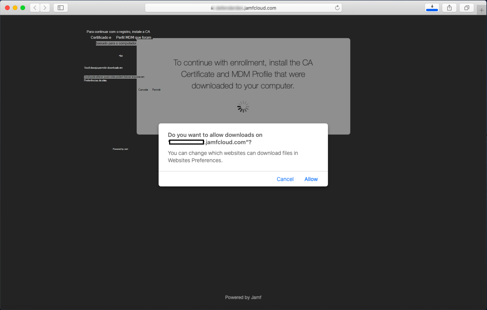

4. Selecione **Continuar** para continuar com a instalação do Perfil MDM. 

    

5. Selecione **Continuar** para instalar o Perfil MDM.

    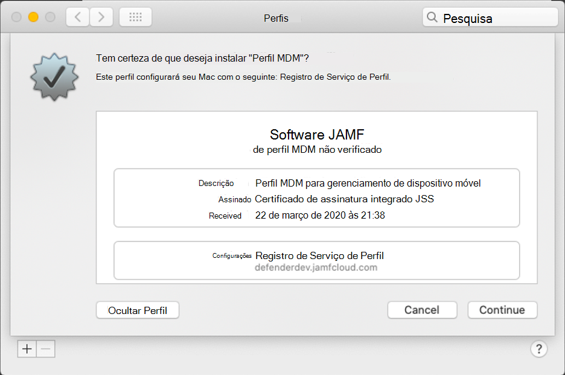

6. Selecione **Continuar**  para concluir a configuração. 

    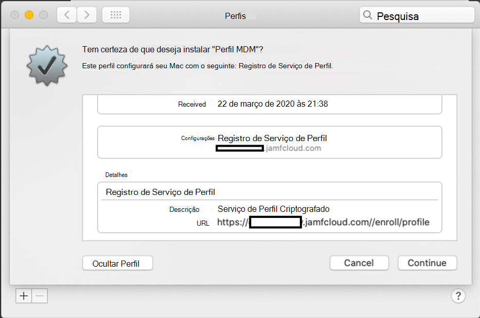
