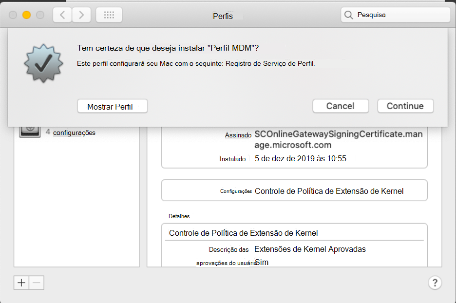

# Registrar o Microsoft Defender para o Ponto de Extremidade em dispositivos macOS no Jamf ProEnroll Microsoft Defender for Endpoint on macOS devices into Jamf Pro 

[!INCLUDE [Microsoft 365 Defender rebranding](../../includes/microsoft-defender.md)]

**Aplica-se a:****Applies to:**
- [Microsoft Defender para Ponto de ExtremidadeMicrosoft Defender for Endpoint](https://go.microsoft.com/fwlink/p/?linkid=2154037)
- [Microsoft 365 DefenderMicrosoft 365 Defender](https://go.microsoft.com/fwlink/?linkid=2118804)

> Deseja experimentar o Defender para Ponto de Extremidade?Want to experience Defender for Endpoint? [Inscreva-se para uma avaliação gratuita.Sign up for a free trial.](https://www.microsoft.com/microsoft-365/windows/microsoft-defender-atp?ocid=docs-wdatp-investigateip-abovefoldlink)

## Registrar dispositivos macOSEnroll macOS devices

Há vários métodos de registro no JamF.There are multiple methods of getting enrolled to JamF.

Este artigo orientará você sobre dois métodos:This article will guide you on two methods:

- [Método 1: Convites de InscriçãoMethod 1:  Enrollment Invitations](#enrollment-method-1-enrollment-invitations)
- [Método 2: Prestage EnrollmentsMethod 2:  Prestage Enrollments](#enrollment-method-2-prestage-enrollments)

Para ver uma lista completa, consulte [About Computer Enrollment](https://docs.jamf.com/9.9/casper-suite/administrator-guide/About_Computer_Enrollment.html).For a complete list, see [About Computer Enrollment](https://docs.jamf.com/9.9/casper-suite/administrator-guide/About_Computer_Enrollment.html).

## Método de Inscrição 1: Convites para InscriçãoEnrollment Method 1: Enrollment Invitations

1. No painel do Jamf Pro, navegue até **Inscrições convites**.In the Jamf Pro dashboard, navigate to **Enrollment invitations**.

    

2. Selecione **+ Novo**.Select **+ New**.

    

3. Em **Especificar Destinatários para o >** em **Endereços** de Email insira os endereços de email(es) dos destinatários.In **Specify Recipients for the Invitation** > under **Email Addresses** enter the e-mail address(es) of the recipients.

    

    

    Por exemplo: janedoe@contoso.comFor example: janedoe@contoso.com

    

4. Configure a mensagem para o convite.Configure the message for the invitation.

    

    

    

    

## Método De registro 2: Prestage EnrollmentsEnrollment Method 2: Prestage Enrollments

1. No painel do Jamf Pro, navegue até **Prestage enrollments**.In the Jamf Pro dashboard, navigate to **Prestage enrollments**.

    

2. Siga as instruções em [Registro de Pré-Etapa do Computador](https://docs.jamf.com/9.9/casper-suite/administrator-guide/Computer_PreStage_Enrollments.html).Follow the instructions in [Computer PreStage Enrollments](https://docs.jamf.com/9.9/casper-suite/administrator-guide/Computer_PreStage_Enrollments.html).

## Registrar dispositivo macOSEnroll macOS device

1. Selecione **Continuar** e instale o certificado ca em uma **janela Preferências do** Sistema.Select **Continue** and install the CA certificate from a **System Preferences** window.

    

2. Depois que o certificado ca for instalado, retorne à janela do navegador e selecione **Continuar** e instalar o perfil MDM.Once CA certificate is installed, return to the browser window and select **Continue** and install the MDM profile. 

    

3. Selecione **Permitir** downloads do JAMF.Select **Allow** to downloads from JAMF.

    

4. Selecione **Continuar** para continuar com a instalação do Perfil MDM.Select **Continue** to proceed with the MDM Profile installation. 

    

5. Selecione **Continuar** para instalar o Perfil MDM.Select **Continue** to install the MDM Profile.

    

6. Selecione **Continuar**  para concluir a configuração.Select **Continue**  to complete the configuration. 

    
