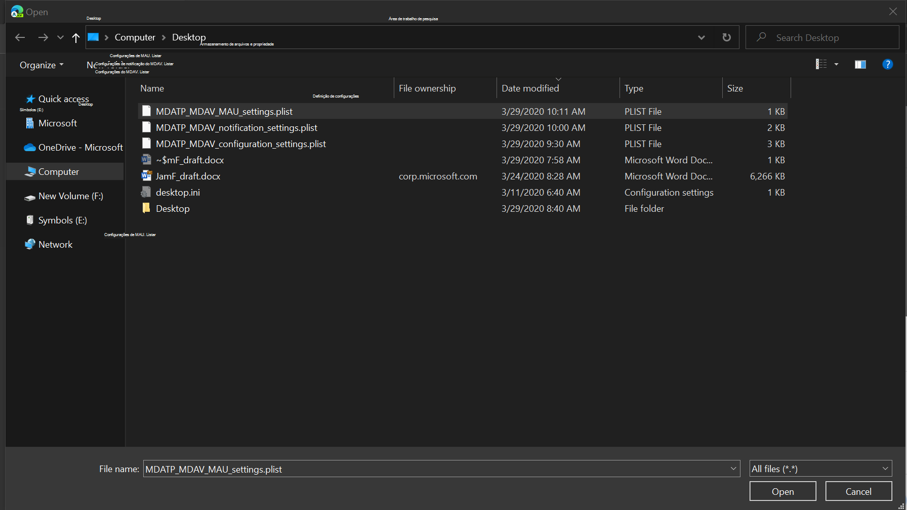
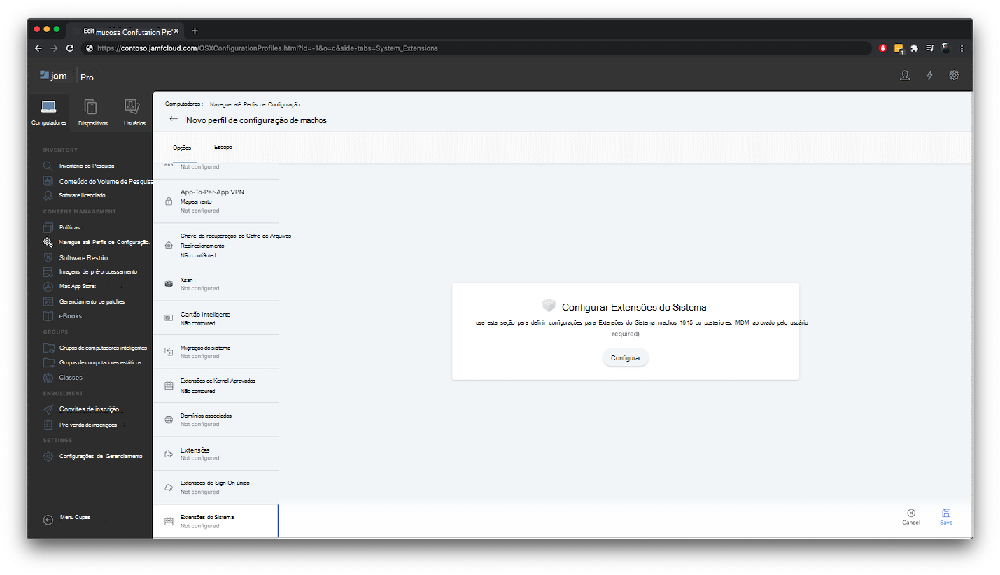

# <a name="set-up-the-microsoft-defender-for-endpoint-on-macos-policies-in-jamf-pro"></a>Configurar o Microsoft Defender para Ponto de Extremidade em políticas macOS no Jamf Pro

[!INCLUDE [Microsoft 365 Defender rebranding](../../includes/microsoft-defender.md)]


**Aplica-se a:**

- [Defender para Ponto de Extremidade no Mac](microsoft-defender-endpoint-mac.md)

Esta página o guiará pelas etapas necessárias para configurar políticas macOS no Jamf Pro.

Você precisará seguir as seguintes etapas:

1. [Obter o pacote de integração do Microsoft Defender para Ponto de Extremidade](#step-1-get-the-microsoft-defender-for-endpoint-onboarding-package)

2. [Criar um perfil de configuração no Jamf Pro usando o pacote de integração](#step-2-create-a-configuration-profile-in-jamf-pro-using-the-onboarding-package)

3. [Configurar configurações do Microsoft Defender para Ponto de Extremidade](#step-3-configure-microsoft-defender-for-endpoint-settings)

4. [Configurar configurações de notificação do Microsoft Defender para Ponto de Extremidade](#step-4-configure-notifications-settings)

5. [Configurar o Microsoft AutoUpdate (MAU)](#step-5-configure-microsoft-autoupdate-mau)

6. [Conceder acesso em disco completo ao Microsoft Defender para Ponto de Extremidade](#step-6-grant-full-disk-access-to-microsoft-defender-for-endpoint)

7. [Aprovar extensão de kernel para o Microsoft Defender para Ponto de Extremidade](#step-7-approve-kernel-extension-for-microsoft-defender-for-endpoint)

8. [Aprovar extensões do sistema para o Microsoft Defender para Ponto de Extremidade](#step-8-approve-system-extensions-for-microsoft-defender-for-endpoint)

9. [Configurar Extensão de Rede](#step-9-configure-network-extension)

10. [Agendar verificações com o Microsoft Defender para Ponto de Extremidade no macOS](https://docs.microsoft.com/windows/security/threat-protection/microsoft-defender-atp/mac-schedule-scan-atp)

11. [Implantar o Microsoft Defender para Ponto de Extremidade no macOS](#step-11-deploy-microsoft-defender-for-endpoint-on-macos)


## <a name="step-1-get-the-microsoft-defender-for-endpoint-onboarding-package"></a>Etapa 1: Obter o pacote de integração do Microsoft Defender para Ponto de Extremidade

1. No [Centro de Segurança do Microsoft Defender,](https://securitycenter.microsoft.com )navegue até **Configurações > Integração**. 

2. Selecione macOS como o sistema operacional e o Gerenciamento de Dispositivo Móvel /Microsoft Intune como o método de implantação.

    

3. Selecione **Baixar pacote de integração** (WindowsDefenderATPOnboardingPackage.zip).

4. Extrair `WindowsDefenderATPOnboardingPackage.zip` .

5. Copie o arquivo para o local preferencial. Por exemplo, `C:\Users\JaneDoe_or_JohnDoe.contoso\Downloads\WindowsDefenderATPOnboardingPackage_macOS_MDM_contoso\jamf\WindowsDefenderATPOnboarding.plist`.


## <a name="step-2-create-a-configuration-profile-in-jamf-pro-using-the-onboarding-package"></a>Etapa 2: Criar um perfil de configuração no Jamf Pro usando o pacote de integração

1. Localize o `WindowsDefenderATPOnboarding.plist` arquivo da seção anterior.

   

 
2. No painel Jamf Pro, selecione **Novo**.

    

3. Insira os seguintes detalhes:

   **Geral**
   - Nome: integração MDATP para macOS
   - Descrição: integração de EDR MDATP para macOS
   - Categoria: Nenhum
   - Método Distribution: Install Automatically
   - Nível: Nível do computador

4. No **Aplicativo & Configurações Personalizadas** selecione **Configurar**.

    

5. Selecione **Carregar Arquivo (arquivo PLIST)** em **Domínio de Preferência** insira: `com.microsoft.wdav.atp` . 

    

    

7. Selecione **Abrir** e selecione o arquivo de integração.

    

8. Selecione **Carregar**. 

    


9. Selecione a **guia Escopo.**

    

10. Selecione os computadores de destino.

    

     

11. Selecione **Salvar**.

    

    

12. Selecione **Concluído**.

    

    

## <a name="step-3-configure-microsoft-defender-for-endpoint-settings"></a>Etapa 3: Configurar o Microsoft Defender para configurações de ponto de extremidade

1.  Use as seguintes configurações do Microsoft Defender para Ponto de Extremidade:

    - enableRealTimeProtection
    - passiveMode
    
    >[!NOTE]
    >Não está ligado por padrão, se você estiver planejando executar um AV de terceiros para macOS, de defini-lo como `true` .

    - exclusões
    - excludedPath
    - excludedFileExtension
    - excludedFileName
    - exclusionsMergePolicy
    - allowedThreats
    
    >[!NOTE]
    >EICAR está no exemplo, se você estiver passando por uma prova de conceito, remova-o especialmente se estiver testando o EICAR.
        
    - disallowedThreatActions
    - potentially_unwanted_application
    - archive_bomb
    - cloudService
    - automaticSampleSubmission
    - tags
    - hideStatusMenuIcon
    
     Para obter informações, consulte [Lista de propriedades para perfil de configuração jamf](mac-preferences.md#property-list-for-jamf-configuration-profile).

     ```XML
     <?xml version="1.0" encoding="UTF-8"?>
     <!DOCTYPE plist PUBLIC "-//Apple//DTD PLIST 1.0//EN" "http://www.apple.com/DTDs/PropertyList-1.0.dtd">
     <plist version="1.0">
     <dict>
         <key>antivirusEngine</key>
         <dict>
             <key>enableRealTimeProtection</key>
             <true/>
             <key>passiveMode</key>
             <false/>
             <key>exclusions</key>
             <array>
                 <dict>
                     <key>$type</key>
                     <string>excludedPath</string>
                     <key>isDirectory</key>
                     <false/>
                     <key>path</key>
                     <string>/var/log/system.log</string>
                 </dict>
                 <dict>
                     <key>$type</key>
                     <string>excludedPath</string>
                     <key>isDirectory</key>
                     <true/>
                     <key>path</key>
                     <string>/home</string>
                 </dict>
                 <dict>
                     <key>$type</key>
                     <string>excludedFileExtension</string>
                     <key>extension</key>
                     <string>pdf</string>
                 </dict>
                 <dict>
                     <key>$type</key>
                     <string>excludedFileName</string>
                     <key>name</key>
                     <string>cat</string>
                 </dict>
             </array>
             <key>exclusionsMergePolicy</key>
             <string>merge</string>
             <key>allowedThreats</key>
             <array>
                 <string>EICAR-Test-File (not a virus)</string>
             </array>
             <key>disallowedThreatActions</key>
             <array>
                 <string>allow</string>
                 <string>restore</string>
             </array>
             <key>threatTypeSettings</key>
             <array>
                 <dict>
                     <key>key</key>
                     <string>potentially_unwanted_application</string>
                     <key>value</key>
                     <string>block</string>
                 </dict>
                 <dict>
                     <key>key</key>
                     <string>archive_bomb</string>
                     <key>value</key>
                     <string>audit</string>
                 </dict>
             </array>
             <key>threatTypeSettingsMergePolicy</key>
             <string>merge</string>
         </dict>
         <key>cloudService</key>
         <dict>
             <key>enabled</key>
             <true/>
             <key>diagnosticLevel</key>
             <string>optional</string>
             <key>automaticSampleSubmission</key>
             <true/>
         </dict>
         <key>edr</key>
         <dict>
             <key>tags</key>
             <array>
                 <dict>
                     <key>key</key>
                     <string>GROUP</string>
                     <key>value</key>
                     <string>ExampleTag</string>
                 </dict>
             </array>
         </dict>
         <key>userInterface</key>
         <dict>
             <key>hideStatusMenuIcon</key>
             <false/>
         </dict>
     </dict>
     </plist>
     ```

2. Salve o arquivo como `MDATP_MDAV_configuration_settings.plist` .


3.  No painel Jamf Pro, selecione **Geral**.

    

4. Insira os seguintes detalhes:

    **Geral**
    
    - Nome: configurações MDATP MDAV
    - Descrição:\<blank\>
    - Categoria: Nenhum (padrão)
    - Método Distribution: Install Automatically(default)
    - Nível: Nível do Computador(padrão)

    

5. No **Aplicativo & Configurações Personalizadas** selecione **Configurar**.

    

6. Selecione **Carregar Arquivo (arquivo PLIST)**.

    

7. Em **Domínio preferências**, digite `com.microsoft.wdav` , em seguida, selecione Carregar Arquivo  **PLIST**.

    

8. Selecione **Escolher Arquivo**.

    

9. Selecione o **MDATP_MDAV_configuration_settings.plist** e, em seguida, **selecione Abrir**.

    

10. Selecione **Carregar**.

    

    

    >[!NOTE]
    >Se você carregar o arquivo do Intune, obterá o seguinte erro:<br>
    >


11. Selecione **Salvar**. 

    

12. O arquivo é carregado.

    

    

13. Selecione a **guia Escopo.**

    

14. Selecione **Grupo de Máquinas da Contoso.** 

15. Selecione **Adicionar** e, em seguida, **selecione Salvar**.

    

    

16. Selecione **Concluído**. Você verá o novo perfil **de configuração.**

    


## <a name="step-4-configure-notifications-settings"></a>Etapa 4: Configurar configurações de notificações

Essas etapas são aplicáveis ao macOS 10.15 (Catalina) ou mais novo.

1. No painel Jamf Pro, selecione **Computadores** e, em seguida, **Perfis de Configuração.**

2. Clique **em Novo** e insira os seguintes detalhes para **Opções**:
    
    - Guia **Geral**: 
        - **Nome**: Configurações de Notificação MDATP MDAV
        - **Descrição**: macOS 10.15 (Catalina) ou mais novo
        - **Categoria**: Nenhum *(padrão)*
        - **Método Distribution**: Instalar Automaticamente *(padrão)*
        - **Nível**: Nível do *computador (padrão)*

        

    - Notificações **de tabulação,** clique **em Adicionar** e insira os seguintes valores:
        - **ID do pacote:**`com.microsoft.wdav.tray`
        - **Alertas críticos:** clique em **Desabilitar**
        - **Notificações**: Clique em **Habilitar**
        - **Tipo de alerta de faixa**: Selecione **Incluir** **e Temporário** *(padrão)*
        - **Notificações na tela de bloqueio**: Clique em **Ocultar**
        - **Notificações na Central de Notificações**: Clique em **Exibir**
        - **Ícone do aplicativo selo:** clique em **Exibir**

        

    - Notificações **de tabulação**, clique em **Adicionar** mais uma vez, role para baixo até **Novas Configurações de Notificações**
        - **ID do pacote:**`com.microsoft.autoupdate2`
        - Configurar o restante das configurações para os mesmos valores acima

        

        Observe que agora você tem duas "tabelas" com configurações de notificação, uma para iD do **pacote: com.microsoft.wdav.tray** e outra para iD do **pacote: com.microsoft.autoupdate2**. Embora você possa configurar as configurações de alerta de acordo com seus  **requisitos,** as IDs de pacote devem ser exatamente as mesmas descritas anteriormente, e a opção Incluir deve estar Em **para** Notificações .

3. Selecione a **guia Escopo** e selecione **Adicionar**.

    

4. Selecione **Grupo de Máquinas da Contoso.** 

5. Selecione **Adicionar** e, em seguida, **selecione Salvar**.
    
    
    
    

6. Selecione **Concluído**. Você verá o novo perfil **de configuração.**
    

## <a name="step-5-configure-microsoft-autoupdate-mau"></a>Etapa 5: Configurar o Microsoft AutoUpdate (MAU)

1. Use as seguintes configurações do Microsoft Defender para Ponto de Extremidade:

      ```XML
   <?xml version="1.0" encoding="UTF-8"?>
   <!DOCTYPE plist PUBLIC "-//Apple//DTD PLIST 1.0//EN" "http://www.apple.com/DTDs/PropertyList-1.0.dtd">
   <plist version="1.0">
   <dict>
    <key>ChannelName</key>
    <string>Current</string>
    <key>HowToCheck</key>
    <string>AutomaticDownload</string>
    <key>EnableCheckForUpdatesButton</key>
    <true/>
    <key>DisableInsiderCheckbox</key>
    <false/>
    <key>SendAllTelemetryEnabled</key>
    <true/>
   </dict>
   </plist>
   ```

2. Salve-o como `MDATP_MDAV_MAU_settings.plist` .

3. No painel Jamf Pro, selecione **Geral**. 

    

4. Insira os seguintes detalhes:

    **Geral** 
    
    - Nome: configurações MDATP MDAV MAU
    - Descrição: Configurações do Microsoft AutoUpdate para MDATP para macOS
    - Categoria: Nenhum (padrão)
    - Método Distribution: Install Automatically(default)
    - Nível: Nível do Computador(padrão)

5. No **Aplicativo & Configurações Personalizadas** selecione **Configurar**.

    

6. Selecione **Carregar Arquivo (arquivo PLIST)**.

      

7. In **Preference Domain** enter: , then select Upload `com.microsoft.autoupdate2` **PLIST File**.

    

8. Selecione **Escolher Arquivo**.

    

9. Selecione **MDATP_MDAV_MAU_settings.plist**.

    

10. Selecione **Carregar**.
    

    

11. Selecione **Salvar**.

    

12. Selecione a **guia Escopo.**
   
     

13. Clique em **Adicionar**.
    
    

    

    

14. Selecione **Concluído**.
    
    

## <a name="step-6-grant-full-disk-access-to-microsoft-defender-for-endpoint"></a>Etapa 6: Conceder acesso em disco completo ao Microsoft Defender para Ponto de Extremidade

1. No painel Jamf Pro, selecione **Perfis de Configuração**.

    

2. Selecione **+ Novo**. 

3. Insira os seguintes detalhes:

    **Geral** 
    - Nome: MDATP MDAV - conceder acesso de disco completo a EDR e AV
    - Descrição: no macOS Catalina ou mais novo, o novo Controle de Política de Preferências de Privacidade
    - Categoria: Nenhum
    - Método de distribuição: Instalar Automaticamente
    - Nível: nível do computador


    

4. Em **Configurar o Controle de Política de Preferências de Privacidade,** selecione **Configurar**.

    

5. No **Controle de Política de Preferências de Privacidade,** insira os seguintes detalhes:

    - Identificador: `com.microsoft.wdav`
    - Tipo de identificador: ID do pacote
    - Requisito de código: `identifier "com.microsoft.wdav" and anchor apple generic and certificate 1[field.1.2.840.113635.100.6.2.6] /* exists */ and certificate leaf[field.1.2.840.113635.100.6.1.13] /* exists */ and certificate leaf[subject.OU] = UBF8T346G9`


    

6. Selecione **+ Adicionar**.

    

    - Em Aplicativo ou serviço: Definir como **SystemPolicyAllFiles**

    - Em "access": Definir como **Permitir**

7. Selecione **Salvar** (não o da parte inferior direita).

    

8. Clique na `+` entrada ao lado do App **Access** para adicionar uma nova entrada.

    

9. Insira os seguintes detalhes:

    - Identificador: `com.microsoft.wdav.epsext`
    - Tipo de identificador: ID do pacote
    - Requisito de código: `identifier "com.microsoft.wdav.epsext" and anchor apple generic and certificate 1[field.1.2.840.113635.100.6.2.6] /* exists */ and certificate leaf[field.1.2.840.113635.100.6.1.13] /* exists */ and certificate leaf[subject.OU] = UBF8T346G9`

10. Selecione **+ Adicionar**.

    

    - Em Aplicativo ou serviço: Definir como **SystemPolicyAllFiles**

    - Em "access": Definir como **Permitir**

11. Selecione **Salvar** (não o da parte inferior direita).

    

12. Selecione a **guia Escopo.**

    

13. Selecione **+ Adicionar**.

    

14. Selecione **Grupos de >** em **Nome** do Grupo > selecione **MachineGroup da Contoso.** 

    

15. Clique em **Adicionar**. 

16. Selecione **Salvar**. 
    
17. Selecione **Concluído**.
    
    
    
    

Como alternativa, você pode baixar [fulldisk.mobileconfig](https://github.com/microsoft/mdatp-xplat/blob/master/macos/mobileconfig/profiles/fulldisk.mobileconfig) e enviá-lo para Perfis de Configuração JAMF conforme descrito em [Deploying Custom Configuration Profiles using Jamf Pro| Método 2: Carregar um Perfil de Configuração para Jamf Pro](https://www.jamf.com/jamf-nation/articles/648/deploying-custom-configuration-profiles-using-jamf-pro).

## <a name="step-7-approve-kernel-extension-for-microsoft-defender-for-endpoint"></a>Etapa 7: Aprovar extensão de kernel para o Microsoft Defender para Ponto de Extremidade

> [!CAUTION]
> Os dispositivos Apple Silicon (M1) não suportam KEXT. A instalação de um perfil de configuração que consiste em políticas KEXT falhará nesses dispositivos.

1. Nos **Perfis de Configuração,** selecione **+ Novo**.

    

2. Insira os seguintes detalhes:

    **Geral** 
    
    - Nome: Extensão de Kernel MDATP MDAV
    - Descrição: extensão de kernel MDATP (kext)
    - Categoria: Nenhum
    - Método Distribution: Install Automatically
    - Nível: Nível do computador

    

3. Em **Configurar Extensões de Kernel Aprovados,** **selecione Configurar**.

    

   
4. Em **Extensões de Kernel Aprovadas** Insira os seguintes detalhes:

    - Nome para exibição: Microsoft Corp.
    - ID da equipe: UBF8T346G9

    

5. Selecione a **guia Escopo.**

    

6. Selecione **+ Adicionar**.

7. Selecione **Grupos de >** em Nome **do** Grupo > selecione Grupo de Máquinas **da Contoso.**

8. Selecione **+ Adicionar**.

    

9. Selecione **Salvar**.

    

10. Selecione **Concluído**.

    

Como alternativa, você pode baixar [kext.mobileconfig](https://github.com/microsoft/mdatp-xplat/blob/master/macos/mobileconfig/profiles/kext.mobileconfig) e enviá-lo para Perfis de Configuração JAMF conforme descrito em [Deploying Custom Configuration Profiles using Jamf Pro| Método 2: Carregar um Perfil de Configuração para Jamf Pro](https://www.jamf.com/jamf-nation/articles/648/deploying-custom-configuration-profiles-using-jamf-pro).

## <a name="step-8-approve-system-extensions-for-microsoft-defender-for-endpoint"></a>Etapa 8: Aprovar extensões do sistema para o Microsoft Defender para Ponto de Extremidade

1. Nos **Perfis de Configuração,** selecione **+ Novo**.

    

2. Insira os seguintes detalhes:

    **Geral**
    
    - Nome: Extensões do Sistema MDATP MDAV
    - Descrição: extensões do sistema MDATP
    - Categoria: Nenhum
    - Método Distribution: Install Automatically
    - Nível: Nível do computador

    

3. Em **Extensões do Sistema,** selecione **Configurar**.

   

4. Em **Extensões do Sistema,** insira os seguintes detalhes:

   - Nome da exibição: Microsoft Corp. Extensões do sistema
   - Tipos de extensão do sistema: Extensões permitidas do sistema
   - Identificador de equipe: UBF8T346G9
   - Extensões de sistema permitidas:
     - **com.microsoft.wdav.epsext**
     - **com.microsoft.wdav.netext**

    

5. Selecione a **guia Escopo.**

    

6. Selecione **+ Adicionar**.

7. Selecione **Grupos de >** em Nome **do** Grupo > selecione Grupo de Máquinas **da Contoso.**

8. Selecione **+ Adicionar**.

   

9. Selecione **Salvar**.

   

10. Selecione **Concluído**.

    

## <a name="step-9-configure-network-extension"></a>Etapa 9: Configurar a Extensão de Rede

Como parte dos recursos de Detecção e Resposta do Ponto de Extremidade, o Microsoft Defender para Ponto de Extremidade no macOS inspeciona o tráfego de soquete e relata essas informações ao portal do Centro de Segurança do Microsoft Defender. A política a seguir permite que a extensão de rede execute essa funcionalidade.

Essas etapas são aplicáveis ao macOS 10.15 (Catalina) ou mais novo.

1. No painel Jamf Pro, selecione **Computadores** e, em seguida, **Perfis de Configuração.**

2. Clique **em Novo** e insira os seguintes detalhes para **Opções**:

    - Guia **Geral**: 
        - **Nome**: Extensão de Rede do Microsoft Defender ATP
        - **Descrição**: macOS 10.15 (Catalina) ou mais novo
        - **Categoria**: Nenhum *(padrão)*
        - **Método Distribution**: Instalar Automaticamente *(padrão)*
        - **Nível**: Nível do *computador (padrão)*

    - Filtro **de Conteúdo de Tabulação**:
        - **Nome do filtro**: Filtro de Conteúdo do Microsoft Defender ATP
        - **Identificador**: `com.microsoft.wdav`
        - Deixar **Endereço de Serviço,** **Organização,** **Nome de Usuário,** **Senha,** **Certificado** em branco (**Incluir** não *está* selecionado)
        - **Ordem de Filtro**: Inspector
        - **Filtro soquete**: `com.microsoft.wdav.netext`
        - **Requisito designado do filtro de soquete:**`identifier "com.microsoft.wdav.netext" and anchor apple generic and certificate 1[field.1.2.840.113635.100.6.2.6] /* exists */ and certificate leaf[field.1.2.840.113635.100.6.1.13] /* exists */ and certificate leaf[subject.OU] = UBF8T346G9`
        - Deixar **campos de Filtro de** Rede em branco (**Incluir** não *está* selecionado)

        Observe que **Os valores exatos de Identificador,** **Filtro de Soquete** e Filtro **de Soquete designados,** conforme especificado acima.

        

3. Selecione a **guia Escopo.**

   

4. Selecione **+ Adicionar**.

5. Selecione **Grupos de >** em Nome **do** Grupo > selecione Grupo de Máquinas **da Contoso.**

6. Selecione **+ Adicionar**.

    

7. Selecione **Salvar**.

    

8. Selecione **Concluído**.

    

Como alternativa, você pode baixar [netfilter.mobileconfig](https://github.com/microsoft/mdatp-xplat/blob/master/macos/mobileconfig/profiles/netfilter.mobileconfig) e carregar nos Perfis de Configuração DO JAMF conforme descrito em [Deploying Custom Configuration Profiles using Jamf Pro| Método 2: Carregar um Perfil de Configuração para Jamf Pro](https://www.jamf.com/jamf-nation/articles/648/deploying-custom-configuration-profiles-using-jamf-pro).


## <a name="step-10-schedule-scans-with-microsoft-defender-for-endpoint-on-macos"></a>Etapa 10: Agendar verificações com o Microsoft Defender para Ponto de Extremidade no macOS
Siga as instruções em [Agendar verificações com o Microsoft Defender para Ponto de Extremidade no macOS](https://docs.microsoft.com/windows/security/threat-protection/microsoft-defender-atp/mac-schedule-scan-atp).


## <a name="step-11-deploy-microsoft-defender-for-endpoint-on-macos"></a>Etapa 11: Implantar o Microsoft Defender para Ponto de Extremidade no macOS

1. Navegue até onde você salvou `wdav.pkg` .

    

2. Renomeie-o para `wdav_MDM_Contoso_200329.pkg` .

    

3. Abra o painel Jamf Pro.

    

4. Selecione o computador e clique no ícone de engrenagem na parte superior e selecione **Gerenciamento de Computador**.

    

5. Em **Pacotes,** selecione **+ Novo**. 
    

6. Em **Novo Pacote** Insira os seguintes detalhes:

    **Guia Geral**
    - Nome da exibição: deixe em branco por enquanto. Porque ele será redefinido quando você escolher seu pkg.
    - Categoria: Nenhum (padrão)
    - Nome do arquivo: Escolher Arquivo

    

    Abra o arquivo e aponte para `wdav.pkg` ou `wdav_MDM_Contoso_200329.pkg` .
    
    

7. Selecione **Abrir**. De definir **o Nome de Exibição** **como Proteção Avançada contra Ameaças do Microsoft Defender e o Microsoft Defender Antivírus**.

    **O Arquivo de Manifesto** não é necessário. O Microsoft Defender para Ponto de Extremidade funciona sem Arquivo de Manifesto.
    
    **Guia Opções**<br> Mantenha valores padrão.

    **Guia Limitações**<br> Mantenha valores padrão.
    
     
   
8. Selecione **Salvar**. O pacote é carregado para o Jamf Pro. 

   

   Pode levar alguns minutos para o pacote estar disponível para implantação.
   
   

9. Navegue até **a página Políticas.**

    

10. Selecione **+ Novo** para criar uma nova política.

    


11. Em **Geral** Insira os seguintes detalhes:

    - Nome para exibição: MDATP Onboarding Contoso 200329 v100.86.92 ou posterior

    

12. Selecione **Check-in recorrente**. 
    
    

  
13. Selecione **Salvar**. 
 
14. Selecione **Pacotes > Configurar**.
 
    

15. Selecione o **botão Adicionar** ao lado da Proteção Avançada contra Ameaças do Microsoft Defender e do Microsoft **Defender Antivírus.**

    

16. Selecione **Salvar**.

    

17. Selecione a **guia Escopo.**  

    

18. Selecione os computadores de destino.

    

    **Scope**
    
    Clique em **Adicionar**.
    
    

    

    **Autoatend**
    
    

19. Selecione **Concluído**. 

    

    


