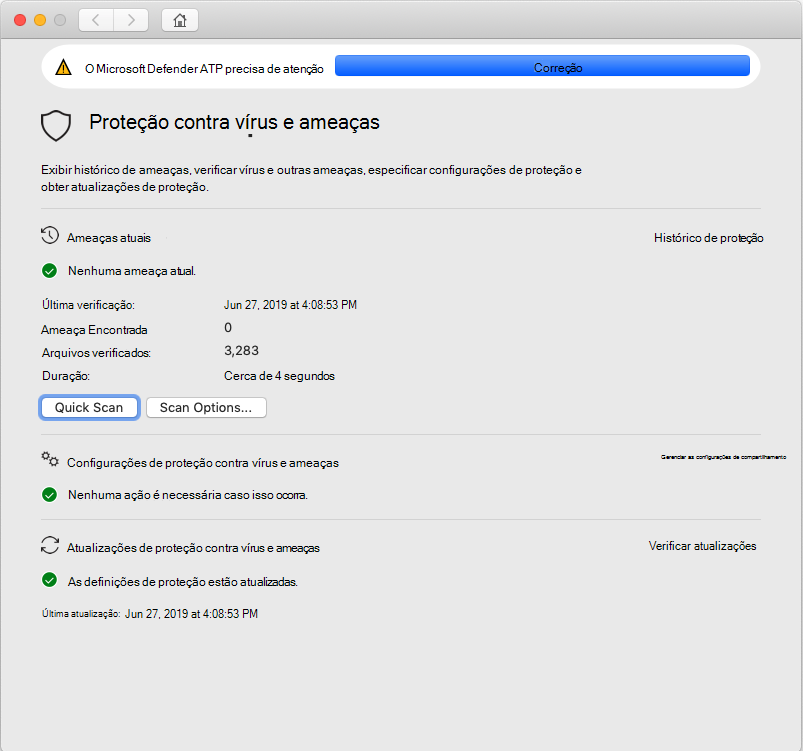
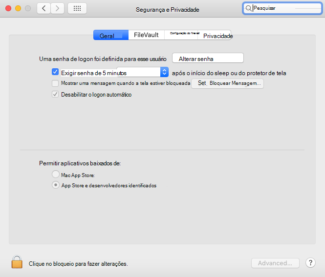

# <a name="troubleshoot-kernel-extension-issues-in-microsoft-defender-for-endpoint-on-macos"></a><span data-ttu-id="3df6c-104">Solucionar problemas de extensão de kernel no Microsoft Defender para Ponto de Extremidade no macOS</span><span class="sxs-lookup"><span data-stu-id="3df6c-104">Troubleshoot kernel extension issues in Microsoft Defender for Endpoint on macOS</span></span>

[!INCLUDE [Microsoft 365 Defender rebranding](../../includes/microsoft-defender.md)]


<span data-ttu-id="3df6c-105">**Aplica-se a:**</span><span class="sxs-lookup"><span data-stu-id="3df6c-105">**Applies to:**</span></span>

- [<span data-ttu-id="3df6c-106">Microsoft Defender para Ponto de Extremidade no macOS</span><span class="sxs-lookup"><span data-stu-id="3df6c-106">Microsoft Defender for Endpoint on macOS</span></span>](microsoft-defender-endpoint-mac.md)
- [<span data-ttu-id="3df6c-107">Microsoft Defender para Ponto de Extremidade</span><span class="sxs-lookup"><span data-stu-id="3df6c-107">Microsoft Defender for Endpoint</span></span>](https://go.microsoft.com/fwlink/p/?linkid=2154037)
- [<span data-ttu-id="3df6c-108">Microsoft 365 Defender</span><span class="sxs-lookup"><span data-stu-id="3df6c-108">Microsoft 365 Defender</span></span>](https://go.microsoft.com/fwlink/?linkid=2118804)

> <span data-ttu-id="3df6c-109">Deseja experimentar o Microsoft Defender para Ponto de Extremidade?</span><span class="sxs-lookup"><span data-stu-id="3df6c-109">Want to experience Microsoft Defender for Endpoint?</span></span> [<span data-ttu-id="3df6c-110">Inscreva-se para uma avaliação gratuita.</span><span class="sxs-lookup"><span data-stu-id="3df6c-110">Sign up for a free trial.</span></span>](https://www.microsoft.com/microsoft-365/windows/microsoft-defender-atp?ocid=docs-wdatp-exposedapis-abovefoldlink)

<span data-ttu-id="3df6c-111">Este artigo fornece informações sobre como solucionar problemas com a extensão do kernel instalada como parte do Microsoft Defender para Ponto de Extremidade no macOS.</span><span class="sxs-lookup"><span data-stu-id="3df6c-111">This article provides information on how to troubleshoot issues with the kernel extension that is installed as part of Microsoft Defender for Endpoint on macOS.</span></span>

<span data-ttu-id="3df6c-112">A partir do macOS High Sierra (10.13), o macOS exige que todas as extensões de kernel sejam aprovadas explicitamente antes que elas sejam permitidas para execução no dispositivo.</span><span class="sxs-lookup"><span data-stu-id="3df6c-112">Starting with macOS High Sierra (10.13), macOS requires all kernel extensions to be explicitly approved before they're allowed to run on the device.</span></span>

<span data-ttu-id="3df6c-113">Se você não aprovou a extensão do kernel durante a implantação/instalação do Microsoft Defender para Ponto de Extremidade no macOS, o aplicativo exibirá uma faixa solicitando que você habilita-lo:</span><span class="sxs-lookup"><span data-stu-id="3df6c-113">If you didn't approve the kernel extension during the deployment/installation of Microsoft Defender for Endpoint on macOS, the application displays a banner prompting you to enable it:</span></span>

   

<span data-ttu-id="3df6c-115">Você também pode executar ```mdatp health``` .</span><span class="sxs-lookup"><span data-stu-id="3df6c-115">You can also run ```mdatp health```.</span></span> <span data-ttu-id="3df6c-116">Ele relata se a proteção em tempo real está habilitada, mas não está disponível.</span><span class="sxs-lookup"><span data-stu-id="3df6c-116">It reports if real-time protection is enabled but not available.</span></span> <span data-ttu-id="3df6c-117">Isso indica que a extensão do kernel não foi aprovada para ser executado em seu dispositivo.</span><span class="sxs-lookup"><span data-stu-id="3df6c-117">This indicates that the kernel extension isn't approved to run on your device.</span></span>

```bash
mdatp health
```
```Output
...
real_time_protection_enabled                : false
real_time_protection_available              : true
...
```

<span data-ttu-id="3df6c-118">As seções a seguir fornecem orientações sobre como resolver esse problema, dependendo do método usado para implantar o Microsoft Defender para Ponto de Extremidade no macOS.</span><span class="sxs-lookup"><span data-stu-id="3df6c-118">The following sections provide guidance on how to address this issue, depending on the method that you used to deploy Microsoft Defender for Endpoint on macOS.</span></span>

## <a name="managed-deployment"></a><span data-ttu-id="3df6c-119">Implantação gerenciada</span><span class="sxs-lookup"><span data-stu-id="3df6c-119">Managed deployment</span></span>

<span data-ttu-id="3df6c-120">Consulte as instruções correspondentes à ferramenta de gerenciamento que você usou para implantar o produto:</span><span class="sxs-lookup"><span data-stu-id="3df6c-120">See the instructions corresponding to the management tool that you used to deploy the product:</span></span>

- [<span data-ttu-id="3df6c-121">Implantação baseada em JAMF</span><span class="sxs-lookup"><span data-stu-id="3df6c-121">JAMF-based deployment</span></span>](mac-install-with-jamf.md)
- [<span data-ttu-id="3df6c-122">Implantação baseada no Microsoft Intune</span><span class="sxs-lookup"><span data-stu-id="3df6c-122">Microsoft Intune-based deployment</span></span>](mac-install-with-intune.md#create-system-configuration-profiles)

## <a name="manual-deployment"></a><span data-ttu-id="3df6c-123">Implantação manual</span><span class="sxs-lookup"><span data-stu-id="3df6c-123">Manual deployment</span></span>

<span data-ttu-id="3df6c-124">Se menos de 30 minutos se passaram desde que o produto foi instalado, navegue até System **Preferences** Security & Privacidade , onde você deve Permitir software do sistema dos desenvolvedores  >  "Microsoft  Corporation".</span><span class="sxs-lookup"><span data-stu-id="3df6c-124">If less than 30 minutes have passed since the product was installed, navigate to **System Preferences** > **Security & Privacy**, where you have to **Allow** system software from developers "Microsoft Corporation".</span></span>

<span data-ttu-id="3df6c-125">Se você não vir esse prompt, isso significa que 30 ou mais minutos passaram e a extensão do kernel ainda não foi aprovada para ser executado em seu dispositivo:</span><span class="sxs-lookup"><span data-stu-id="3df6c-125">If you don't see this prompt, it means that 30 or more minutes have passed, and the kernel extension still not been approved to run on your device:</span></span>



<span data-ttu-id="3df6c-127">Nesse caso, você precisa executar as etapas a seguir para disparar o fluxo de aprovação novamente.</span><span class="sxs-lookup"><span data-stu-id="3df6c-127">In this case, you need to perform the following steps to trigger the approval flow again.</span></span>

1. <span data-ttu-id="3df6c-128">No Terminal, tente instalar o driver.</span><span class="sxs-lookup"><span data-stu-id="3df6c-128">In Terminal, attempt to install the driver.</span></span> <span data-ttu-id="3df6c-129">A operação a seguir falhará, pois a extensão do kernel não foi aprovada para ser executado no dispositivo.</span><span class="sxs-lookup"><span data-stu-id="3df6c-129">The following operation will fail, because the kernel extension wasn't approved to run on the device.</span></span> <span data-ttu-id="3df6c-130">No entanto, ele disparará o fluxo de aprovação novamente.</span><span class="sxs-lookup"><span data-stu-id="3df6c-130">However, it will trigger the approval flow again.</span></span>

    ```bash
    sudo kextutil /Library/Extensions/wdavkext.kext
    ```
    
    ```Output
    Kext rejected due to system policy: <OSKext 0x7fc34d528390 [0x7fffa74aa8e0]> { URL = "file:///Library/StagedExtensions/Library/Extensions/wdavkext.kext/", ID = "com.microsoft.wdavkext" }
    Kext rejected due to system policy: <OSKext 0x7fc34d528390 [0x7fffa74aa8e0]> { URL = "file:///Library/StagedExtensions/Library/Extensions/wdavkext.kext/", ID = "com.microsoft.wdavkext" }
    Diagnostics for /Library/Extensions/wdavkext.kext:
    ```

2. <span data-ttu-id="3df6c-131">Abra **a Segurança de Preferências** do Sistema &  >  **Privacidade** no menu.</span><span class="sxs-lookup"><span data-stu-id="3df6c-131">Open **System Preferences** > **Security & Privacy** from the menu.</span></span> <span data-ttu-id="3df6c-132">(Feche-o primeiro, se estiver aberto.)</span><span class="sxs-lookup"><span data-stu-id="3df6c-132">(Close it first, if it's opened.)</span></span>

3. <span data-ttu-id="3df6c-133">**Permitir** software do sistema de desenvolvedores "Microsoft Corporation"</span><span class="sxs-lookup"><span data-stu-id="3df6c-133">**Allow** system software from developers "Microsoft Corporation"</span></span>

4. <span data-ttu-id="3df6c-134">No Terminal, instale o driver novamente.</span><span class="sxs-lookup"><span data-stu-id="3df6c-134">In Terminal, install the driver again.</span></span> <span data-ttu-id="3df6c-135">Desta vez, a operação terá êxito:</span><span class="sxs-lookup"><span data-stu-id="3df6c-135">This time the operation will succeed:</span></span>

    ```bash
    sudo kextutil /Library/Extensions/wdavkext.kext
    ```

    <span data-ttu-id="3df6c-136">O banner deve desaparecer do aplicativo Defender e agora deve relatar que a proteção em tempo real está ```mdatp health``` habilitada e disponível:</span><span class="sxs-lookup"><span data-stu-id="3df6c-136">The banner should disappear from the Defender application, and ```mdatp health``` should now report that real-time protection is both enabled and available:</span></span>

    ```bash
    mdatp health
    ```

    ```Output
    ...
    real_time_protection_enabled                : true
    real_time_protection_available              : true
    ...
    ```
