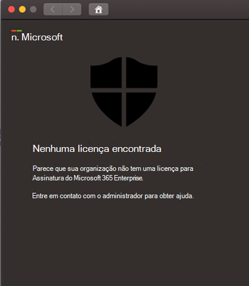

# Solucionar problemas de licença do Microsoft Defender para Ponto de Extremidade no macOS

[!INCLUDE [Microsoft 365 Defender rebranding](../../includes/microsoft-defender.md)]

**Aplica-se a:**

- [Microsoft Defender para Ponto de Extremidade no macOS](microsoft-defender-endpoint-mac.md)
- [Microsoft Defender para Ponto de Extremidade](https://go.microsoft.com/fwlink/p/?linkid=2154037)
- [Microsoft 365 Defender](https://go.microsoft.com/fwlink/?linkid=2118804)

> Deseja experimentar o Microsoft Defender para Ponto de Extremidade? [Inscreva-se para uma avaliação gratuita.](https://www.microsoft.com/microsoft-365/windows/microsoft-defender-atp?ocid=docs-wdatp-exposedapis-abovefoldlink)

Enquanto você estiver passando pelo Microsoft Defender para Ponto de Extremidade no [macOS](microsoft-defender-endpoint-mac.md) e teste de implantação [manual](mac-install-manually.md) ou em um PoC (Proof Of Concept), você pode obter o seguinte erro:

**Mensagem:** 

Nenhuma licença encontrada

Parece que sua organização não tem uma licença para assinatura do Microsoft 365 Enterprise.

Entre em contato com o administrador para obter ajuda.

**Causa:** 

Você implantou e/ou instalou o Microsoft Defender para Ponto de Extremidade no pacote macOS ("Baixar pacote de instalação") mas pode ter executado o script de configuração ("Baixar pacote de integração").

**Solução:**

Siga as instruções MicrosoftDefenderATPOnboardingMacOs.py documentadas aqui: [Configuração do cliente](mac-install-manually.md#client-configuration)

