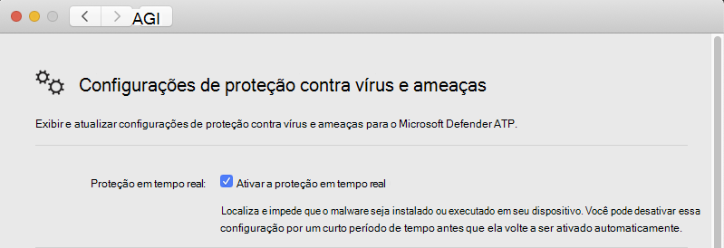

# <a name="troubleshoot-performance-issues-for-microsoft-defender-for-endpoint-for-mac"></a><span data-ttu-id="64bfc-104">Solucionar problemas de desempenho do Microsoft Defender para Ponto de Extremidade para Mac</span><span class="sxs-lookup"><span data-stu-id="64bfc-104">Troubleshoot performance issues for Microsoft Defender for Endpoint for Mac</span></span>

[!INCLUDE [Microsoft 365 Defender rebranding](../../includes/microsoft-defender.md)]


<span data-ttu-id="64bfc-105">**Aplica-se a:**</span><span class="sxs-lookup"><span data-stu-id="64bfc-105">**Applies to:**</span></span>

- [<span data-ttu-id="64bfc-106">Microsoft Defender para Ponto de Extremidade para Mac</span><span class="sxs-lookup"><span data-stu-id="64bfc-106">Microsoft Defender for Endpoint for Mac</span></span>](microsoft-defender-endpoint-mac.md)
- [<span data-ttu-id="64bfc-107">Microsoft Defender para Ponto de Extremidade</span><span class="sxs-lookup"><span data-stu-id="64bfc-107">Microsoft Defender for Endpoint</span></span>](https://go.microsoft.com/fwlink/p/?linkid=2154037)
- [<span data-ttu-id="64bfc-108">Microsoft 365 Defender</span><span class="sxs-lookup"><span data-stu-id="64bfc-108">Microsoft 365 Defender</span></span>](https://go.microsoft.com/fwlink/?linkid=2118804)

> <span data-ttu-id="64bfc-109">Deseja experimentar o Microsoft Defender para Ponto de Extremidade?</span><span class="sxs-lookup"><span data-stu-id="64bfc-109">Want to experience Microsoft Defender for Endpoint?</span></span> [<span data-ttu-id="64bfc-110">Inscreva-se para uma avaliação gratuita.</span><span class="sxs-lookup"><span data-stu-id="64bfc-110">Sign up for a free trial.</span></span>](https://www.microsoft.com/microsoft-365/windows/microsoft-defender-atp?ocid=docs-wdatp-exposedapis-abovefoldlink)

<span data-ttu-id="64bfc-111">Este tópico fornece algumas etapas gerais que podem ser usadas para reduzir os problemas de desempenho relacionados ao Microsoft Defender para Ponto de Extremidade para Mac.</span><span class="sxs-lookup"><span data-stu-id="64bfc-111">This topic provides some general steps that can be used to narrow down performance issues related to Microsoft Defender for Endpoint for Mac.</span></span>

<span data-ttu-id="64bfc-112">A proteção em tempo real (RTP) é um recurso do Microsoft Defender para Ponto de Extremidade para Mac que monitora e protege continuamente seu dispositivo contra ameaças.</span><span class="sxs-lookup"><span data-stu-id="64bfc-112">Real-time protection (RTP) is a feature of Microsoft Defender for Endpoint for Mac that continuously monitors and protects your device against threats.</span></span> <span data-ttu-id="64bfc-113">Ele consiste no monitoramento de arquivos e processos e outras heurísticas.</span><span class="sxs-lookup"><span data-stu-id="64bfc-113">It consists of file and process monitoring and other heuristics.</span></span>

<span data-ttu-id="64bfc-114">Dependendo dos aplicativos que você está executando e das características do dispositivo, você pode ter um desempenho suboptimal ao executar o Microsoft Defender para Ponto de Extremidade para Mac.</span><span class="sxs-lookup"><span data-stu-id="64bfc-114">Depending on the applications that you're running and your device characteristics, you may experience suboptimal performance when running Microsoft Defender for Endpoint for Mac.</span></span> <span data-ttu-id="64bfc-115">Em particular, aplicativos ou processos do sistema que acessam muitos recursos em um curto período de tempo podem levar a problemas de desempenho no Microsoft Defender para Ponto de Extremidade para Mac.</span><span class="sxs-lookup"><span data-stu-id="64bfc-115">In particular, applications or system processes that access many resources over a short timespan can lead to performance issues in Microsoft Defender for Endpoint for Mac.</span></span>

<span data-ttu-id="64bfc-116">As etapas a seguir podem ser usadas para solucionar problemas e atenuar esses problemas:</span><span class="sxs-lookup"><span data-stu-id="64bfc-116">The following steps can be used to troubleshoot and mitigate these issues:</span></span>

1. <span data-ttu-id="64bfc-117">Desabilite a proteção em tempo real usando um dos métodos a seguir e observe se o desempenho melhora.</span><span class="sxs-lookup"><span data-stu-id="64bfc-117">Disable real-time protection using one of the following methods and observe whether the performance improves.</span></span> <span data-ttu-id="64bfc-118">Essa abordagem ajuda a restringir se o Microsoft Defender para Ponto de Extremidade para Mac está contribuindo para os problemas de desempenho.</span><span class="sxs-lookup"><span data-stu-id="64bfc-118">This approach helps narrow down whether Microsoft Defender for Endpoint for Mac is contributing to the performance issues.</span></span>

      <span data-ttu-id="64bfc-119">Se o dispositivo não for gerenciado pela sua organização, a proteção em tempo real poderá ser desabilitada usando uma das seguintes opções:</span><span class="sxs-lookup"><span data-stu-id="64bfc-119">If your device is not managed by your organization, real-time protection can be disabled using one of the following options:</span></span>

    - <span data-ttu-id="64bfc-120">Na interface do usuário.</span><span class="sxs-lookup"><span data-stu-id="64bfc-120">From the user interface.</span></span> <span data-ttu-id="64bfc-121">Abra o Microsoft Defender para Ponto de Extremidade para Mac e navegue até **Gerenciar configurações**.</span><span class="sxs-lookup"><span data-stu-id="64bfc-121">Open Microsoft Defender for Endpoint for Mac and navigate to **Manage settings**.</span></span>

      

    - <span data-ttu-id="64bfc-123">Do Terminal.</span><span class="sxs-lookup"><span data-stu-id="64bfc-123">From the Terminal.</span></span> <span data-ttu-id="64bfc-124">Para fins de segurança, essa operação requer elevação.</span><span class="sxs-lookup"><span data-stu-id="64bfc-124">For security purposes, this operation requires elevation.</span></span>

      ```bash
      mdatp config real-time-protection --value disabled
      ```

      <span data-ttu-id="64bfc-125">Se seu dispositivo for gerenciado pela sua organização, a proteção em tempo real poderá ser desabilitada pelo administrador usando as instruções em Definir [preferências](mac-preferences.md)do Microsoft Defender para Ponto de Extremidade para Mac .</span><span class="sxs-lookup"><span data-stu-id="64bfc-125">If your device is managed by your organization, real-time protection can be disabled by your administrator using the instructions in [Set preferences for Microsoft Defender for Endpoint for Mac](mac-preferences.md).</span></span>
      
      <span data-ttu-id="64bfc-126">Se o problema de desempenho persistir enquanto a proteção em tempo real estiver desligada, a origem do problema poderá ser o componente de detecção e resposta do ponto de extremidade.</span><span class="sxs-lookup"><span data-stu-id="64bfc-126">If the performance problem persists while real-time protection is off, the origin of the problem could be the endpoint detection and response component.</span></span> <span data-ttu-id="64bfc-127">Nesse caso, entre em contato com o suporte do cliente para obter mais instruções e mitigação.</span><span class="sxs-lookup"><span data-stu-id="64bfc-127">In this case, please contact customer support for further instructions and mitigation.</span></span>

2. <span data-ttu-id="64bfc-128">Abra o Finder e navegue até  >  **Utilitários de Aplicativos.**</span><span class="sxs-lookup"><span data-stu-id="64bfc-128">Open Finder and navigate to **Applications** > **Utilities**.</span></span> <span data-ttu-id="64bfc-129">Abra **o Monitor de Atividades** e analise quais aplicativos estão usando os recursos em seu sistema.</span><span class="sxs-lookup"><span data-stu-id="64bfc-129">Open **Activity Monitor** and analyze which applications are using the resources on your system.</span></span> <span data-ttu-id="64bfc-130">Exemplos típicos incluem atualizadores e compiladores de software.</span><span class="sxs-lookup"><span data-stu-id="64bfc-130">Typical examples include software updaters and compilers.</span></span>

1. <span data-ttu-id="64bfc-131">Para encontrar os aplicativos que estão disparando a maioria das verificações, você pode usar estatísticas em tempo real coletadas pelo Defender para Ponto de Extremidade para Mac.</span><span class="sxs-lookup"><span data-stu-id="64bfc-131">To find the applications that are triggering the most scans, you can use real-time statistics gathered by Defender for Endpoint for Mac.</span></span>

      > [!NOTE]
      > <span data-ttu-id="64bfc-132">Esse recurso está disponível na versão 100.90.70 ou mais recente.</span><span class="sxs-lookup"><span data-stu-id="64bfc-132">This feature is available in version 100.90.70 or newer.</span></span>
      <span data-ttu-id="64bfc-133">Esse recurso é habilitado por padrão nos canais **Dogfood** e **InsiderFast.**</span><span class="sxs-lookup"><span data-stu-id="64bfc-133">This feature is enabled by default on the **Dogfood** and **InsiderFast** channels.</span></span> <span data-ttu-id="64bfc-134">Se você estiver usando um canal de atualização diferente, esse recurso poderá ser habilitado a partir da linha de comando:</span><span class="sxs-lookup"><span data-stu-id="64bfc-134">If you're using a different update channel, this feature can be enabled from the command line:</span></span>
      ```bash
      mdatp config real-time-protection-statistics  --value enabled
      ```

      <span data-ttu-id="64bfc-135">Esse recurso requer proteção em tempo real para ser habilitado.</span><span class="sxs-lookup"><span data-stu-id="64bfc-135">This feature requires real-time protection to be enabled.</span></span> <span data-ttu-id="64bfc-136">Para verificar o status da proteção em tempo real, execute o seguinte comando:</span><span class="sxs-lookup"><span data-stu-id="64bfc-136">To check the status of real-time protection, run the following command:</span></span>

      ```bash
      mdatp health --field real_time_protection_enabled
      ```

    <span data-ttu-id="64bfc-137">Verifique se a **entrada real_time_protection_enabled** é verdadeira.</span><span class="sxs-lookup"><span data-stu-id="64bfc-137">Verify that the **real_time_protection_enabled** entry is true.</span></span> <span data-ttu-id="64bfc-138">Caso contrário, execute o seguinte comando para habilita-lo:</span><span class="sxs-lookup"><span data-stu-id="64bfc-138">Otherwise, run the following command to enable it:</span></span>

      ```bash
      mdatp config real-time-protection --value enabled
      ```

      ```output
      Configuration property updated
      ```

      <span data-ttu-id="64bfc-139">Para coletar estatísticas atuais, execute:</span><span class="sxs-lookup"><span data-stu-id="64bfc-139">To collect current statistics, run:</span></span>

      ```bash
      mdatp config real-time-protection --value enabled
      ```

      > [!NOTE]
      > <span data-ttu-id="64bfc-140">Usar **--output json** (observe o traço duplo) garante que o formato de saída esteja pronto para análise.</span><span class="sxs-lookup"><span data-stu-id="64bfc-140">Using **--output json** (note the double dash) ensures that the output format is ready for parsing.</span></span>
      <span data-ttu-id="64bfc-141">A saída desse comando mostrará todos os processos e suas atividades de verificação associadas.</span><span class="sxs-lookup"><span data-stu-id="64bfc-141">The output of this command will show all processes and their associated scan activity.</span></span>

1. <span data-ttu-id="64bfc-142">Em seu sistema Mac, baixe o analisador Python de exemplo high_cpu_parser.py usando o comando:</span><span class="sxs-lookup"><span data-stu-id="64bfc-142">On your Mac system, download the sample Python parser high_cpu_parser.py using the command:</span></span>

    ```bash
    wget -c https://raw.githubusercontent.com/microsoft/mdatp-xplat/master/linux/diagnostic/high_cpu_parser.py
    ```

    <span data-ttu-id="64bfc-143">A saída deste comando deve ser semelhante ao seguinte:</span><span class="sxs-lookup"><span data-stu-id="64bfc-143">The output of this command should be similar to the following:</span></span>

    ```Output
    --2020-11-14 11:27:27-- https://raw.githubusercontent.com/microsoft.
    mdatp-xplat/master/linus/diagnostic/high_cpu_parser.py
    Resolving raw.githubusercontent.com (raw.githubusercontent.com)... 151.101.xxx.xxx
    Connecting to raw.githubusercontent.com (raw.githubusercontent.com)| 151.101.xxx.xxx| :443... connected.
    HTTP request sent, awaiting response... 200 OK
    Length: 1020 [text/plain]
    Saving to: 'high_cpu_parser.py'
    100%[===========================================>] 1,020    --.-K/s   in 
    0s
    ```

1. <span data-ttu-id="64bfc-144">Em seguida, digite os seguintes comandos:</span><span class="sxs-lookup"><span data-stu-id="64bfc-144">Next, type the following commands:</span></span>

      ```bash
        chmod +x high_cpu_parser.py
      ```

      ```bash
        cat real_time_protection.json | python high_cpu_parser.py  > real_time_protection.log
      ```

      <span data-ttu-id="64bfc-145">A saída do acima é uma lista dos principais colaboradores para problemas de desempenho.</span><span class="sxs-lookup"><span data-stu-id="64bfc-145">The output of the above is a list of the top contributors to performance issues.</span></span> <span data-ttu-id="64bfc-146">A primeira coluna é o identificador de processo (PID), a segunda coluna é o nome do processo e a última coluna é o número de arquivos verificados, classificação por impacto.</span><span class="sxs-lookup"><span data-stu-id="64bfc-146">The first column is the process identifier (PID), the second column is te process name, and the last column is the number of scanned files, sorted by impact.</span></span>

      <span data-ttu-id="64bfc-147">Por exemplo, a saída do comando será algo como o abaixo:</span><span class="sxs-lookup"><span data-stu-id="64bfc-147">For example, the output of the command will be something like the below:</span></span>

      ```output
        ... > python ~/repo/mdatp-xplat/linux/diagnostic/high_cpu_parser.py <~Downloads/output.json | head -n 10
        27432 None 76703
        73467 actool     1249
        73914 xcodebuild 1081
        73873 bash 1050
        27475 None 836
        1    launchd    407
        73468 ibtool     344
        549  telemetryd_v1   325
        4764 None 228
        125  CrashPlanService 164
      ```

      <span data-ttu-id="64bfc-148">Para melhorar o desempenho do Defender para Ponto de Extremidade para Mac, localize o que tem o número mais alto na linha Total de arquivos verificados e adicione uma exclusão para ele.</span><span class="sxs-lookup"><span data-stu-id="64bfc-148">To improve the performance of Defender for Endpoint for Mac, locate the one with the highest number under the Total files scanned row and add an exclusion for it.</span></span> <span data-ttu-id="64bfc-149">Para obter mais informações, [consulte Configure and validate exclusions for Defender for Endpoint for Linux](linux-exclusions.md).</span><span class="sxs-lookup"><span data-stu-id="64bfc-149">For more information, see [Configure and validate exclusions for Defender for Endpoint for Linux](linux-exclusions.md).</span></span>

      > [!NOTE]
      > <span data-ttu-id="64bfc-150">O aplicativo armazena estatísticas na memória e só mantém o controle da atividade do arquivo desde que foi iniciado e a proteção em tempo real foi habilitada.</span><span class="sxs-lookup"><span data-stu-id="64bfc-150">The application stores statistics in memory and only keeps track of file activity since it was started and real-time protection was enabled.</span></span> <span data-ttu-id="64bfc-151">Os processos que foram lançados antes ou durante períodos em que a proteção em tempo real estava desligada não são contados.</span><span class="sxs-lookup"><span data-stu-id="64bfc-151">Processes that were launched before or during periods when real time protection was off are not counted.</span></span> <span data-ttu-id="64bfc-152">Além disso, somente os eventos que dispararam verificações são contados.</span><span class="sxs-lookup"><span data-stu-id="64bfc-152">Additionally, only events which triggered scans are counted.</span></span>
      > 
1. <span data-ttu-id="64bfc-153">Configure o Microsoft Defender para Ponto de Extremidade para Mac com exclusões para os processos ou locais de disco que contribuem para os problemas de desempenho e rehabilitam a proteção em tempo real.</span><span class="sxs-lookup"><span data-stu-id="64bfc-153">Configure Microsoft Defender for Endpoint for Mac with exclusions for the processes or disk locations that contribute to the performance issues and re-enable real-time protection.</span></span>

     <span data-ttu-id="64bfc-154">Consulte [Configure and validate exclusions for Microsoft Defender for Endpoint for Mac para](mac-exclusions.md) obter detalhes.</span><span class="sxs-lookup"><span data-stu-id="64bfc-154">See [Configure and validate exclusions for Microsoft Defender for Endpoint for Mac](mac-exclusions.md) for details.</span></span>
