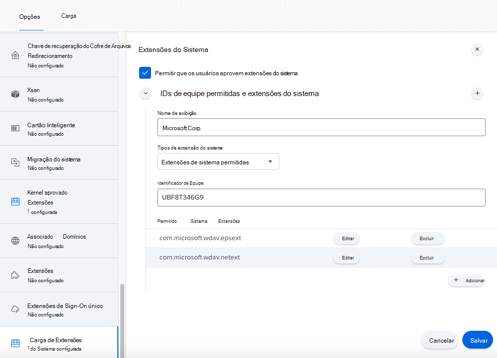
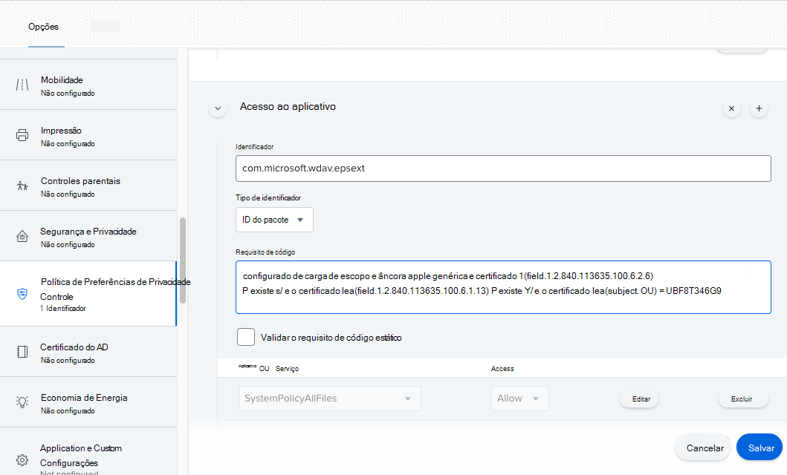
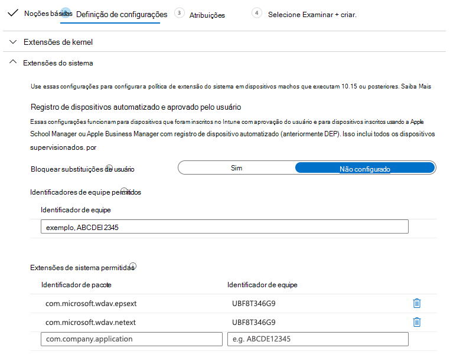
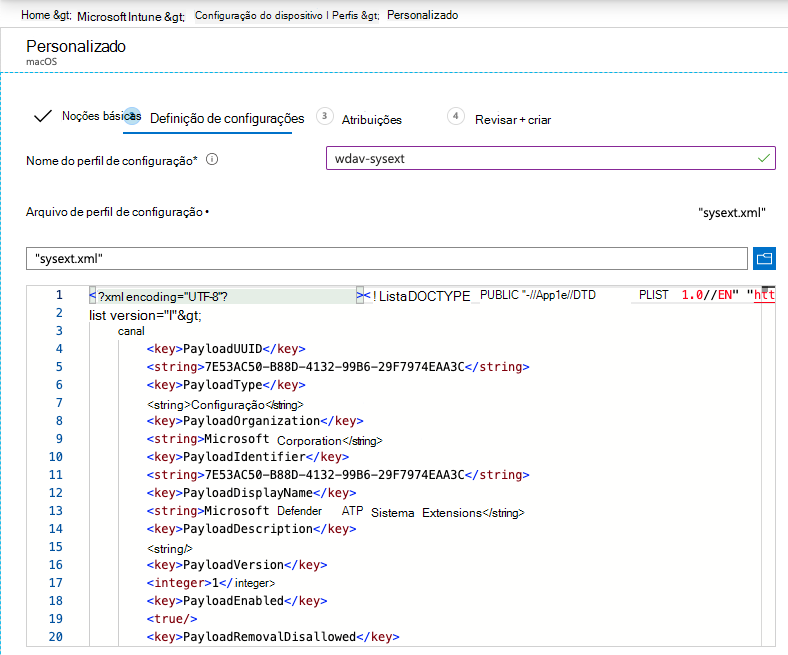

# <a name="new-configuration-profiles-for-macos-catalina-and-newer-versions-of-macos"></a>Novos perfis de configuração para macOS Catalina e versões mais recentes do macOS

[!INCLUDE [Microsoft 365 Defender rebranding](../../includes/microsoft-defender.md)]

**Aplica-se a:**
- [Microsoft Defender para Ponto de Extremidade](https://go.microsoft.com/fwlink/p/?linkid=2154037)
- [Microsoft 365 Defender](https://go.microsoft.com/fwlink/?linkid=2118804)

> Deseja experimentar o Microsoft Defender para Ponto de Extremidade? [Inscreva-se para uma avaliação gratuita.](https://www.microsoft.com/microsoft-365/windows/microsoft-defender-atp?ocid=docs-wdatp-exposedapis-abovefoldlink)

Em alinhamento com a evolução do macOS, estamos preparando um Microsoft Defender para Endpoint na atualização do macOS que aproveita extensões do sistema em vez de extensões de kernel. Essa atualização só será aplicável ao macOS Catalina (10.15.4) e versões mais recentes do macOS.

Se você implantou o Microsoft Defender para o Ponto de Extremidade no macOS em um ambiente gerenciado (por meio de JAMF, Intune ou outra solução MDM), você deve implantar novos perfis de configuração. A falha ao executar essas etapas fará com que os usuários receberem prompts de aprovação para executar esses novos componentes.

## <a name="jamf"></a>JAMF

### <a name="system-extensions-policy"></a>Política de Extensões do Sistema

Para aprovar as extensões do sistema, crie a seguinte carga:

1. Em **Computadores > Perfis de Configuração** selecione **Opções > Extensões do Sistema**.
2. Selecione **Extensões de Sistema Permitidos** **na** listada tipos de extensão do sistema.
3. Use **UBF8T346G9** para id de equipe.
4. Adicione os seguintes identificadores de pacote à lista **Extensões de Sistema Permitidos:**

    - **com.microsoft.wdav.epsext**
    - **com.microsoft.wdav.netext**

    

### <a name="privacy-preferences-policy-control"></a>Controle de Política de Preferências de Privacidade

Adicione a seguinte carga JAMF para conceder Acesso total em disco ao Microsoft Defender para Extensão de Segurança do Ponto de Extremidade. Esta política é um pré-requisito para executar a extensão em seu dispositivo.

1. Selecione **Opções**  >  **Controle de Política de Preferências de Privacidade.**
2. Use `com.microsoft.wdav.epsext` como o **Identificador e** como tipo de `Bundle ID` **pacote**.
3. Definir Requisito de Código como `identifier "com.microsoft.wdav.epsext" and anchor apple generic and certificate 1[field.1.2.840.113635.100.6.2.6] /* exists */ and certificate leaf[field.1.2.840.113635.100.6.1.13] /* exists */ and certificate leaf[subject.OU] = UBF8T346G9`
4. Definir **aplicativo ou serviço como** **SystemPolicyAllFiles** e acesso a **Permitir**.

    

### <a name="network-extension-policy"></a>Política de Extensão de Rede

Como parte dos recursos de Detecção e Resposta do Ponto de Extremidade, o Microsoft Defender para Ponto de Extremidade no macOS inspeciona o tráfego de soquete e relata essas informações ao portal do Centro de Segurança do Microsoft Defender. A política a seguir permite que a extensão de rede execute essa funcionalidade.

>[!NOTE]
>O JAMF não tem suporte integrado para políticas de filtragem de conteúdo, que são um pré-requisito para habilitar as extensões de rede que o Microsoft Defender para Ponto de Extremidade instala no macOS no dispositivo. Além disso, o JAMF às vezes altera o conteúdo das políticas que estão sendo implantadas.
>Dessa forma, as etapas a seguir fornecem uma solução alternativa que envolve a assinatura do perfil de configuração.

1. Salve o seguinte conteúdo em seu dispositivo como `com.microsoft.network-extension.mobileconfig` usando um editor de texto:

    ```xml
    <?xml version="1.0" encoding="UTF-8"?><!DOCTYPE plist PUBLIC "-//Apple//DTD PLIST 1.0//EN" "http://www.apple.com/DTDs/PropertyList-1.0.dtd">
    <plist version="1">
        <dict>
            <key>PayloadUUID</key>
            <string>DA2CC794-488B-4AFF-89F7-6686A7E7B8AB</string>
            <key>PayloadType</key>
            <string>Configuration</string>
            <key>PayloadOrganization</key>
            <string>Microsoft Corporation</string>
            <key>PayloadIdentifier</key>
            <string>DA2CC794-488B-4AFF-89F7-6686A7E7B8AB</string>
            <key>PayloadDisplayName</key>
            <string>Microsoft Defender ATP Network Extension</string>
            <key>PayloadDescription</key>
            <string/>
            <key>PayloadVersion</key>
            <integer>1</integer>
            <key>PayloadEnabled</key>
            <true/>
            <key>PayloadRemovalDisallowed</key>
            <true/>
            <key>PayloadScope</key>
            <string>System</string>
            <key>PayloadContent</key>
            <array>
                <dict>
                    <key>PayloadUUID</key>
                    <string>2BA070D9-2233-4827-AFC1-1F44C8C8E527</string>
                    <key>PayloadType</key>
                    <string>com.apple.webcontent-filter</string>
                    <key>PayloadOrganization</key>
                    <string>Microsoft Corporation</string>
                    <key>PayloadIdentifier</key>
                    <string>CEBF7A71-D9A1-48BD-8CCF-BD9D18EC155A</string>
                    <key>PayloadDisplayName</key>
                    <string>Approved Network Extension</string>
                    <key>PayloadDescription</key>
                    <string/>
                    <key>PayloadVersion</key>
                    <integer>1</integer>
                    <key>PayloadEnabled</key>
                    <true/>
                    <key>FilterType</key>
                    <string>Plugin</string>
                    <key>UserDefinedName</key>
                    <string>Microsoft Defender ATP Network Extension</string>
                    <key>PluginBundleID</key>
                    <string>com.microsoft.wdav</string>
                    <key>FilterSockets</key>
                    <true/>
                    <key>FilterDataProviderBundleIdentifier</key>
                    <string>com.microsoft.wdav.netext</string>
                    <key>FilterDataProviderDesignatedRequirement</key>
                    <string>identifier "com.microsoft.wdav.netext" and anchor apple generic and certificate 1[field.1.2.840.113635.100.6.2.6] /* exists */ and certificate leaf[field.1.2.840.113635.100.6.1.13] /* exists */ and certificate leaf[subject.OU] = UBF8T346G9</string>
                </dict>
            </array>
        </dict>
    </plist>
    ```

2. Verifique se o arquivo acima foi copiado corretamente executando o `plutil` utilitário no Terminal:

    ```bash
    $ plutil -lint <PathToFile>/com.microsoft.network-extension.mobileconfig
    ```

    Por exemplo, se o arquivo foi armazenado em Documentos:

    ```bash
    $ plutil -lint ~/Documents/com.microsoft.network-extension.mobileconfig
    ```
    
    Verifique se o comando saídas `OK` .
        
    ```bash
    <PathToFile>/com.microsoft.network-extension.mobileconfig: OK
    ```
    
3. Siga as instruções nesta [página](https://www.jamf.com/jamf-nation/articles/649/creating-a-signing-certificate-using-jamf-pro-s-built-in-certificate-authority) para criar um certificado de assinatura usando a autoridade de certificação do JAMF.

4. Depois que o certificado for criado e instalado em seu dispositivo, execute o seguinte comando do Terminal para assinar o arquivo:

    ```bash
    $ security cms -S -N "<CertificateName>" -i <PathToFile>/com.microsoft.network-extension.mobileconfig -o <PathToSignedFile>/com.microsoft.network-extension.signed.mobileconfig
    ```
    
    Por exemplo, se o nome do certificado for **SigningCertificate** e o arquivo assinado for armazenado em Documentos:
    
    ```bash
    $ security cms -S -N "SigningCertificate" -i ~/Documents/com.microsoft.network-extension.mobileconfig -o ~/Documents/com.microsoft.network-extension.signed.mobileconfig
    ```
    
5. No portal JAMF, navegue até **Perfis de Configuração** e clique no **botão Carregar.** Selecione `com.microsoft.network-extension.signed.mobileconfig` quando solicitado para o arquivo.

## <a name="intune"></a>Intune

### <a name="system-extensions-policy"></a>Política de Extensões do Sistema

Para aprovar as extensões do sistema:

1. No Intune, abra **Gerenciar**  >  **configuração do dispositivo**. Selecione **Gerenciar**  >    >  **Perfis Criar Perfil**.
2. Escolha um nome para o perfil. Alterar **Platform=macOS** para **Profile type=Extensions**. Selecione **Criar**.
3. Na `Basics` guia, dê um nome a esse novo perfil.
4. Na `Configuration settings` guia, adicione as seguintes entradas na `Allowed system extensions` seção:

    Identificador de pacote         | Identificador de equipe
    --------------------------|----------------
    com.microsoft.wdav.epsext | UBF8T346G9
    com.microsoft.wdav.netext | UBF8T346G9

    

5. Na `Assignments` guia, atribua esse perfil a **Todos os Usuários & Todos os dispositivos**.
6. Revise e crie esse perfil de configuração.

### <a name="create-and-deploy-the-custom-configuration-profile"></a>Criar e implantar o Perfil de Configuração Personalizado

O perfil de configuração a seguir habilita a extensão de rede e concede acesso total em disco à extensão do sistema de Segurança do Ponto de Extremidade. 

Salve o seguinte conteúdo em um arquivo chamado **sysext.xml**:

```xml
<?xml version="1.0" encoding="UTF-8"?><!DOCTYPE plist PUBLIC "-//Apple//DTD PLIST 1.0//EN" "http://www.apple.com/DTDs/PropertyList-1.0.dtd">
<plist version="1">
    <dict>
        <key>PayloadUUID</key>
        <string>7E53AC50-B88D-4132-99B6-29F7974EAA3C</string>
        <key>PayloadType</key>
        <string>Configuration</string>
        <key>PayloadOrganization</key>
        <string>Microsoft Corporation</string>
        <key>PayloadIdentifier</key>
        <string>7E53AC50-B88D-4132-99B6-29F7974EAA3C</string>
        <key>PayloadDisplayName</key>
        <string>Microsoft Defender ATP System Extensions</string>
        <key>PayloadDescription</key>
        <string/>
        <key>PayloadVersion</key>
        <integer>1</integer>
        <key>PayloadEnabled</key>
        <true/>
        <key>PayloadRemovalDisallowed</key>
        <true/>
        <key>PayloadScope</key>
        <string>System</string>
        <key>PayloadContent</key>
        <array>
            <dict>
                <key>PayloadUUID</key>
                <string>2BA070D9-2233-4827-AFC1-1F44C8C8E527</string>
                <key>PayloadType</key>
                <string>com.apple.webcontent-filter</string>
                <key>PayloadOrganization</key>
                <string>Microsoft Corporation</string>
                <key>PayloadIdentifier</key>
                <string>CEBF7A71-D9A1-48BD-8CCF-BD9D18EC155A</string>
                <key>PayloadDisplayName</key>
                <string>Approved Network Extension</string>
                <key>PayloadDescription</key>
                <string/>
                <key>PayloadVersion</key>
                <integer>1</integer>
                <key>PayloadEnabled</key>
                <true/>
                <key>FilterType</key>
                <string>Plugin</string>
                <key>UserDefinedName</key>
                <string>Microsoft Defender ATP Network Extension</string>
                <key>PluginBundleID</key>
                <string>com.microsoft.wdav</string>
                <key>FilterSockets</key>
                <true/>
                <key>FilterDataProviderBundleIdentifier</key>
                <string>com.microsoft.wdav.netext</string>
                <key>FilterDataProviderDesignatedRequirement</key>
                <string>identifier &quot;com.microsoft.wdav.netext&quot; and anchor apple generic and certificate 1[field.1.2.840.113635.100.6.2.6] /* exists */ and certificate leaf[field.1.2.840.113635.100.6.1.13] /* exists */ and certificate leaf[subject.OU] = UBF8T346G9</string>
            </dict>
            <dict>
                <key>PayloadUUID</key>
                <string>56105E89-C7C8-4A95-AEE6-E11B8BEA0366</string>
                <key>PayloadType</key>
                <string>com.apple.TCC.configuration-profile-policy</string>
                <key>PayloadOrganization</key>
                <string>Microsoft Corporation</string>
                <key>PayloadIdentifier</key>
                <string>56105E89-C7C8-4A95-AEE6-E11B8BEA0366</string>
                <key>PayloadDisplayName</key>
                <string>Privacy Preferences Policy Control</string>
                <key>PayloadDescription</key>
                <string/>
                <key>PayloadVersion</key>
                <integer>1</integer>
                <key>PayloadEnabled</key>
                <true/>
                <key>Services</key>
                <dict>
                    <key>SystemPolicyAllFiles</key>
                    <array>
                        <dict>
                            <key>Identifier</key>
                            <string>com.microsoft.wdav.epsext</string>
                            <key>CodeRequirement</key>
                            <string>identifier "com.microsoft.wdav.epsext" and anchor apple generic and certificate 1[field.1.2.840.113635.100.6.2.6] /* exists */ and certificate leaf[field.1.2.840.113635.100.6.1.13] /* exists */ and certificate leaf[subject.OU] = UBF8T346G9</string>
                            <key>IdentifierType</key>
                            <string>bundleID</string>
                            <key>StaticCode</key>
                            <integer>0</integer>
                            <key>Allowed</key>
                            <integer>1</integer>
                        </dict>
                    </array>
                </dict>
            </dict>
        </array>
    </dict>
</plist>
```

Verifique se o arquivo acima foi copiado corretamente. No Terminal, execute o seguinte comando e verifique se ele `OK` saída :

```bash
$ plutil -lint sysext.xml
sysext.xml: OK
```

Para implantar esse perfil de configuração personalizado:

1.  No Intune, abra **Gerenciar**  >  **configuração do dispositivo**. Selecione **Gerenciar**  >    >  **Perfis Criar perfil**.
2. Escolha um nome para o perfil. Alterar **Platform=macOS** e **Profile type=Custom**. Selecione **Configurar**.
3.  Abra o perfil de configuração e carregue **sysext.xml**. Esse arquivo foi criado na etapa anterior.
4.  Clique em **OK**.

    

5. Na `Assignments` guia, atribua esse perfil a **Todos os Usuários & Todos os dispositivos**.
6. Revise e crie esse perfil de configuração.
