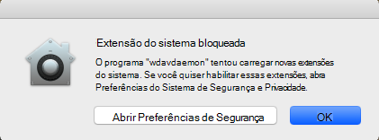
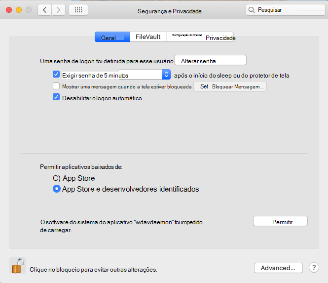
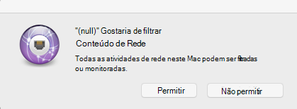
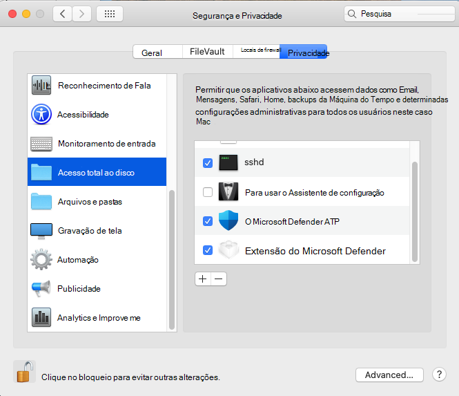

# <a name="microsoft-defender-for-endpoint-on-macos---system-extensions-public-preview"></a>Microsoft Defender para Ponto de Extremidade no macOS - visualização pública de extensões do sistema)

**Aplica-se a:**
- [Microsoft Defender para Ponto de Extremidade](https://go.microsoft.com/fwlink/p/?linkid=2154037)
- [Microsoft 365 Defender](https://go.microsoft.com/fwlink/?linkid=2118804)

> Deseja experimentar o Microsoft Defender para Ponto de Extremidade? [Inscreva-se para uma avaliação gratuita.](https://www.microsoft.com/microsoft-365/windows/microsoft-defender-atp?ocid=docs-wdatp-exposedapis-abovefoldlink)

Em alinhamento com a evolução do macOS, estamos preparando um Defender para Endpoint para atualização do Mac que aproveita extensões do sistema em vez de extensões de kernel. Essa atualização só se aplicará ao macOS Catalina (10.15.4) e versões posteriores do macOS.

Essa funcionalidade está atualmente em visualização pública. Este artigo descreve como habilitar essa funcionalidade em seu dispositivo. Você pode experimentar esse recurso localmente em seu próprio dispositivo ou configurá-lo remotamente por meio de uma ferramenta de gerenciamento.

Estas etapas pressuem que você já tenha o Defender para Ponto de Extremidade em execução em seu dispositivo. Para saber mais, confira [esta página](microsoft-defender-endpoint-mac.md).

## <a name="known-issues"></a>Problemas conhecidos

- Recebemos relatórios da extensão de rede que interfere na extensão Kerberos do SSO da Apple.
- A versão atual do produto ainda instala uma extensão de kernel. A extensão do kernel é usada apenas como um mecanismo de fallback e será removida antes que esse recurso atinja a visualização pública.
- Ainda estamos trabalhando em uma versão de produto que implanta e funciona corretamente no macOS 11 Big Sur.

## <a name="deployment-prerequisites"></a>Pré-requisitos de implantação

- Versão mínima do sistema operacional macOS: **10.15.4**
- Versão mínima do produto: **101.03.73**
- Seu dispositivo deve estar no canal **de atualização do Insider Fast.** Você pode verificar o canal de atualização usando o seguinte comando:

  ```bash
  mdatp health --field release_ring
  ```

  Se o dispositivo ainda não estiver no canal de atualização do Insider Fast, execute o seguinte comando no Terminal. A atualização de canal entra em vigor na próxima vez que o produto é iniciado (quando a próxima atualização do produto é instalada ou quando o dispositivo é reiniciado).

  ```bash
  defaults write com.microsoft.autoupdate2 ChannelName -string Beta
  ```

  Como alternativa, se você estiver em um ambiente gerenciado (JAMF ou Intune), poderá configurar o canal de atualização remotamente. Para obter mais informações, [consulte Deploy updates for Microsoft Defender ATP for Mac: Set the channel name](mac-updates.md#set-the-channel-name).

## <a name="deployment-steps"></a>Etapas de implantação

Siga as etapas de implantação que correspondem ao seu ambiente e ao seu método preferencial de tentar esse recurso.

### <a name="manual-deployment"></a>Implantação manual

#### <a name="approve-the-system-extensions-and-enable-the-network-extension"></a>Aprovar as extensões do sistema e habilitar a extensão de rede

1. Depois que todos os pré-requisitos de implantação são atendidos, reinicie o dispositivo para iniciar o processo de aprovação e ativação de extensão do sistema.

   Você verá uma série de prompts do sistema para aprovar as extensões do sistema Defender for Endpoint. Você deve aprovar **todos os** prompts da série, pois o macOS exige uma aprovação explícita para cada extensão que o Defender para Ponto de Extremidade para Mac instala no dispositivo.
   
   Para cada aprovação, selecione **Abrir Preferências de Segurança** e, em seguida, selecione **Permitir** para permitir que a extensão do sistema seja executado.

   > [!IMPORTANT]
   > Você deve fechar e reabrir a janela Segurança de **Preferências** do  >  **Sistema & Privacidade** entre aprovações subsequentes. Caso contrário, o macOS não exibirá a próxima aprovação.

   > [!IMPORTANT]
   > Há um tempo de um minuto antes que o produto volte para a extensão do kernel. Isso garante que o dispositivo seja protegido.
   >
   > Se mais de um minuto estiver em esmaeçamento, reinicie o daemon reiniciando o dispositivo ou usando para disparar `sudo killall -9 wdavdaemon` o fluxo de aprovação novamente.

   

   

1. Depois que as extensões do sistema são aprovadas, o macOS solicita uma aprovação para permitir que o tráfego de rede seja filtrado. Clique **em Permitir**.

   

#### <a name="grant-full-disk-access-to-the-endpoint-security-system-extension"></a>Conceder acesso em disco completo à extensão do sistema de Segurança do Ponto de Extremidade

Abra a guia Segurança de **Preferências** do Sistema & Privacidade e conceda acesso total em disco à Extensão de Segurança do Ponto de  >    >   Extremidade do **Microsoft Defender.** 



#### <a name="reboot-your-device"></a>Reiniciar seu dispositivo

Para que as alterações entre em vigor, você deve reiniciar o dispositivo.

#### <a name="verify-that-the-system-extensions-are-running"></a>Verifique se as extensões do sistema estão em execução

No Terminal, execute o seguinte comando:

```bash
mdatp health --field real_time_protection_subsystem
```

A saída `endpoint_security_extension` do terminal indica que o produto está usando a funcionalidade de extensões do sistema.

### <a name="managed-deployment"></a>Implantação gerenciada

Consulte [Novos perfis de configuração](mac-sysext-policies.md#jamf) para macOS Catalina e versões mais recentes do macOS: JAMF para os novos perfis de configuração que você deve implantar para esse novo recurso.

Além desses perfis, configure os dispositivos de destino para estar no canal de atualização do Insider Fast, conforme descrito em [Pré-requisitos de implantação.](#deployment-prerequisites)

Em um dispositivo onde todos os pré-requisitos são atendidos e os novos perfis de configuração foram implantados, execute o seguinte comando:

```bash
$ mdatp health --field real_time_protection_subsystem
```

Se esse comando imprimir `endpoint_security_extension` , o produto está usando a funcionalidade de extensões do sistema.

## <a name="validate-basic-scenarios"></a>Validar cenários básicos

1. Teste a detecção do Instituto Europeu para Pesquisa de Antivírus do Computador (EICAR). Em uma janela terminal, execute o seguinte comando:

   ```bash
   curl -o eicar.txt https://secure.eicar.org/eicar.com.txt
   ```

   Verifique se o arquivo EICAR está em quarentena. Você pode verificar o status do arquivo na página Histórico de Proteção na interface do usuário ou em uma linha de comando usando o seguinte comando:

    ```bash
    mdatp threat list
    ```

2. Teste o cenário de Detecção e Resposta do Ponto de Extremidade (EDR). Em uma janela de terminal, execute o seguinte comando:

   ```bash
   curl -o "MDATP MacOS DIY.zip" https://aka.ms/mdatpmacosdiy
   ```

   Valide se dois alertas surgiram no portal na página do computador para cenários EICAR e EDR DIY.

## <a name="frequently-asked-questions"></a>Perguntas frequentes

- P: Por que ainda estou vendo `kernel_extension` quando `mdatp health --field real_time_protection_subsystem` corro?

    R: Consulte a seção [Pré-requisitos](#deployment-prerequisites) de implantação e verifique se todos os pré-requisitos foram atendidos. Se todos os pré-requisitos são atendidos, reinicie o dispositivo e verifique novamente.

- P: Quando o macOS 11 Big Sur será suportado?

    R: Estamos trabalhando ativamente para adicionar suporte para macOS 11. Postaremos mais informações na [página Novidades.](mac-whatsnew.md)
