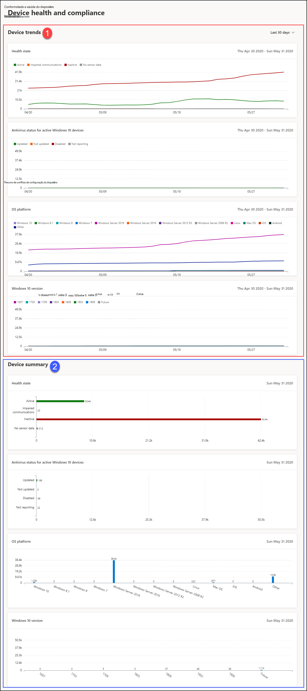

# Relatório de conformidade e saúde do dispositivo no Microsoft Defender para Ponto de ExtremidadeDevice health and compliance report in Microsoft Defender for Endpoint

[!INCLUDE [Microsoft 365 Defender rebranding](../../includes/microsoft-defender.md)]

**Aplica-se a:****Applies to:**
- [Microsoft Defender para Ponto de ExtremidadeMicrosoft Defender for Endpoint](https://go.microsoft.com/fwlink/p/?linkid=2154037)
- [Microsoft 365 DefenderMicrosoft 365 Defender](https://go.microsoft.com/fwlink/?linkid=2118804)

> Deseja experimentar o Microsoft Defender para Ponto de Extremidade?Want to experience Microsoft Defender for Endpoint? [Inscreva-se para uma avaliação gratuita.Sign up for a free trial.](https://www.microsoft.com/microsoft-365/windows/microsoft-defender-atp?ocid=docs-wdatp-exposedapis-abovefoldlink)

O relatório de status dos dispositivos fornece informações de alto nível sobre os dispositivos em sua organização.The devices status report provides high-level information about the devices in your organization. O relatório inclui informações de tendência mostrando o estado de saúde do sensor, o status do antivírus, as plataformas do sistema operacional e as versões do Windows 10.The report includes trending information showing the sensor health state, antivirus status, OS platforms, and Windows 10 versions.

O painel é estruturado em duas seções: The dashboard is structured into two sections: 
 
SeçãoSection | DescriçãoDescription
:---|:---
11 | Tendências de dispositivoDevice trends
22 | Resumo do dispositivo (dia atual)Device summary (current day)
 
 
## Tendências de dispositivoDevice trends 
Por padrão, as tendências do dispositivo exibem informações do dispositivo do período de 30 dias que terminam no último dia completo.By default, the device trends displays device information from the 30-day period ending in the latest full day. Para obter uma perspectiva melhor sobre as tendências que ocorrem em sua organização, você pode ajustar o período de relatório ajustando o período de tempo mostrado.To gain better perspective on trends occurring in your organization, you can fine-tune the reporting period by adjusting the time period shown. Para ajustar o período de tempo, selecione um intervalo de tempo nas opções listadas:To adjust the time period, select a time range from the drop-down options:
 
- 30 dias30 days
- 3 meses3 months
- 6 meses6 months
- PersonalizadoCustom

>[!NOTE]
>Esses filtros só são aplicados na seção tendências do dispositivo.These filters are only applied on the device trends section. Ele não afeta a seção resumo do dispositivo.It doesn't affect the device summary section.

## Resumo do dispositivoDevice summary 
Embora as tendências de dispositivos mostrem informações de dispositivos tendências, o resumo do dispositivo mostra as informações do dispositivo com escopo até o dia atual.While the devices trends shows trending device information, the device summary shows device information scoped to the current day. 

>[!NOTE]
>Os dados refletidos na seção resumo são escopos para 180 dias antes da data atual.The data reflected in the summary section is scoped to 180 days prior to the current date. Por exemplo, se a data de hoje for 27 de março de 2019, os dados da seção de resumo refletirão números a partir de 28 de setembro de 2018 a 27 de março de 2019.For example if today's date is March 27, 2019, the data on the summary section will reflect numbers starting from September 28, 2018 to March 27, 2019. 
> O filtro aplicado na seção tendências não é aplicado na seção resumo.The filter applied on the trends section is not applied on the summary section. 
 
A seção tendências do dispositivo permite detalhar a lista de dispositivos com o filtro correspondente aplicado a ela.The device trends section allows you to drill down to the devices list with the corresponding filter applied to it. Por exemplo, clicar na barra Inativa no cartão de estado de estado do sensor levará a lista de dispositivos com resultados mostrando apenas dispositivos cujo status do sensor está inativo.For example, clicking on the Inactive bar in the Sensor health state card will bring you the devices list with results showing only devices whose sensor status is inactive. 
 
 
 
## Atributos do dispositivoDevice attributes
O relatório é feito de cartões que exibem os seguintes atributos de dispositivo:The report is made up of cards that display the following device attributes:
 
- **Estado de** saúde : mostra informações sobre o estado do sensor em dispositivos, fornecendo uma exibição agregada de dispositivos que estão ativos, com comunicações prejudicadas, inativas ou onde nenhum dado do sensor é visto.**Health state**: shows information about the sensor state on devices, providing an aggregated view of devices that are active, experiencing impaired communications, inactive, or where no sensor data is seen.
  
- **Status do antivírus para dispositivos Windows 10** ativos : mostra o número de dispositivos e o status do Microsoft Defender Antivírus.**Antivirus status for active Windows 10 devices**: shows the number of devices and status of Microsoft Defender Antivirus.
    
- **Plataformas do sistema operacional**: mostra a distribuição de plataformas do sistema operacional existentes em sua organização.**OS platforms**: shows the distribution of OS platforms that exists within your organization. 
 
- **Versões do Windows 10**: mostra a distribuição de dispositivos Windows 10 e suas versões em sua organização.**Windows 10 versions**: shows the distribution of Windows 10 devices and their versions in your organization.
 
 
 
## Filtrar dadosFilter data
 
Use os filtros fornecidos para incluir ou excluir dispositivos com determinados atributos.Use the provided filters to include or exclude devices with certain attributes.

Você pode selecionar vários filtros para aplicar a partir dos atributos do dispositivo.You can select multiple filters to apply from the device attributes. 
 
>[!NOTE]
>Esses filtros se aplicam **a** todos os cartões do relatório.These filters apply to **all** the cards in the report.
 
Por exemplo, para mostrar dados sobre dispositivos Windows 10 com estado de saúde do sensor ativo:For example, to show data about Windows 10 devices with Active sensor health state:
 
1. Em **Filtros > estado de saúde do sensor > Ativo**.Under **Filters > Sensor health state > Active**.
2. Em seguida, **selecione plataformas do sistema operacional > Windows 10**.Then select **OS platforms > Windows 10**.
3. Selecione **Aplicar**.Select **Apply**.

## Tópicos relacionadosRelated topic
- [Relatório de proteção contra ameaçasThreat protection report](threat-protection-reports.md)
