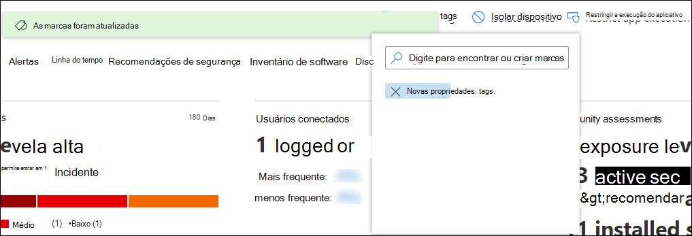

# Criar e gerenciar marcas de dispositivo

[!INCLUDE [Microsoft 365 Defender rebranding](../../includes/microsoft-defender.md)]

**Aplica-se a:**
- [Microsoft Defender para Ponto de Extremidade](https://go.microsoft.com/fwlink/p/?linkid=2154037)
- [Microsoft 365 Defender](https://go.microsoft.com/fwlink/?linkid=2118804)

> Deseja experimentar o Microsoft Defender para Ponto de Extremidade? [Inscreva-se para uma avaliação gratuita.](https://www.microsoft.com/microsoft-365/windows/microsoft-defender-atp?ocid=docs-wdatp-exposedapis-abovefoldlink)

Adicione marcas em dispositivos para criar uma afiliação de grupo lógica. As marcas de dispositivo dão suporte ao mapeamento correto da rede, permitindo que você anexe marcas diferentes para capturar contexto e habilitar a criação dinâmica de lista como parte de um incidente. As marcas podem ser usadas como filtro no **exibição de** lista Dispositivos ou para agrupar dispositivos. Para obter mais informações sobre o grupo de dispositivos, consulte [Create and manage device groups](machine-groups.md).

Você pode adicionar marcas em dispositivos usando as seguintes maneiras:

- Usando o portal
- Definindo um valor de chave do Registro

> [!NOTE]
> Pode haver alguma latência entre o momento em que uma marca é adicionada a um dispositivo e sua disponibilidade na lista de dispositivos e na página do dispositivo.  

Para adicionar marcas de dispositivo usando API, consulte [Add or remove device tags API](add-or-remove-machine-tags.md).

## Adicionar e gerenciar marcas de dispositivo usando o portal

1. Selecione o dispositivo em que você deseja gerenciar marcas. Você pode selecionar ou pesquisar um dispositivo de qualquer uma das seguintes exibições:

   - **Painel de operações de segurança** - Selecione o nome do dispositivo na seção Principais dispositivos com alertas ativos.
   - **Fila de alertas** - Selecione o nome do dispositivo ao lado do ícone do dispositivo na fila de alertas.
   - **Lista de dispositivos** - Selecione o nome do dispositivo na lista de dispositivos.
   - **Caixa de** pesquisa - Selecione Dispositivo no menu suspenso e insira o nome do dispositivo.

     Você também pode chegar à página de alerta por meio dos exibições de arquivo e IP.

2. Selecione **Gerenciar Marcas** na linha de ações de resposta.

    

3. Digite para encontrar ou criar marcas

    

As marcas são adicionadas à exibição do dispositivo e também serão refletidas no **exibição de** lista Dispositivos. Em seguida, você pode usar o **filtro Tags** para ver a lista relevante de dispositivos.

>[!NOTE]
> A filtragem pode não funcionar em nomes de marca que contenham parênteses. 
> Quando você cria uma nova marca, uma lista de marcas existentes é exibida. A lista mostra apenas marcas criadas por meio do portal. As marcas existentes criadas a partir de dispositivos cliente não serão exibidas.

Você também pode excluir marcas deste exibição.

## Adicionar marcas de dispositivo definindo um valor de chave do Registro

>[!NOTE]
> Aplicável somente nos seguintes dispositivos:
>- Windows 10, versão 1709 ou posterior
>- Windows Server, versão 1803 ou posterior
>- Windows Server 2016
>- Windows Server 2012 R2
>- Windows Server 2008 R2 SP1
>- Windows 8.1
>- Windows 7 SP1

> [!NOTE] 
> O número máximo de caracteres que podem ser definidos em uma marca é 200.

Dispositivos com marcas semelhantes podem ser úteis quando você precisa aplicar uma ação contextual em uma lista específica de dispositivos.

Use a seguinte entrada da chave do Registro para adicionar uma marca em um dispositivo:

- Chave do Registro: `HKEY_LOCAL_MACHINE\SOFTWARE\Policies\Microsoft\Windows Advanced Threat Protection\DeviceTagging\`
- Valor da chave do Registro (REG_SZ): `Group`
- Dados principais do Registro: `Name of the tag you want to set`

>[!NOTE]
>A marca do dispositivo faz parte do relatório de informações do dispositivo gerado uma vez por dia. Como alternativa, você pode optar por reiniciar o ponto de extremidade que transferiria um novo relatório de informações de dispositivo.
> 
> Se você precisar remover uma marca que foi adicionada usando a chave do Registro acima, limpe o conteúdo dos dados da chave do Registro em vez de remover a chave 'Group'.
