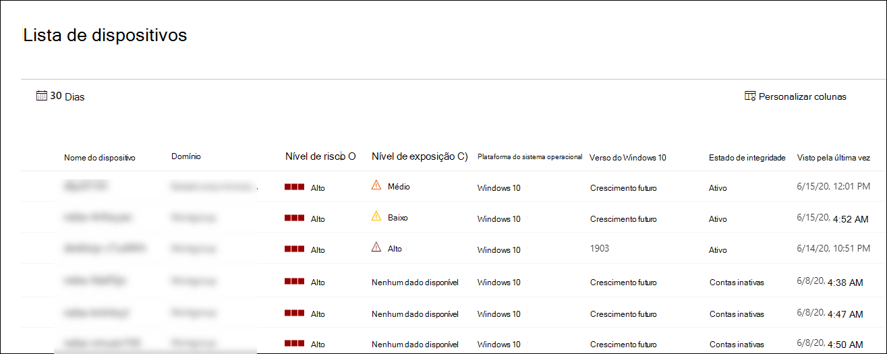

# Exibir e organizar a lista do Microsoft Defender for Endpoint DevicesView and organize the Microsoft Defender for Endpoint Devices list

[!INCLUDE [Microsoft 365 Defender rebranding](../../includes/microsoft-defender.md)]

**Aplica-se a:****Applies to:**
- [Microsoft Defender para Ponto de ExtremidadeMicrosoft Defender for Endpoint](https://go.microsoft.com/fwlink/p/?linkid=2154037)
- [Microsoft 365 DefenderMicrosoft 365 Defender](https://go.microsoft.com/fwlink/?linkid=2118804)

> Deseja experimentar o Defender para Ponto de Extremidade?Want to experience Defender for Endpoint? [Inscreva-se para uma avaliação gratuita.Sign up for a free trial.](https://www.microsoft.com/microsoft-365/windows/microsoft-defender-atp?ocid=docs-wdatp-machinesview-abovefoldlink)

A **lista Dispositivos** mostra uma lista dos dispositivos em sua rede onde os alertas foram gerados.The **Devices list** shows a list of the devices in your network where alerts were generated. Por padrão, a fila exibe dispositivos vistos nos últimos 30 dias.By default, the queue displays devices seen in the last 30 days.  

Rapidamente, você verá informações como domínio, nível de risco, plataforma do sistema operacional e outros detalhes para facilitar a identificação dos dispositivos mais em risco.At a glance you'll see information such as domain, risk level, OS platform, and other details for easy identification of devices most at risk.

Há várias opções que você pode escolher para personalizar a exibição de lista de dispositivos.There are several options you can choose from to customize the devices list view. Na navegação superior, você pode:On the top navigation you can:

- Adicionar ou remover colunasAdd or remove columns
- Exportar a lista inteira no formato CSVExport the entire list in CSV format
- Selecione o número de itens a mostrar por páginaSelect the number of items to show per page
- Aplicar filtrosApply filters

Durante o processo de integração, a lista **Dispositivos** é gradualmente preenchida com dispositivos à medida que eles começam a relatar dados do sensor.During the onboarding process, the **Devices list** is gradually populated with devices as they begin to report sensor data. Use esse modo de exibição para acompanhar seus pontos de extremidade integrados conforme eles estão online ou baixar a lista de pontos de extremidade completa como um arquivo CSV para análise offline.Use this view to track your onboarded endpoints as they come online, or download the complete endpoint list as a CSV file for offline analysis.

>[!NOTE]
> Se você exportar a lista de dispositivos, ela conterá todos os dispositivos em sua organização.If you export the device list, it will contain every device in your organization. Pode levar um tempo significativo para baixar, dependendo do tamanho da sua organização.It might take a significant amount of time to download, depending on how large your organization is. Exportar a lista no formato CSV exibe os dados de forma não filtrada.Exporting the list in CSV format displays the data in an unfiltered manner. O arquivo CSV incluirá todos os dispositivos na organização, independentemente de qualquer filtragem aplicada no próprio exibição.The CSV file will include all devices in the organization, regardless of any filtering applied in the view itself.

## Classificar e filtrar a lista de dispositivosSort and filter the device list

Você pode aplicar os filtros a seguir para limitar a lista de alertas e obter uma exibição mais focada.You can apply the following filters to limit the list of alerts and get a more focused view.

### Nível de riscoRisk level

O nível de risco reflete a avaliação geral de risco do dispositivo com base em uma combinação de fatores, incluindo os tipos e a gravidade dos alertas ativos no dispositivo.The risk level reflects the overall risk assessment of the device based on a combination of factors, including the types and severity of active alerts on the device. Resolver alertas ativos, aprovar atividades de correção e suprimir alertas subsequentes pode diminuir o nível de risco.Resolving active alerts, approving remediation activities, and suppressing subsequent alerts can lower the risk level.

### Nível de exposiçãoExposure level

O nível de exposição reflete a exposição atual do dispositivo com base no impacto acumulado de suas recomendações de segurança pendentes.The exposure level reflects the current exposure of the device based on the cumulative impact of its pending security recommendations. Os níveis possíveis são baixos, médios e altos.The possible levels are low, medium, and high. Baixa exposição significa que seus dispositivos são menos vulneráveis de exploração.Low exposure means your devices are less vulnerable from exploitation.

Se o nível de exposição diz "Sem dados disponíveis", há alguns motivos pelos quais isso pode ser o caso:If the exposure level says "No data available," there are a few reasons why this may be the case:

- O dispositivo parou de relatar por mais de 30 dias – nesse caso, ele é considerado inativo e a exposição não é calculadaDevice stopped reporting for more than 30 days – in that case it is considered inactive, and the exposure isn't computed
- Sistema operacional do dispositivo sem suporte - consulte [requisitos mínimos para o Microsoft Defender para Ponto de Extremidade](minimum-requirements.md)Device OS not supported - see [minimum requirements for Microsoft Defender for Endpoint](minimum-requirements.md)
- Dispositivo com agente estalado (muito improvável)Device with stale agent (very unlikely)

### Plataforma do sistema operacionalOS Platform

Selecione apenas as plataformas do sistema operacional que você está interessado em investigar.Select only the OS platforms you're interested in investigating.

### Estado de integridadeHealth state

Filtrar pelos seguintes estados de saúde do dispositivo:Filter by the following device health states:

- **Ativo** – Dispositivos que estão relatando ativamente dados do sensor para o serviço.**Active** – Devices that are actively reporting sensor data to the service.
- **Inativo –** Dispositivos que pararam completamente de enviar sinais por mais de 7 dias.**Inactive** – Devices that have completely stopped sending signals for more than 7 days.
- **Configuração inconfigurada** – Dispositivos que têm comunicações prejudicadas com o serviço ou não conseguem enviar dados do sensor.**Misconfigured** – Devices that have impaired communications with service or are unable to send sensor data. Dispositivos mal configurados ainda podem ser classificados para:Misconfigured devices can further be classified to:
  - Sem dados do sensorNo sensor data
  - Comunicações prejudicadasImpaired communications

  Para obter mais informações sobre como resolver problemas em dispositivos mal configurados, consulte [Fix unhealthy sensors](fix-unhealthy-sensors.md).For more information on how to address issues on misconfigured devices see, [Fix unhealthy sensors](fix-unhealthy-sensors.md).

### Status do antivírusAntivirus status

Filtrar dispositivos pelo status do antivírus.Filter devices by antivirus status. Aplica-se apenas a dispositivos Windows 10 ativos.Applies to active Windows 10 devices only.

- **Desabilitado** - & proteção contra ameaças está desativada.**Disabled** - Virus & threat protection is turned off.
- **Not reporting** - Proteção contra & vírus não está relatando.**Not reporting** - Virus & threat protection is not reporting.
- **Não atualizado** - a proteção contra & contra vírus não está atualizada.**Not updated** - Virus & threat protection is not up to date.

Para obter mais informações, [consulte View the Threat & Vulnerability Management dashboard](tvm-dashboard-insights.md).For more information, see [View the Threat & Vulnerability Management dashboard](tvm-dashboard-insights.md).

### Status de mitigação de ameaçasThreat mitigation status

Para exibir dispositivos que podem ser afetados por uma determinada ameaça, selecione a ameaça no menu suspenso e selecione qual aspecto de vulnerabilidade precisa ser atenuado.To view devices that may be affected by a certain threat, select the threat from the dropdown menu, and then select what vulnerability aspect needs to be mitigated.

Para saber mais sobre determinadas ameaças, consulte [Análise de ameaças.](threat-analytics.md)To learn more about certain threats, see [Threat analytics](threat-analytics.md). Para obter informações de mitigação, consulte [Threat & Vulnerability Management](next-gen-threat-and-vuln-mgt.md).For mitigation information, see [Threat & Vulnerability Management](next-gen-threat-and-vuln-mgt.md).

### Versão do Windows 10Windows 10 version

Selecione apenas as versões do Windows 10 que você está interessado em investigar.Select only the Windows 10 versions you're interested in investigating.

### Marcas & GruposTags & Groups

Filtre a lista com base no agrupamento e marcação que você adicionou a dispositivos individuais.Filter the list based on the grouping and tagging that you've added to individual devices. Consulte [Criar e gerenciar marcas de dispositivo](machine-tags.md) e Criar e gerenciar grupos de [dispositivos.](machine-groups.md)See [Create and manage device tags](machine-tags.md) and [Create and manage device groups](machine-groups.md).

## Tópicos relacionadosRelated topics

- [Investigar dispositivos na lista do Microsoft Defender for Endpoint DevicesInvestigate devices in the Microsoft Defender for Endpoint Devices list](investigate-machines.md)
