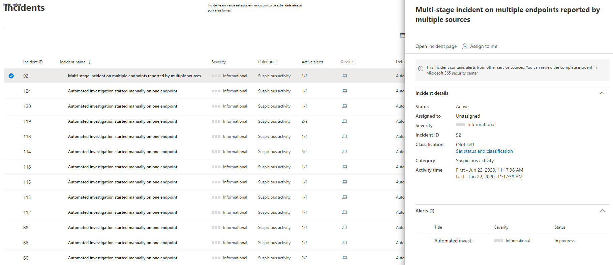
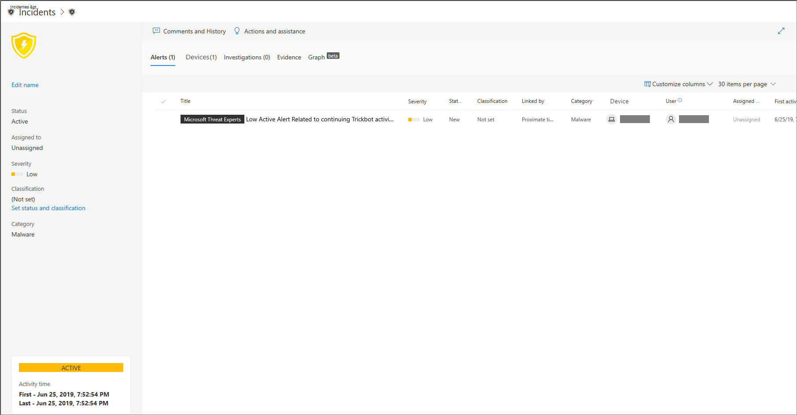

# Gerenciar o Microsoft Defender para incidentes de ponto de extremidade

[!INCLUDE [Microsoft 365 Defender rebranding](../../includes/microsoft-defender.md)]

**Aplica-se a:**
- [Microsoft Defender para Ponto de Extremidade](https://go.microsoft.com/fwlink/p/?linkid=2154037)
- [Microsoft 365 Defender](https://go.microsoft.com/fwlink/?linkid=2118804)

> Deseja experimentar o Microsoft Defender para Ponto de Extremidade? [Inscreva-se para uma avaliação gratuita.](https://www.microsoft.com/microsoft-365/windows/microsoft-defender-atp?ocid=docs-wdatp-exposedapis-abovefoldlink)

O gerenciamento de incidentes é uma parte importante de cada operação de segurança cibernética. Você pode gerenciar incidentes selecionando um incidente na fila **incidentes ou** no painel de gerenciamento **de incidentes.** 

Selecionar um incidente na fila **Incidentes** traz o **painel** gerenciamento de incidentes onde você pode abrir a página de incidentes para obter detalhes.

Você pode atribuir incidentes a si mesmo, alterar o status e a classificação, renomear ou comentar sobre eles para acompanhar seu progresso.

> [!TIP]
> Para obter visibilidade adicional rapidamente, os nomes de incidentes são gerados automaticamente com base em atributos de alerta, como o número de pontos de extremidade afetados, usuários afetados, fontes de detecção ou categorias. Isso permite que você entenda rapidamente o escopo do incidente.
>
> Por exemplo: *incidente em vários estágios em vários pontos de extremidade relatados por várias fontes.*
>
> Incidentes que existiam antes da adoção da nomenização automática de incidentes manterão seus nomes.
>

## Atribuir incidentes
Se um incidente ainda não tiver sido atribuído, selecione Atribuir a **mim** para atribuir o incidente a si mesmo. Ao fazer isso, você assume a propriedade não apenas do incidente, como também de todos os alertas associados a ele.

## Definir o status e a classificação
### Status do incidente
Você pode categorizar os incidentes (como **Ativo** ou **Resolvido**) alterando o status deles durante sua investigação. Isso ajuda você a organizar e a gerenciar a maneira como sua equipe é capaz de responder a incidentes.

Por exemplo, seu analista soC pode revisar os incidentes **ativos** urgentes do dia e decidir atribuí-los a si mesmo para investigação.

Como alternativa, seu analista soC pode definir o incidente como **Resolvido** se o incidente tiver sido resolvido. 

### Classificação
Você pode optar por não definir uma classificação ou decidir especificar se um incidente é verdadeiro ou falso. Isso ajuda a equipe a ver padrões e a aprender com eles.

### Adicionar comentários
Você pode adicionar comentários e exibir eventos históricos sobre um incidente para ver as alterações feitas anteriormente.

Sempre que uma alteração ou um comentário forem feitos em um alerta, eles são registrados na seção Comentários e histórico.

Os comentários adicionados aparecem instantaneamente no painel.

## Tópicos relacionados
- [Fila de incidentes](/microsoft-365/security/defender-endpoint/view-incidents-queue)
- [Exibir e organizar a Fila de incidentes](view-incidents-queue.md)
- [Investigar incidentes](investigate-incidents.md)
