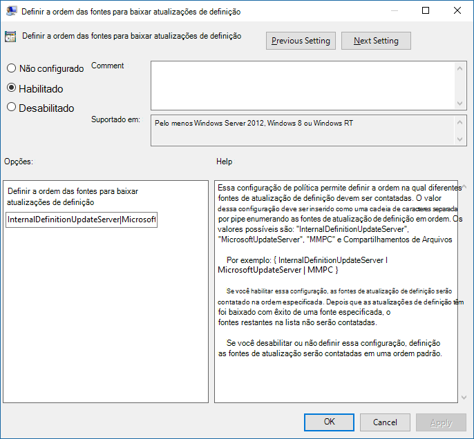

# <a name="manage-the-sources-for-microsoft-defender-antivirus-protection-updates"></a><span data-ttu-id="2b0ab-104">Gerenciar as fontes para atualizações de proteção do Microsoft Defender Antivírus</span><span class="sxs-lookup"><span data-stu-id="2b0ab-104">Manage the sources for Microsoft Defender Antivirus protection updates</span></span>

[!INCLUDE [Microsoft 365 Defender rebranding](../../includes/microsoft-defender.md)]


<span data-ttu-id="2b0ab-105">**Aplica-se a:**</span><span class="sxs-lookup"><span data-stu-id="2b0ab-105">**Applies to:**</span></span>

- [<span data-ttu-id="2b0ab-106">Microsoft Defender para Ponto de Extremidade</span><span class="sxs-lookup"><span data-stu-id="2b0ab-106">Microsoft Defender for Endpoint</span></span>](https://go.microsoft.com/fwlink/p/?linkid=22154037)

<a id="protection-updates"></a>
<!-- this has been used as anchor in VDI content -->

<span data-ttu-id="2b0ab-107">Manter a proteção antivírus atualizada é fundamental.</span><span class="sxs-lookup"><span data-stu-id="2b0ab-107">Keeping your antivirus protection up to date is critical.</span></span> <span data-ttu-id="2b0ab-108">Há dois componentes para gerenciar atualizações de proteção para o Microsoft Defender Antivírus:</span><span class="sxs-lookup"><span data-stu-id="2b0ab-108">There are two components to managing protection updates for Microsoft Defender Antivirus:</span></span> 
- <span data-ttu-id="2b0ab-109">*De* onde as atualizações são baixadas; e</span><span class="sxs-lookup"><span data-stu-id="2b0ab-109">*Where* the updates are downloaded from; and</span></span> 
- <span data-ttu-id="2b0ab-110">*Quando* as atualizações são baixadas e aplicadas.</span><span class="sxs-lookup"><span data-stu-id="2b0ab-110">*When* updates are downloaded and applied.</span></span> 

<span data-ttu-id="2b0ab-111">Este artigo descreve como especificar de onde as atualizações devem ser baixadas (isso também é conhecido como ordem de fallback).</span><span class="sxs-lookup"><span data-stu-id="2b0ab-111">This article describes how to specify from where updates should be downloaded (this is also known as the fallback order).</span></span> <span data-ttu-id="2b0ab-112">Consulte [Manage Microsoft Defender Antivírus updates](manage-updates-baselines-microsoft-defender-antivirus.md) and apply baselines topic for an overview on how updates work, and how to configure other aspects of updates (such as scheduling updates).</span><span class="sxs-lookup"><span data-stu-id="2b0ab-112">See [Manage Microsoft Defender Antivirus updates and apply baselines](manage-updates-baselines-microsoft-defender-antivirus.md) topic for an overview on how updates work, and how to configure other aspects of updates (such as scheduling updates).</span></span>

> [!IMPORTANT]
> <span data-ttu-id="2b0ab-113">As atualizações de inteligência de Segurança do Microsoft Defender Antivírus são entregues por meio do Windows Update e, a partir de segunda-feira, 21 de outubro de 2019, todas as atualizações de inteligência de segurança serão assinadas exclusivamente pelo SHA-2.</span><span class="sxs-lookup"><span data-stu-id="2b0ab-113">Microsoft Defender Antivirus Security intelligence updates are delivered through Windows Update and starting Monday, October 21, 2019, all security intelligence updates will be SHA-2 signed exclusively.</span></span> <span data-ttu-id="2b0ab-114">Seus dispositivos devem ser atualizados para dar suporte ao SHA-2 para atualizar sua inteligência de segurança.</span><span class="sxs-lookup"><span data-stu-id="2b0ab-114">Your devices must be updated to support SHA-2 in order to update your security intelligence.</span></span> <span data-ttu-id="2b0ab-115">Para saber mais, confira [2019 SHA-2 Code Signing Support requirement for Windows and WSUS](https://support.microsoft.com/help/4472027/2019-sha-2-code-signing-support-requirement-for-windows-and-wsus).</span><span class="sxs-lookup"><span data-stu-id="2b0ab-115">To learn more, see [2019 SHA-2 Code Signing Support requirement for Windows and WSUS](https://support.microsoft.com/help/4472027/2019-sha-2-code-signing-support-requirement-for-windows-and-wsus).</span></span>  


<a id="fallback-order"></a>

## <a name="fallback-order"></a><span data-ttu-id="2b0ab-116">Ordem de fallback</span><span class="sxs-lookup"><span data-stu-id="2b0ab-116">Fallback order</span></span>

<span data-ttu-id="2b0ab-117">Normalmente, você configura pontos de extremidade para baixar as atualizações individualmente de uma fonte primária seguida por outras fontes em ordem de prioridade, com base em sua configuração de rede.</span><span class="sxs-lookup"><span data-stu-id="2b0ab-117">Typically, you configure endpoints to individually download updates from a primary source followed by other sources in order of priority, based on your network configuration.</span></span> <span data-ttu-id="2b0ab-118">As atualizações são obtidas de fontes na ordem especificada.</span><span class="sxs-lookup"><span data-stu-id="2b0ab-118">Updates are obtained from sources in the order you specify.</span></span> <span data-ttu-id="2b0ab-119">Se uma fonte não estiver disponível, a próxima fonte da lista será usada imediatamente.</span><span class="sxs-lookup"><span data-stu-id="2b0ab-119">If a source is not available, the next source in the list is used immediately.</span></span>

<span data-ttu-id="2b0ab-120">Quando as atualizações são publicadas, alguma lógica é aplicada para minimizar o tamanho da atualização.</span><span class="sxs-lookup"><span data-stu-id="2b0ab-120">When updates are published, some logic is applied to minimize the size of the update.</span></span> <span data-ttu-id="2b0ab-121">Na maioria dos casos, apenas as diferenças entre a atualização mais recente e a atualização instalada no momento (isso é chamado de delta) no dispositivo são baixadas e aplicadas.</span><span class="sxs-lookup"><span data-stu-id="2b0ab-121">In most cases, only the differences between the latest update and the update that is currently installed (this is referred to as the delta) on the device is downloaded and applied.</span></span> <span data-ttu-id="2b0ab-122">No entanto, o tamanho do delta depende de dois fatores principais:</span><span class="sxs-lookup"><span data-stu-id="2b0ab-122">However, the size of the delta depends on two main factors:</span></span>
- <span data-ttu-id="2b0ab-123">A idade da última atualização no dispositivo; e</span><span class="sxs-lookup"><span data-stu-id="2b0ab-123">The age of the last update on the device; and</span></span> 
- <span data-ttu-id="2b0ab-124">A fonte usada para baixar e aplicar atualizações.</span><span class="sxs-lookup"><span data-stu-id="2b0ab-124">The source used to download and apply updates.</span></span> 

<span data-ttu-id="2b0ab-125">Quanto mais antigas as atualizações em um ponto de extremidade, maior será o download.</span><span class="sxs-lookup"><span data-stu-id="2b0ab-125">The older the updates on an endpoint, the larger the download will be.</span></span> <span data-ttu-id="2b0ab-126">No entanto, você também deve considerar a frequência de download.</span><span class="sxs-lookup"><span data-stu-id="2b0ab-126">However, you must also consider download frequency as well.</span></span> <span data-ttu-id="2b0ab-127">Um agendamento de atualização mais frequente pode resultar em mais uso de rede, enquanto um agendamento menos frequente pode resultar em tamanhos maiores de arquivo por download.</span><span class="sxs-lookup"><span data-stu-id="2b0ab-127">A more frequent update schedule can result in more network usage, whereas a less-frequent schedule can result in larger file sizes per download.</span></span> 

<span data-ttu-id="2b0ab-128">Há cinco locais onde você pode especificar onde um ponto de extremidade deve obter atualizações:</span><span class="sxs-lookup"><span data-stu-id="2b0ab-128">There are five locations where you can specify where an endpoint should obtain updates:</span></span> 

- [<span data-ttu-id="2b0ab-129">Microsoft Update</span><span class="sxs-lookup"><span data-stu-id="2b0ab-129">Microsoft Update</span></span>](https://support.microsoft.com/help/12373/windows-update-faq)
- [<span data-ttu-id="2b0ab-130">Serviço de Atualização do Windows Server</span><span class="sxs-lookup"><span data-stu-id="2b0ab-130">Windows Server Update Service</span></span>](/windows-server/administration/windows-server-update-services/get-started/windows-server-update-services-wsus)
- [<span data-ttu-id="2b0ab-131">Gerenciador de Configuração do Microsoft Endpoint</span><span class="sxs-lookup"><span data-stu-id="2b0ab-131">Microsoft Endpoint Configuration Manager</span></span>](/configmgr/core/servers/manage/updates)
- [<span data-ttu-id="2b0ab-132">Compartilhamento de arquivos de rede</span><span class="sxs-lookup"><span data-stu-id="2b0ab-132">Network file share</span></span>](#unc-share)
- <span data-ttu-id="2b0ab-133">Atualizações de inteligência de segurança para o Microsoft Defender Antivírus e outros [antimalware](https://www.microsoft.com/en-us/wdsi/defenderupdates) da Microsoft (Sua política e registro podem ter isso listado como inteligência de segurança Centro de Proteção contra Malware da Microsoft (MMPC), seu nome anterior.)</span><span class="sxs-lookup"><span data-stu-id="2b0ab-133">[Security intelligence updates for Microsoft Defender Antivirus and other Microsoft antimalware](https://www.microsoft.com/en-us/wdsi/defenderupdates) (Your policy and registry might have this listed as Microsoft Malware Protection Center (MMPC) security intelligence, its former name.)</span></span>

<span data-ttu-id="2b0ab-134">Para garantir o melhor nível de proteção, o Microsoft Update permite versões rápidas, o que significa downloads menores com frequência.</span><span class="sxs-lookup"><span data-stu-id="2b0ab-134">To ensure the best level of protection, Microsoft Update allows for rapid releases, which means smaller downloads on a frequent basis.</span></span> <span data-ttu-id="2b0ab-135">O Serviço de Atualização do Windows Server, o Microsoft Endpoint Configuration Manager e as fontes de atualizações de inteligência de segurança da Microsoft oferecem atualizações menos frequentes.</span><span class="sxs-lookup"><span data-stu-id="2b0ab-135">The Windows Server Update Service, Microsoft Endpoint Configuration Manager, and Microsoft security intelligence updates sources deliver less frequent updates.</span></span> <span data-ttu-id="2b0ab-136">Assim, o delta pode ser maior, resultando em downloads maiores.</span><span class="sxs-lookup"><span data-stu-id="2b0ab-136">Thus, the delta can be larger, resulting in larger downloads.</span></span> 

> [!IMPORTANT]
> <span data-ttu-id="2b0ab-137">Se você definiu as atualizações de página de inteligência do [Microsoft Security](https://www.microsoft.com/security/portal/definitions/adl.aspx) como uma fonte de fallback após o Windows Server Update Service ou o Microsoft Update, as atualizações só serão baixadas de atualizações de inteligência de segurança quando a atualização atual for considerada desajustada.</span><span class="sxs-lookup"><span data-stu-id="2b0ab-137">If you have set [Microsoft Security intelligence page](https://www.microsoft.com/security/portal/definitions/adl.aspx) updates as a fallback source after Windows Server Update Service or Microsoft Update, updates are only downloaded from security intelligence updates when the current update is considered out-of-date.</span></span> <span data-ttu-id="2b0ab-138">(Por padrão, são sete dias consecutivos em que não é possível aplicar atualizações do Serviço de Atualização do Windows Server ou dos serviços do Microsoft Update).</span><span class="sxs-lookup"><span data-stu-id="2b0ab-138">(By default, this is seven consecutive days of not being able to apply updates from the Windows Server Update Service or Microsoft Update services).</span></span>
> <span data-ttu-id="2b0ab-139">No entanto, você pode definir o número de dias antes que a [proteção seja relatada como desa data.](/windows/threat-protection/microsoft-defender-antivirus/manage-outdated-endpoints-microsoft-defender-antivirus#set-the-number-of-days-before-protection-is-reported-as-out-of-date)</span><span class="sxs-lookup"><span data-stu-id="2b0ab-139">You can, however, [set the number of days before protection is reported as out-of-date](/windows/threat-protection/microsoft-defender-antivirus/manage-outdated-endpoints-microsoft-defender-antivirus#set-the-number-of-days-before-protection-is-reported-as-out-of-date).</span></span><p>
> <span data-ttu-id="2b0ab-140">A partir de segunda-feira, 21 de outubro de 2019, as atualizações de inteligência de segurança serão assinadas exclusivamente pelo SHA-2.</span><span class="sxs-lookup"><span data-stu-id="2b0ab-140">Starting Monday, October 21, 2019, security intelligence updates will be SHA-2 signed exclusively.</span></span> <span data-ttu-id="2b0ab-141">Os dispositivos devem ser atualizados para dar suporte ao SHA-2 para obter as atualizações mais recentes de inteligência de segurança.</span><span class="sxs-lookup"><span data-stu-id="2b0ab-141">Devices must be updated to support SHA-2 in order to get the latest security intelligence updates.</span></span> <span data-ttu-id="2b0ab-142">Para saber mais, confira [2019 SHA-2 Code Signing Support requirement for Windows and WSUS](https://support.microsoft.com/help/4472027/2019-sha-2-code-signing-support-requirement-for-windows-and-wsus).</span><span class="sxs-lookup"><span data-stu-id="2b0ab-142">To learn more, see [2019 SHA-2 Code Signing Support requirement for Windows and WSUS](https://support.microsoft.com/help/4472027/2019-sha-2-code-signing-support-requirement-for-windows-and-wsus).</span></span>

<span data-ttu-id="2b0ab-143">Cada fonte tem cenários típicos que dependem de como sua rede é configurada, além da frequência com que publicam atualizações, conforme descrito na tabela a seguir:</span><span class="sxs-lookup"><span data-stu-id="2b0ab-143">Each source has typical scenarios that depend on how your network is configured, in addition to how often they publish updates, as described in the following table:</span></span>

|<span data-ttu-id="2b0ab-144">Local</span><span class="sxs-lookup"><span data-stu-id="2b0ab-144">Location</span></span> | <span data-ttu-id="2b0ab-145">Cenário de exemplo</span><span class="sxs-lookup"><span data-stu-id="2b0ab-145">Sample scenario</span></span> |
|---|---|
|<span data-ttu-id="2b0ab-146">Serviço de Atualização do Windows Server</span><span class="sxs-lookup"><span data-stu-id="2b0ab-146">Windows Server Update Service</span></span> | <span data-ttu-id="2b0ab-147">Você está usando o Serviço de Atualização do Windows Server para gerenciar atualizações para sua rede.</span><span class="sxs-lookup"><span data-stu-id="2b0ab-147">You are using Windows Server Update Service to manage updates for your network.</span></span>|
|<span data-ttu-id="2b0ab-148">Microsoft Update</span><span class="sxs-lookup"><span data-stu-id="2b0ab-148">Microsoft Update</span></span> | <span data-ttu-id="2b0ab-149">Você deseja que seus pontos de extremidade se conectem diretamente ao Microsoft Update.</span><span class="sxs-lookup"><span data-stu-id="2b0ab-149">You want your endpoints to connect directly to Microsoft Update.</span></span> <span data-ttu-id="2b0ab-150">Isso pode ser útil para pontos de extremidade que se conectam irregularmente à sua rede corporativa ou se você não usar o Serviço de Atualização do Windows Server para gerenciar suas atualizações.</span><span class="sxs-lookup"><span data-stu-id="2b0ab-150">This can be useful for endpoints that irregularly connect to your enterprise network, or if you do not use Windows Server Update Service to manage your updates.</span></span>|
|<span data-ttu-id="2b0ab-151">Compartilhamento de arquivos</span><span class="sxs-lookup"><span data-stu-id="2b0ab-151">File share</span></span> | <span data-ttu-id="2b0ab-152">Você tem dispositivos não conectados à Internet (como VMs).</span><span class="sxs-lookup"><span data-stu-id="2b0ab-152">You have non-Internet-connected devices (such as VMs).</span></span> <span data-ttu-id="2b0ab-153">Você pode usar seu host de VM conectado à Internet para baixar as atualizações para um compartilhamento de rede, a partir do qual as VMs podem obter as atualizações.</span><span class="sxs-lookup"><span data-stu-id="2b0ab-153">You can use your Internet-connected VM host to download the updates to a network share, from which the VMs can obtain the updates.</span></span> <span data-ttu-id="2b0ab-154">Consulte o [guia de implantação da VDI](deployment-vdi-microsoft-defender-antivirus.md) sobre como os compartilhamentos de arquivos podem ser usados em ambientes de infraestrutura de área de trabalho virtual (VDI).</span><span class="sxs-lookup"><span data-stu-id="2b0ab-154">See the [VDI deployment guide](deployment-vdi-microsoft-defender-antivirus.md) for how file shares can be used in virtual desktop infrastructure (VDI) environments.</span></span>|
|<span data-ttu-id="2b0ab-155">Microsoft Endpoint Manager</span><span class="sxs-lookup"><span data-stu-id="2b0ab-155">Microsoft Endpoint Manager</span></span> | <span data-ttu-id="2b0ab-156">Você está usando o Microsoft Endpoint Manager para atualizar seus pontos de extremidade.</span><span class="sxs-lookup"><span data-stu-id="2b0ab-156">You are using Microsoft Endpoint Manager to update your endpoints.</span></span>|
|<span data-ttu-id="2b0ab-157">Atualizações de inteligência de segurança para o Microsoft Defender Antivírus e outros antimalware da Microsoft (anteriormente chamado de MMPC)</span><span class="sxs-lookup"><span data-stu-id="2b0ab-157">Security intelligence updates for Microsoft Defender Antivirus and other Microsoft antimalware (formerly referred to as MMPC)</span></span> |<span data-ttu-id="2b0ab-158">[Certifique-se de que seus dispositivos sejam atualizados para dar suporte a SHA-2](https://support.microsoft.com/help/4472027/2019-sha-2-code-signing-support-requirement-for-windows-and-wsus).</span><span class="sxs-lookup"><span data-stu-id="2b0ab-158">[Make sure your devices are updated to support SHA-2](https://support.microsoft.com/help/4472027/2019-sha-2-code-signing-support-requirement-for-windows-and-wsus).</span></span> <span data-ttu-id="2b0ab-159">As atualizações de inteligência de segurança do Microsoft Defender Antivírus são entregues por meio do Windows Update e, a partir de segunda-feira, 21 de outubro de 2019, as atualizações de inteligência de segurança serão assinadas exclusivamente pelo SHA-2.</span><span class="sxs-lookup"><span data-stu-id="2b0ab-159">Microsoft Defender Antivirus Security intelligence updates are delivered through Windows Update, and starting Monday October 21, 2019 security intelligence updates will be SHA-2 signed exclusively.</span></span> <br/><span data-ttu-id="2b0ab-160">Baixe as atualizações de proteção mais recentes devido a uma infecção recente ou para ajudar a provisionar uma imagem forte e base para implantação [VDI.](deployment-vdi-microsoft-defender-antivirus.md)</span><span class="sxs-lookup"><span data-stu-id="2b0ab-160">Download the latest protection updates because of a recent infection or to help provision a strong, base image for [VDI deployment](deployment-vdi-microsoft-defender-antivirus.md).</span></span> <span data-ttu-id="2b0ab-161">Essa opção geralmente deve ser usada apenas como uma fonte de fallback final, e não como a fonte primária.</span><span class="sxs-lookup"><span data-stu-id="2b0ab-161">This option should generally be used only as a final fallback source, and not the primary source.</span></span> <span data-ttu-id="2b0ab-162">Ele só será usado se as atualizações não puderem ser baixadas do Windows Server Update Service ou do Microsoft Update por um [número especificado de dias.](/windows/threat-protection/microsoft-defender-antivirus/manage-outdated-endpoints-microsoft-defender-antivirus#set-the-number-of-days-before-protection-is-reported-as-out-of-date)</span><span class="sxs-lookup"><span data-stu-id="2b0ab-162">It will only be used if updates cannot be downloaded from Windows Server Update Service or Microsoft Update for [a specified number of days](/windows/threat-protection/microsoft-defender-antivirus/manage-outdated-endpoints-microsoft-defender-antivirus#set-the-number-of-days-before-protection-is-reported-as-out-of-date).</span></span>|

<span data-ttu-id="2b0ab-163">Você pode gerenciar a ordem na qual as fontes de atualização são usadas com a Política de Grupo, o Microsoft Endpoint Configuration Manager, os cmdlets do PowerShell e o WMI.</span><span class="sxs-lookup"><span data-stu-id="2b0ab-163">You can manage the order in which update sources are used with Group Policy, Microsoft Endpoint Configuration Manager, PowerShell cmdlets, and WMI.</span></span>

> [!IMPORTANT]
> <span data-ttu-id="2b0ab-164">Se você definir o Serviço de Atualização do Windows Server como local de download, deverá aprovar as atualizações, independentemente da ferramenta de gerenciamento usada para especificar o local.</span><span class="sxs-lookup"><span data-stu-id="2b0ab-164">If you set Windows Server Update Service as a download location, you must approve the updates, regardless of the management tool you use to specify the location.</span></span> <span data-ttu-id="2b0ab-165">Você pode configurar uma regra de aprovação automática com o Serviço de Atualização do Windows Server, o que pode ser útil à medida que as atualizações chegam pelo menos uma vez por dia.</span><span class="sxs-lookup"><span data-stu-id="2b0ab-165">You can set up an automatic approval rule with Windows Server Update Service, which might be useful as updates arrive at least once a day.</span></span> <span data-ttu-id="2b0ab-166">Para saber mais, confira [sincronizar atualizações](/configmgr/protect/deploy-use/endpoint-definitions-wsus#to-synchronize-endpoint-protection-definition-updates-in-standalone-wsus)de proteção de ponto de extremidade no Serviço de Atualização do Windows Server autônomo.</span><span class="sxs-lookup"><span data-stu-id="2b0ab-166">To learn more, see [synchronize endpoint protection updates in standalone Windows Server Update Service](/configmgr/protect/deploy-use/endpoint-definitions-wsus#to-synchronize-endpoint-protection-definition-updates-in-standalone-wsus).</span></span>

<span data-ttu-id="2b0ab-167">Os procedimentos neste artigo descrevem primeiro como definir a ordem e, em seguida, como configurar a opção **Compartilhamento** de arquivos se você a habilitar.</span><span class="sxs-lookup"><span data-stu-id="2b0ab-167">The procedures in this article first describe how to set the order, and then how to set up the **File share** option if you have enabled it.</span></span>

## <a name="use-group-policy-to-manage-the-update-location"></a><span data-ttu-id="2b0ab-168">Usar a Política de Grupo para gerenciar o local de atualização</span><span class="sxs-lookup"><span data-stu-id="2b0ab-168">Use Group Policy to manage the update location</span></span>

1. <span data-ttu-id="2b0ab-169">Em sua máquina de gerenciamento de Política de Grupo, abra o Console de Gerenciamento de Política de [Grupo](/previous-versions/windows/it-pro/windows-server-2008-R2-and-2008/cc731212(v=ws.11)), clique com o botão direito do mouse no Objeto de Política de Grupo que você deseja configurar e clique em **Editar**.</span><span class="sxs-lookup"><span data-stu-id="2b0ab-169">On your Group Policy management machine, open the [Group Policy Management Console](/previous-versions/windows/it-pro/windows-server-2008-R2-and-2008/cc731212(v=ws.11)), right-click the Group Policy Object you want to configure and click **Edit**.</span></span>

2. <span data-ttu-id="2b0ab-170">No Editor **de Gerenciamento de Política de Grupo,** vá para **Configuração do computador.**</span><span class="sxs-lookup"><span data-stu-id="2b0ab-170">In the **Group Policy Management Editor** go to **Computer configuration**.</span></span>

3. <span data-ttu-id="2b0ab-171">Clique **em Políticas** e modelos **administrativos.**</span><span class="sxs-lookup"><span data-stu-id="2b0ab-171">Click **Policies** then **Administrative templates**.</span></span>

4. <span data-ttu-id="2b0ab-172">Expanda a árvore para **componentes do Windows > Windows Defender > atualizações de assinatura e** configure as seguintes configurações:</span><span class="sxs-lookup"><span data-stu-id="2b0ab-172">Expand the tree to **Windows components > Windows Defender > Signature updates** and configure the following settings:</span></span>

   1.  <span data-ttu-id="2b0ab-173">Clique duas vezes na **configuração Definir a ordem das fontes para baixar** atualizações de inteligência de segurança e defina a opção como **Habilitado**.</span><span class="sxs-lookup"><span data-stu-id="2b0ab-173">Double-click the **Define the order of sources for downloading security intelligence updates** setting and set the option to **Enabled**.</span></span>

   2.  <span data-ttu-id="2b0ab-174">Insira a ordem das fontes, separada por um único pipe, por exemplo: `InternalDefinitionUpdateServer|MicrosoftUpdateServer|MMPC` , conforme mostrado na captura de tela a seguir.</span><span class="sxs-lookup"><span data-stu-id="2b0ab-174">Enter the order of sources, separated by a single pipe, for example: `InternalDefinitionUpdateServer|MicrosoftUpdateServer|MMPC`, as shown in the following screenshot.</span></span>

   

   3. <span data-ttu-id="2b0ab-176">Clique em **OK**.</span><span class="sxs-lookup"><span data-stu-id="2b0ab-176">Click **OK**.</span></span> <span data-ttu-id="2b0ab-177">Isso definirá a ordem das fontes de atualização de proteção.</span><span class="sxs-lookup"><span data-stu-id="2b0ab-177">This will set the order of protection update sources.</span></span>

   4. <span data-ttu-id="2b0ab-178">Clique duas vezes na **configuração Definir compartilhamentos** de arquivos para baixar atualizações de inteligência de segurança e defina a opção **como Habilitado**.</span><span class="sxs-lookup"><span data-stu-id="2b0ab-178">Double-click the **Define file shares for downloading security intelligence updates** setting and set the option to **Enabled**.</span></span>

   5. <span data-ttu-id="2b0ab-179">Insira a fonte de compartilhamento de arquivos.</span><span class="sxs-lookup"><span data-stu-id="2b0ab-179">Enter the file share source.</span></span> <span data-ttu-id="2b0ab-180">Se você tiver várias fontes, insira cada fonte na ordem em que elas devem ser usadas, separadas por um único pipe.</span><span class="sxs-lookup"><span data-stu-id="2b0ab-180">If you have multiple sources, enter each source in the order they should be used, separated by a single pipe.</span></span> <span data-ttu-id="2b0ab-181">Use [a notação UNC padrão](/openspecs/windows_protocols/ms-dtyp/62e862f4-2a51-452e-8eeb-dc4ff5ee33cc) para denotar o caminho, por exemplo: `\\host-name1\share-name\object-name|\\host-name2\share-name\object-name` .</span><span class="sxs-lookup"><span data-stu-id="2b0ab-181">Use [standard UNC notation](/openspecs/windows_protocols/ms-dtyp/62e862f4-2a51-452e-8eeb-dc4ff5ee33cc) for denoting the path, for example: `\\host-name1\share-name\object-name|\\host-name2\share-name\object-name`.</span></span>  <span data-ttu-id="2b0ab-182">Se você não inserir nenhum caminho, essa fonte será ignorada quando a VM baixar atualizações.</span><span class="sxs-lookup"><span data-stu-id="2b0ab-182">If you do not enter any paths, then this source will be skipped when the VM downloads updates.</span></span>

   6. <span data-ttu-id="2b0ab-183">Clique em **OK**.</span><span class="sxs-lookup"><span data-stu-id="2b0ab-183">Click **OK**.</span></span> <span data-ttu-id="2b0ab-184">Isso definirá a ordem dos compartilhamentos de arquivos quando essa fonte for referenciada na configuração Definir a ordem **das fontes...** da política de grupo.</span><span class="sxs-lookup"><span data-stu-id="2b0ab-184">This will set the order of file shares when that source is referenced in the **Define the order of sources...** group policy setting.</span></span>

> [!NOTE]
> <span data-ttu-id="2b0ab-185">Para o Windows 10, versões 1703 até e incluindo 1809, o caminho da política é Componentes do **Windows > Microsoft Defender Antivírus >** Atualizações de Assinatura para Windows 10, versão 1903, o caminho da política é Componentes do Windows > Microsoft Defender **Antivírus > Atualizações de** Inteligência de Segurança</span><span class="sxs-lookup"><span data-stu-id="2b0ab-185">For Windows 10, versions 1703 up to and including 1809, the policy path is **Windows Components > Microsoft Defender Antivirus > Signature Updates** For Windows 10, version 1903, the policy path is **Windows Components > Microsoft Defender Antivirus > Security Intelligence Updates**</span></span>

## <a name="use-configuration-manager-to-manage-the-update-location"></a><span data-ttu-id="2b0ab-186">Usar o Configuration Manager para gerenciar o local de atualização</span><span class="sxs-lookup"><span data-stu-id="2b0ab-186">Use Configuration Manager to manage the update location</span></span>

<span data-ttu-id="2b0ab-187">Consulte [Configure Security intelligence Updates for Endpoint Protection](/configmgr/protect/deploy-use/endpoint-definition-updates) para obter detalhes sobre como configurar o Microsoft Endpoint Manager (branch atual).</span><span class="sxs-lookup"><span data-stu-id="2b0ab-187">See [Configure Security intelligence Updates for Endpoint Protection](/configmgr/protect/deploy-use/endpoint-definition-updates) for details on configuring Microsoft Endpoint Manager (current branch).</span></span>


## <a name="use-powershell-cmdlets-to-manage-the-update-location"></a><span data-ttu-id="2b0ab-188">Usar cmdlets do PowerShell para gerenciar o local de atualização</span><span class="sxs-lookup"><span data-stu-id="2b0ab-188">Use PowerShell cmdlets to manage the update location</span></span>

<span data-ttu-id="2b0ab-189">Use os seguintes cmdlets do PowerShell para definir a ordem de atualização.</span><span class="sxs-lookup"><span data-stu-id="2b0ab-189">Use the following PowerShell cmdlets to set the update order.</span></span>

```PowerShell
Set-MpPreference -SignatureFallbackOrder {LOCATION|LOCATION|LOCATION|LOCATION}
Set-MpPreference -SignatureDefinitionUpdateFileSharesSource {\\UNC SHARE PATH|\\UNC SHARE PATH}
```
<span data-ttu-id="2b0ab-190">Confira os seguintes artigos para obter mais informações:</span><span class="sxs-lookup"><span data-stu-id="2b0ab-190">See the following articles for more information:</span></span>
- [<span data-ttu-id="2b0ab-191">Set-MpPreference -SignatureFallbackOrder</span><span class="sxs-lookup"><span data-stu-id="2b0ab-191">Set-MpPreference -SignatureFallbackOrder</span></span>](/powershell/module/defender/set-mppreference)
- [<span data-ttu-id="2b0ab-192">Set-MpPreference -SignatureDefinitionUpdateFileSharesSource</span><span class="sxs-lookup"><span data-stu-id="2b0ab-192">Set-MpPreference -SignatureDefinitionUpdateFileSharesSource</span></span>](/powershell/module/defender/set-mppreference#-signaturedefinitionupdatefilesharessources)
- [<span data-ttu-id="2b0ab-193">Usar cmdlets do PowerShell para configurar e executar o Microsoft Defender Antivírus</span><span class="sxs-lookup"><span data-stu-id="2b0ab-193">Use PowerShell cmdlets to configure and run Microsoft Defender Antivirus</span></span>](use-powershell-cmdlets-microsoft-defender-antivirus.md)
- [<span data-ttu-id="2b0ab-194">Cmdlets defender</span><span class="sxs-lookup"><span data-stu-id="2b0ab-194">Defender cmdlets</span></span>](/powershell/module/defender/index)

## <a name="use-windows-management-instruction-wmi-to-manage-the-update-location"></a><span data-ttu-id="2b0ab-195">Usar a Instrução de Gerenciamento do Windows (WMI) para gerenciar o local de atualização</span><span class="sxs-lookup"><span data-stu-id="2b0ab-195">Use Windows Management Instruction (WMI) to manage the update location</span></span>

<span data-ttu-id="2b0ab-196">Use o [ **método Set** da classe **MSFT_MpPreference**](/previous-versions/windows/desktop/legacy/dn455323(v=vs.85)) para as seguintes propriedades:</span><span class="sxs-lookup"><span data-stu-id="2b0ab-196">Use the [**Set** method of the **MSFT_MpPreference**](/previous-versions/windows/desktop/legacy/dn455323(v=vs.85)) class for the following properties:</span></span>

```WMI
SignatureFallbackOrder
SignatureDefinitionUpdateFileSharesSource
```

<span data-ttu-id="2b0ab-197">Confira os seguintes artigos para obter mais informações:</span><span class="sxs-lookup"><span data-stu-id="2b0ab-197">See the following articles for more information:</span></span>
- [<span data-ttu-id="2b0ab-198">Windows Defender WMIv2 APIs</span><span class="sxs-lookup"><span data-stu-id="2b0ab-198">Windows Defender WMIv2 APIs</span></span>](/previous-versions/windows/desktop/defender/windows-defender-wmiv2-apis-portal)

## <a name="use-mobile-device-management-mdm-to-manage-the-update-location"></a><span data-ttu-id="2b0ab-199">Usar o Gerenciamento de Dispositivo Móvel (MDM) para gerenciar o local da atualização</span><span class="sxs-lookup"><span data-stu-id="2b0ab-199">Use Mobile Device Management (MDM) to manage the update location</span></span>

<span data-ttu-id="2b0ab-200">Consulte [CSP de política - Defender/SignatureUpdateFallbackOrder](/windows/client-management/mdm/policy-csp-defender#defender-signatureupdatefallbackorder) para obter detalhes sobre como configurar o MDM.</span><span class="sxs-lookup"><span data-stu-id="2b0ab-200">See [Policy CSP - Defender/SignatureUpdateFallbackOrder](/windows/client-management/mdm/policy-csp-defender#defender-signatureupdatefallbackorder) for details on configuring MDM.</span></span>

## <a name="what-if-were-using-a-third-party-vendor"></a><span data-ttu-id="2b0ab-201">E se estamos usando um fornecedor de terceiros?</span><span class="sxs-lookup"><span data-stu-id="2b0ab-201">What if we're using a third-party vendor?</span></span>

<span data-ttu-id="2b0ab-202">Este artigo descreve como configurar e gerenciar atualizações para o Microsoft Defender Antivírus.</span><span class="sxs-lookup"><span data-stu-id="2b0ab-202">This article describes how to configure and manage updates for Microsoft Defender Antivirus.</span></span> <span data-ttu-id="2b0ab-203">No entanto, fornecedores de terceiros podem ser usados para executar essas tarefas.</span><span class="sxs-lookup"><span data-stu-id="2b0ab-203">However, third-party vendors can be used to perform these tasks.</span></span> 

<span data-ttu-id="2b0ab-204">Por exemplo, suponha que a Contoso tenha contratado a Fabrikam para gerenciar sua solução de segurança, que inclui o Microsoft Defender Antivírus.</span><span class="sxs-lookup"><span data-stu-id="2b0ab-204">For example, suppose that Contoso has hired Fabrikam to manage their security solution, which includes Microsoft Defender Antivirus.</span></span> <span data-ttu-id="2b0ab-205">A Fabrikam normalmente usa Instrumentação de Gerenciamento do [Windows,](./use-wmi-microsoft-defender-antivirus.md) [cmdlets](./use-powershell-cmdlets-microsoft-defender-antivirus.md)do PowerShell ou linha de comando do [Windows](./command-line-arguments-microsoft-defender-antivirus.md) para implantar patches e atualizações.</span><span class="sxs-lookup"><span data-stu-id="2b0ab-205">Fabrikam typically uses [Windows Management Instrumentation](./use-wmi-microsoft-defender-antivirus.md), [PowerShell cmdlets](./use-powershell-cmdlets-microsoft-defender-antivirus.md), or [Windows command-line](./command-line-arguments-microsoft-defender-antivirus.md) to deploy patches and updates.</span></span> 

> [!NOTE]
> <span data-ttu-id="2b0ab-206">A Microsoft não testa soluções de terceiros para gerenciar o Microsoft Defender Antivírus.</span><span class="sxs-lookup"><span data-stu-id="2b0ab-206">Microsoft does not test third-party solutions for managing Microsoft Defender Antivirus.</span></span>

<a id="unc-share"></a>
## <a name="create-a-unc-share-for-security-intelligence-updates"></a><span data-ttu-id="2b0ab-207">Criar um compartilhamento UNC para atualizações de inteligência de segurança</span><span class="sxs-lookup"><span data-stu-id="2b0ab-207">Create a UNC share for security intelligence updates</span></span>

<span data-ttu-id="2b0ab-208">Configurar um compartilhamento de arquivos de rede (UNC/unidade mapeada) para baixar atualizações de inteligência de segurança do site MMPC usando uma tarefa agendada.</span><span class="sxs-lookup"><span data-stu-id="2b0ab-208">Set up a network file share (UNC/mapped drive) to download security intelligence updates from the MMPC site by using a scheduled task.</span></span>

1. <span data-ttu-id="2b0ab-209">No sistema no qual você deseja provisionar o compartilhamento e baixar as atualizações, crie uma pasta para a qual você salvará o script.</span><span class="sxs-lookup"><span data-stu-id="2b0ab-209">On the system on which you want to provision the share and download the updates, create a folder to which you will save the script.</span></span>
    ```DOS
    Start, CMD (Run as admin)
    MD C:\Tool\PS-Scripts\
    ```

2. <span data-ttu-id="2b0ab-210">Crie a pasta na qual você salvará as atualizações de assinatura.</span><span class="sxs-lookup"><span data-stu-id="2b0ab-210">Create the folder to which you will save the signature updates.</span></span>
    ```DOS
    MD C:\Temp\TempSigs\x64
    MD C:\Temp\TempSigs\x86
    ```

3. <span data-ttu-id="2b0ab-211">Baixe o script do PowerShell do [www.powershellgallery.com/packages/SignatureDownloadCustomTask/1.4](https://www.powershellgallery.com/packages/SignatureDownloadCustomTask/1.4).</span><span class="sxs-lookup"><span data-stu-id="2b0ab-211">Download the PowerShell script from [www.powershellgallery.com/packages/SignatureDownloadCustomTask/1.4](https://www.powershellgallery.com/packages/SignatureDownloadCustomTask/1.4).</span></span>

4. <span data-ttu-id="2b0ab-212">Clique **em Download Manual**.</span><span class="sxs-lookup"><span data-stu-id="2b0ab-212">Click **Manual Download**.</span></span>

5. <span data-ttu-id="2b0ab-213">Clique **em Baixar o arquivo nupkg bruto.**</span><span class="sxs-lookup"><span data-stu-id="2b0ab-213">Click **Download the raw nupkg file**.</span></span>

6. <span data-ttu-id="2b0ab-214">Extraia o arquivo.</span><span class="sxs-lookup"><span data-stu-id="2b0ab-214">Extract the file.</span></span>

7. <span data-ttu-id="2b0ab-215">Copie o arquivo SignatureDownloadCustomTask.ps1 para a pasta que você criou anteriormente, C:\Tool\PS-Scripts\ .</span><span class="sxs-lookup"><span data-stu-id="2b0ab-215">Copy the file SignatureDownloadCustomTask.ps1 to the folder you previously created, C:\Tool\PS-Scripts\ .</span></span>

8. <span data-ttu-id="2b0ab-216">Use a linha de comando para configurar a tarefa agendada.</span><span class="sxs-lookup"><span data-stu-id="2b0ab-216">Use the command line to set up the scheduled task.</span></span>
    > [!NOTE]
    > <span data-ttu-id="2b0ab-217">Há dois tipos de atualizações: completo e delta.</span><span class="sxs-lookup"><span data-stu-id="2b0ab-217">There are two types of updates: full and delta.</span></span>
   - <span data-ttu-id="2b0ab-218">Para delta x64:</span><span class="sxs-lookup"><span data-stu-id="2b0ab-218">For x64 delta:</span></span>

       ```DOS
       Powershell (Run as admin)
    
       C:\Tool\PS-Scripts\
    
       “.\SignatureDownloadCustomTask.ps1 -action create -arch x64 -isDelta $true -destDir C:\Temp\TempSigs\x64 -scriptPath C:\Tool\PS-Scripts\SignatureDownloadCustomTask.ps1 -daysInterval 1”
       ```

   - <span data-ttu-id="2b0ab-219">Para x64 completo:</span><span class="sxs-lookup"><span data-stu-id="2b0ab-219">For x64 full:</span></span>

       ```DOS
       Powershell (Run as admin)
    
       C:\Tool\PS-Scripts\
    
       “.\SignatureDownloadCustomTask.ps1 -action create -arch x64 -isDelta $false -destDir C:\Temp\TempSigs\x64 -scriptPath C:\Tool\PS-Scripts\SignatureDownloadCustomTask.ps1 -daysInterval 1”
       ```

   - <span data-ttu-id="2b0ab-220">Para delta x86:</span><span class="sxs-lookup"><span data-stu-id="2b0ab-220">For x86 delta:</span></span>

       ```DOS
       Powershell (Run as admin)
    
       C:\Tool\PS-Scripts\
    
       “.\SignatureDownloadCustomTask.ps1 -action create -arch x86 -isDelta $true -destDir C:\Temp\TempSigs\x86 -scriptPath C:\Tool\PS-Scripts\SignatureDownloadCustomTask.ps1 -daysInterval 1”
       ```

   - <span data-ttu-id="2b0ab-221">Para x86 completo:</span><span class="sxs-lookup"><span data-stu-id="2b0ab-221">For x86 full:</span></span>

       ```DOS
       Powershell (Run as admin)
    
       C:\Tool\PS-Scripts\
    
       “.\SignatureDownloadCustomTask.ps1 -action create -arch x86 -isDelta $false -destDir C:\Temp\TempSigs\x86 -scriptPath C:\Tool\PS-Scripts\SignatureDownloadCustomTask.ps1 -daysInterval 1”
       ```

    > [!NOTE]
    > <span data-ttu-id="2b0ab-222">Quando as tarefas agendadas são criadas, você pode encontrá-los no Agendador de Tarefas em Microsoft\Windows\Windows Defender</span><span class="sxs-lookup"><span data-stu-id="2b0ab-222">When the scheduled tasks are created, you can find these in the Task Scheduler under Microsoft\Windows\Windows Defender</span></span>
9. <span data-ttu-id="2b0ab-223">Execute cada tarefa manualmente e verifique se você tem dados (mpam-d.exe, mpam-fe.exe e nis_full.exe) nas pastas a seguir (você pode ter escolhido locais diferentes):</span><span class="sxs-lookup"><span data-stu-id="2b0ab-223">Run each task manually and verify that you have data (mpam-d.exe, mpam-fe.exe, and nis_full.exe) in the following folders (you might have chosen different locations):</span></span>

   - <span data-ttu-id="2b0ab-224">C:\Temp\TempSigs\x86</span><span class="sxs-lookup"><span data-stu-id="2b0ab-224">C:\Temp\TempSigs\x86</span></span>
   - <span data-ttu-id="2b0ab-225">C:\Temp\TempSigs\x64</span><span class="sxs-lookup"><span data-stu-id="2b0ab-225">C:\Temp\TempSigs\x64</span></span>

   <span data-ttu-id="2b0ab-226">Se a tarefa agendada falhar, execute os seguintes comandos:</span><span class="sxs-lookup"><span data-stu-id="2b0ab-226">If the scheduled task fails, run the following commands:</span></span>

    ```DOS
    C:\windows\system32\windowspowershell\v1.0\powershell.exe -NoProfile -executionpolicy allsigned -command “&\”C:\Tool\PS-Scripts\SignatureDownloadCustomTask.ps1\” -action run -arch x64 -isDelta $False -destDir C:\Temp\TempSigs\x64″
    
    C:\windows\system32\windowspowershell\v1.0\powershell.exe -NoProfile -executionpolicy allsigned -command “&\”C:\Tool\PS-Scripts\SignatureDownloadCustomTask.ps1\” -action run -arch x64 -isDelta $True -destDir C:\Temp\TempSigs\x64″
    
    C:\windows\system32\windowspowershell\v1.0\powershell.exe -NoProfile -executionpolicy allsigned -command “&\”C:\Tool\PS-Scripts\SignatureDownloadCustomTask.ps1\” -action run -arch x86 -isDelta $False -destDir C:\Temp\TempSigs\x86″
    
    C:\windows\system32\windowspowershell\v1.0\powershell.exe -NoProfile -executionpolicy allsigned -command “&\”C:\Tool\PS-Scripts\SignatureDownloadCustomTask.ps1\” -action run -arch x86 -isDelta $True -destDir C:\Temp\TempSigs\x86″
    ```
    > [!NOTE]
    > <span data-ttu-id="2b0ab-227">Os problemas também podem ser devido à política de execução.</span><span class="sxs-lookup"><span data-stu-id="2b0ab-227">Issues could also be due to execution policy.</span></span>
    
10. <span data-ttu-id="2b0ab-228">Crie um compartilhamento apontando para C:\Temp\TempSigs (por exemplo, \\ server\updates).</span><span class="sxs-lookup"><span data-stu-id="2b0ab-228">Create a share pointing to C:\Temp\TempSigs (e.g. \\server\updates).</span></span>
    > [!NOTE]
    > <span data-ttu-id="2b0ab-229">No mínimo, os usuários autenticados devem ter acesso a "Leitura".</span><span class="sxs-lookup"><span data-stu-id="2b0ab-229">At a minimum, authenticated users must have “Read” access.</span></span>
11. <span data-ttu-id="2b0ab-230">De definir o local de compartilhamento na política para o compartilhamento.</span><span class="sxs-lookup"><span data-stu-id="2b0ab-230">Set the share location in the policy to the share.</span></span>

    > [!NOTE]
    > <span data-ttu-id="2b0ab-231">Não adicione a pasta x64 (ou x86) no caminho.</span><span class="sxs-lookup"><span data-stu-id="2b0ab-231">Do not add the x64 (or x86) folder in the path.</span></span> <span data-ttu-id="2b0ab-232">O mpcmdrun.exe o processo adiciona automaticamente.</span><span class="sxs-lookup"><span data-stu-id="2b0ab-232">The mpcmdrun.exe process adds it automatically.</span></span>

## <a name="related-articles"></a><span data-ttu-id="2b0ab-233">Artigos relacionados</span><span class="sxs-lookup"><span data-stu-id="2b0ab-233">Related articles</span></span>

- [<span data-ttu-id="2b0ab-234">Implantar o Microsoft Defender Antivírus</span><span class="sxs-lookup"><span data-stu-id="2b0ab-234">Deploy Microsoft Defender Antivirus</span></span>](deploy-manage-report-microsoft-defender-antivirus.md)
- [<span data-ttu-id="2b0ab-235">Gerenciar atualizações do Microsoft Defender Antivírus e aplicar linhas de base</span><span class="sxs-lookup"><span data-stu-id="2b0ab-235">Manage Microsoft Defender Antivirus updates and apply baselines</span></span>](manage-updates-baselines-microsoft-defender-antivirus.md)
- [<span data-ttu-id="2b0ab-236">Gerenciar atualizações para pontos de extremidade que estão des date</span><span class="sxs-lookup"><span data-stu-id="2b0ab-236">Manage updates for endpoints that are out of date</span></span>](manage-outdated-endpoints-microsoft-defender-antivirus.md)
- [<span data-ttu-id="2b0ab-237">Gerenciar atualizações forçadas baseadas em eventos</span><span class="sxs-lookup"><span data-stu-id="2b0ab-237">Manage event-based forced updates</span></span>](manage-event-based-updates-microsoft-defender-antivirus.md)
- [<span data-ttu-id="2b0ab-238">Gerenciar atualizações para dispositivos móveis e VMs</span><span class="sxs-lookup"><span data-stu-id="2b0ab-238">Manage updates for mobile devices and VMs</span></span>](manage-updates-mobile-devices-vms-microsoft-defender-antivirus.md)
- [<span data-ttu-id="2b0ab-239">Microsoft Defender Antivírus no Windows 10</span><span class="sxs-lookup"><span data-stu-id="2b0ab-239">Microsoft Defender Antivirus in Windows 10</span></span>](microsoft-defender-antivirus-in-windows-10.md)