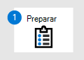
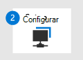

# Migrar da McAfee - Fase 1: Preparar-se para sua migração

**Aplica-se a:**
- [Microsoft Defender para Ponto de Extremidade](https://go.microsoft.com/fwlink/p/?linkid=2154037)
- [Microsoft 365 Defender](https://go.microsoft.com/fwlink/?linkid=2118804)

| Fase 1: Preparar | [Fase 2: Configurar](mcafee-to-microsoft-defender-setup.md) | [Fase 3: Integrar](mcafee-to-microsoft-defender-onboard.md) |
|--|--|--|
|*Você está aqui!*| | |

**Bem-vindo à fase preparar [a migração da McAfee Endpoint Security (McAfee) para o Defender para o Ponto de Extremidade.](mcafee-to-microsoft-defender-migration.md#the-migration-process)** 

Essa fase de migração inclui as seguintes etapas:
1. [Obter e implantar atualizações nos dispositivos da sua organização](#get-and-deploy-updates-across-your-organizations-devices)

2. [Obter o Defender para o Ponto de Extremidade](#get-microsoft-defender-for-endpoint).

3. [Conceda acesso ao Central de Segurança do Microsoft Defender](#grant-access-to-the-microsoft-defender-security-center).

4. [Configure as configurações de proxy de dispositivo e conectividade com a Internet.](#configure-device-proxy-and-internet-connectivity-settings)

## Obter e implantar atualizações nos dispositivos da sua organização

Como prática prática, mantenha os dispositivos e pontos de extremidade da sua organização atualizados. Certifique-se de que sua solução mcAfee Endpoint Security (McAfee) está atualizada e que os sistemas operacionais e aplicativos da sua organização também têm as atualizações mais recentes. Fazer isso agora pode ajudar a evitar problemas mais tarde à medida que você migra para o Defender para o Ponto de Extremidade.

### Certifique-se de que sua solução McAfee está atualizada

Mantenha a McAfee atualizada e certifique-se de que os dispositivos da sua organização tenham as atualizações de segurança mais recentes. Precisa de ajuda? Aqui estão alguns recursos da McAfee:

- [McAfee Enterprise documentação do produto: como funciona a segurança do ponto de extremidade](https://docs.mcafee.com/bundle/endpoint-security-10.7.x-common-product-guide-windows/page/GUID-1207FF39-D1D2-481F-BBD9-E4079112A8DD.html)

- [Artigo técnico do Centro de Conhecimento da McAfee: Segurança do Windows Center relata incorretamente que a Segurança do Ponto de Extremidade está desabilitada ao ser executado Windows 10](https://kc.mcafee.com/corporate/index?page=content&id=KB91830) 

- [Artigo técnico do Centro de Conhecimento da McAfee: Segurança do Windows central relata que a Segurança do Ponto de Extremidade está desabilitada quando o Endpoint Security está em execução](https://kc.mcafee.com/corporate/index?page=content&id=KB91428)

- Seu Suporte do McAfee ServicePortal ( [http://mysupport.mcafee.com](http://mysupport.mcafee.com) )

### Certifique-se de que os dispositivos da sua organização estão atualizados

Precisa de ajuda para atualizar os dispositivos da sua organização? Consulte os seguintes recursos:

|SISTEMA OPERACIONAL | Recurso |
|:--|:--|
|Windows |[Microsoft Update](https://www.update.microsoft.com) |
|macOS | [Como atualizar o software em seu Mac](https://support.apple.com/HT201541)|
|iOS |[Atualizar seu iPhone, iPad ou iPod touch](https://support.apple.com/HT204204)|
|Android |[Verifique & atualizar sua versão do Android](https://support.google.com/android/answer/7680439) |
|Linux | [Linux 101: atualizando seu sistema](https://www.linux.com/training-tutorials/linux-101-updating-your-system) |

## Obter o Microsoft Defender para Ponto de Extremidade

Agora que você atualizou os dispositivos da sua organização, a próxima etapa é obter o Defender para o Ponto de Extremidade, atribuir licenças e garantir que o serviço seja provisionado.

1. Compre ou experimente o Defender para Ponto de Extremidade hoje. [Inicie uma avaliação gratuita ou solicite uma citação](https://aka.ms/mdatp). 

2. Verifique se suas licenças estão provisionadas corretamente. [Verifique o estado da licença.](production-deployment.md#check-license-state)

3. Como administrador global ou administrador de segurança, configurar sua instância de nuvem dedicada do Defender para Ponto de Extremidade. Consulte [Configuração do Defender para Ponto de Extremidade: Configuração de locatário](production-deployment.md#tenant-configuration).

4. Se os pontos de extremidade (como dispositivos) em sua organização usarem um proxy para acessar a Internet, consulte [Defender for Endpoint setup: Network configuration](production-deployment.md#network-configuration).
 
Neste ponto, você está pronto para conceder acesso aos administradores de segurança e operadores de segurança que usarão o Central de Segurança do Microsoft Defender ( [https://aka.ms/MDATPportal](https://aka.ms/MDATPportal) ). 

> [!NOTE]
> O Central de Segurança do Microsoft Defender às vezes é chamado de portal do Defender para Ponto de Extremidade. 

## Conceder acesso ao Central de Segurança do Microsoft Defender

A Central de Segurança do Microsoft Defender ( ) é onde você [https://aka.ms/MDATPportal](https://aka.ms/MDATPportal) acessa e configura recursos e recursos do Defender para Ponto de Extremidade. Para saber mais, confira [Visão geral do Central de Segurança do Microsoft Defender](use.md).

As permissões para o Central de Segurança do Microsoft Defender podem ser concedidas usando permissões básicas ou controle de acesso baseado em função (RBAC). Recomendamos o uso do RBAC para que você tenha controle mais granular sobre permissões.

1. Planeje as funções e permissões para seus administradores de segurança e operadores de segurança. Consulte [Controle de acesso baseado em função](prepare-deployment.md#role-based-access-control).

2. Configurar e configurar o RBAC. Recomendamos usar [o Intune](/mem/intune/fundamentals/what-is-intune) para configurar o RBAC, especialmente se sua organização estiver usando uma combinação de dispositivos Windows 10, macOS, iOS e Android. Consulte [configurando o RBAC usando o Intune](/mem/intune/fundamentals/role-based-access-control).

    Se sua organização exigir um método diferente do Intune, escolha uma das seguintes opções:

    - [Configuration Manager](/mem/configmgr/core/servers/deploy/configure/configure-role-based-administration)

    - [Gerenciamento avançado de política de grupo](/microsoft-desktop-optimization-pack/agpm)

    - [Windows Centro de administração](/windows-server/manage/windows-admin-center/overview)

3. Conceda acesso ao Central de Segurança do Microsoft Defender. (Precisa de ajuda? Consulte [Gerenciar acesso ao portal usando RBAC](rbac.md)).

## Configurar configurações de proxy de dispositivo e conectividade com a Internet

Para habilitar a comunicação entre seus dispositivos e o Defender para Ponto de Extremidade, configure configurações de proxy e internet. A tabela a seguir inclui links para recursos que você pode usar para configurar suas configurações de proxy e internet para vários sistemas operacionais e recursos:

|Recursos  | Sistema operacional | Recursos |
|--|--|--|
| [Detecção e](overview-endpoint-detection-response.md) resposta do ponto de extremidade (EDR) | [Windows 10](/windows/release-health/release-information) 
 [Windows Server 2019](/windows/release-health/status-windows-10-1809-and-windows-server-2019)
[Windows Servidor 1803 ou posterior](/windows-server/get-started/whats-new-in-windows-server-1803)  | [Configurar configurações de proxy de máquina e conectividade com a Internet](configure-proxy-internet.md) |
|EDR | [Windows Server 2016](/windows/release-health/status-windows-10-1607-and-windows-server-2016) 
[Windows Server 2012 R2](/windows/release-health/status-windows-8.1-and-windows-server-2012-r2)
[Windows Server 2008 R2 SP1](/windows/release-health/status-windows-7-and-windows-server-2008-r2-sp1)
[Windows 8.1](/windows/release-health/status-windows-8.1-and-windows-server-2012-r2)
[Windows 7 SP1](/windows/release-health/status-windows-7-and-windows-server-2008-r2-sp1) | [Configurar configurações de conectividade de proxy e internet](onboard-downlevel.md#configure-proxy-and-internet-connectivity-settings) |
|EDR  |macOS: 
11.3.1 (Big Sur)
10.15 (Catalina)
10.14 (Mojave)  | [Defender para Ponto de Extremidade no macOS: conexões de rede](microsoft-defender-endpoint-mac.md#network-connections) |
|[Microsoft Defender Antivírus](microsoft-defender-antivirus-in-windows-10.md) | [Windows 10](/windows/release-health/release-information) 
 [Windows Server 2019](/windows/release-health/status-windows-10-1809-and-windows-server-2019)
[Windows Servidor 1803 ou posterior](/windows-server/get-started/whats-new-in-windows-server-1803) 
[Windows Server 2016](/windows-server/get-started/whats-new-in-windows-server-2016) |[Configurar e validar as conexões de rede do Microsoft Defender Antivírus](configure-network-connections-microsoft-defender-antivirus.md) |
|Antivírus |macOS: 
11.3.1 (Big Sur)
10.15 (Catalina)
10.14 (Mojave) |[Defender para Ponto de Extremidade no macOS: conexões de rede](microsoft-defender-endpoint-mac.md#network-connections) |
|Antivírus |Linux: 
RHEL 7.2+
CentOS Linux 7.2+
Ubuntu 16 LTS ou LTS superior
SLES 12+
Debian 9+
Oracle Linux 7.2 |[Defender para Ponto de Extremidade no Linux: conexões de rede](microsoft-defender-endpoint-linux.md#network-connections) 

## Próxima etapa

**Parabéns**! Você concluiu **a fase Preparar** a [migração da McAfee para o Defender para o Ponto de Extremidade!](mcafee-to-microsoft-defender-migration.md#the-migration-process)

- [Prossiga para configurar o Defender para o Ponto de Extremidade](mcafee-to-microsoft-defender-setup.md).
