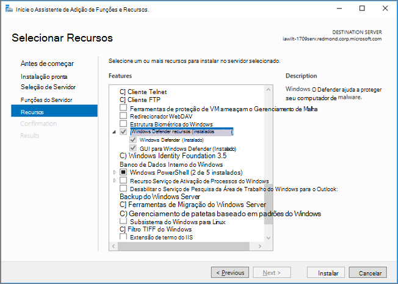

# <a name="microsoft-defender-antivirus-on-windows-server"></a><span data-ttu-id="f9b49-104">Microsoft Defender Antivírus no Windows Server</span><span class="sxs-lookup"><span data-stu-id="f9b49-104">Microsoft Defender Antivirus on Windows Server</span></span>

[!INCLUDE [Microsoft 365 Defender rebranding](../../includes/microsoft-defender.md)]

<span data-ttu-id="f9b49-105">**Aplica-se a:**</span><span class="sxs-lookup"><span data-stu-id="f9b49-105">**Applies to:**</span></span>

- [<span data-ttu-id="f9b49-106">Microsoft Defender para Ponto de Extremidade</span><span class="sxs-lookup"><span data-stu-id="f9b49-106">Microsoft Defender for Endpoint</span></span>](/microsoft-365/security/defender-endpoint/)

<span data-ttu-id="f9b49-107">O Microsoft Defender Antivírus está disponível nas seguintes edições/versões do Windows Server:</span><span class="sxs-lookup"><span data-stu-id="f9b49-107">Microsoft Defender Antivirus is available on the following editions/versions of Windows Server:</span></span>
- <span data-ttu-id="f9b49-108">Windows Server 2019</span><span class="sxs-lookup"><span data-stu-id="f9b49-108">Windows Server 2019</span></span>
- <span data-ttu-id="f9b49-109">Windows Server, versão 1803 ou posterior</span><span class="sxs-lookup"><span data-stu-id="f9b49-109">Windows Server, version  1803 or later</span></span>
- <span data-ttu-id="f9b49-110">Windows Server 2016.</span><span class="sxs-lookup"><span data-stu-id="f9b49-110">Windows Server 2016.</span></span> 

<span data-ttu-id="f9b49-111">Em algumas instâncias, o Microsoft Defender Antivírus é conhecido como *Proteção do Ponto de Extremidade;* no entanto, o mecanismo de proteção é o mesmo.</span><span class="sxs-lookup"><span data-stu-id="f9b49-111">In some instances, Microsoft Defender Antivirus is referred to as *Endpoint Protection*; however, the protection engine is the same.</span></span> <span data-ttu-id="f9b49-112">Embora a funcionalidade, a configuração e o gerenciamento sejam amplamente os mesmos para o Microsoft Defender Antivírus no [Windows 10,](microsoft-defender-antivirus-in-windows-10.md)há algumas diferenças importantes no Windows Server:</span><span class="sxs-lookup"><span data-stu-id="f9b49-112">Although the functionality, configuration, and management are largely the same for [Microsoft Defender Antivirus on Windows 10](microsoft-defender-antivirus-in-windows-10.md), there are a few key differences on Windows Server:</span></span>

- <span data-ttu-id="f9b49-113">No Windows Server, [as exclusões automáticas](configure-server-exclusions-microsoft-defender-antivirus.md) são aplicadas com base na função de servidor definida.</span><span class="sxs-lookup"><span data-stu-id="f9b49-113">In Windows Server, [automatic exclusions](configure-server-exclusions-microsoft-defender-antivirus.md) are applied based on your defined Server Role.</span></span>
- <span data-ttu-id="f9b49-114">No Windows Server, o Microsoft Defender Antivírus não se desabilita automaticamente se você estiver executando outro produto antivírus.</span><span class="sxs-lookup"><span data-stu-id="f9b49-114">In Windows Server, Microsoft Defender Antivirus does not automatically disable itself if you are running another antivirus product.</span></span>

## <a name="the-process-at-a-glance"></a><span data-ttu-id="f9b49-115">O processo em um relance</span><span class="sxs-lookup"><span data-stu-id="f9b49-115">The process at a glance</span></span>

<span data-ttu-id="f9b49-116">O processo de configuração e execução do Microsoft Defender Antivírus em uma plataforma de servidor inclui várias etapas:</span><span class="sxs-lookup"><span data-stu-id="f9b49-116">The process of setting up and running Microsoft Defender Antivirus on a server platform includes several steps:</span></span>

1. <span data-ttu-id="f9b49-117">[Habilitar a interface](#enable-the-user-interface-on-windows-server).</span><span class="sxs-lookup"><span data-stu-id="f9b49-117">[Enable the interface](#enable-the-user-interface-on-windows-server).</span></span>
2. <span data-ttu-id="f9b49-118">[Instalar o Microsoft Defender Antivírus](#install-microsoft-defender-antivirus-on-windows-server).</span><span class="sxs-lookup"><span data-stu-id="f9b49-118">[Install Microsoft Defender Antivirus](#install-microsoft-defender-antivirus-on-windows-server).</span></span>
3. <span data-ttu-id="f9b49-119">[Verifique se o Microsoft Defender Antivírus está em execução.](#verify-microsoft-defender-antivirus-is-running)</span><span class="sxs-lookup"><span data-stu-id="f9b49-119">[Verify Microsoft Defender Antivirus is running](#verify-microsoft-defender-antivirus-is-running).</span></span>
4. <span data-ttu-id="f9b49-120">[Atualize sua inteligência de segurança antimalware.](#update-antimalware-security-intelligence)</span><span class="sxs-lookup"><span data-stu-id="f9b49-120">[Update your antimalware Security intelligence](#update-antimalware-security-intelligence).</span></span>
5. <span data-ttu-id="f9b49-121">(Conforme necessário) [Enviar amostras](#submit-samples).</span><span class="sxs-lookup"><span data-stu-id="f9b49-121">(As needed) [Submit samples](#submit-samples).</span></span>
6. <span data-ttu-id="f9b49-122">(Conforme necessário) [Configurar exclusões automáticas](#configure-automatic-exclusions).</span><span class="sxs-lookup"><span data-stu-id="f9b49-122">(As needed) [Configure automatic exclusions](#configure-automatic-exclusions).</span></span>
7. <span data-ttu-id="f9b49-123">(Somente se necessário) [De definir o Microsoft Defender Antivírus para o modo passivo](#need-to-set-microsoft-defender-antivirus-to-passive-mode).</span><span class="sxs-lookup"><span data-stu-id="f9b49-123">(Only if necessary) [Set Microsoft Defender Antivirus to passive mode](#need-to-set-microsoft-defender-antivirus-to-passive-mode).</span></span>

## <a name="enable-the-user-interface-on-windows-server"></a><span data-ttu-id="f9b49-124">Habilitar a interface do usuário no Windows Server</span><span class="sxs-lookup"><span data-stu-id="f9b49-124">Enable the user interface on Windows Server</span></span>

<span data-ttu-id="f9b49-125">Por padrão, o Microsoft Defender Antivírus é instalado e funcional no Windows Server.</span><span class="sxs-lookup"><span data-stu-id="f9b49-125">By default, Microsoft Defender Antivirus is installed and functional on Windows Server.</span></span> <span data-ttu-id="f9b49-126">A interface do usuário (GUI) é instalada por padrão em alguns SKUs, mas não é necessária porque você pode usar o PowerShell ou outros métodos para gerenciar o Microsoft Defender Antivírus.</span><span class="sxs-lookup"><span data-stu-id="f9b49-126">The user interface (GUI) is installed by default on some SKUs, but is not required because you can use PowerShell or other methods to manage Microsoft Defender Antivirus.</span></span> <span data-ttu-id="f9b49-127">Se a GUI não estiver instalada em seu servidor, você poderá adicioná-la usando o assistente **Adicionar Funções** e Recursos ou usando cmdlets do PowerShell.</span><span class="sxs-lookup"><span data-stu-id="f9b49-127">If the GUI is not installed on your server, you can add it by using the **Add Roles and Features** wizard, or by using PowerShell cmdlets.</span></span>

### <a name="turn-on-the-gui-using-the-add-roles-and-features-wizard"></a><span data-ttu-id="f9b49-128">Ativar a GUI usando o Assistente de Adicionar Funções e Recursos</span><span class="sxs-lookup"><span data-stu-id="f9b49-128">Turn on the GUI using the Add Roles and Features Wizard</span></span>

1. <span data-ttu-id="f9b49-129">Consulte [Install roles, role services, and features by using the add Roles and Features Wizard](/windows-server/administration/server-manager/install-or-uninstall-roles-role-services-or-features#install-roles-role-services-and-features-by-using-the-add-roles-and-features-wizard), and use the Add Roles and Features **Wizard**.</span><span class="sxs-lookup"><span data-stu-id="f9b49-129">See [Install roles, role services, and features by using the add Roles and Features Wizard](/windows-server/administration/server-manager/install-or-uninstall-roles-role-services-or-features#install-roles-role-services-and-features-by-using-the-add-roles-and-features-wizard), and use the **Add Roles and Features Wizard**.</span></span>

2. <span data-ttu-id="f9b49-130">Quando você chegar à etapa **Recursos** do assistente, em Windows Defender **Recursos,** selecione a **opção GUI para** Windows Defender.</span><span class="sxs-lookup"><span data-stu-id="f9b49-130">When you get to the **Features** step of the wizard, under **Windows Defender Features**, select the **GUI for Windows Defender** option.</span></span>

   <span data-ttu-id="f9b49-131">No Windows Server 2016, o **Assistente para** Adicionar Funções e Recursos tem esta aparência:</span><span class="sxs-lookup"><span data-stu-id="f9b49-131">In Windows Server 2016, the **Add Roles and Features Wizard** looks like this:</span></span>

   

   <span data-ttu-id="f9b49-133">No Windows Server 2019, o **Assistente para Adicionar Funções** e Recursos é semelhante.</span><span class="sxs-lookup"><span data-stu-id="f9b49-133">In Windows Server 2019, the **Add Roles and Feature Wizard** is similar.</span></span>

### <a name="turn-on-the-gui-using-powershell"></a><span data-ttu-id="f9b49-134">Ativar a GUI usando o PowerShell</span><span class="sxs-lookup"><span data-stu-id="f9b49-134">Turn on the GUI using PowerShell</span></span>

<span data-ttu-id="f9b49-135">O seguinte cmdlet do PowerShell habilita a interface:</span><span class="sxs-lookup"><span data-stu-id="f9b49-135">The following PowerShell cmdlet will enable the interface:</span></span> 

```PowerShell
Install-WindowsFeature -Name Windows-Defender-GUI
```

## <a name="install-microsoft-defender-antivirus-on-windows-server"></a><span data-ttu-id="f9b49-136">Instalar o Microsoft Defender Antivírus no Windows Server</span><span class="sxs-lookup"><span data-stu-id="f9b49-136">Install Microsoft Defender Antivirus on Windows Server</span></span>

<span data-ttu-id="f9b49-137">Você pode usar o Assistente para Adicionar **Funções e Recursos** ou o PowerShell para instalar o Microsoft Defender Antivírus.</span><span class="sxs-lookup"><span data-stu-id="f9b49-137">You can use either the **Add Roles and Features Wizard** or PowerShell to install Microsoft Defender Antivirus.</span></span>

### <a name="use-the-add-roles-and-features-wizard"></a><span data-ttu-id="f9b49-138">Usar o Assistente adicionar funções e recursos</span><span class="sxs-lookup"><span data-stu-id="f9b49-138">Use the Add Roles and Features Wizard</span></span>

1. <span data-ttu-id="f9b49-139">Consulte este [artigo](/windows-server/administration/server-manager/install-or-uninstall-roles-role-services-or-features#install-roles-role-services-and-features-by-using-the-add-roles-and-features-wizard)e use o **Assistente para Adicionar Funções e Recursos.**</span><span class="sxs-lookup"><span data-stu-id="f9b49-139">Refer to [this article](/windows-server/administration/server-manager/install-or-uninstall-roles-role-services-or-features#install-roles-role-services-and-features-by-using-the-add-roles-and-features-wizard), and use the **Add Roles and Features Wizard**.</span></span>

2. <span data-ttu-id="f9b49-140">Quando você chegar à etapa **Recursos** do assistente, selecione a opção Microsoft Defender Antivírus.</span><span class="sxs-lookup"><span data-stu-id="f9b49-140">When you get to the **Features** step of the wizard, select the Microsoft Defender Antivirus option.</span></span> <span data-ttu-id="f9b49-141">Selecione também a **gui para Windows Defender** opção.</span><span class="sxs-lookup"><span data-stu-id="f9b49-141">Also select the **GUI for Windows Defender** option.</span></span>

### <a name="use-powershell"></a><span data-ttu-id="f9b49-142">Usar o Windows PowerShell!</span><span class="sxs-lookup"><span data-stu-id="f9b49-142">Use PowerShell</span></span>

<span data-ttu-id="f9b49-143">Para usar o PowerShell para instalar o Microsoft Defender Antivírus, execute o seguinte cmdlet:</span><span class="sxs-lookup"><span data-stu-id="f9b49-143">To use PowerShell to install Microsoft Defender Antivirus, run the following cmdlet:</span></span>

```PowerShell
Install-WindowsFeature -Name Windows-Defender
```

<span data-ttu-id="f9b49-144">As mensagens de evento para o mecanismo antimalware incluído no Microsoft Defender Antivírus podem ser encontradas em [Eventos av do Microsoft Defender.](troubleshoot-microsoft-defender-antivirus.md)</span><span class="sxs-lookup"><span data-stu-id="f9b49-144">Event messages for the antimalware engine included with Microsoft Defender Antivirus can be found in [Microsoft Defender AV Events](troubleshoot-microsoft-defender-antivirus.md).</span></span>


## <a name="verify-microsoft-defender-antivirus-is-running"></a><span data-ttu-id="f9b49-145">Verificar se o Microsoft Defender Antivírus está em execução</span><span class="sxs-lookup"><span data-stu-id="f9b49-145">Verify Microsoft Defender Antivirus is running</span></span>

<span data-ttu-id="f9b49-146">Para verificar se o Microsoft Defender Antivírus está em execução no seu servidor, execute o seguinte cmdlet do PowerShell:</span><span class="sxs-lookup"><span data-stu-id="f9b49-146">To verify that Microsoft Defender Antivirus is running on your server, run the following PowerShell cmdlet:</span></span>

```PowerShell
Get-Service -Name windefend
```

<span data-ttu-id="f9b49-147">Para verificar se a proteção de firewall está ativado, execute o seguinte cmdlet do PowerShell:</span><span class="sxs-lookup"><span data-stu-id="f9b49-147">To verify that firewall protection is turned on, run the following PowerShell cmdlet:</span></span>

```PowerShell 
Get-Service -Name mpssvc
```

<span data-ttu-id="f9b49-148">Como alternativa ao PowerShell, você pode usar o Prompt de Comando para verificar se o Microsoft Defender Antivírus está em execução.</span><span class="sxs-lookup"><span data-stu-id="f9b49-148">As an alternative to PowerShell, you can use Command Prompt to verify that Microsoft Defender Antivirus is running.</span></span> <span data-ttu-id="f9b49-149">Para fazer isso, execute o seguinte comando de um prompt de comando:</span><span class="sxs-lookup"><span data-stu-id="f9b49-149">To do that, run the following command from a command prompt:</span></span> 

```console
sc query Windefend
```

<span data-ttu-id="f9b49-150">O `sc query` comando retorna informações sobre o serviço Microsoft Defender Antivírus.</span><span class="sxs-lookup"><span data-stu-id="f9b49-150">The `sc query` command returns information about the Microsoft Defender Antivirus service.</span></span> <span data-ttu-id="f9b49-151">Quando o Microsoft Defender Antivírus está em execução, `STATE` o valor é exibido `RUNNING` .</span><span class="sxs-lookup"><span data-stu-id="f9b49-151">When Microsoft Defender Antivirus is running, the `STATE` value displays `RUNNING`.</span></span>

## <a name="update-antimalware-security-intelligence"></a><span data-ttu-id="f9b49-152">Atualizar inteligência de segurança antimalware</span><span class="sxs-lookup"><span data-stu-id="f9b49-152">Update antimalware Security intelligence</span></span> 

<span data-ttu-id="f9b49-153">Para obter a inteligência de segurança antimalware atualizada, você deve ter o serviço Windows Update em execução.</span><span class="sxs-lookup"><span data-stu-id="f9b49-153">To get updated antimalware security intelligence, you must have the Windows Update service running.</span></span> <span data-ttu-id="f9b49-154">Se você usar um serviço de gerenciamento de atualizações, como o Windows Server Update Services (WSUS), certifique-se de que as atualizações do Microsoft Defender Antivírus Security intelligence sejam aprovadas para os computadores que você gerencia.</span><span class="sxs-lookup"><span data-stu-id="f9b49-154">If you use an update management service, like Windows Server Update Services (WSUS), make sure that updates for Microsoft Defender Antivirus Security intelligence are approved for the computers you manage.</span></span>

<span data-ttu-id="f9b49-155">Por padrão, o Windows Update não baixa e instala atualizações automaticamente no Windows Server 2019 ou no Windows Server 2016.</span><span class="sxs-lookup"><span data-stu-id="f9b49-155">By default, Windows Update does not download and install updates automatically on Windows Server 2019 or Windows Server 2016.</span></span> <span data-ttu-id="f9b49-156">Você pode alterar essa configuração usando um dos seguintes métodos:</span><span class="sxs-lookup"><span data-stu-id="f9b49-156">You can change this configuration by using one of the following methods:</span></span>


|<span data-ttu-id="f9b49-157">Método</span><span class="sxs-lookup"><span data-stu-id="f9b49-157">Method</span></span>  |<span data-ttu-id="f9b49-158">Descrição</span><span class="sxs-lookup"><span data-stu-id="f9b49-158">Description</span></span>  |
|---------|---------|
|<span data-ttu-id="f9b49-159">**Windows Update** no Painel de Controle</span><span class="sxs-lookup"><span data-stu-id="f9b49-159">**Windows Update** in Control Panel</span></span>     |<span data-ttu-id="f9b49-160">- **Instalar atualizações resulta automaticamente** em todas as atualizações que estão sendo instaladas automaticamente, incluindo Windows Defender de inteligência de segurança.</span><span class="sxs-lookup"><span data-stu-id="f9b49-160">- **Install updates automatically** results in all updates being automatically installed, including Windows Defender Security intelligence updates.</span></span> <br/><span data-ttu-id="f9b49-161">- **Baixe atualizações,** mas deixe-me escolher se instalá-las permite Windows Defender baixar e instalar atualizações de inteligência de segurança automaticamente, mas outras atualizações não são instaladas automaticamente.</span><span class="sxs-lookup"><span data-stu-id="f9b49-161">- **Download updates but let me choose whether to install them** allows Windows Defender to download and install Security intelligence updates automatically, but other updates are not automatically installed.</span></span>       |
|<span data-ttu-id="f9b49-162">**Política de grupo**</span><span class="sxs-lookup"><span data-stu-id="f9b49-162">**Group Policy**</span></span>     | <span data-ttu-id="f9b49-163">Você pode configurar e gerenciar o Windows Update usando as configurações disponíveis na Política de Grupo, no seguinte caminho: Modelos **Administrativos\Componentes do Windows\Windows Update\Configurar Atualizações Automáticas**</span><span class="sxs-lookup"><span data-stu-id="f9b49-163">You can set up and manage Windows Update by using the settings available in Group Policy, in the following path: **Administrative Templates\Windows Components\Windows Update\Configure Automatic Updates**</span></span>         |
|<span data-ttu-id="f9b49-164">A **chave do Registro AUOptions**</span><span class="sxs-lookup"><span data-stu-id="f9b49-164">The **AUOptions** registry key</span></span>     |<span data-ttu-id="f9b49-165">Os dois valores a seguir permitem que o Windows Update baixe e instale automaticamente atualizações de inteligência de segurança:</span><span class="sxs-lookup"><span data-stu-id="f9b49-165">The following two values allow Windows Update to automatically download and install Security intelligence updates:</span></span> <br/><span data-ttu-id="f9b49-166">- **4**  -  **Instalar atualizações automaticamente**.</span><span class="sxs-lookup"><span data-stu-id="f9b49-166">- **4** - **Install updates automatically**.</span></span> <span data-ttu-id="f9b49-167">Esse valor resulta em todas as atualizações sendo instaladas automaticamente, incluindo Windows Defender de inteligência de segurança.</span><span class="sxs-lookup"><span data-stu-id="f9b49-167">This value results in all updates being automatically installed, including Windows Defender Security intelligence updates.</span></span> <br/><span data-ttu-id="f9b49-168">- **3**  -  **Baixe atualizações, mas deixe-me escolher se deve instalá-las.**</span><span class="sxs-lookup"><span data-stu-id="f9b49-168">- **3** - **Download updates but let me choose whether to install them**.</span></span>  <span data-ttu-id="f9b49-169">Esse valor permite Windows Defender baixar e instalar atualizações de inteligência de segurança automaticamente, mas outras atualizações não são instaladas automaticamente.</span><span class="sxs-lookup"><span data-stu-id="f9b49-169">This value allows Windows Defender to download and install Security intelligence updates automatically, but other updates are not automatically installed.</span></span>         |

<span data-ttu-id="f9b49-170">Para garantir que a proteção contra malware seja mantida, recomendamos que você habilita os seguintes serviços:</span><span class="sxs-lookup"><span data-stu-id="f9b49-170">To ensure that protection from malware is maintained, we recommend that you enable the following services:</span></span>

- <span data-ttu-id="f9b49-171">Serviço de Relatório de Erros do Windows</span><span class="sxs-lookup"><span data-stu-id="f9b49-171">Windows Error Reporting service</span></span>

- <span data-ttu-id="f9b49-172">Serviço Windows Update</span><span class="sxs-lookup"><span data-stu-id="f9b49-172">Windows Update service</span></span>

<span data-ttu-id="f9b49-173">A tabela a seguir lista os serviços do Microsoft Defender Antivírus e os serviços dependentes.</span><span class="sxs-lookup"><span data-stu-id="f9b49-173">The following table lists the services for Microsoft Defender Antivirus and the dependent services.</span></span>

|<span data-ttu-id="f9b49-174">Nome do Serviço</span><span class="sxs-lookup"><span data-stu-id="f9b49-174">Service Name</span></span>|<span data-ttu-id="f9b49-175">Local do arquivo</span><span class="sxs-lookup"><span data-stu-id="f9b49-175">File Location</span></span>|<span data-ttu-id="f9b49-176">Descrição</span><span class="sxs-lookup"><span data-stu-id="f9b49-176">Description</span></span>|
|--------|---------|--------|
|<span data-ttu-id="f9b49-177">Windows Defender Service (WinDefend)</span><span class="sxs-lookup"><span data-stu-id="f9b49-177">Windows Defender Service (WinDefend)</span></span>|`C:\Program Files\Windows Defender\MsMpEng.exe`|<span data-ttu-id="f9b49-178">Este é o principal serviço do Microsoft Defender Antivírus que precisa estar em execução o tempo todo.</span><span class="sxs-lookup"><span data-stu-id="f9b49-178">This is the main Microsoft Defender Antivirus service that needs to be running at all times.</span></span>|
|<span data-ttu-id="f9b49-179">Serviço de Relatório de Erros do Windows (Wersvc)</span><span class="sxs-lookup"><span data-stu-id="f9b49-179">Windows Error Reporting Service (Wersvc)</span></span>|`C:\WINDOWS\System32\svchost.exe -k WerSvcGroup`|<span data-ttu-id="f9b49-180">Este serviço envia relatórios de erro de volta para a Microsoft.</span><span class="sxs-lookup"><span data-stu-id="f9b49-180">This service sends error reports back to Microsoft.</span></span>|
|<span data-ttu-id="f9b49-181">Windows Defender Firewall (MpsSvc)</span><span class="sxs-lookup"><span data-stu-id="f9b49-181">Windows Defender Firewall (MpsSvc)</span></span>|`C:\WINDOWS\system32\svchost.exe -k LocalServiceNoNetwork`|<span data-ttu-id="f9b49-182">Recomendamos deixar o serviço Windows Defender Firewall habilitado.</span><span class="sxs-lookup"><span data-stu-id="f9b49-182">We recommend leaving the Windows Defender Firewall service enabled.</span></span>|
|<span data-ttu-id="f9b49-183">Windows Update (Wuauserv)</span><span class="sxs-lookup"><span data-stu-id="f9b49-183">Windows Update (Wuauserv)</span></span>|`C:\WINDOWS\system32\svchost.exe -k netsvcs`|<span data-ttu-id="f9b49-184">O Windows Update é necessário para obter atualizações de inteligência de segurança e atualizações do mecanismo antimalware</span><span class="sxs-lookup"><span data-stu-id="f9b49-184">Windows Update is needed to get Security intelligence updates and antimalware engine updates</span></span>|

## <a name="submit-samples"></a><span data-ttu-id="f9b49-185">Enviar amostras</span><span class="sxs-lookup"><span data-stu-id="f9b49-185">Submit samples</span></span>

<span data-ttu-id="f9b49-186">O envio de exemplo permite que a Microsoft colete amostras de software potencialmente mal-intencionado.</span><span class="sxs-lookup"><span data-stu-id="f9b49-186">Sample submission allows Microsoft to collect samples of potentially malicious software.</span></span> <span data-ttu-id="f9b49-187">Para ajudar a fornecer proteção contínua e atualizada, os pesquisadores da Microsoft usam esses exemplos para analisar atividades suspeitas e produzir inteligência de segurança antimalware atualizada.</span><span class="sxs-lookup"><span data-stu-id="f9b49-187">To help provide continued and up-to-date protection, Microsoft researchers use these samples to analyze suspicious activities and produce updated antimalware Security intelligence.</span></span> <span data-ttu-id="f9b49-188">Coletamos arquivos executáveis do programa, como arquivos .exe e arquivos .dll.</span><span class="sxs-lookup"><span data-stu-id="f9b49-188">We collect program executable files, such as .exe files and .dll files.</span></span> <span data-ttu-id="f9b49-189">Não coletamos arquivos que contêm dados pessoais, como documentos do Microsoft Word e arquivos PDF.</span><span class="sxs-lookup"><span data-stu-id="f9b49-189">We do not collect files that contain personal data, like Microsoft Word documents and PDF files.</span></span>

### <a name="submit-a-file"></a><span data-ttu-id="f9b49-190">Enviar um arquivo</span><span class="sxs-lookup"><span data-stu-id="f9b49-190">Submit a file</span></span>

1. <span data-ttu-id="f9b49-191">Revise o [guia de envio](/windows/security/threat-protection/intelligence/submission-guide).</span><span class="sxs-lookup"><span data-stu-id="f9b49-191">Review the [submission guide](/windows/security/threat-protection/intelligence/submission-guide).</span></span>

2. <span data-ttu-id="f9b49-192">Visite o [portal de envio de exemplo](https://www.microsoft.com/wdsi/filesubmission)e envie seu arquivo.</span><span class="sxs-lookup"><span data-stu-id="f9b49-192">Visit the [sample submission portal](https://www.microsoft.com/wdsi/filesubmission), and submit your file.</span></span>


### <a name="enable-automatic-sample-submission"></a><span data-ttu-id="f9b49-193">Habilitar envio automático de exemplo</span><span class="sxs-lookup"><span data-stu-id="f9b49-193">Enable automatic sample submission</span></span>

<span data-ttu-id="f9b49-194">Para habilitar o envio automático de exemplo, inicie um console Windows PowerShell como administrador e desmarcar os dados de valor **SubmitSamplesConsent** de acordo com uma das seguintes configurações:</span><span class="sxs-lookup"><span data-stu-id="f9b49-194">To enable automatic sample submission, start a Windows PowerShell console as an administrator, and set the **SubmitSamplesConsent** value data according to one of the following settings:</span></span>

|<span data-ttu-id="f9b49-195">Setting</span><span class="sxs-lookup"><span data-stu-id="f9b49-195">Setting</span></span>  |<span data-ttu-id="f9b49-196">Descrição</span><span class="sxs-lookup"><span data-stu-id="f9b49-196">Description</span></span>  |
|---------|---------|
|<span data-ttu-id="f9b49-197">**0**  -  **Sempre prompt**</span><span class="sxs-lookup"><span data-stu-id="f9b49-197">**0** - **Always prompt**</span></span>     |<span data-ttu-id="f9b49-198">O serviço Microsoft Defender Antivírus solicita que você confirme o envio de todos os arquivos necessários.</span><span class="sxs-lookup"><span data-stu-id="f9b49-198">The Microsoft Defender Antivirus service prompts you to confirm submission of all required files.</span></span> <span data-ttu-id="f9b49-199">Essa é a configuração padrão para o Microsoft Defender Antivírus, mas não é recomendada para instalações no Windows Server 2016 ou 2019 sem uma GUI.</span><span class="sxs-lookup"><span data-stu-id="f9b49-199">This is the default setting for Microsoft Defender Antivirus, but is not recommended for installations on Windows Server 2016 or 2019 without a GUI.</span></span>         |
|<span data-ttu-id="f9b49-200">**1**   -  **Enviar amostras seguras automaticamente**</span><span class="sxs-lookup"><span data-stu-id="f9b49-200">**1**  - **Send safe samples automatically**</span></span>     |<span data-ttu-id="f9b49-201">O serviço Microsoft Defender Antivírus envia todos os arquivos marcados como "seguros" e solicita o restante dos arquivos.</span><span class="sxs-lookup"><span data-stu-id="f9b49-201">The Microsoft Defender Antivirus service sends all files marked as "safe" and prompts for the remainder of the files.</span></span>         |
|<span data-ttu-id="f9b49-202">**2**  -  **Nunca enviar**</span><span class="sxs-lookup"><span data-stu-id="f9b49-202">**2** - **Never send**</span></span>      |<span data-ttu-id="f9b49-203">O serviço Microsoft Defender Antivírus não solicita e não envia arquivos.</span><span class="sxs-lookup"><span data-stu-id="f9b49-203">The Microsoft Defender Antivirus service does not prompt and does not send any files.</span></span>         |
|<span data-ttu-id="f9b49-204">**3**  -  **Enviar todos os exemplos automaticamente**</span><span class="sxs-lookup"><span data-stu-id="f9b49-204">**3** - **Send all samples automatically**</span></span>     |<span data-ttu-id="f9b49-205">O serviço Microsoft Defender Antivírus envia todos os arquivos sem um prompt para confirmação.</span><span class="sxs-lookup"><span data-stu-id="f9b49-205">The Microsoft Defender Antivirus service sends all files without a prompt for confirmation.</span></span>         |

## <a name="configure-automatic-exclusions"></a><span data-ttu-id="f9b49-206">Configurar exclusões automáticas</span><span class="sxs-lookup"><span data-stu-id="f9b49-206">Configure automatic exclusions</span></span>

<span data-ttu-id="f9b49-207">Para ajudar a garantir a segurança e o desempenho, determinadas exclusões são adicionadas automaticamente com base nas funções e recursos que você instala ao usar o Microsoft Defender Antivírus no Windows Server 2016 ou 2019.</span><span class="sxs-lookup"><span data-stu-id="f9b49-207">To help ensure security and performance, certain exclusions are automatically added based on the roles and features you install when using Microsoft Defender Antivirus on Windows Server 2016 or 2019.</span></span>

<span data-ttu-id="f9b49-208">Consulte [Configurar exclusões no Microsoft Defender Antivírus no Windows Server](configure-server-exclusions-microsoft-defender-antivirus.md).</span><span class="sxs-lookup"><span data-stu-id="f9b49-208">See [Configure exclusions in Microsoft Defender Antivirus on Windows Server](configure-server-exclusions-microsoft-defender-antivirus.md).</span></span> 

## <a name="need-to-set-microsoft-defender-antivirus-to-passive-mode"></a><span data-ttu-id="f9b49-209">Precisa definir o Microsoft Defender Antivírus como modo passivo?</span><span class="sxs-lookup"><span data-stu-id="f9b49-209">Need to set Microsoft Defender Antivirus to passive mode?</span></span>

<span data-ttu-id="f9b49-210">Se você estiver usando um produto antivírus que não seja da Microsoft como sua solução antivírus principal, de definir o Microsoft Defender Antivírus como modo passivo.</span><span class="sxs-lookup"><span data-stu-id="f9b49-210">If you are using a non-Microsoft antivirus product as your primary antivirus solution, set Microsoft Defender Antivirus to passive mode.</span></span>  

### <a name="set-microsoft-defender-antivirus-to-passive-mode-using-a-registry-key"></a><span data-ttu-id="f9b49-211">Definir o Microsoft Defender Antivírus como modo passivo usando uma chave do Registro</span><span class="sxs-lookup"><span data-stu-id="f9b49-211">Set Microsoft Defender Antivirus to passive mode using a registry key</span></span>

<span data-ttu-id="f9b49-212">Se você estiver usando o Windows Server, versão 1803 ou Windows Server 2019, poderá definir o Microsoft Defender Antivírus como modo passivo definindo a seguinte chave do Registro:</span><span class="sxs-lookup"><span data-stu-id="f9b49-212">If you are using Windows Server, version 1803 or Windows Server 2019, you can set Microsoft Defender Antivirus to passive mode by setting the following registry key:</span></span>
- <span data-ttu-id="f9b49-213">Caminho: `HKLM\SOFTWARE\Policies\Microsoft\Windows Advanced Threat Protection`</span><span class="sxs-lookup"><span data-stu-id="f9b49-213">Path: `HKLM\SOFTWARE\Policies\Microsoft\Windows Advanced Threat Protection`</span></span>
- <span data-ttu-id="f9b49-214">Nome: `ForceDefenderPassiveMode`</span><span class="sxs-lookup"><span data-stu-id="f9b49-214">Name: `ForceDefenderPassiveMode`</span></span>
- <span data-ttu-id="f9b49-215">Digite: `REG_DWORD`</span><span class="sxs-lookup"><span data-stu-id="f9b49-215">Type: `REG_DWORD`</span></span>
- <span data-ttu-id="f9b49-216">Valor: `1`</span><span class="sxs-lookup"><span data-stu-id="f9b49-216">Value: `1`</span></span>

### <a name="disable-microsoft-defender-antivirus-using-the-remove-roles-and-features-wizard"></a><span data-ttu-id="f9b49-217">Desabilitar o Microsoft Defender Antivírus usando o assistente Remover Funções e Recursos</span><span class="sxs-lookup"><span data-stu-id="f9b49-217">Disable Microsoft Defender Antivirus using the Remove Roles and Features wizard</span></span>

1. <span data-ttu-id="f9b49-218">Consulte [Install or Uninstall Roles, Role Services, or Features](/windows-server/administration/server-manager/install-or-uninstall-roles-role-services-or-features#remove-roles-role-services-and-features-by-using-the-remove-roles-and-features-wizard), and use the Remove Roles and Features **Wizard**.</span><span class="sxs-lookup"><span data-stu-id="f9b49-218">See [Install or Uninstall Roles, Role Services, or Features](/windows-server/administration/server-manager/install-or-uninstall-roles-role-services-or-features#remove-roles-role-services-and-features-by-using-the-remove-roles-and-features-wizard), and use the **Remove Roles and Features Wizard**.</span></span> 

2. <span data-ttu-id="f9b49-219">Quando você chegar à etapa **Recursos** do assistente, des limpar a opção Windows Defender **Recursos.**</span><span class="sxs-lookup"><span data-stu-id="f9b49-219">When you get to the **Features** step of the wizard, clear the **Windows Defender Features** option.</span></span> 

    <span data-ttu-id="f9b49-220">Se você limpar **Windows Defender** por conta própria na seção recursos do **Windows Defender,** será solicitado a remover a **GUI** de opção de interface para Windows Defender .</span><span class="sxs-lookup"><span data-stu-id="f9b49-220">If you clear **Windows Defender** by itself under the **Windows Defender Features** section, you will be prompted to remove the interface option **GUI for Windows Defender**.</span></span> 
    
    <span data-ttu-id="f9b49-221">O Microsoft Defender Antivírus ainda será executado normalmente sem a interface do usuário, mas a interface do usuário não poderá ser habilitada se você desabilitar o recurso **Windows Defender** principal.</span><span class="sxs-lookup"><span data-stu-id="f9b49-221">Microsoft Defender Antivirus will still run normally without the user interface, but the user interface cannot be enabled if you disable the core **Windows Defender** feature.</span></span>

### <a name="turn-off-the-microsoft-defender-antivirus-user-interface-using-powershell"></a><span data-ttu-id="f9b49-222">Desativar a interface do usuário do Microsoft Defender Antivírus usando o PowerShell</span><span class="sxs-lookup"><span data-stu-id="f9b49-222">Turn off the Microsoft Defender Antivirus user interface using PowerShell</span></span>

<span data-ttu-id="f9b49-223">Para desativar a GUI do Microsoft Defender Antivírus, use o seguinte cmdlet do PowerShell:</span><span class="sxs-lookup"><span data-stu-id="f9b49-223">To turn off the Microsoft Defender Antivirus GUI, use the following PowerShell cmdlet:</span></span>

```PowerShell
Uninstall-WindowsFeature -Name Windows-Defender-GUI
```

### <a name="are-you-using-windows-server-2016"></a><span data-ttu-id="f9b49-224">Você está usando o Windows Server 2016?</span><span class="sxs-lookup"><span data-stu-id="f9b49-224">Are you using Windows Server 2016?</span></span>

<span data-ttu-id="f9b49-225">Se você estiver usando o Windows Server 2016 e um produto antimalware/antivírus de terceiros que não é oferecido ou desenvolvido pela Microsoft, você precisará desabilitar/desinstalar o Microsoft Defender Antivírus.</span><span class="sxs-lookup"><span data-stu-id="f9b49-225">If you are using Windows Server 2016 and a third-party antimalware/antivirus product that is not offered or developed by Microsoft, you'll need to disable/uninstall Microsoft Defender Antivirus.</span></span> 

> [!NOTE]
> <span data-ttu-id="f9b49-226">Não é possível desinstalar o aplicativo segurança do Windows, mas é possível desabilitar a interface com essas instruções.</span><span class="sxs-lookup"><span data-stu-id="f9b49-226">You can't uninstall the Windows Security app, but you can disable the interface with these instructions.</span></span>

<span data-ttu-id="f9b49-227">O seguinte cmdlet do PowerShell desinstala o Microsoft Defender Antivírus no Windows Server 2016:</span><span class="sxs-lookup"><span data-stu-id="f9b49-227">The following PowerShell cmdlet uninstalls Microsoft Defender Antivirus on Windows Server 2016:</span></span>

```PowerShell
Uninstall-WindowsFeature -Name Windows-Defender
```

## <a name="see-also"></a><span data-ttu-id="f9b49-228">Confira também</span><span class="sxs-lookup"><span data-stu-id="f9b49-228">See also</span></span>

- [<span data-ttu-id="f9b49-229">Microsoft Defender Antivírus no Windows 10</span><span class="sxs-lookup"><span data-stu-id="f9b49-229">Microsoft Defender Antivirus in Windows 10</span></span>](microsoft-defender-antivirus-in-windows-10.md)
- [<span data-ttu-id="f9b49-230">Compatibilidade com o Microsoft Defender Antivírus</span><span class="sxs-lookup"><span data-stu-id="f9b49-230">Microsoft Defender Antivirus compatibility</span></span>](microsoft-defender-antivirus-compatibility.md)
