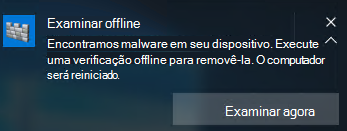

# <a name="run-and-review-the-results-of-a-microsoft-defender-offline-scan"></a><span data-ttu-id="90f04-105">Executar e revisar os resultados de uma verificação do Microsoft Defender Offline</span><span class="sxs-lookup"><span data-stu-id="90f04-105">Run and review the results of a Microsoft Defender Offline scan</span></span>

[!INCLUDE [Microsoft 365 Defender rebranding](../../includes/microsoft-defender.md)]


<span data-ttu-id="90f04-106">**Aplica-se a:**</span><span class="sxs-lookup"><span data-stu-id="90f04-106">**Applies to:**</span></span>

- [<span data-ttu-id="90f04-107">Microsoft Defender para Ponto de Extremidade</span><span class="sxs-lookup"><span data-stu-id="90f04-107">Microsoft Defender for Endpoint</span></span>](/microsoft-365/security/defender-endpoint/)

<span data-ttu-id="90f04-108">O Microsoft Defender Offline é uma ferramenta de verificação antimalware que permite inicializar e executar uma verificação de um ambiente confiável.</span><span class="sxs-lookup"><span data-stu-id="90f04-108">Microsoft Defender Offline is an antimalware scanning tool that lets you boot and run a scan from a trusted environment.</span></span> <span data-ttu-id="90f04-109">A verificação é executado de fora do kernel normal do Windows para que ele possa direcionar o malware que tenta ignorar o shell do Windows, como vírus e rootkits que infectam ou sobrescrevem o registro de inicialização mestre (MBR).</span><span class="sxs-lookup"><span data-stu-id="90f04-109">The scan runs from outside the normal Windows kernel so it can target malware that attempts to bypass the Windows shell, such as viruses and rootkits that infect or overwrite the master boot record (MBR).</span></span>

<span data-ttu-id="90f04-110">Você pode usar o Microsoft Defender Offline se suspeitar de uma infecção por malware ou se deseja confirmar uma limpeza completa do ponto de extremidade após uma epidemia de malware.</span><span class="sxs-lookup"><span data-stu-id="90f04-110">You can use Microsoft Defender Offline if you suspect a malware infection, or you want to confirm a thorough clean of the endpoint after a malware outbreak.</span></span>

<span data-ttu-id="90f04-111">No Windows 10, o Microsoft Defender Offline pode ser executado com um clique diretamente no aplicativo [segurança do Windows.](microsoft-defender-security-center-antivirus.md)</span><span class="sxs-lookup"><span data-stu-id="90f04-111">In Windows 10, Microsoft Defender Offline can be run with one click directly from the [Windows Security app](microsoft-defender-security-center-antivirus.md).</span></span> <span data-ttu-id="90f04-112">Nas versões anteriores do Windows, um usuário precisava instalar o Microsoft Defender Offline para a mídia inicializável, reiniciar o ponto de extremidade e carregar a mídia inicializável.</span><span class="sxs-lookup"><span data-stu-id="90f04-112">In previous versions of Windows, a user had to install Microsoft Defender Offline to bootable media, restart the endpoint, and load the bootable media.</span></span>

## <a name="prerequisites-and-requirements"></a><span data-ttu-id="90f04-113">pré-requisitos e requisitos</span><span class="sxs-lookup"><span data-stu-id="90f04-113">prerequisites and requirements</span></span>

<span data-ttu-id="90f04-114">O Microsoft Defender Offline no Windows 10 tem os mesmos requisitos de hardware do Windows 10.</span><span class="sxs-lookup"><span data-stu-id="90f04-114">Microsoft Defender Offline in Windows 10 has the same hardware requirements as Windows 10.</span></span> 

<span data-ttu-id="90f04-115">Para obter mais informações sobre os requisitos do Windows 10, consulte os seguintes tópicos:</span><span class="sxs-lookup"><span data-stu-id="90f04-115">For more information about Windows 10 requirements, see the following topics:</span></span>

- [<span data-ttu-id="90f04-116">Requisitos mínimos de hardware</span><span class="sxs-lookup"><span data-stu-id="90f04-116">Minimum hardware requirements</span></span>](/windows-hardware/design/minimum/minimum-hardware-requirements-overview)

- [<span data-ttu-id="90f04-117">Diretrizes de componentes de hardware</span><span class="sxs-lookup"><span data-stu-id="90f04-117">Hardware component guidelines</span></span>](/windows-hardware/design/component-guidelines/components)

> [!NOTE]
> <span data-ttu-id="90f04-118">O Microsoft Defender Offline não é suportado em computadores com processadores ARM ou em Unidades de Manutenção de Ações do Windows Server.</span><span class="sxs-lookup"><span data-stu-id="90f04-118">Microsoft Defender Offline is not supported on machines with ARM processors, or on Windows Server Stock Keeping Units.</span></span>

<span data-ttu-id="90f04-119">Para executar o Microsoft Defender Offline no ponto de extremidade, o usuário deve estar conectado com privilégios de administrador.</span><span class="sxs-lookup"><span data-stu-id="90f04-119">To run Microsoft Defender Offline from the endpoint, the user must be logged in with administrator privileges.</span></span>
 
## <a name="microsoft-defender-offline-updates"></a><span data-ttu-id="90f04-120">Atualizações offline do Microsoft Defender</span><span class="sxs-lookup"><span data-stu-id="90f04-120">Microsoft Defender Offline updates</span></span>

<span data-ttu-id="90f04-121">O Microsoft Defender Offline usa as atualizações de proteção mais recentes disponíveis no ponto de extremidade; ele é atualizado sempre que Windows Defender Antivírus é atualizado.</span><span class="sxs-lookup"><span data-stu-id="90f04-121">Microsoft Defender Offline uses the most recent protection updates available on the endpoint; it's updated whenever Windows Defender Antivirus is updated.</span></span> 

> [!NOTE]
> <span data-ttu-id="90f04-122">Antes de executar uma verificação offline, você deve tentar atualizar a proteção do Microsoft Defender AV.</span><span class="sxs-lookup"><span data-stu-id="90f04-122">Before running an offline scan, you should attempt to update Microsoft Defender AV protection.</span></span> <span data-ttu-id="90f04-123">Você pode forçar uma atualização com a Política de Grupo ou, no entanto, normalmente implantar atualizações nos pontos de extremidade ou baixar manualmente e instalar as atualizações de proteção mais recentes do [Centro de Proteção contra Malware da Microsoft](https://www.microsoft.com/security/portal/definitions/adl.aspx).</span><span class="sxs-lookup"><span data-stu-id="90f04-123">You can either force an update with Group Policy or however you normally deploy updates to endpoints, or you can manually download and install the latest protection updates from the [Microsoft Malware Protection Center](https://www.microsoft.com/security/portal/definitions/adl.aspx).</span></span>

<span data-ttu-id="90f04-124">Consulte o tópico Gerenciar atualizações de inteligência [de segurança do Microsoft Defender Antivírus](manage-protection-updates-microsoft-defender-antivirus.md) para obter mais informações.</span><span class="sxs-lookup"><span data-stu-id="90f04-124">See the [Manage Microsoft Defender Antivirus Security intelligence  updates](manage-protection-updates-microsoft-defender-antivirus.md) topic for more information.</span></span>

## <a name="usage-scenarios"></a><span data-ttu-id="90f04-125">Cenários de uso</span><span class="sxs-lookup"><span data-stu-id="90f04-125">Usage scenarios</span></span>

<span data-ttu-id="90f04-126">No Windows 10, versão 1607, você pode forçar manualmente uma verificação offline.</span><span class="sxs-lookup"><span data-stu-id="90f04-126">In Windows 10, version 1607, you can manually force an offline scan.</span></span> <span data-ttu-id="90f04-127">Como alternativa, se Windows Defender determinar que o Microsoft Defender Offline precisa ser executado, ele solicitará ao usuário no ponto de extremidade.</span><span class="sxs-lookup"><span data-stu-id="90f04-127">Alternatively, if Windows Defender determines that Microsoft Defender Offline needs to run, it will prompt the user on the endpoint.</span></span> 

<span data-ttu-id="90f04-128">A necessidade de executar uma verificação offline também será revelada no Microsoft Endpoint Manager se você estiver usando-a para gerenciar seus pontos de extremidade.</span><span class="sxs-lookup"><span data-stu-id="90f04-128">The need to perform an offline scan will also be revealed in Microsoft Endpoint Manager if you're using it to manage your endpoints.</span></span>

<span data-ttu-id="90f04-129">O prompt pode ocorrer por meio de uma notificação, semelhante ao seguinte:</span><span class="sxs-lookup"><span data-stu-id="90f04-129">The prompt can occur via a notification, similar to the following:</span></span>



<span data-ttu-id="90f04-131">O usuário também será notificado dentro do Windows Defender cliente.</span><span class="sxs-lookup"><span data-stu-id="90f04-131">The user will also be notified within the Windows Defender client.</span></span>

<span data-ttu-id="90f04-132">No Configuration Manager, você pode identificar o status dos pontos de extremidade navegando até **Monitoring > Overview > Security > Endpoint Protection Status > System Center Endpoint Protection Status**.</span><span class="sxs-lookup"><span data-stu-id="90f04-132">In Configuration Manager, you can identify the status of endpoints by navigating to **Monitoring > Overview > Security > Endpoint Protection Status > System Center Endpoint Protection Status**.</span></span> 

<span data-ttu-id="90f04-133">As verificações offline do Microsoft Defender são indicadas em **Status de correção de malware** conforme a verificação offline **necessária**.</span><span class="sxs-lookup"><span data-stu-id="90f04-133">Microsoft Defender Offline scans are indicated under **Malware remediation status** as **Offline scan required**.</span></span>


## <a name="configure-notifications"></a><span data-ttu-id="90f04-135">Configurar notificações</span><span class="sxs-lookup"><span data-stu-id="90f04-135">Configure notifications</span></span>

<span data-ttu-id="90f04-136">As notificações offline do Microsoft Defender são configuradas na mesma configuração de política que outras notificações do Microsoft Defender AV.</span><span class="sxs-lookup"><span data-stu-id="90f04-136">Microsoft Defender Offline notifications are configured in the same policy setting as other Microsoft Defender AV notifications.</span></span>

<span data-ttu-id="90f04-137">Para obter mais informações sobre notificações Windows Defender, consulte [o tópico Configurar](configure-notifications-microsoft-defender-antivirus.md) as notificações que aparecem nos pontos de extremidade.</span><span class="sxs-lookup"><span data-stu-id="90f04-137">For more information about notifications in Windows Defender, see the [Configure the notifications that appear on endpoints](configure-notifications-microsoft-defender-antivirus.md) topic.</span></span>

## <a name="run-a-scan"></a><span data-ttu-id="90f04-138">Executar uma verificação</span><span class="sxs-lookup"><span data-stu-id="90f04-138">Run a scan</span></span> 

> [!IMPORTANT]
> <span data-ttu-id="90f04-139">Antes de usar o Microsoft Defender Offline, salve todos os arquivos e desligue os programas em execução.</span><span class="sxs-lookup"><span data-stu-id="90f04-139">Before you use Microsoft Defender Offline, make sure you save any files and shut down running programs.</span></span> <span data-ttu-id="90f04-140">A verificação offline do Microsoft Defender leva cerca de 15 minutos para ser executado.</span><span class="sxs-lookup"><span data-stu-id="90f04-140">The Microsoft Defender Offline scan takes about 15 minutes to run.</span></span> <span data-ttu-id="90f04-141">Ele reiniciará o ponto de extremidade quando a verificação for concluída.</span><span class="sxs-lookup"><span data-stu-id="90f04-141">It will restart the endpoint when the scan is complete.</span></span> <span data-ttu-id="90f04-142">A verificação é realizada fora do ambiente operacional Windows normal.</span><span class="sxs-lookup"><span data-stu-id="90f04-142">The scan is performed outside of the usual Windows operating environment.</span></span> <span data-ttu-id="90f04-143">A interface do usuário aparecerá diferente de uma verificação normal realizada por Windows Defender.</span><span class="sxs-lookup"><span data-stu-id="90f04-143">The user interface will appear different to a normal scan performed by Windows Defender.</span></span> <span data-ttu-id="90f04-144">Depois que a verificação for concluída, o ponto de extremidade será reiniciado e o Windows será carregado normalmente.</span><span class="sxs-lookup"><span data-stu-id="90f04-144">After the scan is completed, the endpoint will be restarted and Windows will load normally.</span></span>

<span data-ttu-id="90f04-145">Você pode executar uma verificação offline do Microsoft Defender com o seguinte:</span><span class="sxs-lookup"><span data-stu-id="90f04-145">You can run a Microsoft Defender Offline scan with the following:</span></span>

- <span data-ttu-id="90f04-146">PowerShell</span><span class="sxs-lookup"><span data-stu-id="90f04-146">PowerShell</span></span>
- <span data-ttu-id="90f04-147">Instrumentação de Gerenciamento do Windows (WMI)</span><span class="sxs-lookup"><span data-stu-id="90f04-147">Windows Management Instrumentation (WMI)</span></span>
- <span data-ttu-id="90f04-148">O aplicativo segurança do Windows</span><span class="sxs-lookup"><span data-stu-id="90f04-148">The Windows Security app</span></span>


### <a name="use-powershell-cmdlets-to-run-an-offline-scan"></a><span data-ttu-id="90f04-149">Usar cmdlets do PowerShell para executar uma verificação offline</span><span class="sxs-lookup"><span data-stu-id="90f04-149">Use PowerShell cmdlets to run an offline scan</span></span>

<span data-ttu-id="90f04-150">Use os seguintes cmdlets:</span><span class="sxs-lookup"><span data-stu-id="90f04-150">Use the following cmdlets:</span></span>

```PowerShell
Start-MpWDOScan
```

<span data-ttu-id="90f04-151">Consulte [Usar cmdlets](use-powershell-cmdlets-microsoft-defender-antivirus.md) do PowerShell para configurar e executar [cmdlets](/powershell/module/defender/) do Microsoft Defender Antivírus e do Defender para obter mais informações sobre como usar o PowerShell com o Microsoft Defender Antivírus.</span><span class="sxs-lookup"><span data-stu-id="90f04-151">See [Use PowerShell cmdlets to configure and run Microsoft Defender Antivirus](use-powershell-cmdlets-microsoft-defender-antivirus.md) and [Defender cmdlets](/powershell/module/defender/) for more information on how to use PowerShell with Microsoft Defender Antivirus.</span></span>

### <a name="use-windows-management-instruction-wmi-to-run-an-offline-scan"></a><span data-ttu-id="90f04-152">Usar a Instrução de Gerenciamento do Windows (WMI) para executar uma verificação offline</span><span class="sxs-lookup"><span data-stu-id="90f04-152">Use Windows Management Instruction (WMI) to run an offline scan</span></span>

<span data-ttu-id="90f04-153">Use a [**MSFT_MpWDOScan**](/previous-versions/windows/desktop/legacy/dn455323(v=vs.85)) para executar uma verificação offline.</span><span class="sxs-lookup"><span data-stu-id="90f04-153">Use the [**MSFT_MpWDOScan**](/previous-versions/windows/desktop/legacy/dn455323(v=vs.85)) class to run an offline scan.</span></span>

<span data-ttu-id="90f04-154">O trecho de script WMI a seguir executará imediatamente uma verificação offline do Microsoft Defender, que fará com que o ponto de extremidade seja reiniciado, execute a verificação offline e, em seguida, reinicie e inicializar no Windows.</span><span class="sxs-lookup"><span data-stu-id="90f04-154">The following WMI script snippet will immediately run a Microsoft Defender Offline scan, which will cause the endpoint to restart, run the offline scan, and then restart and boot into Windows.</span></span>

```console
wmic /namespace:\\root\Microsoft\Windows\Defender path MSFT_MpWDOScan call Start 
```

<span data-ttu-id="90f04-155">Confira o seguinte para obter mais informações:</span><span class="sxs-lookup"><span data-stu-id="90f04-155">See the following for more information:</span></span>
- [<span data-ttu-id="90f04-156">Windows Defender WMIv2 APIs</span><span class="sxs-lookup"><span data-stu-id="90f04-156">Windows Defender WMIv2 APIs</span></span>](/previous-versions/windows/desktop/defender/windows-defender-wmiv2-apis-portal)


### <a name="use-the-windows-defender-security-app-to-run-an-offline-scan"></a><span data-ttu-id="90f04-157">Usar o Windows Defender de segurança para executar uma verificação offline</span><span class="sxs-lookup"><span data-stu-id="90f04-157">Use the Windows Defender Security app to run an offline scan</span></span>

1. <span data-ttu-id="90f04-158">Abra o aplicativo segurança do Windows clicando no ícone de escudo na barra de tarefas ou pesquisando o menu inicial do **Defender**.</span><span class="sxs-lookup"><span data-stu-id="90f04-158">Open the Windows Security app by clicking the shield icon in the task bar or searching the start menu for **Defender**.</span></span>

2. <span data-ttu-id="90f04-159">Clique no **&** proteção contra ameaças (ou o ícone de escudo na barra de menus esquerda) e, em seguida, o **rótulo de verificação** avançado:</span><span class="sxs-lookup"><span data-stu-id="90f04-159">Click the **Virus & threat protection** tile (or the shield icon on the left menu bar) and then the **Advanced scan** label:</span></span>
    
3. <span data-ttu-id="90f04-160">Selecione **a verificação offline do Microsoft Defender e** clique em Examinar **agora**.</span><span class="sxs-lookup"><span data-stu-id="90f04-160">Select **Microsoft Defender Offline scan** and click **Scan now**.</span></span>

    > [!NOTE]
    > <span data-ttu-id="90f04-161">No Windows 10, versão 1607, a verificação offline poderia ser executado em **Windows Settings** Update & segurança Windows Defender ou do  >    >   cliente Windows Defender.</span><span class="sxs-lookup"><span data-stu-id="90f04-161">In Windows 10, version 1607, the offline scan could be run from under **Windows Settings** > **Update & security** > **Windows Defender** or from the Windows Defender client.</span></span>


## <a name="review-scan-results"></a><span data-ttu-id="90f04-162">Revisar resultados da verificação</span><span class="sxs-lookup"><span data-stu-id="90f04-162">Review scan results</span></span>

<span data-ttu-id="90f04-163">Os resultados da verificação offline do Microsoft Defender serão listados na seção Histórico de verificação [do aplicativo segurança do Windows.](microsoft-defender-security-center-antivirus.md)</span><span class="sxs-lookup"><span data-stu-id="90f04-163">Microsoft Defender Offline scan results will be listed in the [Scan history section of the Windows Security app](microsoft-defender-security-center-antivirus.md).</span></span> 


## <a name="related-articles"></a><span data-ttu-id="90f04-164">Artigos relacionados</span><span class="sxs-lookup"><span data-stu-id="90f04-164">Related articles</span></span>

- [<span data-ttu-id="90f04-165">Personalizar, iniciar e revisar os resultados de verificações e correção</span><span class="sxs-lookup"><span data-stu-id="90f04-165">Customize, initiate, and review the results of scans and remediation</span></span>](customize-run-review-remediate-scans-microsoft-defender-antivirus.md)
- [<span data-ttu-id="90f04-166">Microsoft Defender Antivírus no Windows 10</span><span class="sxs-lookup"><span data-stu-id="90f04-166">Microsoft Defender Antivirus in Windows 10</span></span>](microsoft-defender-antivirus-in-windows-10.md)