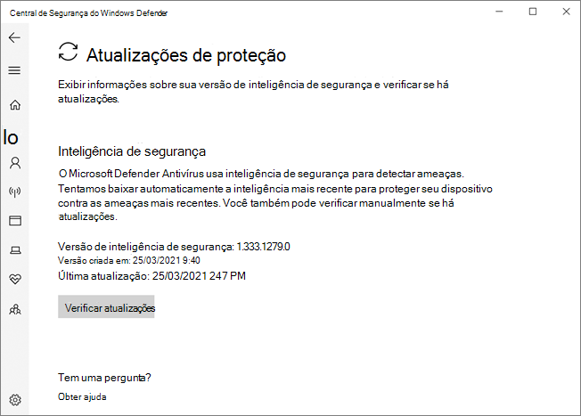

# Microsoft Defender Antivírus no aplicativo Segurança do Windows aplicativo

[!INCLUDE [Microsoft 365 Defender rebranding](../../includes/microsoft-defender.md)]

**Aplica-se a:**

- [Microsoft Defender para Ponto de Extremidade](/microsoft-365/security/defender-endpoint/)

No Windows 10, versão 1703 e posterior, o aplicativo Windows Defender faz parte do Segurança do Windows.

Configurações que antes eram parte do cliente Windows Defender e do Windows Configurações principal foram combinados e movidos para o novo aplicativo, que é instalado por padrão como parte do Windows 10, versão 1703.

> [!IMPORTANT]
> Desabilitar o serviço Segurança do Windows Central não desabilita Microsoft Defender Antivírus ou [Windows Defender Firewall](/windows/security/threat-protection/windows-firewall/windows-firewall-with-advanced-security). Eles são desabilitados automaticamente quando um produto antivírus ou firewall de terceiros é instalado e mantido atualizado.
>
> Se você desabilitar o serviço central do Segurança do Windows ou configurar suas configurações de Política de Grupo associadas para impedir que ele seja acionada ou em execução, o aplicativo Segurança do Windows poderá exibir informações desproportivas ou imprecisas sobre quaisquer produtos antivírus ou firewall que você instalou no dispositivo.
> Também pode impedir Microsoft Defender Antivírus se você tiver um antivírus de terceiros antigo ou desatualizado ou se você desinstalar qualquer produto antivírus de terceiros que você possa ter instalado anteriormente.
> Isso diminuirá significativamente a proteção do dispositivo e poderá levar a infecção por malware.

Consulte o [Segurança do Windows para](/windows/threat-protection/windows-defender-security-center/windows-defender-security-center) obter mais informações sobre outros Windows de segurança que podem ser monitorados no aplicativo.

O Segurança do Windows app é uma interface do cliente Windows 10, versão 1703 e posterior. Não é o portal Central de Segurança do Microsoft Defender web usado para analisar e gerenciar o [Microsoft Defender para o Ponto de Extremidade.](/microsoft-365/security/defender-endpoint/microsoft-defender-endpoint)

## Revisar configurações de proteção contra vírus e ameaças no Segurança do Windows app

1. Abra o Segurança do Windows aplicativo clicando no ícone de escudo na barra de tarefas ou pesquisando o menu inicial do **Defender**.

2. Selecione o & de **proteção** contra ameaças (ou o ícone de escudo na barra de menus esquerda).
   
As seções a seguir descrevem como executar algumas das tarefas mais comuns ao revisar ou interagir com a proteção contra ameaças fornecida pelo Microsoft Defender Antivírus no aplicativo Segurança do Windows.

> [!NOTE]
> Se essas configurações são configuradas e implantadas usando a Política de Grupo, as configurações descritas nesta seção serão acinzenadas e indisponíveis para uso em pontos de extremidade individuais. As alterações feitas por meio de um Objeto de Política de Grupo devem primeiro ser implantadas em pontos de extremidade individuais antes que a configuração seja atualizada Windows Configurações. O [tópico Configurar interação do usuário](configure-end-user-interaction-microsoft-defender-antivirus.md) final com Microsoft Defender Antivírus descreve como as configurações de substituição de política local podem ser configuradas.

## Executar uma verificação com o Segurança do Windows aplicativo

1. Abra o Segurança do Windows aplicativo pesquisando o menu iniciar para **Segurança** e selecionando **Segurança do Windows**.

2. Selecione o & de **proteção** contra ameaças (ou o ícone de escudo na barra de menus esquerda).

3. Selecione **Verificação rápida**. Ou, para executar uma verificação completa, selecione **Opções de** verificação e selecione uma opção, como **Verificação completa**.

## Revise a versão de atualização de inteligência de segurança e baixe as atualizações mais recentes no Segurança do Windows app

1. Abra o Segurança do Windows aplicativo pesquisando o menu iniciar para *Segurança* e selecionando **Segurança do Windows**.

2. Selecione o & de **proteção** contra ameaças (ou o ícone de escudo na barra de menus esquerda).

3. Selecione **Atualizações & proteção contra ameaças de vírus.** A versão instalada no momento é exibida juntamente com algumas informações sobre quando ela foi baixada. Você pode verificar o seu atual em relação à versão mais recente disponível para download manual ou revisar o log de alterações para essa versão. Consulte [Atualizações de inteligência de segurança para Microsoft Defender Antivírus e outros antimalware da Microsoft.](https://www.microsoft.com/en-us/wdsi/defenderupdates)

4. Selecione **Verificar se há atualizações para** baixar novas atualizações de proteção (se houver alguma).

## Verifique se Microsoft Defender Antivírus está habilitado no aplicativo Segurança do Windows aplicativo

1. Abra o Segurança do Windows aplicativo pesquisando o menu iniciar para *Segurança* e selecionando **Segurança do Windows**.

2. Selecione o & de **proteção** contra ameaças (ou o ícone de escudo na barra de menus esquerda).

3. Selecione **Configurações & proteção contra ameaças.**

4. Alterne a **opção de proteção em** tempo real para **On**.

    > [!NOTE]
    > Se você desativar **a proteção em tempo real,** ela retornará automaticamente após um curto atraso. Isso é para garantir que você está protegido contra malware e ameaças.
    > Se você instalar outro produto antivírus, Microsoft Defender Antivírus se desabilitará automaticamente e será indicado como tal no Segurança do Windows app. Aparecerá uma configuração que permitirá que você habilita a [verificação periódica limitada.](limited-periodic-scanning-microsoft-defender-antivirus.md)

## Adicionar exclusões para Microsoft Defender Antivírus no aplicativo Segurança do Windows aplicativo

1. Abra o Segurança do Windows aplicativo pesquisando o menu iniciar para *Segurança* e selecionando **Segurança do Windows**.

2. Selecione o & de **proteção** contra ameaças (ou o ícone de escudo na barra de menus esquerda).

3. Em Gerenciar **configurações,** selecione **Configurações & proteção** contra ameaças.

4. Na **configuração Exclusões,** selecione **Adicionar ou remover exclusões**. 

5. Selecione o ícone de a mais ( **+** ) para escolher o tipo e definir as opções para cada exclusão. 

A tabela a seguir resume os tipos de exclusão e o que acontece:

|Tipo de exclusão  |Definido por  |O que acontece  |
|---------|---------|---------|
|**Arquivo** |Location  Exemplo: `c:\sample\sample.test` |O arquivo específico é ignorado por Microsoft Defender Antivírus. |
|**Folder**    |Location  Exemplo: `c:\test\sample`       |Todos os itens na pasta especificada são ignorados por Microsoft Defender Antivírus.         |
|**Tipo de arquivo**   |Extensão de arquivo  Exemplo: `.test` |Todos os arquivos com a extensão em qualquer lugar do `.test` dispositivo são ignorados por Microsoft Defender Antivírus.         |
|**Processo**     |Caminho do arquivo executável  Exemplo: `c:\test\process.exe`         |O processo específico e todos os arquivos abertos por esse processo são ignorados por Microsoft Defender Antivírus.         |

Para saber mais, confira os seguintes recursos:
- [Configurar e validar exclusões com base na extensão de arquivo e no local da pasta](./configure-extension-file-exclusions-microsoft-defender-antivirus.md) 
- [Configurar exclusões para arquivos abertos por processos](./configure-process-opened-file-exclusions-microsoft-defender-antivirus.md)

## Revisar o histórico de detecção de ameaças no aplicativo Windows Defender Centro de Segurança

1. Abra o Segurança do Windows aplicativo pesquisando o menu iniciar para *Segurança* e selecionando **Segurança do Windows**.

2. Selecione o & de **proteção** contra ameaças (ou o ícone de escudo na barra de menus esquerda).

3. Selecione **Histórico de proteção**. Todos os itens recentes estão listados.

## Definir opções de proteção e recuperação de ransomware

1. Abra o Segurança do Windows aplicativo pesquisando o menu iniciar para *Segurança* e selecionando **Segurança do Windows**.

2. Selecione o & de **proteção** contra ameaças (ou o ícone de escudo na barra de menus esquerda).

3. Em **Proteção contra ransomware,** selecione **Gerenciar proteção de ransomware**.

4. Para alterar **as configurações de** acesso controlado a pastas, consulte [Protect important folders with Controlled folder access](/microsoft-365/security/defender-endpoint/controlled-folders).

5. Para configurar opções de recuperação de ransomware, selecione Configurar em Recuperação de dados do Ransomware e siga as instruções para vincular ou configurar sua conta OneDrive para que você possa se recuperar facilmente de um ataque de **ransomware.** 

## Confira também
- [Microsoft Defender Antivírus](microsoft-defender-antivirus-in-windows-10.md)