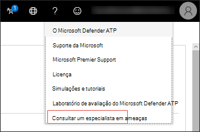
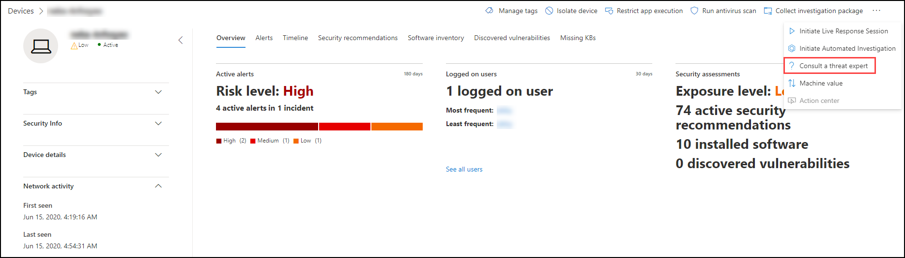
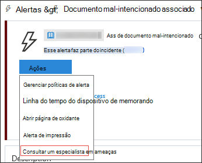
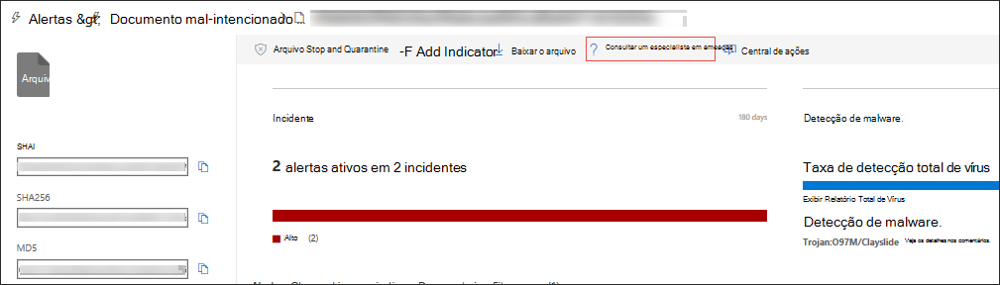

# Especialistas em Ameaças da MicrosoftMicrosoft Threat Experts

[!INCLUDE [Microsoft 365 Defender rebranding](../../includes/microsoft-defender.md)]

**Aplica-se a:****Applies to:**
- [Microsoft Defender para Ponto de ExtremidadeMicrosoft Defender for Endpoint](https://go.microsoft.com/fwlink/p/?linkid=2154037)
- [Microsoft 365 DefenderMicrosoft 365 Defender](https://go.microsoft.com/fwlink/?linkid=2118804)

> Deseja experimentar o Microsoft Defender para Ponto de Extremidade?Want to experience Microsoft Defender for Endpoint? [Inscreva-se para uma avaliação gratuita.Sign up for a free trial.](https://www.microsoft.com/microsoft-365/windows/microsoft-defender-atp?ocid=docs-wdatp-exposedapis-abovefoldlink)

Especialistas em Ameaças da Microsoft é um serviço gerenciado de busca de ameaças que fornece aos Seus Centros de Operação de Segurança (SOCs) monitoramento e análise de nível especializado para ajudá-los a garantir que ameaças críticas em seus ambientes exclusivos não se esmaeçam.Microsoft Threat Experts is a managed threat hunting service that provides your Security Operation Centers (SOCs) with expert level monitoring and analysis to help them ensure that critical threats in your unique environments don’t get missed.
  
Esse serviço gerenciado de busca de ameaças fornece informações e dados orientados por especialistas por meio desses dois recursos: notificação de ataque direcionada e acesso a especialistas sob demanda.This managed threat hunting service provides expert-driven insights and data through these two capabilities: targeted attack notification and access to experts on demand.

## Antes de começarBefore you begin 
> [!NOTE]
> Discuta os requisitos de qualificação com seu provedor de serviços técnicos da Microsoft e a equipe de conta antes de aplicar ao serviço de busca de ameaças gerenciado.Discuss the eligibility requirements with your Microsoft Technical Service provider and account team before you apply to the managed threat hunting service.

Se você for um cliente do Microsoft Defender para Ponto de Extremidade, será necessário solicitar o Especialistas em Ameaças da Microsoft - Notificações de Ataque Direcionados para obter informações e análises especiais que ajudam a identificar as ameaças mais **críticas** em seu ambiente para que você possa responder a elas rapidamenteIf you're a Microsoft Defender for Endpoint customer, you need to apply for **Microsoft Threat Experts - Targeted Attack Notifications** to get special insights and analysis that help identify the most critical threats in your environment so you can respond to them quickly

Para se inscrever no Especialistas em Ameaças da Microsoft - Benefícios de Notificações de Ataques Direcionados, acesse Configurações Recursos Avançados Gerais Especialistas em Ameaças da Microsoft - Notificações de Ataque  >    >    >  **Direcionadas** a aplicar.To enroll to Microsoft Threat Experts - Targeted Attack Notifications benefits, go to **Settings** > **General** > **Advanced features** > **Microsoft Threat Experts - Targeted Attack Notifications** to apply. Uma vez aceito, você receberá os benefícios das Notificações de Ataque Direcionados.Once accepted, you will get the benefits of Targeted Attack Notifications.

Entre em contato com sua equipe de conta ou representante da Microsoft para assinar o **Especialistas em Ameaças da Microsoft -** Especialistas sob Demanda para consultar nossos especialistas em ameaças sobre detecções e adversários relevantes que sua organização está enfrentando.Contact your account team or Microsoft representative to subscribe to **Microsoft Threat Experts - Experts on Demand** to consult with our threat experts on relevant detections and adversaries that your organization is facing.

Consulte [Configurar Especialistas em Ameaças da Microsoft recursos para](/microsoft-365/security/defender-endpoint/configure-microsoft-threat-experts#before-you-begin) obter detalhes.See [Configure Microsoft Threat Experts capabilities](/microsoft-365/security/defender-endpoint/configure-microsoft-threat-experts#before-you-begin) for details. 

## Especialistas em Ameaças da Microsoft - Notificação de ataque direcionadoMicrosoft Threat Experts - Targeted attack notification 
Especialistas em Ameaças da Microsoft - A notificação de ataque direcionada fornece a busca proativa das ameaças mais importantes à sua rede, incluindo invasões de adversários humanos, ataques hands-on-keyboard ou ataques avançados, como a ciber-espionagem.Microsoft Threat Experts - Targeted attack notification provides proactive hunting for the most important threats to your network, including human adversary intrusions, hands-on-keyboard attacks, or advanced attacks like cyber-espionage. Essas notificações são um novo alerta.These notifications shows up as a new alert. O serviço de busca gerenciada inclui:The managed hunting service includes:  
- Monitoramento e análise de ameaças, reduzindo o tempo de vida e o risco para os negóciosThreat monitoring and analysis, reducing dwell time and risk to the business 
- Inteligência artificial treinado pelo caçador para descobrir e priorizar ataques conhecidos e desconhecidosHunter-trained artificial intelligence to discover and prioritize both known and unknown attacks  
- Identificar os riscos mais importantes, ajudando os SOCs a maximizar o tempo e a energiaIdentifying the most important risks, helping SOCs maximize time and energy 
- Escopo de comprometimento e o máximo de contexto que pode ser entregue rapidamente para habilitar a resposta rápida do SOC.Scope of compromise and as much context as can be quickly delivered to enable fast SOC response. 
 
## Especialistas em Ameaças da Microsoft - Especialistas sob DemandaMicrosoft Threat Experts - Experts on Demand
Os clientes podem envolver nossos especialistas em segurança diretamente de dentro Central de Segurança do Microsoft Defender para uma resposta o tempo e a precisão.Customers can engage our security experts directly from within Microsoft Defender Security Center for timely and accurate response. Os especialistas fornecem informações necessárias para entender melhor as ameaças complexas que afetam sua organização, desde consultas de alerta, dispositivos potencialmente comprometidos, causa raiz de uma conexão de rede suspeita, até informações adicionais sobre ameaças em relação a campanhas avançadas de ameaças persistentes em andamento.Experts provide insights needed to better understand the complex threats affecting your organization, from alert inquiries, potentially compromised devices, root cause of a suspicious network connection, to additional threat intelligence regarding ongoing advanced persistent threat campaigns. Com essa funcionalidade, você pode:With this capability, you can:
- Obter esclarecimento adicional sobre alertas, incluindo a causa raiz ou o escopo do incidenteGet additional clarification on alerts including root cause or scope of the incident 
- Obtenha clareza no comportamento do dispositivo suspeito e nas próximas etapas se enfrentar um invasor avançadoGain clarity into suspicious device behavior and next steps if faced with an advanced attacker  
- Determinar riscos e proteção em relação a atores de ameaças, campanhas ou técnicas de invasores emergentesDetermine risk and protection regarding threat actors, campaigns, or emerging attacker techniques 

A opção de **consultar um especialista em ameaças** está disponível em vários locais no portal para que você possa se envolver com especialistas no contexto de sua investigação:The option to **Consult a threat expert** is available in several places in the portal so you can engage with experts in the context of your investigation:

- <i>**Menu ajuda e suporte**</i><i>**Help and support menu**</i> 

- <i>**Menu ações da página do dispositivo**</i><i>**Device page actions menu**</i> 

- <i>**Menu Ações de página de alertas**</i><i>**Alerts page actions menu**</i> 

- <i>**Menu Ações de página de arquivo**</i><i>**File page actions menu**</i> 

> [!NOTE]
> Se você quiser acompanhar o status de seus casos de Especialistas sob Demanda por meio do Microsoft Services Hub, entre em contato com seu Gerente de Conta Técnica.If you would like to track the status of your Experts on Demand cases through Microsoft Services Hub, reach out to your Technical Account Manager. 

Assista a este vídeo para uma visão geral rápida do Microsoft Services Hub.Watch this video for a quick overview of the Microsoft Services Hub.

>[!VIDEO https://www.microsoft.com/videoplayer/embed/RE4pk9f] 

   
## Tópicos relacionadosRelated topic
- [Configurar Especialistas em Ameaças da Microsoft recursosConfigure Microsoft Threat Experts capabilities](configure-microsoft-threat-experts.md)
