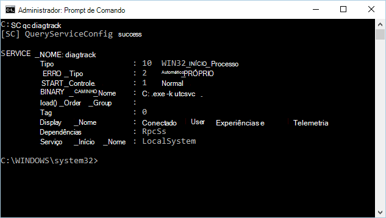

# <a name="minimum-requirements-for-microsoft-defender-for-endpoint"></a><span data-ttu-id="1f512-104">Requisitos mínimos para o Microsoft Defender para Ponto de Extremidade</span><span class="sxs-lookup"><span data-stu-id="1f512-104">Minimum requirements for Microsoft Defender for Endpoint</span></span>

[!INCLUDE [Microsoft 365 Defender rebranding](../../includes/microsoft-defender.md)]

<span data-ttu-id="1f512-105">**Aplica-se a:**</span><span class="sxs-lookup"><span data-stu-id="1f512-105">**Applies to:**</span></span>
- [<span data-ttu-id="1f512-106">Microsoft Defender para Ponto de Extremidade</span><span class="sxs-lookup"><span data-stu-id="1f512-106">Microsoft Defender for Endpoint</span></span>](https://go.microsoft.com/fwlink/p/?linkid=2154037)
- [<span data-ttu-id="1f512-107">Microsoft 365 Defender</span><span class="sxs-lookup"><span data-stu-id="1f512-107">Microsoft 365 Defender</span></span>](https://go.microsoft.com/fwlink/?linkid=2118804)

> <span data-ttu-id="1f512-108">Deseja experimentar o Microsoft Defender para Ponto de Extremidade?</span><span class="sxs-lookup"><span data-stu-id="1f512-108">Want to experience Microsoft Defender for Endpoint?</span></span> [<span data-ttu-id="1f512-109">Inscreva-se para uma avaliação gratuita.</span><span class="sxs-lookup"><span data-stu-id="1f512-109">Sign up for a free trial.</span></span>](https://www.microsoft.com/microsoft-365/windows/microsoft-defender-atp?ocid=docs-wdatp-minreqs-abovefoldlink)


<span data-ttu-id="1f512-110">Há alguns requisitos mínimos para a integração de dispositivos ao serviço.</span><span class="sxs-lookup"><span data-stu-id="1f512-110">There are some minimum requirements for onboarding devices to the service.</span></span> <span data-ttu-id="1f512-111">Saiba mais sobre os requisitos de licenciamento, hardware e software e outras configurações para os dispositivos de integração ao serviço.</span><span class="sxs-lookup"><span data-stu-id="1f512-111">Learn about the licensing, hardware and software requirements, and other configuration settings to onboard devices to the service.</span></span>

> [!TIP]
> - <span data-ttu-id="1f512-112">Saiba mais sobre os aprimoramentos mais recentes no Defender for Endpoint: [Defender for Endpoint Tech Community](https://techcommunity.microsoft.com/t5/Windows-Defender-Advanced-Threat/ct-p/WindowsDefenderAdvanced).</span><span class="sxs-lookup"><span data-stu-id="1f512-112">Learn about the latest enhancements in Defender for Endpoint: [Defender for Endpoint Tech Community](https://techcommunity.microsoft.com/t5/Windows-Defender-Advanced-Threat/ct-p/WindowsDefenderAdvanced).</span></span>
> - <span data-ttu-id="1f512-113">O Defender for Endpoint demonstrou recursos de detecção e ótica líderes do setor na avaliação recente do MITRE.</span><span class="sxs-lookup"><span data-stu-id="1f512-113">Defender for Endpoint demonstrated industry-leading optics and detection capabilities in the recent MITRE evaluation.</span></span> <span data-ttu-id="1f512-114">Leitura: [Insights do MITRE ATT&avaliação baseada em CK.](https://cloudblogs.microsoft.com/microsoftsecure/2018/12/03/insights-from-the-mitre-attack-based-evaluation-of-windows-defender-atp/)</span><span class="sxs-lookup"><span data-stu-id="1f512-114">Read: [Insights from the MITRE ATT&CK-based evaluation](https://cloudblogs.microsoft.com/microsoftsecure/2018/12/03/insights-from-the-mitre-attack-based-evaluation-of-windows-defender-atp/).</span></span>

## <a name="licensing-requirements"></a><span data-ttu-id="1f512-115">Requisitos de licença</span><span class="sxs-lookup"><span data-stu-id="1f512-115">Licensing requirements</span></span>
<span data-ttu-id="1f512-116">O Microsoft Defender para Ponto de Extremidade requer uma das seguintes ofertas de licenciamento por volume da Microsoft:</span><span class="sxs-lookup"><span data-stu-id="1f512-116">Microsoft Defender for Endpoint requires one of the following Microsoft volume licensing offers:</span></span>

- <span data-ttu-id="1f512-117">Windows 10 Enterprise E5</span><span class="sxs-lookup"><span data-stu-id="1f512-117">Windows 10 Enterprise E5</span></span>
- <span data-ttu-id="1f512-118">Windows 10 Education A5</span><span class="sxs-lookup"><span data-stu-id="1f512-118">Windows 10 Education A5</span></span>
- <span data-ttu-id="1f512-119">Microsoft 365 E5 (M365 E5) que inclui o Windows 10 Enterprise E5</span><span class="sxs-lookup"><span data-stu-id="1f512-119">Microsoft 365 E5 (M365 E5) which includes Windows 10 Enterprise E5</span></span>
- <span data-ttu-id="1f512-120">Microsoft 365 A5 (M365 A5)</span><span class="sxs-lookup"><span data-stu-id="1f512-120">Microsoft 365 A5 (M365 A5)</span></span>
- <span data-ttu-id="1f512-121">Segurança do Microsoft 365 E5</span><span class="sxs-lookup"><span data-stu-id="1f512-121">Microsoft 365 E5 Security</span></span>
- <span data-ttu-id="1f512-122">Segurança 365 A5 da Microsoft</span><span class="sxs-lookup"><span data-stu-id="1f512-122">Microsoft 365 A5 Security</span></span>
- <span data-ttu-id="1f512-123">Microsoft Defender para Ponto de Extremidade</span><span class="sxs-lookup"><span data-stu-id="1f512-123">Microsoft Defender for Endpoint</span></span>

> [!NOTE]
> <span data-ttu-id="1f512-124">Os usuários licenciados qualificados podem usar o Microsoft Defender para Ponto de Extremidade em até cinco dispositivos simultâneos.</span><span class="sxs-lookup"><span data-stu-id="1f512-124">Eligible licensed users may use Microsoft Defender for Endpoint on up to five concurrent devices.</span></span>
> <span data-ttu-id="1f512-125">O Microsoft Defender para Ponto de Extremidade também está disponível para compra de um Provedor de Soluções na Nuvem (CSP).</span><span class="sxs-lookup"><span data-stu-id="1f512-125">Microsoft Defender for Endpoint is also available for purchase from a Cloud Solution Provider (CSP).</span></span>

<span data-ttu-id="1f512-126">O Microsoft Defender para Ponto de Extremidade para servidores requer uma das seguintes opções de licenciamento:</span><span class="sxs-lookup"><span data-stu-id="1f512-126">Microsoft Defender for Endpoint for servers requires one of the following licensing options:</span></span>

- [<span data-ttu-id="1f512-127">Centro de Segurança do Azure com o Azure Defender habilitado</span><span class="sxs-lookup"><span data-stu-id="1f512-127">Azure Security Center with Azure Defender enabled</span></span>](https://docs.microsoft.com/azure/security-center/security-center-pricing)
- <span data-ttu-id="1f512-128">Microsoft Defender para Ponto de Extremidade para Servidor (um por servidor coberto)</span><span class="sxs-lookup"><span data-stu-id="1f512-128">Microsoft Defender for Endpoint for Server (one per covered server)</span></span>

> [!NOTE]
> <span data-ttu-id="1f512-129">Os clientes podem adquirir licenças de servidor (uma por servidor coberto Ambiente do Sistema Operacional (OSE)) para o Microsoft Defender para Ponto de Extremidade para Servidores se eles têm um mínimo combinado de 50 licenças para uma ou mais das seguintes licenças de usuário:</span><span class="sxs-lookup"><span data-stu-id="1f512-129">Customers may acquire server licenses (one per covered server Operating System Environment (OSE)) for Microsoft Defender for Endpoint for Servers if they have a combined minimum of 50 licenses for one or more of the following user licenses:</span></span>
>
> * <span data-ttu-id="1f512-130">Microsoft Defender para Ponto de Extremidade</span><span class="sxs-lookup"><span data-stu-id="1f512-130">Microsoft Defender for Endpoint</span></span>
> * <span data-ttu-id="1f512-131">Windows E5/A5</span><span class="sxs-lookup"><span data-stu-id="1f512-131">Windows E5/A5</span></span>
> * <span data-ttu-id="1f512-132">Microsoft 365 E5/A5</span><span class="sxs-lookup"><span data-stu-id="1f512-132">Microsoft 365 E5/A5</span></span>
> * <span data-ttu-id="1f512-133">Segurança do Microsoft 365 E5/A5</span><span class="sxs-lookup"><span data-stu-id="1f512-133">Microsoft 365 E5/A5 Security</span></span>

<span data-ttu-id="1f512-134">Para obter informações detalhadas sobre licenciamento, consulte o [site Termos](https://www.microsoft.com/licensing/terms/) do Produto e trabalhe com sua equipe de conta para saber mais sobre os termos e condições.</span><span class="sxs-lookup"><span data-stu-id="1f512-134">For detailed licensing information, see the [Product Terms site](https://www.microsoft.com/licensing/terms/) and work with your account team to learn more about the terms and conditions.</span></span>

<span data-ttu-id="1f512-135">Para obter mais informações sobre a matriz de recursos em edições do Windows 10, consulte [Comparar edições do Windows 10.](https://www.microsoft.com/windowsforbusiness/compare)</span><span class="sxs-lookup"><span data-stu-id="1f512-135">For more information on the array of features in Windows 10 editions, see [Compare Windows 10 editions](https://www.microsoft.com/windowsforbusiness/compare).</span></span>

<span data-ttu-id="1f512-136">Para uma tabela de comparação detalhada da comparação de edição comercial do Windows 10, consulte a [comparação PDF](https://wfbdevicemanagementprod.blob.core.windows.net/windowsforbusiness/Windows10_CommercialEdition_Comparison.pdf).</span><span class="sxs-lookup"><span data-stu-id="1f512-136">For a detailed comparison table of Windows 10 commercial edition comparison, see the [comparison PDF](https://wfbdevicemanagementprod.blob.core.windows.net/windowsforbusiness/Windows10_CommercialEdition_Comparison.pdf).</span></span>

## <a name="browser-requirements"></a><span data-ttu-id="1f512-137">Requisitos de navegador</span><span class="sxs-lookup"><span data-stu-id="1f512-137">Browser requirements</span></span>
<span data-ttu-id="1f512-138">O acesso ao Defender para Ponto de Extremidade é feito por meio de um navegador, suportando os seguintes navegadores:</span><span class="sxs-lookup"><span data-stu-id="1f512-138">Access to Defender for Endpoint is done through a browser, supporting the following browsers:</span></span>

- <span data-ttu-id="1f512-139">Microsoft Edge</span><span class="sxs-lookup"><span data-stu-id="1f512-139">Microsoft Edge</span></span>
- <span data-ttu-id="1f512-140">Google Chrome</span><span class="sxs-lookup"><span data-stu-id="1f512-140">Google Chrome</span></span>

> [!NOTE]
> <span data-ttu-id="1f512-141">Embora outros navegadores possam funcionar, os navegadores mencionados são aqueles com suporte.</span><span class="sxs-lookup"><span data-stu-id="1f512-141">While other browsers might work, the mentioned browsers are the ones supported.</span></span>


## <a name="hardware-and-software-requirements"></a><span data-ttu-id="1f512-142">Requisitos de hardware e software</span><span class="sxs-lookup"><span data-stu-id="1f512-142">Hardware and software requirements</span></span>

### <a name="supported-windows-versions"></a><span data-ttu-id="1f512-143">Versões com suporte do Windows</span><span class="sxs-lookup"><span data-stu-id="1f512-143">Supported Windows versions</span></span>
- <span data-ttu-id="1f512-144">Windows 7 SP1 Enterprise ([Requer ESU para suporte](https://docs.microsoft.com/troubleshoot/windows-client/windows-7-eos-faq/windows-7-extended-security-updates-faq).)</span><span class="sxs-lookup"><span data-stu-id="1f512-144">Windows 7 SP1 Enterprise ([Requires ESU for support](https://docs.microsoft.com/troubleshoot/windows-client/windows-7-eos-faq/windows-7-extended-security-updates-faq).)</span></span>
- <span data-ttu-id="1f512-145">Windows 7 SP1 Pro ([Requer ESU para suporte](https://docs.microsoft.com/troubleshoot/windows-client/windows-7-eos-faq/windows-7-extended-security-updates-faq).)</span><span class="sxs-lookup"><span data-stu-id="1f512-145">Windows 7 SP1 Pro ([Requires ESU for support](https://docs.microsoft.com/troubleshoot/windows-client/windows-7-eos-faq/windows-7-extended-security-updates-faq).)</span></span>
- <span data-ttu-id="1f512-146">Windows 8.1 Enterprise</span><span class="sxs-lookup"><span data-stu-id="1f512-146">Windows 8.1 Enterprise</span></span>
- <span data-ttu-id="1f512-147">Windows 8.1 Pro</span><span class="sxs-lookup"><span data-stu-id="1f512-147">Windows 8.1 Pro</span></span>
- <span data-ttu-id="1f512-148">Windows 10 Enterprise</span><span class="sxs-lookup"><span data-stu-id="1f512-148">Windows 10 Enterprise</span></span>
- [<span data-ttu-id="1f512-149">Windows 10 Enterprise LTSC</span><span class="sxs-lookup"><span data-stu-id="1f512-149">Windows 10 Enterprise LTSC</span></span>](https://docs.microsoft.com/windows/whats-new/ltsc/)
- <span data-ttu-id="1f512-150">Windows 10 Education</span><span class="sxs-lookup"><span data-stu-id="1f512-150">Windows 10 Education</span></span>
- <span data-ttu-id="1f512-151">Windows 10 Pro</span><span class="sxs-lookup"><span data-stu-id="1f512-151">Windows 10 Pro</span></span>
- <span data-ttu-id="1f512-152">Windows 10 Pro Education</span><span class="sxs-lookup"><span data-stu-id="1f512-152">Windows 10 Pro Education</span></span>
- <span data-ttu-id="1f512-153">Windows Server</span><span class="sxs-lookup"><span data-stu-id="1f512-153">Windows server</span></span>
  - <span data-ttu-id="1f512-154">Windows Server 2008 R2 SP1</span><span class="sxs-lookup"><span data-stu-id="1f512-154">Windows Server 2008 R2 SP1</span></span>
  - <span data-ttu-id="1f512-155">Windows Server 2012 R2</span><span class="sxs-lookup"><span data-stu-id="1f512-155">Windows Server 2012 R2</span></span>
  - <span data-ttu-id="1f512-156">Windows Server 2016</span><span class="sxs-lookup"><span data-stu-id="1f512-156">Windows Server 2016</span></span>
  - <span data-ttu-id="1f512-157">Windows Server, versão 1803 ou posterior</span><span class="sxs-lookup"><span data-stu-id="1f512-157">Windows Server, version 1803 or later</span></span>
  - <span data-ttu-id="1f512-158">Windows Server 2019</span><span class="sxs-lookup"><span data-stu-id="1f512-158">Windows Server 2019</span></span>
- <span data-ttu-id="1f512-159">Área de Trabalho Virtual do Windows</span><span class="sxs-lookup"><span data-stu-id="1f512-159">Windows Virtual Desktop</span></span>

<span data-ttu-id="1f512-160">Os dispositivos em sua rede devem estar executando uma dessas edições.</span><span class="sxs-lookup"><span data-stu-id="1f512-160">Devices on your network must be running one of these editions.</span></span>

<span data-ttu-id="1f512-161">Os requisitos de hardware para o Defender para Ponto de Extremidade em dispositivos são os mesmos para as edições com suporte.</span><span class="sxs-lookup"><span data-stu-id="1f512-161">The hardware requirements for Defender for Endpoint on devices are the same for the supported editions.</span></span>

> [!NOTE]
> <span data-ttu-id="1f512-162">Não há suporte para computadores que executam versões móveis do Windows (como Windows CE e Windows 10 Mobile).</span><span class="sxs-lookup"><span data-stu-id="1f512-162">Machines running mobile versions of Windows (such as Windows CE and Windows 10 Mobile) aren't supported.</span></span>
>
> <span data-ttu-id="1f512-163">Máquinas virtuais que executam o Windows 10 Enterprise 2016 LTSB podem encontrar problemas de desempenho se executados em plataformas de virtualização que não são da Microsoft.</span><span class="sxs-lookup"><span data-stu-id="1f512-163">Virtual Machines running Windows 10 Enterprise 2016 LTSB may encounter performance issues if run on non-Microsoft virtualization platforms.</span></span>
>
> <span data-ttu-id="1f512-164">Para ambientes virtuais, recomendamos usar o Windows 10 Enterprise LTSC 2019 ou posterior.</span><span class="sxs-lookup"><span data-stu-id="1f512-164">For virtual environments, we recommend using Windows 10 Enterprise LTSC 2019 or later.</span></span>


### <a name="other-supported-operating-systems"></a><span data-ttu-id="1f512-165">Outros sistemas operacionais com suporte</span><span class="sxs-lookup"><span data-stu-id="1f512-165">Other supported operating systems</span></span>
- <span data-ttu-id="1f512-166">Android</span><span class="sxs-lookup"><span data-stu-id="1f512-166">Android</span></span>
- <span data-ttu-id="1f512-167">iOS</span><span class="sxs-lookup"><span data-stu-id="1f512-167">iOS</span></span>
- <span data-ttu-id="1f512-168">Linux</span><span class="sxs-lookup"><span data-stu-id="1f512-168">Linux</span></span>
- <span data-ttu-id="1f512-169">macOS</span><span class="sxs-lookup"><span data-stu-id="1f512-169">macOS</span></span>

> [!NOTE]
> <span data-ttu-id="1f512-170">Você precisará confirmar as distribuições e versões do Linux do Android, iOS e macOS que você é compatível com o Defender para o Ponto de Extremidade para que a integração funcione.</span><span class="sxs-lookup"><span data-stu-id="1f512-170">You'll need to confirm the Linux distributions and versions of Android, iOS and macOS you've are compatible with Defender for Endpoint for the integration to work.</span></span>


### <a name="network-and-data-storage-and-configuration-requirements"></a><span data-ttu-id="1f512-171">Requisitos de configuração e armazenamento de rede e dados</span><span class="sxs-lookup"><span data-stu-id="1f512-171">Network and data storage and configuration requirements</span></span>
<span data-ttu-id="1f512-172">Ao executar o assistente de integração pela primeira vez, você deve escolher onde suas informações relacionadas ao Microsoft Defender for Endpoint estão armazenadas: na União Europeia, no Reino Unido ou no datacenter dos Estados Unidos.</span><span class="sxs-lookup"><span data-stu-id="1f512-172">When you run the onboarding wizard for the first time, you must choose where your Microsoft Defender for Endpoint-related information is stored: in the European Union, the United Kingdom, or the United States datacenter.</span></span>

> [!NOTE]
> - <span data-ttu-id="1f512-173">Não é possível alterar o local de armazenamento de dados após a configuração pela primeira vez.</span><span class="sxs-lookup"><span data-stu-id="1f512-173">You cannot change your data storage location after the first-time setup.</span></span>
> - <span data-ttu-id="1f512-174">Revise o [Microsoft Defender para armazenamento e](data-storage-privacy.md) privacidade de dados do Ponto de Extremidade para obter mais informações sobre onde e como a Microsoft armazena seus dados.</span><span class="sxs-lookup"><span data-stu-id="1f512-174">Review the [Microsoft Defender for Endpoint data storage and privacy](data-storage-privacy.md) for more information on where and how Microsoft stores your data.</span></span>


### <a name="diagnostic-data-settings"></a><span data-ttu-id="1f512-175">Configurações de dados de diagnóstico</span><span class="sxs-lookup"><span data-stu-id="1f512-175">Diagnostic data settings</span></span>

> [!NOTE]
> <span data-ttu-id="1f512-176">O Microsoft Defender para Ponto de Extremidade não exige nenhum nível de diagnóstico específico, desde que ele seja habilitado.</span><span class="sxs-lookup"><span data-stu-id="1f512-176">Microsoft Defender for Endpoint doesn't require any specific diagnostic level as long as it's enabled.</span></span>

<span data-ttu-id="1f512-177">Certifique-se de que o serviço de dados de diagnóstico está habilitado em todos os dispositivos da sua organização.</span><span class="sxs-lookup"><span data-stu-id="1f512-177">Make sure that the diagnostic data service is enabled on all the devices in your organization.</span></span>
<span data-ttu-id="1f512-178">Por padrão, esse serviço está habilitado.</span><span class="sxs-lookup"><span data-stu-id="1f512-178">By default, this service is enabled.</span></span> <span data-ttu-id="1f512-179">É uma boa prática verificar para garantir que você obterá dados do sensor deles.</span><span class="sxs-lookup"><span data-stu-id="1f512-179">It's good practice to check to ensure that you'll get sensor data from them.</span></span>

<span data-ttu-id="1f512-180">Use a linha de comando para verificar o tipo de inicialização do serviço de dados de diagnóstico **do Windows 10:**</span><span class="sxs-lookup"><span data-stu-id="1f512-180">**Use the command line to check the Windows 10 diagnostic data service startup type**:</span></span>

1. <span data-ttu-id="1f512-181">Abra um prompt de linha de comando elevada no dispositivo:</span><span class="sxs-lookup"><span data-stu-id="1f512-181">Open an elevated command-line prompt on the device:</span></span>

   1.  <span data-ttu-id="1f512-182">Vá para **Iniciar** e digite **cmd**.</span><span class="sxs-lookup"><span data-stu-id="1f512-182">Go to **Start** and type **cmd**.</span></span>

   1.  <span data-ttu-id="1f512-183">Clique com o botão direito do mouse em **Prompt de Comando** e selecione **Executar como administrador**.</span><span class="sxs-lookup"><span data-stu-id="1f512-183">Right-click **Command prompt** and select **Run as administrator**.</span></span>

2. <span data-ttu-id="1f512-184">Insira o seguinte comando e pressione **Enter**:</span><span class="sxs-lookup"><span data-stu-id="1f512-184">Enter the following command, and press **Enter**:</span></span>

   ```console
   sc qc diagtrack
   ```

   <span data-ttu-id="1f512-185">Se o serviço estiver habilitado, o resultado deverá ter a seguinte captura de tela:</span><span class="sxs-lookup"><span data-stu-id="1f512-185">If the service is enabled, then the result should look like the following screenshot:</span></span>

   


<span data-ttu-id="1f512-187">Você precisará definir o serviço para iniciar automaticamente se o START_TYPE **não** estiver definido como **AUTO_START**.</span><span class="sxs-lookup"><span data-stu-id="1f512-187">You'll need to set the service to automatically start if the **START_TYPE** isn't set to **AUTO_START**.</span></span>


<span data-ttu-id="1f512-188">**Use a linha de comando para definir o serviço de dados de diagnóstico do Windows 10 para iniciar automaticamente:**</span><span class="sxs-lookup"><span data-stu-id="1f512-188">**Use the command line to set the Windows 10 diagnostic data service to automatically start:**</span></span>

1.  <span data-ttu-id="1f512-189">Abra um prompt de linha de comando elevada no ponto de extremidade:</span><span class="sxs-lookup"><span data-stu-id="1f512-189">Open an elevated command-line prompt on the endpoint:</span></span>

    1. <span data-ttu-id="1f512-190">Vá para **Iniciar** e digite **cmd**.</span><span class="sxs-lookup"><span data-stu-id="1f512-190">Go to **Start** and type **cmd**.</span></span>

    1. <span data-ttu-id="1f512-191">Clique com o botão direito do mouse em **Prompt de Comando** e selecione **Executar como administrador**.</span><span class="sxs-lookup"><span data-stu-id="1f512-191">Right-click **Command prompt** and select **Run as administrator**.</span></span>

2.  <span data-ttu-id="1f512-192">Insira o seguinte comando e pressione **Enter**:</span><span class="sxs-lookup"><span data-stu-id="1f512-192">Enter the following command, and press **Enter**:</span></span>

    ```console
    sc config diagtrack start=auto
    ```

3.  <span data-ttu-id="1f512-193">Uma mensagem de sucesso é exibida.</span><span class="sxs-lookup"><span data-stu-id="1f512-193">A success message is displayed.</span></span> <span data-ttu-id="1f512-194">Verifique a alteração inserindo o seguinte comando e pressione **Enter**:</span><span class="sxs-lookup"><span data-stu-id="1f512-194">Verify the change by entering the following command, and press **Enter**:</span></span>

    ```console
    sc qc diagtrack
    ```


#### <a name="internet-connectivity"></a><span data-ttu-id="1f512-195">Conectividade com a Internet</span><span class="sxs-lookup"><span data-stu-id="1f512-195">Internet connectivity</span></span>
<span data-ttu-id="1f512-196">A conectividade com a Internet em dispositivos é necessária diretamente ou por proxy.</span><span class="sxs-lookup"><span data-stu-id="1f512-196">Internet connectivity on devices is required either directly or through proxy.</span></span>

<span data-ttu-id="1f512-197">O sensor Defender para Ponto de Extremidade pode usar uma largura de banda média diária de 5 MB para se comunicar com o serviço de nuvem do Defender para Ponto de Extremidade e relatar dados cibernéticos.</span><span class="sxs-lookup"><span data-stu-id="1f512-197">The Defender for Endpoint sensor can use a daily average bandwidth of 5 MB to communicate with the Defender for Endpoint cloud service and report cyber data.</span></span> <span data-ttu-id="1f512-198">Atividades exclusivas, como carregamentos de arquivos e conjunto de pacotes de investigação, não são incluídas nesta largura de banda média diária.</span><span class="sxs-lookup"><span data-stu-id="1f512-198">One-off activities such as file uploads and investigation package collection aren't included in this daily average bandwidth.</span></span>

<span data-ttu-id="1f512-199">Para obter mais informações sobre configurações de proxy adicionais, consulte [Configure device proxy and Internet connectivity settings](configure-proxy-internet.md).</span><span class="sxs-lookup"><span data-stu-id="1f512-199">For more information on additional proxy configuration settings, see [Configure device proxy and Internet connectivity settings](configure-proxy-internet.md).</span></span>

<span data-ttu-id="1f512-200">Antes de você entrar em dispositivos, o serviço de dados de diagnóstico deve estar habilitado.</span><span class="sxs-lookup"><span data-stu-id="1f512-200">Before you onboard devices, the diagnostic data service must be enabled.</span></span> <span data-ttu-id="1f512-201">O serviço é habilitado por padrão no Windows 10.</span><span class="sxs-lookup"><span data-stu-id="1f512-201">The service is enabled by default in Windows 10.</span></span>


## <a name="microsoft-defender-antivirus-configuration-requirement"></a><span data-ttu-id="1f512-202">Requisito de configuração do Microsoft Defender Antivírus</span><span class="sxs-lookup"><span data-stu-id="1f512-202">Microsoft Defender Antivirus configuration requirement</span></span>
<span data-ttu-id="1f512-203">O agente Defender para Ponto de Extremidade depende da capacidade do Microsoft Defender Antivírus de examinar arquivos e fornecer informações sobre eles.</span><span class="sxs-lookup"><span data-stu-id="1f512-203">The Defender for Endpoint agent depends on the ability of Microsoft Defender Antivirus to scan files and provide information about them.</span></span>

<span data-ttu-id="1f512-204">Configure atualizações de inteligência de segurança no Defender para dispositivos de ponto de extremidade, independentemente de o Microsoft Defender Antivírus ser o antimalware ativo ou não.</span><span class="sxs-lookup"><span data-stu-id="1f512-204">Configure Security intelligence updates on the Defender for Endpoint devices whether Microsoft Defender Antivirus is the active antimalware or not.</span></span> <span data-ttu-id="1f512-205">Para obter mais informações, consulte [Manage Microsoft Defender Antivírus updates and apply baselines](https://docs.microsoft.com/windows/security/threat-protection/microsoft-defender-antivirus/manage-updates-baselines-microsoft-defender-antivirus).</span><span class="sxs-lookup"><span data-stu-id="1f512-205">For more information, see [Manage Microsoft Defender Antivirus updates and apply baselines](https://docs.microsoft.com/windows/security/threat-protection/microsoft-defender-antivirus/manage-updates-baselines-microsoft-defender-antivirus).</span></span>

<span data-ttu-id="1f512-206">Quando o Microsoft Defender Antivírus não é o antimalware ativo em sua organização e você usa o serviço Defender para Ponto de Extremidade, o Microsoft Defender Antivírus entra no modo passivo.</span><span class="sxs-lookup"><span data-stu-id="1f512-206">When Microsoft Defender Antivirus isn't the active antimalware in your organization and you use the Defender for Endpoint service, Microsoft Defender Antivirus goes on passive mode.</span></span>

<span data-ttu-id="1f512-207">Se sua organização tiver desligado o Microsoft Defender Antivírus por meio de política de grupo ou outros métodos, os dispositivos que estão integrados devem ser excluídos dessa política de grupo.</span><span class="sxs-lookup"><span data-stu-id="1f512-207">If your organization has turned off Microsoft Defender Antivirus through group policy or other methods, devices that are onboarded must be excluded from this group policy.</span></span>

<span data-ttu-id="1f512-208">Se você estiver integrando servidores e o Microsoft Defender Antivírus não for o antimalware ativo em seus servidores, o Microsoft Defender Antivírus precisará ser configurado para entrar no modo passivo ou desinstalado.</span><span class="sxs-lookup"><span data-stu-id="1f512-208">If you're onboarding servers and Microsoft Defender Antivirus isn't the active antimalware on your servers, Microsoft Defender Antivirus will either need to be configured to go on passive mode or uninstalled.</span></span> <span data-ttu-id="1f512-209">A configuração depende da versão do servidor.</span><span class="sxs-lookup"><span data-stu-id="1f512-209">The configuration is dependent on the server version.</span></span> <span data-ttu-id="1f512-210">Para obter mais informações, consulte [compatibilidade do Microsoft Defender Antivírus](https://docs.microsoft.com/windows/security/threat-protection/microsoft-defender-antivirus-compatibility.md).</span><span class="sxs-lookup"><span data-stu-id="1f512-210">For more information, see [Microsoft Defender Antivirus compatibility](https://docs.microsoft.com/windows/security/threat-protection/microsoft-defender-antivirus-compatibility.md).</span></span>

> [!NOTE]
> <span data-ttu-id="1f512-211">Sua política de grupo regular não se aplica à Proteção contra Adulteração, e as alterações nas configurações do Microsoft Defender Antivírus serão ignoradas quando a Proteção contra Adulteração estiver em uso.</span><span class="sxs-lookup"><span data-stu-id="1f512-211">Your regular group policy doesn't apply to Tamper Protection, and changes to Microsoft Defender Antivirus settings will be ignored when Tamper Protection is on.</span></span>


## <a name="microsoft-defender-antivirus-early-launch-antimalware-elam-driver-is-enabled"></a><span data-ttu-id="1f512-212">O driver antimalware de início antecipado do Microsoft Defender Antivírus (ELAM) está habilitado</span><span class="sxs-lookup"><span data-stu-id="1f512-212">Microsoft Defender Antivirus Early Launch Antimalware (ELAM) driver is enabled</span></span>
<span data-ttu-id="1f512-213">Se você estiver executando o Microsoft Defender Antivírus como o produto antimalware principal em seus dispositivos, o agente Defender for Endpoint será aderido com êxito.</span><span class="sxs-lookup"><span data-stu-id="1f512-213">If you're running Microsoft Defender Antivirus as the primary antimalware product on your devices, the Defender for Endpoint agent will successfully onboard.</span></span>

<span data-ttu-id="1f512-214">Se você estiver executando um cliente antimalware de terceiros e usar soluções de Gerenciamento de Dispositivo Móvel ou Microsoft Endpoint Manager (filial atual), você precisará garantir que o driver ELAM do Microsoft Defender Antivírus esteja habilitado.</span><span class="sxs-lookup"><span data-stu-id="1f512-214">If you're running a third-party antimalware client and use Mobile Device Management solutions or Microsoft Endpoint Manager (current branch), you'll need to ensure the Microsoft Defender Antivirus ELAM driver is enabled.</span></span> <span data-ttu-id="1f512-215">Para obter mais informações, consulte [Ensure that Microsoft Defender Antivírus is not disabled by policy](troubleshoot-onboarding.md#ensure-that-microsoft-defender-antivirus-is-not-disabled-by-a-policy).</span><span class="sxs-lookup"><span data-stu-id="1f512-215">For more information, see [Ensure that Microsoft Defender Antivirus is not disabled by policy](troubleshoot-onboarding.md#ensure-that-microsoft-defender-antivirus-is-not-disabled-by-a-policy).</span></span>


## <a name="related-topics"></a><span data-ttu-id="1f512-216">Tópicos relacionados</span><span class="sxs-lookup"><span data-stu-id="1f512-216">Related topics</span></span>
- [<span data-ttu-id="1f512-217">Configurar o Microsoft Defender para implantação do Ponto de Extremidade</span><span class="sxs-lookup"><span data-stu-id="1f512-217">Set up Microsoft Defender for Endpoint deployment</span></span>](production-deployment.md)
- [<span data-ttu-id="1f512-218">Dispositivos de integração</span><span class="sxs-lookup"><span data-stu-id="1f512-218">Onboard devices</span></span>](onboard-configure.md)
