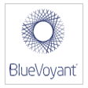
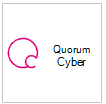

# Provedores de serviços de segurança gerenciados com suporte

**Aplica-se a:**
- [Microsoft Defender para Ponto de Extremidade](https://go.microsoft.com/fwlink/p/?linkid=2146631)
- [Microsoft 365 Defender](https://go.microsoft.com/fwlink/?linkid=2118804)

> Deseja experimentar o Microsoft Defender para Ponto de Extremidade? [Inscreva-se para uma avaliação gratuita.](https://www.microsoft.com/microsoft-365/windows/microsoft-defender-atp?ocid=docs-wdatp-exposedapis-abovefoldlink)

Os seguintes provedores de serviços de segurança gerenciados podem ser acessados por meio do portal. 

Logotipo |Nome do parceiro   | Descrição 
:---|:---|:---
| [BDO Digital](https://go.microsoft.com/fwlink/?linkid=2090394) | A Defesa Gerenciada do BDO Digital aproveita ferramentas de práticas práticas, AI e especialistas em segurança interna para proteção de identidade 24/7/365
| [BlueVoyant](https://go.microsoft.com/fwlink/?linkid=2121401) | A MDR do Microsoft Defender para Ponto de Extremidade oferece suporte no monitoramento, investigação e mitigação de ataques avançados em pontos de extremidade
| [Centro de Segurança na Nuvem](https://go.microsoft.com/fwlink/?linkid=2099315) | O Centro de Segurança na Nuvem do InSpark é um serviço gerenciado 24x7 que oferece proteção, detecção & recursos de resposta
| [SOC de nuvem](https://go.microsoft.com/fwlink/?linkid=2104265) | O CLOUD SOC fornece serviços de monitoramento de segurança 24 horas por dia, 7 dias por dia, com base na nuvem da Microsoft e ajuda você a melhorar continuamente sua postura de segurança
| [Resposta de detecção gerenciada do CSIS &](https://go.microsoft.com/fwlink/?linkid=2091005) | Monitoramento e análise 24/7 de alertas de segurança que dão às empresas informações ativas sobre o que, quando e como os incidentes de segurança foram ocorridos
| [Proteção Avançada contra Ameaças da Dell Technologies](https://go.microsoft.com/fwlink/?linkid=2091004) | Serviço de monitoramento profissional para comportamento mal-intencionado e anomalias com funcionalidade 24/7
| [Resposta e detecção de ameaças de ponto de extremidade gerenciados pelo DXC](https://go.microsoft.com/fwlink/?linkid=2090395) | Identificar ameaças de ponto de extremidade que escapam das defesas de segurança tradicionais e as contêm em horas ou minutos, não dias
 | [Detecção e resposta gerenciadas do eSentire](https://go.microsoft.com/fwlink/?linkid=2154970) | Investigações e respostas de ameaças 24x7 por meio do Microsoft Defender para Ponto de Extremidade.
| [Segurança NTT](https://go.microsoft.com/fwlink/?linkid=2095320) | O Serviço de EDR da NTT fornece monitoramento de segurança 24 horas por dia & resposta em seu ponto de extremidade e rede
 | [Onevinn MDR](https://go.microsoft.com/fwlink/?linkid=2155203)| 24 horas por dia, 7 dias por dia, detecção gerenciada e resposta criadas no Microsoft Defender e no Azure Sentinel, enriquecidas com a inteligência contra ameaças do Onevinn.
 | [Quorum Cyber](https://go.microsoft.com/fwlink/?linkid=2155202)| Um serviço de Engenharia de Segurança & de busca de ameaças de ponta.
| [Canário Vermelho](https://go.microsoft.com/fwlink/?linkid=2103852) | Red Canary é um parceiro de operações de segurança para equipes modernas, MDR implantado em minutos
| [Detecção gerenciada e resposta gerenciadas do SecureWorks com o capanco vermelho](https://go.microsoft.com/fwlink/?linkid=2133634) | O Secureworks combina inteligência contra ameaças e mais de 20 anos de experiência no SaaS e soluções de segurança gerenciadas
| [sepagoSOC](https://go.microsoft.com/fwlink/?linkid=2090491) | Garantir segurança holística por meio de fluxos de trabalho automatizados sofisticados em seu ambiente de confiança zero
| [Trustwave Threat Detection & Response Services](https://go.microsoft.com/fwlink/?linkid=2127542) | Serviços de Detecção e Resposta de Ameaças para o Azure aproveitando integrações com o Sentinel e o Defender para Ponto de Extremidade
| [White Shark Managed Security Services](https://go.microsoft.com/fwlink/?linkid=2154210) |Abordagem especializada verdadeira para a segurança cibernética com preços transparentes em todas as plataformas, móveis incluídos.
| [SOC de nuvem de Wortell](https://go.microsoft.com/fwlink/?linkid=2108415) | Serviço gerenciado do Defender para Ponto de Extremidade 24x7 para monitorar & resposta
| [Plataforma de Análise de Confiança Zero (ZTAP)](https://go.microsoft.com/fwlink/?linkid=2090971) | Reduzir seus alertas em 99% e acessar uma gama completa de recursos de segurança de dispositivos móveis

## Tópicos relacionados
- [Configurar a integração do provedor de segurança de serviço gerenciado](configure-mssp-support.md)