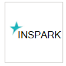
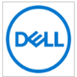

# Provedores de serviços de segurança gerenciados com suporteSupported managed security service providers

**Aplica-se a:****Applies to:**
- [Microsoft Defender para Ponto de ExtremidadeMicrosoft Defender for Endpoint](https://go.microsoft.com/fwlink/p/?linkid=2146631)
- [Microsoft 365 DefenderMicrosoft 365 Defender](https://go.microsoft.com/fwlink/?linkid=2118804)

> Deseja experimentar o Microsoft Defender para Ponto de Extremidade?Want to experience Microsoft Defender for Endpoint? [Inscreva-se para uma avaliação gratuita.Sign up for a free trial.](https://www.microsoft.com/microsoft-365/windows/microsoft-defender-atp?ocid=docs-wdatp-exposedapis-abovefoldlink)

Os seguintes provedores de serviços de segurança gerenciados podem ser acessados por meio do portal.The following managed security service providers can be accessed through the portal. 

LogotipoLogo |Nome do parceiroPartner name   | DescriçãoDescription 
:---|:---|:---
| [BDO DigitalBDO Digital](https://go.microsoft.com/fwlink/?linkid=2090394) | A Defesa Gerenciada do BDO Digital aproveita ferramentas de práticas práticas, AI e especialistas em segurança interna para proteção de identidade 24/7/365BDO Digital's Managed Defense leverages best practice tools, AI, and in-house security experts for 24/7/365 identity protection
| [BlueVoyantBlueVoyant](https://go.microsoft.com/fwlink/?linkid=2121401) | A MDR do Microsoft Defender para Ponto de Extremidade oferece suporte no monitoramento, investigação e mitigação de ataques avançados em pontos de extremidadeMDR for Microsoft Defender for Endpoint provides support in monitoring, investigating, and mitigating advanced attacks on endpoints
| [Centro de Segurança na NuvemCloud Security Center](https://go.microsoft.com/fwlink/?linkid=2099315) | O Centro de Segurança na Nuvem do InSpark é um serviço gerenciado 24x7 que oferece proteção, detecção & recursos de respostaInSpark's Cloud Security Center is a 24x7 managed service that delivers protect, detect & respond capabilities
| [SOC de nuvemCloud SOC](https://go.microsoft.com/fwlink/?linkid=2104265) | O CLOUD SOC fornece serviços de monitoramento de segurança 24 horas por dia, 7 dias por dia, com base na nuvem da Microsoft e ajuda você a melhorar continuamente sua postura de segurançaCloud SOC provides 24/7 security monitoring services based on Microsoft cloud and helps you to continuously improve your security posture
| [Resposta de detecção gerenciada do CSIS &CSIS Managed Detection & Response](https://go.microsoft.com/fwlink/?linkid=2091005) | Monitoramento e análise 24/7 de alertas de segurança que dão às empresas informações ativas sobre o que, quando e como os incidentes de segurança foram ocorridos24/7 monitoring and analysis of security alerts giving companies actionable insights into what, when and how security incidents have taken place
| [Proteção Avançada contra Ameaças da Dell TechnologiesDell Technologies Advanced Threat Protection](https://go.microsoft.com/fwlink/?linkid=2091004) | Serviço de monitoramento profissional para comportamento mal-intencionado e anomalias com funcionalidade 24/7Professional monitoring service for malicious behavior and anomalies with 24/7 capability
| [Resposta e detecção de ameaças de ponto de extremidade gerenciados pelo DXCDXC-Managed Endpoint Threat Detection and Response](https://go.microsoft.com/fwlink/?linkid=2090395) | Identificar ameaças de ponto de extremidade que escapam das defesas de segurança tradicionais e as contêm em horas ou minutos, não diasIdentify endpoint threats that evade traditional security defenses and contain them in hours or minutes, not days
 | [Detecção e resposta gerenciadas do eSentireeSentire Managed Detection and Response](https://go.microsoft.com/fwlink/?linkid=2154970) | Investigações e respostas de ameaças 24x7 por meio do Microsoft Defender para Ponto de Extremidade.24x7 threat investigations and response via Microsoft Defender for Endpoint.
| [Segurança NTTNTT Security](https://go.microsoft.com/fwlink/?linkid=2095320) | O Serviço de EDR da NTT fornece monitoramento de segurança 24 horas por dia & resposta em seu ponto de extremidade e redeNTT's EDR Service provides 24/7 security monitoring & response across your endpoint and network
 | [Onevinn MDROnevinn MDR](https://go.microsoft.com/fwlink/?linkid=2155203)| 24 horas por dia, 7 dias por dia, detecção gerenciada e resposta criadas no Microsoft Defender e no Azure Sentinel, enriquecidas com a inteligência contra ameaças do Onevinn.24/7 Managed Detection and Response built on Microsoft Defender and Azure Sentinel, enriched with Onevinn's threat intelligence.
 | [Quorum CyberQuorum Cyber](https://go.microsoft.com/fwlink/?linkid=2155202)| Um serviço de Engenharia de Segurança & de busca de ameaças de ponta.A cutting-edge Threat Hunting & Security Engineering service.
| [Canário VermelhoRed Canary](https://go.microsoft.com/fwlink/?linkid=2103852) | Red Canary é um parceiro de operações de segurança para equipes modernas, MDR implantado em minutosRed Canary is a security operations partner for modern teams, MDR deployed in minutes
| [Detecção gerenciada e resposta gerenciadas do SecureWorks com o capanco vermelhoSecureWorks Managed Detection and Response Powered by Red Cloak](https://go.microsoft.com/fwlink/?linkid=2133634) | O Secureworks combina inteligência contra ameaças e mais de 20 anos de experiência no SaaS e soluções de segurança gerenciadasSecureworks combines threat intelligence and 20+ years of experience into SaaS and managed security solutions
| [sepagoSOCsepagoSOC](https://go.microsoft.com/fwlink/?linkid=2090491) | Garantir segurança holística por meio de fluxos de trabalho automatizados sofisticados em seu ambiente de confiança zeroEnsure holistic security through sophisticated automated workflows in your zero trust environment
| [Trustwave Threat Detection & Response ServicesTrustwave Threat Detection & Response Services](https://go.microsoft.com/fwlink/?linkid=2127542) | Serviços de Detecção e Resposta de Ameaças para o Azure aproveitando integrações com o Sentinel e o Defender para Ponto de ExtremidadeThreat Detection and Response services for Azure leveraging integrations with Sentinel and Defender for Endpoint
| [White Shark Managed Security ServicesWhite Shark Managed Security Services](https://go.microsoft.com/fwlink/?linkid=2154210) |Abordagem especializada verdadeira para a segurança cibernética com preços transparentes em todas as plataformas, móveis incluídos.True expert approach to cyber security with transparent pricing on every platform, mobile included.
| [SOC de nuvem de WortellWortell's cloud SOC](https://go.microsoft.com/fwlink/?linkid=2108415) | Serviço gerenciado do Defender para Ponto de Extremidade 24x7 para monitorar & resposta24x7 managed Defender for Endpoint service for monitoring & response
| [Plataforma de Análise de Confiança Zero (ZTAP)Zero Trust Analytics Platform (ZTAP)](https://go.microsoft.com/fwlink/?linkid=2090971) | Reduzir seus alertas em 99% e acessar uma gama completa de recursos de segurança de dispositivos móveisReduce your alerts by 99% and access a full range of security capabilities from mobile devices

## Tópicos relacionadosRelated topics
- [Configurar a integração do provedor de segurança de serviço gerenciadoConfigure managed service security provider integration](configure-mssp-support.md)