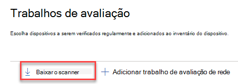
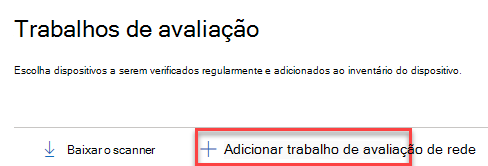
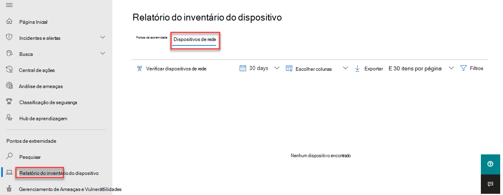

# Gerenciamento de vulnerabilidade e descoberta de dispositivo de rede

[!INCLUDE [Microsoft 365 Defender rebranding](../../includes/microsoft-defender.md)]

**Aplica-se a:**

- [Microsoft Defender para Ponto de Extremidade](https://go.microsoft.com/fwlink/?linkid=2154037)
- [Gerenciamento de ameaças e vulnerabilidades](next-gen-threat-and-vuln-mgt.md)
- [Microsoft 365 Defender](https://go.microsoft.com/fwlink/?linkid=2118804)

> [!IMPORTANT]
> **A verificação e o gerenciamento de dispositivos de rede estão atualmente em visualização pública** 
> Esta versão de visualização é fornecida sem um contrato de nível de serviço e não é recomendada para cargas de trabalho de produção. Determinados recursos podem não ser suportados ou podem ter recursos restritos.
> Para obter mais informações, consulte Recursos de visualização do [Microsoft Defender for Endpoint](preview.md).

>Deseja experimentar o Microsoft Defender para Ponto de Extremidade? [Inscreva-se para uma avaliação gratuita.](https://www.microsoft.com/microsoft-365/windows/microsoft-defender-atp?ocid=docs-wdatp-portaloverview-abovefoldlink)

Os recursos de descoberta de rede estão disponíveis na **seção** Inventário de dispositivos do Centro de Segurança do Microsoft 365 e consoles do Centro de Segurança do Microsoft Defender.  

Um dispositivo do Microsoft Defender for Endpoint designado será usado em cada segmento de rede para executar verificações autenticadas periódicas de dispositivos de rede pré-configurados. Depois de descoberto, os recursos de gerenciamento de ameaças e vulnerabilidades do Defender for Endpoint fornecem fluxos de trabalho integrados para proteger opções descobertas, roteadores, controladores WLAN, firewalls e gateways VPN.  

Depois que os dispositivos de rede são descobertos e classificados, os administradores de segurança poderão receber as recomendações de segurança mais recentes e revisar as vulnerabilidades descobertas recentemente em dispositivos de rede implantados em suas organizações.

## Abordagem

Os dispositivos de rede não são gerenciados como pontos de extremidade padrão, pois o Defender para Ponto de Extremidade não tem um sensor integrado nos dispositivos de rede. Esses tipos de dispositivos exigem uma abordagem sem agente em que uma verificação remota obterá as informações necessárias dos dispositivos. Dependendo da topologia de rede e das características, um único dispositivo ou alguns dispositivos conectados ao Microsoft Defender para Ponto de Extremidade executará verificações autenticadas de dispositivos de rede usando SNMP (somente leitura).

Haverá dois tipos de dispositivos para ter em mente:

- **Dispositivo de** avaliação : um dispositivo que já está conectado que você usará para examinar os dispositivos de rede.
- **Dispositivos de** rede : os dispositivos de rede que você planeja examinar e integrar.

### Gerenciamento de vulnerabilidades para dispositivos de rede 

Depois que os dispositivos de rede são descobertos e classificados, os administradores de segurança poderão receber as recomendações de segurança mais recentes e revisar as vulnerabilidades descobertas recentemente em dispositivos de rede implantados em suas organizações.  

## Sistemas operacionais com suporte

No momento, há suporte para os seguintes sistemas operacionais:

- Cisco IOS, IOS-XE, NX-OS
- Juniper JUNOS
- HPE ArubaOS, Procurve Switch Software
- Pan-OS de Redes de Palo Alto

Mais fornecedores de rede e sistema operacional serão adicionados ao longo do tempo, com base nos dados coletados do uso do cliente. Portanto, você é incentivado a configurar todos os dispositivos de rede, mesmo que eles não sejam especificados nesta lista.

## Como iniciar

Sua primeira etapa é selecionar um dispositivo que executará as verificações de rede autenticadas.

1. Decida um dispositivo (cliente ou servidor) do Defender for Endpoint que tenha uma conexão de rede com a porta de gerenciamento dos dispositivos de rede que você planeja fazer a verificação. 

2. O tráfego SNMP entre o dispositivo de avaliação do Defender para o Ponto de Extremidade e os dispositivos de rede direcionados deve ser permitido (por exemplo, pelo Firewall).

3. Decida quais dispositivos de rede serão avaliados em busca de vulnerabilidades (por exemplo: uma opção Cisco ou um firewall de Redes de Palo Alto).  

4. Certifique-se de que somente leitura SNMP está habilitado em todos os dispositivos de rede configurados para permitir que o dispositivo de avaliação do Defender for Endpoint consulte os dispositivos de rede configurados. 'Gravação SNMP' não é necessária para a funcionalidade adequada deste recurso.

5. Obtenha os endereços IP dos dispositivos de rede a serem verificados (ou as sub-redes onde esses dispositivos são implantados).

6. Obtenha as credenciais SNMP dos dispositivos de rede (por exemplo: Cadeia de caracteres da comunidade, noAuthNoPriv, authNoPriv, authPriv). Você será obrigado a fornecer as credenciais ao configurar um novo trabalho de avaliação.  

7. Configuração do cliente proxy: nenhuma configuração extra é necessária além dos requisitos de proxy do dispositivo Defender para Ponto de Extremidade.

8. Para permitir que o scanner de rede seja autenticado e funcione corretamente, é essencial adicionar os seguintes domínios/URLs:

    - login.windows.net  
    - *.securitycenter.windows.com
    - login.microsoftonline.com
    - *.blob.core.windows.net/networkscannerstable/ *

    Observação: nem todas as URLs são especificadas na lista documentada do Defender for Endpoint da coleção de dados permitida.

## Permissões

Para configurar trabalhos de avaliação, a seguinte opção de permissão de usuário é necessária: **Gerenciar configurações de segurança no Centro de Segurança**. Você pode encontrar a permissão indo para **Configurações**  >  **Funções**. Para obter mais informações, [consulte Create and manage roles for role-based access control](user-roles.md)

## Instalar o scanner de rede

1. Vá para **Configurações de Segurança do Microsoft 365** Trabalhos de Avaliação de Pontos de Extremidade  >    >    >   (em 'Avaliações de rede').
    1. Na Central de Segurança do Microsoft Defender, acesse Configurações > Trabalhos de Avaliação.

2. Baixe o scanner de rede e instale-o no dispositivo de avaliação do Defender para Ponto de Extremidade designado.

## Instalação do scanner de rede & registro

O processo de entrada pode ser concluído no próprio dispositivo de avaliação designado ou em qualquer outro dispositivo (por exemplo, seu dispositivo cliente pessoal).

Para concluir o processo de registro do scanner de rede:

1. Copie e siga a URL que aparece na linha de comando e use o código de instalação fornecido para concluir o processo de registro.
    - Observação: talvez seja necessário alterar as configurações do Prompt de Comando para poder copiar a URL.

2. Insira o código e entre usando uma conta da Microsoft que tenha a permissão Defender para Ponto de Extremidade chamada "Gerenciar configurações de segurança no Centro de Segurança".

3. Quando terminar, você deverá ver uma mensagem confirmando que você se inscreveu.

## Configurar um novo trabalho de avaliação  

Na página Trabalhos de Avaliação em **Configurações,** selecione **Adicionar trabalho de avaliação de rede.** Siga o processo de configuração para escolher dispositivos de rede a serem verificados regularmente e adicionados ao inventário do dispositivo.

Para impedir a duplicação de dispositivos no inventário de dispositivos de rede, certifique-se de que cada endereço IP está configurado apenas uma vez em vários dispositivos de avaliação.

Adicionando etapas de trabalho de avaliação de rede:

1. Escolha um nome "Trabalho de Avaliação" e o "Dispositivo de Avaliação" no qual o scanner de rede foi instalado. Este dispositivo executará as verificações autenticadas periódicas. 
2. Adicione endereços IP de dispositivos de rede de destino a serem verificados (ou as sub-redes onde esses dispositivos são implantados). 
3. Adicione credenciais SNMP necessárias dos dispositivos de rede de destino. 
4. Salve o trabalho de avaliação de rede recém-configurado para iniciar a verificação periódica da rede. 

### Examinar e adicionar dispositivos de rede

Durante o processo de configuração, você pode executar uma verificação de teste de uma única vez para verificar se:

- Há conectividade entre o dispositivo de avaliação do Defender for Endpoint e os dispositivos de rede de destino configurados.
- As credenciais SNMP configuradas estão corretas.

Cada dispositivo de avaliação pode suportar até 1.500 endereços IP bem-sucedidos. Por exemplo, se você examinar 10 sub-redes diferentes em que apenas 100 endereços IP retornam resultados bem-sucedidos, você poderá verificar 1.400 endereços IP adicionais de outras sub-redes no mesmo dispositivo de avaliação.  

Se houver vários intervalos de endereços IP/sub-redes a verificar, os resultados da verificação de teste levarão vários minutos para aparecer. Uma verificação de teste estará disponível para até 1.024 endereços.

Depois que os resultados aparecerem, você poderá escolher quais dispositivos serão incluídos na verificação periódica. Se você ignorar a exibição dos resultados da verificação, todos os endereços IP configurados serão adicionados ao trabalho de avaliação de rede (independentemente da resposta do dispositivo). Os resultados da verificação também podem ser exportados.

## Inventário de dispositivos

Os dispositivos recém-descobertos serão mostrados na nova guia **Dispositivos** de rede na página **Inventário de** dispositivos. Pode levar até duas horas após adicionar um trabalho de avaliação até que os dispositivos sejam atualizados.

## Solução de problemas

### Falha na instalação do scanner de rede

Verifique se as URLs necessárias são adicionadas aos domínios permitidos em suas configurações de firewall. Além disso, certifique-se de que as configurações de proxy estão configuradas conforme descrito em [Configure device proxy and Internet connectivity settings](configure-proxy-internet.md)

### A Microsoft.com/devicelogin da Web não foi a aparecer

Verifique se as URLs necessárias são adicionadas aos domínios permitidos no firewall. Além disso, certifique-se de que as configurações de proxy estão configuradas conforme descrito em [Configure device proxy and Internet connectivity settings](configure-proxy-internet.md).

### Os dispositivos de rede não são mostrados no inventário de dispositivos após várias horas

Os resultados da verificação devem ser atualizados algumas horas após a verificação inicial que ocorreu após a conclusão da configuração do trabalho de avaliação.

Se os dispositivos ainda não são mostrados, verifique se o serviço 'MdatpNetworkScanService' está sendo executado em seus dispositivos de avaliação, nos quais você instalou o scanner de rede, e execute uma "Verificação de execução" na configuração de trabalho de avaliação relevante.  

Se você ainda não receber resultados após 5 minutos, reinicie o serviço.  

### O tempo visto pela última vez por dispositivos é maior do que 24 horas

Valide se o scanner está sendo executado corretamente. Em seguida, vá para a definição de verificação e selecione "Executar teste". Verifique quais mensagens de erro estão retornando dos endereços IP relevantes.

### Permissão de usuário de gerenciamento de vulnerabilidades e ameaças necessárias

O registro terminou com um erro: "Parece que você não tem permissões suficientes para adicionar um novo agente. A permissão necessária é "Gerenciar configurações de segurança no Centro de Segurança".

Pressione qualquer tecla para sair.

Peça ao administrador do sistema para atribuir as permissões necessárias. Como alternativa, peça a outro membro relevante para ajudá-lo com o processo de login fornecendo a eles o código de login e o link.

### Falha no processo de registro usando o link fornecido na linha de comando no processo de registro

Experimente um navegador diferente ou copie o link de entrada e o código para um dispositivo diferente.

### Texto muito pequeno ou não pode copiar texto da linha de comando

Altere as configurações da linha de comando em seu dispositivo para permitir copiar e alterar o tamanho do texto.

## Artigos relacionados

- [Inventário de dispositivos](machines-view-overview.md)
- [Configurar recursos avançados](advanced-features.md)
