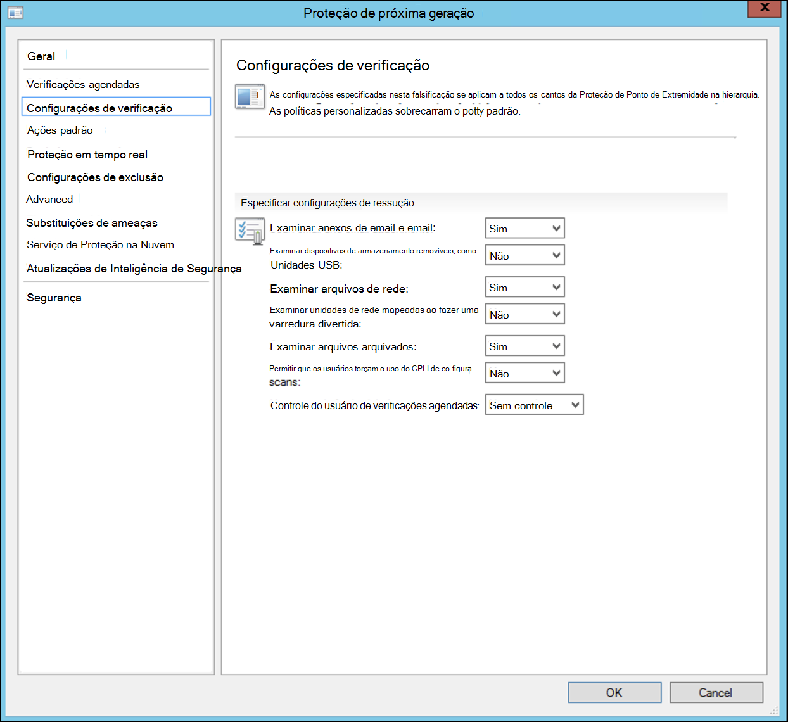
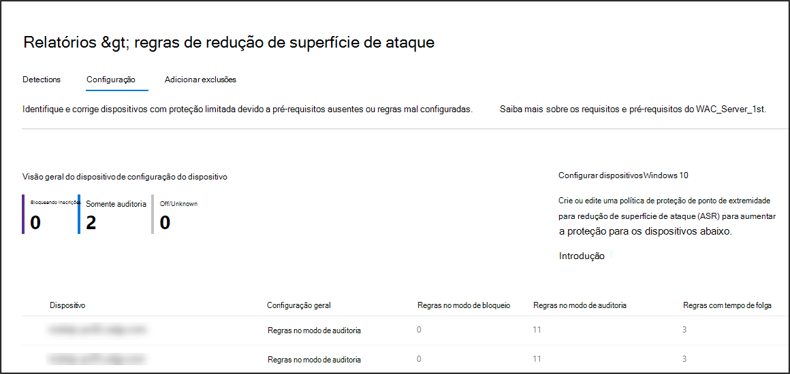

# Integração usando o Microsoft Endpoint Configuration Manager

[!INCLUDE [Microsoft 365 Defender rebranding](../../includes/microsoft-defender.md)]

**Aplica-se a:**
- [Microsoft Defender para Ponto de Extremidade](https://go.microsoft.com/fwlink/p/?linkid=2154037)
- [Microsoft 365 Defender](https://go.microsoft.com/fwlink/?linkid=2118804)

> Deseja experimentar o Microsoft Defender para Ponto de Extremidade? [Inscreva-se para uma avaliação gratuita.](https://www.microsoft.com/microsoft-365/windows/microsoft-defender-atp?ocid=docs-wdatp-exposedapis-abovefoldlink)

Este artigo faz parte do guia implantação e age como um exemplo de método de integração. 

No tópico [Planejamento,](deployment-strategy.md) havia vários métodos fornecidos para os dispositivos de integração ao serviço. Este tópico aborda a arquitetura de co-gerenciamento. 

 *Diagrama de arquiteturas de ambiente*

Embora o Defender para Ponto de Extremidade suporte à integração de vários pontos de extremidade e ferramentas, este artigo não os abrange. Para obter informações sobre a integração geral usando outras ferramentas e métodos de implantação com suporte, consulte [Onboarding overview](onboarding.md).

Este tópico orienta os usuários em:
- Etapa 1: Integrando dispositivos Windows ao serviço 
- Etapa 2: Configurando o Defender para recursos do Ponto de Extremidade

Essas diretrizes de integração orientarão você pelas seguintes etapas básicas que você precisa seguir ao usar o Microsoft Endpoint Configuration Manager:
- **Criando uma coleção no Microsoft Endpoint Configuration Manager**
- **Configurando o Microsoft Defender para recursos de ponto de extremidade usando o Microsoft Endpoint Configuration Manager**

>[!NOTE]
>Somente dispositivos Windows são abordados nesta implantação de exemplo. 

## Etapa 1: Integração de dispositivos Windows usando o Microsoft Endpoint Configuration Manager

### Criação de coleção
Para a integração de dispositivos Windows 10 com o Microsoft Endpoint Configuration Manager, a implantação pode direcionar uma coleção existente ou uma nova coleção pode ser criada para testes. 

A integração usando ferramentas como política de grupo ou método manual não instala nenhum agente no sistema. 

No console do Microsoft Endpoint Configuration Manager, o processo de integração será configurado como parte das configurações de conformidade no console.

Qualquer sistema que receber essa configuração necessária manterá essa configuração enquanto o cliente do Configuration Manager continuar a receber essa política do ponto de gerenciamento. 

Siga as etapas abaixo para os pontos de extremidade de integração usando o Microsoft Endpoint Configuration Manager.

1. No console do Microsoft Endpoint Configuration Manager, navegue até **Assets and Compliance Overview Device \> \> Collections**.            

    

2. Clique com **o botão direito do mouse em Conjunto de Dispositivos** e selecione Criar Coleção de **Dispositivos**.

    

3. Forneça uma **coleção Name** and **Limiting**, em seguida, selecione **Next**.

    

4. Selecione **Adicionar Regra** e escolha Regra de **Consulta**.

    

5.  Clique **em Próximo** no Assistente de Associação **Direta** e clique em **Editar instrução De consulta**.

     

6. Selecione **Critérios** e escolha o ícone de estrela.

     

7. Mantenha o tipo de critério como valor simples **,** escolha  onde como Sistema Operacional **-** número de com build , operador maior ou igual a e **valor 14393** e clique em **OK**.

    

8. Selecione **Próximo** e **Fechar**.

    

9. Selecione **Avançar**.

    

Depois de concluir essa tarefa, agora você tem uma coleção de dispositivos com todos os pontos de extremidade do Windows 10 no ambiente. 

## Etapa 2: Configurar o Microsoft Defender para recursos do Ponto de Extremidade 
Esta seção orienta você na configuração dos seguintes recursos usando o Microsoft Endpoint Configuration Manager em dispositivos Windows:

- [**Detecção e resposta do terminal.**](#endpoint-detection-and-response)
- [**Proteção de última geração**](#next-generation-protection)
- [**Redução da superfície do ataque.**](#attack-surface-reduction)

### Detecção e resposta do terminal.
#### Windows 10
De dentro do Centro de Segurança do Microsoft Defender, é possível baixar a política '.onboarding' que pode ser usada para criar a política no System Center Configuration Manager e implantar essa política em dispositivos Windows 10.

1. Em um Portal do Centro de Segurança do Microsoft Defender, selecione [Configurações e, em seguida, Integrando](https://securitycenter.windows.com/preferences2/onboarding).

2. Em Método deployment, selecione a versão suportada do **Microsoft Endpoint Configuration Manager**.

    

3. Selecione **Baixar pacote**.

    

4. Salve o pacote em um local acessível.
5. No Microsoft Endpoint Configuration Manager, navegue até: **Assets and Compliance > Overview > Endpoint Protection > Microsoft Defender ATP Policies**.

6. Clique com o botão direito do **mouse em Políticas do Microsoft Defender ATP** e selecione Criar Política do Microsoft Defender **ATP**.

    

7. Insira o nome e a descrição, verifique **se a integração** está selecionada e selecione **Next**.

    

8. Clique em **Procurar**.

9. Navegue até o local do arquivo baixado da etapa 4 acima.

10. Clique em **Avançar**.
11. Configure o Agente com as amostras apropriadas (**Nenhum** ou **Todos os tipos de arquivo**).

    

12. Selecione a telemetria apropriada (**Normal** ou **Acelerada**) e clique em **Próximo**.

    

14. Verifique a configuração e clique em **Próximo**.

     

15. Clique **em Fechar** quando o Assistente for concluído.

16.  No console do Microsoft Endpoint Configuration Manager, clique com o botão direito do mouse na política Defender para Ponto de Extremidade que você acabou de criar e selecione **Implantar**.

     

17. No painel direito, selecione a coleção criada anteriormente e clique em **OK**.

    

#### Versões anteriores do Windows Client (Windows 7 e Windows 8.1)
Siga as etapas a seguir para identificar a ID do Espaço de Trabalho do Defender para Ponto de Extremidade e a Chave do Espaço de Trabalho, que serão necessárias para a integração de versões anteriores do Windows.

1. Em um Portal do Centro de Segurança do Microsoft Defender, selecione **Configurações > Integração**.

2. Em sistema operacional, **escolha Windows 7 SP1 e 8.1**.

3. Copie a **ID do Espaço de** Trabalho e **a Chave do Espaço de Trabalho** e salve-as. Eles serão usados posteriormente no processo.

    

4. Instale o Microsoft Monitoring Agent (MMA).  
    Atualmente, o MMA (a partir de janeiro de 2019) tem suporte nos seguintes Sistemas Operacionais Windows:

    -   SKUs de servidor: Windows Server 2008 SP1 ou Newer

    -   SKUs cliente: Windows 7 SP1 e posterior

    O agente MMA precisará ser instalado em dispositivos Windows. Para instalar o agente, alguns sistemas precisarão baixar o Update para experiência do cliente e [a telemetria](https://support.microsoft.com/help/3080149/update-for-customer-experience-and-diagnostic-telemetry) de diagnóstico para coletar os dados com o MMA. Essas versões do sistema incluem, mas podem não se limitar a:

    -   Windows 8.1

    -   Windows 7

    -   Windows Server 2016

    -   Windows Server 2012 R2

    -   Windows Server 2008 R2

    Especificamente, para o Windows 7 SP1, os seguintes patches devem ser instalados:

    -   Instalar [KB4074598](https://support.microsoft.com/help/4074598/windows-7-update-kb4074598)

    -   Instale o [.NET Framework 4.5](https://www.microsoft.com/download/details.aspx?id=30653) (ou posterior) **ou** 
         [KB3154518](https://support.microsoft.com/help/3154518/support-for-tls-system-default-versions-included-in-the-net-framework).
        Não instale ambos no mesmo sistema.

5. Se você estiver usando um proxy para se conectar à Internet, consulte a seção Configurar configurações de proxy.

Depois de concluído, você deverá ver pontos de extremidade integrados no portal dentro de uma hora.

### Proteção de próxima geração 
O Windows Defender Antivírus é uma solução antimalware interna que oferece proteção de próxima geração para computadores desktop, computadores portáteis e servidores.

1. No console do Microsoft Endpoint Configuration Manager, navegue até **Assets and Compliance Overview \> \> Endpoint Protection \> Antimalware Polices** e escolha **Criar Política antimalware**.

    

2. Selecione **Verificações** agendadas, **Configurações** de **verificação,** ações **padrão,** proteção em tempo **real,** configurações de exclusão, **avançadas,** substituições de **ameaças,** atualizações de inteligência de segurança e serviço de proteção na nuvem e escolha **OK**. 

    

    Em determinados setores ou alguns clientes corporativos selecionados podem ter necessidades específicas sobre como o Antivírus é configurado.

  
    [Verificação rápida versus verificação completa e verificação personalizada](https://docs.microsoft.com/windows/security/threat-protection/microsoft-defender-antivirus/scheduled-catch-up-scans-microsoft-defender-antivirus#quick-scan-versus-full-scan-and-custom-scan)

    Para obter mais detalhes, consulte [Estrutura de configuração do Windows Security](https://docs.microsoft.com/windows/security/threat-protection/windows-security-configuration-framework/windows-security-configuration-framework)
  
    

    

    

    

    

    

    

    

3. Clique com o botão direito do mouse na política antimalware recém-criada e selecione **Implantar**.

    

4. Direcionar a nova política antimalware para sua coleção Windows 10 e clique em **OK**.

     

Depois de concluir essa tarefa, você agora configurou com êxito o Windows Defender Antivírus.

### Redução da superfície do ataque.
O pilar de redução de superfície de ataque do Defender para Ponto de Extremidade inclui o conjunto de recursos que está disponível em Exploit Guard. Regras de redução de superfície de ataque (ASR), Acesso Controlado a Pastas, Proteção de Rede e Proteção contra Exploração. 

Todos esses recursos fornecem um modo de auditoria e um modo de bloqueio. No modo de auditoria, não há impacto no usuário final. Tudo o que ele faz é coletar telemetria adicional e torná-la disponível no Centro de Segurança do Microsoft Defender. O objetivo com uma implantação é mover passo a passo os controles de segurança para o modo de bloqueio.

Para definir regras ASR no modo de auditoria:

1. No console do Microsoft Endpoint Configuration Manager, navegue até **Assets and Compliance Overview \> \> Endpoint Protection Windows Defender Exploit \> Guard** e escolha **Criar Política do Exploit Guard**.

   

2.  Selecione **Redução de Superfície de Ataque**.
   

3. De definir regras como **Auditoria e** clique em **Próximo**.

    

4. Confirme a nova política do Exploit Guard clicando em **Next**.

    

    
5. Depois que a política for criada, clique em **Fechar**.

    

    
   

6.  Clique com o botão direito do mouse na política recém-criada e escolha **Implantar**.
    
    

7. Destino da política para a coleção recém-criada do Windows 10 e clique em **OK**.

    

Depois de concluir essa tarefa, agora você configurou com êxito as regras ASR no modo de auditoria.  
  
A seguir estão etapas adicionais para verificar se as regras ASR são aplicadas corretamente aos pontos de extremidade. (Isso pode levar alguns minutos)

1. Em um navegador da Web, navegue até <https://securitycenter.windows.com> .

2.  Selecione **Gerenciamento de configuração** no menu esquerdo.

3. Clique **em Ir para atacar o gerenciamento de superfície** no painel gerenciamento de superfície de ataque. 
    
    

4. Clique **na guia** Configuração em Relatórios de regras de redução de superfície de ataque. Ele mostra a visão geral da configuração de regras ASR e o status das regras ASR em cada dispositivo.

    

5. Clique em cada dispositivo mostra detalhes de configuração das regras ASR.

    

Confira [Otimizar a implantação e as detecções de regras ASR](https://docs.microsoft.com/microsoft-365/security/defender-endpoint/configure-machines-asr)   para obter mais detalhes.  

#### Definir regras de Proteção de Rede no modo de auditoria:
1. No console do Microsoft Endpoint Configuration Manager, navegue até **Assets and Compliance Overview \> \> Endpoint Protection Windows Defender Exploit \> Guard** e escolha **Criar Política do Exploit Guard**.

    

2. Selecione **Proteção de rede**.

3. De definir a configuração como **Auditoria** e clique em **Próximo**. 

    

4. Confirme a nova Política do Exploit Guard clicando em **Next**.
    
    

5. Depois que a política for criada, clique em **Fechar**.

    

6. Clique com o botão direito do mouse na política recém-criada e escolha **Implantar**.

    

7. Selecione a política para a coleção recém-criada do Windows 10 e escolha **OK**.

    

Depois de concluir essa tarefa, você agora configurou com êxito a Proteção de Rede no modo de auditoria.

#### Para definir regras de Acesso Controlado a Pastas no modo de auditoria:

1. No console do Microsoft Endpoint Configuration Manager, navegue até **Assets and Compliance Overview \> \> Endpoint Protection Windows Defender Exploit \> Guard** e escolha **Criar Política do Exploit Guard**.

    

2. Selecione **Acesso controlado a pastas**.
    
3. De definir a configuração **como Auditoria e** clique em **Próximo.**

        
    
4. Confirme a nova Política do Exploit Guard clicando em **Next**.

    

5. Depois que a política for criada, clique em **Fechar**.

    

6. Clique com o botão direito do mouse na política recém-criada e escolha **Implantar**.

    

7.  Destino da política para a coleção recém-criada do Windows 10 e clique em **OK**.

    

Agora você configurou com êxito o acesso controlado a pastas no modo de auditoria.

## Tópicos relacionados
- [Integração usando o Microsoft Endpoint Manager](onboarding-endpoint-manager.md)
