# Integração usando o Microsoft Endpoint ManagerOnboarding using Microsoft Endpoint Manager

[!INCLUDE [Microsoft 365 Defender rebranding](../../includes/microsoft-defender.md)]

**Aplica-se a:****Applies to:**
- [Microsoft Defender para Ponto de ExtremidadeMicrosoft Defender for Endpoint](https://go.microsoft.com/fwlink/p/?linkid=2154037)
- [Microsoft 365 DefenderMicrosoft 365 Defender](https://go.microsoft.com/fwlink/?linkid=2118804)

> Deseja experimentar o Microsoft Defender para Ponto de Extremidade?Want to experience Microsoft Defender for Endpoint? [Inscreva-se para uma avaliação gratuita.Sign up for a free trial.](https://www.microsoft.com/microsoft-365/windows/microsoft-defender-atp?ocid=docs-wdatp-exposedapis-abovefoldlink)

Este artigo faz parte do guia implantação e age como um exemplo de método de integração.This article is part of the Deployment guide and acts as an example onboarding method. 

No tópico [Planejamento,](deployment-strategy.md) havia vários métodos fornecidos para os dispositivos de integração ao serviço.In the [Planning](deployment-strategy.md) topic, there were several methods provided to onboard devices to the service. Este tópico aborda a arquitetura nativa da nuvem.This topic covers the cloud-native architecture. 

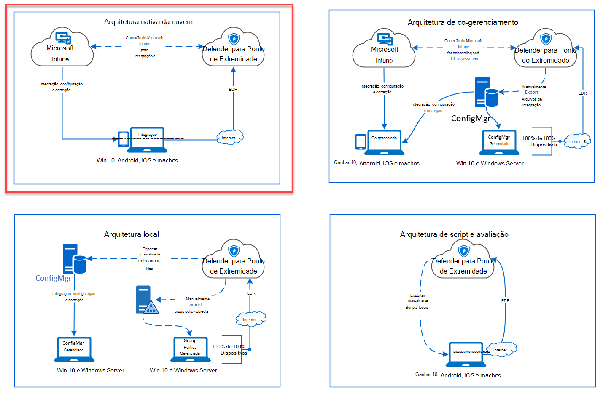
 *Diagrama de arquiteturas de ambiente*
*Diagram of environment architectures*

Embora o Defender para Ponto de Extremidade suporte à integração de vários pontos de extremidade e ferramentas, este artigo não os abrange.While Defender for Endpoint supports onboarding of various endpoints and tools, this article does not cover them. Para obter informações sobre a integração geral usando outras ferramentas e métodos de implantação com suporte, consulte [Onboarding overview](onboarding.md).For information on general onboarding using other supported deployment tools and methods, see [Onboarding overview](onboarding.md).

[O Microsoft Endpoint Manager](https://docs.microsoft.com/mem/endpoint-manager-overview) é uma plataforma de solução que unifica vários serviços.[Microsoft Endpoint Manager](https://docs.microsoft.com/mem/endpoint-manager-overview) is a solution platform that unifies several services. Ele inclui o [Microsoft Intune para](https://docs.microsoft.com/mem/intune/fundamentals/what-is-intune) gerenciamento de dispositivos baseado em nuvem.It includes [Microsoft Intune](https://docs.microsoft.com/mem/intune/fundamentals/what-is-intune) for cloud-based device management.

Este tópico orienta os usuários em:This topic guides users in:
- Etapa 1: Integrando dispositivos ao serviço criando um grupo no Microsoft Endpoint Manager (MEM) para atribuir configurações emStep 1: Onboarding devices to the service by creating a group in Microsoft Endpoint Manager (MEM) to assign configurations on
- Etapa 2: Configurando o Defender para recursos de ponto de extremidade usando o Microsoft Endpoint ManagerStep 2: Configuring Defender for Endpoint capabilities using Microsoft Endpoint Manager

Essas diretrizes de integração orientarão você pelas seguintes etapas básicas que você precisa seguir ao usar o Microsoft Endpoint Manager:This onboarding guidance will walk you through the following basic steps that you need to take when using Microsoft Endpoint Manager:

-   [Identificar dispositivos de destino ou usuáriosIdentifying target devices or users](#identify-target-devices-or-users)

    -   Criando um grupo do Azure Active Directory (Usuário ou Dispositivo)Creating an Azure Active Directory group (User or Device)

-   [Criando um Perfil de ConfiguraçãoCreating a Configuration Profile](#step-2-create-configuration-policies-to-configure-microsoft-defender-for-endpoint-capabilities)

    -   No Microsoft Endpoint Manager, vamos orientá-lo na criação de uma política separada para cada recurso.In Microsoft Endpoint Manager, we'll guide you in creating a separate policy for each capability.

## RecursosResources

Aqui estão os links necessários para o restante do processo:Here are the links you'll need for the rest of the process:

-   [Portal de MEMMEM portal](https://aka.ms/memac)

-   [Central de SegurançaSecurity Center](https://securitycenter.windows.com/)

-   [Linhas de base de segurança do IntuneIntune Security baselines](https://docs.microsoft.com/mem/intune/protect/security-baseline-settings-defender-atp#microsoft-defender)

Para obter mais informações sobre o Microsoft Endpoint Manager, confira estes recursos:For more information about Microsoft Endpoint Manager, check out these resources:
- [Página do Microsoft Endpoint ManagerMicrosoft Endpoint Manager page](https://docs.microsoft.com/mem/)
- [Postagem de blog sobre convergência do Intune e ConfigMgrBlog post on convergence of Intune and ConfigMgr](https://www.microsoft.com/microsoft-365/blog/2019/11/04/use-the-power-of-cloud-intelligence-to-simplify-and-accelerate-it-and-the-move-to-a-modern-workplace/)
- [Vídeo de introdução no MEMIntroduction video on MEM](https://www.microsoft.com/microsoft-365/blog/2019/11/04/use-the-power-of-cloud-intelligence-to-simplify-and-accelerate-it-and-the-move-to-a-modern-workplace)

## Etapa 1: Integrando dispositivos criando um grupo no MEM para atribuir configurações emStep 1: Onboard devices by creating a group in MEM to assign configurations on
### Identificar dispositivos de destino ou usuáriosIdentify target devices or users
Nesta seção, criaremos um grupo de teste para atribuir suas configurações.In this section, we will create a test group to assign your configurations on.

>[!NOTE]
>O Intune usa grupos do Azure Active Directory (Azure AD) para gerenciar dispositivos e usuários.Intune uses Azure Active Directory (Azure AD) groups to manage devices and users. Como administrador do Intune, você pode configurar grupos para atender às suas necessidades organizacionais.As an Intune admin, you can set up groups to suit your organizational needs. 
Para obter mais informações, [consulte Adicionar grupos para organizar usuários e dispositivos](https://docs.microsoft.com/mem/intune/fundamentals/groups-add).For more information, see [Add groups to organize users and devices](https://docs.microsoft.com/mem/intune/fundamentals/groups-add).

### Criar um grupoCreate a group

1.  Abra o portal MEM.Open the MEM portal.

2.  Abra **Grupos > Novo Grupo**.Open **Groups > New Group**.

    > [!div class="mx-imgBorder"]
    > 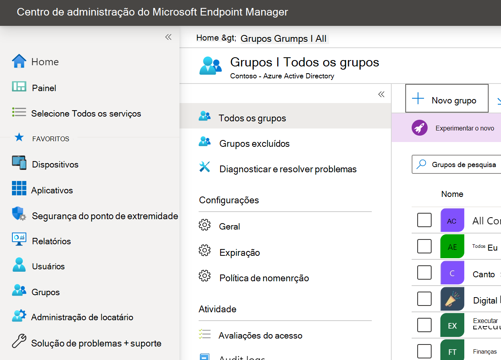

3.  Insira detalhes e crie um novo grupo.Enter details and create a new group.

    > [!div class="mx-imgBorder"]
    > 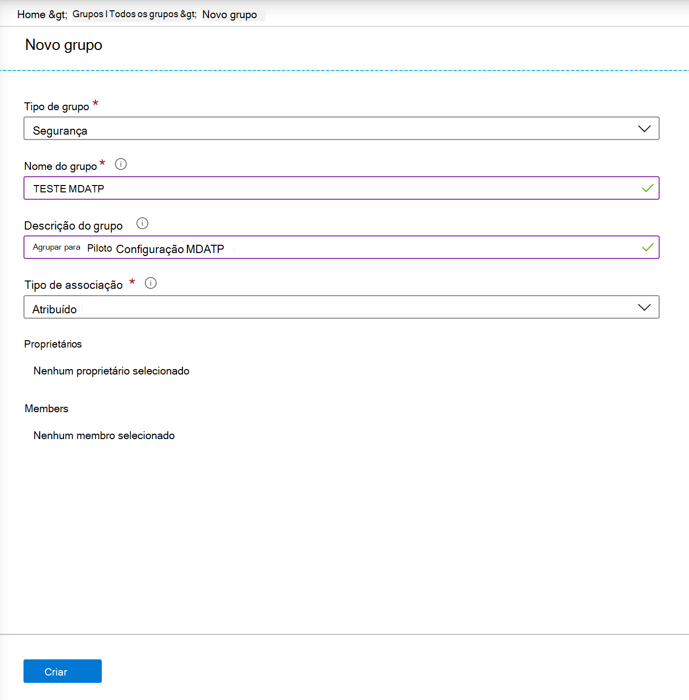

4.  Adicione seu usuário de teste ou dispositivo.Add your test user or device.

5.  No painel **Grupos > Todos os** grupos, abra seu novo grupo.From the **Groups > All groups** pane, open your new group.

6.  Selecione  **Membros > Adicionar membros**.Select  **Members > Add members**.

7.  Encontre seu usuário de teste ou dispositivo e selecione-o.Find your test user or device and select it.

    > [!div class="mx-imgBorder"]
    > 

8.  Seu grupo de teste agora tem um membro para testar.Your testing group now has a member to test.

## Etapa 2: Criar políticas de configuração para configurar o Microsoft Defender para recursos do Ponto de ExtremidadeStep 2: Create configuration policies to configure Microsoft Defender for Endpoint capabilities
Na seção a seguir, você criará várias políticas de configuração.In the following section, you'll create a number of configuration policies.

Em primeiro lugar, uma política de configuração para selecionar quais grupos de usuários ou dispositivos serão integrados ao Defender para Ponto de Extremidade:First is a configuration policy to select which groups of users or devices will be onboarded to Defender for Endpoint:

- [Detecção e resposta do terminal.Endpoint detection and response](#endpoint-detection-and-response) 

Em seguida, você continuará criando vários tipos diferentes de políticas de segurança do ponto de extremidade:Then you will continue by creating several different types of endpoint security policies:

- [Proteção de última geraçãoNext-generation protection](#next-generation-protection)
- [Redução da superfície do ataque.Attack surface reduction](#attack-surface-reduction--attack-surface-reduction-rules)

### Detecção e resposta do terminal.Endpoint detection and response

1.  Abra o portal MEM.Open the MEM portal.

2.  Navegue **até Endpoint security > Endpoint detection and response**.Navigate to **Endpoint security > Endpoint detection and response**. Clique em **Criar Perfil**.Click on **Create Profile**.

    > [!div class="mx-imgBorder"]
    > 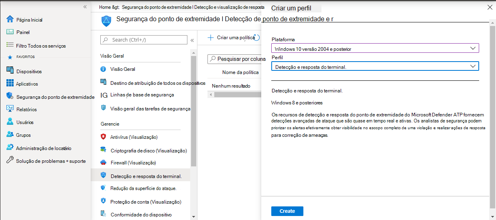

3.  Em **Plataforma, selecione Windows 10 e Posterior, Perfil - Detecção** e resposta do ponto de extremidade > Criar .Under **Platform, select Windows 10 and Later, Profile - Endpoint detection and response > Create**.

4.  Insira um nome e uma descrição e selecione  **Next**.Enter a name and description, then select  **Next**.

    > [!div class="mx-imgBorder"]
    > 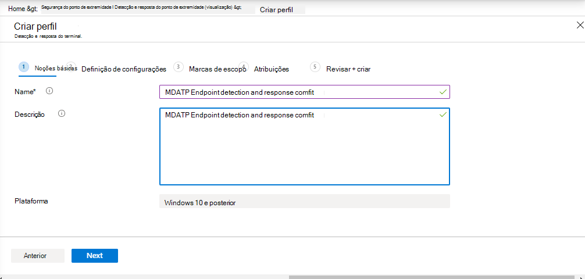

5.  Selecione configurações conforme necessário e selecione  **Próximo**.Select settings as required, then select  **Next**.

    > [!div class="mx-imgBorder"]
    > 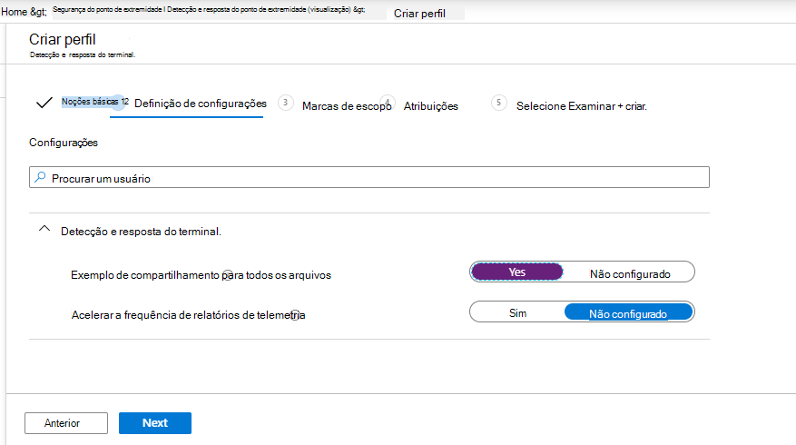

    > [!NOTE]
    > Nesse caso, isso foi preenchido automaticamente, pois o Defender para Ponto de Extremidade já foi integrado ao Intune.In this instance, this has been auto populated as Defender for Endpoint has already been integrated with Intune. Para obter mais informações sobre a integração, consulte [Enable Microsoft Defender for Endpoint in Intune](https://docs.microsoft.com/mem/intune/protect/advanced-threat-protection-configure#to-enable-microsoft-defender-atp).For more information on the integration, see [Enable Microsoft Defender for Endpoint in Intune](https://docs.microsoft.com/mem/intune/protect/advanced-threat-protection-configure#to-enable-microsoft-defender-atp).
    > 
    > A imagem a seguir é um exemplo do que você verá quando o Microsoft Defender for Endpoint não estiver integrado ao Intune:The following image is an example of what you'll see when Microsoft Defender for Endpoint is NOT integrated with Intune:
    >
    > 

6.  Adicione marcas de escopo, se necessário, em seguida, selecione  **Next**.Add scope tags if necessary, then select  **Next**.

    > [!div class="mx-imgBorder"]
    > 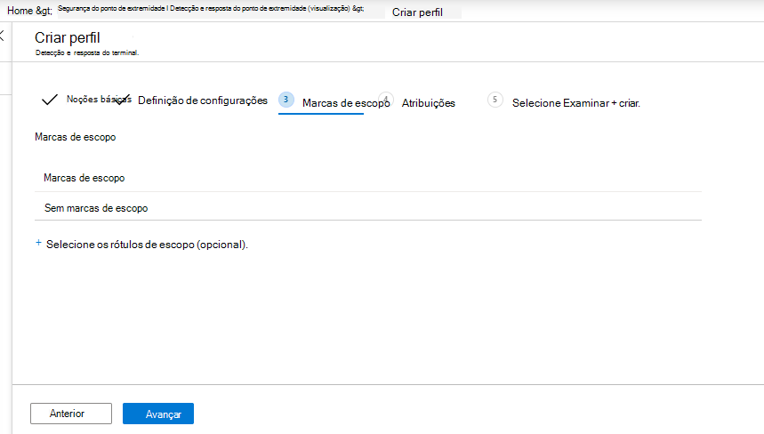

7.  Adicione grupo de teste clicando em **Selecionar grupos para incluir** e escolher seu grupo e selecione  **Próximo**.Add test group by clicking on **Select groups to include** and choose your group, then select  **Next**.

    > [!div class="mx-imgBorder"]
    > 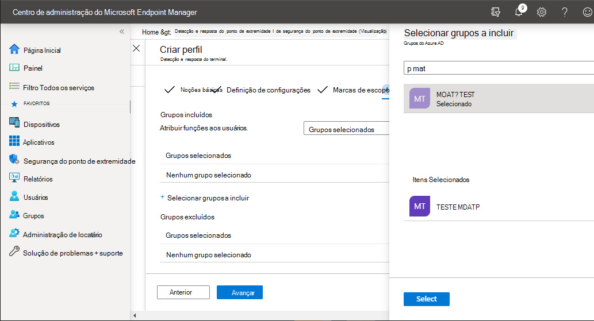

8.  Revise e aceite e selecione  **Criar**.Review and accept, then select  **Create**.

    > [!div class="mx-imgBorder"]
    > 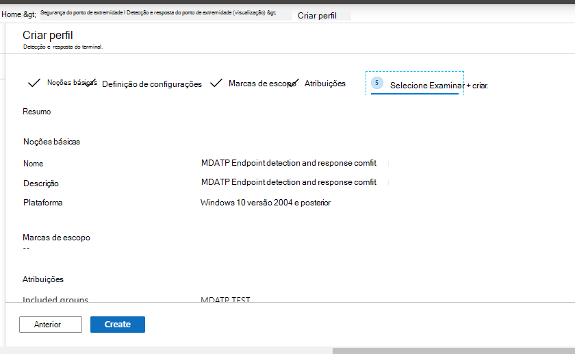

9.  Você pode exibir sua política concluída.You can view your completed policy.

    > [!div class="mx-imgBorder"]
    > 

### Proteção de última geraçãoNext-generation protection

1.  Abra o portal MEM.Open the MEM portal.

2.  Navegue **até Endpoint security > Antivírus > Criar Política**.Navigate to **Endpoint security > Antivirus > Create Policy**.

    > [!div class="mx-imgBorder"]
    > 

3.  Selecione **Plataforma - Windows 10 e Posterior - Windows e Perfil – Microsoft Defender Antivírus > Criar**.Select **Platform - Windows 10 and Later - Windows and Profile – Microsoft Defender Antivirus > Create**.

4.  Insira o nome e a descrição e selecione  **Next**.Enter name and description, then select  **Next**.

    > [!div class="mx-imgBorder"]
    > 

5.  Na página **Configuração configurações:** de definir as configurações necessárias para o Microsoft Defender Antivírus (Proteção na Nuvem, Exclusões, Real-Time Proteção e Correção).In the **Configuration settings page**: Set the configurations you require for Microsoft Defender Antivirus (Cloud Protection, Exclusions, Real-Time Protection, and Remediation).

    > [!div class="mx-imgBorder"]
    > 

6.  Adicione marcas de escopo, se necessário, em seguida, selecione  **Next**.Add scope tags if necessary, then select  **Next**.

    > [!div class="mx-imgBorder"]
    > 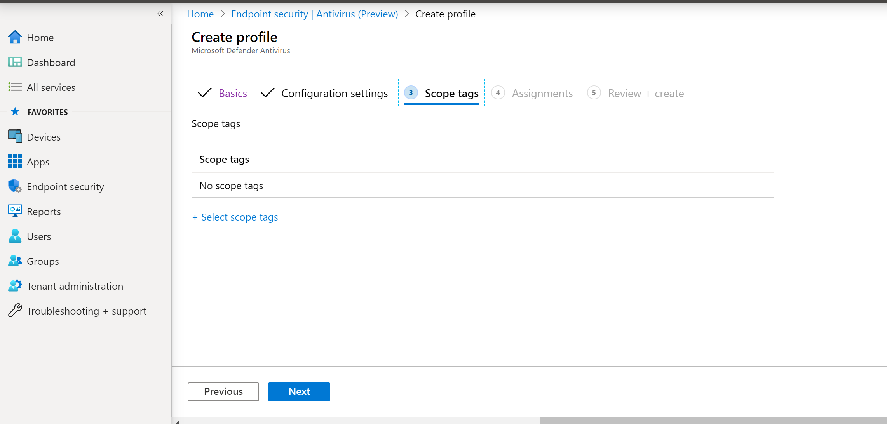

7.  Selecione grupos para incluir, atribua ao grupo de teste e selecione  **Próximo**.Select groups to include, assign to your test group, then select  **Next**.

    > [!div class="mx-imgBorder"]
    > 

8.  Revise e crie e selecione  **Criar**.Review and create, then select  **Create**.

    > [!div class="mx-imgBorder"]
    > 

9.  Você verá a política de configuração criada.You'll see the configuration policy you created.

    > [!div class="mx-imgBorder"]
    > 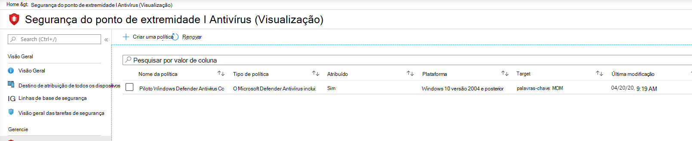

### Redução de Superfície de Ataque – Regras de redução de superfície de ataqueAttack Surface Reduction – Attack surface reduction rules

1.  Abra o portal MEM.Open the MEM portal.

2.  Navegue **até Endpoint security > Redução de superfície de ataque**.Navigate to **Endpoint security > Attack surface reduction**.

3.  Selecione  **Criar Política**.Select  **Create Policy**.

4.  Selecione **Plataforma - Windows 10 e Posterior – Perfil - Regras de redução de superfície de ataque > Criar**.Select **Platform - Windows 10 and Later – Profile - Attack surface reduction rules > Create**.

    > [!div class="mx-imgBorder"]
    > 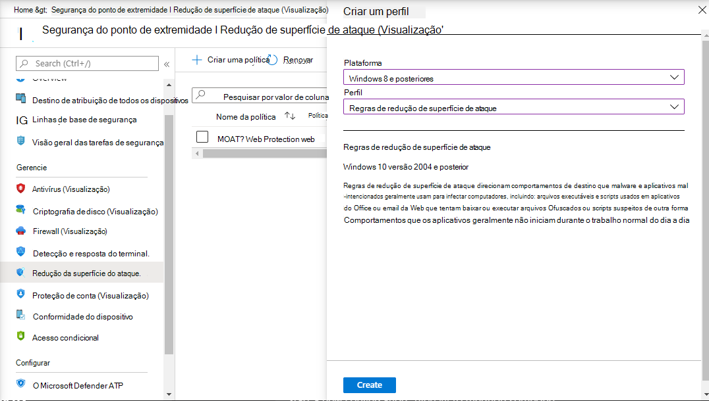

5.  Insira um nome e uma descrição e selecione  **Next**.Enter a name and description, then select  **Next**.

    > [!div class="mx-imgBorder"]
    > 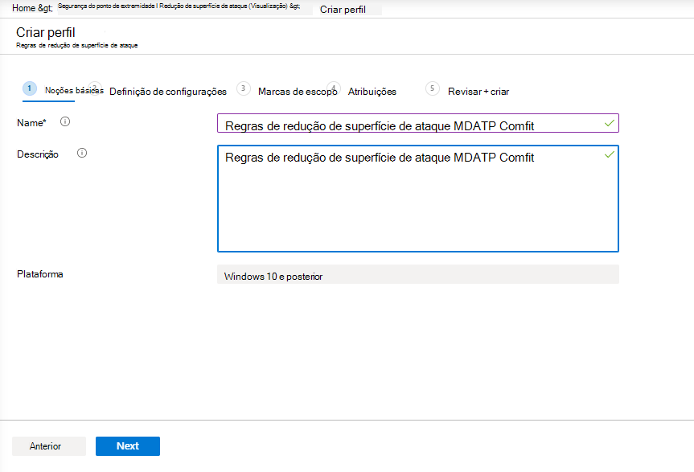

6.  Na página **Configuração de configuração:** de definir as configurações necessárias para regras de redução de superfície de ataque e selecione  **Próximo**.In the **Configuration settings page**: Set the configurations you require for Attack surface reduction rules, then select  **Next**.

    > [!NOTE]
    > Configuraremos todas as regras de redução de superfície de ataque para Auditoria.We will be configuring all of the Attack surface reduction rules to Audit.
    > 
    > Para obter mais informações, consulte [Regras de redução de superfície de ataque](attack-surface-reduction.md).For more information, see [Attack surface reduction rules](attack-surface-reduction.md).

    > [!div class="mx-imgBorder"]
    > 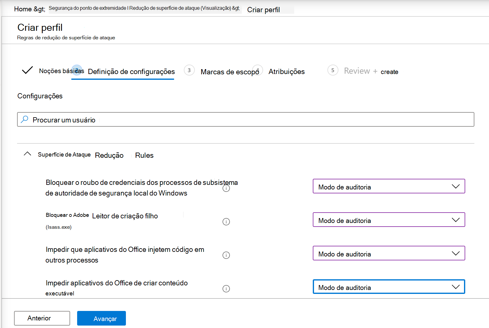

7.  Adicione Marcas de Escopo conforme necessário e selecione  **Next**.Add Scope Tags as required, then select  **Next**.

    > [!div class="mx-imgBorder"]
    > 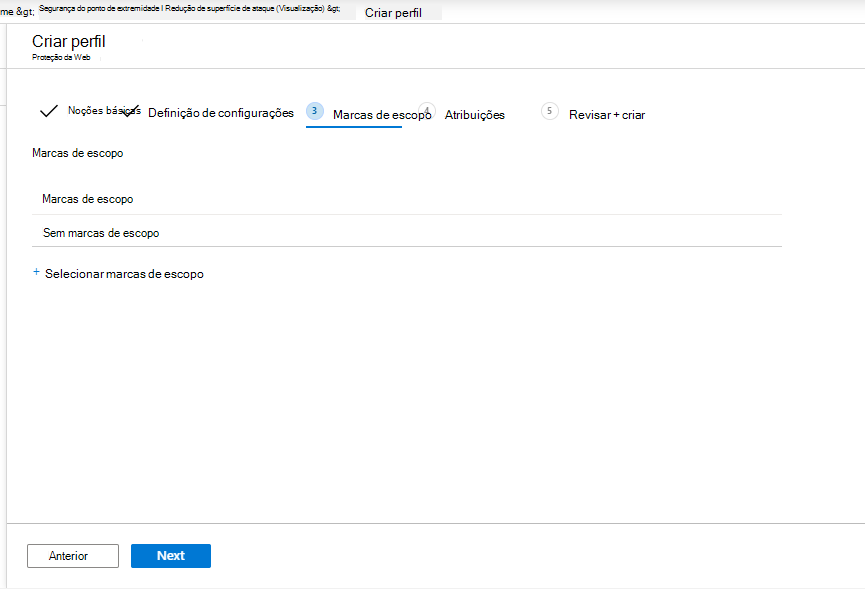

8.  Selecione grupos para incluir e atribuir ao grupo de teste e selecione  **Próximo**.Select groups to include and assign to test group, then select  **Next**.

    > [!div class="mx-imgBorder"]
    > 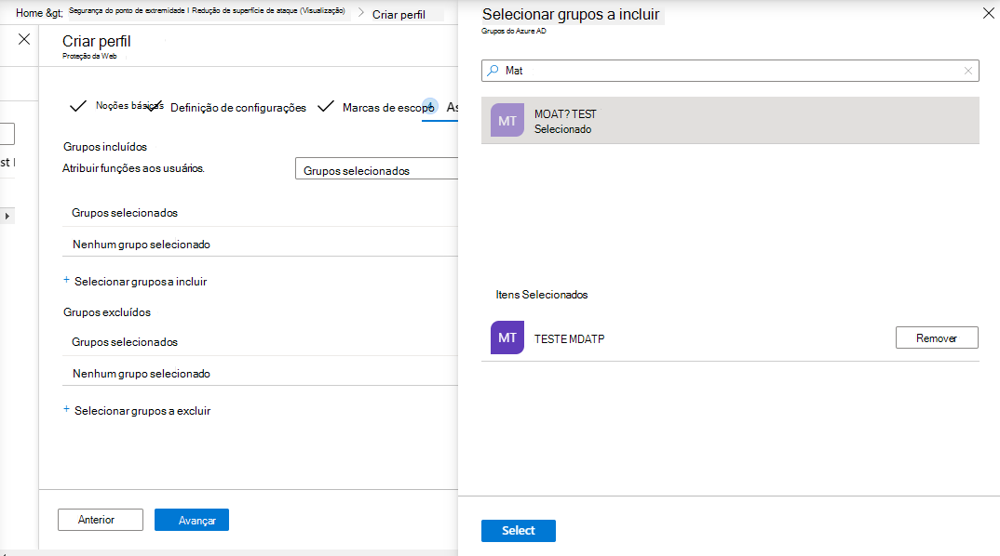

9. Revise os detalhes e selecione  **Criar**.Review the details, then select  **Create**.

    > [!div class="mx-imgBorder"]
    > 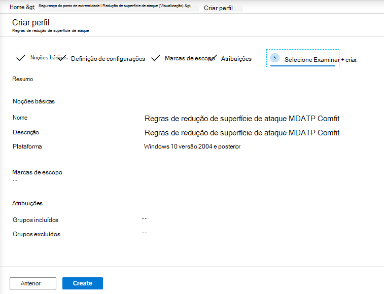

10. Exibir a política.View the policy.

    > [!div class="mx-imgBorder"]
    > 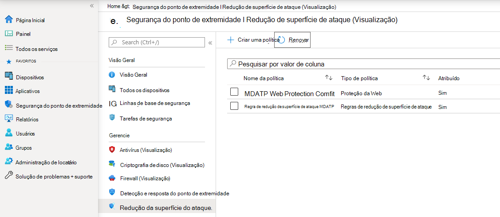

### Redução de superfície de ataque – Proteção da WebAttack Surface Reduction – Web Protection

1.  Abra o portal MEM.Open the MEM portal.

2.  Navegue **até Endpoint security > Redução de superfície de ataque**.Navigate to **Endpoint security > Attack surface reduction**.

3.  Selecione  **Criar Política**.Select  **Create Policy**.

4.  Selecione **Windows 10 e Posterior – Proteção da Web > Criar**.Select **Windows 10 and Later – Web protection > Create**.

    > [!div class="mx-imgBorder"]
    > 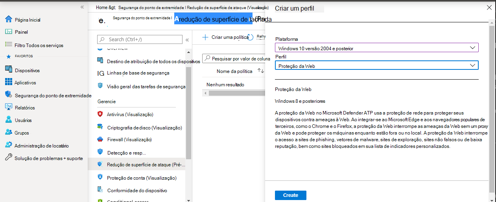

5.  Insira um nome e uma descrição e selecione  **Next**.Enter a name and description, then select  **Next**.

    > [!div class="mx-imgBorder"]
    > 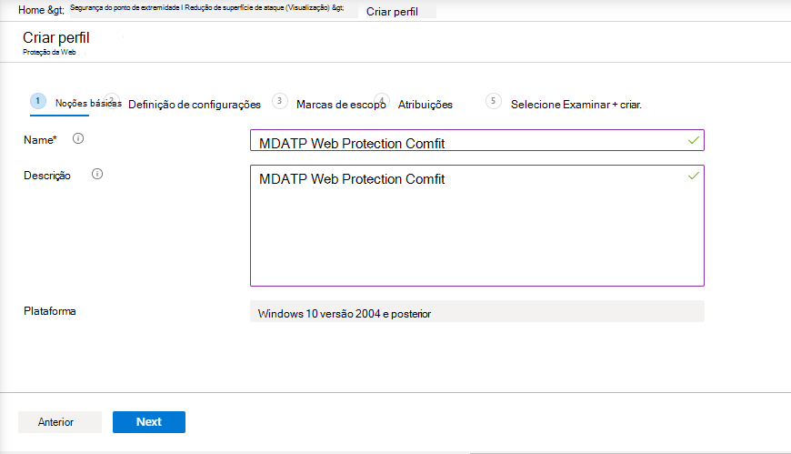

6.  Na página **Configuração configurações:** de definir as configurações necessárias para a Proteção da Web e selecione  **Próximo**.In the **Configuration settings page**: Set the configurations you require for Web Protection, then select  **Next**.

    > [!NOTE]
    > Estamos configurando a Proteção da Web para Bloquear.We are configuring Web Protection to Block.
    > 
    > Para obter mais informações, consulte [Web Protection](web-protection-overview.md).For more information, see [Web Protection](web-protection-overview.md).

    > [!div class="mx-imgBorder"]
    > 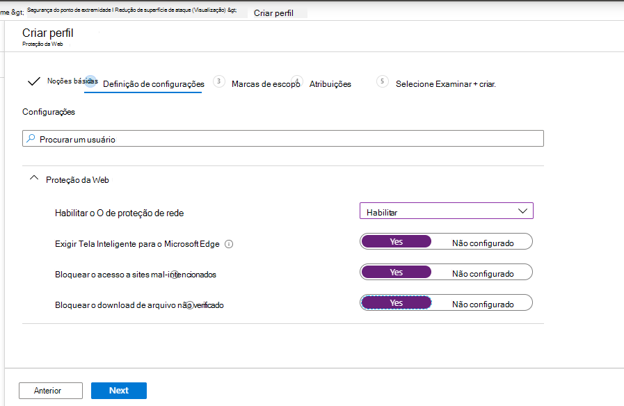

7.  Adicione **marcas de escopo conforme necessário > Next**.Add **Scope Tags as required > Next**.

    > [!div class="mx-imgBorder"]
    > 

8.  Selecione **Atribuir ao grupo de teste > Próximo**.Select **Assign to test group > Next**.

    > [!div class="mx-imgBorder"]
    > 

9.  Selecione **Revisar e Criar > Criar**.Select **Review and Create > Create**.

    > [!div class="mx-imgBorder"]
    > 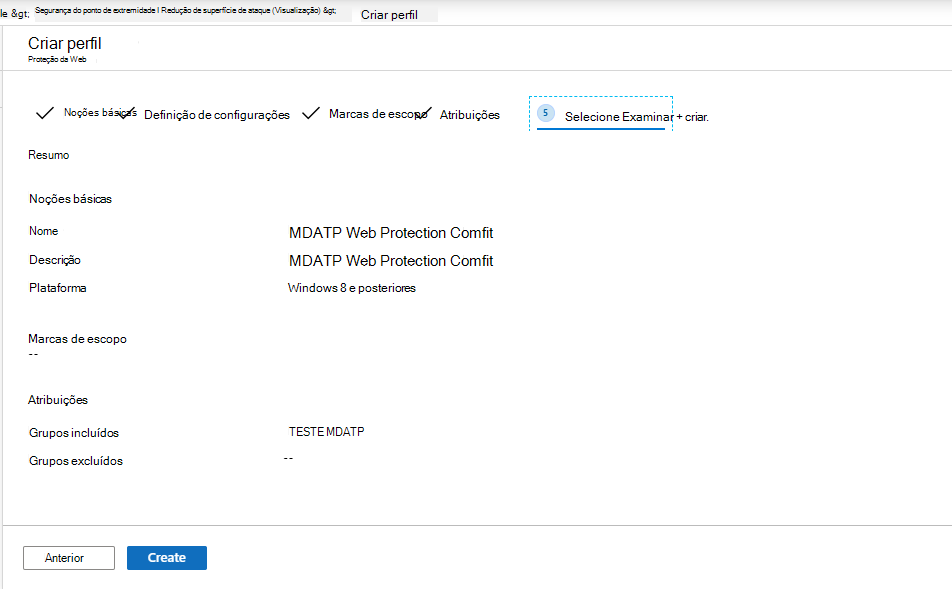

10. Exibir a política.View the policy.

    > [!div class="mx-imgBorder"]
    > 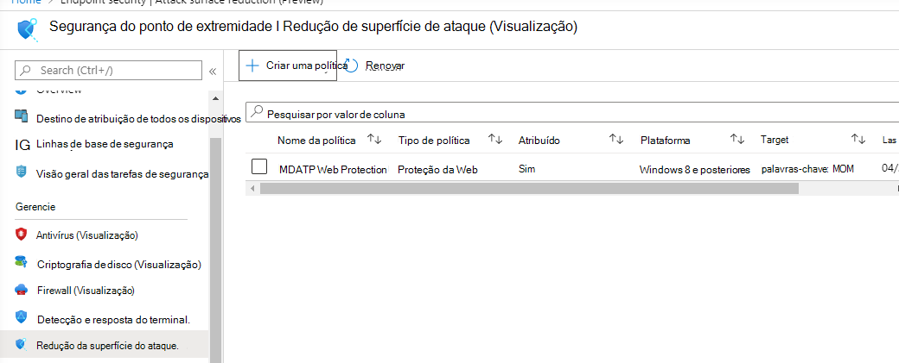

## Validar configuraçõesValidate configuration settings

### Confirmar políticas foram aplicadasConfirm Policies have been applied

Depois que a política de configuração tiver sido atribuída, levará algum tempo para ser aplicada.Once the Configuration policy has been assigned, it will take some time to apply.

Para obter informações sobre o tempo, consulte [Informações de configuração do Intune.](https://docs.microsoft.com/mem/intune/configuration/device-profile-troubleshoot#how-long-does-it-take-for-devices-to-get-a-policy-profile-or-app-after-they-are-assigned)For information on timing, see [Intune configuration information](https://docs.microsoft.com/mem/intune/configuration/device-profile-troubleshoot#how-long-does-it-take-for-devices-to-get-a-policy-profile-or-app-after-they-are-assigned).

Para confirmar se a política de configuração foi aplicada ao dispositivo de teste, siga o processo a seguir para cada política de configuração.To confirm that the configuration policy has been applied to your test device, follow the following process for each configuration policy.

1.  Abra o portal do MEM e navegue até a política relevante, conforme mostrado nas etapas acima.Open the MEM portal and navigate to the relevant policy as shown in the steps above. O exemplo a seguir mostra as configurações de proteção de próxima geração.The following example shows the next generation protection settings.

    > [!div class="mx-imgBorder"]
    > [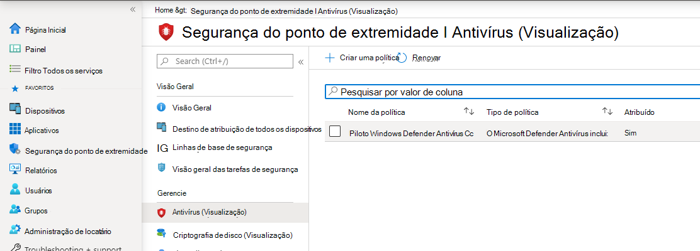](images/43ab6aa74471ee2977e154a4a5ef2d39.png#lightbox)

2.  Selecione a **Política de Configuração** para exibir o status da política.Select  the **Configuration Policy** to view the policy status.

    > [!div class="mx-imgBorder"]
    > [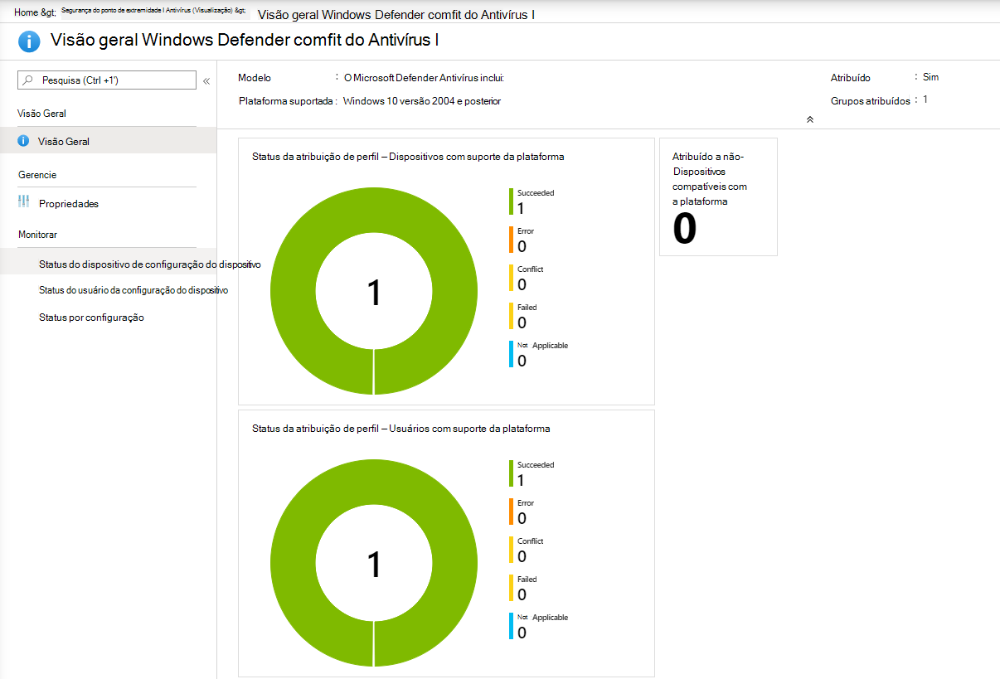](images/55ecaca0e4a022f0e29d45aeed724e6c.png#lightbox)

3.  Selecione  **Status do Dispositivo** para ver o status.Select  **Device Status** to see the status.

    > [!div class="mx-imgBorder"]
    > [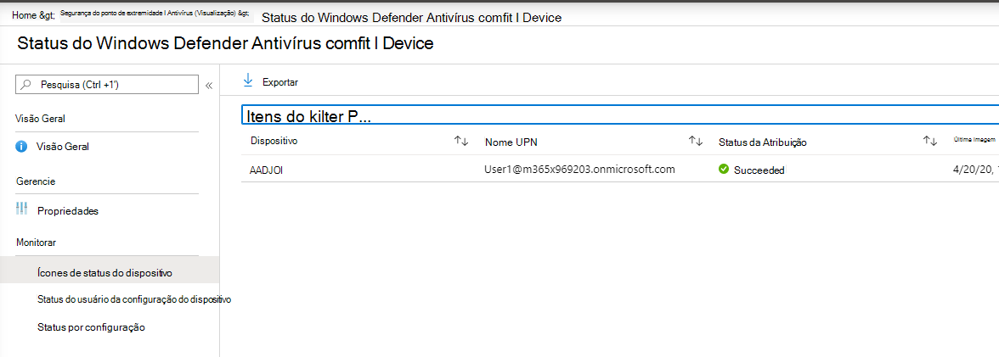](images/18a50df62cc38749000dbfb48e9a4c9b.png#lightbox)

4.  Selecione  **Status do Usuário** para ver o status.Select  **User Status** to see the status.

    > [!div class="mx-imgBorder"]
    > [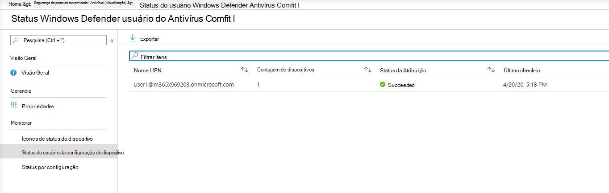](images/4e965749ff71178af8873bc91f9fe525.png#lightbox)

5.  Selecione  **Status por configuração** para ver o status.Select  **Per-setting status** to see the status.

    >[!TIP]
    >Essa exibição é muito útil para identificar as configurações que conflitam com outra política.This view is very useful to identify any settings that conflict with another policy.

    > [!div class="mx-imgBorder"]
    > [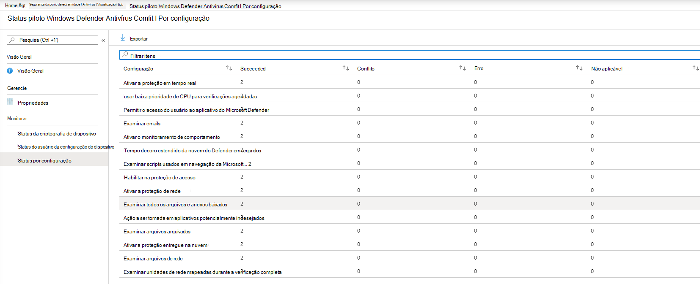](images/42acc69d0128ed09804010bdbdf0a43c.png#lightbox)

### Detecção e resposta do terminal.Endpoint detection and response

1.  Antes de aplicar a configuração, o serviço Defender for Endpoint Protection não deve ser iniciado.Before applying the configuration, the Defender for Endpoint Protection service should not be started.

    > [!div class="mx-imgBorder"]
    > [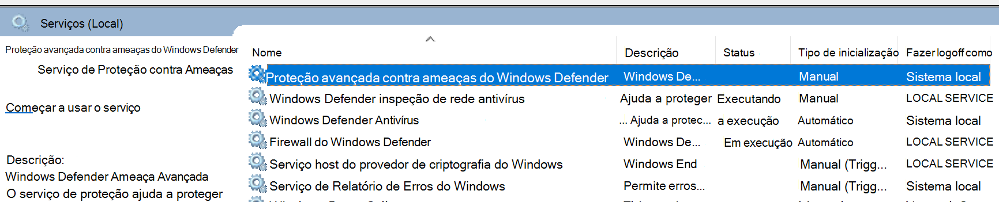](images/b418a232a12b3d0a65fc98248dbb0e31.png#lightbox)

2.  Após a aplicação da configuração, o Defender for Endpoint Protection Service deve ser iniciado.After the configuration has been applied, the Defender for Endpoint Protection Service should be started.

    > [!div class="mx-imgBorder"]
    > 

3.  Depois que os serviços são executados no dispositivo, o dispositivo aparece no Centro de Segurança do Microsoft Defender.After the services are running on the device, the device appears in Microsoft Defender Security Center.

    > [!div class="mx-imgBorder"]
    > [ Microsoft Defender](images/df0c64001b9219cfbd10f8f81a273190.png#lightbox)

### Proteção de última geraçãoNext-generation protection

1.  Antes de aplicar a política em um dispositivo de teste, você deve ser capaz de gerenciar manualmente as configurações, conforme mostrado abaixo.Before applying the policy on a test device, you should be able to manually manage the settings as shown below.

    > [!div class="mx-imgBorder"]
    > 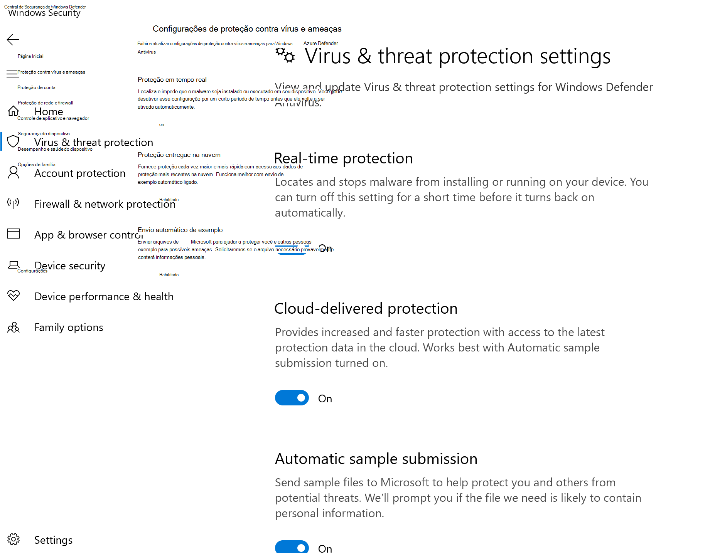

2.  Depois que a política tiver sido aplicada, você não poderá gerenciar manualmente as configurações.After the policy has been applied, you should not be able to manually manage the settings.

    > [!NOTE]
    > Na imagem a **seguir, a proteção** a ser exibida na nuvem e Ativar a proteção em **tempo real** estão sendo mostradas como gerenciadas.In the following image **Turn on cloud-delivered protection** and **Turn on real-time protection** are being shown as managed.

    > [!div class="mx-imgBorder"]
    > 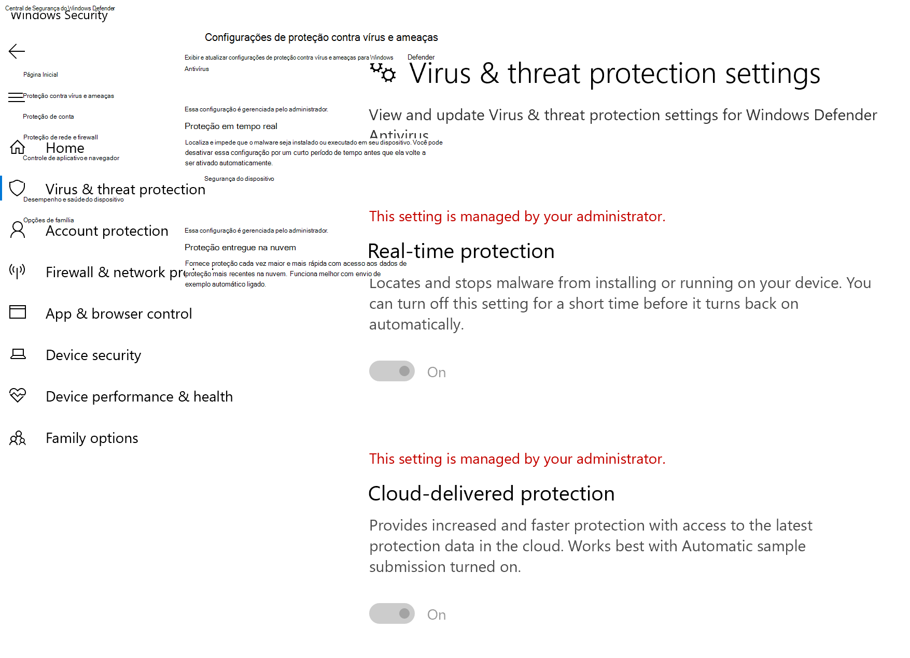

### Redução de Superfície de Ataque – Regras de redução de superfície de ataqueAttack Surface Reduction – Attack surface reduction rules

1.  Antes de aplicar a política em um dispositivo de teste, penite uma Janela do PowerShell e digite `Get-MpPreference` .Before applying the policy on a test device, pen a PowerShell Window and type `Get-MpPreference`.

2.  Isso deve responder com as seguintes linhas sem conteúdo:This should respond with the following lines with no content:

    > AttackSurfaceReductionOnlyExclusions:AttackSurfaceReductionOnlyExclusions:
    > 
    > AttackSurfaceReductionRules_Actions:AttackSurfaceReductionRules_Actions:
    > 
    > AttackSurfaceReductionRules_Ids:AttackSurfaceReductionRules_Ids:

    

3.  Depois de aplicar a política em um dispositivo de teste, abra um Windows do PowerShell e digite `Get-MpPreference` .After applying the policy on a test device, open a PowerShell Windows and type `Get-MpPreference`.

4.  Isso deve responder com as seguintes linhas com conteúdo, conforme mostrado abaixo:This should respond with the following lines with content as shown below:

    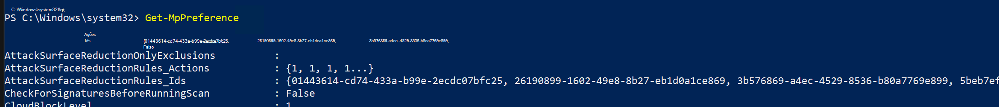

### Redução de superfície de ataque – Proteção da WebAttack Surface Reduction – Web Protection

1.  No dispositivo de teste, abra um Windows do PowerShell e digite `(Get-MpPreference).EnableNetworkProtection` .On the test device, open a PowerShell Windows and type `(Get-MpPreference).EnableNetworkProtection`.

2.  Isso deve responder com um 0 conforme mostrado abaixo.This should respond with a 0 as shown below.

    

3.  Depois de aplicar a política, abra um Windows do PowerShell e digite `(Get-MpPreference).EnableNetworkProtection` .After applying the policy, open a PowerShell Windows and type `(Get-MpPreference).EnableNetworkProtection`.

4.  Isso deve responder com um 1, conforme mostrado abaixo.This should respond with a 1 as shown below.

    
