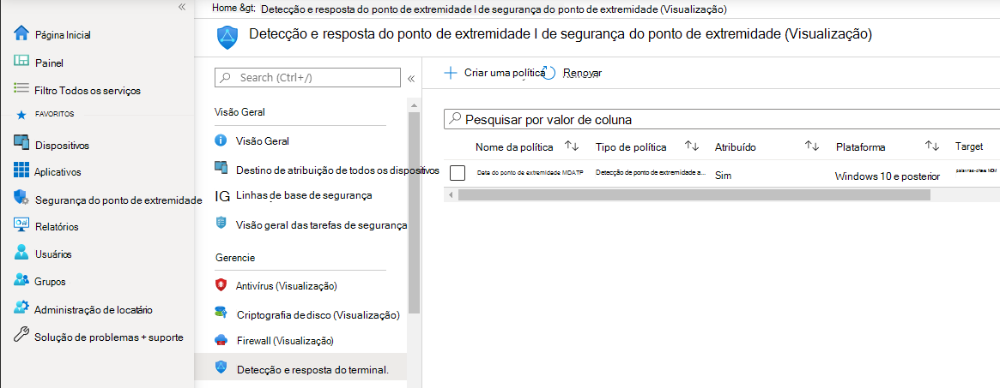
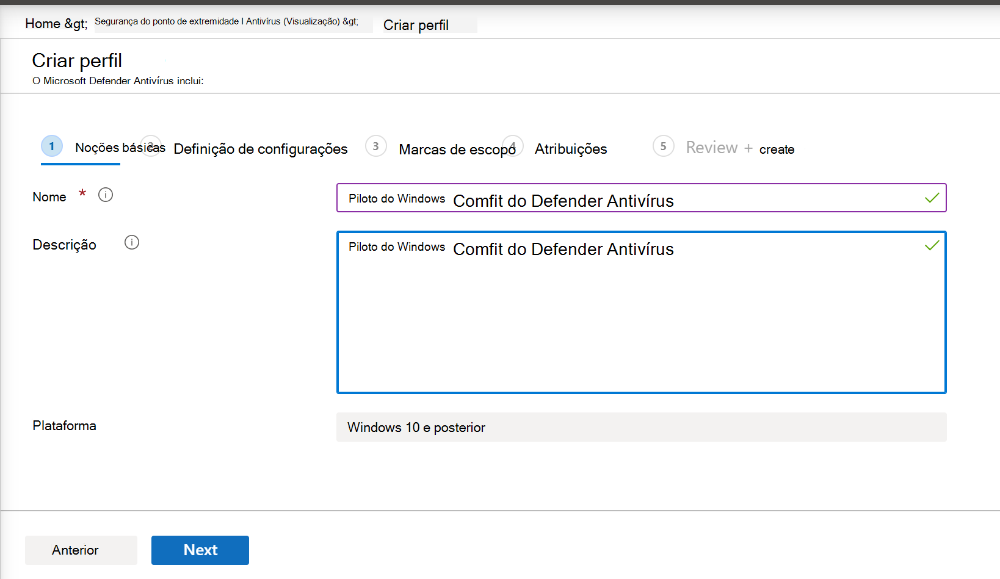

# Integração usando o Microsoft Endpoint Manager

[!INCLUDE [Microsoft 365 Defender rebranding](../../includes/microsoft-defender.md)]

**Aplica-se a:**
- [Microsoft Defender para Ponto de Extremidade](https://go.microsoft.com/fwlink/p/?linkid=2154037)
- [Microsoft 365 Defender](https://go.microsoft.com/fwlink/?linkid=2118804)

> Deseja experimentar o Microsoft Defender para Ponto de Extremidade? [Inscreva-se para uma avaliação gratuita.](https://www.microsoft.com/microsoft-365/windows/microsoft-defender-atp?ocid=docs-wdatp-exposedapis-abovefoldlink)

Este artigo faz parte do guia implantação e age como um exemplo de método de integração. 

No tópico [Planejamento,](deployment-strategy.md) havia vários métodos fornecidos para os dispositivos de integração ao serviço. Este tópico aborda a arquitetura nativa da nuvem. 

 *Diagrama de arquiteturas de ambiente*

Embora o Defender para Ponto de Extremidade suporte à integração de vários pontos de extremidade e ferramentas, este artigo não os abrange. Para obter informações sobre a integração geral usando outras ferramentas e métodos de implantação com suporte, consulte [Onboarding overview](onboarding.md).

[O Microsoft Endpoint Manager](https://docs.microsoft.com/mem/endpoint-manager-overview) é uma plataforma de solução que unifica vários serviços. Ele inclui o [Microsoft Intune para](https://docs.microsoft.com/mem/intune/fundamentals/what-is-intune) gerenciamento de dispositivos baseado em nuvem.

Este tópico orienta os usuários em:
- Etapa 1: Integrando dispositivos ao serviço criando um grupo no Microsoft Endpoint Manager (MEM) para atribuir configurações em
- Etapa 2: Configurando o Defender para recursos de ponto de extremidade usando o Microsoft Endpoint Manager

Essas diretrizes de integração orientarão você pelas seguintes etapas básicas que você precisa seguir ao usar o Microsoft Endpoint Manager:

-   [Identificar dispositivos de destino ou usuários](#identify-target-devices-or-users)

    -   Criando um grupo do Azure Active Directory (Usuário ou Dispositivo)

-   [Criando um Perfil de Configuração](#step-2-create-configuration-policies-to-configure-microsoft-defender-for-endpoint-capabilities)

    -   No Microsoft Endpoint Manager, vamos orientá-lo na criação de uma política separada para cada recurso.

## Recursos

Aqui estão os links necessários para o restante do processo:

-   [Portal de MEM](https://aka.ms/memac)

-   [Central de Segurança](https://securitycenter.windows.com/)

-   [Linhas de base de segurança do Intune](https://docs.microsoft.com/mem/intune/protect/security-baseline-settings-defender-atp#microsoft-defender)

Para obter mais informações sobre o Microsoft Endpoint Manager, confira estes recursos:
- [Página do Microsoft Endpoint Manager](https://docs.microsoft.com/mem/)
- [Postagem de blog sobre convergência do Intune e ConfigMgr](https://www.microsoft.com/microsoft-365/blog/2019/11/04/use-the-power-of-cloud-intelligence-to-simplify-and-accelerate-it-and-the-move-to-a-modern-workplace/)
- [Vídeo de introdução no MEM](https://www.microsoft.com/microsoft-365/blog/2019/11/04/use-the-power-of-cloud-intelligence-to-simplify-and-accelerate-it-and-the-move-to-a-modern-workplace)

## Etapa 1: Integrando dispositivos criando um grupo no MEM para atribuir configurações em
### Identificar dispositivos de destino ou usuários
Nesta seção, criaremos um grupo de teste para atribuir suas configurações.

>[!NOTE]
>O Intune usa grupos do Azure Active Directory (Azure AD) para gerenciar dispositivos e usuários. Como administrador do Intune, você pode configurar grupos para atender às suas necessidades organizacionais. 
Para obter mais informações, [consulte Adicionar grupos para organizar usuários e dispositivos](https://docs.microsoft.com/mem/intune/fundamentals/groups-add).

### Criar um grupo

1.  Abra o portal MEM.

2.  Abra **Grupos > Novo Grupo**.

    > [!div class="mx-imgBorder"]
    > 

3.  Insira detalhes e crie um novo grupo.

    > [!div class="mx-imgBorder"]
    > 

4.  Adicione seu usuário de teste ou dispositivo.

5.  No painel **Grupos > Todos os** grupos, abra seu novo grupo.

6.  Selecione  **Membros > Adicionar membros**.

7.  Encontre seu usuário de teste ou dispositivo e selecione-o.

    > [!div class="mx-imgBorder"]
    > 

8.  Seu grupo de teste agora tem um membro para testar.

## Etapa 2: Criar políticas de configuração para configurar o Microsoft Defender para recursos do Ponto de Extremidade
Na seção a seguir, você criará várias políticas de configuração.

Em primeiro lugar, uma política de configuração para selecionar quais grupos de usuários ou dispositivos serão integrados ao Defender para Ponto de Extremidade:

- [Detecção de ponto de extremidade e resposta](#endpoint-detection-and-response) 

Em seguida, você continuará criando vários tipos diferentes de políticas de segurança do ponto de extremidade:

- [Proteção de próxima geração](#next-generation-protection)
- [Redução de superfície de ataque](#attack-surface-reduction--attack-surface-reduction-rules)

### Detecção de ponto de extremidade e resposta

1.  Abra o portal MEM.

2.  Navegue **até Endpoint security > Endpoint detection and response**. Clique em **Criar Perfil**.

    > [!div class="mx-imgBorder"]
    > 

3.  Em **Plataforma, selecione Windows 10 e Posterior, Perfil - Detecção** e resposta do ponto de extremidade > Criar .

4.  Insira um nome e uma descrição e selecione  **Next**.

    > [!div class="mx-imgBorder"]
    > 

5.  Selecione configurações conforme necessário e selecione  **Próximo**.

    > [!div class="mx-imgBorder"]
    > 

    > [!NOTE]
    > Nesse caso, isso foi preenchido automaticamente, pois o Defender para Ponto de Extremidade já foi integrado ao Intune. Para obter mais informações sobre a integração, consulte [Enable Microsoft Defender for Endpoint in Intune](https://docs.microsoft.com/mem/intune/protect/advanced-threat-protection-configure#to-enable-microsoft-defender-atp).
    > 
    > A imagem a seguir é um exemplo do que você verá quando o Microsoft Defender for Endpoint não estiver integrado ao Intune:
    >
    > 

6.  Adicione marcas de escopo, se necessário, em seguida, selecione  **Next**.

    > [!div class="mx-imgBorder"]
    > 

7.  Adicione grupo de teste clicando em **Selecionar grupos para incluir** e escolher seu grupo e selecione  **Próximo**.

    > [!div class="mx-imgBorder"]
    > 

8.  Revise e aceite e selecione  **Criar**.

    > [!div class="mx-imgBorder"]
    > 

9.  Você pode exibir sua política concluída.

    > [!div class="mx-imgBorder"]
    > 

### Proteção de próxima geração

1.  Abra o portal MEM.

2.  Navegue **até Endpoint security > Antivírus > Criar Política**.

    > [!div class="mx-imgBorder"]
    > 

3.  Selecione **Plataforma - Windows 10 e Posterior - Windows e Perfil – Microsoft Defender Antivírus > Criar**.

4.  Insira o nome e a descrição e selecione  **Next**.

    > [!div class="mx-imgBorder"]
    > 

5.  Na página **Configuração configurações:** de definir as configurações necessárias para o Microsoft Defender Antivírus (Proteção na Nuvem, Exclusões, Real-Time Proteção e Correção).

    > [!div class="mx-imgBorder"]
    > 

6.  Adicione marcas de escopo, se necessário, em seguida, selecione  **Next**.

    > [!div class="mx-imgBorder"]
    > 

7.  Selecione grupos para incluir, atribua ao grupo de teste e selecione  **Próximo**.

    > [!div class="mx-imgBorder"]
    > 

8.  Revise e crie e selecione  **Criar**.

    > [!div class="mx-imgBorder"]
    > 

9.  Você verá a política de configuração criada.

    > [!div class="mx-imgBorder"]
    > 

### Redução de Superfície de Ataque – Regras de redução de superfície de ataque

1.  Abra o portal MEM.

2.  Navegue **até Endpoint security > Redução de superfície de ataque**.

3.  Selecione  **Criar Política**.

4.  Selecione **Plataforma - Windows 10 e Posterior – Perfil - Regras de redução de superfície de ataque > Criar**.

    > [!div class="mx-imgBorder"]
    > 

5.  Insira um nome e uma descrição e selecione  **Next**.

    > [!div class="mx-imgBorder"]
    > 

6.  Na página **Configuração de configuração:** de definir as configurações necessárias para regras de redução de superfície de ataque e selecione  **Próximo**.

    > [!NOTE]
    > Configuraremos todas as regras de redução de superfície de ataque para Auditoria.
    > 
    > Para obter mais informações, consulte [Regras de redução de superfície de ataque](attack-surface-reduction.md).

    > [!div class="mx-imgBorder"]
    > 

7.  Adicione Marcas de Escopo conforme necessário e selecione  **Next**.

    > [!div class="mx-imgBorder"]
    > 

8.  Selecione grupos para incluir e atribuir ao grupo de teste e selecione  **Próximo**.

    > [!div class="mx-imgBorder"]
    > 

9. Revise os detalhes e selecione  **Criar**.

    > [!div class="mx-imgBorder"]
    > 

10. Exibir a política.

    > [!div class="mx-imgBorder"]
    > 

### Redução de superfície de ataque – Proteção da Web

1.  Abra o portal MEM.

2.  Navegue **até Endpoint security > Redução de superfície de ataque**.

3.  Selecione  **Criar Política**.

4.  Selecione **Windows 10 e Posterior – Proteção da Web > Criar**.

    > [!div class="mx-imgBorder"]
    > 

5.  Insira um nome e uma descrição e selecione  **Next**.

    > [!div class="mx-imgBorder"]
    > 

6.  Na página **Configuração configurações:** de definir as configurações necessárias para a Proteção da Web e selecione  **Próximo**.

    > [!NOTE]
    > Estamos configurando a Proteção da Web para Bloquear.
    > 
    > Para obter mais informações, consulte [Web Protection](web-protection-overview.md).

    > [!div class="mx-imgBorder"]
    > 

7.  Adicione **marcas de escopo conforme necessário > Next**.

    > [!div class="mx-imgBorder"]
    > 

8.  Selecione **Atribuir ao grupo de teste > Próximo**.

    > [!div class="mx-imgBorder"]
    > 

9.  Selecione **Revisar e Criar > Criar**.

    > [!div class="mx-imgBorder"]
    > 

10. Exibir a política.

    > [!div class="mx-imgBorder"]
    > 

## Validar configurações

### Confirmar políticas foram aplicadas

Depois que a política de configuração tiver sido atribuída, levará algum tempo para ser aplicada.

Para obter informações sobre o tempo, consulte [Informações de configuração do Intune.](https://docs.microsoft.com/mem/intune/configuration/device-profile-troubleshoot#how-long-does-it-take-for-devices-to-get-a-policy-profile-or-app-after-they-are-assigned)

Para confirmar se a política de configuração foi aplicada ao dispositivo de teste, siga o processo a seguir para cada política de configuração.

1.  Abra o portal do MEM e navegue até a política relevante, conforme mostrado nas etapas acima. O exemplo a seguir mostra as configurações de proteção de próxima geração.

    > [!div class="mx-imgBorder"]
    > 

2.  Selecione a **Política de Configuração** para exibir o status da política.

    > [!div class="mx-imgBorder"]
    > 

3.  Selecione  **Status do Dispositivo** para ver o status.

    > [!div class="mx-imgBorder"]
    > 

4.  Selecione  **Status do Usuário** para ver o status.

    > [!div class="mx-imgBorder"]
    > 

5.  Selecione  **Status por configuração** para ver o status.

    >[!TIP]
    >Essa exibição é muito útil para identificar as configurações que conflitam com outra política.

    > [!div class="mx-imgBorder"]
    > 

### Detecção de ponto de extremidade e resposta

1.  Antes de aplicar a configuração, o serviço Defender for Endpoint Protection não deve ser iniciado.

    > [!div class="mx-imgBorder"]
    > 

2.  Após a aplicação da configuração, o Defender for Endpoint Protection Service deve ser iniciado.

    > [!div class="mx-imgBorder"]
    > 

3.  Depois que os serviços são executados no dispositivo, o dispositivo aparece no Centro de Segurança do Microsoft Defender.

    > [!div class="mx-imgBorder"]
    > [ Microsoft Defender](images/df0c64001b9219cfbd10f8f81a273190.png#lightbox)

### Proteção de próxima geração

1.  Antes de aplicar a política em um dispositivo de teste, você deve ser capaz de gerenciar manualmente as configurações, conforme mostrado abaixo.

    > [!div class="mx-imgBorder"]
    > 

2.  Depois que a política tiver sido aplicada, você não poderá gerenciar manualmente as configurações.

    > [!NOTE]
    > Na imagem a **seguir, a proteção** a ser exibida na nuvem e Ativar a proteção em **tempo real** estão sendo mostradas como gerenciadas.

    > [!div class="mx-imgBorder"]
    > 

### Redução de Superfície de Ataque – Regras de redução de superfície de ataque

1.  Antes de aplicar a política em um dispositivo de teste, penite uma Janela do PowerShell e digite `Get-MpPreference` .

2.  Isso deve responder com as seguintes linhas sem conteúdo:

    > AttackSurfaceReductionOnlyExclusions:
    > 
    > AttackSurfaceReductionRules_Actions:
    > 
    > AttackSurfaceReductionRules_Ids:

    

3.  Depois de aplicar a política em um dispositivo de teste, abra um Windows do PowerShell e digite `Get-MpPreference` .

4.  Isso deve responder com as seguintes linhas com conteúdo, conforme mostrado abaixo:

    

### Redução de superfície de ataque – Proteção da Web

1.  No dispositivo de teste, abra um Windows do PowerShell e digite `(Get-MpPreference).EnableNetworkProtection` .

2.  Isso deve responder com um 0 conforme mostrado abaixo.

    

3.  Depois de aplicar a política, abra um Windows do PowerShell e digite `(Get-MpPreference).EnableNetworkProtection` .

4.  Isso deve responder com um 1, conforme mostrado abaixo.

    
