# <a name="create-a-notification-rule-when-a-local-onboarding-or-offboarding-script-is-used"></a><span data-ttu-id="69508-104">Criar uma regra de notificação quando um script local de integração ou de offboard é usado</span><span class="sxs-lookup"><span data-stu-id="69508-104">Create a notification rule when a local onboarding or offboarding script is used</span></span>

[!INCLUDE [Microsoft 365 Defender rebranding](../../includes/microsoft-defender.md)]


<span data-ttu-id="69508-105">**Aplica-se a:**</span><span class="sxs-lookup"><span data-stu-id="69508-105">**Applies to:**</span></span>
- [<span data-ttu-id="69508-106">Microsoft Defender para Ponto de Extremidade</span><span class="sxs-lookup"><span data-stu-id="69508-106">Microsoft Defender for Endpoint</span></span>](https://go.microsoft.com/fwlink/p/?linkid=2154037)
- [<span data-ttu-id="69508-107">Microsoft 365 Defender</span><span class="sxs-lookup"><span data-stu-id="69508-107">Microsoft 365 Defender</span></span>](https://go.microsoft.com/fwlink/?linkid=2118804)


> <span data-ttu-id="69508-108">Deseja experimentar o Microsoft Defender para Ponto de Extremidade?</span><span class="sxs-lookup"><span data-stu-id="69508-108">Want to experience Microsoft Defender for Endpoint?</span></span> [<span data-ttu-id="69508-109">Inscreva-se para uma avaliação gratuita.</span><span class="sxs-lookup"><span data-stu-id="69508-109">Sign up for a free trial.</span></span>](https://www.microsoft.com/microsoft-365/windows/microsoft-defender-atp?ocid=docs-wdatp-exposedapis-abovefoldlink)

[!include[Microsoft Defender for Endpoint API URIs for US Government](../../includes/microsoft-defender-api-usgov.md)]

[!include[Improve request performance](../../includes/improve-request-performance.md)]


<span data-ttu-id="69508-110">Crie uma regra de notificação para que, quando um script local de integração ou de offboard for usado, você será notificado.</span><span class="sxs-lookup"><span data-stu-id="69508-110">Create a notification rule so that when a local onboarding or offboarding script is used, you'll be notified.</span></span> 

## <a name="before-you-begin"></a><span data-ttu-id="69508-111">Antes de começar</span><span class="sxs-lookup"><span data-stu-id="69508-111">Before you begin</span></span>
<span data-ttu-id="69508-112">Você precisará ter acesso a:</span><span class="sxs-lookup"><span data-stu-id="69508-112">You'll need to have access to:</span></span>
 - <span data-ttu-id="69508-113">Microsoft Flow (Plano de Fluxo 1 no mínimo).</span><span class="sxs-lookup"><span data-stu-id="69508-113">Microsoft Flow (Flow Plan 1 at a minimum).</span></span> <span data-ttu-id="69508-114">Para obter mais informações, consulte [a página Preços de fluxo.](https://flow.microsoft.com/pricing/)</span><span class="sxs-lookup"><span data-stu-id="69508-114">For more information, see [Flow pricing page](https://flow.microsoft.com/pricing/).</span></span>
 - <span data-ttu-id="69508-115">Tabela do Azure ou Lista do SharePoint ou Biblioteca/SQL DB</span><span class="sxs-lookup"><span data-stu-id="69508-115">Azure Table or SharePoint List or Library / SQL DB</span></span>

## <a name="create-the-notification-flow"></a><span data-ttu-id="69508-116">Criar o fluxo de notificação</span><span class="sxs-lookup"><span data-stu-id="69508-116">Create the notification flow</span></span>

1. <span data-ttu-id="69508-117">Em [flow.microsoft.com](https://flow.microsoft.com/).</span><span class="sxs-lookup"><span data-stu-id="69508-117">In [flow.microsoft.com](https://flow.microsoft.com/).</span></span>

2. <span data-ttu-id="69508-118">Navegue **até Meus fluxos > Novo > Agendado - em branco**.</span><span class="sxs-lookup"><span data-stu-id="69508-118">Navigate to **My flows > New > Scheduled - from blank**.</span></span> 

    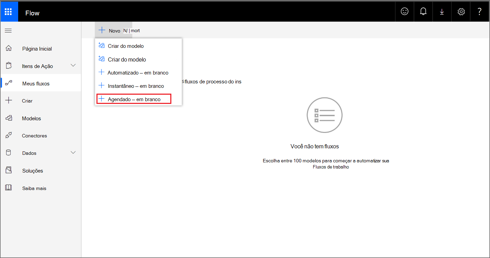


3. <span data-ttu-id="69508-120">Crie um fluxo agendado.</span><span class="sxs-lookup"><span data-stu-id="69508-120">Build a scheduled flow.</span></span>
   1. <span data-ttu-id="69508-121">Insira um nome de fluxo.</span><span class="sxs-lookup"><span data-stu-id="69508-121">Enter a flow name.</span></span>
   2. <span data-ttu-id="69508-122">Especifique o início e a hora.</span><span class="sxs-lookup"><span data-stu-id="69508-122">Specify the start and time.</span></span>
   3. <span data-ttu-id="69508-123">Especifique a frequência.</span><span class="sxs-lookup"><span data-stu-id="69508-123">Specify the frequency.</span></span> <span data-ttu-id="69508-124">Por exemplo, a cada 5 minutos.</span><span class="sxs-lookup"><span data-stu-id="69508-124">For example, every 5 minutes.</span></span>

    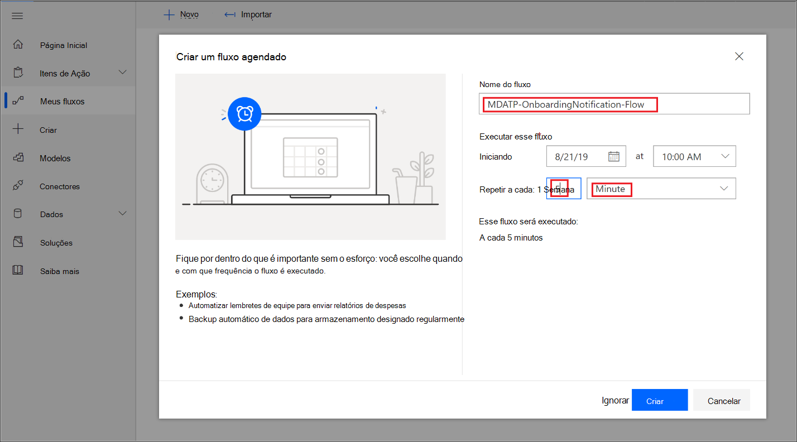

4. <span data-ttu-id="69508-126">Selecione o botão + para adicionar uma nova ação.</span><span class="sxs-lookup"><span data-stu-id="69508-126">Select the + button to add a new action.</span></span> <span data-ttu-id="69508-127">A nova ação será uma solicitação HTTP para a API do Defender for Endpoint security center device(s).</span><span class="sxs-lookup"><span data-stu-id="69508-127">The new action will be an HTTP request to the Defender for Endpoint security center device(s) API.</span></span> <span data-ttu-id="69508-128">Você também pode substituí-lo pelo "Conector WDATP" (ação: "Máquinas - Obter lista de máquinas").</span><span class="sxs-lookup"><span data-stu-id="69508-128">You can also replace it with the out-of-the-box "WDATP Connector" (action: "Machines - Get list of machines").</span></span> 

    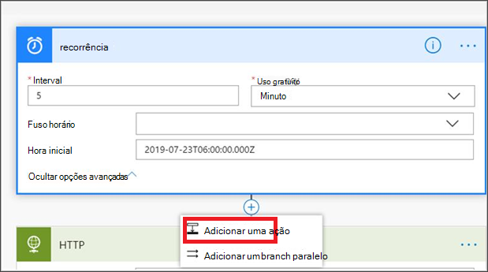


5. <span data-ttu-id="69508-130">Insira os seguintes campos HTTP:</span><span class="sxs-lookup"><span data-stu-id="69508-130">Enter the following HTTP fields:</span></span>

   - <span data-ttu-id="69508-131">Método: "GET" como um valor para obter a lista de dispositivos.</span><span class="sxs-lookup"><span data-stu-id="69508-131">Method: "GET" as a value to get the list of devices.</span></span>
   - <span data-ttu-id="69508-132">URI: Insira `https://api.securitycenter.microsoft.com/api/machines` .</span><span class="sxs-lookup"><span data-stu-id="69508-132">URI: Enter `https://api.securitycenter.microsoft.com/api/machines`.</span></span>
   - <span data-ttu-id="69508-133">Autenticação: selecione "Active Directory OAuth".</span><span class="sxs-lookup"><span data-stu-id="69508-133">Authentication: Select "Active Directory OAuth".</span></span>
   - <span data-ttu-id="69508-134">Locatário: entre e navegue até https://portal.azure.com **o Azure Active Directory > Aplicativos** e obter o valor da ID do Locatário.</span><span class="sxs-lookup"><span data-stu-id="69508-134">Tenant: Sign-in to https://portal.azure.com and navigate to **Azure Active Directory > App Registrations** and get the Tenant ID value.</span></span>
   - <span data-ttu-id="69508-135">Público-alvo: `https://securitycenter.onmicrosoft.com/windowsatpservice\`</span><span class="sxs-lookup"><span data-stu-id="69508-135">Audience: `https://securitycenter.onmicrosoft.com/windowsatpservice\`</span></span>
   - <span data-ttu-id="69508-136">ID do cliente: entre e navegue até o Azure Active Directory > Registros de https://portal.azure.com **Aplicativos** e receba o valor de ID do Cliente.</span><span class="sxs-lookup"><span data-stu-id="69508-136">Client ID: Sign-in to https://portal.azure.com and navigate to **Azure Active Directory > App Registrations** and  get the Client ID value.</span></span>
   - <span data-ttu-id="69508-137">Tipo de credencial: selecione "Segredo".</span><span class="sxs-lookup"><span data-stu-id="69508-137">Credential Type: Select "Secret".</span></span>
   - <span data-ttu-id="69508-138">Segredo: entre e navegue até https://portal.azure.com **o Azure Active Directory** > Aplicativos e obter o valor da ID do locatário.</span><span class="sxs-lookup"><span data-stu-id="69508-138">Secret: Sign-in to https://portal.azure.com and navigate to **Azure Active Directory > App Registrations** and get the Tenant ID value.</span></span>

    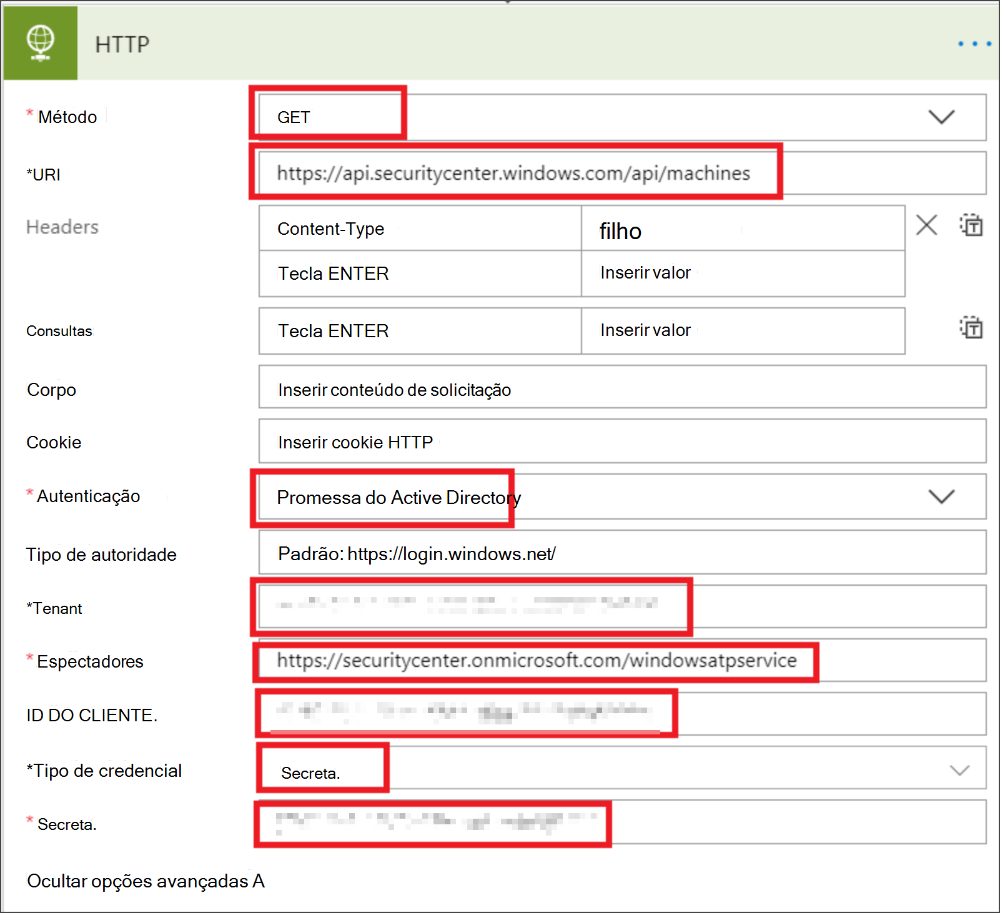


6. <span data-ttu-id="69508-140">Adicione uma nova etapa selecionando Adicionar  **nova ação** e, em seguida, pesquise Operações de Dados e selecione **Analisar JSON**.</span><span class="sxs-lookup"><span data-stu-id="69508-140">Add a new step by selecting **Add new action** then search for **Data Operations** and select **Parse JSON**.</span></span>

    

7. <span data-ttu-id="69508-142">Adicionar Corpo no **campo** Conteúdo.</span><span class="sxs-lookup"><span data-stu-id="69508-142">Add Body in the **Content** field.</span></span>

    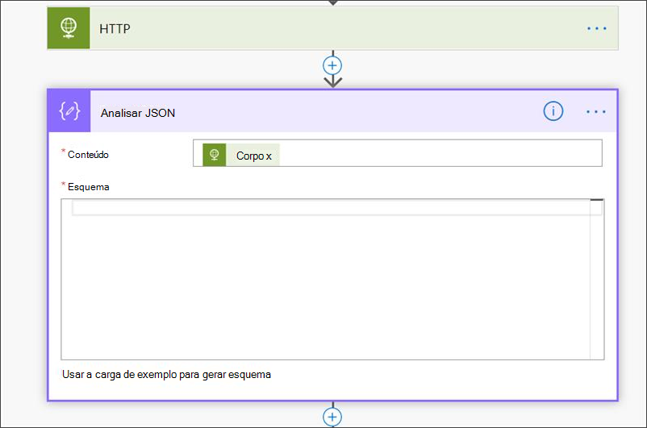

8. <span data-ttu-id="69508-144">Selecione o **link Usar carga de exemplo para gerar esquema.**</span><span class="sxs-lookup"><span data-stu-id="69508-144">Select the **Use sample payload to generate schema** link.</span></span>

    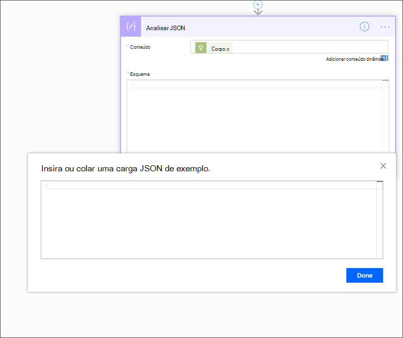

9. <span data-ttu-id="69508-146">Copie e colar o seguinte trecho JSON:</span><span class="sxs-lookup"><span data-stu-id="69508-146">Copy and paste the following JSON snippet:</span></span>

    ```
    {
        "type": "object",
        "properties": {
            "@@odata.context": {
                "type": "string"
            },
            "value": {
                "type": "array",
                "items": {
                    "type": "object",
                    "properties": {
                        "id": {
                            "type": "string"
                        },
                        "computerDnsName": {
                            "type": "string"
                        },
                        "firstSeen": {
                            "type": "string"
                        },
                        "lastSeen": {
                            "type": "string"
                        },
                        "osPlatform": {
                            "type": "string"
                        },
                        "osVersion": {},
                        "lastIpAddress": {
                            "type": "string"
                        },
                        "lastExternalIpAddress": {
                            "type": "string"
                        },
                        "agentVersion": {
                            "type": "string"
                        },
                        "osBuild": {
                            "type": "integer"
                        },
                        "healthStatus": {
                            "type": "string"
                        },
                        "riskScore": {
                            "type": "string"
                        },
                        "exposureScore": {
                            "type": "string"
                        },
                        "aadDeviceId": {},
                        "machineTags": {
                            "type": "array"
                        }
                    },
                    "required": [
                        "id",
                        "computerDnsName",
                        "firstSeen",
                        "lastSeen",
                        "osPlatform",
                        "osVersion",
                        "lastIpAddress",
                        "lastExternalIpAddress",
                        "agentVersion",
                        "osBuild",
                        "healthStatus",
                        "rbacGroupId",
                        "rbacGroupName",
                        "riskScore",
                        "exposureScore",
                        "aadDeviceId",
                        "machineTags"
                    ]
                }
            }
        }
    }

    ```

10.  <span data-ttu-id="69508-147">Extraia os valores da chamada JSON e verifique se o(s) dispositivo(s) de integração (s) já está registrado na lista do SharePoint como um exemplo:</span><span class="sxs-lookup"><span data-stu-id="69508-147">Extract the values from the JSON call and check if the onboarded device(s) is / are already registered at the SharePoint list as an example:</span></span>
- <span data-ttu-id="69508-148">Se sim, nenhuma notificação será disparada</span><span class="sxs-lookup"><span data-stu-id="69508-148">If yes, no notification will be triggered</span></span>
- <span data-ttu-id="69508-149">Se não, registrará os novos dispositivos integrados na lista do SharePoint e uma notificação será enviada ao administrador do Defender for Endpoint</span><span class="sxs-lookup"><span data-stu-id="69508-149">If no, will register the new onboarded device(s) in the SharePoint list and a notification will be sent to the Defender for Endpoint admin</span></span>

    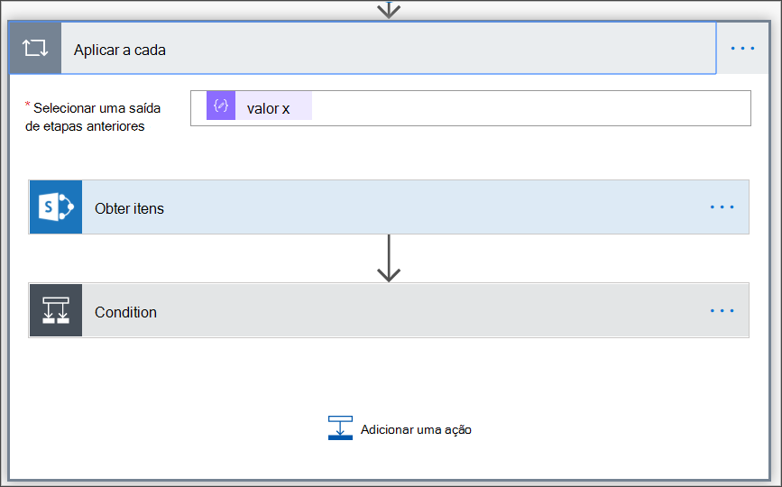

    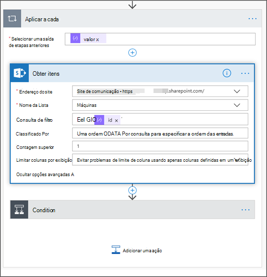

11. <span data-ttu-id="69508-152">Em **Condição**, adicione a seguinte expressão: "length(body('Get_items')?[' value'])" e de definir a condição como igual a 0.</span><span class="sxs-lookup"><span data-stu-id="69508-152">Under **Condition**, add the following expression: "length(body('Get_items')?['value'])" and set the condition to equal to 0.</span></span>

    <span data-ttu-id="69508-153">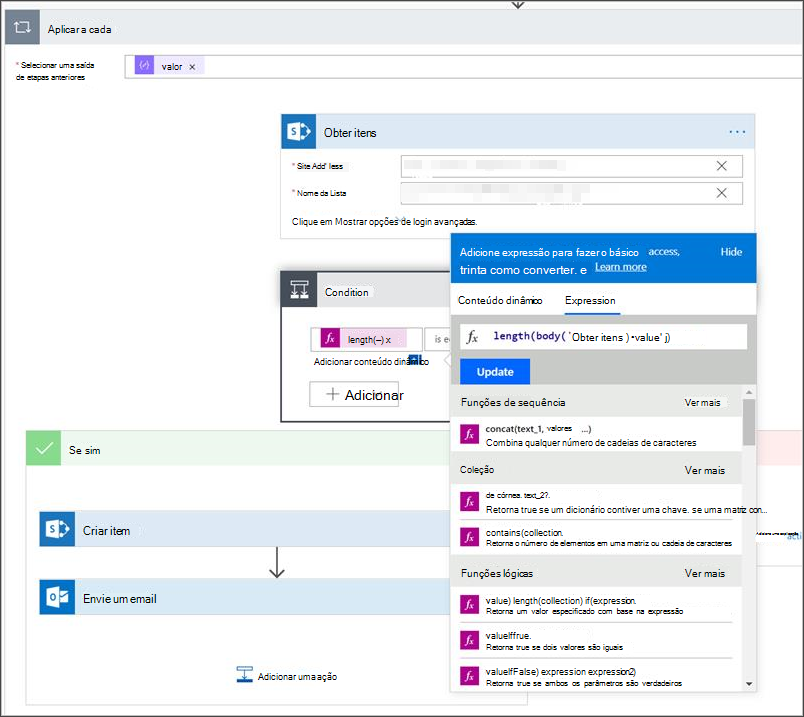</span><span class="sxs-lookup"><span data-stu-id="69508-153"></span></span>  
    <span data-ttu-id="69508-154">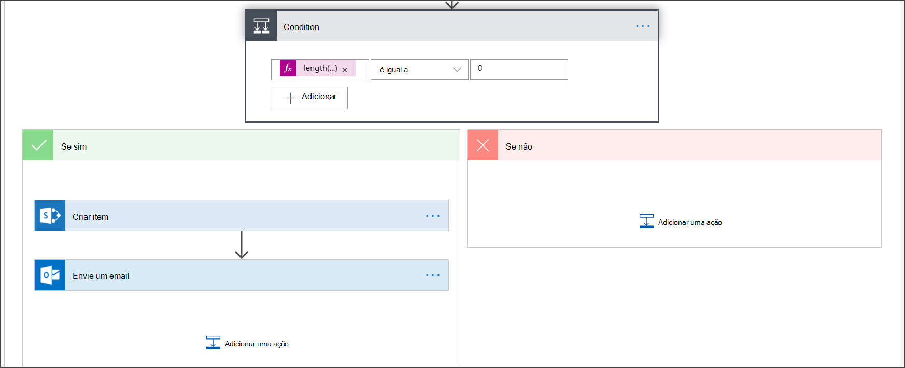 
     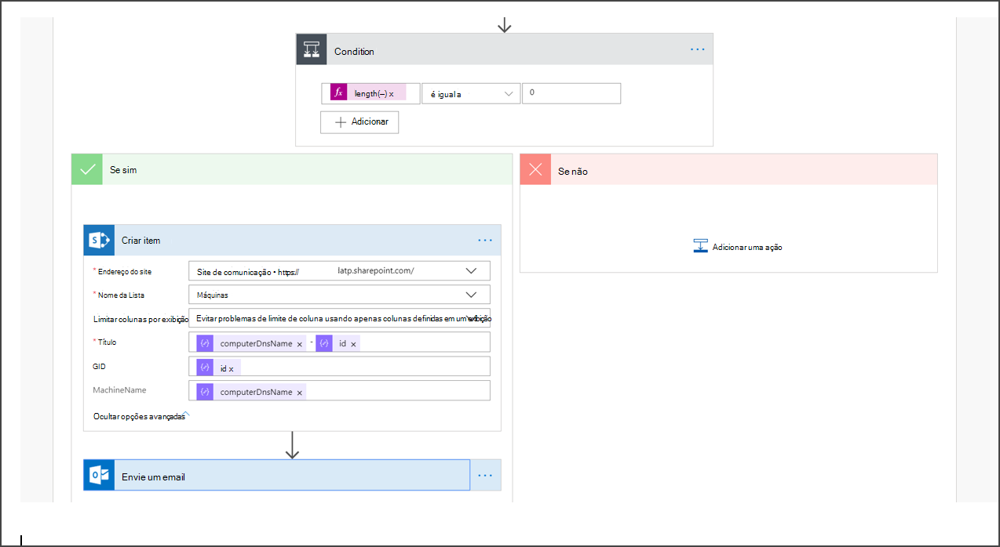</span><span class="sxs-lookup"><span data-stu-id="69508-154"> 
    </span></span>  
<span data-ttu-id="69508-155">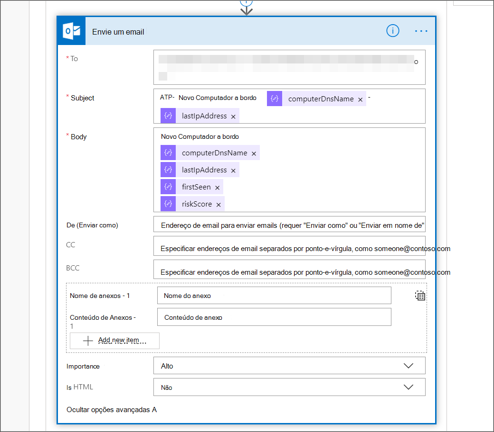</span><span class="sxs-lookup"><span data-stu-id="69508-155"></span></span>

## <a name="alert-notification"></a><span data-ttu-id="69508-156">Notificação de alerta</span><span class="sxs-lookup"><span data-stu-id="69508-156">Alert notification</span></span>
<span data-ttu-id="69508-157">A imagem a seguir é um exemplo de uma notificação de email.</span><span class="sxs-lookup"><span data-stu-id="69508-157">The following image is an example of an email notification.</span></span>

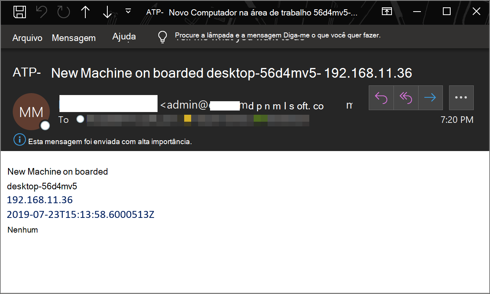


## <a name="tips"></a><span data-ttu-id="69508-159">Dicas </span><span class="sxs-lookup"><span data-stu-id="69508-159">Tips</span></span>

- <span data-ttu-id="69508-160">Você pode filtrar aqui usando somente lastSeen:</span><span class="sxs-lookup"><span data-stu-id="69508-160">You can filter here using lastSeen only:</span></span>
    - <span data-ttu-id="69508-161">A cada 60 minutos:</span><span class="sxs-lookup"><span data-stu-id="69508-161">Every 60 min:</span></span>
      - <span data-ttu-id="69508-162">Pegue todos os dispositivos vistos pela última vez nos últimos 7 dias.</span><span class="sxs-lookup"><span data-stu-id="69508-162">Take all devices last seen in the past 7 days.</span></span> 

- <span data-ttu-id="69508-163">Para cada dispositivo:</span><span class="sxs-lookup"><span data-stu-id="69508-163">For each device:</span></span> 
    - <span data-ttu-id="69508-164">Se a propriedade visto pela última vez estiver no intervalo de uma hora de [-7 dias, -7days + 60 minutos ] -> Alerta para possibilidade de offboard.</span><span class="sxs-lookup"><span data-stu-id="69508-164">If last seen property is on the one hour interval of [-7 days, -7days + 60 minutes ] -> Alert for offboarding possibility.</span></span>
    - <span data-ttu-id="69508-165">Se visto pela primeira vez está na última hora -> Alerta para integração.</span><span class="sxs-lookup"><span data-stu-id="69508-165">If first seen is on the past hour -> Alert for onboarding.</span></span>

<span data-ttu-id="69508-166">Nesta solução, você não terá alertas duplicados: há locatários com vários dispositivos.</span><span class="sxs-lookup"><span data-stu-id="69508-166">In this solution you will not have duplicate alerts: There are tenants that have numerous devices.</span></span> <span data-ttu-id="69508-167">Obter todos esses dispositivos pode ser muito caro e pode exigir paging.</span><span class="sxs-lookup"><span data-stu-id="69508-167">Getting all those devices might be very expensive and might require paging.</span></span>

<span data-ttu-id="69508-168">Você pode dividi-lo em duas consultas:</span><span class="sxs-lookup"><span data-stu-id="69508-168">You can split it to two queries:</span></span> 
1.  <span data-ttu-id="69508-169">Para o offboard, use apenas esse intervalo usando o $filter OData e notifique somente se as condições são atendidas.</span><span class="sxs-lookup"><span data-stu-id="69508-169">For offboarding take only this interval using the OData $filter and only notify if the conditions are met.</span></span>
2.  <span data-ttu-id="69508-170">Pegue todos os dispositivos vistos pela última vez na última hora e verifique a propriedade vista pela primeira vez para eles (se a primeira propriedade vista está na última hora, a última vista deve estar lá também).</span><span class="sxs-lookup"><span data-stu-id="69508-170">Take all devices last seen in the past hour and check first seen property for them (if the first seen property is on the past hour, the last seen must be there too).</span></span> 

