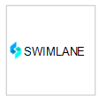
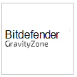

# Aplicativos parceiros no Microsoft Defender para Ponto de Extremidade 

[!INCLUDE [Microsoft 365 Defender rebranding](../../includes/microsoft-defender.md)]

**Aplica-se a:**
- [Microsoft Defender para Ponto de Extremidade](https://go.microsoft.com/fwlink/p/?linkid=2146631)
- [Microsoft 365 Defender](https://go.microsoft.com/fwlink/?linkid=2118804)

> Deseja experimentar o Microsoft Defender para Ponto de Extremidade? [Inscreva-se para uma avaliação gratuita.](https://www.microsoft.com/microsoft-365/windows/microsoft-defender-atp?ocid=docs-wdatp-exposedapis-abovefoldlink)

O Defender for Endpoint oferece suporte a aplicativos de terceiros para ajudar a aprimorar os recursos de detecção, investigação e inteligência contra ameaças da plataforma.

O suporte para soluções de terceiros ajuda a simplificar, integrar e orquestrar ainda mais as defesas de outros fornecedores com o Microsoft Defender para o Ponto de Extremidade; permitindo que as equipes de segurança respondam melhor a ameaças modernas.

O Microsoft Defender para Ponto de Extremidade integra-se perfeitamente às soluções de segurança existentes. A integração fornece integração com as seguintes soluções, como:

- SIEM
- Soluções de gerenciamento de tíquetes e serviços de TI
- Provedores de serviços de segurança gerenciados (MSSP)
- Ingestões e correspondência de indicadores IoC
- Investigação e correção de dispositivos automatizados com base em alertas externos
- Integração com sistemas de controle de segurança e resposta de automação (SOAR)

## Aplicativos com suporte

### Informações e análises de segurança

Logotipo |Nome do parceiro   | Descrição 
:---|:---|:---
| [Plataforma AttackIQ](https://go.microsoft.com/fwlink/?linkid=2103502) | A Plataforma AttackIQ valida que o Defender para Ponto de Extremidade está configurado corretamente iniciando ataques contínuos com segurança em ativos de produção
| [AzureSentinel](https://go.microsoft.com/fwlink/?linkid=2135705) | Transmitir alertas do Microsoft Defender para Ponto de Extremidade no Azure Sentinel 
 | [Cymulate](https://go.microsoft.com/fwlink/?linkid=2135574)| Correlacionar as descobertas do Defender para o Ponto de Extremidade com ataques simulados para validar ações de detecção precisas e de resposta eficazes
 | [Segurança Elástica](https://go.microsoft.com/fwlink/?linkid=2139303) | A Segurança Elástica é uma solução livre e aberta para evitar, detectar e responder a ameaças
 | [IBM QRadar](https://go.microsoft.com/fwlink/?linkid=2113903) | Configurar o IBM QRadar para coletar detecções do Defender para o Ponto de Extremidade 
 | [Micro Focus ArcSight](https://go.microsoft.com/fwlink/?linkid=2113548) | Usar o Micro Focus ArcSight para puxar o Defender para detecções de ponto de extremidade
 | [RSA NetWitness](https://go.microsoft.com/fwlink/?linkid=2118566) | Stream Defender for Endpoint Alerts to RSA NetWitness using Microsoft Graph Security API
 | [SafeBreach](https://go.microsoft.com/fwlink/?linkid=2114114)| Obtenha visibilidade sobre eventos de segurança do Defender para Ponto de Extremidade que são correlacionados automaticamente com simulações safeBreach
 | [Controle de Vulnerabilidade do Skybox](https://go.microsoft.com/fwlink/?linkid=2127467) | O Controle de Vulnerabilidade do Skybox corta o ruído do gerenciamento de vulnerabilidades, correlacionando o contexto de negócios, rede e ameaças para descobrir suas vulnerabilidades mais arriscadas
 | [Splunk](https://go.microsoft.com/fwlink/?linkid=2129805) | O Complemento do Defender para Ponto de Extremidade permite que os usuários do Splunk ingeram todos os alertas e informações de suporte para seu Splunk
 | [XM Cyber](https://go.microsoft.com/fwlink/?linkid=2136700) | Priorizar sua resposta a um alerta com base em fatores de risco e ativos de alto valor

### Orquestração e automação

Logotipo |Nome do parceiro   | Descrição 
:---|:---|:---
 | [CyberSponse CyOps](https://go.microsoft.com/fwlink/?linkid=2115943) | CyOps se integra ao Defender para Ponto de Extremidade para automatizar os playbooks de resposta a incidentes de alta velocidade dos clientes
 | [Risco Delta ActiveEye](https://go.microsoft.com/fwlink/?linkid=2127468) | O Risco Delta, um provedor líder de serviços soc-as-service e segurança, integra o Defender para Ponto de Extremidade com sua plataforma DESL nativa na nuvem, ActiveEye.
 | [Demisto, uma empresa de redes de Palo Alto](https://go.microsoft.com/fwlink/?linkid=2108414) | A Demisto se integra ao Defender para o Ponto de Extremidade para permitir que as equipes de segurança orquestrem e automatizem o monitoramento, o enriquecimento e a resposta de segurança do ponto de extremidade
 | [Funções do Microsoft Flow & Azure](https://go.microsoft.com/fwlink/?linkid=2114300) | Use o Defender for Endpoint connectors for Azure Logic Apps & Microsoft Flow para automatizar procedimentos de segurança
 | [Rapid7 InsightConnect](https://go.microsoft.com/fwlink/?linkid=2116040) | O InsightConnect integra-se ao Defender para o Ponto de Extremidade para acelerar, simplificar e integrar seus processos de segurança com muito tempo de uso
 | [ServiceNow](https://go.microsoft.com/fwlink/?linkid=2135621) | Ingerir alertas na solução operações de segurança serviceNow com base na integração da API do Microsoft Graph
 | [Marmundo](https://go.microsoft.com/fwlink/?linkid=2113902) | Maximizar os recursos de resposta a incidentes que utilizam o Nadaldo e o Defender para o Ponto de Extremidade juntos

### Inteligência contra ameaças

Logotipo |Nome do parceiro   | Descrição 
:---|:---|:---
 | [MISP (Plataforma de Compartilhamento de Informações de Malware)](https://go.microsoft.com/fwlink/?linkid=2127543) | Integrar indicadores de ameaça da Plataforma de Compartilhamento de Inteligência contra Ameaças de Código Aberto ao seu ambiente do Defender para Ponto de Extremidade
 | [Palo Alto Networks](https://go.microsoft.com/fwlink/?linkid=2099582) | Enriquecer sua proteção de ponto de extremidade estendendo o Autofocus e outros feeds de ameaça para o Defender para Ponto de Extremidade usando o MineMeld
 | [ThreatConnect](https://go.microsoft.com/fwlink/?linkid=2114115) | Alert and/or block on custom threat intelligence from ThreatConnect Playbooks using Defender for Endpoint indicators

### Segurança de rede
Logotipo |Nome do parceiro   | Descrição 
:---|:---|:---
 | [Aruba ClearPass Policy Manager](https://go.microsoft.com/fwlink/?linkid=2127544) | Verifique se o Defender para Ponto de Extremidade está instalado e atualizado em cada ponto de extremidade antes de permitir o acesso à rede
 | [Hexagonal Azul para Rede](https://go.microsoft.com/fwlink/?linkid=2104613) | O Hexagon Azul criou a primeira plataforma de aprendizado profundo em tempo real do setor para proteção contra ameaças de rede
 | [CyberMDX](https://go.microsoft.com/fwlink/?linkid=2135620) | O Cyber MDX integra visibilidade, prevenção e repouso de ativos de saúde abrangentes ao seu ambiente do Defender para Ponto de Extremidade
 |[Detecção e resposta de rede do Vectra (NDR)](https://go.microsoft.com/fwlink/?linkid=866934)| O Vectra aplica AI & pesquisa de segurança para detectar e responder a ataques cibernéticos em tempo real

### Plataforma cruzada
Logotipo |Nome do parceiro   | Descrição 
:---|:---|:---
| [Bitdefender](https://go.microsoft.com/fwlink/?linkid=860032)| Bitdefender GravityZone é uma plataforma de proteção de ponto de extremidade de próxima geração em camadas que oferece proteção abrangente contra o espectro completo de ameaças cibernéticas sofisticadas
 | [Better Mobile](https://go.microsoft.com/fwlink/?linkid=2086214)| Solução MTD baseada em AI para parar ameaças móveis & phishing. Navegação privada na Internet para proteger a privacidade do usuário 
| [Corrata](https://go.microsoft.com/fwlink/?linkid=2081148) | Solução móvel — proteja seus dispositivos móveis com visibilidade granular e controle de Corrata 
| [Mirante](https://go.microsoft.com/fwlink/?linkid=866935)| Obter telemetria da Proteção Móvel contra Ameaças do Mirante para dispositivos móveis Android e iOS
 | [Symantec Endpoint Protection Mobile](https://go.microsoft.com/fwlink/?linkid=2090992)| O SEP Mobile ajuda as empresas a prever, detectar e evitar ameaças e vulnerabilidades de segurança em dispositivos móveis 
| [Zimperium](https://go.microsoft.com/fwlink/?linkid=2118044)|Estender seu Defender para Ponto de Extremidade para iOS e Android com a Defesa contra Ameaças Móveis baseada em Aprendizado de Máquina

## Outras integrações

Logotipo |Nome do parceiro   | Descrição 
:---|:---|:---
| [Filtro Web Cyren](https://go.microsoft.com/fwlink/?linkid=2108221)| Aprimorar seu Defender para Ponto de Extremidade com Filtragem da Web avançada
| [Morphisec](https://go.microsoft.com/fwlink/?linkid=2086215)| Fornece prevenção avançada contra ameaças movidas a defesa de destino. Integra dados forenses diretamente nos painéis do Centro de Segurança do WD para ajudar a priorizar alertas, determinar a pontuação de risco do dispositivo e visualizar a linha do tempo de ataque completa, incluindo informações de memória internas
| [Nuvem DO THOR](https://go.microsoft.com/fwlink/?linkid=862988)| Fornece verificações forenses ao vivo sob demanda usando uma base de assinatura com foco em ameaças persistentes

## Integração siem
O Defender para Ponto de Extremidade oferece suporte à integração siem por meio de vários métodos. Isso pode incluir interface de sistema SIEM especializada com conectores de caixa de entrada, uma API de alerta genérica habilitando implementações personalizadas e uma API de ação habilitando o gerenciamento de status de alerta.  Para obter mais informações, consulte [Enable SIEM integration](enable-siem-integration.md).

## Gerenciamento de tíquetes e serviços de IT 
A integração com a solução de tíquete ajuda a implementar processos de resposta manuais e automáticos. O Defender for Endpoint pode ajudar a criar tíquetes automaticamente quando um alerta é gerado e resolver os alertas quando os tíquetes são fechados usando a API de alertas. 

## Integração de resposta de automação e orquestração de segurança (SOAR) 
As soluções de orquestração podem ajudar a criar playbooks e integrar o modelo de dados e ações rich que as APIs do Defender for Endpoint expõem a respostas de orquestração, como consulta para dados de dispositivo, disparar isolamento de dispositivo, bloquear/permitir, resolver alerta e outros. 

## Correlação de alerta externo e investigação automatizada e correção  
O Defender for Endpoint oferece recursos exclusivos de investigação e correção automatizadas para impulsionar a resposta a incidentes em escala.
  
A integração do recurso de investigação e resposta automatizada com outras soluções, como IDS e firewalls, ajuda a resolver alertas e minimizar as complexidades em torno da correlação de sinal de rede e dispositivo, simplificando efetivamente as ações de investigação e correção de ameaças em dispositivos.  

Alertas externos podem ser pressionados para o Defender para o Ponto de Extremidade. Esses alertas são mostrados lado a lado com alertas adicionais baseados em dispositivo do Defender para Ponto de Extremidade. Essa exibição fornece um contexto completo do alerta e pode revelar o histórico completo de um ataque.  

## Correspondência de indicadores
Você pode usar a inteligência contra ameaças de provedores e agregadores para manter e usar indicadores de comprometimento (IOCs).

O Defender for Endpoint permite que você se integre a essas soluções e aja em IoCs correlacionando a telemetria avançada para criar alertas.  Você também pode usar recursos de prevenção e resposta automatizada para bloquear a execução e executar ações de correção quando houver uma combinação.

O Defender for Endpoint atualmente dá suporte à correspondência e à correção de IOC para indicadores de arquivo e rede. O bloqueio é suportado para indicadores de arquivo.  

## Suporte para plataformas que não são do Windows
O Defender for Endpoint fornece uma experiência centralizada de operações de segurança para o Windows e plataformas que não são do Windows, incluindo dispositivos móveis. Você poderá ver alertas de vários sistemas operacionais com suporte (SO) no portal e proteger melhor a rede da sua organização. 
