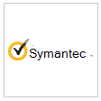

# Aplicativos parceiros no Microsoft Defender para Ponto de ExtremidadePartner applications in Microsoft Defender for Endpoint 

[!INCLUDE [Microsoft 365 Defender rebranding](../../includes/microsoft-defender.md)]

**Aplica-se a:****Applies to:**
- [Microsoft Defender para Ponto de ExtremidadeMicrosoft Defender for Endpoint](https://go.microsoft.com/fwlink/p/?linkid=2146631)
- [Microsoft 365 DefenderMicrosoft 365 Defender](https://go.microsoft.com/fwlink/?linkid=2118804)

> Deseja experimentar o Microsoft Defender para Ponto de Extremidade?Want to experience Microsoft Defender for Endpoint? [Inscreva-se para uma avaliação gratuita.Sign up for a free trial.](https://www.microsoft.com/microsoft-365/windows/microsoft-defender-atp?ocid=docs-wdatp-exposedapis-abovefoldlink)

O Defender for Endpoint oferece suporte a aplicativos de terceiros para ajudar a aprimorar os recursos de detecção, investigação e inteligência contra ameaças da plataforma.Defender for Endpoint supports third-party applications to help enhance the detection, investigation, and threat intelligence capabilities of the platform.

O suporte para soluções de terceiros ajuda a simplificar, integrar e orquestrar ainda mais as defesas de outros fornecedores com o Microsoft Defender para o Ponto de Extremidade; permitindo que as equipes de segurança respondam melhor a ameaças modernas.The support for third-party solutions helps to further streamline, integrate, and orchestrate defenses from other vendors with Microsoft Defender for Endpoint; enabling security teams to effectively respond better to modern threats.

O Microsoft Defender para Ponto de Extremidade integra-se perfeitamente às soluções de segurança existentes.Microsoft Defender for Endpoint seamlessly integrates with existing security solutions. A integração fornece integração com as seguintes soluções, como:The integration provides integration with the following solutions such as:

- SIEMSIEM
- Soluções de gerenciamento de tíquetes e serviços de TITicketing and IT service management solutions
- Provedores de serviços de segurança gerenciados (MSSP)Managed security service providers (MSSP)
- Ingestões e correspondência de indicadores IoCIoC indicators ingestions and matching
- Investigação e correção de dispositivos automatizados com base em alertas externosAutomated device investigation and remediation based on external alerts
- Integração com sistemas de controle de segurança e resposta de automação (SOAR)Integration with Security orchestration and automation response (SOAR) systems

## Aplicativos com suporteSupported applications

### Informações e análises de segurançaSecurity information and analytics

LogotipoLogo |Nome do parceiroPartner name   | DescriçãoDescription 
:---|:---|:---
| [Plataforma AttackIQAttackIQ Platform](https://go.microsoft.com/fwlink/?linkid=2103502) | A Plataforma AttackIQ valida que o Defender para Ponto de Extremidade está configurado corretamente iniciando ataques contínuos com segurança em ativos de produçãoAttackIQ Platform validates Defender for Endpoint is configured properly by launching continuous attacks safely on production assets
| [AzureSentinelAzureSentinel](https://go.microsoft.com/fwlink/?linkid=2135705) | Transmitir alertas do Microsoft Defender para Ponto de Extremidade no Azure SentinelStream alerts from Microsoft Defender for Endpoint into Azure Sentinel 
 | [CymulateCymulate](https://go.microsoft.com/fwlink/?linkid=2135574)| Correlacionar as descobertas do Defender para o Ponto de Extremidade com ataques simulados para validar ações de detecção precisas e de resposta eficazesCorrelate Defender for Endpoint findings with simulated attacks to validate accurate detection and effective response actions
 | [Segurança ElásticaElastic Security](https://go.microsoft.com/fwlink/?linkid=2139303) | A Segurança Elástica é uma solução livre e aberta para evitar, detectar e responder a ameaçasElastic Security is a free and open solution for preventing, detecting, and responding to threats
 | [IBM QRadarIBM QRadar](https://go.microsoft.com/fwlink/?linkid=2113903) | Configurar o IBM QRadar para coletar detecções do Defender para o Ponto de ExtremidadeConfigure IBM QRadar to collect detections from Defender for Endpoint 
 | [Micro Focus ArcSightMicro Focus ArcSight](https://go.microsoft.com/fwlink/?linkid=2113548) | Usar o Micro Focus ArcSight para puxar o Defender para detecções de ponto de extremidadeUse Micro Focus ArcSight to pull Defender for Endpoint detections
 | [RSA NetWitnessRSA NetWitness](https://go.microsoft.com/fwlink/?linkid=2118566) | Stream Defender for Endpoint Alerts to RSA NetWitness using Microsoft Graph Security APIStream Defender for Endpoint Alerts to RSA NetWitness using Microsoft Graph Security API
 | [SafeBreachSafeBreach](https://go.microsoft.com/fwlink/?linkid=2114114)| Obtenha visibilidade sobre eventos de segurança do Defender para Ponto de Extremidade que são correlacionados automaticamente com simulações safeBreachGain visibility into Defender for Endpoint security events that are automatically correlated with SafeBreach simulations
 | [Controle de Vulnerabilidade do SkyboxSkybox Vulnerability Control](https://go.microsoft.com/fwlink/?linkid=2127467) | O Controle de Vulnerabilidade do Skybox corta o ruído do gerenciamento de vulnerabilidades, correlacionando o contexto de negócios, rede e ameaças para descobrir suas vulnerabilidades mais arriscadasSkybox Vulnerability Control cuts through the noise of vulnerability management, correlating business, network, and threat context to uncover your riskiest vulnerabilities
 | [SplunkSplunk](https://go.microsoft.com/fwlink/?linkid=2129805) | O Complemento do Defender para Ponto de Extremidade permite que os usuários do Splunk ingeram todos os alertas e informações de suporte para seu SplunkThe Defender for Endpoint Add-on allows Splunk users to ingest all of the alerts and supporting information to their Splunk
 | [XM CyberXM Cyber](https://go.microsoft.com/fwlink/?linkid=2136700) | Priorizar sua resposta a um alerta com base em fatores de risco e ativos de alto valorPrioritize your response to an alert based on risk factors and high value assets

### Orquestração e automaçãoOrchestration and automation

LogotipoLogo |Nome do parceiroPartner name   | DescriçãoDescription 
:---|:---|:---
 | [CyberSponse CyOpsCyberSponse CyOps](https://go.microsoft.com/fwlink/?linkid=2115943) | CyOps se integra ao Defender para Ponto de Extremidade para automatizar os playbooks de resposta a incidentes de alta velocidade dos clientesCyOps integrates with Defender for Endpoint to automate customers' high-speed incident response playbooks
 | [Risco Delta ActiveEyeDelta Risk ActiveEye](https://go.microsoft.com/fwlink/?linkid=2127468) | O Risco Delta, um provedor líder de serviços soc-as-service e segurança, integra o Defender para Ponto de Extremidade com sua plataforma DESL nativa na nuvem, ActiveEye.Delta Risk, a leading provider of SOC-as-a-Service and security services, integrate Defender for Endpoint with its cloud-native SOAR platform, ActiveEye.
 | [Demisto, uma empresa de redes de Palo AltoDemisto, a Palo Alto Networks Company](https://go.microsoft.com/fwlink/?linkid=2108414) | A Demisto se integra ao Defender para o Ponto de Extremidade para permitir que as equipes de segurança orquestrem e automatizem o monitoramento, o enriquecimento e a resposta de segurança do ponto de extremidadeDemisto integrates with Defender for Endpoint to enable security teams to orchestrate and automate endpoint security monitoring, enrichment, and response
 | [Funções do Microsoft Flow & AzureMicrosoft Flow & Azure Functions](https://go.microsoft.com/fwlink/?linkid=2114300) | Use o Defender for Endpoint connectors for Azure Logic Apps & Microsoft Flow para automatizar procedimentos de segurançaUse the Defender for Endpoint connectors for Azure Logic Apps & Microsoft Flow to automating security procedures
 | [Rapid7 InsightConnectRapid7 InsightConnect](https://go.microsoft.com/fwlink/?linkid=2116040) | O InsightConnect integra-se ao Defender para o Ponto de Extremidade para acelerar, simplificar e integrar seus processos de segurança com muito tempo de usoInsightConnect integrates with Defender for Endpoint to accelerate, streamline, and integrate your time-intensive security processes
 | [ServiceNowServiceNow](https://go.microsoft.com/fwlink/?linkid=2135621) | Ingerir alertas na solução operações de segurança serviceNow com base na integração da API do Microsoft GraphIngest alerts into ServiceNow Security Operations solution based on Microsoft Graph API integration
 | [MarmundoSwimlane](https://go.microsoft.com/fwlink/?linkid=2113902) | Maximizar os recursos de resposta a incidentes que utilizam o Nadaldo e o Defender para o Ponto de Extremidade juntosMaximize incident response capabilities utilizing Swimlane and Defender for Endpoint together

### Inteligência contra ameaçasThreat intelligence

LogotipoLogo |Nome do parceiroPartner name   | DescriçãoDescription 
:---|:---|:---
 | [MISP (Plataforma de Compartilhamento de Informações de Malware)MISP (Malware Information Sharing Platform)](https://go.microsoft.com/fwlink/?linkid=2127543) | Integrar indicadores de ameaça da Plataforma de Compartilhamento de Inteligência contra Ameaças de Código Aberto ao seu ambiente do Defender para Ponto de ExtremidadeIntegrate threat indicators from the Open Source Threat Intelligence Sharing Platform into your Defender for Endpoint environment
 | [Palo Alto NetworksPalo Alto Networks](https://go.microsoft.com/fwlink/?linkid=2099582) | Enriquecer sua proteção de ponto de extremidade estendendo o Autofocus e outros feeds de ameaça para o Defender para Ponto de Extremidade usando o MineMeldEnrich your endpoint protection by extending Autofocus and other threat feeds to Defender for Endpoint using MineMeld
 | [ThreatConnectThreatConnect](https://go.microsoft.com/fwlink/?linkid=2114115) | Alert and/or block on custom threat intelligence from ThreatConnect Playbooks using Defender for Endpoint indicatorsAlert and/or block on custom threat intelligence from ThreatConnect Playbooks using Defender for Endpoint indicators

### Segurança de redeNetwork security
LogotipoLogo |Nome do parceiroPartner name   | DescriçãoDescription 
:---|:---|:---
 | [Aruba ClearPass Policy ManagerAruba ClearPass Policy Manager](https://go.microsoft.com/fwlink/?linkid=2127544) | Verifique se o Defender para Ponto de Extremidade está instalado e atualizado em cada ponto de extremidade antes de permitir o acesso à redeEnsure Defender for Endpoint is installed and updated on each endpoint before allowing access to the network
 | [Hexagonal Azul para RedeBlue Hexagon for Network](https://go.microsoft.com/fwlink/?linkid=2104613) | O Hexagon Azul criou a primeira plataforma de aprendizado profundo em tempo real do setor para proteção contra ameaças de redeBlue Hexagon has built the industry's first real-time deep learning platform for network threat protection
 | [CyberMDXCyberMDX](https://go.microsoft.com/fwlink/?linkid=2135620) | O Cyber MDX integra visibilidade, prevenção e repouso de ativos de saúde abrangentes ao seu ambiente do Defender para Ponto de ExtremidadeCyber MDX integrates comprehensive healthcare assets visibility, threat prevention and repose into your Defender for Endpoint environment
 |[Detecção e resposta de rede do Vectra (NDR)Vectra Network Detection and Response (NDR)](https://go.microsoft.com/fwlink/?linkid=866934)| O Vectra aplica AI & pesquisa de segurança para detectar e responder a ataques cibernéticos em tempo realVectra applies AI & security research to detect and respond to cyber-attacks in real time

### Plataforma cruzadaCross platform
LogotipoLogo |Nome do parceiroPartner name   | DescriçãoDescription 
:---|:---|:---
| [BitdefenderBitdefender](https://go.microsoft.com/fwlink/?linkid=860032)| Bitdefender GravityZone é uma plataforma de proteção de ponto de extremidade de próxima geração em camadas que oferece proteção abrangente contra o espectro completo de ameaças cibernéticas sofisticadasBitdefender GravityZone is a layered next generation endpoint protection platform offering comprehensive protection against the full spectrum of sophisticated cyber threats
 | [Better MobileBetter Mobile](https://go.microsoft.com/fwlink/?linkid=2086214)| Solução MTD baseada em AI para parar ameaças móveis & phishing.AI-based MTD solution to stop mobile threats & phishing. Navegação privada na Internet para proteger a privacidade do usuárioPrivate internet browsing to protect user privacy 
| [CorrataCorrata](https://go.microsoft.com/fwlink/?linkid=2081148) | Solução móvel — proteja seus dispositivos móveis com visibilidade granular e controle de CorrataMobile solution — Protect your mobile devices with granular visibility and control from Corrata 
| [MiranteLookout](https://go.microsoft.com/fwlink/?linkid=866935)| Obter telemetria da Proteção Móvel contra Ameaças do Mirante para dispositivos móveis Android e iOSGet Lookout Mobile Threat Protection telemetry for Android and iOS mobile devices
 | [Symantec Endpoint Protection MobileSymantec Endpoint Protection Mobile](https://go.microsoft.com/fwlink/?linkid=2090992)| O SEP Mobile ajuda as empresas a prever, detectar e evitar ameaças e vulnerabilidades de segurança em dispositivos móveisSEP Mobile helps businesses predict, detect, and prevent security threats and vulnerabilities on mobile devices 
| [ZimperiumZimperium](https://go.microsoft.com/fwlink/?linkid=2118044)|Estender seu Defender para Ponto de Extremidade para iOS e Android com a Defesa contra Ameaças Móveis baseada em Aprendizado de MáquinaExtend your Defender for Endpoint to iOS and Android with Machine Learning-based Mobile Threat Defense

## Outras integraçõesOther integrations

LogotipoLogo |Nome do parceiroPartner name   | DescriçãoDescription 
:---|:---|:---
| [Filtro Web CyrenCyren Web Filter](https://go.microsoft.com/fwlink/?linkid=2108221)| Aprimorar seu Defender para Ponto de Extremidade com Filtragem da Web avançadaEnhance your Defender for Endpoint with advanced Web Filtering
| [MorphisecMorphisec](https://go.microsoft.com/fwlink/?linkid=2086215)| Fornece prevenção avançada contra ameaças movidas a defesa de destino.Provides Moving Target Defense-powered advanced threat prevention. Integra dados forenses diretamente nos painéis do Centro de Segurança do WD para ajudar a priorizar alertas, determinar a pontuação de risco do dispositivo e visualizar a linha do tempo de ataque completa, incluindo informações de memória internasIntegrates forensics data directly into WD Security Center dashboards to help prioritize alerts, determine device at-risk score and visualize full attack timeline including internal memory information
| [Nuvem DO THORTHOR Cloud](https://go.microsoft.com/fwlink/?linkid=862988)| Fornece verificações forenses ao vivo sob demanda usando uma base de assinatura com foco em ameaças persistentesProvides on-demand live forensics scans using a signature base with focus on persistent threats

## Integração siemSIEM integration
O Defender para Ponto de Extremidade oferece suporte à integração siem por meio de vários métodos.Defender for Endpoint supports SIEM integration through various of methods. Isso pode incluir interface de sistema SIEM especializada com conectores de caixa de entrada, uma API de alerta genérica habilitando implementações personalizadas e uma API de ação habilitando o gerenciamento de status de alerta.This can include specialized SIEM system interface with out of the box connectors, a generic alert API enabling custom implementations, and an action API enabling alert status management.  Para obter mais informações, consulte [Enable SIEM integration](enable-siem-integration.md).For more information, see [Enable SIEM integration](enable-siem-integration.md).

## Gerenciamento de tíquetes e serviços de ITTicketing and IT service management 
A integração com a solução de tíquete ajuda a implementar processos de resposta manuais e automáticos.Ticketing solution integration helps to implement manual and automatic response processes. O Defender for Endpoint pode ajudar a criar tíquetes automaticamente quando um alerta é gerado e resolver os alertas quando os tíquetes são fechados usando a API de alertas.Defender for Endpoint can help to create tickets automatically when an alert is generated and resolve the alerts when tickets are closed using the alerts API. 

## Integração de resposta de automação e orquestração de segurança (SOAR)Security orchestration and automation response (SOAR) integration 
As soluções de orquestração podem ajudar a criar playbooks e integrar o modelo de dados e ações rich que as APIs do Defender for Endpoint expõem a respostas de orquestração, como consulta para dados de dispositivo, disparar isolamento de dispositivo, bloquear/permitir, resolver alerta e outros.Orchestration solutions can help build playbooks and integrate the rich data model and actions that Defender for Endpoint APIs exposes to orchestrate responses, such as query for device data, trigger device isolation, block/allow, resolve alert and others. 

## Correlação de alerta externo e investigação automatizada e correçãoExternal alert correlation and Automated investigation and remediation  
O Defender for Endpoint oferece recursos exclusivos de investigação e correção automatizadas para impulsionar a resposta a incidentes em escala.Defender for Endpoint offers unique automated investigation and remediation capabilities to drive incident response at scale.
  
A integração do recurso de investigação e resposta automatizada com outras soluções, como IDS e firewalls, ajuda a resolver alertas e minimizar as complexidades em torno da correlação de sinal de rede e dispositivo, simplificando efetivamente as ações de investigação e correção de ameaças em dispositivos.Integrating the automated investigation and response capability with other solutions such as IDS and firewalls help to address alerts and minimize the complexities surrounding network and device signal correlation, effectively streamlining the investigation and threat remediation actions on devices.  

Alertas externos podem ser pressionados para o Defender para o Ponto de Extremidade.External alerts can be pushed to Defender for Endpoint. Esses alertas são mostrados lado a lado com alertas adicionais baseados em dispositivo do Defender para Ponto de Extremidade.These alerts are shown side by side with additional device-based alerts from Defender for Endpoint. Essa exibição fornece um contexto completo do alerta e pode revelar o histórico completo de um ataque.This view provides a full context of the alert and can reveal the full story of an attack.  

## Correspondência de indicadoresIndicators matching
Você pode usar a inteligência contra ameaças de provedores e agregadores para manter e usar indicadores de comprometimento (IOCs).You can use threat-intelligence from providers and aggregators to maintain and use indicators of compromise (IOCs).

O Defender for Endpoint permite que você se integre a essas soluções e aja em IoCs correlacionando a telemetria avançada para criar alertas.Defender for Endpoint allows you to integrate with these solutions and act on IoCs by correlating rich telemetry to create alerts.  Você também pode usar recursos de prevenção e resposta automatizada para bloquear a execução e executar ações de correção quando houver uma combinação.You can also use prevention and automated response capabilities to block execution and take remediation actions when there's a match.

O Defender for Endpoint atualmente dá suporte à correspondência e à correção de IOC para indicadores de arquivo e rede.Defender for Endpoint currently supports IOC matching and remediation for file and network indicators. O bloqueio é suportado para indicadores de arquivo.Blocking is supported for file indicators.  

## Suporte para plataformas que não são do WindowsSupport for non-Windows platforms
O Defender for Endpoint fornece uma experiência centralizada de operações de segurança para o Windows e plataformas que não são do Windows, incluindo dispositivos móveis.Defender for Endpoint provides a centralized security operations experience for Windows and non-Windows platforms, including mobile devices. Você poderá ver alertas de vários sistemas operacionais com suporte (SO) no portal e proteger melhor a rede da sua organização.You'll be able to see alerts from various supported operating systems (OS) in the portal and better protect your organization's network. 
