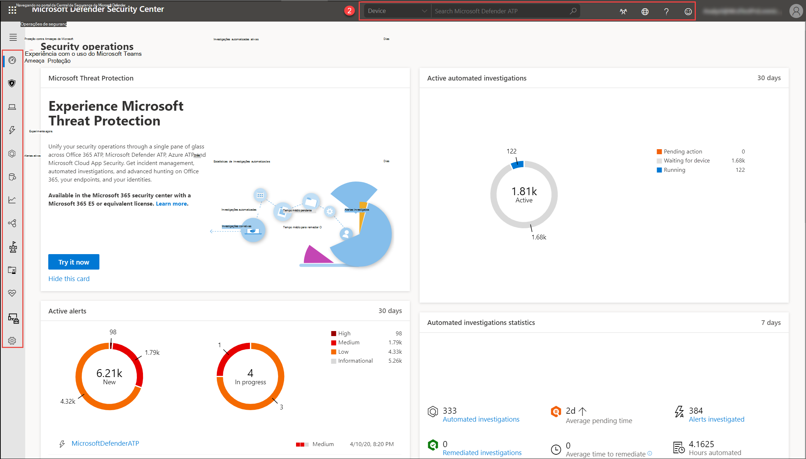

# Visão geral do portal do Centro de Segurança do Microsoft DefenderMicrosoft Defender Security Center portal overview

[!INCLUDE [Microsoft 365 Defender rebranding](../../includes/microsoft-defender.md)]

**Aplica-se a:****Applies to:**
- [Microsoft Defender para Ponto de ExtremidadeMicrosoft Defender for Endpoint](https://go.microsoft.com/fwlink/p/?linkid=2154037)
- [Microsoft 365 DefenderMicrosoft 365 Defender](https://go.microsoft.com/fwlink/?linkid=2118804)

>Deseja experimentar o Defender para Ponto de Extremidade?Want to experience Defender for Endpoint? [Inscreva-se para uma avaliação gratuita.Sign up for a free trial.](https://www.microsoft.com/microsoft-365/windows/microsoft-defender-atp?ocid=docs-wdatp-portaloverview-abovefoldlink) 

As equipes de segurança corporativas podem usar o Centro de Segurança do Microsoft Defender para monitorar e ajudar a responder a alertas de possíveis atividades avançadas de ameaças persistentes ou violações de dados.Enterprise security teams can use Microsoft Defender Security Center to monitor and assist in responding to alerts of potential advanced persistent threat activity or data breaches.

Você pode usar o [Centro de Segurança do Microsoft Defender](https://securitycenter.windows.com/) para:You can use [Microsoft Defender Security Center](https://securitycenter.windows.com/) to:

- Exibir, classificar e alertas de triagem de seus pontos de extremidadeView, sort, and triage alerts from your endpoints
- Pesquisar mais informações sobre indicadores observados, como arquivos e endereços IPSearch for more information on observed indicators such as files and IP Addresses
- Alterar as configurações do Microsoft Defender para Ponto de Extremidade, incluindo fuso horário e informações de licenciamento de revisãoChange Microsoft Defender for Endpoint settings, including time zone and review licensing information

## Centro de Segurança do Microsoft DefenderMicrosoft Defender Security Center

Ao abrir o portal, você verá:When you open the portal, you'll see:

- (1) Painel de navegação (selecione as linhas horizontais na parte superior do painel de navegação para mostrar ou ocultar)(1) Navigation pane (select the horizontal lines at the top of the navigation pane to show or hide it)
- (2) Pesquisa, Centro da comunidade, Localização, Ajuda e suporte, Feedback(2) Search, Community center, Localization, Help and support, Feedback

 

> [!NOTE]
> As detecções relacionadas a malware só serão exibidas se seus dispositivos estão usando o Microsoft Defender Antivírus como o produto antimalware de proteção em tempo real padrão.Malware related detections will only appear if your devices are using Microsoft Defender Antivirus as the default real-time protection antimalware product.

Você pode navegar pelo portal usando as opções de menu disponíveis em todas as seções.You can navigate through the portal using the menu options available in all sections. Consulte a tabela a seguir para ver uma descrição de cada seção.Refer to the following table for a description of each section.

ÁreaArea | DescriçãoDescription
:---|:---
**(1) Painel de navegação****(1) Navigation pane** | Use o painel de navegação para se mover entre Painéis, **Incidentes,** Lista de Dispositivos, Fila de  **Alertas, Investigações** **Automatizadas,** Busca **Avançada,** **Relatórios** **&, APIs** de Parceiros, Gerenciamento de **Vulnerabilidades**& Ameaças, Avaliação e **tutoriais,** **Saúde** do **serviço,** Gerenciamento de configuração e **Configurações.**Use the navigation pane to move between **Dashboards**, **Incidents**, **Devices list**, **Alerts queue**, **Automated investigations**, **Advanced hunting**, **Reports**, **Partners & APIs**, **Threat & Vulnerability Management**, **Evaluation and tutorials**, **Service health**, **Configuration management**, and **Settings**. Selecione as linhas horizontais na parte superior do painel de navegação para mostrar ou ocultar.Select the horizontal lines at the top of the navigation pane to show or hide it.
**Painéis****Dashboards** | Acesse as investigações automatizadas ativas, alertas ativos, estatísticas de investigações automatizadas, dispositivos em risco, usuários em risco, dispositivos com problemas de sensor, saúde do serviço, fontes de detecção e painéis de relatórios de dispositivos diários.Access the active automated investigations, active alerts, automated investigations statistics, devices at risk, users at risk, devices with sensor issues, service health, detection sources, and daily devices reporting dashboards.
**Incidentes****Incidents** | Exibir alertas que foram agregados como incidentes.View alerts that have been aggregated as incidents.
**Lista de dispositivos****Devices list** | Exibe a lista de dispositivos que estão internados no Defender for Endpoint, algumas informações sobre eles e seus níveis de exposição e risco.Displays the list of devices that are onboarded to Defender for Endpoint, some information about them, and their exposure and risk levels.
**Fila de alertas****Alerts queue** | Exibir alertas gerados de dispositivos em suas organizações.View alerts generated from devices in your organizations.
**Investigações automatizadas****Automated investigations** | Exibe investigações automatizadas que foram conduzidas na rede, disparando alerta, o status de cada investigação e outros detalhes, como quando a investigação começou e a duração da investigação.Displays automated investigations that have been conducted in the network, triggering alert, the status of each investigation and other details such as when the investigation started and the duration of the investigation.
**Busca avançada****Advanced hunting** | A busca avançada permite que você pesquise e investigue proativamente em toda a sua organização usando uma ferramenta de pesquisa e consulta avançada.Advanced hunting allows you to proactively hunt and investigate across your organization using a powerful search and query tool.
**Relatórios****Reports** | Exibir gráficos detalhando a proteção contra ameaças, a conformidade e a saúde do dispositivo, a proteção da Web e a vulnerabilidade.View graphs detailing threat protection, device health and compliance, web protection, and vulnerability.
**Parceiros & APIs****Partners & APIs** | Exibir conexões de parceiros com suporte, que aprimoram os recursos de detecção, investigação e inteligência contra ameaças da plataforma.View supported partner connections, which enhance the detection, investigation, and threat intelligence capabilities of the platform. Você também pode exibir aplicativos conectados, o explorador de API, a visão geral de uso da API e as configurações de exportação de dados.You can also view connected applications, the API explorer, API usage overview, and data export settings.
**Gerenciamento de & de vulnerabilidades****Threat & Vulnerability management** | Exibir a Pontuação Segura da Microsoft para Dispositivos, a pontuação de exposição, os dispositivos expostos, o software vulnerável e tomar medidas sobre as principais recomendações de segurança.View your Microsoft Secure Score for Devices, exposure score, exposed devices, vulnerable software, and take action on top security recommendations.
**Avaliação e tutoriais****Evaluation and tutorials** | Gerenciar dispositivos de teste, simulações de ataque e relatórios.Manage test devices, attack simulations, and reports. Aprenda e experimente os recursos do Defender para Ponto de Extremidade por meio de um passo a passo guiado em um ambiente de avaliação.Learn and experience the Defender for Endpoint capabilities through a guided walk-through in a trial environment.
**Integridade do Serviço****Service health** | Fornece informações sobre o status atual do serviço Defender para Ponto de Extremidade.Provides information on the current status of the Defender for Endpoint service. Você poderá verificar se a saúde do serviço está saudável ou se há problemas atuais.You'll be able to verify that the service health is healthy or if there are current issues.
**Gerenciamento de configuração****Configuration management** | Exibe dispositivos a bordo, linha de base de segurança de suas organizações, análise preditiva, cobertura de proteção da Web e permite que você execute o gerenciamento de superfície de ataque em seus dispositivos.Displays on-boarded devices, your organizations' security baseline, predictive analysis, web protection coverage, and allows you to perform attack surface management on your devices.
**Settings****Settings** | Mostra as configurações selecionadas durante a integração e permite atualizar suas preferências do setor e o período da política de retenção.Shows the settings you selected during onboarding and lets you update your industry preferences and retention policy period. Você também pode definir outras configurações, como permissões, APIs, regras, gerenciamento de dispositivos, gerenciamento de serviço de TI e avaliações de rede.You can also set other configuration settings such as permissions, APIs, rules, device management, IT service management, and network assessments.
**(2) Pesquisa, Centro da comunidade, Localização, Ajuda e suporte, Feedback****(2) Search, Community center, Localization,  Help and support, Feedback** | **Pesquisa** - pesquisa por dispositivo, arquivo, usuário, URL, IP, vulnerabilidade, software e recomendação.**Search** - search by device, file, user, URL, IP, vulnerability, software, and recommendation.    **Centro de comunidade** - Acesse o Centro da Comunidade para aprender, colaborar e compartilhar experiências sobre o produto.**Community center** - Access the Community center to learn, collaborate, and share experiences about the product.     **Localização** - Definir fusos horário.**Localization** - Set time zones.     **Ajuda e** suporte - Acesse o guia Defender para Ponto de Extremidade, suporte da Microsoft e Microsoft Premier, informações de licença, simulações & tutoriais, laboratório de avaliação do Defender para Ponto de Extremidade, consulte um especialista em ameaças.**Help and support** - Access the Defender for Endpoint guide, Microsoft and Microsoft Premier support, license information, simulations & tutorials, Defender for Endpoint evaluation lab, consult a threat expert.   **Comentários** - Forneça comentários sobre o que você gosta ou o que podemos fazer melhor.**Feedback** - Provide comments about what you like or what we can do better.

> [!NOTE]
> Para dispositivos com problemas de dimensionamento de DPI de alta resolução, consulte Problemas de dimensionamento do Windows para dispositivos de [alta DPI](https://support.microsoft.com/help/3025083/windows-scaling-issues-for-high-dpi-devices) para possíveis soluções.For devices with high resolution DPI scaling issues, please see [Windows scaling issues for high-DPI devices](https://support.microsoft.com/help/3025083/windows-scaling-issues-for-high-dpi-devices) for possible solutions.

## Ícones do Microsoft Defender para Ponto de ExtremidadeMicrosoft Defender for Endpoint icons

A tabela a seguir fornece informações sobre os ícones usados em todo o portal:The following table provides information on the icons used all throughout the portal:

ÍconeIcon | DescriçãoDescription
:---|:---
| Logotipo do Microsoft Defender para Ponto de ExtremidadeMicrosoft Defender for Endpoint logo
| Alerta – Indicação de uma atividade correlacionada com ataques avançados.Alert – Indication of an activity correlated with advanced attacks.
| Detecção – Indicação de uma detecção de ameaças de malware.Detection – Indication of a malware threat detection.
| Ameaça ativa – Ameaças sendo executadas ativamente no momento da detecção.Active threat – Threats actively executing at the time of detection.
| Correção – Ameaça removida do dispositivo.Remediated – Threat removed from the device.
| Não remediada – Ameaça não removida do dispositivo.Not remediated – Threat not removed from the device.
| Indica eventos que dispararam um alerta na árvore **do processo de alerta.**Indicates events that triggered an alert in the **Alert process tree**.
| Ícone do dispositivoDevice icon
| Eventos do Microsoft Defender AntivírusMicrosoft Defender Antivirus events
| Windows Defender eventos do Application GuardWindows Defender Application Guard events
| Windows Defender eventos do Device GuardWindows Defender Device Guard events
| Windows Defender eventos do Exploit GuardWindows Defender Exploit Guard events
| Windows Defender eventos SmartScreenWindows Defender SmartScreen events
| Eventos do Firewall do WindowsWindows Firewall events
| Ação de respostaResponse action
| Processar eventosProcess events
| Eventos de redeNetwork events
| Eventos de arquivoFile  events
| Eventos do RegistroRegistry events
| Carregar eventos DLLLoad DLL events
| Outros eventosOther events
| Modificação de token de acessoAccess token modification
| Criação de arquivosFile creation
| SignerSigner
| Caminho do arquivoFile path
| Linha de comandoCommand line
| Arquivo não assinadoUnsigned file
| Árvore de processosProcess tree
| Alocação de memóriaMemory allocation
| Injeção de processoProcess injection
| Executar o comando do PowershellPowershell command run
 | Centro de comunidadeCommunity center
 | NotificaçõesNotifications
 | Investigação automatizada - nenhuma ameaça encontradaAutomated investigation - no threats found
 | Investigação automatizada - falhaAutomated investigation - failed
 | Investigação automatizada - parcialmente investigadaAutomated investigation - partially investigated
 | Investigação automatizada - encerrada pelo sistemaAutomated investigation - terminated by system
 | Investigação automatizada - pendenteAutomated investigation - pending
 | Investigação automatizada - em execuçãoAutomated investigation - running
 | Investigação automatizada - correçãoAutomated investigation - remediated
 | Investigação automatizada - parcialmente remediadaAutomated investigation - partially remediated
 | Gerenciamento & de Vulnerabilidades - insights sobre ameaçasThreat & Vulnerability Management - threat insights
 | Gerenciamento & de Vulnerabilidades - alerta ativo possívelThreat & Vulnerability Management - possible active alert
 | Gerenciamento & de Vulnerabilidades - insights de recomendaçãoThreat & Vulnerability Management - recommendation insights

## Tópicos relacionadosRelated topics

- [Visão geral do Centro de Segurança do Microsoft DefenderOverview of Microsoft Defender Security Center](use.md)
- [Exibir o painel de operações de segurançaView the Security operations dashboard](security-operations-dashboard.md)
- [Exibir o painel gerenciamento de & de vulnerabilidadesView the Threat & Vulnerability Management dashboard](tvm-dashboard-insights.md)
- [Exibir o painel de análise de ameaças e tomar ações de mitigação recomendadasView the Threat analytics dashboard and take recommended mitigation actions](threat-analytics.md)
