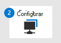

# Preparar o Microsoft Defender para implantação do Ponto de Extremidade

[!INCLUDE [Microsoft 365 Defender rebranding](../../includes/microsoft-defender.md)]

**Aplica-se a:**
- [Microsoft Defender para Ponto de Extremidade](https://go.microsoft.com/fwlink/p/?linkid=2146631)
- [Microsoft 365 Defender](https://go.microsoft.com/fwlink/?linkid=2118804)

> Deseja experimentar o Microsoft Defender para Ponto de Extremidade? [Inscreva-se para uma avaliação gratuita.](https://www.microsoft.com/microsoft-365/windows/microsoft-defender-atp?ocid=docs-wdatp-exposedapis-abovefoldlink)

Implantar o Defender para Ponto de Extremidade é um processo de três fases:

|  Fase 1: Preparar |  [Fase 2: Instalação](production-deployment.md) |  [Fase 3: Onboard](onboarding.md) |
| ----- | ----- | ----- |
|*Você está aqui!* | ||

No momento, você está na fase de preparação.

A preparação é fundamental para qualquer implantação bem-sucedida. Neste artigo, você será orientado sobre os pontos que você precisará considerar ao se preparar para implantar o Defender para o Ponto de Extremidade.

## Stakeholders e aprovação
A seção a seguir serve para identificar todos os participantes envolvidos no projeto e precisam aprovar, revisar ou permanecer informados.

Adicione participantes à tabela abaixo conforme apropriado para sua organização.

-   SO = Aprovar projeto

-   R = Revisar este projeto e fornecer entrada

-   I = Informado deste projeto

| Nome                 | Role                                                                                                                                                                                                          | Action |
|----------------------|---------------------------------------------------------------------------------------------------------------------------------------------------------------------------------------------------------------|--------|
| Inserir nome e email | Diretor de Segurança da Informação **(CISO)** Um representante executivo que serve como patrocinador dentro da organização para a *implantação da nova tecnologia.*                                                  | Então     |
| Inserir nome e email | **Head of Cyber Defense Operations Center (CDOC)** Um representante da equipe do CDOC responsável por definir como essa alteração é alinhada com os processos na equipe de operações de *segurança dos clientes.*       | Então     |
| Inserir nome e email | **Arquiteto de Segurança** Um representante da equipe de Segurança responsável por definir como essa alteração é alinhada com a arquitetura *principal de Segurança na organização.*                         | R      |
| Inserir nome e email | **Arquiteto do Local** de Trabalho Um representante da equipe de TI responsável por definir como essa alteração é alinhada com a arquitetura principal do local de trabalho *na organização.*                             | R      |
| Inserir nome e email | **Analista de Segurança** Um representante da equipe do CDOC que pode fornecer informações sobre os recursos de detecção, a experiência do usuário e a utilidade geral dessa alteração de uma perspectiva de *operações de segurança.* | I      |

## Ambiente 

Esta seção é usada para garantir que seu ambiente seja profundamente compreendido pelas partes interessadas, o que ajudará a identificar possíveis dependências e/ou alterações necessárias em tecnologias ou processos.

| O que                                  | Descrição |
|---------------------------------------|-------------|
| Contagem de pontos de extremidade                        |             |
| Contagem de servidores                          |             |
| Mecanismo de gerenciamento                     |             |
| Distribuição de CDOC                     |             |
| Informações e eventos de segurança (SIEM) |             |

## Controle de acesso baseado em função

A Microsoft recomenda usar o conceito de privilégios mínimos. O Defender para Ponto de Extremidade aproveita funções in-loco no Azure Active Directory. A Microsoft recomenda [revisar as diferentes funções](https://docs.microsoft.com/azure/active-directory/active-directory-assign-admin-roles-azure-portal) disponíveis e escolher a correta para resolver suas necessidades para cada persona para este aplicativo. Algumas funções podem precisar ser aplicadas temporariamente e removidas após a conclusão da implantação.

| Personas                     | Funções | Função do Azure AD (se necessário) | Atribuir a |
|------------------------------|-------|-----------------------------|-----------|
| Administrador de Segurança       |       |                             |           |
| Analista de Segurança             |       |                             |           |
| Administrador do ponto de extremidade       |       |                             |           |
| Administrador de Infraestrutura |       |                             |           |
| Proprietário/Stakeholder do Business   |       |                             |           |

A Microsoft recomenda usar [o Privileged Identity Management](https://docs.microsoft.com/azure/active-directory/active-directory-privileged-identity-management-configure) para gerenciar suas funções para fornecer auditoria, controle e revisão de acesso adicionais para usuários com permissões de diretório.

O Defender para Ponto de Extremidade oferece suporte a duas maneiras de gerenciar permissões:

-   **Gerenciamento de permissões básicas**: definir permissões para acesso total ou somente leitura. No caso de permissões básicas, os usuários de gerenciamento com a função administrador global ou administrador de segurança no Azure Active Directory têm acesso total enquanto a função de leitor de segurança tem acesso somente leitura.

-   Controle de acesso baseado em função **(RBAC)**: definir permissões granulares definindo funções, atribuindo grupos de usuários do Azure AD às funções e concedendo aos grupos de usuários acesso a grupos de dispositivos. Para obter mais informações. consulte [Gerenciar o acesso ao portal usando o controle de acesso baseado em função](rbac.md).

A Microsoft recomenda aproveitar o RBAC para garantir que somente os usuários que têm uma justificativa comercial possam acessar o Defender para o Ponto de Extremidade.

Você pode encontrar detalhes sobre diretrizes de permissão [aqui](https://docs.microsoft.com/microsoft-365/security/defender-endpoint/user-roles#create-roles-and-assign-the-role-to-an-azure-active-directory-group).

A tabela de exemplo a seguir serve para identificar a estrutura do Centro de Operações de Defesa Cibernética em seu ambiente que o ajudará a determinar a estrutura do RBAC necessária para seu ambiente.

| Camada   | Descrição                                                                                                                                                                                                 | Permissão Necessária |
|--------|-------------------------------------------------------------------------------------------------------------------------------------------------------------------------------------------------------------|---------------------|
| Camada 1 | **Equipe de operações de segurança local/equipe de IT** Essa equipe geralmente triagem e investiga alertas contidos em sua localização geográfica e escalona para a Camada 2 nos casos em que uma correção ativa é necessária.                                              |                     |
| Camada 2 | **Equipe de operações de segurança regional** Essa equipe pode ver todos os dispositivos de sua região e executar ações de correção.                                                                                                                        |        Exibir dados               |
| Camada 3 | **Equipe de operações de segurança global** Essa equipe consiste em especialistas em segurança e está autorizada a ver e executar todas as ações do portal. | Exibir dados    Investigação de alertas Ações de correção ativa   Investigação de alertas Ações de correção ativa   Gerenciar configurações do sistema de portal   Gerenciar configurações de segurança |

## Ordem de adoção
Em muitos casos, as organizações terão produtos de segurança de ponto de extremidade existentes. O mínimo que todas as organizações devem ter sido uma solução antivírus. Mas, em alguns casos, uma organização também pode já ter implantado uma solução EDR.

Historicamente, substituir qualquer solução de segurança era muito intensa e difícil de alcançar devido aos ganchos rígidos na camada de aplicativos e nas dependências de infraestrutura. No entanto, como o Defender para Ponto de Extremidade está integrado ao sistema operacional, substituir soluções de terceiros agora é fácil de alcançar.

Escolha o componente do Defender para o Ponto de Extremidade a ser usado e remova os que não se aplicam. A tabela abaixo indica a ordem que a Microsoft recomenda para como o pacote de segurança do ponto de extremidade deve ser habilitado.

| Componente                               | Descrição                                                                                                                                                                                                                                                                                                                                                                                                                                                                                                                                                                                                                                                                                              | Classificação de Ordem de Adoção |
|-----------------------------------------|----------------------------------------------------------------------------------------------------------------------------------------------------------------------------------------------------------------------------------------------------------------------------------------------------------------------------------------------------------------------------------------------------------------------------------------------------------------------------------------------------------------------------------------------------------------------------------------------------------------------------------------------------------------------------------------------------------|---------------------|
| Resposta & EDR (Endpoint Detection)     | Os recursos de detecção e resposta de ponto de extremidade do Defender para pontos de extremidade fornecem detecções avançadas de ataque que são quase em tempo real e ativas. Os analistas de segurança podem priorizar alertas de maneira eficaz, obter visibilidade de todo o escopo de uma violação e executar ações de resposta para remediar ameaças.   [Saiba Mais.](https://docs.microsoft.com/windows/security/threat-protection/windows-defender-atp/overview-endpoint-detection-response)                                                                                                                                                                                                                                             | 1                   |
|Gerenciamento & de Vulnerabilidades (TVM)|O & gerenciamento de vulnerabilidades é um componente do Microsoft Defender para Ponto de Extremidade e fornece aos administradores de segurança e equipes de operações de segurança um valor exclusivo, incluindo:   - Percepções de detecção e resposta do ponto de extremidade em tempo real (EDR) correlacionadas com vulnerabilidades de ponto de extremidade   - Contexto de vulnerabilidade de dispositivo inestimável durante investigações de incidentes   - Processos internos de correção por meio do Microsoft Intune e do Microsoft System Center Configuration Manager   [Saiba mais](https://techcommunity.microsoft.com/t5/Windows-Defender-ATP/Introducing-a-risk-based-approach-to-threat-and-vulnerability/ba-p/377845).| 2 |
| Proteção de última geração (NGP)        | O Microsoft Defender Antivírus é uma solução antimalware integrada que fornece proteção de última geração para desktops, computadores portáteis e servidores. O Microsoft Defender Antivírus inclui:   -Proteção entregue na nuvem para detecção quase instantânea e bloqueio de ameaças novas e emergentes. Além do aprendizado da máquina e do gráfico de segurança inteligente, a proteção oferecida na nuvem faz parte das tecnologias de próxima geração que para alimentam o Microsoft Defender Antivírus.     - Verificação sempre em tempo real usando monitoramento avançado de comportamento de arquivo e processo e outras heurísticas (também conhecida como "proteção em tempo real").   - Atualizações de proteção dedicadas com base no aprendizado de máquina, análise de big data humana e automatizada e pesquisa detalhada de resistência a ameaças.   [Saiba mais](https://docs.microsoft.com/windows/security/threat-protection/microsoft-defender-antivirus/microsoft-defender-antivirus-in-windows-10).                                                                                                                                                                                                                                                                                                                                                                       |3                   |
| Redução de superfície de ataque (ASR)          | Os recursos de redução de superfície de ataque no Microsoft Defender para Ponto de Extremidade ajudam a proteger os dispositivos e aplicativos na organização contra ameaças novas e emergentes.   [Saiba Mais.](https://docs.microsoft.com/windows/security/threat-protection/windows-defender-atp/overview-attack-surface-reduction)                                                                                                                                                                                                                                                                                                                                                                                       | 4                    |
| Auto Investigation & Correção (AIR)  | O Microsoft Defender para Ponto de Extremidade usa investigações automatizadas para reduzir significativamente o volume de alertas que precisam ser investigados individualmente. O recurso de investigação automatizada aproveita vários algoritmos de inspeção e processos usados por analistas (como playbooks) para examinar alertas e tomar medidas imediatas de correção para resolver violações. Isso reduz significativamente o volume de alerta, permitindo que os especialistas de operações de segurança se concentrem em ameaças mais sofisticadas e outras iniciativas de alto valor.  [Saiba Mais.](https://docs.microsoft.com/windows/security/threat-protection/windows-defender-atp/automated-investigations-windows-defender-advanced-threat-protection) | Não se aplica      |
| Microsoft Threat Experts (MTE)          | Os Especialistas em Ameaças da Microsoft são um serviço de busca gerenciado que fornece SOCs (Security Operation Centers) com monitoramento e análise de nível de especialista para ajudá-los a garantir que as ameaças críticas em seus ambientes exclusivos não são perdidas.  [Saiba Mais.](https://docs.microsoft.com/windows/security/threat-protection/windows-defender-atp/microsoft-threat-experts)                                                                                                                                                                                                                                                                                                                     | Não se aplica      |

## Próxima etapa
|||
|:-------|:-----|
|  [Fase 2: Instalação](production-deployment.md) | Configurar o Microsoft Defender para implantação do Ponto de Extremidade

