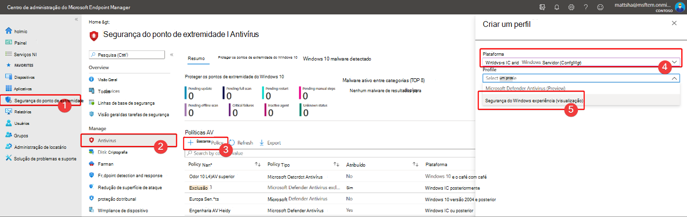

# Proteger as configurações de segurança com proteção contra adulteração

[!INCLUDE [Microsoft 365 Defender rebranding](../../includes/microsoft-defender.md)]

**Aplica-se a:**

- [Microsoft Defender para Ponto de Extremidade](/microsoft-365/security/defender-endpoint/)

A proteção contra adulteração está disponível para dispositivos que estão executando uma das seguintes versões do Windows:

- Windows 10
- Windows Server 2019
- Windows Server, versão 1803 ou posterior
- Windows Server 2016

## Visão Geral

Durante alguns tipos de ataques cibernéticos, os atores ruins tentam desabilitar recursos de segurança, como proteção antivírus, em seus computador. Os atores ruins gostam de desabilitar seus recursos de segurança para obter acesso mais fácil aos seus dados, instalar malware ou explorar seus dados, identidade e dispositivos. A proteção contra adulteração ajuda a impedir que esses tipos de coisas ocorram.

Com a proteção contra violações, os aplicativos mal-intencionados são impedidos de tomar ações como:

- Desabilitando a proteção contra vírus e ameaças
- Desabilitando a proteção em tempo real
- Desligar o monitoramento de comportamento
- Desabilitando antivírus (como IOfficeAntivirus (IOAV))
- Desabilitando a proteção entregue na nuvem
- Remover atualizações de inteligência de segurança

### Como funciona

A proteção contra violações bloqueia essencialmente o Microsoft Defender Antivírus e impede que suas configurações de segurança seja alterada por meio de aplicativos e métodos como:

- Configurando configurações no Editor de Registro em seu dispositivo Windows
- Alterar configurações por meio de cmdlets do PowerShell
- Editar ou remover configurações de segurança por meio de políticas de grupo

A proteção contra violações não impede que você veja suas configurações de segurança. Além disso, a proteção contra violações não afeta como aplicativos antivírus de terceiros se registram com o aplicativo segurança do Windows. Se sua organização estiver usando o Windows 10 Enterprise E5, usuários individuais não poderão alterar a configuração de proteção contra violações; nesses casos, a proteção contra violações é gerenciada pela sua equipe de segurança.

### O que você deseja fazer?

| Para executar essa tarefa... | Consulte esta seção... |
|:---|:---|
| Ativar a proteção contra adulteração (ou desativar) no Centro de Segurança do Microsoft Defender 
Gerenciar a proteção contra violações em seu locatário | [Gerenciar a proteção contra violações para sua organização usando o Centro de Segurança do Microsoft Defender](#manage-tamper-protection-for-your-organization-using-the-microsoft-defender-security-center) |
| Ativar a proteção contra adulteração (ou desativar) para toda ou parte da sua organização usando o Intune 
Ajustar as configurações de proteção contra violações em sua organização | [Gerenciar a proteção contra violações para sua organização usando o Intune](#manage-tamper-protection-for-your-organization-using-intune) |
| Ativar (ou desativar) a proteção contra adulteração para sua organização com o Configuration Manager | [Gerenciar a proteção contra violações para sua organização usando a anexação de locatário com o Configuration Manager, versão 2006](#manage-tamper-protection-for-your-organization-with-configuration-manager-version-2006) |
| Ativar a proteção contra adulteração (ou desativar) para um dispositivo individual | [Gerenciar a proteção contra violações em um dispositivo individual](#manage-tamper-protection-on-an-individual-device) |
| Exibir detalhes sobre tentativas de adulteração em dispositivos | [Exibir informações sobre tentativas de adulteração](#view-information-about-tampering-attempts) |
| Revise suas recomendações de segurança | [Revisar recomendações de segurança](#review-your-security-recommendations) |
| Revise a lista de perguntas frequentes (perguntas frequentes) | [Procurar perguntas frequentes](#view-information-about-tampering-attempts) |

## Gerenciar a proteção contra violações para sua organização usando o Centro de Segurança do Microsoft Defender

A proteção contra adulteração pode ser 1 ou 2016 para seu locatário usando o Centro de Segurança do Microsoft Defender ( [https://securitycenter.windows.com](https://securitycenter.windows.com) ). Aqui estão alguns pontos para ter em mente:

- Atualmente, a opção de gerenciar a proteção contra violações no Centro de Segurança do Microsoft Defender está 100% corretamente em novas implantações. Para implantações existentes, a proteção contra adulteração está disponível em uma base de aceitação, com planos para tornar este o método padrão em um futuro próximo. (Para optar, no Centro de Segurança do Microsoft Defender, escolha **Configurações**  >  **Recursos avançados**  >  **Proteção contra adulteração**.) 

- Quando você usa o Centro de Segurança do Microsoft Defender para gerenciar a proteção contra violações, não é preciso usar o Intune ou o método de anexação de locatários.

- Quando você gerencia a proteção contra violações no Centro de Segurança do Microsoft Defender, a configuração é aplicada em todo o locatário, afetando todos os dispositivos que estão executando o Windows 10, o Windows Server 2016 ou o Windows Server 2019. Para ajustar a proteção contra adulteração (como a proteção contra adulteração para alguns dispositivos, mas para outros), use [o Intune](#manage-tamper-protection-for-your-organization-using-intune) ou o Configuration Manager com anexação [de locatário.](#manage-tamper-protection-for-your-organization-with-configuration-manager-version-2006)

- Se você tiver um ambiente híbrido, as configurações de proteção contra violações configuradas no Intune terão precedência sobre as configurações configuradas no Centro de Segurança do Microsoft Defender. 

### Requisitos para gerenciar a proteção contra violações no Centro de Segurança do Microsoft Defender

- Você deve ter permissões [apropriadas,](/microsoft-365/security/defender-endpoint/assign-portal-access)como administrador global, administrador de segurança ou operações de segurança.

- Seus dispositivos Windows devem estar executando uma das seguintes versões do Windows:
   - Windows 10
   - [Windows Server 2019](/windows-server/get-started-19/whats-new-19)
   - Windows Server, versão [1803](/windows/release-health/status-windows-10-1803) ou posterior
   - [Windows Server 2016](/windows-server/get-started/whats-new-in-windows-server-2016)
   - Para obter mais informações sobre versões, consulte [Informações de versão do Windows 10.](/windows/release-health/release-information)

- Seus dispositivos devem estar [conectados ao Microsoft Defender para Endpoint](/microsoft-365/security/defender-endpoint/onboarding).

- Seus dispositivos devem estar usando a plataforma anti-malware versão 4.18.2010.7 (ou superior) e o mecanismo anti-malware versão 1.1.17600.5 (ou superior). ([Gerenciar atualizações do Microsoft Defender Antivírus e aplicar linhas de base](manage-updates-baselines-microsoft-defender-antivirus.md).)

- [A proteção entregue na nuvem](enable-cloud-protection-microsoft-defender-antivirus.md) deve estar 100%.

### Ativar a proteção contra adulteração (ou desativar) no Centro de Segurança do Microsoft Defender 

1. Vá para o Centro de Segurança do Microsoft Defender ( [https://securitycenter.windows.com](https://securitycenter.windows.com) ) e entre.

2. Escolha **Configurações**.

3. Vá para **Recursos**  >  **Avançados Gerais** e, em seguida, auxinte a proteção contra adulteração.

## Gerenciar a proteção contra violações para sua organização usando o Intune

Se você faz parte da equipe de segurança da sua organização e sua assinatura inclui [o Intune,](/intune/fundamentals/what-is-intune)você pode ativar (ou desativar) a proteção contra violações para sua organização no portal do Centro de administração do [Microsoft Endpoint Manager.](https://endpoint.microsoft.com) Use o Intune quando quiser ajustar as configurações de proteção contra violações. Por exemplo, se você quiser habilitar a proteção contra violações em alguns dispositivos, mas não todos, use o Intune.

### Requisitos para gerenciar a proteção contra violações no Intune

- Você deve ter permissões [apropriadas,](/microsoft-365/security/defender-endpoint/assign-portal-access)como administrador global, administrador de segurança ou operações de segurança.

- Sua organização usa [o Intune para gerenciar dispositivos](/intune/fundamentals/what-is-device-management). ([As licenças do Intune](/intune/fundamentals/licenses) são necessárias; O Intune está incluído no Microsoft 365 E5.)

- Seus dispositivos Windows devem estar executando o Windows [10 OS 1709](/windows/release-health/status-windows-10-1709), [1803](/windows/release-health/status-windows-10-1803), [1809](/windows/release-health/status-windows-10-1809-and-windows-server-2019) ou posterior. (Para obter mais informações sobre versões, consulte Informações de versão [do Windows 10](/windows/release-health/release-information).)

- Você deve estar usando a segurança do Windows com inteligência de [segurança](https://www.microsoft.com/wdsi/definitions) atualizada para a versão 1.287.60.0 (ou superior).

- Seus dispositivos devem estar usando a plataforma anti-malware versão 4.18.1906.3 (ou superior) e o mecanismo anti-malware versão 1.1.15500.X (ou acima). ([Gerenciar atualizações do Microsoft Defender Antivírus e aplicar linhas de base](manage-updates-baselines-microsoft-defender-antivirus.md).)

### Ativar a proteção contra adulteração (ou desativar) no Intune

1. Vá para o Centro de [administração do Microsoft Endpoint Manager](https://endpoint.microsoft.com) e entre com sua conta de trabalho ou de estudante.

2. Selecione   >  **Perfis de Configuração de Dispositivos**.

3. Crie um perfil que inclua as seguintes configurações:
    - **Plataforma: Windows 10 e posterior**
    - **Tipo de perfil: Proteção de ponto de extremidade**
    - **Categoria: Centro de Segurança do Microsoft Defender**
    - **Proteção contra Adulteração: Habilitada**

4. Atribua o perfil a um ou mais grupos.

### Você está usando o Windows OS 1709, 1803 ou 1809?

Se você estiver usando o Windows 10 OS [1709](/windows/release-health/status-windows-10-1709), [1803](/windows/release-health/status-windows-10-1803)ou  [1809](/windows/release-health/status-windows-10-1809-and-windows-server-2019), não verá a Proteção contra Adulteração no aplicativo segurança do Windows. Em vez disso, você pode usar o PowerShell para determinar se a proteção contra violações está habilitada.

#### Use o PowerShell para determinar se a proteção contra violações está 100% 100% 1000.

1. Abra o Windows PowerShell app.

2. Use o cmdlet [Get-MpComputerStatus](/powershell/module/defender/get-mpcomputerstatus?preserve-view=true&view=win10-ps) PowerShell.

3. Na lista de resultados, procure `IsTamperProtected` . (Um valor verdadeiro *significa que a* proteção contra adulteração está habilitada.)

## Gerenciar a proteção contra violações para sua organização com o Configuration Manager, versão 2006

Se você estiver usando a versão [2006](/mem/configmgr/core/plan-design/changes/whats-new-in-version-2006)do Configuration Manager, poderá gerenciar as configurações de proteção contra violações no Windows 10, no Windows Server 2016 e no Windows Server 2019 usando um método chamado anexação de locatário.  A anexação de locatário permite sincronizar seus dispositivos do Gerenciador de Configuração somente no centro de administração do Microsoft Endpoint Manager e, em seguida, fornecer políticas de configuração de segurança de ponto de extremidade para coleções locais & dispositivos.

> [!NOTE]
> O procedimento pode ser usado para estender a proteção contra violações para dispositivos que executam o Windows 10 e o Windows Server 2019. Revise os pré-requisitos e outras informações nos recursos mencionados neste procedimento.

1. Configurar anexação de locatário. Para obter ajuda com isso, consulte Anexação de locatário do [Microsoft Endpoint Manager: Sincronização de dispositivos e ações de dispositivo.](/mem/configmgr/tenant-attach/device-sync-actions)

2. No Centro [de administração do Microsoft Endpoint Manager,](https://go.microsoft.com/fwlink/?linkid=2109431)vá até **Endpoint security**  >  **Antivírus** e escolha + Criar **Política**.  
   - Na lista **Plataforma,** selecione **Windows 10 e Windows Server (ConfigMgr)**.  
   - Na lista **Perfil,** selecione **Experiência de Segurança do Windows (visualização)**.  

3. Implante a política em sua coleção de dispositivos.

### Precisa de ajuda com esse método? 

Consulte os seguintes recursos:

- [Configurações para o perfil de experiência de Segurança do Windows no Microsoft Intune](/mem/intune/protect/antivirus-security-experience-windows-settings)
- [Blog da Comunidade Técnica: Anunciando a Proteção contra Adulteração para Clientes de Anexação de Locatários do Gerenciador de Configurações](https://techcommunity.microsoft.com/t5/microsoft-endpoint-manager-blog/announcing-tamper-protection-for-configuration-manager-tenant/ba-p/1700246#.X3QLR5Ziqq8.linkedin)

## Gerenciar a proteção contra violações em um dispositivo individual

> [!NOTE]
> Os blocos de proteção contra adulteração tentarão modificar as configurações do Microsoft Defender Antivírus por meio do Registro.
>
> Para ajudar a garantir que a proteção contra violações não interfira com produtos de segurança de  terceiros ou scripts de instalação empresariais que modificam essas configurações, acesse Segurança do **Windows** e atualize a Inteligência de Segurança para a versão 1.287.60.0 ou posterior. (Consulte [Atualizações de inteligência de segurança](https://www.microsoft.com/wdsi/definitions).)
>
> Depois de fazer essa atualização, a proteção contra violações continuará a proteger suas configurações do Registro e os logs tentarão modificá-las sem retornar erros.

Se você for um usuário de residência ou não estiver sujeito a configurações gerenciadas por uma equipe de segurança, poderá usar o aplicativo segurança do Windows para gerenciar a proteção contra violações. Você deve ter permissões de administrador apropriadas em seu dispositivo para alterar as configurações de segurança, como proteção contra violações.

Veja o que você vê no aplicativo segurança do Windows:

1. Selecione **Iniciar** e comece a digitar *Segurança*. Nos resultados da pesquisa, selecione **Segurança do Windows**.

2. Selecione **Proteção contra vírus & vírus**& proteção contra  >  **ameaças.**

3. Definir **a Proteção contra Adulteração** como **On** ou **Off**.

## Exibir informações sobre tentativas de adulteração

As tentativas de adulteração geralmente indicam ataques cibernéticos maiores. Os atores ruins tentam alterar as configurações de segurança como uma maneira de persistir e permanecer sem serem detectados. Se você faz parte da equipe de segurança da sua organização, pode exibir informações sobre essas tentativas e, em seguida, tomar as ações apropriadas para atenuar ameaças.

Quando uma tentativa de adulteração é detectada, um alerta é gerado no Centro de Segurança do [Microsoft Defender](/microsoft-365/security/defender-endpoint/portal-overview) ( [https://securitycenter.windows.com](https://securitycenter.windows.com) ).

Usando a detecção e  a [resposta](/microsoft-365/security/defender-endpoint/overview-endpoint-detection-response) do ponto de extremidade e os recursos avançados de busca no Microsoft Defender para Ponto de Extremidade, sua equipe de operações de segurança pode investigar e resolver essas tentativas.

## Revise suas recomendações de segurança

A proteção contra adulteração se integra [aos recursos & Gerenciamento de](/microsoft-365/security/defender-endpoint/next-gen-threat-and-vuln-mgt) Vulnerabilidades. [As recomendações de segurança](/microsoft-365/security/defender-endpoint/tvm-security-recommendation) incluem certificar-se de que a proteção contra violações está 100% ativas. Por exemplo, você pode pesquisar em *adulteração*, conforme mostrado na imagem a seguir:

Nos resultados, você pode selecionar Ativar a Proteção **contra Adulteração** para saber mais e acioná-la.

Para saber mais sobre o Gerenciamento de & Ameaças, consulte Gerenciamento de Vulnerabilidades & Ameaças no Centro de Segurança [do Microsoft Defender.](/microsoft-365/security/defender-endpoint/tvm-dashboard-insights#threat--vulnerability-management-in-microsoft-defender-security-center)

## Perguntas frequentes

### Para quais versões do sistema operacional Windows está configurando a proteção contra violações é aplicável?

Windows 10 OS [1709](/windows/release-health/status-windows-10-1709), [1803](/windows/release-health/status-windows-10-1803), [1809](/windows/release-health/status-windows-10-1809-and-windows-server-2019)ou posterior junto com [o Microsoft Defender para Ponto de Extremidade](/microsoft-365/security/defender-endpoint).

Se você estiver usando o Configuration Manager, versão 2006, com anexação de locatário, a proteção contra adulteração poderá ser estendida para o Windows Server 2019. Consulte Anexação de locatário: Criar e implantar a política antivírus de segurança do ponto de extremidade [a partir do centro de administração (visualização)](/mem/configmgr/tenant-attach/deploy-antivirus-policy).

### A proteção contra violações terá algum impacto no registro de antivírus de terceiros?

Não. As ofertas de antivírus de terceiros continuarão a se registrar com o aplicativo de Segurança do Windows.

### O que acontece se o Microsoft Defender Antivírus não estiver ativo em um dispositivo?

Os dispositivos que estão integrados ao Microsoft Defender para Ponto de Extremidade terão o Microsoft Defender Antivírus em execução no modo passivo. A proteção contra violações continuará a proteger o serviço e seus recursos. 

### Como ativar/desativar a proteção contra adulteração?

Se você for um usuário de residência, consulte [Gerenciar proteção contra violações em um dispositivo individual](#manage-tamper-protection-on-an-individual-device).

Se você for uma organização usando o [Microsoft Defender para o Ponto](/microsoft-365/security/defender-endpoint)de Extremidade, poderá gerenciar a proteção contra violações no Intune da mesma forma que gerencia outros recursos de proteção de ponto de extremidade. Consulte as seguintes seções deste artigo: 

- [Gerenciar a proteção contra violações usando o Intune](#manage-tamper-protection-for-your-organization-using-intune)
- [Gerenciar a proteção contra violações usando o Configuration Manager, versão 2006](#manage-tamper-protection-for-your-organization-with-configuration-manager-version-2006)
- [Gerenciar a proteção contra violações usando o Centro](#manage-tamper-protection-for-your-organization-using-the-microsoft-defender-security-center) de Segurança do Microsoft Defender (atualmente em visualização)

### Como configurar a proteção contra violações no Intune afeta como gerencio o Microsoft Defender Antivírus por meio da minha política de grupo?

Sua política de grupo regular não se aplica à proteção contra violações e as alterações nas configurações do Microsoft Defender Antivírus são ignoradas quando a proteção contra violações está em uso. 

### Para o Microsoft Defender para Ponto de Extremidade, a configuração da proteção contra violações no Intune é direcionada apenas para toda a organização?

Configurar a proteção contra adulteração no Intune ou no Microsoft Endpoint Manager pode ser direcionado para toda a sua organização e para dispositivos e grupos de usuários específicos.

### Posso configurar a Proteção contra Adulteração no Microsoft Endpoint Configuration Manager?

Se você estiver usando anexação de locatário, poderá usar o Microsoft Endpoint Configuration Manager. Consulte os seguintes recursos:
- [Gerenciar a proteção contra violações para sua organização com o Configuration Manager, versão 2006](#manage-tamper-protection-for-your-organization-with-configuration-manager-version-2006)
- [Blog da Comunidade Técnica: Anunciando a Proteção contra Adulteração para Clientes de Anexação de Locatários do Gerenciador de Configuração](https://techcommunity.microsoft.com/t5/microsoft-endpoint-manager-blog/announcing-tamper-protection-for-configuration-manager-tenant/ba-p/1700246#.X3QLR5Ziqq8.linkedin)

### Tenho o registro do Windows E3. Posso usar a configuração da proteção contra violações no Intune?

Atualmente, a configuração da proteção contra adulteração no Intune só está disponível para clientes que têm [o Microsoft Defender para o Ponto de Extremidade.](/microsoft-365/security/defender-endpoint)

### O que acontece se eu tentar alterar as configurações do Microsoft Defender para Ponto de Extremidade no Intune, no Microsoft Endpoint Configuration Manager e na Instrumentação de Gerenciamento do Windows quando a Proteção contra Adulteração estiver habilitada em um dispositivo?

Você não poderá alterar os recursos protegidos pela proteção contra violações; essas solicitações de alteração são ignoradas.

### Sou um cliente corporativo. Os administradores locais podem alterar a proteção contra violações em seus dispositivos?

Não. Os administradores locais não podem alterar ou modificar as configurações de proteção contra violações.

### O que acontece se meu dispositivo estiver a bordo do Microsoft Defender para Ponto de Extremidade e entrar em um estado fora do quadro?

Se um dispositivo for desligado do Microsoft Defender para o Ponto de Extremidade, a proteção contra adulteração será 2016, que é o estado padrão para dispositivos não manipulados. 

### Haverá um alerta sobre a alteração do status de proteção contra violações no Centro de Segurança do Microsoft Defender?

Sim. O alerta é mostrado em [https://securitycenter.microsoft.com](https://securitycenter.microsoft.com) **Alertas**.

Sua equipe de operações de segurança também pode usar consultas de busca, como o exemplo a seguir:

`DeviceAlertEvents | where Title == "Tamper Protection bypass"`

[Exibir informações sobre tentativas de adulteração.](#view-information-about-tampering-attempts)

## Confira também

[Ajudar a proteger computadores Windows com a Proteção de Ponto de Extremidade para o Microsoft Intune](/intune/help-secure-windows-pcs-with-endpoint-protection-for-microsoft-intune)

[Obter uma visão geral do Microsoft Defender para Ponto de Extremidade](/microsoft-365/security/defender-endpoint)

[Melhores juntos: Microsoft Defender Antivírus e Microsoft Defender para Ponto de Extremidade](why-use-microsoft-defender-antivirus.md)