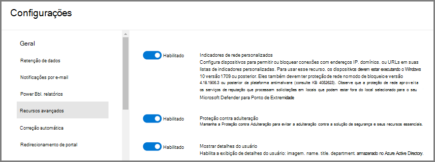
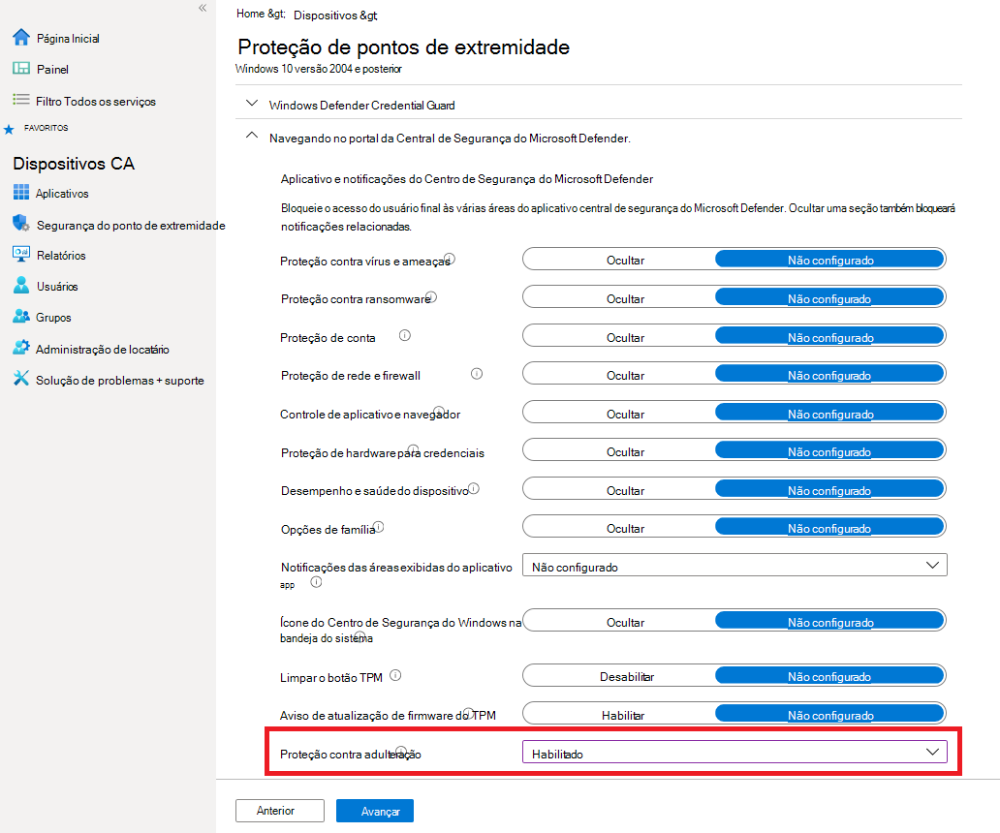
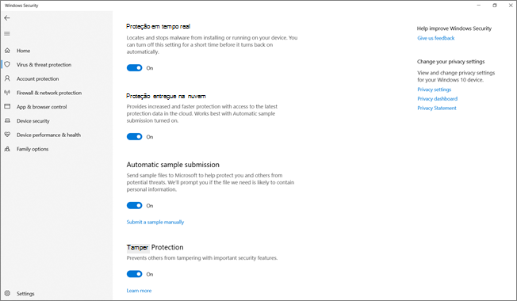
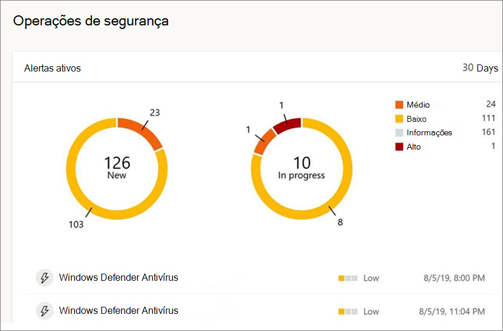
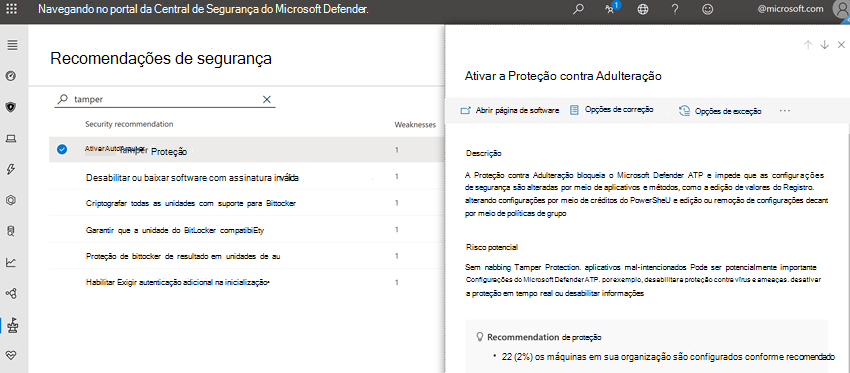

# Proteger as configurações de segurança com proteção contra adulteraçãoProtect security settings with tamper protection

**Aplica-se a:****Applies to:**

- [Microsoft Defender para Ponto de ExtremidadeMicrosoft Defender for Endpoint](/microsoft-365/security/defender-endpoint/)

A proteção contra adulteração está disponível para dispositivos que executam uma das seguintes versões do Windows:Tamper protection is available for devices that are running one of the following versions of Windows:

- Windows 10Windows 10
- Windows Server 2019Windows Server 2019
- Windows Servidor, versão 1803 ou posteriorWindows Server, version 1803 or later
- Windows Server 2016Windows Server 2016

## Visão GeralOverview

Durante alguns tipos de ataques cibernéticos, os atores ruins tentam desabilitar recursos de segurança, como proteção antivírus, em seus computador.During some kinds of cyber attacks, bad actors try to disable security features, such as anti-virus protection, on your machines. Os atores ruins gostam de desabilitar seus recursos de segurança para obter acesso mais fácil aos seus dados, instalar malware ou explorar seus dados, identidade e dispositivos.Bad actors like to disable your security features to get easier access to your data, to install malware, or to otherwise exploit your data, identity, and devices. A proteção contra adulteração ajuda a impedir que esses tipos de coisas ocorram.Tamper protection helps prevent these kinds of things from occurring.

Com a proteção contra violações, os aplicativos mal-intencionados são impedidos de tomar ações como:With tamper protection, malicious apps are prevented from taking actions such as:

- Desabilitando a proteção contra vírus e ameaçasDisabling virus and threat protection
- Desabilitando a proteção em tempo realDisabling real-time protection
- Desligar o monitoramento de comportamentoTurning off behavior monitoring
- Desabilitando antivírus (como IOfficeAntivirus (IOAV))Disabling antivirus (such as IOfficeAntivirus (IOAV))
- Desabilitando a proteção entregue na nuvemDisabling cloud-delivered protection
- Remover atualizações de inteligência de segurançaRemoving security intelligence updates

### Como funcionaHow it works

A proteção contra adulteração essencialmente bloqueia Microsoft Defender Antivírus e impede que suas configurações de segurança são alteradas por meio de aplicativos e métodos como:Tamper protection essentially locks Microsoft Defender Antivirus and prevents your security settings from being changed through apps and methods such as:

- Configurando configurações no Editor de Registro em seu Windows dispositivoConfiguring settings in Registry Editor on your Windows device
- Alterar configurações por meio de cmdlets do PowerShellChanging settings through PowerShell cmdlets
- Editar ou remover configurações de segurança por meio de políticas de grupoEditing or removing security settings through group policies

A proteção contra violações não impede que você veja suas configurações de segurança.Tamper protection doesn't prevent you from viewing your security settings. E a proteção contra adulteração não afeta como aplicativos antivírus de terceiros se registram com o Segurança do Windows aplicativo.And, tamper protection doesn't affect how third-party antivirus apps register with the Windows Security app. Se sua organização estiver usando Windows 10 Enterprise E5, usuários individuais não poderão alterar a configuração de proteção contra violações; nesses casos, a proteção contra violações é gerenciada pela sua equipe de segurança.If your organization is using Windows 10 Enterprise E5, individual users can't change the tamper protection setting; in those cases, tamper protection is managed by your security team.

### O que você deseja fazer?What do you want to do?

| Para executar essa tarefa...To perform this task... | Consulte esta seção...See this section... |
|:---|:---|
| Gerenciar a proteção contra violações em seu locatárioManage tamper protection across your tenant 
Usar o Central de Segurança do Microsoft Defender para ativar ou desativar a proteção contra adulteraçãoUse the Microsoft Defender Security Center to turn tamper protection on or off | [Gerenciar a proteção contra violações para sua organização usando o Central de Segurança do Microsoft DefenderManage tamper protection for your organization using the Microsoft Defender Security Center](#manage-tamper-protection-for-your-organization-using-the-microsoft-defender-security-center) |
| Ajustar as configurações de proteção contra violações em sua organizaçãoFine-tune tamper protection settings in your organization 
Use o Intune (Microsoft Endpoint Manager) para ativar ou desativar a proteção contra adulteração.Use Intune (Microsoft Endpoint Manager) to turn tamper protection on or off. Você pode configurar a proteção contra violações para alguns ou todos os usuários com esse método.You can configure tamper protection for some or all users with this method. | [Gerenciar a proteção contra violações para sua organização usando o IntuneManage tamper protection for your organization using Intune](#manage-tamper-protection-for-your-organization-using-intune) |
| Ativar (ou desativar) a proteção contra adulteração para sua organização com o Configuration ManagerTurn tamper protection on (or off) for your organization with Configuration Manager | [Gerenciar a proteção contra violações para sua organização usando a anexação de locatário com o Configuration Manager, versão 2006Manage tamper protection for your organization using tenant attach with Configuration Manager, version 2006](#manage-tamper-protection-for-your-organization-with-configuration-manager-version-2006) |
| Ativar a proteção contra adulteração (ou desativar) para um dispositivo individualTurn tamper protection on (or off) for an individual device | [Gerenciar a proteção contra violações em um dispositivo individualManage tamper protection on an individual device](#manage-tamper-protection-on-an-individual-device) |
| Exibir detalhes sobre tentativas de adulteração em dispositivosView details about tampering attempts on devices | [Exibir informações sobre tentativas de adulteraçãoView information about tampering attempts](#view-information-about-tampering-attempts) |
| Revise suas recomendações de segurançaReview your security recommendations | [Revisar recomendações de segurançaReview security recommendations](#review-your-security-recommendations) |
| Revise a lista de perguntas frequentes (perguntas frequentes)Review the list of frequently asked questions (FAQs) | [Procurar perguntas frequentesBrowse the FAQs](#view-information-about-tampering-attempts) |

Dependendo do método ou ferramenta de gerenciamento que você usa para habilitar a proteção contra adulteração, pode haver uma dependência no MAPS (proteção entregue na nuvem).Depending on the method or management tool you use to enable Tamper protection, there might be a dependency on MAPS (cloud-delivered protection). 

A tabela a seguir fornece detalhes sobre os métodos, ferramentas e dependências.The following table provides details on the methods, tools, and dependencies.

| Como a proteção contra adulteração está habilitadaHow Tamper protection is enabled  | Dependência do MAPS (proteção entregue na nuvem)Dependency on MAPS (cloud-delivered protection)    |
|:----|:----|
| Microsoft IntuneMicrosoft Intune  | NãoNo |
| Microsoft Endpoint Configuration Manager + Anexação de LocatárioMicrosoft Endpoint Configuration Manager + Tenant Attach  |     NãoNo  |
| Central de Segurança do Microsoft Defender ( [https://securitycenter.microsoft.com](https://securitycenter.microsoft.com) )Microsoft Defender Security Center ([https://securitycenter.microsoft.com](https://securitycenter.microsoft.com))    |     SimYes |
| Microsoft 365 de segurança ( [https://security.microsoft.com](https://security.microsoft.com) )Microsoft 365 security center ([https://security.microsoft.com](https://security.microsoft.com))  |     SimYes  |

## Gerenciar a proteção contra violações para sua organização usando o Central de Segurança do Microsoft DefenderManage tamper protection for your organization using the Microsoft Defender Security Center

A proteção contra adulteração pode ser 1 ou 2016 para seu locatário usando o Central de Segurança do Microsoft Defender ( [https://securitycenter.windows.com](https://securitycenter.windows.com) ).Tamper protection can be turned on or off for your tenant using the Microsoft Defender Security Center ([https://securitycenter.windows.com](https://securitycenter.windows.com)). Aqui estão alguns pontos para ter em mente:Here are a few points to keep in mind:

- No momento, a opção para gerenciar a proteção contra Central de Segurança do Microsoft Defender no Central de Segurança do Microsoft Defender está em por padrão para novas implantações.Currently, the option to manage tamper protection in the Microsoft Defender Security Center is on by default for new deployments. Para implantações existentes, a proteção contra adulteração está disponível em uma base de aceitação, com planos para fazer a aceitação no método padrão em um futuro próximo.For existing deployments, tamper protection is available on an opt-in basis, with plans to make opting in the default method in the near future. (Para optar, no Central de Segurança do Microsoft Defender, escolha **Configurações**  >  **Recursos avançados**  >  **Proteção contra adulteração**.)(To opt in, in the Microsoft Defender Security Center, choose **Settings** > **Advanced features** > **Tamper protection**.) 

- Quando você usa o Central de Segurança do Microsoft Defender para gerenciar a proteção contra violações, não é preciso usar o Intune ou o método de anexação de locatários.When you use the Microsoft Defender Security Center to manage tamper protection, you do not have to use Intune or the tenant attach method.

- Quando você gerencia a proteção contra violações no Central de Segurança do Microsoft Defender, a configuração é aplicada em todo o locatário, afetando todos os dispositivos que estão executando Windows 10, Windows Server 2016 ou Windows Server 2019.When you manage tamper protection in the Microsoft Defender Security Center, the setting is applied tenant wide, affecting all of your devices that are running Windows 10, Windows Server 2016, or Windows Server 2019. Para ajustar a proteção contra adulteração (como a proteção contra adulteração para alguns dispositivos, mas para outros), use [o Intune](#manage-tamper-protection-for-your-organization-using-intune) ou o Configuration Manager com anexação [de locatário.](#manage-tamper-protection-for-your-organization-with-configuration-manager-version-2006)To fine-tune tamper protection (such as having tamper protection on for some devices but off for others), use either [Intune](#manage-tamper-protection-for-your-organization-using-intune) or [Configuration Manager with tenant attach](#manage-tamper-protection-for-your-organization-with-configuration-manager-version-2006).

- Se você tiver um ambiente híbrido, as configurações de proteção contra adulteração configuradas no Intune terão precedência sobre as configurações configuradas no Central de Segurança do Microsoft Defender.If you have a hybrid environment, tamper protection settings configured in Intune take precedence over settings configured in the Microsoft Defender Security Center. 

### Requisitos para gerenciar a proteção contra violações no Central de Segurança do Microsoft DefenderRequirements for managing tamper protection in the Microsoft Defender Security Center

- Você deve ter permissões [apropriadas,](/microsoft-365/security/defender-endpoint/assign-portal-access)como administrador global, administrador de segurança ou operações de segurança.You must have appropriate [permissions](/microsoft-365/security/defender-endpoint/assign-portal-access), such as global admin, security admin, or security operations.

- Seus Windows devem estar executando uma das seguintes versões do Windows:Your Windows devices must be running one of the following versions of Windows:
   - Windows 10Windows 10
   - [Windows Server 2019Windows Server 2019](/windows-server/get-started-19/whats-new-19)
   - Windows Servidor, versão [1803](/windows/release-health/status-windows-10-1803) ou posteriorWindows Server, version [1803](/windows/release-health/status-windows-10-1803) or later
   - [Windows Server 2016Windows Server 2016](/windows-server/get-started/whats-new-in-windows-server-2016)
   - Para obter mais informações sobre versões, [consulte Windows 10 informações de versão](/windows/release-health/release-information).For more information about releases, see [Windows 10 release information](/windows/release-health/release-information).

- Seus dispositivos devem estar [conectados ao Microsoft Defender para Endpoint](/microsoft-365/security/defender-endpoint/onboarding).Your devices must be [onboarded to Microsoft Defender for Endpoint](/microsoft-365/security/defender-endpoint/onboarding).

- Seus dispositivos devem estar usando a plataforma anti-malware versão 4.18.2010.7 (ou superior) e o mecanismo anti-malware versão 1.1.17600.5 (ou superior).Your devices must be using anti-malware platform version 4.18.2010.7 (or above) and anti-malware engine version 1.1.17600.5 (or above). ([Gerenciar Microsoft Defender Antivírus atualizações e aplicar linhas de base](manage-updates-baselines-microsoft-defender-antivirus.md).)([Manage Microsoft Defender Antivirus updates and apply baselines](manage-updates-baselines-microsoft-defender-antivirus.md).)

- [A proteção entregue na nuvem](enable-cloud-protection-microsoft-defender-antivirus.md) deve estar 100%.[Cloud-delivered protection](enable-cloud-protection-microsoft-defender-antivirus.md) must be turned on.

### Ativar a proteção contra adulteração (ou desativar) no Central de Segurança do Microsoft DefenderTurn tamper protection on (or off) in the Microsoft Defender Security Center 

1. Vá para o Central de Segurança do Microsoft Defender ( [https://securitycenter.windows.com](https://securitycenter.windows.com) ) e entre.Go to the Microsoft Defender Security Center ([https://securitycenter.windows.com](https://securitycenter.windows.com)) and sign in.

2. Escolha **Configurações**.Choose **Settings**.

3. Vá para **Recursos**  >  **Avançados Gerais** e, em seguida, auxinte a proteção contra adulteração.Go to **General** > **Advanced features**, and then turn tamper protection on.

## Gerenciar a proteção contra violações para sua organização usando o IntuneManage tamper protection for your organization using Intune

Se você faz parte da equipe de segurança da sua organização e sua assinatura inclui o [Intune,](/intune/fundamentals/what-is-intune)você pode ativar (ou desativar) a proteção contra violações para sua organização no centro de administração do Microsoft Endpoint Manager ( [https://endpoint.microsoft.com](https://endpoint.microsoft.com) ).If you are part of your organization's security team, and your subscription includes [Intune](/intune/fundamentals/what-is-intune), you can turn tamper protection on (or off) for your organization in the Microsoft Endpoint Manager admin center ([https://endpoint.microsoft.com](https://endpoint.microsoft.com)). Use o Intune quando quiser ajustar as configurações de proteção contra violações.Use Intune when you want to fine-tune tamper protection settings. Por exemplo, se você quiser habilitar a proteção contra violações em alguns dispositivos, mas não todos, use o Intune.For example, if you want to enable tamper protection on some devices, but not all, use Intune.

### Requisitos para gerenciar a proteção contra violações no IntuneRequirements for managing tamper protection in Intune

- Você deve ter permissões [apropriadas,](/microsoft-365/security/defender-endpoint/assign-portal-access)como administrador global, administrador de segurança ou operações de segurança.You must have appropriate [permissions](/microsoft-365/security/defender-endpoint/assign-portal-access), such as global admin, security admin, or security operations.

- Sua organização usa [o Intune para gerenciar dispositivos](/intune/fundamentals/what-is-device-management).Your organization uses [Intune to manage devices](/intune/fundamentals/what-is-device-management). ([As licenças do Intune](/intune/fundamentals/licenses) são necessárias; O Intune está incluído no Microsoft 365 E5.)([Intune licenses](/intune/fundamentals/licenses) are required; Intune is included in Microsoft 365 E5.)

- Seus Windows devem estar executando Windows 10 sistema operacional [1709](/windows/release-health/status-windows-10-1709), [1803](/windows/release-health/status-windows-10-1803), [1809](/windows/release-health/status-windows-10-1809-and-windows-server-2019) ou posterior.Your Windows devices must be running Windows 10 OS [1709](/windows/release-health/status-windows-10-1709), [1803](/windows/release-health/status-windows-10-1803), [1809](/windows/release-health/status-windows-10-1809-and-windows-server-2019) or later. (Para obter mais informações sobre versões, [consulte Windows 10 informações de versão](/windows/release-health/release-information).)(For more information about releases, see [Windows 10 release information](/windows/release-health/release-information).)

- Você deve estar usando Windows segurança com inteligência de [segurança](https://www.microsoft.com/wdsi/definitions) atualizada para a versão 1.287.60.0 (ou superior).You must be using Windows security with [security intelligence](https://www.microsoft.com/wdsi/definitions) updated to version 1.287.60.0 (or above).

- Seus dispositivos devem estar usando a plataforma anti-malware versão 4.18.1906.3 (ou superior) e o mecanismo anti-malware versão 1.1.15500.X (ou acima).Your devices must be using anti-malware platform version 4.18.1906.3 (or above) and anti-malware engine version 1.1.15500.X (or above). ([Gerenciar Microsoft Defender Antivírus atualizações e aplicar linhas de base](manage-updates-baselines-microsoft-defender-antivirus.md).)([Manage Microsoft Defender Antivirus updates and apply baselines](manage-updates-baselines-microsoft-defender-antivirus.md).)

### Ativar a proteção contra adulteração (ou desativar) no IntuneTurn tamper protection on (or off) in Intune

1. Vá para o centro [de administração Microsoft Endpoint Manager e](https://endpoint.microsoft.com) entre com sua conta de trabalho ou de estudante.Go to the [Microsoft Endpoint Manager admin center](https://endpoint.microsoft.com) and sign in with your work or school account.

2. Selecione   >  **Perfis de Configuração de Dispositivos**.Select **Devices** > **Configuration Profiles**.

3. Crie um perfil que inclua as seguintes configurações:Create a profile that includes the following settings:
    - **Plataforma: Windows 10 e posterior****Platform: Windows 10 and later**
    - **Tipo de perfil: Proteção de ponto de extremidade****Profile type: Endpoint protection**
    - **Categoria: Central de Segurança do Microsoft Defender****Category: Microsoft Defender Security Center**
    - **Proteção contra Adulteração: Habilitada****Tamper Protection: Enabled**

4. Atribua o perfil a um ou mais grupos.Assign the profile to one or more groups.

### Você está usando Windows OS 1709, 1803 ou 1809?Are you using Windows OS 1709, 1803, or 1809?

Se você estiver usando o Windows 10 OS [1709](/windows/release-health/status-windows-10-1709), [1803](/windows/release-health/status-windows-10-1803)ou [1809](/windows/release-health/status-windows-10-1809-and-windows-server-2019), não verá a Proteção contra Adulteração no aplicativo Segurança do Windows. If you are using Windows 10 OS [1709](/windows/release-health/status-windows-10-1709), [1803](/windows/release-health/status-windows-10-1803), or [1809](/windows/release-health/status-windows-10-1809-and-windows-server-2019), you won't see **Tamper Protection** in the Windows Security app. Em vez disso, você pode usar o PowerShell para determinar se a proteção contra violações está habilitada.Instead, you can use PowerShell to determine whether tamper protection is enabled.

#### Use o PowerShell para determinar se a proteção contra violações está 100% 100% 1000.Use PowerShell to determine whether tamper protection is turned on

1. Abra o Windows PowerShell app.Open the Windows PowerShell app.

2. Use o cmdlet [Get-MpComputerStatus](/powershell/module/defender/get-mpcomputerstatus?preserve-view=true&view=win10-ps) PowerShell.Use the [Get-MpComputerStatus](/powershell/module/defender/get-mpcomputerstatus?preserve-view=true&view=win10-ps) PowerShell cmdlet.

3. Na lista de resultados, procure `IsTamperProtected` .In the list of results, look for `IsTamperProtected`. (Um valor verdadeiro *significa que a* proteção contra adulteração está habilitada.)(A value of *true* means tamper protection is enabled.)

## Gerenciar a proteção contra violações para sua organização com o Configuration Manager, versão 2006Manage tamper protection for your organization with Configuration Manager, version 2006

Se você estiver usando a versão [2006](/mem/configmgr/core/plan-design/changes/whats-new-in-version-2006)do Configuration Manager, poderá gerenciar as configurações de proteção contra violações no Windows 10, no Windows Server 2016 e no Windows Server 2019 usando um método chamado anexação de locatário *.*If you're using [version 2006 of Configuration Manager](/mem/configmgr/core/plan-design/changes/whats-new-in-version-2006), you can manage tamper protection settings on Windows 10, Windows Server 2016, and Windows Server 2019 by using a method called *tenant attach*. A anexação de locatário permite sincronizar seus dispositivos do Configuration Manager somente no centro de administração do Microsoft Endpoint Manager e, em seguida, fornecer políticas de configuração de segurança de ponto de extremidade para coleções locais & dispositivos.Tenant attach enables you to sync your on-premises-only Configuration Manager devices into the Microsoft Endpoint Manager admin center, and then deliver endpoint security configuration policies to on-premises collections & devices.

:::image type="content" source="images/win-security- exp-policy-endpt-security.png" alt-text="Segurança do Windows experiência em Endpoint Manager":::

> [!NOTE]
> O procedimento pode ser usado para estender a proteção contra violações a dispositivos que executam Windows 10 e Windows Server 2019.The procedure can be used to extend tamper protection to devices running Windows 10 and Windows Server 2019. Revise os pré-requisitos e outras informações nos recursos mencionados neste procedimento.Make sure to review the prerequisites and other information in the resources mentioned in this procedure.

1. Configurar anexação de locatário.Set up tenant attach. Para saber mais, consulte [Microsoft Endpoint Manager locatário: Sincronização de dispositivo e ações de dispositivo.](/mem/configmgr/tenant-attach/device-sync-actions)To learn more, see [Microsoft Endpoint Manager tenant attach: Device sync and device actions](/mem/configmgr/tenant-attach/device-sync-actions).

2. No centro [Microsoft Endpoint Manager de administração,](https://go.microsoft.com/fwlink/?linkid=2109431)vá para **Endpoint security**  >  **Antivírus** e escolha + Criar **Política**.In the [Microsoft Endpoint Manager admin center](https://go.microsoft.com/fwlink/?linkid=2109431), go to **Endpoint security** > **Antivirus**, and then choose **+ Create Policy**.  
   - Na lista **Plataforma,** selecione **Windows 10 e Windows Server (ConfigMgr)**.In the **Platform** list, select **Windows 10 and Windows Server (ConfigMgr)**.  
   - Na lista **Perfil,** selecione **Segurança do Windows experiência (visualização)**.In the **Profile** list, select **Windows Security experience (preview)**.  

3. Implante a política em sua coleção de dispositivos.Deploy the policy to your device collection.

### Precisa de ajuda com esse método?Need help with this method? 

Consulte os seguintes recursos:See the following resources:

- [Configurações para o perfil Segurança do Windows experiência no Microsoft IntuneSettings for the Windows Security experience profile in Microsoft Intune](/mem/intune/protect/antivirus-security-experience-windows-settings)
- [Blog Community Tecnologia: Anunciando a Proteção contra Adulteração para Clientes de Anexação de Locatários do Gerenciador de ConfiguraçõesTech Community Blog: Announcing Tamper Protection for Configuration Manager Tenant Attach clients](https://techcommunity.microsoft.com/t5/microsoft-endpoint-manager-blog/announcing-tamper-protection-for-configuration-manager-tenant/ba-p/1700246#.X3QLR5Ziqq8.linkedin)

## Gerenciar a proteção contra violações em um dispositivo individualManage tamper protection on an individual device

> [!NOTE]
> Os blocos de proteção contra violações Microsoft Defender Antivírus as configurações do registro.Tamper protection blocks attempts to modify Microsoft Defender Antivirus settings through the registry.
>
> Para ajudar a garantir que a proteção contra violações não interfira com produtos de segurança de terceiros ou scripts de instalação empresariais que modificam essas configurações, vá para o Segurança do Windows e atualize o **Security intelligence** para **a** versão 1.287.60.0 ou posterior.To help ensure that tamper protection doesn’t interfere with third-party security products or enterprise installation scripts that modify these settings, go to **Windows Security** and update **Security intelligence** to version 1.287.60.0 or later. (Consulte [Atualizações de inteligência de segurança](https://www.microsoft.com/wdsi/definitions).)(See [Security intelligence updates](https://www.microsoft.com/wdsi/definitions).)
>
> Depois de fazer essa atualização, a proteção contra violações continuará a proteger suas configurações do Registro e os logs tentarão modificá-las sem retornar erros.Once you’ve made this update, tamper protection continues to protect your registry settings, and logs attempts to modify them without returning errors.

Se você for um usuário de residência ou não estiver sujeito a configurações gerenciadas por uma equipe de segurança, poderá usar o aplicativo Segurança do Windows para gerenciar a proteção contra violações.If you are a home user, or you are not subject to settings managed by a security team, you can use the Windows Security app to manage tamper protection. Você deve ter permissões de administrador apropriadas em seu dispositivo para alterar as configurações de segurança, como proteção contra violações.You must have appropriate admin permissions on your device to do change security settings, such as tamper protection.

Veja o que você vê no Segurança do Windows aplicativo:Here's what you see in the Windows Security app:

1. Selecione **Iniciar** e comece a digitar *Segurança*.Select **Start**, and start typing *Security*. Nos resultados da pesquisa, selecione **Segurança do Windows**.In the search results, select **Windows Security**.

2. Selecione **Proteção contra vírus & vírus**& proteção contra  >  **ameaças.**Select **Virus & threat protection** > **Virus & threat protection settings**.

3. Definir **a Proteção contra Adulteração** como **On** ou **Off**.Set **Tamper Protection** to **On** or **Off**.

## Exibir informações sobre tentativas de adulteraçãoView information about tampering attempts

As tentativas de adulteração geralmente indicam ataques cibernéticos maiores.Tampering attempts typically indicate bigger cyberattacks. Os atores ruins tentam alterar as configurações de segurança como uma maneira de persistir e permanecer sem serem detectados.Bad actors try to change security settings as a way to persist and stay undetected. Se você faz parte da equipe de segurança da sua organização, pode exibir informações sobre essas tentativas e, em seguida, tomar as ações apropriadas para atenuar ameaças.If you're part of your organization's security team, you can view information about such attempts, and then take appropriate actions to mitigate threats.

Quando uma tentativa de adulteração é detectada, um alerta é gerado [no](/microsoft-365/security/defender-endpoint/portal-overview) Central de Segurança do Microsoft Defender ( [https://securitycenter.windows.com](https://securitycenter.windows.com) ).When a tampering attempt is detected, an alert is raised in the [Microsoft Defender Security Center](/microsoft-365/security/defender-endpoint/portal-overview) ([https://securitycenter.windows.com](https://securitycenter.windows.com)).

Usando [detecção e resposta de ponto de extremidade](/microsoft-365/security/defender-endpoint/overview-endpoint-detection-response) e [recursos avançados](/microsoft-365/security/defender-endpoint/advanced-hunting-overview) de busca no Microsoft Defender para Ponto de Extremidade, sua equipe de operações de segurança pode investigar e resolver essas tentativas.Using [endpoint detection and response](/microsoft-365/security/defender-endpoint/overview-endpoint-detection-response) and [advanced hunting](/microsoft-365/security/defender-endpoint/advanced-hunting-overview) capabilities in Microsoft Defender for Endpoint, your security operations team can investigate and address such attempts.

## Revise suas recomendações de segurançaReview your security recommendations

A proteção contra adulteração se integra [aos recursos & Gerenciamento de](/microsoft-365/security/defender-endpoint/next-gen-threat-and-vuln-mgt) Vulnerabilidades.Tamper protection integrates with [Threat & Vulnerability Management](/microsoft-365/security/defender-endpoint/next-gen-threat-and-vuln-mgt) capabilities. [As recomendações de segurança](/microsoft-365/security/defender-endpoint/tvm-security-recommendation) incluem certificar-se de que a proteção contra violações está 100% ativas.[Security recommendations](/microsoft-365/security/defender-endpoint/tvm-security-recommendation) include making sure tamper protection is turned on. Por exemplo, você pode pesquisar em *adulteração*, conforme mostrado na imagem a seguir:For example, you can search on *tamper*, as shown in the following image:

Nos resultados, você pode selecionar Ativar a Proteção **contra Adulteração** para saber mais e acioná-la.In the results, you can select **Turn on Tamper Protection** to learn more and turn it on.

Para saber mais sobre o Gerenciamento de Vulnerabilidades & Ameaças, consulte [Threat & Vulnerability Management no Central de Segurança do Microsoft Defender](/microsoft-365/security/defender-endpoint/tvm-dashboard-insights#threat--vulnerability-management-in-microsoft-defender-security-center).To learn more about Threat & Vulnerability Management, see [Threat & Vulnerability Management in Microsoft Defender Security Center](/microsoft-365/security/defender-endpoint/tvm-dashboard-insights#threat--vulnerability-management-in-microsoft-defender-security-center).

## Perguntas frequentesFrequently asked questions

### Para qual Windows do sistema operacional está configurando a proteção contra violações é aplicável?To which Windows OS versions is configuring tamper protection is applicable?

Windows 10 OS [1709](/windows/release-health/status-windows-10-1709), [1803](/windows/release-health/status-windows-10-1803), [1809](/windows/release-health/status-windows-10-1809-and-windows-server-2019)ou posterior junto com [o Microsoft Defender para Ponto de Extremidade](/microsoft-365/security/defender-endpoint).Windows 10 OS [1709](/windows/release-health/status-windows-10-1709), [1803](/windows/release-health/status-windows-10-1803), [1809](/windows/release-health/status-windows-10-1809-and-windows-server-2019), or later together with [Microsoft Defender for Endpoint](/microsoft-365/security/defender-endpoint).

Se você estiver usando o Configuration Manager, versão 2006, com anexação de locatário, a proteção contra adulteração poderá ser estendida para o Windows Server 2019.If you are using Configuration Manager, version 2006, with tenant attach, tamper protection can be extended to Windows Server 2019. Consulte Anexação de locatário: Criar e implantar a política antivírus de segurança do ponto de extremidade [a partir do centro de administração (visualização)](/mem/configmgr/tenant-attach/deploy-antivirus-policy).See [Tenant attach: Create and deploy endpoint security Antivirus policy from the admin center (preview)](/mem/configmgr/tenant-attach/deploy-antivirus-policy).

### A proteção contra violações terá algum impacto no registro de antivírus de terceiros?Will tamper protection have any impact on third-party antivirus registration?

Não.No. As ofertas de antivírus de terceiros continuarão a se registrar com o Segurança do Windows aplicativo.Third-party antivirus offerings will continue to register with the Windows Security application.

### O que acontece se Microsoft Defender Antivírus não estiver ativo em um dispositivo?What happens if Microsoft Defender Antivirus is not active on a device?

Os dispositivos que estão integrados ao Microsoft Defender para Ponto de Extremidade terão Microsoft Defender Antivírus em execução no modo passivo.Devices that are onboarded to Microsoft Defender for Endpoint will have Microsoft Defender Antivirus running in passive mode. A proteção contra violações continuará a proteger o serviço e seus recursos.Tamper protection will continue to protect the service and its features. 

### Como ativar/desativar a proteção contra adulteração?How can I turn tamper protection on/off?

Se você for um usuário de residência, consulte [Gerenciar proteção contra violações em um dispositivo individual](#manage-tamper-protection-on-an-individual-device).If you are a home user, see [Manage tamper protection on an individual device](#manage-tamper-protection-on-an-individual-device).

Se você for uma organização usando o [Microsoft Defender para o Ponto](/microsoft-365/security/defender-endpoint)de Extremidade, poderá gerenciar a proteção contra violações no Intune da mesma forma que gerencia outros recursos de proteção de ponto de extremidade.If you are an organization using [Microsoft Defender for Endpoint](/microsoft-365/security/defender-endpoint), you should be able to manage tamper protection in Intune similar to how you manage other endpoint protection features. Consulte as seguintes seções deste artigo:See the following sections of this article: 

- [Gerenciar a proteção contra violações usando o IntuneManage tamper protection using Intune](#manage-tamper-protection-for-your-organization-using-intune)
- [Gerenciar a proteção contra violações usando o Configuration Manager, versão 2006Manage tamper protection using Configuration Manager, version 2006](#manage-tamper-protection-for-your-organization-with-configuration-manager-version-2006)
- [Gerenciar a proteção contra violações usando a Central de Segurança do Microsoft DefenderManage tamper protection using the Microsoft Defender Security Center](#manage-tamper-protection-for-your-organization-using-the-microsoft-defender-security-center) 

### Como configurar a proteção contra adulteração no Intune afeta a forma como gerencio Microsoft Defender Antivírus por meio da minha política de grupo?How does configuring tamper protection in Intune affect how I manage Microsoft Defender Antivirus through my group policy?

Sua política de grupo regular não se aplica à proteção contra violações e as alterações Microsoft Defender Antivírus configurações são ignoradas quando a proteção contra violações está em uso.Your regular group policy doesn’t apply to tamper protection, and changes to Microsoft Defender Antivirus settings are ignored when tamper protection is on. 

### Para o Microsoft Defender para Ponto de Extremidade, a configuração da proteção contra violações no Intune é direcionada apenas para toda a organização?For Microsoft Defender for Endpoint, is configuring tamper protection in Intune targeted to the entire organization only?

Configurar a proteção contra violações no Intune ou Microsoft Endpoint Manager pode ser direcionada para toda a sua organização e para dispositivos e grupos de usuários específicos.Configuring tamper protection in Intune or Microsoft Endpoint Manager can be targeted to your entire organization and to specific devices and user groups.

### Posso configurar a Proteção contra Adulteração Microsoft Endpoint Configuration Manager?Can I configure Tamper Protection in Microsoft Endpoint Configuration Manager?

Se você estiver usando anexação de locatário, poderá usar Microsoft Endpoint Configuration Manager.If you are using tenant attach, you can use Microsoft Endpoint Configuration Manager. Consulte os seguintes recursos:See the following resources:
- [Gerenciar a proteção contra violações para sua organização com o Configuration Manager, versão 2006Manage tamper protection for your organization with Configuration Manager, version 2006](#manage-tamper-protection-for-your-organization-with-configuration-manager-version-2006)
- [Blog Community tecnologia: Anunciando a Proteção contra Adulteração para clientes de Anexação de Locatários do Gerenciador de ConfiguraçõesTech Community blog: Announcing Tamper Protection for Configuration Manager Tenant Attach clients](https://techcommunity.microsoft.com/t5/microsoft-endpoint-manager-blog/announcing-tamper-protection-for-configuration-manager-tenant/ba-p/1700246#.X3QLR5Ziqq8.linkedin)

### Tenho o registro Windows E3.I have the Windows E3 enrollment. Posso usar a configuração da proteção contra violações no Intune?Can I use configuring tamper protection in Intune?

Atualmente, a configuração da proteção contra adulteração no Intune só está disponível para clientes que têm [o Microsoft Defender para o Ponto de Extremidade.](/microsoft-365/security/defender-endpoint)Currently, configuring tamper protection in Intune is only available for customers who have [Microsoft Defender for Endpoint](/microsoft-365/security/defender-endpoint).

### O que acontece se eu tentar alterar as configurações do Microsoft Defender para Ponto de Extremidade no Intune, Microsoft Endpoint Configuration Manager e Windows Instrumentação de Gerenciamento quando a Proteção contra Adulteração estiver habilitada em um dispositivo?What happens if I try to change Microsoft Defender for Endpoint settings in Intune, Microsoft Endpoint Configuration Manager, and Windows Management Instrumentation when Tamper Protection is enabled on a device?

Você não poderá alterar os recursos protegidos pela proteção contra violações; essas solicitações de alteração são ignoradas.You won’t be able to change the features that are protected by tamper protection; such change requests are ignored.

### Sou um cliente corporativo.I’m an enterprise customer. Os administradores locais podem alterar a proteção contra violações em seus dispositivos?Can local admins change tamper protection on their devices?

Não.No. Os administradores locais não podem alterar ou modificar as configurações de proteção contra violações.Local admins cannot change or modify tamper protection settings.

### O que acontece se meu dispositivo estiver a bordo do Microsoft Defender para Ponto de Extremidade e entrar em um estado fora do quadro?What happens if my device is onboarded with Microsoft Defender for Endpoint and then goes into an off-boarded state?

Se um dispositivo for desligado do Microsoft Defender para o Ponto de Extremidade, a proteção contra adulteração será 2016, que é o estado padrão para dispositivos não manipulados.If a device is off-boarded from Microsoft Defender for Endpoint, tamper protection is turned on, which is the default state for unmanaged devices. 

### Haverá um alerta sobre a alteração do status de proteção contra violações no Central de Segurança do Microsoft Defender?Will there be an alert about tamper protection status changing in the Microsoft Defender Security Center?

Sim.Yes. O alerta é mostrado em [https://securitycenter.microsoft.com](https://securitycenter.microsoft.com) **Alertas**.The alert is shown in [https://securitycenter.microsoft.com](https://securitycenter.microsoft.com) under **Alerts**.

Sua equipe de operações de segurança também pode usar consultas de busca, como o exemplo a seguir:Your security operations team can also use hunting queries, such as the following example:

`DeviceAlertEvents | where Title == "Tamper Protection bypass"`

[Exibir informações sobre tentativas de adulteração.](#view-information-about-tampering-attempts)[View information about tampering attempts](#view-information-about-tampering-attempts).

## Confira tambémSee also

[Ajudar a proteger Windows PCs com Endpoint Protection para Microsoft IntuneHelp secure Windows PCs with Endpoint Protection for Microsoft Intune](/intune/help-secure-windows-pcs-with-endpoint-protection-for-microsoft-intune)

[Obter uma visão geral do Microsoft Defender para Ponto de ExtremidadeGet an overview of Microsoft Defender for Endpoint](/microsoft-365/security/defender-endpoint)

[Melhores juntos: Microsoft Defender Antivírus e Microsoft Defender para Ponto de ExtremidadeBetter together: Microsoft Defender Antivirus and Microsoft Defender for Endpoint](why-use-microsoft-defender-antivirus.md)