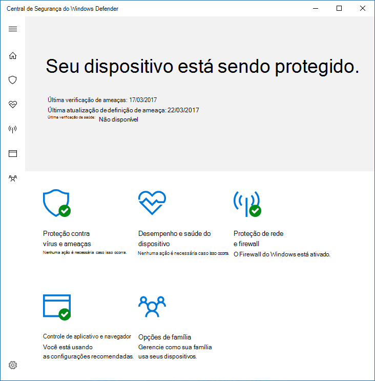

# Impedir que os usuários vejam ou interajam com a interface do usuário do Microsoft Defender AntivírusPrevent users from seeing or interacting with the Microsoft Defender Antivirus user interface

[!INCLUDE [Microsoft 365 Defender rebranding](../../includes/microsoft-defender.md)]

**Aplica-se a:****Applies to:**

- [Microsoft Defender para Ponto de ExtremidadeMicrosoft Defender for Endpoint](/microsoft-365/security/defender-endpoint/)

Você pode usar a Política de Grupo para impedir que os usuários nos pontos de extremidade possam ver a interface do Microsoft Defender Antivírus.You can use Group Policy to prevent users on endpoints from seeing the Microsoft Defender Antivirus interface. Você também pode impedi-los de pausar verificações.You can also prevent them from pausing scans.

## Ocultar a interface do Microsoft Defender AntivírusHide the Microsoft Defender Antivirus interface

No Windows 10, versões 1703, ocultar a interface ocultará as notificações do Microsoft Defender Antivírus e impedirá que o & proteção contra vírus apareça no aplicativo segurança do Windows.In Windows 10, versions 1703, hiding the interface will hide Microsoft Defender Antivirus notifications and prevent the Virus & threat protection tile from appearing in the Windows Security app.

Com a configuração definida como **Habilitado:**With the setting set to **Enabled**:

Com a configuração definida como **Desabilitada** ou não configurada:With the setting set to **Disabled** or not configured:

>[!NOTE]
>Ocultar a interface também impedirá que as notificações do Microsoft Defender Antivírus apareçam no ponto de extremidade.Hiding the interface will also prevent Microsoft Defender Antivirus notifications from appearing on the endpoint. As notificações do Microsoft Defender para Ponto de Extremidade ainda serão exibidas.Microsoft Defender for Endpoint notifications will still appear. Você também pode configurar individualmente [as notificações que aparecem nos pontos de extremidade](configure-notifications-microsoft-defender-antivirus.md)You can also individually [configure the notifications that appear on endpoints](configure-notifications-microsoft-defender-antivirus.md)

Em versões anteriores do Windows 10, a configuração ocultará a interface Windows Defender cliente.In earlier versions of Windows 10, the setting will hide the Windows Defender client interface. Se o usuário tentar abri-lo, ele receberá um aviso informando: "O administrador do sistema tem acesso restrito a esse aplicativo".If the user attempts to open it, they will receive a warning that says, "Your system administrator has restricted access to this app."

## Usar a Política de Grupo para ocultar a interface do Microsoft Defender AV dos usuáriosUse Group Policy to hide the Microsoft Defender AV interface from users

1. Em sua máquina de gerenciamento de Política de Grupo, abra o Console de Gerenciamento de Política de [Grupo](/previous-versions/windows/desktop/gpmc/group-policy-management-console-portal), clique com o botão direito do mouse no Objeto de Política de Grupo que você deseja configurar e clique em **Editar**.On your Group Policy management machine, open the [Group Policy Management Console](/previous-versions/windows/desktop/gpmc/group-policy-management-console-portal), right-click the Group Policy Object you want to configure and click **Edit**.

2. Usando o **Editor de Gerenciamento de Política de Grupo,** vá para **Configuração do computador.**Using the **Group Policy Management Editor** go to **Computer configuration**.

3. Clique **em Modelos Administrativos**.Click **Administrative templates**.

4. Expanda a árvore para componentes do Windows > interface do Cliente do **Microsoft Defender Antivírus >.**Expand the tree to **Windows components > Microsoft Defender Antivirus > Client interface**.

5. Clique duas vezes na **configuração Habilitar modo de interface** do usuário sem cabeça e de definir a opção **como Habilitado**.Double-click the **Enable headless UI mode** setting and set the option to **Enabled**. Clique em **OK**.Click **OK**. 

Consulte [Impedir que os usuários modifiquem localmente](configure-local-policy-overrides-microsoft-defender-antivirus.md) as configurações de política para obter mais opções sobre como impedir que os usuários formem modificar a proteção em seus PCs.See [Prevent users from locally modifying policy settings](configure-local-policy-overrides-microsoft-defender-antivirus.md) for more options on preventing users form modifying protection on their PCs.

## Impedir que os usuários pausem uma verificaçãoPrevent users from pausing a scan

Você pode impedir que os usuários pausem verificações, o que pode ser útil para garantir que as verificações agendadas ou sob demanda não sejam interrompidas pelos usuários.You can prevent users from pausing scans, which can be helpful to ensure scheduled or on-demand scans are not interrupted by users.

> [!NOTE]
> Essa configuração não é suportada no Windows 10.This setting is not supported on Windows 10.

### Usar a Política de Grupo para impedir que os usuários pausem uma verificaçãoUse Group Policy to prevent users from pausing a scan

1. Em sua máquina de gerenciamento de Política de Grupo, abra o Console de Gerenciamento de Política de [Grupo](/previous-versions/windows/desktop/gpmc/group-policy-management-console-portal), clique com o botão direito do mouse no Objeto de Política de Grupo que você deseja configurar e clique em **Editar**.On your Group Policy management machine, open the [Group Policy Management Console](/previous-versions/windows/desktop/gpmc/group-policy-management-console-portal), right-click the Group Policy Object you want to configure and click **Edit**.

2. Usando o **Editor de Gerenciamento de Política de Grupo,** vá para **Configuração do computador.**Using the **Group Policy Management Editor** go to **Computer configuration**.

3. Clique **em Modelos Administrativos**.Click **Administrative templates**.

4. Expanda a árvore para **componentes do Windows**  >  **Microsoft Defender**  >  **Antivírus Scan**.Expand the tree to **Windows components** > **Microsoft Defender Antivirus** > **Scan**.

5. Clique duas vezes na **configuração Permitir que os usuários pausem a verificação** e de definir a opção como **Desabilitada**.Double-click the **Allow users to pause scan** setting and set the option to **Disabled**. Clique em **OK**.Click **OK**. 

## Artigos relacionadosRelated articles

- [Configurar as notificações que aparecem nos pontos de extremidadeConfigure the notifications that appear on endpoints](configure-notifications-microsoft-defender-antivirus.md)

- [Configurar a interação do usuário final com o Microsoft Defender AntivírusConfigure end-user interaction with Microsoft Defender Antivirus](configure-end-user-interaction-microsoft-defender-antivirus.md)

- [Microsoft Defender Antivírus no Windows 10Microsoft Defender Antivirus in Windows 10](microsoft-defender-antivirus-in-windows-10.md)