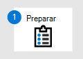

# <a name="set-up-microsoft-defender-for-endpoint-deployment"></a><span data-ttu-id="85032-104">Configurar o Microsoft Defender para implantação do Ponto de Extremidade</span><span class="sxs-lookup"><span data-stu-id="85032-104">Set up Microsoft Defender for Endpoint deployment</span></span>

[!INCLUDE [Microsoft 365 Defender rebranding](../../includes/microsoft-defender.md)]


<span data-ttu-id="85032-105">**Aplica-se a:**</span><span class="sxs-lookup"><span data-stu-id="85032-105">**Applies to:**</span></span>
- [<span data-ttu-id="85032-106">Microsoft Defender para Ponto de Extremidade</span><span class="sxs-lookup"><span data-stu-id="85032-106">Microsoft Defender for Endpoint</span></span>](https://go.microsoft.com/fwlink/p/?linkid=2154037)
- [<span data-ttu-id="85032-107">Microsoft 365 Defender</span><span class="sxs-lookup"><span data-stu-id="85032-107">Microsoft 365 Defender</span></span>](https://go.microsoft.com/fwlink/?linkid=2118804)

> <span data-ttu-id="85032-108">Deseja experimentar o Microsoft Defender para Ponto de Extremidade?</span><span class="sxs-lookup"><span data-stu-id="85032-108">Want to experience Microsoft Defender for Endpoint?</span></span> [<span data-ttu-id="85032-109">Inscreva-se para uma avaliação gratuita.</span><span class="sxs-lookup"><span data-stu-id="85032-109">Sign up for a free trial.</span></span>](https://www.microsoft.com/microsoft-365/windows/microsoft-defender-atp?ocid=docs-wdatp-exposedapis-abovefoldlink)

<span data-ttu-id="85032-110">Implantar o Defender para Ponto de Extremidade é um processo de três fases:</span><span class="sxs-lookup"><span data-stu-id="85032-110">Deploying Defender for Endpoint is a three-phase process:</span></span>

| <span data-ttu-id="85032-111">[](prepare-deployment.md)</span><span class="sxs-lookup"><span data-stu-id="85032-111">[](prepare-deployment.md)</span></span><br>[<span data-ttu-id="85032-112">Fase 1: Preparar</span><span class="sxs-lookup"><span data-stu-id="85032-112">Phase 1: Prepare</span></span>](prepare-deployment.md) | <br><span data-ttu-id="85032-114">Fase 2: Configurar</span><span class="sxs-lookup"><span data-stu-id="85032-114">Phase 2: Setup</span></span> | <span data-ttu-id="85032-115">[](onboarding.md)</span><span class="sxs-lookup"><span data-stu-id="85032-115">[](onboarding.md)</span></span><br>[<span data-ttu-id="85032-116">Fase 3: Integrar</span><span class="sxs-lookup"><span data-stu-id="85032-116">Phase 3: Onboard</span></span>](onboarding.md) |
| ----- | ----- | ----- |
| | <span data-ttu-id="85032-117">*Você está aqui!*</span><span class="sxs-lookup"><span data-stu-id="85032-117">*You are here!*</span></span>||

<span data-ttu-id="85032-118">No momento, você está na fase de configuração.</span><span class="sxs-lookup"><span data-stu-id="85032-118">You are currently in the set-up phase.</span></span>

<span data-ttu-id="85032-119">Neste cenário de implantação, você será orientado pelas etapas em:</span><span class="sxs-lookup"><span data-stu-id="85032-119">In this deployment scenario, you'll be guided through the steps on:</span></span>
- <span data-ttu-id="85032-120">Validação de licenciamento</span><span class="sxs-lookup"><span data-stu-id="85032-120">Licensing validation</span></span>
- <span data-ttu-id="85032-121">Configuração de locatário</span><span class="sxs-lookup"><span data-stu-id="85032-121">Tenant configuration</span></span>
- <span data-ttu-id="85032-122">Configuração da rede</span><span class="sxs-lookup"><span data-stu-id="85032-122">Network configuration</span></span>


>[!NOTE]
><span data-ttu-id="85032-123">Para orientar você por meio de uma implantação típica, esse cenário só abrange o uso do Microsoft Endpoint Configuration Manager.</span><span class="sxs-lookup"><span data-stu-id="85032-123">For the purpose of guiding you through a typical deployment, this scenario will only cover the use of Microsoft Endpoint Configuration Manager.</span></span> <span data-ttu-id="85032-124">O Defender for Endpoint dá suporte ao uso de outras ferramentas de integração, mas não abrange esses cenários no guia de implantação.</span><span class="sxs-lookup"><span data-stu-id="85032-124">Defender for Endpoint supports the use of other onboarding tools but won't cover those scenarios in the deployment guide.</span></span> <span data-ttu-id="85032-125">Para obter mais informações, consulte [Onboard devices to Microsoft Defender for Endpoint](onboard-configure.md).</span><span class="sxs-lookup"><span data-stu-id="85032-125">For more information, see [Onboard devices to Microsoft Defender for Endpoint](onboard-configure.md).</span></span>

## <a name="check-license-state"></a><span data-ttu-id="85032-126">Verificar o estado da licença</span><span class="sxs-lookup"><span data-stu-id="85032-126">Check license state</span></span>

<span data-ttu-id="85032-127">Verificar o estado da licença e se ele foi provisionado corretamente, pode ser feito por meio do centro de administração ou por meio do portal do **Microsoft Azure.**</span><span class="sxs-lookup"><span data-stu-id="85032-127">Checking for the license state and whether it got properly provisioned, can be done through the admin center or through the **Microsoft Azure portal**.</span></span>

1. <span data-ttu-id="85032-128">Para exibir suas licenças, acesse o portal do **Microsoft Azure** e navegue até a seção licença [do portal do Microsoft Azure.](https://portal.azure.com/#blade/Microsoft_AAD_IAM/LicensesMenuBlade/Products)</span><span class="sxs-lookup"><span data-stu-id="85032-128">To view your licenses, go to the **Microsoft Azure portal** and navigate to the [Microsoft Azure portal license section](https://portal.azure.com/#blade/Microsoft_AAD_IAM/LicensesMenuBlade/Products).</span></span>

   

1. <span data-ttu-id="85032-130">Como alternativa, no centro de administração, navegue até **Cobrança**  >  **de Assinaturas**.</span><span class="sxs-lookup"><span data-stu-id="85032-130">Alternately, in the admin center, navigate to **Billing** > **Subscriptions**.</span></span>

    <span data-ttu-id="85032-131">Na tela, você verá todas as licenças provisionadas e seu **Status atual.**</span><span class="sxs-lookup"><span data-stu-id="85032-131">On the screen, you'll see all the provisioned licenses and their current **Status**.</span></span>

    


## <a name="cloud-service-provider-validation"></a><span data-ttu-id="85032-133">Validação do Provedor de Serviços na Nuvem</span><span class="sxs-lookup"><span data-stu-id="85032-133">Cloud Service Provider validation</span></span>

<span data-ttu-id="85032-134">Para obter acesso a quais licenças são provisionadas para sua empresa e verificar o estado das licenças, vá para o centro de administração.</span><span class="sxs-lookup"><span data-stu-id="85032-134">To gain access into which licenses are provisioned to your company, and to check the state of the licenses, go to the admin center.</span></span>

1. <span data-ttu-id="85032-135">No **portal parceiro,** selecione **Administrar serviços > Office 365**.</span><span class="sxs-lookup"><span data-stu-id="85032-135">From the **Partner portal**, select **Administer services > Office 365**.</span></span>

2. <span data-ttu-id="85032-136">Clicar no link **portal do** Parceiro abrirá a opção Administrador em **nome** e lhe dará acesso ao centro de administração do cliente.</span><span class="sxs-lookup"><span data-stu-id="85032-136">Clicking on the **Partner portal** link will open the **Admin on behalf** option and will give you access to the customer admin center.</span></span>

   


## <a name="tenant-configuration"></a><span data-ttu-id="85032-138">Configuração do Locatário</span><span class="sxs-lookup"><span data-stu-id="85032-138">Tenant Configuration</span></span>

<span data-ttu-id="85032-139">Ao acessar o Centro de Segurança do Microsoft Defender pela primeira vez, um assistente que o guiará por algumas etapas iniciais.</span><span class="sxs-lookup"><span data-stu-id="85032-139">When accessing Microsoft Defender Security Center for the first time, a wizard that will guide you through some initial steps.</span></span> <span data-ttu-id="85032-140">No final do assistente de instalação, haverá uma instância de nuvem dedicada do Defender para Ponto de Extremidade criada.</span><span class="sxs-lookup"><span data-stu-id="85032-140">At the end of the setup wizard, there will be a dedicated cloud instance of Defender for Endpoint created.</span></span> <span data-ttu-id="85032-141">O método mais fácil é executar essas etapas de um dispositivo cliente Windows 10.</span><span class="sxs-lookup"><span data-stu-id="85032-141">The easiest method is to perform these steps from a Windows 10 client device.</span></span>

1. <span data-ttu-id="85032-142">Em um navegador da Web, navegue até <https://securitycenter.windows.com> .</span><span class="sxs-lookup"><span data-stu-id="85032-142">From a web browser, navigate to <https://securitycenter.windows.com>.</span></span>

    

2. <span data-ttu-id="85032-144">Se passar por uma licença TRIAL, vá para o link ( <https://signup.microsoft.com/Signup?OfferId=6033e4b5-c320-4008-a936-909c2825d83c&dl=WIN_DEF_ATP&pc=xxxxxxx-xxxxxx-xxx-x> )</span><span class="sxs-lookup"><span data-stu-id="85032-144">If going through a TRIAL license, go to the link (<https://signup.microsoft.com/Signup?OfferId=6033e4b5-c320-4008-a936-909c2825d83c&dl=WIN_DEF_ATP&pc=xxxxxxx-xxxxxx-xxx-x>)</span></span>

    <span data-ttu-id="85032-145">Depois que a etapa de autorização for concluída, a tela **de** boas-vindas será exibida.</span><span class="sxs-lookup"><span data-stu-id="85032-145">Once the authorization step is completed, the **Welcome** screen will be displayed.</span></span>
3. <span data-ttu-id="85032-146">Vá pelas etapas de autorização.</span><span class="sxs-lookup"><span data-stu-id="85032-146">Go through the authorization steps.</span></span>

    

4. <span data-ttu-id="85032-148">Configurar preferências.</span><span class="sxs-lookup"><span data-stu-id="85032-148">Set up preferences.</span></span>

   <span data-ttu-id="85032-149">**Local de armazenamento de** dados - É importante configurar isso corretamente.</span><span class="sxs-lookup"><span data-stu-id="85032-149">**Data storage location** - It's important to set this up correctly.</span></span> <span data-ttu-id="85032-150">Determine onde o cliente deseja ser hospedado principalmente: EUA, UE ou Reino Unido.</span><span class="sxs-lookup"><span data-stu-id="85032-150">Determine where the customer wants to be primarily hosted: US, EU, or UK.</span></span> <span data-ttu-id="85032-151">Não é possível alterar o local após essa configuração e a Microsoft não transferirá os dados da localização geográfica especificada.</span><span class="sxs-lookup"><span data-stu-id="85032-151">You can't change the location after this set up and Microsoft won't transfer the data from the specified geolocation.</span></span> 

    <span data-ttu-id="85032-152">**Retenção de dados** - O padrão é de seis meses.</span><span class="sxs-lookup"><span data-stu-id="85032-152">**Data retention** - The default is six months.</span></span>

    <span data-ttu-id="85032-153">**Habilitar recursos de** visualização - O padrão está ativado, pode ser alterado posteriormente.</span><span class="sxs-lookup"><span data-stu-id="85032-153">**Enable preview features** - The default is on, can be changed later.</span></span>

    

5. <span data-ttu-id="85032-155">Selecione **Avançar**.</span><span class="sxs-lookup"><span data-stu-id="85032-155">Select **Next**.</span></span>

     

6. <span data-ttu-id="85032-157">Selecione **Continuar**.</span><span class="sxs-lookup"><span data-stu-id="85032-157">Select **Continue**.</span></span>


## <a name="network-configuration"></a><span data-ttu-id="85032-158">Configuração da rede</span><span class="sxs-lookup"><span data-stu-id="85032-158">Network configuration</span></span>
<span data-ttu-id="85032-159">Se a organização não exigir que os pontos de extremidade usem um Proxy para acessar a Internet, ignore esta seção.</span><span class="sxs-lookup"><span data-stu-id="85032-159">If the organization doesn't require the endpoints to use a Proxy to access the Internet, skip this section.</span></span>

<span data-ttu-id="85032-160">O sensor Microsoft Defender ATP requer o Microsoft Windows HTTP (WinHTTP) para relatar os dados do sensor e se comunicar com o serviço Microsoft Defender ATP.</span><span class="sxs-lookup"><span data-stu-id="85032-160">The Microsoft Defender for Endpoint sensor requires Microsoft Windows HTTP (WinHTTP) to report sensor data and communicate with the Microsoft Defender for Endpoint service.</span></span> <span data-ttu-id="85032-161">O sensor incorporado do Microsoft Defender para Ponto de Extremidade é executado no contexto do sistema usando a conta LocalSystem.</span><span class="sxs-lookup"><span data-stu-id="85032-161">The embedded Microsoft Defender for Endpoint sensor runs in the system context using the LocalSystem account.</span></span> <span data-ttu-id="85032-162">O sensor usa o Microsoft Windows HTTP Services (WinHTTP) para permitir a comunicação com o serviço de nuvem Microsoft Defender ATP.</span><span class="sxs-lookup"><span data-stu-id="85032-162">The sensor uses Microsoft Windows HTTP Services (WinHTTP) to enable communication with the Microsoft Defender for Endpoint cloud service.</span></span> <span data-ttu-id="85032-163">A configuração do WinHTTP é independente das configurações de proxy de navegação da Internet do Windows (WinINet) e só pode descobrir um servidor proxy usando os seguintes métodos de descoberta:</span><span class="sxs-lookup"><span data-stu-id="85032-163">The WinHTTP configuration setting is independent of the Windows Internet (WinINet) internet browsing proxy settings and can only discover a proxy server by using the following discovery methods:</span></span>

<span data-ttu-id="85032-164">**Métodos de Descoberta Automática:**</span><span class="sxs-lookup"><span data-stu-id="85032-164">**Autodiscovery methods:**</span></span>

-   <span data-ttu-id="85032-165">Proxy transparente</span><span class="sxs-lookup"><span data-stu-id="85032-165">Transparent proxy</span></span>

-   <span data-ttu-id="85032-166">Protocolo de Descoberta Automática de Proxy da Web (WPAD)</span><span class="sxs-lookup"><span data-stu-id="85032-166">Web Proxy Autodiscovery Protocol (WPAD)</span></span>

<span data-ttu-id="85032-167">Se um proxy transparente ou WPAD tiver sido implementado na topologia de rede, não será necessário definir configurações especiais.</span><span class="sxs-lookup"><span data-stu-id="85032-167">If a Transparent proxy or WPAD has been implemented in the network topology, there is no need for special configuration settings.</span></span> <span data-ttu-id="85032-168">Para obter mais informações sobre as exclusões de URL do Microsoft Defender para Ponto de Extremidade no proxy, consulte a seção [URLs](production-deployment.md#proxy-service-urls) do Serviço proxy neste documento para a lista de URLs permitir ou em Configurar configurações de proxy de dispositivo e conectividade com [a Internet.](configure-proxy-internet.md#enable-access-to-microsoft-defender-for-endpoint-service-urls-in-the-proxy-server)</span><span class="sxs-lookup"><span data-stu-id="85032-168">For more information on Microsoft Defender for Endpoint URL exclusions in the proxy, see the [Proxy Service URLs](production-deployment.md#proxy-service-urls) section in this document for the URLs allow list or on [Configure device proxy and Internet connectivity settings](configure-proxy-internet.md#enable-access-to-microsoft-defender-for-endpoint-service-urls-in-the-proxy-server).</span></span>

<span data-ttu-id="85032-169">**Configuração manual de proxy estático:**</span><span class="sxs-lookup"><span data-stu-id="85032-169">**Manual static proxy configuration:**</span></span>

-   <span data-ttu-id="85032-170">Configuração baseada em registro</span><span class="sxs-lookup"><span data-stu-id="85032-170">Registry-based configuration</span></span>

-   <span data-ttu-id="85032-171">WinHTTP configurado usando o comando netsh</span><span class="sxs-lookup"><span data-stu-id="85032-171">WinHTTP configured using netsh command</span></span> <br> <span data-ttu-id="85032-172">Adequado apenas para áreas de trabalho em uma topologia estável (por exemplo: uma área de trabalho em uma rede corporativa por trás do mesmo proxy)</span><span class="sxs-lookup"><span data-stu-id="85032-172">Suitable only for desktops in a stable topology (for example: a desktop in a corporate network behind the same proxy)</span></span>

### <a name="configure-the-proxy-server-manually-using-a-registry-based-static-proxy"></a><span data-ttu-id="85032-173">Configure o servidor proxy manualmente usando um proxy estático baseado no registro</span><span class="sxs-lookup"><span data-stu-id="85032-173">Configure the proxy server manually using a registry-based static proxy</span></span>

<span data-ttu-id="85032-174">Configure um proxy estático baseado no Registro para permitir que apenas o microsoft Defender para sensor de ponto de extremidade reporte dados de diagnóstico e se comunique com o Microsoft Defender para serviços de Ponto de Extremidade se um computador não tiver permissão para se conectar à Internet.</span><span class="sxs-lookup"><span data-stu-id="85032-174">Configure a registry-based static proxy to allow only Microsoft Defender for Endpoint sensor to report diagnostic data and communicate with Microsoft Defender for Endpoint services if a computer isn't permitted to connect to the Internet.</span></span> <span data-ttu-id="85032-175">O proxy estático é configurável por meio da Política de Grupo (GP).</span><span class="sxs-lookup"><span data-stu-id="85032-175">The static proxy is configurable through Group Policy (GP).</span></span> <span data-ttu-id="85032-176">A política do grupo pode ser encontrada em:</span><span class="sxs-lookup"><span data-stu-id="85032-176">The group policy can be found under:</span></span>

 - <span data-ttu-id="85032-177">Modelos Administrativos \> Windows Components Data Collection and Preview \> Builds Configure \> Authenticated Proxy usage for the Connected User Experience and Telemetry Service</span><span class="sxs-lookup"><span data-stu-id="85032-177">Administrative Templates \> Windows Components \> Data Collection and Preview Builds \> Configure Authenticated Proxy usage for the Connected User Experience and Telemetry Service</span></span>
     - <span data-ttu-id="85032-178">De defini-lo **como Habilitado e** selecione **Desabilitar o uso de Proxy Autenticado**</span><span class="sxs-lookup"><span data-stu-id="85032-178">Set it to **Enabled** and select **Disable Authenticated Proxy usage**</span></span>

1. <span data-ttu-id="85032-179">Abra o Console de Gerenciamento de Política de Grupo.</span><span class="sxs-lookup"><span data-stu-id="85032-179">Open the Group Policy Management Console.</span></span>
2. <span data-ttu-id="85032-180">Crie uma política ou edite uma política existente com base nas práticas organizacionais.</span><span class="sxs-lookup"><span data-stu-id="85032-180">Create a policy or edit an existing policy based off the organizational practices.</span></span>
3. <span data-ttu-id="85032-181">Edite a Política de Grupo e navegue até Modelos Administrativos Componentes do Windows Data Collection and **\> Preview \> Builds Configure \> Authenticated Proxy usage for the Connected User Experience and Telemetry Service**.</span><span class="sxs-lookup"><span data-stu-id="85032-181">Edit the Group Policy and navigate to **Administrative Templates \> Windows Components \> Data Collection and Preview Builds \> Configure Authenticated Proxy usage for the Connected User Experience and Telemetry Service**.</span></span> 
    <span data-ttu-id="85032-182"></span><span class="sxs-lookup"><span data-stu-id="85032-182"></span></span>

4. <span data-ttu-id="85032-183">Selecione **Habilitado**.</span><span class="sxs-lookup"><span data-stu-id="85032-183">Select **Enabled**.</span></span>
5. <span data-ttu-id="85032-184">Selecione **Desabilitar o uso de Proxy Autenticado**.</span><span class="sxs-lookup"><span data-stu-id="85032-184">Select **Disable Authenticated Proxy usage**.</span></span>
   
6. <span data-ttu-id="85032-185">Navegue até **Modelos Administrativos \> Windows Components Data Collection and Preview \> Builds Configure connected user experiences and \> telemetry**.</span><span class="sxs-lookup"><span data-stu-id="85032-185">Navigate to **Administrative Templates \> Windows Components \> Data Collection and Preview Builds \> Configure connected user experiences and telemetry**.</span></span>
    <span data-ttu-id="85032-186"></span><span class="sxs-lookup"><span data-stu-id="85032-186"></span></span>
7. <span data-ttu-id="85032-187">Selecione **Habilitado**.</span><span class="sxs-lookup"><span data-stu-id="85032-187">Select **Enabled**.</span></span>
8. <span data-ttu-id="85032-188">Insira o **Nome do Servidor Proxy**.</span><span class="sxs-lookup"><span data-stu-id="85032-188">Enter the **Proxy Server Name**.</span></span>

<span data-ttu-id="85032-189">A política define dois valores de registro `TelemetryProxyServer` como REG_SZ e `DisableEnterpriseAuthProxy` como REG_DWORD na chave de registro `HKLM\Software\Policies\Microsoft\Windows\DataCollection`.</span><span class="sxs-lookup"><span data-stu-id="85032-189">The policy sets two registry values `TelemetryProxyServer` as REG_SZ and `DisableEnterpriseAuthProxy` as REG_DWORD under the registry key `HKLM\Software\Policies\Microsoft\Windows\DataCollection`.</span></span>

<span data-ttu-id="85032-190">O valor do Registro `TelemetryProxyServer` assume o seguinte formato de cadeia de caracteres:</span><span class="sxs-lookup"><span data-stu-id="85032-190">The registry value `TelemetryProxyServer` takes the following string format:</span></span>

```text
<server name or ip>:<port>
```

<span data-ttu-id="85032-191">Por exemplo: 10.0.0.6:8080</span><span class="sxs-lookup"><span data-stu-id="85032-191">For example: 10.0.0.6:8080</span></span>

<span data-ttu-id="85032-192">O valor de registro `DisableEnterpriseAuthProxy` deve ser definido como 1.</span><span class="sxs-lookup"><span data-stu-id="85032-192">The registry value `DisableEnterpriseAuthProxy` should be set to 1.</span></span>

###  <a name="configure-the-proxy-server-manually-using-netsh-command"></a><span data-ttu-id="85032-193">Configurar o servidor proxy manualmente usando o comando netsh</span><span class="sxs-lookup"><span data-stu-id="85032-193">Configure the proxy server manually using netsh command</span></span>

<span data-ttu-id="85032-194">Use netsh para configurar um proxy estático de todo o sistema.</span><span class="sxs-lookup"><span data-stu-id="85032-194">Use netsh to configure a system-wide static proxy.</span></span>

> [!NOTE]
> - <span data-ttu-id="85032-195">Isso afetará todos os aplicativos, incluindo serviços do Windows que usam WinHTTP com proxy padrão.</span><span class="sxs-lookup"><span data-stu-id="85032-195">This will affect all applications including Windows services which use WinHTTP with default proxy.</span></span></br>
> - <span data-ttu-id="85032-196">Laptops que estão alterando a topologia (por exemplo: do office para o home) não funcionarão com netsh.</span><span class="sxs-lookup"><span data-stu-id="85032-196">Laptops that are changing topology (for example: from office to home) will malfunction with netsh.</span></span> <span data-ttu-id="85032-197">Use a configuração de proxy estático com base no registro.</span><span class="sxs-lookup"><span data-stu-id="85032-197">Use the registry-based static proxy configuration.</span></span>

1. <span data-ttu-id="85032-198">Abra uma linha de comando com privilégios elevados:</span><span class="sxs-lookup"><span data-stu-id="85032-198">Open an elevated command line:</span></span>

    1. <span data-ttu-id="85032-199">Vá para **Iniciar** e digite **cmd**.</span><span class="sxs-lookup"><span data-stu-id="85032-199">Go to **Start** and type **cmd**.</span></span>

    1. <span data-ttu-id="85032-200">Clique com o botão direito do mouse em **Prompt de Comando** e selecione **Executar como administrador**.</span><span class="sxs-lookup"><span data-stu-id="85032-200">Right-click **Command prompt** and select **Run as administrator**.</span></span>

2. <span data-ttu-id="85032-201">Insira o seguinte comando e pressione **Enter**:</span><span class="sxs-lookup"><span data-stu-id="85032-201">Enter the following command and press **Enter**:</span></span>

   ```PowerShell
   netsh winhttp set proxy <proxy>:<port>
   ```

   <span data-ttu-id="85032-202">Por exemplo: netsh winhttp set proxy 10.0.0.6:8080</span><span class="sxs-lookup"><span data-stu-id="85032-202">For example: netsh winhttp set proxy 10.0.0.6:8080</span></span>


###  <a name="proxy-configuration-for-down-level-devices"></a><span data-ttu-id="85032-203">Configuração de Proxy para dispositivos de nível inferior</span><span class="sxs-lookup"><span data-stu-id="85032-203">Proxy Configuration for down-level devices</span></span>

<span data-ttu-id="85032-204">Down-Level dispositivos incluem estações de trabalho do Windows 7 SP1 e Windows 8.1, bem como Windows Server 2008 R2, Windows Server 2012, Windows Server 2012 R2 e versões do Windows Server 2016 antes do Windows Server CB 1803.</span><span class="sxs-lookup"><span data-stu-id="85032-204">Down-Level devices include Windows 7 SP1 and Windows 8.1 workstations as well as Windows Server 2008 R2, Windows Server 2012, Windows Server 2012 R2, and versions of Windows Server 2016 prior to Windows Server CB 1803.</span></span> <span data-ttu-id="85032-205">Esses sistemas operacionais terão o proxy configurado como parte do Agente de Gerenciamento da Microsoft para manipular a comunicação do ponto de extremidade para o Azure.</span><span class="sxs-lookup"><span data-stu-id="85032-205">These operating systems will have the proxy configured as part of the Microsoft Management Agent to handle communication from the endpoint to Azure.</span></span> <span data-ttu-id="85032-206">Consulte o Guia de Implantação Rápida do Agente de Gerenciamento da Microsoft para obter informações sobre como um proxy é configurado nesses dispositivos.</span><span class="sxs-lookup"><span data-stu-id="85032-206">Refer to the Microsoft Management Agent Fast Deployment Guide for information on how a proxy is configured on these devices.</span></span>

### <a name="proxy-service-urls"></a><span data-ttu-id="85032-207">URLs do Serviço proxy</span><span class="sxs-lookup"><span data-stu-id="85032-207">Proxy Service URLs</span></span>
<span data-ttu-id="85032-208">AS URLs que incluem v20 neles só serão necessárias se você tiver o Windows 10, versão 1803 ou dispositivos posteriores.</span><span class="sxs-lookup"><span data-stu-id="85032-208">URLs that include v20 in them are only needed if you have Windows 10, version 1803 or later devices.</span></span> <span data-ttu-id="85032-209">Por exemplo, só será necessário se o dispositivo estiver no ```us-v20.events.data.microsoft.com``` Windows 10, versão 1803 ou posterior.</span><span class="sxs-lookup"><span data-stu-id="85032-209">For example, ```us-v20.events.data.microsoft.com``` is only needed if the device is on Windows 10, version 1803 or later.</span></span>
 

<span data-ttu-id="85032-210">Se um proxy ou firewall estiver bloqueando o tráfego anônimo, como o sensor do Microsoft Defender para Ponto de Extremidade está se conectando do contexto do sistema, certifique-se de que o tráfego anônimo seja permitido nas URLs listadas.</span><span class="sxs-lookup"><span data-stu-id="85032-210">If a proxy or firewall is blocking anonymous traffic, as Microsoft Defender for Endpoint sensor is connecting from system context, make sure anonymous traffic is permitted in the listed URLs.</span></span>

<span data-ttu-id="85032-211">A planilha baixável a seguir lista os serviços e as URLs associadas às quais sua rede deve ser capaz de se conectar.</span><span class="sxs-lookup"><span data-stu-id="85032-211">The following downloadable spreadsheet lists the services and their associated URLs that your network must be able to connect to.</span></span> <span data-ttu-id="85032-212">Verifique se não há regras de filtragem de rede ou firewall que negariam o acesso a essas URLs, ou talvez seja necessário criar uma regra *de* autorização especificamente para elas.</span><span class="sxs-lookup"><span data-stu-id="85032-212">Ensure there are no firewall or network filtering rules that would deny access to these URLs, or you may need to create an *allow* rule specifically for them.</span></span>

|<span data-ttu-id="85032-213">**Planilha de lista de domínios**</span><span class="sxs-lookup"><span data-stu-id="85032-213">**Spreadsheet of domains list**</span></span>|<span data-ttu-id="85032-214">**Descrição**</span><span class="sxs-lookup"><span data-stu-id="85032-214">**Description**</span></span>|
|:-----|:-----|
|<br/>  | <span data-ttu-id="85032-216">Planilha de registros DNS específicos para locais de serviço, localizações geográficas e sistema operacional.</span><span class="sxs-lookup"><span data-stu-id="85032-216">Spreadsheet of specific DNS records for service locations, geographic locations, and OS.</span></span> <br><br>[<span data-ttu-id="85032-217">Baixe a planilha aqui.</span><span class="sxs-lookup"><span data-stu-id="85032-217">Download the spreadsheet here.</span></span>](https://download.microsoft.com/download/8/a/5/8a51eee5-cd02-431c-9d78-a58b7f77c070/mde-urls.xlsx) 


###  <a name="microsoft-defender-for-endpoint-service-backend-ip-ranges"></a><span data-ttu-id="85032-218">Intervalos de IP de back-end do Serviço do Microsoft Defender para Ponto de Extremidade</span><span class="sxs-lookup"><span data-stu-id="85032-218">Microsoft Defender for Endpoint service backend IP ranges</span></span>

<span data-ttu-id="85032-219">Se seus dispositivos de rede não suportam regras baseadas em DNS, use intervalos IP.</span><span class="sxs-lookup"><span data-stu-id="85032-219">If your network devices don't support DNS-based rules, use IP ranges instead.</span></span>

<span data-ttu-id="85032-220">O Defender para Ponto de Extremidade é criado na nuvem do Azure, implantado nas seguintes regiões:</span><span class="sxs-lookup"><span data-stu-id="85032-220">Defender for Endpoint is built in Azure cloud, deployed in the following regions:</span></span>

- <span data-ttu-id="85032-221">AzureCloud.eastus</span><span class="sxs-lookup"><span data-stu-id="85032-221">AzureCloud.eastus</span></span>
- <span data-ttu-id="85032-222">AzureCloud.eastus2</span><span class="sxs-lookup"><span data-stu-id="85032-222">AzureCloud.eastus2</span></span>
- <span data-ttu-id="85032-223">AzureCloud.westcentralus</span><span class="sxs-lookup"><span data-stu-id="85032-223">AzureCloud.westcentralus</span></span>
- <span data-ttu-id="85032-224">AzureCloud.northeurope</span><span class="sxs-lookup"><span data-stu-id="85032-224">AzureCloud.northeurope</span></span>
- <span data-ttu-id="85032-225">AzureCloud.westeurope</span><span class="sxs-lookup"><span data-stu-id="85032-225">AzureCloud.westeurope</span></span>
- <span data-ttu-id="85032-226">AzureCloud.uksouth</span><span class="sxs-lookup"><span data-stu-id="85032-226">AzureCloud.uksouth</span></span>
- <span data-ttu-id="85032-227">AzureCloud.ukwest</span><span class="sxs-lookup"><span data-stu-id="85032-227">AzureCloud.ukwest</span></span>

<span data-ttu-id="85032-228">Você pode encontrar os intervalos de IP do Azure em Intervalos IP do Azure e Marcas de Serviço [– Nuvem Pública.](https://www.microsoft.com/download/details.aspx?id=56519)</span><span class="sxs-lookup"><span data-stu-id="85032-228">You can find the Azure IP ranges in [Azure IP Ranges and Service Tags – Public Cloud](https://www.microsoft.com/download/details.aspx?id=56519).</span></span>

> [!NOTE]
> <span data-ttu-id="85032-229">Como uma solução baseada em nuvem, os intervalos de endereços IP podem mudar.</span><span class="sxs-lookup"><span data-stu-id="85032-229">As a cloud-based solution, the IP address ranges can change.</span></span> <span data-ttu-id="85032-230">É recomendável mover para regras baseadas em DNS.</span><span class="sxs-lookup"><span data-stu-id="85032-230">It's recommended you move to DNS-based rules.</span></span>

> [!NOTE]
> <span data-ttu-id="85032-231">Se você for um cliente do Governo dos EUA, consulte a seção correspondente na [página Defender for Endpoint for US Government.](gov.md#service-backend-ip-ranges)</span><span class="sxs-lookup"><span data-stu-id="85032-231">If you are a US Government customer, please see the corresponding section in the [Defender for Endpoint for US Government](gov.md#service-backend-ip-ranges) page.</span></span>

## <a name="next-step"></a><span data-ttu-id="85032-232">Próxima etapa</span><span class="sxs-lookup"><span data-stu-id="85032-232">Next step</span></span>

<span data-ttu-id="85032-233"></span><span class="sxs-lookup"><span data-stu-id="85032-233"></span></span> <br><span data-ttu-id="85032-234">[Fase 3: Integração](onboarding.md): Integração de dispositivos ao serviço para que o serviço do Microsoft Defender para Ponto de Extremidade possa obter dados do sensor a partir deles.</span><span class="sxs-lookup"><span data-stu-id="85032-234">[Phase 3: Onboard](onboarding.md): Onboard devices to the service so that the Microsoft Defender for Endpoint service can get sensor data from them.</span></span> 
