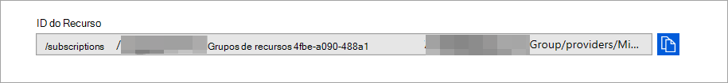

# <a name="configure-microsoft-365-defender-to-stream-advanced-hunting-events-to-your-azure-event-hubs"></a>Configurar Microsoft 365 Defender para transmitir eventos de Busca Avançada para seus Hubs de Eventos do Azure

[!INCLUDE [Microsoft 365 Defender rebranding](../../includes/microsoft-defender.md)]


**Aplica-se a:**
- [Microsoft 365 Defender](https://go.microsoft.com/fwlink/?linkid=2118804)


## <a name="before-you-begin"></a>Antes de começar:

1. Crie um [hub de eventos](/azure/event-hubs/) em seu locatário.

2. Faça logoff no locatário do [Azure,](https://ms.portal.azure.com/)acesse Assinaturas > Sua assinatura > Provedores de Recursos **> Registrar no Microsoft.Insights**.

3. Crie um Namespace do Hub de Eventos, vá para **Hubs** de Eventos > Adicionar e selecione a camada de preços, as unidades de transferência e a Inflação Automática apropriada para a carga esperada. Para obter mais informações, consulte [Pricing - Event Hubs | Microsoft Azure](https://azure.microsoft.com/en-us/pricing/details/event-hubs/).  

4. Depois que o namespace do hub de eventos for criado, você precisará adicionar a Entidade de Serviço de Registro de Aplicativo como Leitor, Receptor de Dados de Hubs de Eventos do Azure e o usuário que fará logon no Microsoft 365 Defender como Colaborador (isso também pode ser feito no nível de Grupo de Recursos ou Assinatura). Vá para Namespace de hubs de eventos > Controle de acesso **(IAM)** > Adicionar e verificar em **Atribuir funções**.

## <a name="enable-raw-data-streaming"></a>Habilitar o streaming de dados brutos:

1. Faça logon no [Microsoft 365 de](https://security.microsoft.com) segurança do Defender como um ***Administrador Global** _ ou _* Administrador _de Segurança_**.

2. Vá para a página [Configurações de exportação de dados.](https://security.microsoft.com/settings/mtp_settings/raw_data_export)

3. Clique em **Adicionar**.

4. Escolha um nome para suas novas configurações.

5. Escolha Encaminhar eventos para hubs de eventos **do Azure.**

6. Você pode selecionar se deseja exportar os dados do evento para um único hub de eventos ou exportar cada tabela de eventos para um hub diferente no namespace do hub de eventos. 

7. Para exportar os dados de evento para um único hub de eventos, insira o nome do Hub de **Eventos** e sua ID de recurso **do Hub de Eventos.**

   Para obter sua ID de recurso de **Hubs** de Eventos, vá para sua página namespace hubs de eventos do Azure na guia Propriedades do [Azure](https://ms.portal.azure.com/)> copiar o texto em  >   **ID** de Recurso :

   

8. Escolha os eventos que deseja transmitir e clique em **Salvar**.

## <a name="the-schema-of-the-events-in-azure-event-hubs"></a>O esquema dos eventos nos Hubs de Eventos do Azure:

```
{
    "records": [
                    {
                        "time": "<The time Microsoft 365 Defender received the event>"
                        "tenantId": "<The Id of the tenant that the event belongs to>"
                        "category": "<The Advanced Hunting table name with 'AdvancedHunting-' prefix>"
                        "properties": { <Microsoft 365 Defender Advanced Hunting event as Json> }
                    }
                    ...
                ]
}
```

- Cada mensagem do hub de eventos nos Hubs de Eventos do Azure contém uma lista de registros.

- Cada registro contém o nome do evento Microsoft 365, a hora em que o Defender recebeu o evento, o locatário que ele pertence (você só receberá eventos do seu locatário) e o evento no formato JSON em uma propriedade chamada "**properties**".

- Para obter mais informações sobre o esquema de eventos Microsoft 365 Defender, consulte [Advanced Hunting overview](../defender/advanced-hunting-overview.md).

- Em Busca Avançada, a tabela **DeviceInfo** tem uma coluna chamada **MachineGroup** que contém o grupo do dispositivo. Aqui todos os eventos também serão decorados com esta coluna. 

9. Para exportar cada tabela de eventos para um hub de eventos diferente, basta deixar o nome do **hub** de eventos vazio e Microsoft 365 Defender fará o restante.


## <a name="data-types-mapping"></a>Mapeamento de tipos de dados:

Para obter os tipos de dados para propriedades de evento, faça o seguinte:

1. Entre no centro [Microsoft 365 segurança e](https://security.microsoft.com) vá para a página De Busca [Avançada.](https://security.microsoft.com/hunting-package)

2. Execute a seguinte consulta para obter o mapeamento de tipos de dados para cada evento:
 
   ```
   {EventType}
   | getschema
   | project ColumnName, ColumnType 
   ```

- Veja um exemplo para o evento Informações do Dispositivo: 

  

## <a name="related-topics"></a>Tópicos relacionados
- [Visão geral da Busca Avançada](../defender/advanced-hunting-overview.md)
- [Microsoft 365 Defender streaming API](raw-data-export.md)
- [Transmitir Microsoft 365 eventos do Defender para sua conta de armazenamento do Azure](raw-data-export-storage.md)
- [Documentação dos Hubs de Eventos do Azure](/azure/event-hubs/)
- [Solucionar problemas de conectividade - Hubs de Eventos do Azure](/azure/event-hubs/troubleshooting-guide)
