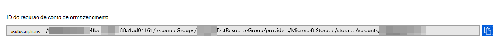
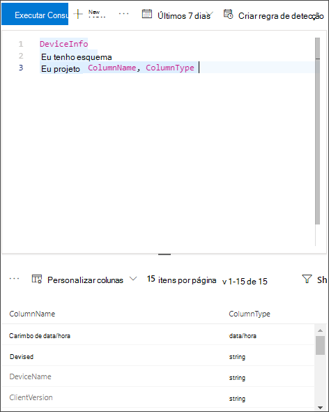

# <a name="configure--microsoft-365-defender-to-stream-advanced-hunting-events-to-your-storage-account"></a><span data-ttu-id="9d69d-104">Configure Microsoft 365 Defender para transmitir eventos de Busca Avançada para sua Armazenamento de usuário</span><span class="sxs-lookup"><span data-stu-id="9d69d-104">Configure  Microsoft 365 Defender to stream Advanced Hunting events to your Storage account</span></span>

[!INCLUDE [Microsoft 365 Defender rebranding](../../includes/microsoft-defender.md)]


<span data-ttu-id="9d69d-105">**Aplica-se a:**</span><span class="sxs-lookup"><span data-stu-id="9d69d-105">**Applies to:**</span></span>
- [<span data-ttu-id="9d69d-106">Microsoft 365 Defender</span><span class="sxs-lookup"><span data-stu-id="9d69d-106">Microsoft 365 Defender</span></span>](https://go.microsoft.com/fwlink/?linkid=2118804)


## <a name="before-you-begin"></a><span data-ttu-id="9d69d-107">Antes de começar:</span><span class="sxs-lookup"><span data-stu-id="9d69d-107">Before you begin:</span></span>

1. <span data-ttu-id="9d69d-108">Crie uma [Armazenamento em](/azure/storage/common/storage-account-overview) seu locatário.</span><span class="sxs-lookup"><span data-stu-id="9d69d-108">Create a [Storage account](/azure/storage/common/storage-account-overview) in your tenant.</span></span>

2. <span data-ttu-id="9d69d-109">Faça logoff no locatário do [Azure,](https://ms.portal.azure.com/)acesse Assinaturas > Sua assinatura > Provedores de Recursos **> Registrar no Microsoft.Insights**.</span><span class="sxs-lookup"><span data-stu-id="9d69d-109">Log in to your [Azure tenant](https://ms.portal.azure.com/), go to **Subscriptions > Your subscription > Resource Providers > Register to Microsoft.Insights**.</span></span>

## <a name="enable-raw-data-streaming"></a><span data-ttu-id="9d69d-110">Habilitar o streaming de dados brutos:</span><span class="sxs-lookup"><span data-stu-id="9d69d-110">Enable raw data streaming:</span></span>

1. <span data-ttu-id="9d69d-111">Faça logon [no Microsoft 365 de](https://security.microsoft.com) segurança do Defender como um \* Administrador **Global** _ ou _\* Administrador _de Segurança_\*\*.</span><span class="sxs-lookup"><span data-stu-id="9d69d-111">Log in to [Microsoft 365 Defender security center](https://security.microsoft.com) as a ***Global Administrator** _ or _*_Security Administrator_\*\*.</span></span>

2. <span data-ttu-id="9d69d-112">Vá para [a página Configurações de exportação de dados](https://security.microsoft.com/settings/mtp_settings/raw_data_export) Central de Segurança do Microsoft Defender.</span><span class="sxs-lookup"><span data-stu-id="9d69d-112">Go to [Data export settings page](https://security.microsoft.com/settings/mtp_settings/raw_data_export) in Microsoft Defender Security Center.</span></span>

3. <span data-ttu-id="9d69d-113">Clique em **Adicionar configurações de exportação de dados.**</span><span class="sxs-lookup"><span data-stu-id="9d69d-113">Click on **Add data export settings**.</span></span>

4. <span data-ttu-id="9d69d-114">Escolha um nome para suas novas configurações.</span><span class="sxs-lookup"><span data-stu-id="9d69d-114">Choose a name for your new settings.</span></span>

5. <span data-ttu-id="9d69d-115">Escolha **Encaminhar eventos para o Azure Armazenamento**.</span><span class="sxs-lookup"><span data-stu-id="9d69d-115">Choose **Forward events to Azure Storage**.</span></span>

6. <span data-ttu-id="9d69d-116">Digite sua **Armazenamento ID do Recurso da Conta.**</span><span class="sxs-lookup"><span data-stu-id="9d69d-116">Type your **Storage Account Resource ID**.</span></span> <span data-ttu-id="9d69d-117">Para obter Armazenamento **ID** do Recurso de Conta, vá até Armazenamento página da sua conta do [Azure na](https://ms.portal.azure.com/) guia propriedades do portal do Azure > > copie o texto em Armazenamento **ID** do Recurso de Conta :</span><span class="sxs-lookup"><span data-stu-id="9d69d-117">In order to get your **Storage Account Resource ID**, go to your Storage account page on [Azure portal](https://ms.portal.azure.com/) > properties tab > copy the text under **Storage Account Resource ID**:</span></span>

   

7. <span data-ttu-id="9d69d-119">Escolha os eventos que deseja transmitir e clique em **Salvar**.</span><span class="sxs-lookup"><span data-stu-id="9d69d-119">Choose the events you want to stream and click **Save**.</span></span>

## <a name="the-schema-of-the-events-in-the-storage-account"></a><span data-ttu-id="9d69d-120">O esquema dos eventos na conta Armazenamento:</span><span class="sxs-lookup"><span data-stu-id="9d69d-120">The schema of the events in the Storage account:</span></span>

- <span data-ttu-id="9d69d-121">Um contêiner blob será criado para cada tipo de evento:</span><span class="sxs-lookup"><span data-stu-id="9d69d-121">A blob container will be created for each event type:</span></span> 

  

- <span data-ttu-id="9d69d-123">O esquema de cada linha em um blob é o seguinte JSON:</span><span class="sxs-lookup"><span data-stu-id="9d69d-123">The schema of each row in a blob is the following JSON:</span></span> 

  ```
  {
          "time": "<The time Microsoft 365 Defender received the event>"
          "tenantId": "<Your tenant ID>"
          "category": "<The Advanced Hunting table name with 'AdvancedHunting-' prefix>"
          "properties": { <Microsoft 365 Defender Advanced Hunting event as Json> }
  }               
  ```

- <span data-ttu-id="9d69d-124">Cada blob contém várias linhas.</span><span class="sxs-lookup"><span data-stu-id="9d69d-124">Each blob contains multiple rows.</span></span>

- <span data-ttu-id="9d69d-125">Cada linha contém o nome do evento, a hora em que o Defender for Endpoint recebeu o evento, o locatário que ele pertence (você só receberá eventos do seu locatário) e o evento no formato JSON em uma propriedade chamada "properties".</span><span class="sxs-lookup"><span data-stu-id="9d69d-125">Each row contains the event name, the time Defender for Endpoint received the event, the tenant it belongs (you will only get events from your tenant), and the event in JSON format in a property called "properties".</span></span>

- <span data-ttu-id="9d69d-126">Para obter mais informações sobre o esquema de eventos Microsoft 365 Defender, consulte [Advanced Hunting overview](../defender/advanced-hunting-overview.md).</span><span class="sxs-lookup"><span data-stu-id="9d69d-126">For more information about the schema of Microsoft 365 Defender events, see [Advanced Hunting overview](../defender/advanced-hunting-overview.md).</span></span>


## <a name="data-types-mapping"></a><span data-ttu-id="9d69d-127">Mapeamento de tipos de dados:</span><span class="sxs-lookup"><span data-stu-id="9d69d-127">Data types mapping:</span></span>

<span data-ttu-id="9d69d-128">Para obter os tipos de dados para nossas propriedades de eventos, faça o seguinte:</span><span class="sxs-lookup"><span data-stu-id="9d69d-128">In order to get the data types for our events properties do the following:</span></span>

1. <span data-ttu-id="9d69d-129">Entre no centro [Microsoft 365 segurança e](https://security.microsoft.com) vá para a página De Busca [Avançada.](https://security.microsoft.com/hunting-package)</span><span class="sxs-lookup"><span data-stu-id="9d69d-129">Log in to [Microsoft 365 security center](https://security.microsoft.com) and go to [Advanced Hunting page](https://security.microsoft.com/hunting-package).</span></span>

2. <span data-ttu-id="9d69d-130">Execute a seguinte consulta para obter o mapeamento de tipos de dados para cada evento:</span><span class="sxs-lookup"><span data-stu-id="9d69d-130">Run the following query to get the data types mapping for each event:</span></span> 

   ```
   {EventType}
   | getschema
   | project ColumnName, ColumnType 
   ```

- <span data-ttu-id="9d69d-131">Veja um exemplo para o evento Informações do Dispositivo:</span><span class="sxs-lookup"><span data-stu-id="9d69d-131">Here is an example for Device Info event:</span></span> 

  

## <a name="related-topics"></a><span data-ttu-id="9d69d-133">Tópicos relacionados</span><span class="sxs-lookup"><span data-stu-id="9d69d-133">Related topics</span></span>
- [<span data-ttu-id="9d69d-134">Visão geral da Busca Avançada</span><span class="sxs-lookup"><span data-stu-id="9d69d-134">Overview of Advanced Hunting</span></span>](../defender/advanced-hunting-overview.md)
- [<span data-ttu-id="9d69d-135">Microsoft 365 Defender Streaming API</span><span class="sxs-lookup"><span data-stu-id="9d69d-135">Microsoft 365 Defender Streaming API</span></span>](raw-data-export.md)
- [<span data-ttu-id="9d69d-136">Transmitir Microsoft 365 eventos do Defender para sua conta de armazenamento do Azure</span><span class="sxs-lookup"><span data-stu-id="9d69d-136">Stream Microsoft 365 Defender events to your Azure storage account</span></span>](raw-data-export-storage.md)
- [<span data-ttu-id="9d69d-137">Documentação Armazenamento conta do Azure</span><span class="sxs-lookup"><span data-stu-id="9d69d-137">Azure Storage Account documentation</span></span>](/azure/storage/common/storage-account-overview)
