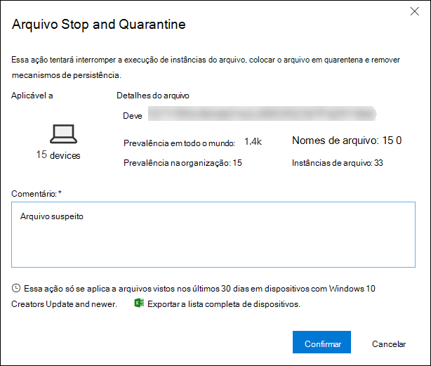
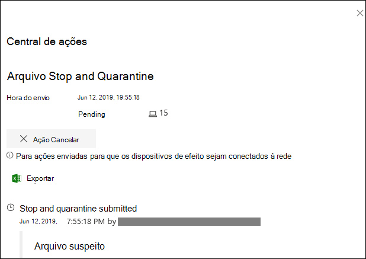
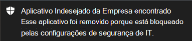
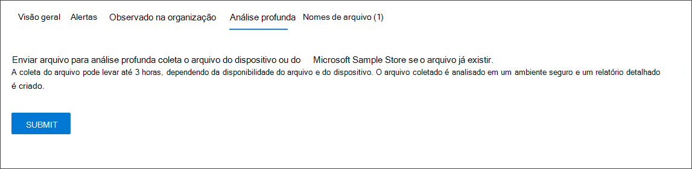
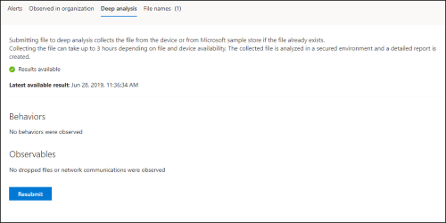

# <a name="take-response-actions-on-a-file"></a><span data-ttu-id="4b0cf-104">Executar ações de resposta em um arquivo</span><span class="sxs-lookup"><span data-stu-id="4b0cf-104">Take response actions on a file</span></span>

[!INCLUDE [Microsoft 365 Defender rebranding](../../includes/microsoft-defender.md)]


<span data-ttu-id="4b0cf-105">**Aplica-se a:**</span><span class="sxs-lookup"><span data-stu-id="4b0cf-105">**Applies to:**</span></span>
- [<span data-ttu-id="4b0cf-106">Microsoft Defender para Ponto de Extremidade</span><span class="sxs-lookup"><span data-stu-id="4b0cf-106">Microsoft Defender for Endpoint</span></span>](https://go.microsoft.com/fwlink/?linkid=2154037)

[!include[Prerelease information](../../includes/prerelease.md)]

> <span data-ttu-id="4b0cf-107">Deseja experimentar o Defender para Ponto de Extremidade?</span><span class="sxs-lookup"><span data-stu-id="4b0cf-107">Want to experience Defender for Endpoint?</span></span> [<span data-ttu-id="4b0cf-108">Inscreva-se para uma avaliação gratuita.</span><span class="sxs-lookup"><span data-stu-id="4b0cf-108">Sign up for a free trial.</span></span>](https://www.microsoft.com/microsoft-365/windows/microsoft-defender-atp?ocid=docs-wdatp-responddile-abovefoldlink)

<span data-ttu-id="4b0cf-109">Responda rapidamente a ataques detectados interrompendo e quarantindo arquivos ou bloqueando um arquivo.</span><span class="sxs-lookup"><span data-stu-id="4b0cf-109">Quickly respond to detected attacks by stopping and quarantining files or blocking a file.</span></span> <span data-ttu-id="4b0cf-110">Depois de tomar medidas em arquivos, você pode verificar os detalhes da atividade na Central de Ações.</span><span class="sxs-lookup"><span data-stu-id="4b0cf-110">After taking action on files, you can check on activity details in the Action center.</span></span>

<span data-ttu-id="4b0cf-111">As ações de resposta estão disponíveis na página de perfil detalhada de um arquivo.</span><span class="sxs-lookup"><span data-stu-id="4b0cf-111">Response actions are available on a file's detailed profile page.</span></span> <span data-ttu-id="4b0cf-112">Uma vez nesta página, você pode alternar entre os layouts de página novo e **antigo,** alternando a nova página Arquivo .</span><span class="sxs-lookup"><span data-stu-id="4b0cf-112">Once on this page, you can switch between the new and old page layouts by toggling **new File page**.</span></span> <span data-ttu-id="4b0cf-113">O restante deste artigo descreve o layout da página mais recente.</span><span class="sxs-lookup"><span data-stu-id="4b0cf-113">The rest of this article describes the newer page layout.</span></span>

<span data-ttu-id="4b0cf-114">As ações de resposta são executados ao longo da parte superior da página de arquivo e incluem:</span><span class="sxs-lookup"><span data-stu-id="4b0cf-114">Response actions run along the top of the file page, and include:</span></span>

- <span data-ttu-id="4b0cf-115">Arquivo Stop and Quarantine</span><span class="sxs-lookup"><span data-stu-id="4b0cf-115">Stop and Quarantine File</span></span>
- <span data-ttu-id="4b0cf-116">Adicionar Indicador</span><span class="sxs-lookup"><span data-stu-id="4b0cf-116">Add Indicator</span></span>
- <span data-ttu-id="4b0cf-117">Baixar o arquivo</span><span class="sxs-lookup"><span data-stu-id="4b0cf-117">Download file</span></span>
- <span data-ttu-id="4b0cf-118">Consultar um especialista em ameaças</span><span class="sxs-lookup"><span data-stu-id="4b0cf-118">Consult a threat expert</span></span>
- <span data-ttu-id="4b0cf-119">Central de ações</span><span class="sxs-lookup"><span data-stu-id="4b0cf-119">Action center</span></span>

<span data-ttu-id="4b0cf-120">Você também pode enviar arquivos para análise profunda, para executar o arquivo em uma área de segurança na nuvem.</span><span class="sxs-lookup"><span data-stu-id="4b0cf-120">You can also submit files for deep analysis, to run the file in a secure cloud sandbox.</span></span> <span data-ttu-id="4b0cf-121">Quando a análise for concluída, você obterá um relatório detalhado que fornece informações sobre o comportamento do arquivo.</span><span class="sxs-lookup"><span data-stu-id="4b0cf-121">When the analysis is complete, you'll get a detailed report that provides information about the behavior of the file.</span></span> <span data-ttu-id="4b0cf-122">Você pode enviar arquivos para análise profunda e ler relatórios passados selecionando a **guia Análise** Profunda. Ele está localizado abaixo dos cartões de informações de arquivo.</span><span class="sxs-lookup"><span data-stu-id="4b0cf-122">You can submit files for deep analysis and read past reports by selecting the **Deep analysis** tab. It's located below the file information cards.</span></span>

<span data-ttu-id="4b0cf-123">Algumas ações exigem certas permissões.</span><span class="sxs-lookup"><span data-stu-id="4b0cf-123">Some actions require certain permissions.</span></span> <span data-ttu-id="4b0cf-124">A tabela a seguir descreve qual ação determinadas permissões podem executar em arquivos executáveis portáteis (PE) e não PE:</span><span class="sxs-lookup"><span data-stu-id="4b0cf-124">The following table describes what action certain permissions can take on portable executable (PE) and non-PE files:</span></span>

| <span data-ttu-id="4b0cf-125">Permissão</span><span class="sxs-lookup"><span data-stu-id="4b0cf-125">Permission</span></span>             | <span data-ttu-id="4b0cf-126">Arquivos PE</span><span class="sxs-lookup"><span data-stu-id="4b0cf-126">PE files</span></span> | <span data-ttu-id="4b0cf-127">Arquivos não PE</span><span class="sxs-lookup"><span data-stu-id="4b0cf-127">Non-PE files</span></span> |
| :--------------------- | :------: | :----------: |
| <span data-ttu-id="4b0cf-128">Exibir dados</span><span class="sxs-lookup"><span data-stu-id="4b0cf-128">View data</span></span>              |     <span data-ttu-id="4b0cf-129">X</span><span class="sxs-lookup"><span data-stu-id="4b0cf-129">X</span></span>    |       <span data-ttu-id="4b0cf-130">X</span><span class="sxs-lookup"><span data-stu-id="4b0cf-130">X</span></span>      |
| <span data-ttu-id="4b0cf-131">Investigação de alertas</span><span class="sxs-lookup"><span data-stu-id="4b0cf-131">Alerts investigation</span></span>   | <span data-ttu-id="4b0cf-132">&#x2611;</span><span class="sxs-lookup"><span data-stu-id="4b0cf-132">&#x2611;</span></span> |       <span data-ttu-id="4b0cf-133">X</span><span class="sxs-lookup"><span data-stu-id="4b0cf-133">X</span></span>      |
| <span data-ttu-id="4b0cf-134">Base de resposta ao vivo</span><span class="sxs-lookup"><span data-stu-id="4b0cf-134">Live response basic</span></span>    |     <span data-ttu-id="4b0cf-135">X</span><span class="sxs-lookup"><span data-stu-id="4b0cf-135">X</span></span>    |       <span data-ttu-id="4b0cf-136">X</span><span class="sxs-lookup"><span data-stu-id="4b0cf-136">X</span></span>      |
| <span data-ttu-id="4b0cf-137">Resposta ao vivo avançada</span><span class="sxs-lookup"><span data-stu-id="4b0cf-137">Live response advanced</span></span> | <span data-ttu-id="4b0cf-138">&#x2611;</span><span class="sxs-lookup"><span data-stu-id="4b0cf-138">&#x2611;</span></span> |   <span data-ttu-id="4b0cf-139">&#x2611;</span><span class="sxs-lookup"><span data-stu-id="4b0cf-139">&#x2611;</span></span>   |

<span data-ttu-id="4b0cf-140">Para obter mais informações sobre funções, consulte [Create and manage roles for role-based access control](user-roles.md).</span><span class="sxs-lookup"><span data-stu-id="4b0cf-140">For more information on roles, see [Create and manage roles for role-based access control](user-roles.md).</span></span>

## <a name="stop-and-quarantine-files-in-your-network"></a><span data-ttu-id="4b0cf-141">Parar arquivos e colocá-los em quarentena na sua rede</span><span class="sxs-lookup"><span data-stu-id="4b0cf-141">Stop and quarantine files in your network</span></span>

<span data-ttu-id="4b0cf-142">Você pode conter um ataque em sua organização interrompendo o processo mal-intencionado e colocando em quarentena o arquivo onde ele foi observado.</span><span class="sxs-lookup"><span data-stu-id="4b0cf-142">You can contain an attack in your organization by stopping the malicious process and quarantining the file where it was observed.</span></span>

> [!IMPORTANT]
> <span data-ttu-id="4b0cf-143">Você só poderá fazer essa ação se:</span><span class="sxs-lookup"><span data-stu-id="4b0cf-143">You can only take this action if:</span></span>
>
> - <span data-ttu-id="4b0cf-144">O dispositivo em que você está executando a ação está executando Windows 10 versão 1703 ou posterior</span><span class="sxs-lookup"><span data-stu-id="4b0cf-144">The device you're taking the action on is running Windows 10, version 1703 or later</span></span>
> - <span data-ttu-id="4b0cf-145">O arquivo não pertence a editores confiáveis de terceiros ou não é assinado pela Microsoft</span><span class="sxs-lookup"><span data-stu-id="4b0cf-145">The file does not belong to trusted third-party publishers or is not signed by Microsoft</span></span>
> - <span data-ttu-id="4b0cf-146">Microsoft Defender Antivírus deve pelo menos estar em execução no modo Passivo.</span><span class="sxs-lookup"><span data-stu-id="4b0cf-146">Microsoft Defender Antivirus must at least be running on Passive mode.</span></span> <span data-ttu-id="4b0cf-147">Para obter mais informações, [consulte Microsoft Defender Antivírus compatibilidade](/windows/security/threat-protection/microsoft-defender-antivirus/microsoft-defender-antivirus-compatibility).</span><span class="sxs-lookup"><span data-stu-id="4b0cf-147">For more information, see [Microsoft Defender Antivirus compatibility](/windows/security/threat-protection/microsoft-defender-antivirus/microsoft-defender-antivirus-compatibility).</span></span>

<span data-ttu-id="4b0cf-148">A **ação Stop and Quarantine File** inclui interromper a execução de processos, colocar em quarentena os arquivos e excluir dados persistentes, como chaves do Registro.</span><span class="sxs-lookup"><span data-stu-id="4b0cf-148">The **Stop and Quarantine File** action includes stopping running processes, quarantining the files, and deleting persistent data such as registry keys.</span></span>

<span data-ttu-id="4b0cf-149">Essa ação entra em vigor em dispositivos com Windows 10, versão 1703 ou posterior, onde o arquivo foi observado nos últimos 30 dias.</span><span class="sxs-lookup"><span data-stu-id="4b0cf-149">This action takes effect on devices with Windows 10, version 1703 or later, where the file was observed in the last 30 days.</span></span>

> [!NOTE]
> <span data-ttu-id="4b0cf-150">Você poderá restaurar o arquivo da quarentena a qualquer momento.</span><span class="sxs-lookup"><span data-stu-id="4b0cf-150">You’ll be able to restore the file from quarantine at any time.</span></span>

### <a name="stop-and-quarantine-files"></a><span data-ttu-id="4b0cf-151">Arquivos de parada e quarentena</span><span class="sxs-lookup"><span data-stu-id="4b0cf-151">Stop and quarantine files</span></span>

1. <span data-ttu-id="4b0cf-152">Selecione o arquivo que você deseja parar e colocar em quarentena.</span><span class="sxs-lookup"><span data-stu-id="4b0cf-152">Select the file you want to stop and quarantine.</span></span> <span data-ttu-id="4b0cf-153">Você pode selecionar um arquivo de qualquer uma das seguintes exibições ou usar a caixa Pesquisar:</span><span class="sxs-lookup"><span data-stu-id="4b0cf-153">You can select a file from any of the following views or use the Search box:</span></span>

   - <span data-ttu-id="4b0cf-154">**Alertas** - clique nos links correspondentes da Descrição ou Detalhes na linha do tempo do Artigo de Alerta</span><span class="sxs-lookup"><span data-stu-id="4b0cf-154">**Alerts** - click the corresponding links from the Description or Details in the Alert Story timeline</span></span>
   - <span data-ttu-id="4b0cf-155">**Caixa de** pesquisa - selecione **Arquivo** no menu suspenso e insira o nome do arquivo</span><span class="sxs-lookup"><span data-stu-id="4b0cf-155">**Search box** - select **File** from the drop–down menu and enter the file name</span></span>

   > [!NOTE]
   > <span data-ttu-id="4b0cf-156">A ação de arquivo de parada e quarentena está limitada a um máximo de 1000 dispositivos.</span><span class="sxs-lookup"><span data-stu-id="4b0cf-156">The stop and quarantine file action is limited to a maximum of 1000 devices.</span></span> <span data-ttu-id="4b0cf-157">Para parar um arquivo em um número maior de dispositivos, consulte [Adicionar indicador para bloquear ou permitir arquivo](#add-indicator-to-block-or-allow-a-file).</span><span class="sxs-lookup"><span data-stu-id="4b0cf-157">To stop a file on a larger number of devices, see [Add indicator to block or allow file](#add-indicator-to-block-or-allow-a-file).</span></span>

2. <span data-ttu-id="4b0cf-158">Vá para a barra superior e selecione **Parar e Quarentena Arquivo**.</span><span class="sxs-lookup"><span data-stu-id="4b0cf-158">Go to the top bar and select **Stop and Quarantine File**.</span></span>

   

3. <span data-ttu-id="4b0cf-160">Especifique um motivo e selecione **Confirmar**.</span><span class="sxs-lookup"><span data-stu-id="4b0cf-160">Specify a reason, then select **Confirm**.</span></span>

   

   <span data-ttu-id="4b0cf-162">O Centro de Ações mostra as informações de envio:</span><span class="sxs-lookup"><span data-stu-id="4b0cf-162">The Action center shows the submission information:</span></span>
   
   

   - <span data-ttu-id="4b0cf-164">**Hora do envio** - Mostra quando a ação foi enviada.</span><span class="sxs-lookup"><span data-stu-id="4b0cf-164">**Submission time** - Shows when the action was submitted.</span></span>
   - <span data-ttu-id="4b0cf-165">**Sucesso** - Mostra o número de dispositivos em que o arquivo foi interrompido e colocado em quarentena.</span><span class="sxs-lookup"><span data-stu-id="4b0cf-165">**Success** - Shows the number of devices where the file has been stopped and quarantined.</span></span>
   - <span data-ttu-id="4b0cf-166">**Falha** - Mostra o número de dispositivos em que a ação falhou e detalhes sobre a falha.</span><span class="sxs-lookup"><span data-stu-id="4b0cf-166">**Failed** - Shows the number of devices where the action failed and details about the failure.</span></span>
   - <span data-ttu-id="4b0cf-167">**Pendente** - Mostra o número de dispositivos de onde o arquivo ainda deve ser interrompido e colocado em quarentena.</span><span class="sxs-lookup"><span data-stu-id="4b0cf-167">**Pending** - Shows the number of devices where the file is yet to be stopped and quarantined from.</span></span> <span data-ttu-id="4b0cf-168">Isso pode levar tempo para casos em que o dispositivo está offline ou não está conectado à rede.</span><span class="sxs-lookup"><span data-stu-id="4b0cf-168">This can take time for cases when the device is offline or not connected to the network.</span></span>

4. <span data-ttu-id="4b0cf-169">Selecione qualquer um dos indicadores de status para exibir mais informações sobre a ação.</span><span class="sxs-lookup"><span data-stu-id="4b0cf-169">Select any of the status indicators to view more information about the action.</span></span> <span data-ttu-id="4b0cf-170">Por exemplo, selecione **Falha** ao ver onde a ação falhou.</span><span class="sxs-lookup"><span data-stu-id="4b0cf-170">For example, select **Failed** to see where the action failed.</span></span>

<span data-ttu-id="4b0cf-171">**Notificação no usuário do dispositivo**:</span><span class="sxs-lookup"><span data-stu-id="4b0cf-171">**Notification on device user**:</span></span></br>
<span data-ttu-id="4b0cf-172">Quando o arquivo está sendo removido de um dispositivo, a seguinte notificação é mostrada:</span><span class="sxs-lookup"><span data-stu-id="4b0cf-172">When the file is being removed from a device, the following notification is shown:</span></span>



<span data-ttu-id="4b0cf-174">Na linha do tempo do dispositivo, um novo evento é adicionado para cada dispositivo onde um arquivo foi interrompido e colocado em quarentena.</span><span class="sxs-lookup"><span data-stu-id="4b0cf-174">In the device timeline, a new event is added for each device where a file was stopped and quarantined.</span></span>

<span data-ttu-id="4b0cf-175">Um aviso é mostrado antes da ação ser implementada para arquivos amplamente usados em toda uma organização.</span><span class="sxs-lookup"><span data-stu-id="4b0cf-175">A warning is shown before the action is implemented for files widely used throughout an organization.</span></span> <span data-ttu-id="4b0cf-176">É para validar se a operação se destina.</span><span class="sxs-lookup"><span data-stu-id="4b0cf-176">It's to validate that the operation is intended.</span></span>

## <a name="restore-file-from-quarantine"></a><span data-ttu-id="4b0cf-177">Restaurar arquivo da quarentena</span><span class="sxs-lookup"><span data-stu-id="4b0cf-177">Restore file from quarantine</span></span>

<span data-ttu-id="4b0cf-178">Você pode reverter e remover um arquivo da quarentena se tiver determinado que ele está limpo após uma investigação.</span><span class="sxs-lookup"><span data-stu-id="4b0cf-178">You can roll back and remove a file from quarantine if you’ve determined that it’s clean after an investigation.</span></span> <span data-ttu-id="4b0cf-179">Execute o seguinte comando em cada dispositivo em que o arquivo foi colocado em quarentena.</span><span class="sxs-lookup"><span data-stu-id="4b0cf-179">Run the following command on each device where the file was quarantined.</span></span>

1. <span data-ttu-id="4b0cf-180">Abra um prompt de linha de comando elevada no dispositivo:</span><span class="sxs-lookup"><span data-stu-id="4b0cf-180">Open an elevated command–line prompt on the device:</span></span>

   1. <span data-ttu-id="4b0cf-181">Vá para **Iniciar** e digite _cmd_.</span><span class="sxs-lookup"><span data-stu-id="4b0cf-181">Go to **Start** and type _cmd_.</span></span>

   1. <span data-ttu-id="4b0cf-182">Clique com o botão **direito do mouse no prompt de comando** e selecione Executar como **administrador**.</span><span class="sxs-lookup"><span data-stu-id="4b0cf-182">Right–click **Command prompt** and select **Run as administrator**.</span></span>

2. <span data-ttu-id="4b0cf-183">Insira o seguinte comando e pressione **Enter**:</span><span class="sxs-lookup"><span data-stu-id="4b0cf-183">Enter the following command, and press **Enter**:</span></span>

   ```console
   “%ProgramFiles%\Windows Defender\MpCmdRun.exe” –Restore –Name EUS:Win32/CustomEnterpriseBlock –All
   ```

   > [!NOTE]
   > <span data-ttu-id="4b0cf-184">Em alguns cenários, **o ThreatName** pode aparecer como: EUS:Win32/CustomEnterpriseBlock!cl.</span><span class="sxs-lookup"><span data-stu-id="4b0cf-184">In some scenarios, the **ThreatName** may appear as: EUS:Win32/CustomEnterpriseBlock!cl.</span></span>
   >
   > <span data-ttu-id="4b0cf-185">O Defender for Endpoint restaurará todos os arquivos bloqueados personalizados que foram colocados em quarentena neste dispositivo nos últimos 30 dias.</span><span class="sxs-lookup"><span data-stu-id="4b0cf-185">Defender for Endpoint will restore all custom blocked files that were quarantined on this device in the last 30 days.</span></span>

> [!IMPORTANT]
> <span data-ttu-id="4b0cf-186">Um arquivo que foi colocado em quarentena como uma possível ameaça de rede pode não ser recuperável.</span><span class="sxs-lookup"><span data-stu-id="4b0cf-186">A file that was quarantined as a potential network threat might not be recoverable.</span></span> <span data-ttu-id="4b0cf-187">Se um usuário tentar restaurar o arquivo após a quarentena, esse arquivo pode não estar acessível.</span><span class="sxs-lookup"><span data-stu-id="4b0cf-187">If a user attempts to restore the file after quarantine, that file might not be accessible.</span></span> <span data-ttu-id="4b0cf-188">Isso pode ser devido ao sistema não ter mais credenciais de rede para acessar o arquivo.</span><span class="sxs-lookup"><span data-stu-id="4b0cf-188">This can be due to the system no longer having network credentials to access the file.</span></span> <span data-ttu-id="4b0cf-189">Normalmente, isso é resultado de um logoff temporário em um sistema ou pasta compartilhada e os tokens de acesso expiraram.</span><span class="sxs-lookup"><span data-stu-id="4b0cf-189">Typically, this is a result of a temporary log on to a system or shared folder and the access tokens expired.</span></span>

## <a name="download-or-collect-file"></a><span data-ttu-id="4b0cf-190">Baixar ou coletar arquivo</span><span class="sxs-lookup"><span data-stu-id="4b0cf-190">Download or collect file</span></span>

<span data-ttu-id="4b0cf-191">Selecionar **Baixar arquivo** das ações de resposta permite baixar um arquivo local protegido por senha .zip que contém seu arquivo.</span><span class="sxs-lookup"><span data-stu-id="4b0cf-191">Selecting **Download file** from the response actions allows you to download a local, password-protected .zip archive containing your file.</span></span> <span data-ttu-id="4b0cf-192">Um flyout aparecerá onde você pode gravar um motivo para baixar o arquivo e definir uma senha.</span><span class="sxs-lookup"><span data-stu-id="4b0cf-192">A flyout will appear where you can record a reason for downloading the file, and set a password.</span></span>

<span data-ttu-id="4b0cf-193">Por padrão, você não poderá baixar arquivos que estão em quarentena.</span><span class="sxs-lookup"><span data-stu-id="4b0cf-193">By default, you will not be able to download files that are in quarantine.</span></span>


### <a name="collect-files"></a><span data-ttu-id="4b0cf-195">Coletar arquivos</span><span class="sxs-lookup"><span data-stu-id="4b0cf-195">Collect files</span></span>

<span data-ttu-id="4b0cf-196">Se um arquivo ainda não estiver armazenado pelo Microsoft Defender para Ponto de Extremidade, você não poderá baixá-lo.</span><span class="sxs-lookup"><span data-stu-id="4b0cf-196">If a file is not already stored by Microsoft Defender for Endpoint, you can't download it.</span></span> <span data-ttu-id="4b0cf-197">Em vez disso, você verá um botão **Coletar arquivo** no mesmo local.</span><span class="sxs-lookup"><span data-stu-id="4b0cf-197">Instead, you'll see a **Collect file** button in the same location.</span></span> <span data-ttu-id="4b0cf-198">Se um arquivo não tiver sido visto na organização nos últimos 30 dias, **Coletar arquivo** será desabilitado.</span><span class="sxs-lookup"><span data-stu-id="4b0cf-198">If a file hasn't been seen in the organization in the past 30 days, **Collect file** will be disabled.</span></span>
> [!Important]
> <span data-ttu-id="4b0cf-199">Um arquivo que foi colocado em quarentena como uma possível ameaça de rede pode não ser recuperável.</span><span class="sxs-lookup"><span data-stu-id="4b0cf-199">A file that was quarantined as a potential network threat might not be recoverable.</span></span> <span data-ttu-id="4b0cf-200">Se um usuário tentar restaurar o arquivo após a quarentena, esse arquivo pode não estar acessível.</span><span class="sxs-lookup"><span data-stu-id="4b0cf-200">If a user attempts to restore the file after quarantine, that file might not be accessible.</span></span> <span data-ttu-id="4b0cf-201">Isso pode ser devido ao sistema não ter mais credenciais de rede para acessar o arquivo.</span><span class="sxs-lookup"><span data-stu-id="4b0cf-201">This can be due to the system no longer having network credentials to access the file.</span></span> <span data-ttu-id="4b0cf-202">Normalmente, isso é resultado de um logoff temporário em um sistema ou pasta compartilhada e os tokens de acesso expiraram.</span><span class="sxs-lookup"><span data-stu-id="4b0cf-202">Typically, this is a result of a temporary log on to a system or shared folder and the access tokens expired.</span></span>

## <a name="add-indicator-to-block-or-allow-a-file"></a><span data-ttu-id="4b0cf-203">Adicionar indicador para bloquear ou permitir um arquivo</span><span class="sxs-lookup"><span data-stu-id="4b0cf-203">Add indicator to block or allow a file</span></span>

<span data-ttu-id="4b0cf-204">Impedir a propagação de um ataque em sua organização proibindo arquivos potencialmente mal-intencionados ou malwares suspeitos.</span><span class="sxs-lookup"><span data-stu-id="4b0cf-204">Prevent further propagation of an attack in your organization by banning potentially malicious files or suspected malware.</span></span> <span data-ttu-id="4b0cf-205">Se você conhecer um arquivo executável portátil potencialmente mal-intencionado (PE), poderá bloqueá-lo.</span><span class="sxs-lookup"><span data-stu-id="4b0cf-205">If you know a potentially malicious portable executable (PE) file, you can block it.</span></span> <span data-ttu-id="4b0cf-206">Essa operação impedirá que ela seja lida, escrita ou executada em dispositivos em sua organização.</span><span class="sxs-lookup"><span data-stu-id="4b0cf-206">This operation will prevent it from being read, written, or executed on devices in your organization.</span></span>

> [!IMPORTANT]
>
> - <span data-ttu-id="4b0cf-207">Esse recurso estará disponível se sua organização usar Microsoft Defender Antivírus e a proteção entregue na nuvem estiver habilitada.</span><span class="sxs-lookup"><span data-stu-id="4b0cf-207">This feature is available if your organization uses Microsoft Defender Antivirus and Cloud–delivered protection is enabled.</span></span> <span data-ttu-id="4b0cf-208">Para obter mais informações, consulte [Manage cloud-delivered protection](/windows/security/threat-protection/microsoft-defender-antivirus/deploy-manage-report-microsoft-defender-antivirus).</span><span class="sxs-lookup"><span data-stu-id="4b0cf-208">For more information, see [Manage cloud–delivered protection](/windows/security/threat-protection/microsoft-defender-antivirus/deploy-manage-report-microsoft-defender-antivirus).</span></span>
>
> - <span data-ttu-id="4b0cf-209">A versão do cliente Antimalware deve ser 4.18.1901.x ou posterior.</span><span class="sxs-lookup"><span data-stu-id="4b0cf-209">The Antimalware client version must be 4.18.1901.x or later.</span></span>
> - <span data-ttu-id="4b0cf-210">Esse recurso foi projetado para impedir que o malware suspeito (ou arquivos potencialmente mal-intencionados) seja baixado da Web.</span><span class="sxs-lookup"><span data-stu-id="4b0cf-210">This feature is designed to prevent suspected malware (or potentially malicious files) from being downloaded from the web.</span></span> <span data-ttu-id="4b0cf-211">Atualmente, ele dá suporte a arquivos pe (executáveis portáteis), incluindo _arquivos.exe_ e _.dll_ portáteis.</span><span class="sxs-lookup"><span data-stu-id="4b0cf-211">It currently supports portable executable (PE) files, including _.exe_ and _.dll_ files.</span></span> <span data-ttu-id="4b0cf-212">A cobertura será estendida ao longo do tempo.</span><span class="sxs-lookup"><span data-stu-id="4b0cf-212">The coverage will be extended over time.</span></span>
> - <span data-ttu-id="4b0cf-213">Essa ação de resposta está disponível para dispositivos Windows 10 versão 1703 ou posterior.</span><span class="sxs-lookup"><span data-stu-id="4b0cf-213">This response action is available for devices on Windows 10, version 1703 or later.</span></span>
> - <span data-ttu-id="4b0cf-214">A função permitir ou bloquear não poderá ser feita em arquivos se a classificação do arquivo existir no cache do dispositivo antes da ação permitir ou bloquear.</span><span class="sxs-lookup"><span data-stu-id="4b0cf-214">The allow or block function cannot be done on files if the file's classification exists on the device's cache prior to the allow or block action.</span></span>

> [!NOTE]
> <span data-ttu-id="4b0cf-215">O arquivo PE precisa estar na linha do tempo do dispositivo para que você possa tomar essa ação.</span><span class="sxs-lookup"><span data-stu-id="4b0cf-215">The PE file needs to be in the device timeline for you to be able to take this action.</span></span>
>
> <span data-ttu-id="4b0cf-216">Pode haver alguns minutos de latência entre o momento em que a ação é realizada e o arquivo real que está sendo bloqueado.</span><span class="sxs-lookup"><span data-stu-id="4b0cf-216">There may be a couple of minutes of latency between the time the action is taken and the actual file being blocked.</span></span>

### <a name="enable-the-block-file-feature"></a><span data-ttu-id="4b0cf-217">Habilitar o recurso de arquivo de bloqueio</span><span class="sxs-lookup"><span data-stu-id="4b0cf-217">Enable the block file feature</span></span>

<span data-ttu-id="4b0cf-218">Para começar a bloquear arquivos, primeiro você precisa ativar o [ **recurso Bloquear ou** permitir](advanced-features.md) Configurações.</span><span class="sxs-lookup"><span data-stu-id="4b0cf-218">To start blocking files, you first need to [turn the **Block or allow** feature on](advanced-features.md) in Settings.</span></span>
### <a name="allow-or-block-file"></a><span data-ttu-id="4b0cf-219">Permitir ou bloquear arquivo</span><span class="sxs-lookup"><span data-stu-id="4b0cf-219">Allow or block file</span></span>

<span data-ttu-id="4b0cf-220">Quando você adiciona um hash de indicador para um arquivo, você pode optar por levantar um alerta e bloquear o arquivo sempre que um dispositivo em sua organização tentar execute-o.</span><span class="sxs-lookup"><span data-stu-id="4b0cf-220">When you add an indicator hash for a file, you can choose to raise an alert and block the file whenever a device in your organization attempts to run it.</span></span>

<span data-ttu-id="4b0cf-221">Os arquivos bloqueados automaticamente por um indicador não aparecerão no Centro de Ações do arquivo, mas os alertas ainda estarão visíveis na fila alertas.</span><span class="sxs-lookup"><span data-stu-id="4b0cf-221">Files automatically blocked by an indicator won't show up in the file's Action center, but the alerts will still be visible in the Alerts queue.</span></span>

<span data-ttu-id="4b0cf-222">Consulte [gerenciar indicadores](manage-indicators.md) para obter mais detalhes sobre como bloquear e levantar alertas em arquivos.</span><span class="sxs-lookup"><span data-stu-id="4b0cf-222">See [manage indicators](manage-indicators.md) for more details on blocking and raising alerts on files.</span></span>

<span data-ttu-id="4b0cf-223">Para parar de bloquear um arquivo, remova o indicador.</span><span class="sxs-lookup"><span data-stu-id="4b0cf-223">To stop blocking a file, remove the indicator.</span></span> <span data-ttu-id="4b0cf-224">Você pode fazer isso por meio da ação **Editar Indicador** na página de perfil do arquivo.</span><span class="sxs-lookup"><span data-stu-id="4b0cf-224">You can do so via the **Edit Indicator** action on the file's profile page.</span></span> <span data-ttu-id="4b0cf-225">Essa ação ficará visível na mesma posição que a ação **Adicionar Indicador,** antes de adicionar o indicador.</span><span class="sxs-lookup"><span data-stu-id="4b0cf-225">This action will be visible in the same position as the **Add Indicator** action, before you added the indicator.</span></span>

<span data-ttu-id="4b0cf-226">Você também pode editar indicadores da página **Configurações,** em **Indicadores de**  >  **Regras**.</span><span class="sxs-lookup"><span data-stu-id="4b0cf-226">You can also edit indicators from  the **Settings** page, under **Rules** > **Indicators**.</span></span> <span data-ttu-id="4b0cf-227">Os indicadores são listados nesta área pelo hash do arquivo.</span><span class="sxs-lookup"><span data-stu-id="4b0cf-227">Indicators are listed in this area by their file's hash.</span></span>

## <a name="consult-a-threat-expert"></a><span data-ttu-id="4b0cf-228">Consultar um especialista em ameaças</span><span class="sxs-lookup"><span data-stu-id="4b0cf-228">Consult a threat expert</span></span>

<span data-ttu-id="4b0cf-229">Consulte um especialista em ameaças da Microsoft para obter mais informações sobre um dispositivo potencialmente comprometido ou dispositivos já comprometidos.</span><span class="sxs-lookup"><span data-stu-id="4b0cf-229">Consult a Microsoft threat expert for more insights on a potentially compromised device, or already compromised devices.</span></span> <span data-ttu-id="4b0cf-230">Especialistas em Ameaças da Microsoft estão envolvidos diretamente de dentro do Central de Segurança do Microsoft Defender para resposta o tempo e precisão.</span><span class="sxs-lookup"><span data-stu-id="4b0cf-230">Microsoft Threat Experts are engaged directly from within the Microsoft Defender Security Center for timely and accurate response.</span></span> <span data-ttu-id="4b0cf-231">Os especialistas fornecem informações sobre um dispositivo potencialmente comprometido e ajudam você a entender ameaças complexas e notificações de ataque direcionadas.</span><span class="sxs-lookup"><span data-stu-id="4b0cf-231">Experts provide insights on a potentially compromised device and help you understand complex threats and targeted attack notifications.</span></span> <span data-ttu-id="4b0cf-232">Eles também podem fornecer informações sobre os alertas ou um contexto de inteligência contra ameaças que você vê no painel do portal.</span><span class="sxs-lookup"><span data-stu-id="4b0cf-232">They can also provide information about the alerts or a threat intelligence context that you see on your portal dashboard.</span></span>

<span data-ttu-id="4b0cf-233">Consulte [Consult a Microsoft Threat Expert](/microsoft-365/security/defender-endpoint/configure-microsoft-threat-experts#consult-a-microsoft-threat-expert-about-suspicious-cybersecurity-activities-in-your-organization) para obter detalhes.</span><span class="sxs-lookup"><span data-stu-id="4b0cf-233">See [Consult a Microsoft Threat Expert](/microsoft-365/security/defender-endpoint/configure-microsoft-threat-experts#consult-a-microsoft-threat-expert-about-suspicious-cybersecurity-activities-in-your-organization) for details.</span></span>

## <a name="check-activity-details-in-action-center"></a><span data-ttu-id="4b0cf-234">Verificar detalhes de atividade na Central de ações</span><span class="sxs-lookup"><span data-stu-id="4b0cf-234">Check activity details in Action center</span></span>

<span data-ttu-id="4b0cf-235">A **Central de Ações** fornece informações sobre ações que foram realizadas em um dispositivo ou arquivo.</span><span class="sxs-lookup"><span data-stu-id="4b0cf-235">The **Action center** provides information on actions that were taken on a device or file.</span></span> <span data-ttu-id="4b0cf-236">Você pode exibir os seguintes detalhes:</span><span class="sxs-lookup"><span data-stu-id="4b0cf-236">You can view the following details:</span></span>

- <span data-ttu-id="4b0cf-237">Conjunto de pacotes de investigação</span><span class="sxs-lookup"><span data-stu-id="4b0cf-237">Investigation package collection</span></span>
- <span data-ttu-id="4b0cf-238">Verificação de antivírus</span><span class="sxs-lookup"><span data-stu-id="4b0cf-238">Antivirus scan</span></span>
- <span data-ttu-id="4b0cf-239">Restrição de aplicativo</span><span class="sxs-lookup"><span data-stu-id="4b0cf-239">App restriction</span></span>
- <span data-ttu-id="4b0cf-240">Isolamento de dispositivo</span><span class="sxs-lookup"><span data-stu-id="4b0cf-240">Device isolation</span></span>

<span data-ttu-id="4b0cf-241">Todos os outros detalhes relacionados também são mostrados, como data/hora do envio, envio do usuário e se a ação foi bem-sucedida ou falhou.</span><span class="sxs-lookup"><span data-stu-id="4b0cf-241">All other related details are also shown, such as submission date/time, submitting user, and if the action succeeded or failed.</span></span>


## <a name="deep-analysis"></a><span data-ttu-id="4b0cf-243">Análise profunda</span><span class="sxs-lookup"><span data-stu-id="4b0cf-243">Deep analysis</span></span>

<span data-ttu-id="4b0cf-244">As investigações de segurança cibernética geralmente são disparadas por um alerta.</span><span class="sxs-lookup"><span data-stu-id="4b0cf-244">Cyber security investigations are typically triggered by an alert.</span></span> <span data-ttu-id="4b0cf-245">Os alertas estão relacionados a um ou mais arquivos observados que geralmente são novos ou desconhecidos.</span><span class="sxs-lookup"><span data-stu-id="4b0cf-245">Alerts are related to one or more observed files that are often new or unknown.</span></span> <span data-ttu-id="4b0cf-246">Selecionar um arquivo o leva ao exibição de arquivo onde você pode ver os metadados do arquivo.</span><span class="sxs-lookup"><span data-stu-id="4b0cf-246">Selecting a file takes you to the file view where you can see the file's metadata.</span></span> <span data-ttu-id="4b0cf-247">Para enriquecer os dados relacionados ao arquivo, você pode enviar o arquivo para análise profunda.</span><span class="sxs-lookup"><span data-stu-id="4b0cf-247">To enrich the data related to the file, you can submit the file for deep analysis.</span></span>

<span data-ttu-id="4b0cf-248">O recurso análise profunda executa um arquivo em um ambiente de nuvem seguro e totalmente instrumentado.</span><span class="sxs-lookup"><span data-stu-id="4b0cf-248">The Deep analysis feature executes a file in a secure, fully instrumented cloud environment.</span></span> <span data-ttu-id="4b0cf-249">Os resultados da análise profunda mostram as atividades do arquivo, comportamentos observados e artefatos associados, como arquivos descartados, modificações do registro e comunicação com IPs.</span><span class="sxs-lookup"><span data-stu-id="4b0cf-249">Deep analysis results show the file's activities, observed behaviors, and associated artifacts, such as dropped files, registry modifications, and communication with IPs.</span></span>
<span data-ttu-id="4b0cf-250">A análise profunda atualmente dá suporte à análise extensiva de arquivos executáveis portáteis (pe) (incluindo arquivos _.exe_ e _.dll_ portáteis).</span><span class="sxs-lookup"><span data-stu-id="4b0cf-250">Deep analysis currently supports extensive analysis of portable executable (PE) files (including _.exe_ and _.dll_ files).</span></span>

<span data-ttu-id="4b0cf-251">A análise profunda de um arquivo leva vários minutos.</span><span class="sxs-lookup"><span data-stu-id="4b0cf-251">Deep analysis of a file takes several minutes.</span></span> <span data-ttu-id="4b0cf-252">Depois que a análise de arquivo for concluída, a guia Análise Profunda será atualizada para exibir um resumo e a data e a hora dos resultados disponíveis mais recentes.</span><span class="sxs-lookup"><span data-stu-id="4b0cf-252">Once the file analysis is complete, the Deep Analysis tab will update to display a summary and the date and time of the latest available results.</span></span>

<span data-ttu-id="4b0cf-253">O resumo de análise profunda inclui uma lista de *comportamentos observados*, alguns dos quais podem indicar atividades mal-intencionadas e observáveis, incluindo IPs contatados e arquivos criados no disco.</span><span class="sxs-lookup"><span data-stu-id="4b0cf-253">The deep analysis summary includes a list of observed *behaviors*, some of which can indicate malicious activity, and *observables*, including contacted IPs and files created on the disk.</span></span> <span data-ttu-id="4b0cf-254">Se nada foi encontrado, essas seções exibirão uma breve mensagem.</span><span class="sxs-lookup"><span data-stu-id="4b0cf-254">If nothing was found, these sections will display a brief message.</span></span>

<span data-ttu-id="4b0cf-255">Os resultados de uma análise profunda são coincidedos com a inteligência contra ameaças e qualquer combinação gerará alertas apropriados.</span><span class="sxs-lookup"><span data-stu-id="4b0cf-255">Results of deep analysis are matched against threat intelligence and any matches will generate appropriate alerts.</span></span>

<span data-ttu-id="4b0cf-256">Use o recurso de análise profunda para investigar os detalhes de qualquer arquivo, geralmente durante uma investigação de um alerta ou por qualquer outro motivo em que você suspeita de comportamento mal-intencionado.</span><span class="sxs-lookup"><span data-stu-id="4b0cf-256">Use the deep analysis feature to investigate the details of any file, usually during an investigation of an alert or for any other reason where you suspect malicious behavior.</span></span> <span data-ttu-id="4b0cf-257">Esse recurso está disponível na guia **Análise Profunda,** na página de perfil do arquivo.</span><span class="sxs-lookup"><span data-stu-id="4b0cf-257">This feature is available within the **Deep analysis** tab, on the file's profile page.</span></span><br/>
<br/>

> [!VIDEO https://www.microsoft.com/en-us/videoplayer/embed/RE4aAYy?rel=0]

<span data-ttu-id="4b0cf-258">**Enviar** para análise profunda é habilitado quando o arquivo está disponível na coleção de exemplos de back-endpoint Defender for Endpoint ou se foi observado em um dispositivo Windows 10 que dá suporte ao envio para análise profunda.</span><span class="sxs-lookup"><span data-stu-id="4b0cf-258">**Submit for deep analysis** is enabled when the file is available in the Defender for Endpoint backend sample collection, or if it was observed on a Windows 10 device that supports submitting to deep analysis.</span></span>

> [!NOTE]
> <span data-ttu-id="4b0cf-259">Somente arquivos de Windows 10 podem ser coletados automaticamente.</span><span class="sxs-lookup"><span data-stu-id="4b0cf-259">Only files from Windows 10 can be automatically collected.</span></span>

<span data-ttu-id="4b0cf-260">Você também pode enviar um exemplo por meio do Portal do Centro de Segurança da [Microsoft](https://www.microsoft.com/security/portal/submission/submit.aspx) se o arquivo não tiver sido observado em um dispositivo Windows 10 e aguardar que o botão **Enviar** para análise profunda se torne disponível.</span><span class="sxs-lookup"><span data-stu-id="4b0cf-260">You can also submit a sample through the [Microsoft Security Center Portal](https://www.microsoft.com/security/portal/submission/submit.aspx) if the file wasn't observed on a Windows 10 device, and wait for **Submit for deep analysis** button to become available.</span></span>

> [!NOTE]
> <span data-ttu-id="4b0cf-261">Devido aos fluxos de processamento de back-end no Portal do Centro de Segurança da Microsoft, pode haver até 10 minutos de latência entre o envio de arquivos e a disponibilidade do recurso de análise profunda no Defender para Ponto de Extremidade.</span><span class="sxs-lookup"><span data-stu-id="4b0cf-261">Due to backend processing flows in the Microsoft Security Center Portal, there could be up to 10 minutes of latency between file submission and availability of the deep analysis feature in Defender for Endpoint.</span></span>

### <a name="submit-files-for-deep-analysis"></a><span data-ttu-id="4b0cf-262">Enviar arquivos para análise profunda</span><span class="sxs-lookup"><span data-stu-id="4b0cf-262">Submit files for deep analysis</span></span>

1. <span data-ttu-id="4b0cf-263">Selecione o arquivo que você deseja enviar para análise profunda.</span><span class="sxs-lookup"><span data-stu-id="4b0cf-263">Select the file that you want to submit for deep analysis.</span></span> <span data-ttu-id="4b0cf-264">Você pode selecionar ou pesquisar um arquivo de qualquer uma das seguintes exibições:</span><span class="sxs-lookup"><span data-stu-id="4b0cf-264">You can select or search a file from any of the following views:</span></span>

    - <span data-ttu-id="4b0cf-265">**Alertas** - selecione os links de arquivo na **descrição** ou **detalhes** na linha do tempo do Artigo de Alerta</span><span class="sxs-lookup"><span data-stu-id="4b0cf-265">**Alerts** - select the file links from the **Description** or **Details** in the Alert Story timeline</span></span>
    - <span data-ttu-id="4b0cf-266">**Lista dispositivos** - selecione os links de arquivo na seção **Descrição** ou **Detalhes** na **seção Dispositivo na** organização</span><span class="sxs-lookup"><span data-stu-id="4b0cf-266">**Devices list** - select the file links from the **Description** or **Details** in the **Device in organization** section</span></span>
    - <span data-ttu-id="4b0cf-267">**Caixa de** pesquisa - selecione **Arquivo** no menu suspenso e insira o nome do arquivo</span><span class="sxs-lookup"><span data-stu-id="4b0cf-267">**Search box** - select **File** from the drop–down menu and enter the file name</span></span>

2. <span data-ttu-id="4b0cf-268">Na guia **Análise Profunda** do exibição de arquivo, selecione **Enviar**.</span><span class="sxs-lookup"><span data-stu-id="4b0cf-268">In the **Deep analysis** tab of the file view, select **Submit**.</span></span>

   

   > [!NOTE]
   > <span data-ttu-id="4b0cf-270">Somente arquivos PE são suportados, incluindo _.exe_ e _.dll_ arquivos.</span><span class="sxs-lookup"><span data-stu-id="4b0cf-270">Only PE files are supported, including _.exe_ and _.dll_ files.</span></span>

   <span data-ttu-id="4b0cf-271">Uma barra de progresso é exibida e fornece informações sobre os diferentes estágios da análise.</span><span class="sxs-lookup"><span data-stu-id="4b0cf-271">A progress bar is displayed and provides information on the different stages of the analysis.</span></span> <span data-ttu-id="4b0cf-272">Em seguida, você pode exibir o relatório quando a análise for feita.</span><span class="sxs-lookup"><span data-stu-id="4b0cf-272">You can then view the report when the analysis is done.</span></span>

> [!NOTE]
> <span data-ttu-id="4b0cf-273">Dependendo da disponibilidade do dispositivo, o tempo de coleta de amostras pode variar.</span><span class="sxs-lookup"><span data-stu-id="4b0cf-273">Depending on device availability, sample collection time can vary.</span></span> <span data-ttu-id="4b0cf-274">Há um tempo de tempo de 3 horas para coleta de amostras.</span><span class="sxs-lookup"><span data-stu-id="4b0cf-274">There is a 3–hour timeout for sample collection.</span></span> <span data-ttu-id="4b0cf-275">A coleção falhará e a operação será anulada se não houver nenhum relatório Windows 10 de dispositivo online no momento.</span><span class="sxs-lookup"><span data-stu-id="4b0cf-275">The collection will fail and the operation will abort if there is no online Windows 10 device reporting at that time.</span></span> <span data-ttu-id="4b0cf-276">Você pode re-enviar arquivos para análise profunda para obter dados atualizados no arquivo.</span><span class="sxs-lookup"><span data-stu-id="4b0cf-276">You can re–submit files for deep analysis to get fresh data on the file.</span></span>

### <a name="view-deep-analysis-reports"></a><span data-ttu-id="4b0cf-277">Exibir relatórios de análise profunda</span><span class="sxs-lookup"><span data-stu-id="4b0cf-277">View deep analysis reports</span></span>

<span data-ttu-id="4b0cf-278">Exibir o relatório de análise profunda fornecido para ver mais informações detalhadas sobre o arquivo enviado.</span><span class="sxs-lookup"><span data-stu-id="4b0cf-278">View the provided deep analysis report to see more in-depth insights on the file you submitted.</span></span> <span data-ttu-id="4b0cf-279">Esse recurso está disponível no contexto de exibição de arquivo.</span><span class="sxs-lookup"><span data-stu-id="4b0cf-279">This feature is available in the file view context.</span></span>

<span data-ttu-id="4b0cf-280">Você pode exibir o relatório abrangente que fornece detalhes sobre as seguintes seções:</span><span class="sxs-lookup"><span data-stu-id="4b0cf-280">You can view the comprehensive report that provides details on the following sections:</span></span>

- <span data-ttu-id="4b0cf-281">Behaviors</span><span class="sxs-lookup"><span data-stu-id="4b0cf-281">Behaviors</span></span>
- <span data-ttu-id="4b0cf-282">Observables</span><span class="sxs-lookup"><span data-stu-id="4b0cf-282">Observables</span></span>

<span data-ttu-id="4b0cf-283">Os detalhes fornecidos podem ajudá-lo a investigar se há indicações de um possível ataque.</span><span class="sxs-lookup"><span data-stu-id="4b0cf-283">The details provided can help you investigate if there are indications of a potential attack.</span></span>

1. <span data-ttu-id="4b0cf-284">Selecione o arquivo enviado para análise profunda.</span><span class="sxs-lookup"><span data-stu-id="4b0cf-284">Select the file you submitted for deep analysis.</span></span>
2. <span data-ttu-id="4b0cf-285">Selecione a **guia Análise profunda.** Se houver relatórios anteriores, o resumo do relatório aparecerá nesta guia.</span><span class="sxs-lookup"><span data-stu-id="4b0cf-285">Select the **Deep analysis** tab. If there are any previous reports, the report summary will appear in this tab.</span></span>

    

#### <a name="troubleshoot-deep-analysis"></a><span data-ttu-id="4b0cf-287">Solucionar problemas de análise profunda</span><span class="sxs-lookup"><span data-stu-id="4b0cf-287">Troubleshoot deep analysis</span></span>

<span data-ttu-id="4b0cf-288">Se você encontrar um problema ao tentar enviar um arquivo, tente cada uma das etapas de solução de problemas a seguir.</span><span class="sxs-lookup"><span data-stu-id="4b0cf-288">If you come across a problem when trying to submit a file, try each of the following troubleshooting steps.</span></span>

1. <span data-ttu-id="4b0cf-289">Verifique se o arquivo em questão é um arquivo PE.</span><span class="sxs-lookup"><span data-stu-id="4b0cf-289">Ensure that the file in question is a PE file.</span></span> <span data-ttu-id="4b0cf-290">Os arquivos PE geralmente têm _.exe_ ou _.dll_ extensões (programas executáveis ou aplicativos).</span><span class="sxs-lookup"><span data-stu-id="4b0cf-290">PE files typically have _.exe_ or _.dll_ extensions (executable programs or applications).</span></span>

2. <span data-ttu-id="4b0cf-291">Verifique se o serviço tem acesso ao arquivo, que ele ainda existe e não foi corrompido ou modificado.</span><span class="sxs-lookup"><span data-stu-id="4b0cf-291">Ensure the service has access to the file, that it still exists, and hasn't been corrupted or modified.</span></span>

3. <span data-ttu-id="4b0cf-292">Aguarde um pouco e tente enviar o arquivo novamente.</span><span class="sxs-lookup"><span data-stu-id="4b0cf-292">Wait a short while and try to submit the file again.</span></span> <span data-ttu-id="4b0cf-293">A fila pode estar cheia ou houve um erro temporário de conexão ou comunicação.</span><span class="sxs-lookup"><span data-stu-id="4b0cf-293">The queue may be full, or there was a temporary connection or communication error.</span></span>

4. <span data-ttu-id="4b0cf-294">Se a política de coleta de exemplo não estiver configurada, o comportamento padrão é permitir a coleta de amostras.</span><span class="sxs-lookup"><span data-stu-id="4b0cf-294">If the sample collection policy isn't configured, then the default behavior is to allow sample collection.</span></span> <span data-ttu-id="4b0cf-295">Se estiver configurado, verifique se a configuração de política permite a coleta de amostra antes de enviar o arquivo novamente.</span><span class="sxs-lookup"><span data-stu-id="4b0cf-295">If it's configured, then verify the policy setting allows sample collection before submitting the file again.</span></span> <span data-ttu-id="4b0cf-296">Quando a coleção de exemplos estiver configurada, verifique o seguinte valor do Registro:</span><span class="sxs-lookup"><span data-stu-id="4b0cf-296">When sample collection is configured, then check the following registry value:</span></span>

    ```console
    Path: HKLM\SOFTWARE\Policies\Microsoft\Windows Advanced Threat Protection
    Name: AllowSampleCollection
    Type: DWORD
    Hexadecimal value :
      Value = 0 – block sample collection
      Value = 1 – allow sample collection
    ```

1. <span data-ttu-id="4b0cf-297">Altere a unidade organizacional por meio da Política de Grupo.</span><span class="sxs-lookup"><span data-stu-id="4b0cf-297">Change the organizational unit through the Group Policy.</span></span> <span data-ttu-id="4b0cf-298">Para obter mais informações, consulte [Configure with Group Policy](configure-endpoints-gp.md).</span><span class="sxs-lookup"><span data-stu-id="4b0cf-298">For more information, see [Configure with Group Policy](configure-endpoints-gp.md).</span></span>

1. <span data-ttu-id="4b0cf-299">Se essas etapas não resolverem o problema, contate [winatp@microsoft.com](mailto:winatp@microsoft.com).</span><span class="sxs-lookup"><span data-stu-id="4b0cf-299">If these steps do not resolve the issue, contact [winatp@microsoft.com](mailto:winatp@microsoft.com).</span></span>

## <a name="related-topics"></a><span data-ttu-id="4b0cf-300">Tópicos relacionados</span><span class="sxs-lookup"><span data-stu-id="4b0cf-300">Related topics</span></span>

- [<span data-ttu-id="4b0cf-301">Executar ações de resposta em um dispositivo</span><span class="sxs-lookup"><span data-stu-id="4b0cf-301">Take response actions on a device</span></span>](respond-machine-alerts.md)
- [<span data-ttu-id="4b0cf-302">Investigar arquivos</span><span class="sxs-lookup"><span data-stu-id="4b0cf-302">Investigate files</span></span>](investigate-files.md)
