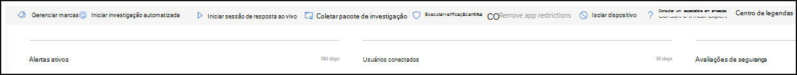
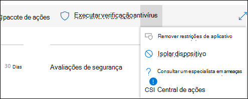
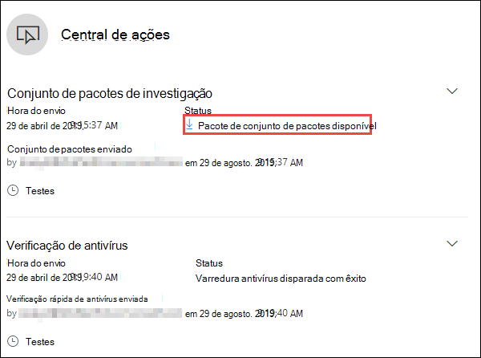
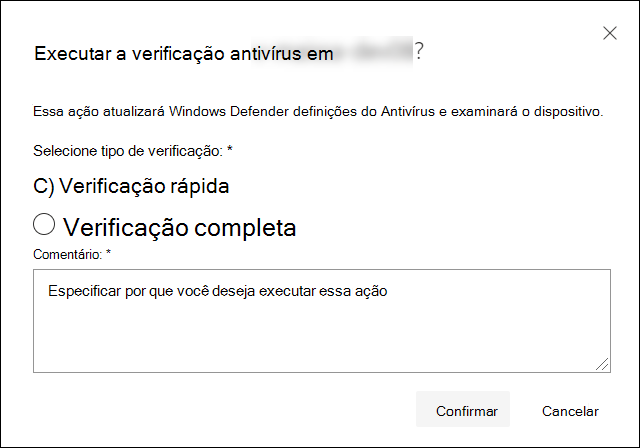
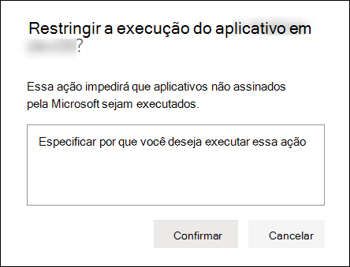
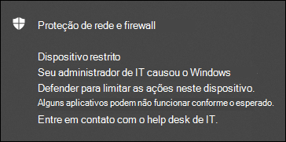
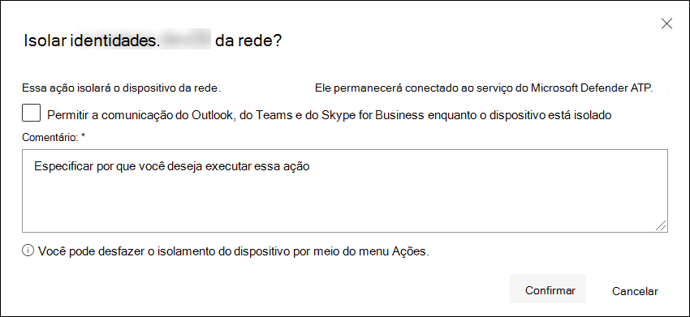
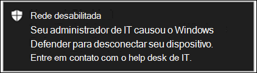
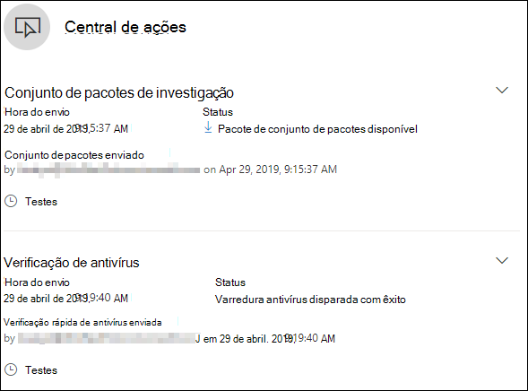

# Executar ações de resposta em um dispositivo

[!INCLUDE [Microsoft 365 Defender rebranding](../../includes/microsoft-defender.md)]

**Aplica-se a:**
- [Microsoft Defender para Ponto de Extremidade](https://go.microsoft.com/fwlink/?linkid=2154037)

>Deseja experimentar o Defender para Ponto de Extremidade? [Inscreva-se para uma avaliação gratuita.](https://www.microsoft.com/microsoft-365/windows/microsoft-defender-atp?ocid=docs-wdatp-respondmachine-abovefoldlink) 

Responda rapidamente a ataques detectados isolando dispositivos ou coletando um pacote de investigação. Depois de tomar medidas em dispositivos, você pode verificar os detalhes da atividade na Central de Ações.

As ações de resposta são executados ao longo da parte superior de uma página de dispositivo específica e incluem:

- Gerenciar marcas
- Iniciar investigação automatizada
- Iniciar sessão de resposta ao vivo
- Coletar pacote de investigação
- Executar verificação de antivírus
- Restringir execução de aplicativo
- Isolar dispositivo
- Consultar um especialista em ameaças
- Central de ações

 Você pode encontrar páginas de dispositivo de qualquer uma das seguintes exibições:

- **Painel de operações de segurança** - Selecione um nome de dispositivo no cartão de risco Devices.
- **Fila de alertas** - Selecione o nome do dispositivo ao lado do ícone do dispositivo na fila de alertas.
- **Lista de** dispositivos - Selecione o título do nome do dispositivo na lista de dispositivos.
- **Caixa de** pesquisa - Selecione Dispositivo no menu suspenso e insira o nome do dispositivo.

>[!IMPORTANT]
> - Essas ações de resposta só estão disponíveis para dispositivos no Windows 10, versão 1703 ou posterior. 
> - Para plataformas que não são do Windows, os recursos de resposta (como isolamento de dispositivo) dependem dos recursos de terceiros.

## Gerenciar marcas

Adicione ou gerencie marcas para criar uma afiliação de grupo lógica. As marcas de dispositivo dão suporte ao mapeamento correto da rede, permitindo que você anexe marcas diferentes para capturar contexto e habilitar a criação dinâmica de lista como parte de um incidente.

Para obter mais informações sobre a marcação de dispositivo, consulte [Create and manage device tags](machine-tags.md).

## Iniciar investigação automatizada

Você pode iniciar uma nova investigação automatizada de finalidade geral no dispositivo, se necessário. Enquanto uma investigação estiver em execução, qualquer outro alerta gerado a partir do dispositivo será adicionado a uma investigação automatizada em andamento até que essa investigação seja concluída. Além disso, se a mesma ameaça for vista em outros dispositivos, esses dispositivos serão adicionados à investigação.

Para obter mais informações sobre investigações automatizadas, consulte [Overview of Automated investigations](automated-investigations.md).

## Iniciar sessão de resposta ao vivo

A resposta ao vivo é um recurso que oferece acesso instantâneo a um dispositivo usando uma conexão de shell remoto. Isso dá a você o poder de fazer um trabalho de investigação aprofundado e tomar ações de resposta imediatas para conter prontamente ameaças identificadas — em tempo real.

A resposta ao vivo foi projetada para aprimorar investigações, permitindo que você colete dados forenses, execute scripts, envie entidades suspeitas para análise, correção de ameaças e busca proativamente por ameaças emergentes.

Para obter mais informações sobre a resposta ao vivo, consulte [Investigar entidades em dispositivos usando a resposta ao vivo](live-response.md).

## Coletar pacote de investigação de dispositivos

Como parte do processo de investigação ou resposta, você pode coletar um pacote de investigação de um dispositivo. Ao coletar o pacote de investigação, você pode identificar o estado atual do dispositivo e entender ainda mais as ferramentas e técnicas usadas pelo invasor.

Para baixar o pacote (arquivo Zip) e investigar os eventos que ocorreram em um dispositivo

1. Selecione **Coletar pacote de investigação** na linha de ações de resposta na parte superior da página do dispositivo.
2. Especifique na caixa de texto por que você deseja executar essa ação. Selecione **Confirmar**.
3. O arquivo zip será baixado

Maneira alternativa:

1. Selecione **Centro de ações** na seção ações de resposta da página do dispositivo.

    

3. No fly-out do Centro de Ações, selecione **Pacote de conjunto de pacotes disponível** para baixar o arquivo zip.
  
    

O pacote contém as seguintes pastas:

| Folder | Descrição |
|:---|:---------|
|Autoruns | Contém um conjunto de arquivos que representam o conteúdo do registro de um ponto de entrada de início automático conhecido (ASEP) para ajudar a identificar a persistência do invasor no dispositivo.    
<b>OBSERVAÇÃO:</b> Se a chave do Registro não for encontrada, o arquivo conterá a seguinte mensagem: "ERRO: o sistema não conseguiu encontrar a chave ou o valor especificado do Registro".
                                                                                                                                |
|Programas instalados | Isso . O arquivo CSV contém a lista de programas instalados que podem ajudar a identificar o que está instalado no momento no dispositivo. Para obter mais informações, [consulte Win32_Product classe](https://go.microsoft.com/fwlink/?linkid=841509).                                                                                  |
|Conexões de rede | Esta pasta contém um conjunto de pontos de dados relacionados às informações de conectividade que podem ajudar a identificar a conectividade com URLs suspeitas, a infraestrutura de comando e controle do invasor (C&C), qualquer movimento lateral ou conexões remotas.   - ActiveNetConnections.txt – Exibe estatísticas de protocolo e conexões de rede TCP/IP atuais. Fornece a capacidade de procurar conectividade suspeita feita por um processo.    - Arp.txt – Exibe as tabelas de cache do protocolo de resolução de endereço atual (ARP) para todas as interfaces.    O cache ARP pode revelar hosts adicionais em uma rede que foram comprometidos ou sistemas suspeitos na rede que podem ter sido usados para executar um ataque interno.   - DnsCache.txt - Exibe o conteúdo do cache de resolver cliente DNS, que inclui as entradas pré-carregados do arquivo Hosts local e quaisquer registros de recursos obtidos recentemente para consultas de nome resolvidas pelo computador. Isso pode ajudar a identificar conexões suspeitas.    - IpConfig.txt – Exibe a configuração TCP/IP completa para todos os adaptadores. Os adaptadores podem representar interfaces físicas, como adaptadores de rede instalados ou interfaces lógicas, como conexões discadas.    - FirewallExecutionLog.txt e pfirewall.log                                                                                  |
| Arquivos de pré-fetch| Os arquivos do Windows Prefetch foram projetados para acelerar o processo de inicialização do aplicativo. Ele pode ser usado para rastrear todos os arquivos usados recentemente no sistema e localizar rastreamentos para aplicativos que podem ter sido excluídos, mas ainda podem ser encontrados na lista de arquivos de pré-fé.    - Pasta Prefetch – Contém uma cópia dos arquivos de pré-fetch de `%SystemRoot%\Prefetch` . OBSERVAÇÃO: é sugerido baixar um visualizador de arquivo de pré-fé para exibir os arquivos de pré-fetch.    - PrefetchFilesList.txt – contém a lista de todos os arquivos copiados que podem ser usados para rastrear se houver falhas de cópia na pasta de pré-atendimento.                                                                                                      |
| Processos| Contém um . Arquivo CSV listando os processos em execução, que fornece a capacidade de identificar processos atuais em execução no dispositivo. Isso pode ser útil ao identificar um processo suspeito e seu estado.                                                                                                                                                                                                       |
| Tarefas agendadas| Contém um . Arquivo CSV listando as tarefas agendadas, que podem ser usadas para identificar rotinas executadas automaticamente em um dispositivo escolhido para procurar código suspeito que foi definido para ser executado automaticamente.                                                                                                                                                                                                      |
| Log de eventos de segurança| Contém o log de eventos de segurança, que contém registros de atividade de logon ou logout ou outros eventos relacionados à segurança especificados pela política de auditoria do sistema.   
<b>OBSERVAÇÃO:</b> Abra o arquivo de log de eventos usando o visualizador de eventos.
                                                                                    |
| Serviços| Contém um . Arquivo CSV que lista serviços e seus estados.                                                                                      |
| Sessões de Bloco de Mensagens do Windows Server (SMB) | Lista o acesso compartilhado a arquivos, impressoras e portas seriais e comunicações diversas entre nós em uma rede. Isso pode ajudar a identificar a exfiltração de dados ou o movimento lateral.    Contém arquivos para SMBInboundSessions e SMBOutboundSession.    
<b>OBSERVAÇÃO:</b> Se não houver sessões (entrada ou saída), você obterá um arquivo de texto que lhe dirá que não há sessões SMB encontradas.
                                                                                                                          |
| Informações do sistema| Contém um SystemInformation.txt que lista informações do sistema, como a versão do sistema operacional e cartões de rede.                                                                                     |
| Diretórios Temporários| Contém um conjunto de arquivos de texto que lista os arquivos localizados em %Temp% para cada usuário no sistema.    Isso pode ajudar a rastrear arquivos suspeitos que um invasor pode ter deixado cair no sistema.    
<b>OBSERVAÇÃO:</b> Se o arquivo contiver a seguinte mensagem: "O sistema não pode encontrar o caminho especificado", isso significa que não há diretório temporário para esse usuário e pode ser porque o usuário não fez logoff no sistema.
                                                                                                                                         |
| Usuários e grupos| Fornece uma lista de arquivos que cada um representa um grupo e seus membros.                                                                                                                   |
|WdSupportLogs| Fornece a MpCmdRunLog.txt e MPSupportFiles.cab     
<b>OBSERVAÇÃO:</b> Essa pasta só será criada no Windows 10, versão 1709 ou posterior com o acúmulo de atualizações de fevereiro de 2020 ou instalado mais recente:  Build 16299.1717 win10 1709 (RS3) : [KB4537816](https://support.microsoft.com/en-us/help/4537816/windows-10-update-kb4537816)   Build 17134.1345 win10 1803 (RS4) : [KB4537795](https://support.microsoft.com/en-us/help/4537795/windows-10-update-kb4537795)   Build 17763.1075 win10 1809 (RS5) : [KB4537818](https://support.microsoft.com/en-us/help/4537818/windows-10-update-kb4537818)   Win10 1903/1909 (19h1/19h2) Builds 18362.693 e 18363.693 : [KB4535996](https://support.microsoft.com/en-us/help/4535996/windows-10-update-kb4535996) 
                                                                                                                    |
| CollectionSummaryReport.xls| Este arquivo é um resumo da coleção de pacotes de investigação, ele contém a lista de pontos de dados, o comando usado para extrair os dados, o status de execução e o código de erro em caso de falha. Você pode usar esse relatório para rastrear se o pacote inclui todos os dados esperados e identificar se houve algum erro. |

## Executar a verificação do Microsoft Defender Antivírus em dispositivos

Como parte do processo de investigação ou resposta, você pode iniciar remotamente uma verificação antivírus para ajudar a identificar e correção de malware que pode estar presente em um dispositivo comprometido.

>[!IMPORTANT]
>- Essa ação está disponível para dispositivos no Windows 10, versão 1709 ou posterior.
>- Uma verificação do Microsoft Defender Antivírus (Microsoft Defender AV) pode ser executado juntamente com outras soluções antivírus, se o Microsoft Defender AV é a solução antivírus ativa ou não. O Microsoft Defender AV pode estar no modo Passivo. Para obter mais informações, consulte [compatibilidade do Microsoft Defender Antivírus](https://docs.microsoft.com/windows/security/threat-protection/microsoft-defender-antivirus/microsoft-defender-antivirus-compatibility.md).

Um que você selecionou **Executar** verificação antivírus , selecione o tipo de verificação que você gostaria de executar (rápido ou completo) e adicione um comentário antes de confirmar a verificação.

O Centro de Ações mostrará as informações de verificação e a linha do tempo do dispositivo incluirá um novo evento, refletindo que uma ação de verificação foi enviada no dispositivo. Os alertas do Microsoft Defender AV refletirão todas as detecções que surgiram durante a verificação.

>[!NOTE]
>Ao disparar uma verificação usando a ação de resposta do Defender for Endpoint, o valor do antivírus do Microsoft Defender 'ScanAvgCPULoadFactor' ainda se aplica e limita o impacto da CPU da verificação.  Se ScanAvgCPULoadFactor não estiver configurado, o valor padrão será um limite de 50% de carga máxima da CPU durante uma verificação. 
>Para obter mais informações, [consulte configure-advanced-scan-types-microsoft-defender-antivírus](https://docs.microsoft.com/windows/security/threat-protection/microsoft-defender-antivirus/configure-advanced-scan-types-microsoft-defender-antivirus).

## Restringir execução de aplicativo

Além de conter um ataque interrompendo processos mal-intencionados, você também pode bloquear um dispositivo e impedir a execução de tentativas subsequentes de programas potencialmente mal-intencionados.

>[!IMPORTANT]
> - Essa ação está disponível para dispositivos no Windows 10, versão 1709 ou posterior.
> - Esse recurso estará disponível se sua organização usar o Microsoft Defender Antivírus.
> - Essa ação precisa atender aos Windows Defender de integridade do código de controle de aplicativo e aos requisitos de assinatura. Para obter mais informações, consulte [Formatos de política de integridade de código e assinatura](https://docs.microsoft.com/windows/device-security/device-guard/requirements-and-deployment-planning-guidelines-for-device-guard#code-integrity-policy-formats-and-signing).

Para restringir a execução de um aplicativo, uma política de integridade de código é aplicada que só permite que arquivos sejam executados se eles são assinados por um certificado emitido pela Microsoft. Esse método de restrição pode ajudar a impedir que um invasor controle dispositivos comprometidos e a executar outras atividades mal-intencionadas.

>[!NOTE]
>Você poderá reverter a restrição de aplicativos em execução a qualquer momento. O botão na página do dispositivo mudará para dizer **Remover** restrições de aplicativo e, em seguida, você seguirá as mesmas etapas que restringir a execução do aplicativo.

Depois de selecionar **Restringir a execução do aplicativo** na página do dispositivo, digite um comentário e selecione **Confirmar**. O Centro de Ações mostrará as informações de verificação e a linha do tempo do dispositivo incluirá um novo evento.

**Notificação no usuário do dispositivo**: 
Quando um aplicativo é restrito, a seguinte notificação é exibida para informar ao usuário que um aplicativo está sendo impedido de executar:

## Isolar dispositivos da rede

Dependendo da gravidade do ataque e da sensibilidade do dispositivo, talvez você queira isolar o dispositivo da rede. Essa ação pode ajudar a impedir que o invasor controle o dispositivo comprometido e realizar outras atividades, como exfiltração de dados e movimento lateral.

>[!IMPORTANT]
>- O isolamento completo está disponível para dispositivos no Windows 10, versão 1703.
>- O isolamento seletivo está disponível para dispositivos no Windows 10, versão 1709 ou posterior.

Esse recurso de isolamento de dispositivo desconecta o dispositivo comprometido da rede enquanto mantém a conectividade com o serviço Defender para Ponto de Extremidade, que continua a monitorar o dispositivo.

No Windows 10, versão 1709 ou posterior, você terá controle adicional sobre o nível de isolamento de rede. Você também pode optar por habilitar a conectividade do Outlook, do Microsoft Teams e do Skype for Business (também conhecido como &quot;Isolamento Seletivo").

>[!NOTE]
>Você poderá reconectar o dispositivo à rede a qualquer momento. O botão na página do dispositivo mudará para dizer Liberar do **isolamento** e, em seguida, você seguirá as mesmas etapas que isolar o dispositivo.

Depois de selecionar **Isolar dispositivo** na página do dispositivo, digite um comentário e selecione **Confirmar**. O Centro de Ações mostrará as informações de verificação e a linha do tempo do dispositivo incluirá um novo evento.

>[!NOTE]
>O dispositivo permanecerá conectado ao serviço Defender para Ponto de Extremidade, mesmo que esteja isolado da rede. Se você optou por habilitar a comunicação do Outlook e do Skype for Business, poderá se comunicar com o usuário enquanto o dispositivo está isolado.

**Notificação no usuário do dispositivo**: 
Quando um dispositivo está sendo isolado, a seguinte notificação é exibida para informar ao usuário que o dispositivo está sendo isolado da rede:

## Consultar um especialista em ameaças

Você pode consultar um especialista em ameaças da Microsoft para obter mais informações sobre um dispositivo potencialmente comprometido ou já comprometido. Os Especialistas em Ameaças da Microsoft podem ser contratados diretamente de dentro do Centro de Segurança do Microsoft Defender para uma resposta o tempo e precisão. Os especialistas fornecem informações não apenas sobre um dispositivo potencialmente comprometido, mas também para entender melhor as ameaças complexas, as notificações de ataque direcionadas que você recebe ou se você precisar de mais informações sobre os alertas ou um contexto de inteligência contra ameaças que você vê no painel do portal.

Consulte [Consult a Microsoft Threat Expert](https://docs.microsoft.com/microsoft-365/security/defender-endpoint/configure-microsoft-threat-experts#consult-a-microsoft-threat-expert-about-suspicious-cybersecurity-activities-in-your-organization) para obter detalhes.

## Verificar detalhes de atividade na Central de ações

A **Central de Ações** fornece informações sobre ações que foram realizadas em um dispositivo ou arquivo. Você poderá exibir os seguintes detalhes:

- Conjunto de pacotes de investigação
- Verificação de antivírus
- Restrição de aplicativo
- Isolamento de dispositivo

Todos os outros detalhes relacionados também são mostrados, por exemplo, data/hora do envio, envio do usuário e se a ação foi bem-sucedida ou falhou.

## Tópicos relacionados
- [Executar ações de resposta em um arquivo](respond-file-alerts.md)
- [Imprecisão de relatório](https://docs.microsoft.com/microsoft-365/security/defender-endpoint/tvm-security-recommendation#report-inaccuracy)
