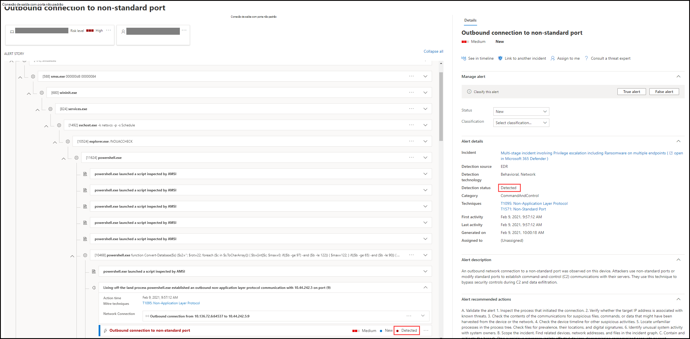

# Revisar alertas no Microsoft Defender para Ponto de ExtremidadeReview alerts in Microsoft Defender for Endpoint

[!INCLUDE [Microsoft 365 Defender rebranding](../../includes/microsoft-defender.md)]

**Aplica-se a:****Applies to:**
- [Microsoft Defender para Ponto de ExtremidadeMicrosoft Defender for Endpoint](https://go.microsoft.com/fwlink/?linkid=2154037)

>Deseja experimentar o Defender para Ponto de Extremidade?Want to experience Defender for Endpoint? [Inscreva-se para uma avaliação gratuita.Sign up for a free trial.](https://www.microsoft.com/microsoft-365/windows/microsoft-defender-atp?ocid=docs-wdatp-managealerts-abovefoldlink)

A página de alerta no Microsoft Defender para Ponto de Extremidade fornece contexto completo ao alerta, combinando sinais de ataque e alertas relacionados ao alerta selecionado, para construir um histórico de alerta detalhado.The alert page in Microsoft Defender for Endpoint provides full context to the alert, by combining attack signals and alerts related to the selected alert, to construct a detailed alert story.

Triagem rápida, investigação e tomar medidas eficazes em alertas que afetam sua organização.Quickly triage, investigate, and take effective action on alerts that affect your organization. Entenda por que eles foram disparados e seu impacto de um local.Understand why they were triggered, and their impact from one location. Saiba mais nesta visão geral.Learn more in this overview.

> [!VIDEO https://www.microsoft.com/videoplayer/embed/RE4yiO5]

## Como começar com um alertaGetting started with an alert

Selecionar o nome de um alerta no Defender para Ponto de Extremidade o fará parar em sua página de alerta.Selecting an alert's name in Defender for Endpoint will land you on its alert page. Na página de alerta, todas as informações serão mostradas no contexto do alerta selecionado.On the alert page, all the information will be shown in context of the selected alert. Cada página de alerta consiste em 4 seções:Each alert page consists of 4 sections:

1. **O título do alerta** mostra o nome do alerta e está lá para lembrar qual alerta iniciou sua investigação atual, independentemente do que você selecionou na página.**The alert title** shows the alert's name and is there to remind you which alert started your current investigation regardless of what you have selected on the page.
2. [**Os ativos**](#review-affected-assets) afetados listam cartões de dispositivos e usuários afetados por esse alerta que podem ser clicados para obter mais informações e ações.[**Affected assets**](#review-affected-assets) lists cards of devices and users affected by this alert that are clickable for further information and actions.
3. O **artigo de alerta** exibe todas as entidades relacionadas ao alerta, interconectadas por uma exibição em árvore.The **alert story** displays all entities related to the alert, interconnected by a tree view. O alerta no título será aquele em foco quando você chegar pela primeira vez na página do alerta selecionado.The alert in the title will be the one in focus when you first land on your selected alert's page. As entidades no histórico de alerta são expansíveis e clicáveis, para fornecer informações adicionais e acelerar a resposta, permitindo que você tome ações diretamente no contexto da página de alerta.Entities in the alert story are expandable and clickable, to provide additional information and expedite response by allowing you to take actions right in the context of the alert page. Use o artigo de alerta para iniciar sua investigação.Use the alert story to start your investigation. Saiba como em [Investigar alertas no Microsoft Defender para Ponto de Extremidade](https://docs.microsoft.com/microsoft-365/security/defender-endpoint/investigate-alerts).Learn how in [Investigate alerts in Microsoft Defender for Endpoint](https://docs.microsoft.com/microsoft-365/security/defender-endpoint/investigate-alerts).
4. O **painel de detalhes** mostrará os detalhes do alerta selecionado no início, com detalhes e ações relacionadas a esse alerta.The **details pane** will show the details of the selected alert at first, with details and actions related to this alert. Se você selecionar qualquer um dos ativos ou entidades afetados no histórico de alertas, o painel de detalhes mudará para fornecer informações contextuais e ações para o objeto selecionado.If you select any of the affected assets or entities in the alert story, the details pane will change to provide contextual information and actions for the selected object.

Observe o status de detecção do alerta.Note the detection status for your alert. 
- Impedido – A tentativa de ação suspeita foi evitada.Prevented – The attempted suspicious action was avoided. Por exemplo, um arquivo não foi gravado em disco ou executado.For example, a file either wasn’t written to disk or executed.

- Bloqueado – Comportamento suspeito foi executado e bloqueado.Blocked – Suspicious behavior was executed and then blocked. Por exemplo, um processo foi executado, mas como ele exibiu comportamentos suspeitos posteriormente, o processo foi encerrado.For example, a process was executed but because it subsequently exhibited suspicious behaviors, the process was terminated.

- Detectado – um ataque foi detectado e possivelmente ainda está ativo.Detected – An attack was detected and is possibly still active.

Em seguida, você  também pode revisar os detalhes de investigação automatizados no painel de detalhes do seu alerta, para ver quais ações já foram tomadas, bem como ler a descrição do alerta para ações recomendadas.You can then also review the *automated investigation details* in your alert's details pane, to see which actions were already taken, as well as reading the alert's description for recommended actions.

Outras informações disponíveis no painel de detalhes quando o alerta é aberto incluem técnicas MITRE, origem e detalhes contextuais adicionais.Other information available in the details pane when the alert opens includes MITRE techniques, source, and additional contextual details.

## Revisar ativos afetadosReview affected assets

Selecionar um dispositivo ou um cartão de usuário nas seções de ativos afetados alterna para os detalhes do dispositivo ou do usuário no painel de detalhes.Selecting a device or a user card in the affected assets sections will switch to the details of the device or user in the details pane.

- **Para dispositivos,** o painel de detalhes exibirá informações sobre o próprio dispositivo, como Domínio, Sistema Operacional e IP.**For devices**, the details pane will display information about the device itself, like Domain, Operating System, and IP. Alertas ativos e os usuários conectados nesse dispositivo também estão disponíveis.Active alerts and the logged on users on that device are also available. Você pode executar uma ação imediata isolando o dispositivo, restringindo a execução do aplicativo ou executando uma verificação antivírus.You can take immediate action by isolating the device, restricting app execution, or running an antivirus scan. Como alternativa, você pode coletar um pacote de investigação, iniciar uma investigação automatizada ou ir até a página do dispositivo para investigar do ponto de vista do dispositivo.Alternatively, you could collect an investigation package, initiate an automated investigation, or go to the device page to investigate from the device's point of view.

   

- Para **usuários,** o painel de detalhes exibirá informações detalhadas do usuário, como o nome SAM e SID do usuário, bem como os tipos de logon executados por esse usuário e quaisquer alertas e incidentes relacionados a ele.**For users**, the details pane will display detailed user information, such as the user's SAM name and SID, as well as logon types performed by this user and any alerts and incidents related to it. Você pode selecionar *Abrir página do usuário* para continuar a investigação do ponto de vista desse usuário.You can select *Open user page* to continue the investigation from that user's point of view.

   

## Tópicos relacionadosRelated topics

- [Exibir e organizar a fila de incidentesView and organize the incidents queue](view-incidents-queue.md)
- [Investigar incidentesInvestigate incidents](investigate-incidents.md)
- [Gerenciar incidentesManage incidents](manage-incidents.md)
