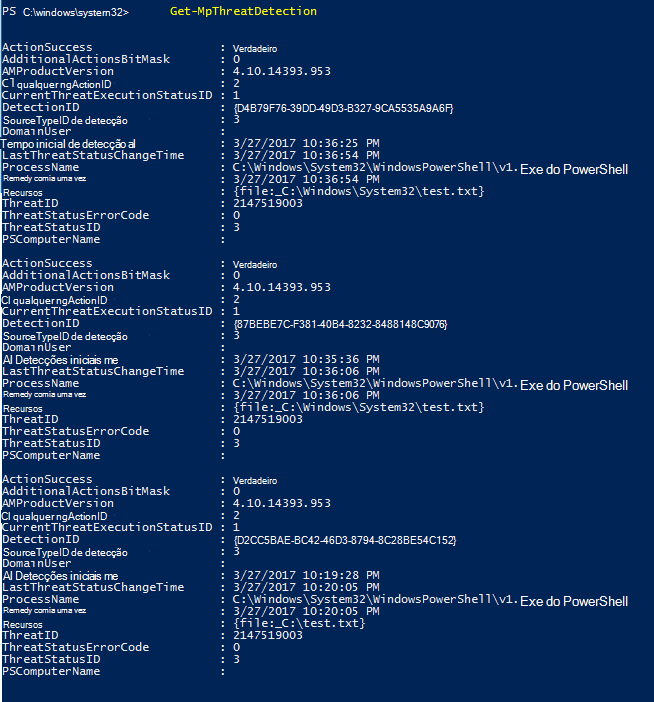
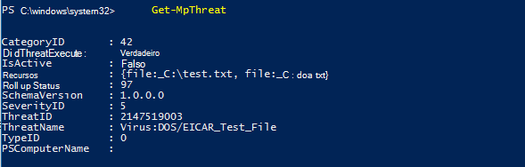

# <a name="review-microsoft-defender-antivirus-scan-results"></a>Examinar os resultados da verificação do Microsoft Defender Antivírus

[!INCLUDE [Microsoft 365 Defender rebranding](../../includes/microsoft-defender.md)]


**Aplica-se a:**

- [Microsoft Defender para Ponto de Extremidade](/microsoft-365/security/defender-endpoint/)

Depois que uma verificação do Microsoft Defender [](run-scan-microsoft-defender-antivirus.md) Antivírus for concluída, se for uma verificação sob demanda ou [agendada,](scheduled-catch-up-scans-microsoft-defender-antivirus.md)os resultados serão gravados e você poderá exibir os resultados. 


## <a name="use-configuration-manager-to-review-scan-results"></a>Usar o Configuration Manager para revisar os resultados da verificação

Consulte [Como monitorar o status da Proteção de Ponto de Extremidade](/configmgr/protect/deploy-use/monitor-endpoint-protection).

## <a name="use-powershell-cmdlets-to-review-scan-results"></a>Usar cmdlets do PowerShell para revisar os resultados da verificação

O cmdlet a seguir retornará cada detecção no ponto de extremidade. Se houver várias detecções da mesma ameaça, cada detecção será listada separadamente, com base no tempo de cada detecção:

```PowerShell
Get-MpThreatDetection
```



Você pode especificar `-ThreatID` para limitar a saída para mostrar apenas as detecções de uma ameaça específica.

Se você quiser listar detecções de ameaças, mas combinar detecções da mesma ameaça em um único item, você pode usar o seguinte cmdlet:

```PowerShell
Get-MpThreat
```



Consulte [Usar cmdlets](use-powershell-cmdlets-microsoft-defender-antivirus.md) do PowerShell para configurar e executar [cmdlets](/powershell/module/defender/) do Microsoft Defender Antivírus e do Defender para obter mais informações sobre como usar o PowerShell com o Microsoft Defender Antivírus.

## <a name="use-windows-management-instruction-wmi-to-review-scan-results"></a>Usar a Instrução de Gerenciamento do Windows (WMI) para revisar os resultados da verificação

Use o [ **método Get** das **classes MSFT_MpThreat** e **MSFT_MpThreatDetection.**](/previous-versions/windows/desktop/defender/windows-defender-wmiv2-apis-portal)


## <a name="related-articles"></a>Artigos relacionados

- [Personalizar, iniciar e revisar os resultados das verificações e correção do Microsoft Defender Antivírus](customize-run-review-remediate-scans-microsoft-defender-antivirus.md)
- [Microsoft Defender Antivírus no Windows 10](microsoft-defender-antivirus-in-windows-10.md)